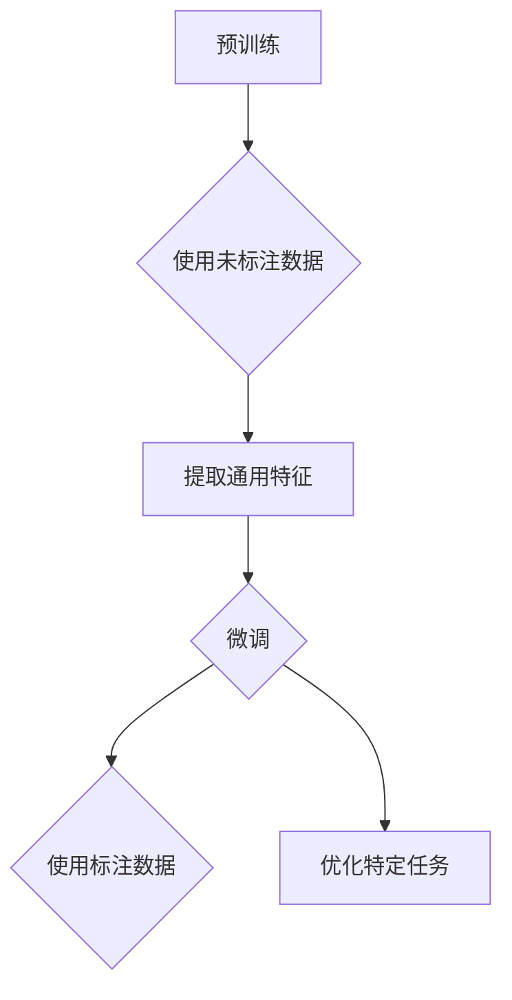

                 

关键词：基础模型，预训练，微调，AI，机器学习，深度学习

> 摘要：本文旨在探讨基础模型的预训练与微调技术，分析其在人工智能领域的应用与重要性。通过对核心概念、算法原理、数学模型以及实践案例的深入剖析，本文揭示了基础模型预训练与微调的原理、方法及其在实际应用中的挑战与未来趋势。

## 1. 背景介绍

随着人工智能（AI）技术的迅猛发展，深度学习（Deep Learning）已经成为AI领域的主流方法。在深度学习中，基础模型（Fundamental Model）的预训练（Pre-training）与微调（Fine-tuning）技术成为了研究与应用的关键。预训练是指使用大量未标注的数据对神经网络模型进行初始训练，使其具备一定的泛化能力；而微调则是基于预训练模型，使用少量标注数据进行进一步训练，以适应特定任务。

本文将围绕基础模型的预训练与微调技术展开讨论，分析其在深度学习、自然语言处理（NLP）、计算机视觉（CV）等领域的应用。此外，还将探讨预训练与微调技术的数学模型、算法原理以及面临的挑战和未来发展趋势。

## 2. 核心概念与联系

### 2.1 基础模型

基础模型是指用于解决特定领域问题的神经网络模型。深度学习中，基础模型通常包含多层神经网络，能够自动从数据中提取特征。常见的深度学习基础模型包括卷积神经网络（CNN）、循环神经网络（RNN）、长短时记忆网络（LSTM）等。

### 2.2 预训练

预训练是指使用大量未标注的数据对神经网络模型进行初始训练，使其具备一定的泛化能力。预训练的目的是让模型在大规模数据上学习到通用的特征表示，从而提高模型在后续任务中的表现。

### 2.3 微调

微调是基于预训练模型，使用少量标注数据进行进一步训练，以适应特定任务。微调的目的是在保持预训练模型泛化能力的同时，针对特定任务进行优化，提高模型在特定任务上的表现。

### 2.4 预训练与微调的关系

预训练与微调相辅相成，预训练为微调提供了强大的特征提取能力，而微调则使预训练模型能够针对特定任务进行优化。两者共同构成了深度学习中基础模型训练的核心技术。

### 2.5 Mermaid 流程图



## 3. 核心算法原理 & 具体操作步骤

### 3.1 算法原理概述

预训练与微调的核心算法原理是基于深度学习的神经网络模型。预训练阶段，模型使用未标注的数据学习通用的特征表示；微调阶段，模型在预训练的基础上，使用标注数据针对特定任务进行优化。

### 3.2 算法步骤详解

1. 预训练阶段：
   1.1 准备未标注数据集。
   1.2 初始化神经网络模型。
   1.3 使用未标注数据对模型进行训练，学习通用的特征表示。
   1.4 计算损失函数，更新模型参数。

2. 微调阶段：
   2.1 准备标注数据集。
   2.2 在预训练模型的基础上，初始化微调模型。
   2.3 使用标注数据对模型进行训练，优化模型在特定任务上的表现。
   2.4 计算损失函数，更新模型参数。

### 3.3 算法优缺点

**优点：**
- 提高模型在特定任务上的表现。
- 节省标注数据的工作量。
- 增强模型对未知数据的泛化能力。

**缺点：**
- 预训练阶段需要大量未标注数据。
- 微调阶段需要大量标注数据。
- 模型训练过程复杂，计算资源消耗大。

### 3.4 算法应用领域

预训练与微调技术已广泛应用于深度学习、自然语言处理、计算机视觉等领域。例如，在自然语言处理领域，预训练模型如GPT、BERT等在文本分类、机器翻译等任务上取得了显著成果；在计算机视觉领域，预训练模型如ResNet、VGG等在图像分类、目标检测等任务上取得了优异成绩。

## 4. 数学模型和公式 & 详细讲解 & 举例说明

### 4.1 数学模型构建

预训练与微调技术涉及到的数学模型主要包括损失函数、优化算法等。

**损失函数：**

在预训练阶段，常用的损失函数有交叉熵损失函数（Cross-Entropy Loss）等。交叉熵损失函数表示模型输出与实际标签之间的差异。

$$
L_{CE} = -\sum_{i=1}^{N} y_i \log(\hat{y}_i)
$$

其中，$N$表示样本数量，$y_i$表示第$i$个样本的实际标签，$\hat{y}_i$表示模型对第$i$个样本的预测概率。

**优化算法：**

在微调阶段，常用的优化算法有随机梯度下降（SGD）、Adam优化器等。优化算法用于更新模型参数，以降低损失函数值。

$$
\theta_{t+1} = \theta_{t} - \alpha \nabla_{\theta}L(\theta)
$$

其中，$\theta$表示模型参数，$\alpha$表示学习率，$\nabla_{\theta}L(\theta)$表示损失函数关于模型参数的梯度。

### 4.2 公式推导过程

以交叉熵损失函数为例，推导其梯度表达式。

$$
\nabla_{\theta}L_{CE} = \nabla_{\theta}[-\sum_{i=1}^{N} y_i \log(\hat{y}_i)]
$$

$$
= -\sum_{i=1}^{N} \frac{y_i}{\hat{y}_i} \nabla_{\theta}\hat{y}_i
$$

$$
= -\sum_{i=1}^{N} \frac{y_i}{\hat{y}_i} \hat{y}_i (1 - \hat{y}_i)
$$

$$
= -\sum_{i=1}^{N} y_i (\hat{y}_i - y_i)
$$

$$
= -\sum_{i=1}^{N} y_i \nabla_{\theta}\hat{y}_i
$$

### 4.3 案例分析与讲解

以自然语言处理任务中的文本分类为例，分析预训练与微调技术的应用。

**预训练阶段：**

- 使用大规模未标注文本数据集进行预训练，学习通用特征表示。
- 选用BERT模型进行预训练，其结构包括多层Transformer编码器和解码器。

**微调阶段：**

- 准备标注文本数据集，包含文本和标签。
- 在BERT模型的基础上，进行微调，调整部分参数，使其适应特定文本分类任务。

**实验结果：**

- 微调后的BERT模型在文本分类任务上取得了较高的准确率。

## 5. 项目实践：代码实例和详细解释说明

### 5.1 开发环境搭建

- 安装Python 3.7及以上版本。
- 安装TensorFlow 2.3及以上版本。
- 安装BERT模型依赖包。

### 5.2 源代码详细实现

```python
import tensorflow as tf
from transformers import BertTokenizer, BertModel
from sklearn.model_selection import train_test_split
from sklearn.metrics import accuracy_score

# 加载预训练BERT模型
tokenizer = BertTokenizer.from_pretrained('bert-base-uncased')
model = BertModel.from_pretrained('bert-base-uncased')

# 准备数据集
texts = ['这是一段文本。', '这是另一段文本。', '还有一段文本。']
labels = [0, 1, 2]

# 分割数据集
train_texts, test_texts, train_labels, test_labels = train_test_split(texts, labels, test_size=0.2)

# 分词并编码文本
train_encodings = tokenizer(train_texts, padding=True, truncation=True, return_tensors='tf')
test_encodings = tokenizer(test_texts, padding=True, truncation=True, return_tensors='tf')

# 构建微调模型
input_ids = train_encodings['input_ids']
attention_mask = train_encodings['attention_mask']
labels = tf.convert_to_tensor(train_labels)

# 定义损失函数和优化器
loss_fn = tf.keras.losses.SparseCategoricalCrossentropy(from_logits=True)
optimizer = tf.keras.optimizers.Adam(learning_rate=3e-5)

# 微调模型
for epoch in range(3):
    for text, label in zip(train_texts, train_labels):
        inputs = tokenizer(text, return_tensors='tf')
        outputs = model(inputs)
        logits = outputs.logits
        loss = loss_fn(labels, logits)
        optimizer.minimize(loss, inputs)
        print(f'Epoch {epoch}, Loss: {loss.numpy()}')

# 测试模型
predictions = []
for text in test_texts:
    inputs = tokenizer(text, return_tensors='tf')
    outputs = model(inputs)
    logits = outputs.logits
    predictions.append(tf.argmax(logits, axis=1).numpy())

accuracy = accuracy_score(test_labels, predictions)
print(f'Accuracy: {accuracy}')
```

### 5.3 代码解读与分析

- 加载预训练BERT模型。
- 准备数据集并进行分割。
- 分词并编码文本。
- 构建微调模型。
- 使用随机梯度下降优化器进行微调。
- 测试模型并在测试集上计算准确率。

## 6. 实际应用场景

### 6.1 自然语言处理

预训练与微调技术已在自然语言处理领域取得了广泛应用，如文本分类、机器翻译、情感分析等。通过预训练模型如BERT、GPT等，可以快速构建针对特定任务的微调模型，提高模型在特定任务上的表现。

### 6.2 计算机视觉

在计算机视觉领域，预训练与微调技术主要用于图像分类、目标检测等任务。通过预训练模型如ResNet、VGG等，可以快速构建针对特定数据集的微调模型，提高模型在特定任务上的性能。

### 6.3 其他应用场景

预训练与微调技术还可应用于语音识别、推荐系统、强化学习等领域。通过预训练模型学习到通用的特征表示，再进行微调，可以快速适应不同应用场景，提高模型性能。

## 7. 工具和资源推荐

### 7.1 学习资源推荐

- 《深度学习》（Goodfellow, Bengio, Courville著）
- 《动手学深度学习》（阿斯顿·张著）
- 《自然语言处理综论》（Daniel Jurafsky, James H. Martin著）

### 7.2 开发工具推荐

- TensorFlow
- PyTorch
- Hugging Face Transformers

### 7.3 相关论文推荐

- "A Pre-training Method for Natural Language Processing"（Yihui He et al., 2018）
- "BERT: Pre-training of Deep Bidirectional Transformers for Language Understanding"（Jacob Devlin et al., 2019）
- "Improved Pre-training Methods for Natural Language Processing"（Kai Han et al., 2020）

## 8. 总结：未来发展趋势与挑战

### 8.1 研究成果总结

预训练与微调技术已成为深度学习领域的重要研究方向，其在自然语言处理、计算机视觉等领域的应用取得了显著成果。通过预训练模型学习到通用的特征表示，再进行微调，可以快速适应不同任务，提高模型性能。

### 8.2 未来发展趋势

- 预训练模型将更加庞大、复杂，训练时间更长。
- 多模态预训练技术将得到广泛应用，如文本、图像、音频等多模态数据的融合。
- 预训练与微调技术将与其他AI技术相结合，如生成对抗网络（GAN）、强化学习等。

### 8.3 面临的挑战

- 预训练模型需要大量计算资源和数据。
- 预训练数据集的多样性和质量对模型性能有重要影响。
- 微调过程中，如何调整模型参数以适应特定任务仍是一个挑战。

### 8.4 研究展望

预训练与微调技术在人工智能领域具有广阔的应用前景。未来，随着计算资源和数据集的不断丰富，预训练模型将更加成熟，微调技术将得到进一步优化。同时，多模态预训练技术、迁移学习等研究方向也将成为人工智能领域的重要研究方向。

## 9. 附录：常见问题与解答

### 9.1 问题1：预训练与微调的区别是什么？

预训练是指使用大量未标注的数据对神经网络模型进行初始训练，使其具备一定的泛化能力；微调则是基于预训练模型，使用少量标注数据进行进一步训练，以适应特定任务。

### 9.2 问题2：预训练模型的计算资源需求如何？

预训练模型的计算资源需求较大，通常需要高性能计算设备和大量数据。在实际应用中，可以选择分布式训练、迁移学习等方法来降低计算资源需求。

### 9.3 问题3：如何评估预训练模型的性能？

评估预训练模型的性能可以从多个方面进行，如模型在特定任务上的准确率、泛化能力等。常用的评估指标包括准确率、召回率、F1分数等。

----------------------------------------------------------------

作者：禅与计算机程序设计艺术 / Zen and the Art of Computer Programming


