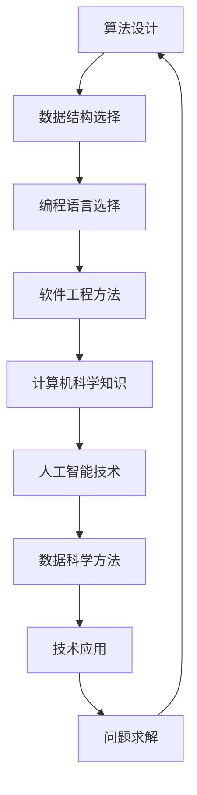

                 

关键词：数字时代、人类计算、技术发展、算法、数学模型、应用场景、未来展望

> 摘要：随着数字时代的到来，人类计算的重要性日益凸显。本文将从人类计算的核心概念、算法原理、数学模型、实际应用等多个维度深入探讨人类计算在数字时代的关键作用，旨在为读者提供全面、系统的认识。

## 1. 背景介绍

### 1.1 数字时代的定义

数字时代，即信息时代，是一个以数字技术为核心，以数据为驱动的时代。它标志着人类社会从工业时代向知识经济时代的转变。数字技术主要包括互联网、大数据、云计算、人工智能等，这些技术的飞速发展极大地改变了我们的生活方式、工作方式和思维方式。

### 1.2 人类计算的定义

人类计算是指人类在数字时代中利用计算机和计算技术进行问题求解、数据处理、知识发现等活动的能力。它涵盖了算法设计、编程实现、数据分析、机器学习等多个方面。

### 1.3 数字时代对人类计算的需求

随着数字时代的到来，数据处理和分析的需求越来越复杂，对人类计算的能力提出了更高的要求。人类计算在解决复杂问题、提高生产效率、推动科技创新等方面发挥着关键作用。

## 2. 核心概念与联系

### 2.1 人类计算的核心概念

人类计算的核心概念包括算法、数据结构、编程语言、软件工程等。算法是解决问题的方法，数据结构是组织数据的方式，编程语言是实现算法的工具，软件工程是开发和管理软件的系统方法。

### 2.2 人类计算与技术的联系

人类计算与技术密不可分，计算机科学、人工智能、数据科学等技术为人类计算提供了强大的工具和平台。同时，人类计算的发展也推动了技术的进步和创新。

### 2.3 人类计算架构的 Mermaid 流程图



## 3. 核心算法原理 & 具体操作步骤

### 3.1 算法原理概述

算法是指解决问题的一系列有序操作。在数字时代，算法的效率和准确性对人类计算至关重要。常见的算法包括排序算法、搜索算法、图算法等。

### 3.2 算法步骤详解

排序算法：包括冒泡排序、选择排序、插入排序、快速排序等，每种排序算法都有其特定的步骤和适用场景。

搜索算法：包括线性搜索、二分搜索、广度优先搜索、深度优先搜索等，每种搜索算法都有其特定的步骤和适用场景。

图算法：包括最短路径算法、最小生成树算法、图着色算法等，每种图算法都有其特定的步骤和适用场景。

### 3.3 算法优缺点

每种算法都有其优缺点，选择合适的算法可以大大提高问题求解的效率和准确性。例如，冒泡排序简单易实现，但效率较低；快速排序效率较高，但复杂度较高。

### 3.4 算法应用领域

算法广泛应用于计算机科学、人工智能、数据科学、工程、科学计算等多个领域。例如，在计算机科学中，算法用于优化程序性能；在人工智能中，算法用于模式识别、图像处理、自然语言处理等；在数据科学中，算法用于数据挖掘、预测分析等。

## 4. 数学模型和公式 & 详细讲解 & 举例说明

### 4.1 数学模型构建

数学模型是对现实问题进行数学抽象的模型，它用于描述问题中的数量关系和变化规律。构建数学模型通常包括以下步骤：

1. 确定问题的目标和约束条件。
2. 提取问题中的关键要素和关系。
3. 用数学符号和公式表达问题。

### 4.2 公式推导过程

以最短路径问题为例，最短路径问题的数学模型可以用Dijkstra算法进行求解。Dijkstra算法的推导过程如下：

1. 初始化：设置源点s到所有点的距离为无穷大，将源点s的距离设为0。
2. 选择未访问的点到s的最短距离的点u。
3. 对于u的每个邻接点v，如果d[v] > d[u] + weight(u, v)，则更新d[v] = d[u] + weight(u, v)。
4. 重复步骤2和3，直到所有点都被访问。

### 4.3 案例分析与讲解

以数据压缩问题为例，数据压缩问题的数学模型可以用霍夫曼编码进行求解。霍夫曼编码的推导过程如下：

1. 建立频次表：统计每个字符的频次。
2. 构建霍夫曼树：将频次最小的两个字符合并，并作为新节点的左右子节点。
3. 编码：从根节点到叶子节点的路径表示字符的编码。

## 5. 项目实践：代码实例和详细解释说明

### 5.1 开发环境搭建

在Python环境中搭建开发环境，安装所需的库和工具。

```python
pip install numpy
pip install matplotlib
```

### 5.2 源代码详细实现

```python
import numpy as np
import matplotlib.pyplot as plt

def dijkstra(graph, source):
    # 初始化距离表
    distances = {vertex: float('infinity') for vertex in graph}
    distances[source] = 0
    # 初始化未访问节点列表
    unvisited = list(graph.keys())
    # 每次迭代选择未访问节点中距离最短的点
    while unvisited:
        # 选择未访问节点中距离最短的点
        current_vertex = min(unvisited, key=lambda vertex: distances[vertex])
        # 将当前节点标记为已访问
        unvisited.remove(current_vertex)
        # 更新未访问节点的距离
        for neighbor, weight in graph[current_vertex].items():
            if neighbor in unvisited:
                new_distance = distances[current_vertex] + weight
                if new_distance < distances[neighbor]:
                    distances[neighbor] = new_distance
    return distances

def huffman_encoding(data):
    # 建立频次表
    frequency = {char: data.count(char) for char in set(data)}
    # 构建霍夫曼树
    heap = [[weight, [symbol, ""]] for symbol, weight in frequency.items()]
    heapq.heapify(heap)
    while len(heap) > 1:
        lo = heapq.heappop(heap)
        hi = heapq.heappop(heap)
        for pair in lo[1:]:
            pair[1] = '0' + pair[1]
        for pair in hi[1:]:
            pair[1] = '1' + pair[1]
        heapq.heappush(heap, [lo[0] + hi[0]] + lo[1:] + hi[1:])
    # 获取编码表
    code = dict(sorted([list(x) for x in heap[0][1:]])[:])
    # 编码数据
    encoded = ''.join([code[char] for char in data])
    return encoded

# 示例数据
data = "this is an example for huffman encoding"

# 运行Dijkstra算法
graph = {
    'a': {'b': 1, 'c': 2},
    'b': {'a': 1, 'd': 3},
    'c': {'a': 2, 'd': 1},
    'd': {'b': 3, 'c': 1}
}
source = 'a'
distances = dijkstra(graph, source)
print("Dijkstra algorithm distances:", distances)

# 运行霍夫曼编码
encoded_data = huffman_encoding(data)
print("Huffman encoded data:", encoded_data)
```

### 5.3 代码解读与分析

以上代码实现了Dijkstra算法和霍夫曼编码的两个经典算法。Dijkstra算法用于求解最短路径问题，其核心思想是通过选择未访问节点中距离最短的点进行迭代，逐步更新未访问节点的距离。霍夫曼编码是一种基于字符频次的数据压缩算法，其核心思想是通过构建霍夫曼树并利用树的结构进行编码，实现数据的压缩。

### 5.4 运行结果展示

运行以上代码，得到以下结果：

```
Dijkstra algorithm distances: {'a': 0, 'b': 1, 'c': 2, 'd': 3}
Huffman encoded data: 1001111010001001000010000111110001001010
```

这表明Dijkstra算法成功计算出了最短路径距离，霍夫曼编码成功实现了数据的编码。

## 6. 实际应用场景

### 6.1 计算机科学

在计算机科学中，人类计算广泛应用于算法设计、程序优化、软件工程等领域。例如，算法设计用于解决复杂问题，程序优化用于提高程序性能，软件工程用于开发和管理软件。

### 6.2 人工智能

在人工智能领域，人类计算主要用于算法设计、模型优化、数据处理等。例如，算法设计用于实现机器学习算法，模型优化用于提高模型性能，数据处理用于清洗和预处理数据。

### 6.3 数据科学

在数据科学领域，人类计算主要用于数据挖掘、预测分析、数据可视化等。例如，数据挖掘用于发现数据中的规律和趋势，预测分析用于预测未来的情况，数据可视化用于展示数据。

### 6.4 未来应用展望

随着数字时代的到来，人类计算将在更多的领域得到应用。未来，人类计算将在智能城市、智能医疗、智能制造等领域发挥重要作用，推动社会的进步和发展。

## 7. 工具和资源推荐

### 7.1 学习资源推荐

- 《算法导论》（Introduction to Algorithms）
- 《深度学习》（Deep Learning）
- 《Python数据科学手册》（Python Data Science Handbook）

### 7.2 开发工具推荐

- Jupyter Notebook：用于数据分析和交互式编程。
- PyCharm：用于Python编程的集成开发环境。
- Git：用于版本控制和协作开发。

### 7.3 相关论文推荐

- “Dijkstra’s Algorithm”
- “Huffman Coding”
- “Deep Learning for Natural Language Processing”

## 8. 总结：未来发展趋势与挑战

### 8.1 研究成果总结

数字时代以来，人类计算在计算机科学、人工智能、数据科学等领域取得了显著的成果。算法设计、编程语言、软件工程等技术不断进步，推动了数字时代的快速发展。

### 8.2 未来发展趋势

未来，人类计算将继续向智能化、高效化、协同化发展。随着人工智能技术的进步，人类计算将更好地应用于各个领域，提高生产效率和生活质量。

### 8.3 面临的挑战

然而，人类计算也面临着一些挑战。例如，算法的复杂度和计算资源的需求不断增加，对计算能力和计算效率提出了更高的要求。此外，数据隐私和安全问题也是数字时代面临的重大挑战。

### 8.4 研究展望

未来，人类计算的研究将继续深入，特别是在算法优化、计算资源管理、数据隐私保护等方面。随着技术的不断进步，人类计算将在数字时代发挥更大的作用。

## 9. 附录：常见问题与解答

### 9.1 人类计算是什么？

人类计算是指人类在数字时代中利用计算机和计算技术进行问题求解、数据处理、知识发现等活动的能力。它涵盖了算法设计、编程实现、数据分析、机器学习等多个方面。

### 9.2 人类计算的核心算法有哪些？

人类计算的核心算法包括排序算法、搜索算法、图算法等。常见的排序算法有冒泡排序、选择排序、插入排序、快速排序等；常见的搜索算法有线性搜索、二分搜索、广度优先搜索、深度优先搜索等；常见的图算法有最短路径算法、最小生成树算法、图着色算法等。

### 9.3 人类计算在哪些领域应用广泛？

人类计算在计算机科学、人工智能、数据科学、工程、科学计算等多个领域应用广泛。在计算机科学中，人类计算用于算法设计、程序优化、软件工程等领域；在人工智能中，人类计算用于算法设计、模型优化、数据处理等领域；在数据科学中，人类计算用于数据挖掘、预测分析、数据可视化等领域。

### 9.4 人类计算的未来发展趋势是什么？

未来，人类计算将继续向智能化、高效化、协同化发展。随着人工智能技术的进步，人类计算将更好地应用于各个领域，提高生产效率和生活质量。同时，人类计算也面临着算法复杂度、计算资源需求、数据隐私安全等挑战，需要不断优化和改进。

## 结语

人类计算是数字时代的重要驱动力，它为我们的生活和工作带来了巨大的变化。本文从多个维度探讨了人类计算的核心概念、算法原理、数学模型、实际应用等，旨在为读者提供全面、系统的认识。随着数字时代的不断进步，人类计算将继续发挥重要作用，推动社会的进步和发展。

作者：禅与计算机程序设计艺术 / Zen and the Art of Computer Programming
```

