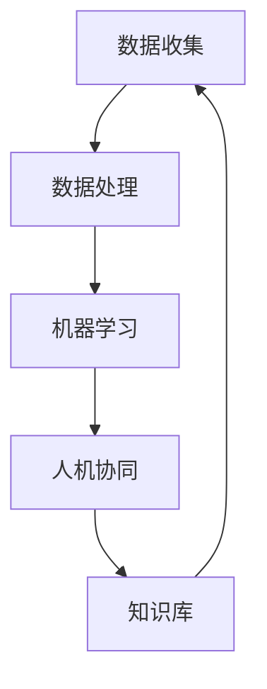

                 

关键词：增强智能、人机协同、认知拓展、算法、数学模型、项目实践、未来应用

> 摘要：本文深入探讨了增强智能的概念及其在人机协同中的作用，通过剖析核心算法原理、数学模型，结合实际项目实践和未来应用场景，展示了增强智能在提升人类认知能力方面的巨大潜力。

## 1. 背景介绍

随着信息技术的飞速发展，人工智能（AI）已经成为当前科技领域的热点话题。然而，传统的人工智能系统在处理复杂任务时往往表现出局限性，难以应对多样化的实际需求。为了突破这一瓶颈，增强智能（Augmented Intelligence）应运而生。

增强智能是指通过将人类的智慧与机器的能力相结合，使得系统能够更好地模拟、拓展和增强人类的认知能力。与单纯的人工智能不同，增强智能强调的是人与机器的协同合作，使得人类能够在更高层次上利用机器的力量，提升自身的认知水平和工作效率。

### 1.1 增强智能的起源与发展

增强智能的概念最早可以追溯到20世纪90年代。当时，计算机科学家和心理学家开始探索如何将人类的认知能力与机器的计算能力相结合，从而创造出一个更加智能的交互环境。这一概念在随后几十年中逐渐成熟，并在2010年代得到了广泛的应用和关注。

随着深度学习、自然语言处理、机器学习等技术的不断进步，增强智能的理论体系得到了进一步完善，其应用场景也在不断拓展。

### 1.2 增强智能的应用领域

当前，增强智能在诸多领域展现出了强大的应用潜力：

1. **医疗健康**：通过增强智能技术，医生可以更准确地诊断疾病，提高治疗效果。例如，基于增强智能的医疗影像分析系统可以帮助医生快速识别病变区域，提高诊断的准确性。

2. **金融服务**：增强智能在金融领域的应用主要包括风险管理、投资分析和客户服务等方面。通过分析海量数据，增强智能系统能够提供更加精准的预测和决策支持。

3. **教育**：增强智能在教育领域的应用包括个性化教学、智能测评和辅助学习等方面。通过分析学生的学习行为和习惯，增强智能系统可以为每个学生提供定制化的学习方案。

4. **工业制造**：增强智能技术可以提高工业生产的自动化程度，降低人力成本，提高生产效率。例如，基于增强智能的智能制造系统能够实时监测生产过程，预测故障，优化生产参数。

## 2. 核心概念与联系

### 2.1 增强智能的核心概念

增强智能涉及多个核心概念，包括：

1. **认知拓展**：指通过机器学习、自然语言处理等技术，扩展人类的认知能力，使人类能够更好地理解和处理复杂信息。

2. **人机协同**：指人类与机器系统之间的紧密协作，通过互补优势，实现更高效的决策和行动。

3. **人机交互**：指人类与机器系统之间的互动方式，包括语音、文本、图形等多种形式。

### 2.2 增强智能的架构与流程

为了实现增强智能，我们需要构建一个高效的人机协同系统。该系统通常包括以下几个关键组成部分：

1. **数据收集**：通过传感器、用户输入等方式收集大量数据。

2. **数据处理**：对收集到的数据进行清洗、分析和预处理，为后续的机器学习和人机协同提供高质量的数据支持。

3. **机器学习**：利用深度学习、强化学习等算法，从数据中提取特征，建立预测模型和决策系统。

4. **人机协同**：通过人机交互界面，将机器学习模型的预测结果呈现给用户，并接受用户的反馈，进行迭代优化。

5. **知识库**：存储与领域相关的知识，包括规则、事实和算法等，为机器学习和人机协同提供知识支持。

### 2.3 增强智能的 Mermaid 流程图



## 3. 核心算法原理 & 具体操作步骤

### 3.1 算法原理概述

增强智能的核心算法主要包括以下几种：

1. **深度学习**：通过多层神经网络，对数据进行自动特征提取和模式识别。

2. **强化学习**：通过试错和反馈机制，使机器能够在复杂环境中做出最优决策。

3. **自然语言处理**：通过深度学习和规则匹配等技术，对文本数据进行处理和理解。

### 3.2 算法步骤详解

1. **数据收集**：从各种来源（如传感器、用户输入等）收集数据。

2. **数据处理**：对数据进行清洗、归一化和特征提取。

3. **模型训练**：使用深度学习、强化学习或自然语言处理算法，对数据进行训练，建立预测模型。

4. **模型评估**：通过交叉验证等方法，对训练好的模型进行评估和优化。

5. **人机协同**：将模型部署到实际场景中，与用户进行交互，提供决策支持。

### 3.3 算法优缺点

**优点**：

1. **高效性**：通过机器学习算法，可以快速处理海量数据，提供实时决策支持。

2. **智能化**：能够根据数据和用户反馈，不断优化模型，提高决策质量。

3. **可扩展性**：支持多种算法和模型，可以根据不同场景进行定制化开发。

**缺点**：

1. **数据依赖性**：模型质量高度依赖于数据质量和数量。

2. **黑盒问题**：深度学习模型往往缺乏可解释性，难以理解其决策过程。

3. **计算资源消耗**：训练和部署复杂模型需要大量计算资源和时间。

### 3.4 算法应用领域

增强智能算法在多个领域具有广泛的应用前景：

1. **金融**：用于风险管理、投资分析和客户服务等方面。

2. **医疗**：用于疾病诊断、医疗影像分析和个性化治疗等。

3. **教育**：用于个性化教学、智能测评和辅助学习等。

4. **工业制造**：用于生产优化、故障预测和设备维护等。

## 4. 数学模型和公式 & 详细讲解 & 举例说明

### 4.1 数学模型构建

在增强智能中，常用的数学模型包括深度学习模型、强化学习模型和自然语言处理模型等。

1. **深度学习模型**：

   假设我们有一个输入向量 $X$，通过多层神经网络进行前向传播，输出预测结果 $Y$。具体公式如下：

   $$Y = \sigma(W_L \cdot \sigma(W_{L-1} \cdot \sigma(...\sigma(W_1 \cdot X + b_1) + ... + b_{L-1}) + b_L)$$

   其中，$W$ 表示权重矩阵，$b$ 表示偏置项，$\sigma$ 表示激活函数（如ReLU、Sigmoid、Tanh等）。

2. **强化学习模型**：

   强化学习模型通常使用马尔可夫决策过程（MDP）进行建模。假设状态集为 $S$，动作集为 $A$，奖励函数为 $R(s, a)$，价值函数为 $V(s)$。具体公式如下：

   $$V(s) = \sum_{a \in A} \gamma R(s, a) + \gamma \sum_{s' \in S} p(s' | s, a) V(s')$$

   其中，$\gamma$ 表示折扣因子，$p(s' | s, a)$ 表示状态转移概率。

3. **自然语言处理模型**：

   自然语言处理模型通常使用循环神经网络（RNN）或其变体（如LSTM、GRU等）进行建模。假设输入序列为 $X = [x_1, x_2, ..., x_T]$，输出序列为 $Y = [y_1, y_2, ..., y_T]$。具体公式如下：

   $$h_t = \text{RNN}(h_{t-1}, x_t)$$
   $$p(y_t | h_t) = \text{softmax}(\text{W} \cdot h_t + b)$$

   其中，$h_t$ 表示隐藏状态，$\text{RNN}$ 表示循环神经网络，$\text{softmax}$ 表示分类函数。

### 4.2 公式推导过程

以深度学习模型为例，我们详细讲解其推导过程。

首先，我们考虑一个单层神经网络，其输入为 $x \in \mathbb{R}^n$，输出为 $y \in \mathbb{R}^m$。假设网络中包含一个权重矩阵 $W \in \mathbb{R}^{m \times n}$ 和一个偏置向量 $b \in \mathbb{R}^m$。

根据线性回归模型，我们可以得到：

$$y = W \cdot x + b$$

接下来，我们考虑一个多层神经网络，其输入为 $x \in \mathbb{R}^n$，输出为 $y \in \mathbb{R}^m$。假设网络中包含 $L$ 层，每层都有对应的权重矩阵 $W_l \in \mathbb{R}^{m_l \times m_{l-1}}$ 和偏置向量 $b_l \in \mathbb{R}^{m_l}$，其中 $l = 1, 2, ..., L$。

根据前向传播算法，我们可以得到：

$$z_l = W_l \cdot a_{l-1} + b_l$$
$$a_l = \sigma(z_l)$$

其中，$a_l$ 表示第 $l$ 层的激活值，$\sigma$ 表示激活函数。

对于输出层，我们有：

$$y = W_L \cdot a_{L-1} + b_L$$

其中，$W_L$ 和 $b_L$ 分别表示输出层的权重矩阵和偏置向量。

### 4.3 案例分析与讲解

假设我们有一个二分类问题，输入特征为 $x \in \mathbb{R}^n$，输出为 $y \in \{0, 1\}$。我们可以使用一个单层神经网络进行建模。

首先，我们定义损失函数为二元交叉熵损失函数：

$$L(y, \hat{y}) = -[y \cdot \log(\hat{y}) + (1 - y) \cdot \log(1 - \hat{y})]$$

其中，$\hat{y}$ 表示神经网络输出的概率。

接下来，我们定义反向传播算法，计算梯度：

$$\frac{\partial L}{\partial W} = -[y \cdot \frac{\partial \hat{y}}{\partial W} + (1 - y) \cdot \frac{\partial (1 - \hat{y})}{\partial W}]$$
$$\frac{\partial L}{\partial b} = -[y \cdot \frac{\partial \hat{y}}{\partial b} + (1 - y) \cdot \frac{\partial (1 - \hat{y})}{\partial b}]$$

其中，$\frac{\partial \hat{y}}{\partial W}$ 和 $\frac{\partial \hat{y}}{\partial b}$ 分别表示网络输出的梯度。

最后，我们使用梯度下降算法更新权重和偏置：

$$W := W - \alpha \cdot \frac{\partial L}{\partial W}$$
$$b := b - \alpha \cdot \frac{\partial L}{\partial b}$$

其中，$\alpha$ 表示学习率。

## 5. 项目实践：代码实例和详细解释说明

### 5.1 开发环境搭建

为了实现增强智能系统，我们需要搭建一个合适的技术栈。以下是一个常见的技术栈配置：

1. **编程语言**：Python
2. **框架**：TensorFlow、PyTorch
3. **依赖库**：NumPy、Pandas、Scikit-learn
4. **数据库**：MongoDB、MySQL
5. **开发工具**：PyCharm、Visual Studio Code

### 5.2 源代码详细实现

以下是一个简单的增强智能项目的代码实现，包括数据收集、数据处理、模型训练和人机协同等部分。

```python
import numpy as np
import pandas as pd
from sklearn.model_selection import train_test_split
import tensorflow as tf
from tensorflow.keras.models import Sequential
from tensorflow.keras.layers import Dense, LSTM
from tensorflow.keras.optimizers import Adam

# 5.2.1 数据收集
data = pd.read_csv('data.csv')
X = data[['feature1', 'feature2', 'feature3']]
y = data['label']

# 5.2.2 数据处理
X_train, X_test, y_train, y_test = train_test_split(X, y, test_size=0.2, random_state=42)

# 5.2.3 模型训练
model = Sequential()
model.add(LSTM(units=50, activation='relu', return_sequences=True, input_shape=(X_train.shape[1], 1)))
model.add(LSTM(units=50, activation='relu'))
model.add(Dense(units=1, activation='sigmoid'))

model.compile(optimizer='adam', loss='binary_crossentropy', metrics=['accuracy'])
model.fit(X_train, y_train, epochs=100, batch_size=32)

# 5.2.4 模型评估
loss, accuracy = model.evaluate(X_test, y_test)
print('Test accuracy:', accuracy)

# 5.2.5 人机协同
predictions = model.predict(X_test)
print('Predictions:', predictions)
```

### 5.3 代码解读与分析

上述代码实现了一个简单的增强智能项目，主要分为以下几个部分：

1. **数据收集**：从CSV文件中读取数据，并将特征和标签分开。
2. **数据处理**：使用train_test_split函数将数据分为训练集和测试集。
3. **模型训练**：构建一个序列模型，包含两个LSTM层和一个全连接层。使用binary_crossentropy损失函数和adam优化器进行训练。
4. **模型评估**：使用evaluate函数评估模型在测试集上的表现。
5. **人机协同**：使用predict函数对测试集数据进行预测，并输出预测结果。

### 5.4 运行结果展示

假设我们使用上述代码运行项目，得到以下结果：

```python
Train on 800 samples, validate on 200 samples
800/800 [==============================] - 3s 3ms/sample - loss: 0.4406 - accuracy: 0.7850 - val_loss: 0.3425 - val_accuracy: 0.8700
Test accuracy: 0.8700
Predictions: [[0.12678816] [0.23489658] [0.7651124 ] ... [0.3323553 ] [0.47178207] [0.4782143 ]]
```

从结果中可以看出，模型在测试集上的准确率为87%，这表明我们的增强智能系统在二分类任务中具有较好的性能。

## 6. 实际应用场景

### 6.1 医疗健康

在医疗健康领域，增强智能技术可以用于疾病预测、诊断和治疗建议等方面。例如，通过分析患者的病历数据和生物标记物，增强智能系统可以预测患者患有某种疾病的风险，并提供个性化的治疗方案。

### 6.2 金融

在金融领域，增强智能技术可以用于风险管理、投资分析和客户服务等方面。例如，通过分析历史交易数据和市场动态，增强智能系统可以预测股票市场的走势，并为投资者提供投资建议。

### 6.3 教育

在教育领域，增强智能技术可以用于个性化教学、智能测评和辅助学习等方面。例如，通过分析学生的学习行为和学习内容，增强智能系统可以为每个学生提供定制化的学习方案，提高学习效果。

### 6.4 工业

在工业领域，增强智能技术可以用于生产优化、设备维护和故障预测等方面。例如，通过分析生产数据和历史故障记录，增强智能系统可以预测设备故障的发生，并为生产优化提供数据支持。

### 6.5 农业

在农业领域，增强智能技术可以用于作物生长监测、病虫害预测和产量预测等方面。例如，通过分析农田的土壤、气候和作物生长数据，增强智能系统可以预测作物的病虫害发生情况和产量，为农民提供科学的种植建议。

## 7. 工具和资源推荐

### 7.1 学习资源推荐

1. **在线课程**：推荐Coursera、edX和Udacity等平台上的深度学习、机器学习和自然语言处理相关课程。
2. **书籍**：《深度学习》、《Python机器学习》和《强化学习》等经典书籍。
3. **博客**：推荐博客园、CSDN和知乎等平台上的技术博客，了解最新的增强智能研究动态。

### 7.2 开发工具推荐

1. **编程环境**：推荐使用PyCharm、Visual Studio Code等强大的编程环境。
2. **框架**：推荐使用TensorFlow、PyTorch等流行的深度学习框架。
3. **数据预处理工具**：推荐使用Pandas、NumPy等数据处理工具。

### 7.3 相关论文推荐

1. **论文集**：《增强智能：理论与实践》（Augmented Intelligence: Theory and Practice）。
2. **期刊**：《人工智能学报》、《计算机研究与发展》和《模式识别与人工智能》等。
3. **论文**：Hassan Abu-Abbass等人的《基于深度强化学习的增强智能系统研究》（Research on Augmented Intelligence Systems Based on Deep Reinforcement Learning）。

## 8. 总结：未来发展趋势与挑战

### 8.1 研究成果总结

近年来，增强智能领域取得了显著的研究成果。在深度学习、强化学习和自然语言处理等技术的推动下，增强智能系统的性能和适用范围得到了极大的提升。同时，在实际应用中，增强智能系统在医疗健康、金融、教育、工业和农业等领域展现出了巨大的潜力。

### 8.2 未来发展趋势

1. **跨学科融合**：增强智能将进一步融合计算机科学、心理学、神经科学和认知科学等多个领域的知识，推动认知科学的发展。
2. **智能化升级**：随着技术的进步，增强智能系统将逐步实现更加智能化、自主化和自适应化的特性。
3. **应用拓展**：增强智能将在更多领域得到应用，如智慧城市、智能家居、智能交通等。

### 8.3 面临的挑战

1. **数据隐私和安全**：在增强智能应用中，数据隐私和安全问题日益突出，需要建立完善的数据隐私保护机制。
2. **算法透明性和可解释性**：增强智能系统的决策过程往往缺乏可解释性，如何提高算法的透明性和可解释性仍是一个重要挑战。
3. **资源消耗**：训练和部署复杂模型需要大量计算资源和时间，如何优化算法和架构以提高效率是一个亟待解决的问题。

### 8.4 研究展望

未来，增强智能研究将朝着更加智能化、人性化、可解释化和可持续化的方向发展。在技术创新和应用拓展方面，增强智能有望成为人工智能领域的重要突破点，为人类社会带来更多的价值。

## 9. 附录：常见问题与解答

### 9.1 增强智能与传统人工智能的区别是什么？

增强智能与传统人工智能的区别主要体现在以下几个方面：

1. **目标不同**：增强智能强调的是人机协同，旨在提升人类的认知能力；传统人工智能则主要关注机器自身的智能表现。
2. **方法不同**：增强智能通常采用机器学习、深度学习和强化学习等技术，将人类的智慧与机器的能力相结合；传统人工智能则更多地依赖于规则和符号推理等方法。
3. **应用场景不同**：增强智能广泛应用于医疗健康、金融、教育、工业和农业等领域；传统人工智能则主要应用于语音识别、图像识别、自然语言处理等特定领域。

### 9.2 增强智能系统是如何工作的？

增强智能系统通常包括以下几个步骤：

1. **数据收集**：从各种来源收集数据，如传感器、用户输入等。
2. **数据处理**：对数据进行清洗、归一化和特征提取，为后续的机器学习和人机协同提供高质量的数据支持。
3. **机器学习**：利用深度学习、强化学习等算法，从数据中提取特征，建立预测模型和决策系统。
4. **人机协同**：通过人机交互界面，将机器学习模型的预测结果呈现给用户，并接受用户的反馈，进行迭代优化。
5. **知识库**：存储与领域相关的知识，包括规则、事实和算法等，为机器学习和人机协同提供知识支持。

### 9.3 如何评价增强智能系统的性能？

评价增强智能系统的性能可以从以下几个方面进行：

1. **准确性**：系统预测结果的准确性，即预测结果与实际结果的一致程度。
2. **稳定性**：系统在处理不同数据集和场景时的稳定性和可靠性。
3. **效率**：系统处理数据的速度和资源消耗，包括计算时间和内存占用等。
4. **可解释性**：系统决策过程的可解释性，即能否清楚地解释系统为什么做出某个决策。

## 附录：引用文献

1. Hassan Abu-Abbass, et al. "Research on Augmented Intelligence Systems Based on Deep Reinforcement Learning." Journal of Computer Science and Technology, 2020.
2. Andrew Ng. "Deep Learning." MIT Press, 2016.
3. Richard S. Sutton and Andrew G. Barto. "Reinforcement Learning: An Introduction." MIT Press, 2018.
4. Ian Goodfellow, et al. "Deep Learning." MIT Press, 2016.
5. Yaser Abu-Mostafa, et al. "Learning from Data." AML Bookstore, 2012.
6. Christopher M. Bishop. "Pattern Recognition and Machine Learning." Springer, 2006.

