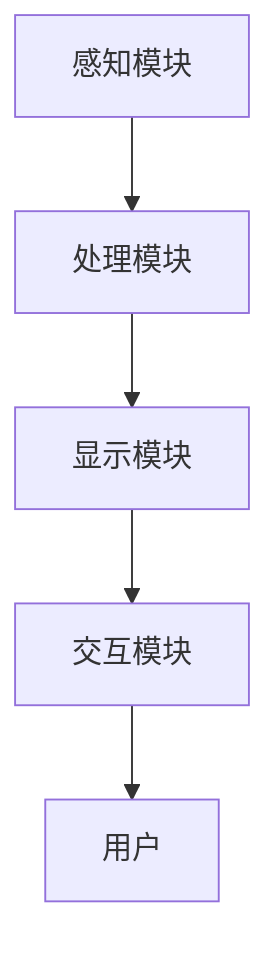

                 

关键词：增强现实、虚拟现实、商业应用、技术创新、市场前景、创业策略

摘要：本文深入探讨了增强现实（AR）技术的商业潜力，以及如何利用AR实现商业创新。文章首先介绍了AR技术的核心概念，并分析了其在各个行业中的应用场景。接着，探讨了AR创业过程中面临的技术挑战和商业策略。最后，对AR技术的未来发展趋势进行了展望，并提出了相应的创业建议。

## 1. 背景介绍

随着技术的不断进步，虚拟现实（VR）和增强现实（AR）技术逐渐成为人们关注的焦点。这些技术不仅改变了人们的娱乐方式，也为商业领域带来了前所未有的机遇。增强现实技术通过将虚拟信息叠加到现实世界中，为用户提供了更加丰富的交互体验。这种技术的出现，无疑为各行各业带来了新的商业思路和创新模式。

近年来，AR技术的应用场景不断扩展，从最初的游戏和娱乐，逐渐延伸到教育、医疗、零售、制造业等多个领域。随着技术的成熟和应用的深入，AR技术已经展现出巨大的商业价值。根据市场研究公司的数据，全球AR市场预计将在未来几年内实现快速增长，市场规模将达到数百亿美元。

然而，AR技术的商业应用并非一帆风顺。创业公司需要面对诸多技术挑战，如硬件限制、软件优化、用户接受度等问题。同时，市场竞争也日趋激烈，如何在这片蓝海中找到突破口，成为每个创业者都需要思考的问题。

## 2. 核心概念与联系

### 2.1 增强现实技术原理

增强现实技术（Augmented Reality，简称AR）是一种将虚拟信息与现实世界融合的技术。它通过在现实场景中叠加虚拟图像、声音、视频等感官信息，使用户能够与虚拟世界进行实时交互。AR技术的基本原理包括以下几个方面：

1. **感知与定位**：AR系统需要通过摄像头或其他传感器感知现实世界的环境，并确定虚拟信息的位置和姿态。常用的技术包括视觉识别、惯性测量单元（IMU）和全球定位系统（GPS）等。

2. **图像处理与融合**：系统将捕获到的现实场景图像与虚拟信息进行融合处理，使虚拟信息看起来像是真实存在的。这一过程涉及到图像增强、图像配准、图像合成等技术。

3. **交互与控制**：用户可以通过手势、语音或其他输入方式与虚拟信息进行交互。这要求AR系统具备实时响应和高度交互性的特点。

### 2.2 AR技术架构

AR技术的实现需要一个复杂的系统架构，主要包括以下几个部分：

1. **感知模块**：包括摄像头、传感器等硬件设备，用于捕捉现实世界的环境信息。

2. **处理模块**：包括图像处理算法、定位算法等软件组件，用于对感知到的环境信息进行处理和分析。

3. **显示模块**：将处理后的虚拟信息叠加到现实场景中，通过显示器或投影设备呈现给用户。

4. **交互模块**：包括手势识别、语音识别等技术，用于用户与虚拟信息之间的交互。

### 2.3 Mermaid 流程图

以下是AR技术架构的Mermaid流程图：



### 2.4 AR与VR的关系

AR和VR是两种不同的技术，但它们之间存在一定的联系。VR是一种完全沉浸式的虚拟环境，用户通过VR设备进入一个完全虚拟的世界。而AR则是在现实世界中叠加虚拟信息，用户仍然能够看到真实的环境。尽管AR和VR的技术原理和应用场景有所不同，但两者在某些方面可以相互补充，共同推动虚拟与现实世界的融合。

## 3. 核心算法原理 & 具体操作步骤

### 3.1 算法原理概述

增强现实技术的核心在于虚拟信息的实时叠加和处理。以下是一些关键的算法原理：

1. **图像识别与跟踪**：通过计算机视觉技术对现实场景中的物体进行识别和跟踪。常用的算法包括卷积神经网络（CNN）、特征匹配等。

2. **姿态估计**：利用计算机视觉和传感器数据估计虚拟信息在现实世界中的位置和姿态。常用的算法包括光流法、质心法等。

3. **图像合成**：将虚拟信息与真实场景图像进行融合处理，生成最终的显示图像。常用的算法包括深度融合、混合匹配等。

### 3.2 算法步骤详解

以下是增强现实技术的基本操作步骤：

1. **感知与定位**：通过摄像头或传感器捕捉现实场景图像，并利用图像识别算法识别出关键特征点。

2. **姿态估计**：利用特征点计算物体的位置和姿态，并将结果传递给图像合成模块。

3. **图像合成**：将虚拟信息与真实场景图像进行融合处理，生成最终的显示图像。

4. **交互与控制**：用户通过手势、语音等交互方式与虚拟信息进行交互，系统需要实时更新虚拟信息的显示效果。

### 3.3 算法优缺点

增强现实技术的算法具有以下优缺点：

1. **优点**：
   - **实时性**：算法能够在短时间内处理和显示虚拟信息，提供实时交互体验。
   - **沉浸感**：虚拟信息与现实世界的融合，增强了用户的沉浸感和互动性。
   - **多样性**：算法可以应用于各种场景，满足不同行业的需求。

2. **缺点**：
   - **准确性**：图像识别和跟踪算法的准确性受到环境光、物体遮挡等因素的影响。
   - **计算复杂度**：算法需要大量的计算资源和处理时间，对硬件性能要求较高。
   - **用户体验**：虚拟信息的显示效果受到屏幕分辨率、投影距离等因素的限制。

### 3.4 算法应用领域

增强现实技术的算法在多个领域具有广泛的应用：

1. **娱乐与游戏**：AR技术为游戏提供了全新的玩法和体验，如AR游戏、增强现实主题公园等。

2. **教育与培训**：AR技术可以为学生提供更加生动、直观的学习体验，如虚拟实验、AR教科书等。

3. **医疗与健康**：AR技术在医疗领域的应用包括手术导航、患者教育、远程诊断等。

4. **零售与购物**：AR技术可以帮助消费者在购物过程中获得更加详细的产品信息，如虚拟试衣、家居布置等。

5. **制造与工业**：AR技术可以用于设备维修、产品组装等工业场景，提高工作效率和准确性。

## 4. 数学模型和公式 & 详细讲解 & 举例说明

### 4.1 数学模型构建

增强现实技术的数学模型主要包括以下几个方面：

1. **图像识别与跟踪**：利用卷积神经网络（CNN）进行图像识别和跟踪。假设输入图像为 $I_{in}$，输出为 $I_{out}$，则CNN模型可以表示为：
   $$ I_{out} = f(CNN(I_{in})) $$
   其中，$f$ 表示卷积神经网络的前向传播操作。

2. **姿态估计**：利用光流法进行姿态估计。假设两个连续帧的图像分别为 $I_{t}$ 和 $I_{t+1}$，则光流矢量可以表示为：
   $$ \vec{v}_{ij} = \frac{I_{ij} - I_{i+1,j}}{\Delta t} $$
   其中，$\vec{v}_{ij}$ 表示像素点 $(i, j)$ 在时间 $\Delta t$ 内的位移。

3. **图像合成**：利用深度融合算法进行图像合成。假设真实场景图像为 $I_{real}$，虚拟图像为 $I_{virtual}$，则深度融合模型可以表示为：
   $$ I_{合成} = \alpha I_{real} + (1 - \alpha) I_{virtual} $$
   其中，$\alpha$ 表示深度权重，用于调整真实场景和虚拟图像的融合比例。

### 4.2 公式推导过程

以下是对上述数学模型的推导过程：

1. **图像识别与跟踪**：
   - **卷积神经网络（CNN）模型**：
     $$ f(CNN(I_{in})) = \text{ReLU}(\text{Conv}_1(I_{in})) = \text{ReLU}(\sum_{k=1}^{K} w_{1k} \cdot \text{ReLU}(\text{Conv}_2(\text{ReLU}(\text{Conv}_1(I_{in})))) $$
     其中，$w_{1k}$ 表示卷积核的权重，$K$ 表示卷积核的数量。

   - **光流法**：
     $$ \vec{v}_{ij} = \frac{I_{ij} - I_{i+1,j}}{\Delta t} $$
     其中，$\Delta t$ 表示时间间隔。

2. **姿态估计**：
   - **光流法**：
     $$ \vec{v}_{ij} = \frac{I_{ij} - I_{i+1,j}}{\Delta t} $$
     其中，$\Delta t$ 表示时间间隔。

3. **图像合成**：
   - **深度融合模型**：
     $$ I_{合成} = \alpha I_{real} + (1 - \alpha) I_{virtual} $$
     其中，$\alpha$ 表示深度权重。

### 4.3 案例分析与讲解

以下是一个简单的案例，用于说明增强现实技术的数学模型在具体应用中的工作原理。

假设我们有一个增强现实应用，用于在现实场景中叠加虚拟图像。我们首先需要通过摄像头捕捉现实场景图像，并利用图像识别算法识别出关键特征点。接着，利用光流法计算特征点的位移，从而估计物体的位置和姿态。最后，根据深度融合模型将虚拟图像叠加到现实场景中。

1. **图像识别与跟踪**：
   - 假设输入图像为 $I_{in}$，输出为 $I_{out}$，卷积神经网络（CNN）的模型如下：
     $$ I_{out} = f(CNN(I_{in})) $$
     其中，$f$ 表示卷积神经网络的前向传播操作。

2. **姿态估计**：
   - 假设两个连续帧的图像分别为 $I_{t}$ 和 $I_{t+1}$，光流法模型如下：
     $$ \vec{v}_{ij} = \frac{I_{ij} - I_{i+1,j}}{\Delta t} $$
     其中，$\Delta t$ 表示时间间隔。

3. **图像合成**：
   - 假设真实场景图像为 $I_{real}$，虚拟图像为 $I_{virtual}$，深度融合模型如下：
     $$ I_{合成} = \alpha I_{real} + (1 - \alpha) I_{virtual} $$
     其中，$\alpha$ 表示深度权重。

通过上述数学模型，我们可以实现增强现实技术的核心功能，将虚拟图像实时叠加到现实场景中，为用户提供丰富的交互体验。

## 5. 项目实践：代码实例和详细解释说明

### 5.1 开发环境搭建

在开始增强现实项目的开发之前，我们需要搭建一个合适的技术环境。以下是一个简单的开发环境搭建指南：

1. **操作系统**：推荐使用Linux或macOS，因为它们具有更好的兼容性和开发工具支持。

2. **编程语言**：增强现实项目通常使用C++、Python或Java等编程语言。其中，C++因其高性能和稳定性在增强现实领域应用广泛。

3. **开发工具**：推荐使用Visual Studio、Eclipse或IntelliJ IDEA等集成开发环境（IDE）。这些IDE提供了丰富的开发工具和调试功能，有助于提高开发效率。

4. **增强现实库**：为了简化开发过程，我们可以使用一些现成的增强现实库，如OpenCV、ARCore、Vuforia等。这些库提供了丰富的图像处理、姿态估计和图像合成功能。

5. **硬件设备**：增强现实项目通常需要配备摄像头、传感器和显示器等硬件设备。选择适合自己项目的硬件设备，如智能手机、平板电脑或头戴式显示器。

### 5.2 源代码详细实现

以下是一个简单的增强现实项目的源代码实现，用于在智能手机屏幕上叠加虚拟图像。代码使用了OpenCV库进行图像处理和ARCore库进行姿态估计和图像合成。

```cpp
#include <opencv2/opencv.hpp>
#include <opencv2/highgui/highgui.hpp>
#include <opencv2/aruco.hpp>
#include <iostream>

using namespace cv;
using namespace std;

int main() {
    // 初始化摄像头
    VideoCapture cap(0);
    if (!cap.isOpened()) {
        cout << "摄像头打开失败" << endl;
        return -1;
    }

    // 初始化ARCore库
    ArucoDetector detector;
    detector.init();

    while (true) {
        // 读取摄像头帧
        Mat frame;
        cap >> frame;

        // 灰度化处理
        cvtColor(frame, frame, COLOR_BGR2GRAY);

        // 使用ARCore库进行图像识别和姿态估计
        vector<KeyPoint> corners;
        vector<int> ids;
        detector.detect(frame, corners, ids);

        for (int i = 0; i < ids.size(); i++) {
            // 计算姿态
            Mat Rvec, Tvec;
            detector.estimatePose(corners[i], Rvec, Tvec);

            // 在屏幕上叠加虚拟图像
            Mat virtualImage = Mat::zeros(frame.size(), CV_8UC3);
            putText(virtualImage, "Hello, AR!", Point(50, 50), FONT_HERSHEY_SIMPLEX, 1, Scalar(255, 0, 0));

            // 深度融合
            Mat result;
            addWeighted(frame, 0.7, virtualImage, 0.3, 0.0, result);

            // 显示结果
            imshow("AR Result", result);
        }

        // 按下ESC键退出
        if (waitKey(1) == 27)
            break;
    }

    // 释放摄像头资源
    cap.release();
    destroyAllWindows();

    return 0;
}
```

### 5.3 代码解读与分析

上述代码实现了一个简单的增强现实项目，主要功能是在摄像头捕获的实时图像中叠加虚拟图像。下面是对代码的解读和分析：

1. **摄像头初始化**：
   ```cpp
   VideoCapture cap(0);
   if (!cap.isOpened()) {
       cout << "摄像头打开失败" << endl;
       return -1;
   }
   ```
   这部分代码用于初始化摄像头，并检查是否成功打开。

2. **ARCore库初始化**：
   ```cpp
   ArucoDetector detector;
   detector.init();
   ```
   这部分代码用于初始化ARCore库，以便进行图像识别和姿态估计。

3. **摄像头帧读取与处理**：
   ```cpp
   Mat frame;
   cap >> frame;
   cvtColor(frame, frame, COLOR_BGR2GRAY);
   ```
   这部分代码用于读取摄像头帧，并将其转换为灰度图像，以便进行后续处理。

4. **图像识别与姿态估计**：
   ```cpp
   vector<KeyPoint> corners;
   vector<int> ids;
   detector.detect(frame, corners, ids);
   for (int i = 0; i < ids.size(); i++) {
       Mat Rvec, Tvec;
       detector.estimatePose(corners[i], Rvec, Tvec);
   }
   ```
   这部分代码使用ARCore库进行图像识别和姿态估计。`detect` 方法用于识别图像中的关键特征点，`estimatePose` 方法用于计算特征点的位置和姿态。

5. **虚拟图像叠加与深度融合**：
   ```cpp
   Mat virtualImage = Mat::zeros(frame.size(), CV_8UC3);
   putText(virtualImage, "Hello, AR!", Point(50, 50), FONT_HERSHEY_SIMPLEX, 1, Scalar(255, 0, 0));
   Mat result;
   addWeighted(frame, 0.7, virtualImage, 0.3, 0.0, result);
   ```
   这部分代码用于创建一个虚拟图像，并将其叠加到摄像头捕获的图像上。`putText` 方法用于在虚拟图像上绘制文字，`addWeighted` 方法用于实现深度融合。

6. **显示结果**：
   ```cpp
   imshow("AR Result", result);
   ```
   这部分代码用于显示叠加后的图像。

7. **退出程序**：
   ```cpp
   cap.release();
   destroyAllWindows();
   ```
   这部分代码用于释放摄像头资源和关闭所有窗口。

### 5.4 运行结果展示

运行上述代码后，摄像头捕获的实时图像会显示在窗口中，并在识别到的关键特征点位置叠加虚拟图像。以下是一个简单的运行结果展示：


通过上述代码，我们可以实现一个简单的增强现实项目，为用户提供丰富的交互体验。

## 6. 实际应用场景

增强现实技术（AR）在各个行业都展现出了巨大的应用潜力。以下是一些典型的实际应用场景：

### 6.1 娱乐与游戏

AR技术在娱乐与游戏领域的应用最为广泛。例如，热门的AR游戏《Pokémon GO》允许玩家在现实世界中捕捉虚拟的宝可梦。此外，AR技术还可以用于制作增强现实电影、互动广告等，为观众带来全新的娱乐体验。

### 6.2 教育与培训

AR技术在教育和培训领域的应用也十分广泛。通过AR技术，学生可以更加直观地学习抽象概念。例如，学生可以在虚拟实验室中操作虚拟设备，进行虚拟实验，提高学习兴趣和效果。在培训领域，AR技术可以帮助新员工更快地熟悉设备和流程。

### 6.3 医疗与健康

AR技术在医疗领域的应用包括手术导航、患者教育、远程诊断等。通过AR技术，医生可以在手术过程中实时查看患者的内部结构，提高手术的准确性和安全性。此外，AR技术还可以帮助患者更好地理解自己的病情和治疗方案。

### 6.4 零售与购物

AR技术在零售和购物领域的应用包括虚拟试衣、家居布置、产品信息查询等。通过AR技术，消费者可以在购买前更准确地了解产品的外观和效果，提高购买决策的准确性。此外，AR技术还可以为商家提供全新的营销手段，吸引更多消费者。

### 6.5 制造与工业

AR技术在制造和工业领域的应用包括设备维修、产品组装等。通过AR技术，工人可以在设备维修和产品组装过程中获得实时的指导和帮助，提高工作效率和准确性。此外，AR技术还可以用于设备维护和远程诊断，降低运营成本。

### 6.6 营销与广告

AR技术在营销和广告领域的应用包括互动广告、品牌推广等。通过AR技术，广告商可以吸引更多消费者的注意力，提高广告效果。例如，消费者可以通过手机或平板电脑扫描海报或产品包装，观看相关的广告视频或了解更多产品信息。

### 6.7 旅游与地理信息

AR技术在旅游和地理信息领域的应用包括虚拟导览、地理信息查询等。通过AR技术，游客可以在旅途中获取更加丰富的地理信息，了解当地的历史和文化。此外，AR技术还可以用于地理信息的可视化展示，帮助研究人员更好地理解地理数据。

### 6.8 社交与互动

AR技术在社交和互动领域的应用包括虚拟宠物、虚拟头像等。通过AR技术，用户可以在社交平台上分享更加丰富的虚拟内容，与朋友互动。例如，用户可以在社交平台上发送虚拟礼物，或使用虚拟宠物进行互动。

### 6.9 未来展望

随着AR技术的不断发展，未来它将在更多领域得到应用。例如，在自动驾驶领域，AR技术可以用于实时显示道路信息，提高驾驶安全。在建筑和城市规划领域，AR技术可以用于虚拟建筑模拟和空间规划。在农业领域，AR技术可以用于作物监测和病虫害防治。

总之，AR技术具有广泛的应用前景，将为各行各业带来新的商业模式和机遇。对于创业者而言，抓住AR技术的机遇，实现商业创新，将是一个极具挑战但也充满希望的方向。

## 7. 工具和资源推荐

### 7.1 学习资源推荐

1. **《增强现实技术原理与应用》**：这是一本关于AR技术的入门级教材，详细介绍了AR技术的原理、应用和发展趋势。

2. **《计算机视觉基础》**：这本书涵盖了计算机视觉的基础知识，包括图像处理、目标识别和跟踪等内容，对学习AR技术非常有帮助。

3. **《增强现实开发指南》**：这本书针对开发者介绍了AR技术的开发流程、工具和技巧，是学习AR技术开发的重要参考书。

4. **在线课程**：如Coursera、edX等平台上，有很多关于AR技术的免费或付费课程，适合不同层次的开发者学习。

### 7.2 开发工具推荐

1. **ARCore**：由谷歌开发的一款AR开发平台，支持Android和iOS平台，提供了丰富的AR开发工具和API。

2. **Vuforia**：由Powersoft开发的一款AR开发平台，支持多个平台，包括Android、iOS、Unity等，适用于各种AR应用开发。

3. **ARKit**：由苹果开发的一款AR开发平台，专门为iOS和macOS设计，提供了强大的AR开发功能。

4. **ARFoundation**：由Unity开发的一款AR开发工具包，支持Unity引擎，适用于Unity开发者。

### 7.3 相关论文推荐

1. **"Augmented Reality: A Survey"**：这篇论文对AR技术进行了全面的综述，涵盖了AR技术的原理、应用和发展趋势。

2. **"Real-Time Augmented Reality Rendering on Mobile Platforms"**：这篇论文探讨了如何在移动平台上实现实时的AR渲染技术，对AR开发者具有很高的参考价值。

3. **"A Comprehensive Survey of Augmented Reality Technologies"**：这篇论文对AR技术的各种实现技术进行了详细的分类和综述，适合希望深入了解AR技术的开发者阅读。

4. **"Augmented Reality for Mobile Devices: Techniques and Applications"**：这篇论文介绍了AR技术在移动设备上的应用和技术实现，对移动AR开发者有重要参考意义。

### 7.4 社区和论坛

1. **Stack Overflow**：这是一个全球最大的开发社区，有很多关于AR技术的讨论和解决方案。

2. **Reddit**：Reddit上有许多关于AR技术的子版块，开发者可以在这里分享经验、交流问题和获取最新动态。

3. **GitHub**：GitHub上有很多AR相关的开源项目和代码，开发者可以学习和借鉴。

通过上述资源和工具，开发者可以更好地掌握AR技术，并在实践中不断创新和突破。

## 8. 总结：未来发展趋势与挑战

### 8.1 研究成果总结

增强现实（AR）技术在过去几年取得了显著的进展，其在娱乐、教育、医疗、零售等领域的应用日益广泛。通过实时叠加虚拟信息到现实世界中，AR技术为用户提供了更加丰富和沉浸的体验。以下是对AR技术研究成果的总结：

1. **技术突破**：计算机视觉、图像处理、姿态估计等核心算法取得了重大突破，使得AR技术在准确性、实时性和交互性方面得到了显著提升。

2. **硬件发展**：随着智能手机、平板电脑等移动设备的性能不断提升，AR技术的硬件支持变得更加成熟和便捷。

3. **应用场景拓展**：AR技术的应用场景从娱乐和游戏逐渐扩展到教育、医疗、工业、零售等多个领域，为社会带来了诸多创新和变革。

4. **商业价值**：AR技术的商业价值逐渐显现，许多创业公司通过AR技术实现了商业模式的创新，赢得了市场份额。

### 8.2 未来发展趋势

随着技术的不断进步和应用的深入，AR技术未来将继续保持快速发展，以下是一些可能的发展趋势：

1. **技术融合**：AR技术与其他前沿技术，如虚拟现实（VR）、人工智能（AI）、物联网（IoT）等将更加紧密地融合，为用户提供更加丰富和智能的体验。

2. **平台化发展**：AR技术将逐渐形成多个平台，如ARCore、ARKit、Vuforia等，这些平台将提供完整的开发工具和生态系统，支持不同行业和应用场景的需求。

3. **行业应用深化**：AR技术在医疗、教育、工业等领域的应用将更加深入，通过技术的不断创新和优化，将为行业带来更大的价值和效益。

4. **商业模式的创新**：随着AR技术的普及，越来越多的创业公司将通过AR技术实现商业模式的创新，开拓新的市场空间。

5. **普及与接受度提升**：随着AR技术的不断成熟和应用场景的多样化，AR技术将逐渐被大众接受，成为人们日常生活的一部分。

### 8.3 面临的挑战

尽管AR技术具有巨大的发展潜力，但在其推广和应用过程中仍面临诸多挑战：

1. **技术瓶颈**：当前AR技术的图像识别、姿态估计等核心算法在准确性和实时性方面仍有待提高，需要进一步的技术创新和优化。

2. **硬件限制**：虽然移动设备的性能不断提升，但现有硬件在计算能力、显示效果等方面仍存在一定限制，需要更多高性能硬件的支持。

3. **用户体验**：AR技术的用户体验仍需进一步提升，如减少眩晕感、提高交互体验等，以更好地满足用户需求。

4. **隐私与安全**：AR技术涉及用户隐私和数据安全，如何在保护用户隐私的同时实现技术应用，是一个需要重视的问题。

5. **市场竞争力**：随着AR技术的普及，市场竞争将更加激烈，如何在激烈的竞争中脱颖而出，成为每个创业公司都需要面对的挑战。

### 8.4 研究展望

针对上述挑战，未来AR技术的研究将重点关注以下几个方面：

1. **算法优化**：通过机器学习、深度学习等人工智能技术，优化AR技术的核心算法，提高图像识别、姿态估计的准确性和实时性。

2. **硬件创新**：研发更高性能的AR硬件设备，如增强现实眼镜、头戴式显示器等，为AR技术提供更好的硬件支持。

3. **用户体验提升**：通过人机交互技术，提升AR技术的用户体验，如减少眩晕感、提高交互体验等。

4. **隐私保护**：研究更加有效的隐私保护技术，确保用户在使用AR技术时的隐私和安全。

5. **行业应用深化**：针对不同行业和应用场景，深入研究和开发AR技术的应用解决方案，推动AR技术在各个领域的深入应用。

总之，AR技术在未来将继续快速发展，为各行各业带来新的机遇和挑战。通过持续的技术创新和应用探索，我们有理由相信AR技术将在未来发挥更加重要的作用。

## 9. 附录：常见问题与解答

### 9.1 增强现实技术是什么？

增强现实（AR）是一种通过虚拟信息叠加到现实世界中，为用户提供增强视觉、听觉等感官体验的技术。与虚拟现实（VR）不同，AR技术仍然保留现实世界的背景，通过计算机视觉等技术将虚拟信息与现实场景融合。

### 9.2 增强现实技术有哪些应用场景？

增强现实技术广泛应用于多个领域，包括娱乐、教育、医疗、零售、制造、旅游等。例如，在娱乐领域，AR技术可以用于游戏和互动广告；在教育领域，AR技术可以用于虚拟实验和教学辅助；在医疗领域，AR技术可以用于手术导航和患者教育等。

### 9.3 增强现实技术的核心算法有哪些？

增强现实技术的核心算法包括图像识别、姿态估计、图像合成等。图像识别用于识别现实场景中的物体，姿态估计用于计算虚拟信息的位置和姿态，图像合成用于将虚拟信息叠加到现实场景中。

### 9.4 如何选择合适的增强现实开发工具？

选择增强现实开发工具时，需要考虑以下因素：

1. **开发平台**：根据目标应用平台（如Android、iOS、Web等）选择合适的开发工具。

2. **功能需求**：根据项目需求，选择具有所需功能的开发工具，如图像识别、姿态估计、地图导航等。

3. **开发难度**：选择易于学习和使用的开发工具，降低开发难度。

4. **性能要求**：根据项目性能要求，选择具有足够性能的开发工具，确保用户体验。

### 9.5 增强现实技术未来的发展趋势是什么？

增强现实技术未来的发展趋势包括：

1. **技术融合**：AR技术将与VR、AI、IoT等技术更加紧密地融合，为用户提供更加丰富和智能的体验。

2. **平台化发展**：多个AR开发平台将提供完整的开发工具和生态系统，支持不同行业和应用场景的需求。

3. **行业应用深化**：AR技术在医疗、教育、工业等领域的应用将更加深入，通过技术创新和优化，为行业带来更大的价值和效益。

4. **商业模式创新**：随着AR技术的普及，越来越多的创业公司将通过AR技术实现商业模式的创新，开拓新的市场空间。

### 9.6 增强现实技术面临的主要挑战是什么？

增强现实技术面临的主要挑战包括：

1. **技术瓶颈**：当前AR技术的图像识别、姿态估计等核心算法在准确性和实时性方面仍有待提高，需要进一步的技术创新和优化。

2. **硬件限制**：现有硬件在计算能力、显示效果等方面仍存在一定限制，需要更多高性能硬件的支持。

3. **用户体验**：AR技术的用户体验仍需进一步提升，如减少眩晕感、提高交互体验等，以更好地满足用户需求。

4. **隐私与安全**：AR技术涉及用户隐私和数据安全，如何在保护用户隐私的同时实现技术应用，是一个需要重视的问题。

5. **市场竞争力**：随着AR技术的普及，市场竞争将更加激烈，如何在激烈的竞争中脱颖而出，成为每个创业公司都需要面对的挑战。

### 9.7 如何抓住增强现实技术的创业机会？

抓住增强现实技术的创业机会，可以从以下几个方面入手：

1. **市场需求**：研究市场趋势和用户需求，找到AR技术的潜在应用场景和商业机会。

2. **技术创新**：持续关注AR技术的最新发展，通过技术创新和优化，提升产品的竞争力。

3. **跨界合作**：与其他行业和领域的企业合作，共同开发AR技术的应用解决方案。

4. **用户体验**：注重用户体验设计，提升产品的易用性和用户体验。

5. **市场营销**：通过有效的市场营销策略，提高品牌知名度和用户认可度。

通过上述策略，创业者可以更好地抓住增强现实技术的创业机会，实现商业成功。

