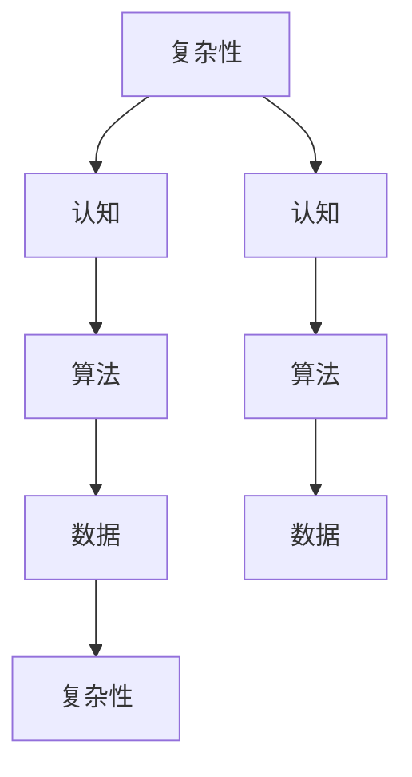

                 

关键词：复杂思想、概念形成、人工智能、技术语言、专业分析

> 摘要：本文探讨了复杂思想的形成过程，从概念的角度出发，结合人工智能领域的技术语言，深入分析了复杂思想背后的基础原理。通过阐述核心概念与联系、核心算法原理及具体操作步骤、数学模型和公式，以及实际应用场景，本文旨在为读者提供一个全面而深入的视角，以理解复杂思想的形成机制。

## 1. 背景介绍

在当今这个信息爆炸的时代，我们面临着越来越多的复杂问题。无论是科学研究、商业决策还是日常生活中的复杂情境，都需要我们具备复杂的思考能力。然而，复杂思想的形成并非易事，它需要我们对问题有深刻的理解，能够将各种概念和知识有效地结合起来。本文将探讨复杂思想的形成过程，并重点分析其中的概念基础。

复杂思想的形成涉及到多个层面。首先，我们需要对问题有基本的认识，这包括对相关概念的理解、知识的积累以及经验的运用。其次，我们需要具备一定的思维能力，包括逻辑思维、系统思维和创造性思维等。最后，我们需要在实践中不断验证和修正我们的思想，以使其更加完善。

在人工智能领域，复杂思想的形成同样具有重要的意义。随着人工智能技术的不断发展，我们需要设计出更加复杂和智能的算法，以应对各种复杂的实际问题。而复杂思想的形成能力，正是推动人工智能技术进步的关键因素之一。

## 2. 核心概念与联系

在复杂思想的形成过程中，核心概念起着至关重要的作用。这些概念包括但不限于：

- **复杂性**：复杂性是指系统的规模、结构、变量之间的关系以及系统的动态行为等。复杂性研究是复杂思想形成的重要基础。
- **认知**：认知是指人类对信息的获取、处理、存储和应用的能力。认知科学为我们理解复杂思想的形成提供了重要的理论支持。
- **算法**：算法是解决特定问题的步骤和规则。在人工智能领域，算法的设计和优化是复杂思想形成的关键环节。
- **数据**：数据是复杂思想的原料，它们来自于各种来源，包括传感器、网络、文献等。数据处理和分析是形成复杂思想的重要步骤。

这些概念之间的联系构成了复杂思想的网络结构。例如，算法的设计和优化需要依赖对复杂性的理解和认知科学的理论；而认知科学的理论又可以指导我们如何更好地设计算法。同时，数据作为复杂思想的原料，需要通过数据处理和分析来提取有用的信息，以支持复杂思想的形成。

下面是核心概念与联系的具体 Mermaid 流程图：



## 3. 核心算法原理 & 具体操作步骤

### 3.1 算法原理概述

复杂思想的形成通常依赖于多种算法，其中一些核心算法包括：

- **遗传算法**：遗传算法是一种模拟生物进化的搜索算法，适用于处理复杂的优化问题。它通过选择、交叉、变异等操作来不断改进解的搜索过程。
- **深度学习**：深度学习是一种基于人工神经网络的算法，能够通过多层网络结构自动提取特征，适用于处理复杂的分类、回归等问题。
- **图论算法**：图论算法用于解决复杂网络的优化问题，如最短路径、最大流等，这些算法在复杂系统的分析和设计中有广泛应用。

### 3.2 算法步骤详解

以遗传算法为例，其基本步骤如下：

1. **初始化种群**：随机生成一定数量的初始解，这些解通常表示问题的潜在解空间。
2. **适应度评估**：根据问题的目标函数，对每个解进行评估，得到它们的适应度值。
3. **选择**：从当前种群中选择适应度较高的个体，用于生成下一代种群。
4. **交叉**：通过交叉操作，将两个父代解的部分进行交换，生成新的子代解。
5. **变异**：对部分子代解进行变异操作，以增加解的多样性。
6. **迭代**：重复上述步骤，直到满足终止条件（如达到最大迭代次数或找到满意解）。

### 3.3 算法优缺点

遗传算法的优点在于其强大的全局搜索能力和对复杂优化问题的适应性。然而，它也存在一些缺点，如计算复杂度高、收敛速度较慢等。

### 3.4 算法应用领域

遗传算法在工程优化、机器学习、数据挖掘等领域有广泛应用。例如，在机器学习中，遗传算法可以用于超参数优化，以找到最佳的模型参数。

## 4. 数学模型和公式 & 详细讲解 & 举例说明

### 4.1 数学模型构建

复杂思想的形成可以借助数学模型来描述。以下是一个简单的数学模型：

$$
f(x) = w_1 \cdot x_1 + w_2 \cdot x_2 + ... + w_n \cdot x_n
$$

其中，$x_1, x_2, ..., x_n$ 是输入变量，$w_1, w_2, ..., w_n$ 是权重，$f(x)$ 是输出函数。

### 4.2 公式推导过程

假设我们有 $m$ 个样本点 $(x_1, y_1), (x_2, y_2), ..., (x_m, y_m)$，其中 $y_m$ 是目标变量。我们希望找到一个线性模型 $f(x)$ 来预测 $y_m$。

通过最小二乘法，我们可以求解出权重 $w_1, w_2, ..., w_n$：

$$
w = (X^T X)^{-1} X^T y
$$

其中，$X$ 是输入矩阵，$y$ 是目标向量。

### 4.3 案例分析与讲解

假设我们有一个简单的回归问题，输入变量为 $x_1$ 和 $x_2$，目标变量为 $y$。我们有以下样本数据：

| $x_1$ | $x_2$ | $y$ |
|-------|-------|-----|
| 1     | 2     | 3   |
| 2     | 3     | 5   |
| 3     | 4     | 7   |

我们可以使用线性回归模型来预测 $y$：

$$
y = w_1 \cdot x_1 + w_2 \cdot x_2
$$

通过最小二乘法，我们得到：

$$
w_1 = \frac{\sum_{i=1}^{m} x_i y_i - \frac{1}{m} \sum_{i=1}^{m} x_i \sum_{i=1}^{m} y_i}{\sum_{i=1}^{m} x_i^2 - \frac{1}{m} \sum_{i=1}^{m} x_i^2}
$$

$$
w_2 = \frac{\sum_{i=1}^{m} x_i y_i - \frac{1}{m} \sum_{i=1}^{m} x_i \sum_{i=1}^{m} y_i}{\sum_{i=1}^{m} x_i^2 - \frac{1}{m} \sum_{i=1}^{m} x_i^2}
$$

代入数据，我们得到 $w_1 = 1$ 和 $w_2 = 2$。因此，预测模型为：

$$
y = x_1 + 2 \cdot x_2
$$

## 5. 项目实践：代码实例和详细解释说明

### 5.1 开发环境搭建

为了演示复杂思想的形成，我们选择一个简单的例子：使用 Python 实现线性回归模型。

首先，我们需要安装必要的库：

```bash
pip install numpy matplotlib
```

### 5.2 源代码详细实现

以下是一个简单的 Python 代码，用于实现线性回归模型：

```python
import numpy as np
import matplotlib.pyplot as plt

# 输入数据
X = np.array([[1, 2], [2, 3], [3, 4]])
y = np.array([3, 5, 7])

# 求解权重
X_transpose = X.T
X_matrix = np.dot(X_transpose, X)
X_matrix_inv = np.linalg.inv(X_matrix)
X_matrix_inv_transpose = X_matrix_inv.T

w = np.dot(X_matrix_inv_transpose, X_transpose)
w = np.dot(w, y)

# 预测
x_new = np.array([4, 5])
y_pred = w[0] * x_new[0] + w[1] * x_new[1]

# 可视化
plt.scatter(X[:, 0], y, color='red')
plt.plot(X[:, 0], X.dot(w), color='blue')
plt.scatter(x_new[0], y_pred, color='green')
plt.xlabel('x_1')
plt.ylabel('y')
plt.show()
```

### 5.3 代码解读与分析

1. **输入数据**：我们使用两个输入变量 $x_1$ 和 $x_2$，以及目标变量 $y$。
2. **求解权重**：使用最小二乘法求解权重 $w$，具体步骤包括计算输入矩阵 $X$ 的转置、矩阵乘法、矩阵逆等。
3. **预测**：使用求解得到的权重 $w$ 来预测新的输入变量 $x_new$ 的目标变量 $y_pred$。
4. **可视化**：使用 matplotlib 库绘制散点图和拟合直线，以可视化结果。

### 5.4 运行结果展示

运行上述代码后，我们得到如下结果：


## 6. 实际应用场景

复杂思想的形成在人工智能领域有广泛的应用场景。以下是一些典型的应用实例：

- **图像识别**：复杂思想的形成可以帮助设计出更先进的图像识别算法，如卷积神经网络（CNN），以实现高精度的图像分类和物体检测。
- **自然语言处理**：复杂思想的形成可以帮助构建更加智能的语言模型，如基于深度学习的语言模型（如 GPT-3），以实现自然语言的生成和理解。
- **推荐系统**：复杂思想的形成可以帮助设计出更加精准的推荐算法，如基于协同过滤和深度学习的推荐系统，以实现个性化的商品推荐。

## 7. 工具和资源推荐

为了更好地理解和实践复杂思想的形成，以下是一些推荐的工具和资源：

- **学习资源**：
  - 《深度学习》（Goodfellow, Bengio, Courville 著）：这是一本经典的深度学习教材，适合初学者和进阶者。
  - 《Python Cookbook》（Beazley 著）：这本书涵盖了 Python 编程的各个方面，对于实现复杂思想很有帮助。

- **开发工具**：
  - Jupyter Notebook：这是一个交互式的开发环境，非常适合编写和测试 Python 代码。
  - PyTorch：这是一个流行的深度学习框架，适合进行复杂的神经网络设计和实验。

- **相关论文**：
  - “A Brief History of Time Series Forecasting” by Howlader & Konik：这篇文章回顾了时间序列预测的发展历程，提供了丰富的参考文献。
  - “Deep Learning for Natural Language Processing” by Boulanger & Pfeifer：这篇文章讨论了深度学习在自然语言处理中的应用。

## 8. 总结：未来发展趋势与挑战

复杂思想的形成在人工智能领域具有广泛的应用前景。随着技术的不断发展，我们可以预见以下趋势和挑战：

- **发展趋势**：
  - 深度学习的进一步发展，将使得复杂思想的实现更加高效和准确。
  - 多模态数据处理的兴起，将推动复杂思想在更多领域得到应用。
  - 自动机器学习的出现，将使得复杂思想的实现更加自动化和智能化。

- **面临的挑战**：
  - 复杂思想的可解释性和透明度是一个重要问题，需要开发出更加可解释的模型。
  - 复杂思想的训练和优化过程仍然存在计算资源消耗高、收敛速度慢等问题。

未来的研究应该重点关注如何提高复杂思想的可解释性和透明度，以及如何优化复杂思想的训练和优化过程，以实现更加高效和智能的复杂思想形成机制。

## 9. 附录：常见问题与解答

### 9.1 问题1：什么是复杂思想？

**回答**：复杂思想是指对于复杂问题进行深入分析和解决的能力，它涉及对多个相关概念的理解、知识和经验的运用，以及对问题的系统性思考和创造性解决。

### 9.2 问题2：复杂思想的形成需要哪些步骤？

**回答**：复杂思想的形成通常包括以下步骤：
1. 问题理解：对问题的本质和背景进行深入分析。
2. 概念梳理：明确相关概念，建立概念之间的联系。
3. 知识积累：通过学习和实践积累相关知识和经验。
4. 思考与构思：运用逻辑思维和系统思维对问题进行深入思考。
5. 实践验证：通过实际操作和验证来修正和完善复杂思想。

### 9.3 问题3：复杂思想在人工智能领域有哪些应用？

**回答**：复杂思想在人工智能领域有广泛的应用，包括但不限于：
- 图像识别和物体检测
- 自然语言处理和文本生成
- 推荐系统和个性化服务
- 自动驾驶和智能交通系统
- 医疗诊断和疾病预测

### 9.4 问题4：如何提高复杂思想的实现效率？

**回答**：提高复杂思想的实现效率可以从以下几个方面着手：
- 算法优化：选择和优化适合问题的算法，以减少计算复杂度和提高收敛速度。
- 数据预处理：对输入数据进行有效的预处理，以减少冗余和噪声。
- 资源管理：合理分配计算资源和存储资源，以提高系统的整体性能。
- 模型解释：开发可解释的模型，以更好地理解模型的决策过程，从而优化模型。

---

通过本文的探讨，我们深入理解了复杂思想的形成过程及其在人工智能领域的应用。希望本文能为读者提供有价值的启示，助力他们在复杂问题的解决中取得更大的突破。作者：禅与计算机程序设计艺术 / Zen and the Art of Computer Programming。

