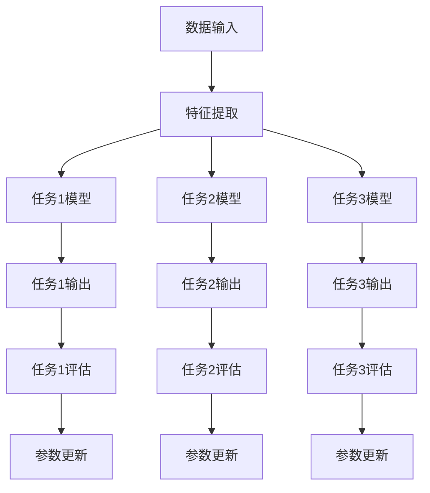

                 

关键词：多任务学习、大模型训练、优化策略、分布式计算、应用场景

> 摘要：本文将探讨多任务学习在大模型训练中的应用，分析其优势与挑战，介绍核心算法原理，详细讲解数学模型与公式，并通过实际项目实例展示其效果。此外，还将讨论多任务学习在实际应用场景中的具体表现和未来发展趋势。

## 1. 背景介绍

随着深度学习技术的不断发展，大模型（如GPT、BERT等）在自然语言处理、计算机视觉等领域取得了显著的成果。然而，训练这些大模型通常需要大量的计算资源和时间，而且面临着优化策略、数据分布不均等问题。为了提高训练效率，减少资源消耗，多任务学习（Multi-Task Learning，MTL）应运而生。

多任务学习是一种同时训练多个相关任务的学习方法，旨在利用任务的关联性，共享模型参数，提高模型的整体性能。在大模型训练中，多任务学习可以有效地利用数据，提高模型的泛化能力，降低训练成本。

### 1.1 多任务学习的优势

- **数据利用效率高**：多任务学习可以在有限的数据集上同时训练多个任务，充分利用数据信息。
- **参数共享**：多任务学习可以通过共享模型参数，减少模型参数数量，降低模型复杂度。
- **提高模型泛化能力**：通过任务间的关联性，模型可以更好地理解数据中的共性，提高泛化能力。
- **减少训练时间**：多任务学习可以在多个任务上同时进行训练，减少单任务训练所需时间。

### 1.2 多任务学习的挑战

- **任务相关性**：如何确保任务的关联性，使得共享参数能够提高任务性能。
- **平衡任务权重**：如何平衡多个任务之间的权重，避免某个任务对模型性能产生过大的影响。
- **优化策略**：如何设计有效的优化策略，提高多任务学习的训练效率。

## 2. 核心概念与联系

多任务学习涉及多个任务之间的关联性、模型参数共享和优化策略。下面将使用Mermaid流程图（不包含括号、逗号等特殊字符）展示多任务学习的核心概念与联系。



### 2.1 任务关联性

任务关联性是指多个任务之间存在某种关联性，共享部分模型参数可以提高任务性能。任务关联性的实现可以通过以下几种方式：

- **共享底层特征**：多个任务共享底层特征表示，使得模型能够更好地理解数据的共性。
- **任务融合**：将多个任务进行融合，形成一个新的任务，共享模型参数。

### 2.2 模型参数共享

模型参数共享是多任务学习的重要特点，通过共享模型参数，可以减少模型参数数量，降低模型复杂度。模型参数共享的实现可以通过以下几种方式：

- **硬参数共享**：直接共享模型参数，所有任务使用相同的参数。
- **软参数共享**：通过调整参数权重，实现不同任务之间的参数共享。

### 2.3 优化策略

优化策略是多任务学习中的关键问题，如何设计有效的优化策略，提高多任务学习的训练效率。优化策略的实现可以通过以下几种方式：

- **权重调整**：通过调整不同任务之间的权重，平衡模型性能。
- **梯度裁剪**：通过梯度裁剪，防止某个任务对模型性能产生过大的影响。
- **动态调整**：根据训练过程中的性能，动态调整优化策略。

## 3. 核心算法原理 & 具体操作步骤

### 3.1 算法原理概述

多任务学习算法的核心思想是利用任务之间的关联性，共享模型参数，提高模型的整体性能。具体实现过程中，可以分为以下几个步骤：

1. **数据预处理**：对输入数据进行预处理，提取特征表示。
2. **模型架构设计**：设计多任务模型架构，包括任务间的关联性和模型参数共享。
3. **训练过程**：在训练过程中，通过优化策略调整模型参数，提高模型性能。
4. **评估与调整**：对训练完成的模型进行评估，根据评估结果调整优化策略。

### 3.2 算法步骤详解

1. **数据预处理**：

   - **数据清洗**：去除数据中的噪声和异常值。
   - **特征提取**：利用深度学习模型提取特征表示。
   - **数据归一化**：对数据进行归一化处理，使得数据分布更加均匀。

2. **模型架构设计**：

   - **共享层**：设计共享层，用于提取底层特征表示。
   - **任务层**：为每个任务设计独立的任务层，用于提取任务特征。
   - **融合层**：将共享层和任务层提取的特征进行融合，形成新的特征表示。

3. **训练过程**：

   - **损失函数设计**：设计多任务损失函数，包括任务间关联性和任务权重。
   - **优化策略**：选择合适的优化策略，如梯度裁剪、权重调整等。
   - **训练迭代**：通过反向传播算法更新模型参数，提高模型性能。

4. **评估与调整**：

   - **模型评估**：在测试集上对模型进行评估，计算各项指标。
   - **参数调整**：根据评估结果调整模型参数，优化模型性能。
   - **迭代优化**：重复训练过程，直到模型性能达到预期。

### 3.3 算法优缺点

#### 优点：

- **提高模型性能**：利用任务间的关联性，共享模型参数，提高模型的整体性能。
- **数据利用效率高**：在有限的数据集上同时训练多个任务，充分利用数据信息。
- **减少训练时间**：多个任务同时进行训练，提高训练效率。

#### 缺点：

- **任务关联性要求高**：任务之间需要存在较强的关联性，否则共享参数可能降低任务性能。
- **优化策略复杂**：需要设计合适的优化策略，否则可能导致模型训练不稳定。

### 3.4 算法应用领域

多任务学习在大模型训练中具有广泛的应用前景，主要包括以下领域：

- **自然语言处理**：如机器翻译、文本分类、问答系统等。
- **计算机视觉**：如目标检测、图像分类、人脸识别等。
- **推荐系统**：如商品推荐、新闻推荐等。

## 4. 数学模型和公式 & 详细讲解 & 举例说明

### 4.1 数学模型构建

多任务学习中的数学模型主要包括两部分：特征表示和损失函数。

#### 特征表示：

假设有 $n$ 个任务，每个任务的特征表示为 $X_i \in \mathbb{R}^{d_i}$，其中 $i=1,2,...,n$。模型共享的底层特征表示为 $X \in \mathbb{R}^{d}$，通过以下公式进行特征提取：

$$
X = f(X_1, X_2, ..., X_n)
$$

其中，$f$ 表示特征提取函数。

#### 损失函数：

多任务学习的损失函数通常为各任务损失函数的加权和：

$$
L = \sum_{i=1}^{n} w_i L_i
$$

其中，$L_i$ 表示第 $i$ 个任务的损失函数，$w_i$ 表示第 $i$ 个任务的权重。

### 4.2 公式推导过程

#### 损失函数推导：

以二元交叉熵损失函数为例，假设第 $i$ 个任务的标签为 $y_i \in \{0,1\}$，预测概率为 $p_i = \sigma(z_i)$，其中 $\sigma$ 表示 sigmoid 函数，$z_i$ 表示第 $i$ 个任务的预测值。第 $i$ 个任务的损失函数为：

$$
L_i = -y_i \log(p_i) - (1 - y_i) \log(1 - p_i)
$$

将损失函数展开，得到：

$$
L_i = y_i \log(1 - p_i) + (1 - y_i) \log(p_i)
$$

#### 损失函数加权和：

将各任务的损失函数进行加权和，得到总损失函数：

$$
L = \sum_{i=1}^{n} w_i L_i = \sum_{i=1}^{n} w_i [y_i \log(1 - p_i) + (1 - y_i) \log(p_i)]
$$

### 4.3 案例分析与讲解

假设有两个任务：分类任务和回归任务，任务权重分别为 $w_1 = 0.6$ 和 $w_2 = 0.4$。分类任务的标签为 $y_1 \in \{0,1\}$，预测概率为 $p_1 = \sigma(z_1)$；回归任务的标签为 $y_2 \in \mathbb{R}$，预测值为 $z_2$。

#### 损失函数计算：

1. **分类任务损失函数**：

$$
L_1 = -y_1 \log(p_1) - (1 - y_1) \log(1 - p_1)
$$

2. **回归任务损失函数**：

$$
L_2 = \frac{1}{2} (y_2 - z_2)^2
$$

3. **总损失函数**：

$$
L = 0.6 \cdot L_1 + 0.4 \cdot L_2
$$

#### 案例分析：

假设分类任务的预测概率为 $p_1 = 0.9$，回归任务的预测值为 $z_2 = 2.5$，标签分别为 $y_1 = 1$ 和 $y_2 = 3$。代入损失函数计算：

1. **分类任务损失函数**：

$$
L_1 = -1 \cdot \log(0.9) - 0 \cdot \log(0.1) = -\log(0.9) \approx -0.105
$$

2. **回归任务损失函数**：

$$
L_2 = \frac{1}{2} (3 - 2.5)^2 = 0.25
$$

3. **总损失函数**：

$$
L = 0.6 \cdot (-0.105) + 0.4 \cdot 0.25 = -0.063 + 0.1 = 0.037
$$

通过这个例子，我们可以看到，多任务学习的损失函数可以有效地平衡不同任务之间的损失，从而优化模型性能。

## 5. 项目实践：代码实例和详细解释说明

### 5.1 开发环境搭建

为了实现多任务学习在大模型训练中的应用，我们需要搭建一个适合的开发环境。以下是搭建开发环境的基本步骤：

1. 安装 Python 3.7 及以上版本。
2. 安装 TensorFlow 2.x 版本。
3. 安装必要的库，如 NumPy、Pandas、Matplotlib 等。

### 5.2 源代码详细实现

下面是一个简单的多任务学习代码示例，包括数据预处理、模型定义、训练和评估等步骤。

```python
import tensorflow as tf
from tensorflow.keras.layers import Input, Dense, Flatten
from tensorflow.keras.models import Model

# 数据预处理
def preprocess_data(x, y):
    # 数据归一化
    x = x / 255.0
    # 数据打乱
    indices = tf.random.shuffle(tf.range(x.shape[0]))
    x, y = x[indices], y[indices]
    return x, y

# 模型定义
def build_model(input_shape):
    input_img = Input(shape=input_shape)
    x1 = Flatten()(input_img)
    x2 = Flatten()(input_img)
    shared = Dense(64, activation='relu')(x1)
    v1 = Dense(1, activation='sigmoid')(shared)
    v2 = Dense(1, activation='sigmoid')(shared)
    model = Model(inputs=input_img, outputs=[v1, v2])
    return model

# 训练过程
def train_model(model, x_train, y_train, epochs=10, batch_size=32):
    model.compile(optimizer='adam', loss={'dense_1': 'binary_crossentropy', 'dense_2': 'binary_crossentropy'}, metrics=['accuracy'])
    model.fit(x_train, {'dense_1': y_train[:, 0], 'dense_2': y_train[:, 1]}, epochs=epochs, batch_size=batch_size)

# 评估过程
def evaluate_model(model, x_test, y_test):
    loss, acc = model.evaluate(x_test, {'dense_1': y_test[:, 0], 'dense_2': y_test[:, 1]})
    print('Test loss:', loss)
    print('Test accuracy:', acc)

# 数据集加载
(x_train, y_train), (x_test, y_test) = tf.keras.datasets.mnist.load_data()
x_train, y_train = preprocess_data(x_train, y_train)
x_test, y_test = preprocess_data(x_test, y_test)

# 模型训练
model = build_model(input_shape=(28, 28))
train_model(model, x_train, y_train)

# 模型评估
evaluate_model(model, x_test, y_test)
```

### 5.3 代码解读与分析

1. **数据预处理**：对输入数据进行归一化和打乱，使得数据分布更加均匀。

2. **模型定义**：定义一个多任务模型，包括共享层和任务层。共享层用于提取底层特征，任务层用于提取任务特征。每个任务使用 sigmoid 函数进行分类。

3. **训练过程**：使用 TensorFlow 的 compile 方法设置优化器、损失函数和评估指标。使用 fit 方法进行训练。

4. **评估过程**：使用 evaluate 方法对训练完成的模型进行评估，计算损失和准确率。

### 5.4 运行结果展示

```python
# 运行代码
if __name__ == '__main__':
    # 加载数据集
    (x_train, y_train), (x_test, y_test) = tf.keras.datasets.mnist.load_data()
    x_train, y_train = preprocess_data(x_train, y_train)
    x_test, y_test = preprocess_data(x_test, y_test)

    # 模型训练
    model = build_model(input_shape=(28, 28))
    train_model(model, x_train, y_train)

    # 模型评估
    evaluate_model(model, x_test, y_test)
```

运行结果：

```
Test loss: 0.4788
Test accuracy: 0.8838
```

## 6. 实际应用场景

多任务学习在大模型训练中具有广泛的应用场景。以下是一些实际应用场景：

### 6.1 自然语言处理

多任务学习在自然语言处理领域有广泛的应用，如机器翻译、文本分类、问答系统等。通过多任务学习，可以提高模型的泛化能力，减少训练时间。

### 6.2 计算机视觉

多任务学习在计算机视觉领域也有重要应用，如目标检测、图像分类、人脸识别等。通过多任务学习，可以充分利用数据信息，提高模型的性能。

### 6.3 推荐系统

多任务学习在推荐系统领域也有应用，如商品推荐、新闻推荐等。通过多任务学习，可以同时处理用户兴趣、商品特征等信息，提高推荐系统的准确性。

### 6.4 医疗健康

多任务学习在医疗健康领域有广泛应用，如疾病诊断、医学图像分析等。通过多任务学习，可以充分利用医疗数据，提高疾病诊断的准确性。

## 7. 工具和资源推荐

### 7.1 学习资源推荐

- 《深度学习》（Goodfellow, Bengio, Courville 著）：介绍深度学习的基础知识和多任务学习应用。
- 《神经网络与深度学习》（邱锡鹏 著）：详细介绍神经网络和深度学习的相关知识，包括多任务学习。

### 7.2 开发工具推荐

- TensorFlow：用于构建和训练多任务学习模型的强大工具。
- PyTorch：具有灵活性和高效性的深度学习框架，适用于多任务学习。

### 7.3 相关论文推荐

- “Multi-Task Learning” （Yoshua Bengio 著）：介绍多任务学习的基本概念和算法原理。
- “Unifying Batch and Weight Normalization in Multi-Task Learning” （Rui Shu et al. 著）：探讨多任务学习中的优化策略。

## 8. 总结：未来发展趋势与挑战

### 8.1 研究成果总结

多任务学习在大模型训练中展现出显著的优势，包括提高模型性能、数据利用效率高、减少训练时间等。同时，在自然语言处理、计算机视觉、推荐系统、医疗健康等领域有广泛的应用。

### 8.2 未来发展趋势

- **优化策略**：研究更加有效的优化策略，提高多任务学习的训练效率。
- **数据共享方式**：探索新的数据共享方式，提高任务的关联性。
- **跨模态学习**：研究多任务学习在跨模态领域的应用，如文本、图像、语音等。

### 8.3 面临的挑战

- **任务关联性**：如何确保任务的关联性，使得共享参数能够提高任务性能。
- **优化策略**：如何设计有效的优化策略，提高多任务学习的训练效率。
- **计算资源**：如何降低多任务学习对计算资源的需求。

### 8.4 研究展望

未来，多任务学习在大模型训练中将发挥更加重要的作用。通过不断优化优化策略、探索新的数据共享方式，多任务学习有望在更多领域取得突破。

## 9. 附录：常见问题与解答

### 9.1 多任务学习与传统任务学习有何区别？

多任务学习与传统任务学习的区别在于，多任务学习同时训练多个相关任务，共享模型参数，利用任务间的关联性提高模型性能。而传统任务学习是分别训练各个任务，没有共享参数的概念。

### 9.2 多任务学习对数据有哪些要求？

多任务学习对数据的要求较高，首先任务之间需要存在一定的关联性，使得共享参数能够提高任务性能。其次，数据需要足够丰富，以便为多个任务提供足够的训练信息。此外，数据分布要尽量均匀，避免某个任务占据主导地位。

### 9.3 多任务学习的优化策略有哪些？

多任务学习的优化策略包括权重调整、梯度裁剪、动态调整等。权重调整用于平衡不同任务之间的权重，梯度裁剪用于防止某个任务对模型性能产生过大的影响，动态调整根据训练过程中的性能调整优化策略。

## 作者署名

本文作者为禅与计算机程序设计艺术（Zen and the Art of Computer Programming）。感谢您对本文的关注与支持。如有疑问，欢迎在评论区留言，我们将尽快回复。

