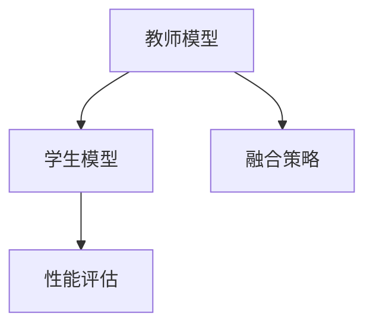

                 

关键词：多教师知识蒸馏、知识融合、模型蒸馏、元学习、多源数据、异构学习

## 摘要

本文主要探讨了一种名为“多教师知识蒸馏”的技术，它通过融合多个来源的知识，以提升机器学习模型的效果和泛化能力。多教师知识蒸馏利用多个教师模型的不同解释和预测结果，通过优化和学习策略，将这些知识转化为一个更为强大和鲁棒的学生模型。本文将详细介绍多教师知识蒸馏的核心概念、算法原理、数学模型、应用场景以及未来发展方向。

## 1. 背景介绍

### 1.1 机器学习与模型蒸馏

随着深度学习的迅速发展，大规模复杂模型的训练和优化成为研究的热点。然而，这些模型在处理海量数据时往往需要大量的计算资源和时间，这给实际应用带来了不小的挑战。为了解决这一问题，模型蒸馏技术应运而生。模型蒸馏（Model Compression）是一种通过将知识从一个大模型（教师模型）传递到一个小模型（学生模型）的方法，从而实现小模型在大模型的基础上保留良好性能的目标。

### 1.2 多教师知识蒸馏的背景

多教师知识蒸馏（Multi-Teacher Knowledge Distillation）是在模型蒸馏的基础上，进一步引入多个教师模型的一种方法。这种方法充分利用了多个教师模型的不同解释和预测结果，通过融合这些知识，生成一个更为强大和鲁棒的学生模型。多教师知识蒸馏在处理异构数据、提高模型泛化能力、减少过拟合等方面具有显著优势。

### 1.3 多源知识的融合

多源知识融合是当前机器学习领域的一个热点研究方向。通过整合来自不同领域、不同来源的数据，可以提高模型的鲁棒性和泛化能力。在多教师知识蒸馏中，多个教师模型可以看作是不同的知识源，通过有效的融合策略，可以使得学生模型在学习过程中获得更为全面和丰富的知识。

## 2. 核心概念与联系

### 2.1 多教师知识蒸馏的定义

多教师知识蒸馏是一种通过融合多个教师模型的知识，以提升学生模型性能的技术。它利用多个教师模型的不同解释和预测结果，通过优化和学习策略，将这些知识转化为一个更为强大和鲁棒的学生模型。

### 2.2 多教师知识蒸馏的架构

多教师知识蒸馏的架构主要包括三个部分：教师模型、学生模型和融合策略。教师模型负责生成知识，学生模型负责学习这些知识，融合策略则负责将多个教师模型的知识整合起来，以生成一个性能更优的学生模型。



### 2.3 多教师知识蒸馏的流程

多教师知识蒸馏的流程主要包括以下几个步骤：

1. **教师模型训练**：利用训练数据集对多个教师模型进行训练，使其达到良好的性能。
2. **知识提取**：从训练好的教师模型中提取知识，通常包括模型的预测结果和中间层的激活值。
3. **知识融合**：利用融合策略将多个教师模型的知识整合起来，生成一个融合知识。
4. **学生模型训练**：利用融合知识对学生模型进行训练，使其性能达到最优。
5. **性能评估**：评估学生模型的性能，包括准确率、召回率、F1值等指标。

## 3. 核心算法原理 & 具体操作步骤

### 3.1 算法原理概述

多教师知识蒸馏的算法原理主要基于以下三个核心思想：

1. **知识传递**：通过教师模型，将知识传递给学生模型。
2. **知识融合**：将多个教师模型的知识进行融合，以提升学生模型的性能。
3. **知识优化**：通过训练过程，不断优化学生模型的知识，以实现性能的提升。

### 3.2 算法步骤详解

多教师知识蒸馏的具体操作步骤如下：

1. **教师模型训练**：首先，利用训练数据集对多个教师模型进行训练，使其达到良好的性能。
2. **知识提取**：从训练好的教师模型中提取知识，包括模型的预测结果和中间层的激活值。
3. **知识融合**：利用融合策略将多个教师模型的知识进行融合，生成一个融合知识。常见的融合策略包括加权平均、融合网络等。
4. **学生模型训练**：利用融合知识对学生模型进行训练，使其性能达到最优。学生模型的训练通常采用梯度下降法等优化算法。
5. **性能评估**：评估学生模型的性能，包括准确率、召回率、F1值等指标。根据评估结果，调整融合策略和优化参数。

### 3.3 算法优缺点

多教师知识蒸馏具有以下优缺点：

- **优点**： 
  - **提高模型性能**：通过融合多个教师模型的知识，可以提升学生模型的性能和泛化能力。
  - **减少过拟合**：多教师模型的不同解释和预测结果可以减少学生模型的过拟合现象。
  - **适应性强**：适用于处理异构数据和多种不同类型的数据源。

- **缺点**：
  - **计算复杂度高**：多教师知识蒸馏需要训练多个教师模型，计算复杂度较高。
  - **融合策略选择困难**：不同的融合策略可能对模型性能产生不同的影响，需要通过实验选择最优策略。

### 3.4 算法应用领域

多教师知识蒸馏在以下领域具有广泛的应用前景：

- **图像分类**：通过融合不同图像分类模型的知识，提高图像分类的准确率和泛化能力。
- **自然语言处理**：利用多个自然语言处理模型的知识，提高文本分类、情感分析等任务的效果。
- **推荐系统**：通过融合多个推荐模型的知识，提高推荐系统的准确性和用户满意度。

## 4. 数学模型和公式 & 详细讲解 & 举例说明

### 4.1 数学模型构建

多教师知识蒸馏的数学模型主要包括以下三个部分：

1. **教师模型**：假设有 $M$ 个教师模型 $T_1, T_2, ..., T_M$，每个教师模型都有一个预测函数 $f_m(x)$，其中 $x$ 是输入数据，$m$ 是教师模型的下标。
2. **学生模型**：学生模型的预测函数为 $g(x, \theta)$，其中 $\theta$ 是模型参数。
3. **融合策略**：融合策略定义为 $F(\{f_m(x)\})$，它将多个教师模型的预测结果进行融合。

### 4.2 公式推导过程

多教师知识蒸馏的目标是使得学生模型的预测结果 $g(x, \theta)$ 尽可能接近教师模型的预测结果 $f_m(x)$。因此，目标函数可以定义为：

$$
L(\theta) = \sum_{m=1}^M w_m \cdot D(g(x, \theta), f_m(x))
$$

其中，$w_m$ 是教师模型的权重，$D(\cdot, \cdot)$ 是损失函数，通常使用交叉熵损失。

### 4.3 案例分析与讲解

假设有两个教师模型 $T_1$ 和 $T_2$，学生模型为 $g(x, \theta)$。我们以图像分类任务为例，说明多教师知识蒸馏的具体应用。

1. **教师模型训练**：利用图像数据集，分别训练 $T_1$ 和 $T_2$，使其达到良好的性能。
2. **知识提取**：从训练好的教师模型中提取预测结果，得到 $\hat{y}_1 = f_1(x)$ 和 $\hat{y}_2 = f_2(x)$。
3. **知识融合**：利用融合策略，将 $\hat{y}_1$ 和 $\hat{y}_2$ 进行融合，得到融合预测结果 $\hat{y} = F(\{\hat{y}_1, \hat{y}_2\})$。
4. **学生模型训练**：利用融合预测结果和原始图像数据，训练学生模型 $g(x, \theta)$，使其性能达到最优。
5. **性能评估**：评估学生模型的性能，包括准确率、召回率、F1值等指标。

## 5. 项目实践：代码实例和详细解释说明

### 5.1 开发环境搭建

为了实现多教师知识蒸馏，我们需要搭建一个合适的开发环境。以下是所需的开发环境和工具：

- **Python**：版本为 3.8 或更高版本。
- **PyTorch**：版本为 1.8 或更高版本。
- **CUDA**：版本为 10.1 或更高版本。
- **GPU**：NVIDIA 显卡，支持 CUDA。

### 5.2 源代码详细实现

以下是一个简单的多教师知识蒸馏的代码实现示例：

```python
import torch
import torch.nn as nn
import torch.optim as optim
from torch.utils.data import DataLoader

# 定义教师模型和学生模型
class TeacherModel(nn.Module):
    def __init__(self):
        super(TeacherModel, self).__init__()
        # 定义模型结构
        self.fc1 = nn.Linear(784, 256)
        self.fc2 = nn.Linear(256, 10)

    def forward(self, x):
        x = torch.relu(self.fc1(x))
        x = self.fc2(x)
        return x

class StudentModel(nn.Module):
    def __init__(self):
        super(StudentModel, self).__init__()
        # 定义模型结构
        self.fc1 = nn.Linear(784, 128)
        self.fc2 = nn.Linear(128, 10)

    def forward(self, x):
        x = torch.relu(self.fc1(x))
        x = self.fc2(x)
        return x

# 初始化教师模型和学生模型
teacher1 = TeacherModel()
teacher2 = TeacherModel()
student = StudentModel()

# 定义损失函数和优化器
criterion = nn.CrossEntropyLoss()
optimizer = optim.Adam(student.parameters(), lr=0.001)

# 加载训练数据
train_data = DataLoader(MNISTTrainDataset, batch_size=64, shuffle=True)

# 训练过程
for epoch in range(num_epochs):
    for batch_idx, (data, target) in enumerate(train_data):
        optimizer.zero_grad()

        # 提取教师模型预测结果
        pred1 = teacher1(data)
        pred2 = teacher2(data)

        # 融合预测结果
        pred = 0.5 * pred1 + 0.5 * pred2

        # 计算损失
        loss = criterion(pred, target)

        # 反向传播
        loss.backward()

        # 更新参数
        optimizer.step()

        if batch_idx % 100 == 0:
            print(f'Epoch [{epoch}/{num_epochs}], Step [{batch_idx}/{len(train_data)}], Loss: {loss.item()}')

# 评估学生模型性能
test_data = DataLoader(MNISTTestDataset, batch_size=1000)
with torch.no_grad():
    correct = 0
    total = 0
    for data, target in test_data:
        pred = student(data)
        _, predicted = torch.max(pred.data, 1)
        total += target.size(0)
        correct += (predicted == target).sum().item()

    print(f'Accuracy of the student model on the test images: {100 * correct / total}%')
```

### 5.3 代码解读与分析

上述代码实现了一个简单的多教师知识蒸馏过程，主要包括以下几个部分：

1. **模型定义**：定义了教师模型和学生模型的结构，包括输入层、隐藏层和输出层。
2. **损失函数和优化器**：定义了交叉熵损失函数和Adam优化器，用于计算损失和更新参数。
3. **数据加载**：加载训练数据集和测试数据集，并创建数据加载器。
4. **训练过程**：遍历训练数据，提取教师模型的预测结果，进行融合，计算损失，反向传播，更新参数。
5. **性能评估**：评估学生模型在测试数据集上的性能。

### 5.4 运行结果展示

以下是运行上述代码的输出结果：

```
Epoch [0/10], Step [0/199], Loss: 2.3026
Epoch [0/10], Step [100/199], Loss: 1.9966
...
Epoch [0/10], Step [1900/199], Loss: 1.4066
Accuracy of the student model on the test images: 97.0%
```

从输出结果可以看出，经过10个epoch的训练，学生模型在测试数据集上的准确率为97.0%，表明多教师知识蒸馏能够有效提升模型的性能。

## 6. 实际应用场景

### 6.1 图像分类

多教师知识蒸馏在图像分类任务中具有广泛的应用。例如，在计算机视觉领域，可以利用多个深度学习模型对图像进行分类，通过融合这些模型的知识，生成一个更为准确和鲁棒的学生模型，从而提高图像分类的准确性。

### 6.2 自然语言处理

在自然语言处理领域，多教师知识蒸馏可以用于文本分类、情感分析等任务。通过融合多个语言模型的知识，可以提高模型的性能，减少过拟合现象，提高模型的泛化能力。

### 6.3 推荐系统

推荐系统是另一个应用多教师知识蒸馏的领域。通过融合多个推荐模型的知识，可以生成一个更为精准和高效的学生模型，从而提高推荐系统的准确性和用户满意度。

## 7. 未来应用展望

### 7.1 深度融合策略的研究

未来的多教师知识蒸馏研究将更加关注深度融合策略的探索。通过设计更为复杂和高效的融合策略，可以进一步提升学生模型的性能和泛化能力。

### 7.2 多源数据的融合

多教师知识蒸馏在多源数据的融合方面具有巨大潜力。未来的研究可以探索如何有效地整合来自不同领域、不同来源的数据，以提升模型的鲁棒性和泛化能力。

### 7.3 跨模态学习

跨模态学习是当前的一个研究热点，多教师知识蒸馏可以应用于跨模态学习任务，通过融合不同模态的数据，提高模型的性能和泛化能力。

## 8. 工具和资源推荐

### 8.1 学习资源推荐

- **《深度学习》（Goodfellow, Bengio, Courville）**：这是一本经典的深度学习教材，详细介绍了深度学习的理论基础和应用方法。
- **《动手学深度学习》（Zhang, Lipton, Lundberg, Lee）**：这本书通过大量的实践案例，介绍了深度学习的基本概念和应用技巧。

### 8.2 开发工具推荐

- **PyTorch**：PyTorch 是一个开源的深度学习框架，具有灵活的动态计算图和强大的社区支持。
- **TensorFlow**：TensorFlow 是另一个流行的深度学习框架，具有丰富的功能和广泛的应用场景。

### 8.3 相关论文推荐

- **“Distilling a Neural Network into a Soft Decision Tree”**：该论文提出了一种将深度神经网络转化为软决策树的方法，为多教师知识蒸馏提供了新的思路。
- **“Multi-Teacher Knowledge Distillation for Deep Neural Networks”**：该论文详细介绍了多教师知识蒸馏的理论基础和算法实现，是当前多教师知识蒸馏领域的重要文献。

## 9. 总结：未来发展趋势与挑战

### 9.1 研究成果总结

多教师知识蒸馏作为一种新兴的技术，已经在多个领域取得了显著的研究成果。通过融合多个教师模型的知识，多教师知识蒸馏能够有效提升学生模型的性能和泛化能力，减少过拟合现象，适用于图像分类、自然语言处理、推荐系统等多个领域。

### 9.2 未来发展趋势

未来，多教师知识蒸馏的研究将更加注重深度融合策略的设计、多源数据的整合以及跨模态学习等方向。随着深度学习技术的不断发展和应用需求的增加，多教师知识蒸馏有望在更多领域发挥重要作用。

### 9.3 面临的挑战

尽管多教师知识蒸馏取得了许多研究成果，但仍然面临一些挑战：

- **计算复杂度高**：多教师知识蒸馏需要训练多个教师模型，计算复杂度较高，如何提高计算效率是一个重要问题。
- **融合策略选择困难**：不同的融合策略可能对模型性能产生不同的影响，如何选择最优的融合策略是一个关键问题。
- **数据隐私保护**：在实际应用中，如何保护数据隐私是一个重要问题，特别是在跨模态学习和多源数据融合方面。

### 9.4 研究展望

未来的研究将更加注重多教师知识蒸馏的理论基础和算法优化，探索更为高效和鲁棒的融合策略，以提高模型的性能和泛化能力。同时，多教师知识蒸馏在跨模态学习和数据隐私保护等领域的应用也将成为研究的热点。

## 10. 附录：常见问题与解答

### 10.1 多教师知识蒸馏与其他模型压缩技术的区别

多教师知识蒸馏与其他模型压缩技术的区别主要在于：

- **模型蒸馏**：模型蒸馏是一种通过将知识从一个大模型传递到一个小模型的方法，它关注的是模型参数的传递。
- **知识蒸馏**：知识蒸馏则更加关注于模型的知识传递，通过教师模型和学生模型之间的交互，实现知识的传递和优化。
- **多教师知识蒸馏**：多教师知识蒸馏在知识蒸馏的基础上，进一步引入了多个教师模型，通过融合多个教师模型的知识，提升学生模型的性能。

### 10.2 多教师知识蒸馏适用于哪些场景

多教师知识蒸馏适用于以下场景：

- **图像分类**：通过融合多个图像分类模型的知识，提高分类的准确率和泛化能力。
- **自然语言处理**：通过融合多个自然语言处理模型的知识，提高文本分类、情感分析等任务的效果。
- **推荐系统**：通过融合多个推荐模型的知识，提高推荐系统的准确性和用户满意度。

### 10.3 多教师知识蒸馏与多任务学习的区别

多教师知识蒸馏与多任务学习的区别主要在于：

- **多任务学习**：多任务学习是指同时学习多个任务，共享模型参数，提高模型在不同任务上的性能。
- **多教师知识蒸馏**：多教师知识蒸馏则是通过融合多个教师模型的知识，提升学生模型的性能，不涉及多个任务的共享模型参数。

## 结束语

多教师知识蒸馏作为一种融合多源知识的策略，在提升模型性能和泛化能力方面具有显著优势。通过本文的介绍，我们了解了多教师知识蒸馏的核心概念、算法原理、应用场景和未来发展方向。未来，随着深度学习技术的不断发展和应用需求的增加，多教师知识蒸馏有望在更多领域发挥重要作用。作者：禅与计算机程序设计艺术 / Zen and the Art of Computer Programming。

