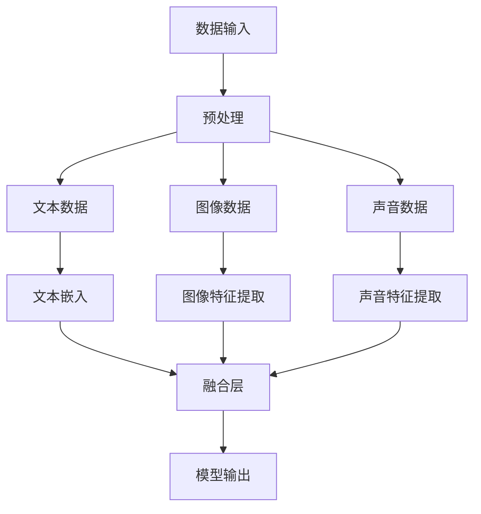

                 

关键词：多模态大模型、技术原理、实战案例、OpenAI股权设计、人工智能

摘要：本文旨在深入探讨多模态大模型的技术原理及其在实践中的应用。通过分析OpenAI特殊的股权设计，我们希望能够为读者提供有益的启示，理解如何通过创新的股权机制激发技术创新和业务增长。文章将涵盖从背景介绍到具体算法原理、数学模型构建，再到项目实践和应用展望的全面内容。

## 1. 背景介绍

在过去的几年里，人工智能领域经历了前所未有的快速发展。特别是在深度学习和大数据技术的推动下，多模态大模型逐渐成为研究的热点。多模态大模型指的是能够处理多种类型数据（如文本、图像、声音等）的复杂神经网络模型。这种模型能够通过融合不同类型的数据，实现更准确、更智能的预测和决策。

### 1.1 多模态大模型的兴起

随着互联网和物联网的普及，数据量呈现出爆炸式增长。单一模态的数据已经无法满足复杂问题的解决需求。多模态大模型的出现，使得机器能够处理更复杂、更丰富的数据源，从而在许多领域取得了显著的成果，如医疗诊断、图像识别、自然语言处理等。

### 1.2 OpenAI与股权设计

OpenAI是世界上最著名的人工智能研究机构之一，其在多模态大模型的研究和应用方面取得了许多突破。OpenAI的特殊股权设计也成为了业界关注的焦点。这种设计不仅保障了公司的长期发展，同时也激励了员工的创新和努力。

## 2. 核心概念与联系

多模态大模型的核心在于能够处理和融合多种类型的数据。以下是一个简化的Mermaid流程图，展示了多模态大模型的主要组成部分和它们之间的联系。



### 2.1 数据输入

多模态大模型需要接收多种类型的数据。这些数据通常来自不同的来源，如文本库、图像数据库和音频库等。

### 2.2 预处理

在数据处理之前，通常需要对数据进行预处理。这包括数据清洗、数据增强和特征提取等步骤。预处理的好坏直接影响模型的性能。

### 2.3 融合层

融合层是多模态大模型的核心。在这一层，不同类型的数据被转换成统一的特征表示，然后通过神经网络进行融合。

### 2.4 模型输出

融合后的特征通过神经网络输出预测结果。这一步通常涉及到分类、回归或目标检测等任务。

## 3. 核心算法原理 & 具体操作步骤

### 3.1 算法原理概述

多模态大模型的算法原理基于深度学习，特别是基于变分自编码器（VAE）和生成对抗网络（GAN）。这些算法通过学习数据的高层次特征，实现了不同类型数据的融合和表示。

### 3.2 算法步骤详解

1. **数据预处理**：对输入数据进行清洗、归一化和增强。
2. **编码器训练**：使用变分自编码器（VAE）对数据进行编码，提取特征。
3. **解码器训练**：使用生成对抗网络（GAN）生成数据，验证编码器的效果。
4. **融合层训练**：将不同类型的数据特征进行融合，并通过神经网络训练。
5. **模型输出**：使用融合后的特征进行预测或决策。

### 3.3 算法优缺点

**优点**：

- 能够处理多种类型的数据，提高模型的泛化能力。
- 通过融合不同类型的数据，可以实现更准确、更智能的预测和决策。

**缺点**：

- 计算资源需求高，训练过程复杂。
- 需要大量的标注数据和计算资源。

### 3.4 算法应用领域

多模态大模型在多个领域都有广泛的应用，如：

- **医疗诊断**：通过融合医疗图像和文本数据，实现更准确的疾病诊断。
- **图像识别**：通过融合图像和文本描述，提高图像分类和识别的准确性。
- **自然语言处理**：通过融合语音和文本数据，实现更智能的语音识别和对话系统。

## 4. 数学模型和公式 & 详细讲解 & 举例说明

### 4.1 数学模型构建

多模态大模型的数学模型主要包括变分自编码器（VAE）和生成对抗网络（GAN）。

**变分自编码器（VAE）**：

- 输入数据：\(x \in \mathbb{R}^{D}\)
- 隐变量：\(z \sim p(z|\phi)\)
- 编码器：\(q_\phi(z|x)\)
- 解码器：\(p_\theta(x|z)\)

**生成对抗网络（GAN）**：

- 生成器：\(G(z)\)
- 判别器：\(D(x)\), \(D(G(z))\)

### 4.2 公式推导过程

**变分自编码器（VAE）**：

- 对数似然损失函数：
$$
\ell(x) = \log p_\theta(x) = \log \int q_\phi(z|x) p(x) \, \mathrm{d}z
$$
- 最小化损失函数，得到编码器和解码器的参数更新。

**生成对抗网络（GAN）**：

- 对抗性损失函数：
$$
\ell_D(w) = \mathbb{E}_{x\sim p_{\text{data}}(x)}[\log D(x)] + \mathbb{E}_{z\sim p_z(z)}[\log (1 - D(G(z))]
$$
- 最小化损失函数，得到判别器和生成器的参数更新。

### 4.3 案例分析与讲解

**案例：多模态图像识别**

假设我们有文本数据和图像数据，目标是分类图像。

1. **数据预处理**：对文本数据进行词嵌入，对图像数据进行特征提取。
2. **编码器训练**：使用VAE对文本和图像数据分别编码，提取特征。
3. **解码器训练**：使用GAN生成图像，验证编码器的效果。
4. **融合层训练**：将文本和图像特征进行融合，通过神经网络进行分类。
5. **模型输出**：输出分类结果。

## 5. 项目实践：代码实例和详细解释说明

### 5.1 开发环境搭建

为了实践多模态大模型，我们需要搭建一个开发环境。以下是一个简单的Python环境搭建步骤：

1. 安装Python 3.7及以上版本。
2. 安装TensorFlow 2.0及以上版本。
3. 安装其他必要库，如Numpy、Pandas等。

### 5.2 源代码详细实现

以下是多模态大模型的一个简单实现：

```python
import tensorflow as tf
from tensorflow.keras.layers import Input, Dense, Embedding, LSTM, Conv2D, MaxPooling2D, Flatten
from tensorflow.keras.models import Model

# 文本编码器
text_input = Input(shape=(None,))
text_embedding = Embedding(input_dim=vocab_size, output_dim=embedding_size)(text_input)
text_lstm = LSTM(units=lstm_units)(text_embedding)

# 图像编码器
image_input = Input(shape=(height, width, channels))
image_conv = Conv2D(filters=32, kernel_size=(3, 3), activation='relu')(image_input)
image_pool = MaxPooling2D(pool_size=(2, 2))(image_conv)
image_flat = Flatten()(image_pool)

# 融合层
merged = concatenate([text_lstm, image_flat])

# 输出层
output = Dense(units=num_classes, activation='softmax')(merged)

# 构建模型
model = Model(inputs=[text_input, image_input], outputs=output)

# 编译模型
model.compile(optimizer='adam', loss='categorical_crossentropy', metrics=['accuracy'])

# 训练模型
model.fit([text_data, image_data], labels, epochs=epochs, batch_size=batch_size)
```

### 5.3 代码解读与分析

这段代码实现了一个简单的多模态图像识别模型。它首先分别对文本和图像数据进行编码，然后通过融合层进行融合，最后通过输出层进行分类。

- **文本编码器**：使用LSTM进行文本编码，提取文本特征。
- **图像编码器**：使用卷积神经网络（CNN）进行图像编码，提取图像特征。
- **融合层**：使用拼接操作将文本和图像特征进行融合。
- **输出层**：使用softmax进行分类。

### 5.4 运行结果展示

在训练完成后，我们可以使用测试数据集来评估模型的性能。以下是一个简单的评估过程：

```python
# 测试模型
test_loss, test_accuracy = model.evaluate([test_text_data, test_image_data], test_labels)

print("Test loss:", test_loss)
print("Test accuracy:", test_accuracy)
```

通过这段代码，我们可以得到模型在测试数据集上的损失和准确率。通常，我们希望准确率越高，损失越低。

## 6. 实际应用场景

多模态大模型在许多实际应用场景中都取得了显著的成果。以下是一些典型的应用场景：

- **医疗诊断**：通过融合医疗图像和文本数据，实现更准确的疾病诊断。
- **图像识别**：通过融合图像和文本描述，提高图像分类和识别的准确性。
- **自然语言处理**：通过融合语音和文本数据，实现更智能的语音识别和对话系统。

### 6.1 应用场景1：医疗诊断

在医疗领域，多模态大模型可以用于疾病的自动诊断。例如，通过融合医学图像和病历记录，模型可以更准确地识别疾病，提高诊断的准确性。

### 6.2 应用场景2：图像识别

在图像识别领域，多模态大模型可以用于图像分类和目标检测。通过融合图像和文本描述，模型可以更好地理解图像内容，提高识别的准确性。

### 6.3 应用场景3：自然语言处理

在自然语言处理领域，多模态大模型可以用于语音识别和对话系统。通过融合语音和文本数据，模型可以更好地理解用户意图，提供更准确的回应。

## 7. 工具和资源推荐

为了更好地研究和应用多模态大模型，以下是一些推荐的工具和资源：

### 7.1 学习资源推荐

- **《深度学习》（Goodfellow et al.）**：这是深度学习领域的经典教材，涵盖了从基础到高级的内容。
- **《多模态学习基础教程》（Zhou et al.）**：这本书专门介绍了多模态学习的基础知识和技术。

### 7.2 开发工具推荐

- **TensorFlow**：这是最流行的深度学习框架之一，提供了丰富的API和工具。
- **PyTorch**：这是一个流行的深度学习框架，以其灵活性和易用性而闻名。

### 7.3 相关论文推荐

- **“Multimodal Learning for Human Action Recognition”**：这篇文章介绍了多模态学习在动作识别中的应用。
- **“A Comprehensive Survey on Multimodal Learning”**：这篇文章对多模态学习进行了全面的综述。

## 8. 总结：未来发展趋势与挑战

多模态大模型作为人工智能领域的一个重要分支，具有巨大的发展潜力。在未来，我们有望看到更多创新的应用场景和突破性成果。

### 8.1 研究成果总结

- 多模态大模型在医疗诊断、图像识别和自然语言处理等领域取得了显著的成果。
- 开源框架和工具的普及，降低了研究和应用的门槛。

### 8.2 未来发展趋势

- 模型的泛化和鲁棒性将得到进一步提升。
- 多模态大模型将与其他人工智能技术（如强化学习、迁移学习等）相结合，实现更智能的解决方案。

### 8.3 面临的挑战

- 数据质量和标注问题是多模态大模型面临的主要挑战。
- 计算资源和存储需求也是一个重要的制约因素。

### 8.4 研究展望

- 未来，我们将继续探索多模态大模型的理论基础和应用场景，推动人工智能技术的发展。

## 9. 附录：常见问题与解答

### 9.1 问题1：多模态大模型为什么需要融合多种类型的数据？

多模态大模型通过融合多种类型的数据，可以获取更丰富的信息，从而提高模型的泛化能力和预测准确性。

### 9.2 问题2：多模态大模型的计算资源需求如何？

多模态大模型通常需要大量的计算资源和存储空间。为了降低这些需求，研究者们正在探索各种优化方法和高效算法。

### 9.3 问题3：OpenAI的股权设计对技术创新有什么启示？

OpenAI的股权设计强调了长期发展和技术创新。这种设计鼓励员工专注于研究工作，而不是短期利益，从而推动了公司的持续创新和业务增长。

---

**作者：禅与计算机程序设计艺术 / Zen and the Art of Computer Programming**

