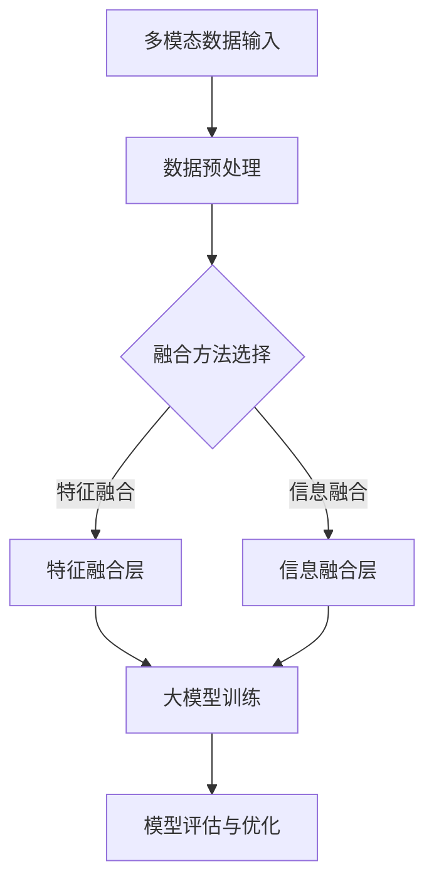

                 

关键词：多模态、大模型、技术原理、实战、方法论

摘要：本文将深入探讨多模态大模型的技术原理与实战方法，从背景介绍到核心概念，再到算法原理、数学模型、项目实践，最后展望未来发展趋势与挑战。希望通过本文，读者能够全面了解多模态大模型的技术要点，掌握实战技巧，为未来的研究和应用奠定基础。

## 1. 背景介绍

在当今快速发展的信息技术时代，数据的多样性和复杂性不断增长。传统的单模态数据处理方法，如图像、文本或音频处理，已经难以应对这些复杂的数据场景。为了解决这个问题，多模态大模型应运而生。多模态大模型通过整合不同类型的数据，如文本、图像、音频和视频，实现对复杂任务的建模和解决。

多模态大模型的应用场景广泛，包括但不限于医疗诊断、自动驾驶、智能客服和虚拟现实等领域。例如，在医疗诊断中，多模态大模型可以整合病人的医学图像、病历记录和基因数据，提高诊断的准确性和效率。在自动驾驶中，多模态大模型可以通过整合摄像头、激光雷达和雷达数据，提高车辆对环境的感知能力，从而提高驾驶安全性。

随着人工智能技术的不断发展，多模态大模型的研究和应用已经成为学术界和工业界的热点。本文将介绍多模态大模型的技术原理和实战方法，帮助读者深入理解这一领域，掌握相关的技术和应用技巧。

## 2. 核心概念与联系

### 2.1 多模态

多模态（Multimodality）是指同时使用多种感官通道（如视觉、听觉、触觉等）来获取和处理信息。在人工智能领域，多模态通常指的是将不同类型的数据（如文本、图像、音频、视频等）进行整合和融合，以实现更强大的建模和决策能力。

### 2.2 大模型

大模型（Large-scale Model）是指参数规模巨大的机器学习模型。这些模型通常需要大量的数据来进行训练，并通过优化算法来调整模型的参数，以提高模型的性能和泛化能力。

### 2.3 融合技术

融合技术（Fusion Technology）是指将不同类型的数据进行整合和融合的方法。在多模态大模型中，融合技术是非常重要的，它决定了不同模态数据的交互和融合方式，从而影响模型的性能和效果。

### 2.4 Mermaid 流程图

下面是一个简单的 Mermaid 流程图，展示了多模态大模型的核心概念和联系：



## 3. 核心算法原理 & 具体操作步骤

### 3.1 算法原理概述

多模态大模型的算法原理主要涉及以下几个方面：

1. **数据预处理**：对不同类型的数据进行预处理，包括数据清洗、归一化、特征提取等。
2. **融合方法选择**：根据应用场景和数据特点，选择合适的融合方法，如特征融合、信息融合等。
3. **特征融合层**：将不同模态的特征进行融合，生成新的特征表示。
4. **信息融合层**：将融合后的特征进行进一步融合，形成统一的特征表示。
5. **大模型训练**：使用融合后的特征进行模型训练，通过优化算法调整模型参数。
6. **模型评估与优化**：对训练好的模型进行评估，并根据评估结果进行优化。

### 3.2 算法步骤详解

1. **数据预处理**：

   - 文本数据：进行文本清洗、分词、词性标注等预处理操作。
   - 图像数据：进行图像去噪、增强、分割等预处理操作。
   - 音频数据：进行音频降噪、特征提取等预处理操作。

2. **融合方法选择**：

   - 特征融合：将不同模态的特征进行拼接或加权融合。
   - 信息融合：将不同模态的信息进行交互和融合，如注意力机制、图神经网络等。

3. **特征融合层**：

   - 使用神经网络架构，如卷积神经网络（CNN）、循环神经网络（RNN）等，对融合后的特征进行编码和表示。

4. **信息融合层**：

   - 使用多层感知机（MLP）、门控循环单元（GRU）、长短期记忆网络（LSTM）等神经网络结构，对融合后的特征进行进一步融合。

5. **大模型训练**：

   - 使用梯度下降、Adam等优化算法，对模型参数进行更新。
   - 使用交叉熵、均方误差等损失函数，对模型进行训练。

6. **模型评估与优化**：

   - 使用准确率、召回率、F1分数等指标，对模型进行评估。
   - 根据评估结果，调整模型结构、参数等，进行优化。

### 3.3 算法优缺点

#### 优点：

- **提高模型性能**：通过融合多种模态的数据，可以提高模型的性能和泛化能力。
- **应对复杂任务**：多模态大模型可以应对更复杂的任务，如情感分析、图像识别、语音识别等。
- **丰富的应用场景**：多模态大模型在医疗诊断、自动驾驶、智能客服等领域有广泛的应用。

#### 缺点：

- **计算资源消耗**：多模态大模型通常需要大量的计算资源和存储空间。
- **模型复杂度高**：多模态大模型的复杂度高，调试和优化难度较大。
- **数据同步问题**：不同模态的数据可能在时间和空间上存在差异，如何有效地同步这些数据是挑战之一。

### 3.4 算法应用领域

多模态大模型在以下领域有广泛的应用：

- **医疗诊断**：通过整合病人的医学图像、病历记录和基因数据，提高诊断的准确性和效率。
- **自动驾驶**：通过整合摄像头、激光雷达和雷达数据，提高车辆对环境的感知能力，从而提高驾驶安全性。
- **智能客服**：通过整合用户的文本、语音和图像数据，提高客服系统的智能化和人性化程度。
- **虚拟现实**：通过整合用户的视觉、听觉和触觉数据，提高虚拟现实体验的沉浸感和真实性。

## 4. 数学模型和公式 & 详细讲解 & 举例说明

### 4.1 数学模型构建

多模态大模型的数学模型通常由以下几个部分组成：

1. **特征提取器**：用于提取不同模态的特征表示。
2. **融合层**：用于将不同模态的特征进行融合。
3. **分类器**：用于对融合后的特征进行分类。

### 4.2 公式推导过程

下面以一个简单的多模态大模型为例，介绍数学模型的推导过程。

假设我们有两个模态的数据：图像（X_image）和文本（X_text）。我们分别使用两个神经网络来提取这两个模态的特征表示：

$$
\text{特征提取器}_{\text{image}}(X_{\text{image}}) = f_{\text{image}}(X_{\text{image}})
$$

$$
\text{特征提取器}_{\text{text}}(X_{\text{text}}) = f_{\text{text}}(X_{\text{text}})
$$

其中，$f_{\text{image}}$ 和 $f_{\text{text}}$ 分别表示图像和文本的特征提取函数。

接下来，我们将这两个特征表示进行融合：

$$
\text{融合层}([f_{\text{image}}(X_{\text{image}}), f_{\text{text}}(X_{\text{text}})]) = f_{\text{fusion}}([f_{\text{image}}(X_{\text{image}}), f_{\text{text}}(X_{\text{text}})])
$$

其中，$f_{\text{fusion}}$ 表示融合函数。

最后，我们使用分类器对融合后的特征进行分类：

$$
y = \text{分类器}(f_{\text{fusion}}([f_{\text{image}}(X_{\text{image}}), f_{\text{text}}(X_{\text{text}})]))
$$

其中，$y$ 表示分类结果。

### 4.3 案例分析与讲解

下面我们通过一个简单的案例，来说明多模态大模型的应用。

假设我们要对图像和文本进行情感分析，判断它们是否表达积极的情感。

1. **特征提取**：

   - 对于图像，我们使用卷积神经网络（CNN）提取特征表示：

   $$
   \text{特征提取器}_{\text{image}}(X_{\text{image}}) = \text{CNN}(X_{\text{image}})
   $$

   - 对于文本，我们使用循环神经网络（RNN）提取特征表示：

   $$
   \text{特征提取器}_{\text{text}}(X_{\text{text}}) = \text{RNN}(X_{\text{text}})
   $$

2. **融合**：

   - 我们将图像和文本的特征进行拼接：

   $$
   \text{融合层}([f_{\text{image}}(X_{\text{image}}), f_{\text{text}}(X_{\text{text}})]) = [f_{\text{image}}(X_{\text{image}}), f_{\text{text}}(X_{\text{text}})]
   $$

3. **分类**：

   - 我们使用多层感知机（MLP）对融合后的特征进行分类：

   $$
   y = \text{MLP}([f_{\text{image}}(X_{\text{image}}), f_{\text{text}}(X_{\text{text}})])
   $$

   - 假设我们有两个分类标签：积极和消极，我们使用softmax函数进行概率预测：

   $$
   P(y = \text{积极}) = \frac{e^{\text{MLP}([f_{\text{image}}(X_{\text{image}}), f_{\text{text}}(X_{\text{text}})])_1}}{\sum_{i=1}^2 e^{\text{MLP}([f_{\text{image}}(X_{\text{image}}), f_{\text{text}}(X_{\text{text}})])_i}}
   $$

   $$
   P(y = \text{消极}) = \frac{e^{\text{MLP}([f_{\text{image}}(X_{\text{image}}), f_{\text{text}}(X_{\text{text}})])_2}}{\sum_{i=1}^2 e^{\text{MLP}([f_{\text{image}}(X_{\text{image}}), f_{\text{text}}(X_{\text{text}})])_i}}
   $$

   - 根据预测概率，我们判断图像和文本是否表达积极的情感。

## 5. 项目实践：代码实例和详细解释说明

### 5.1 开发环境搭建

在进行多模态大模型的开发之前，我们需要搭建一个合适的开发环境。这里我们以 Python 为例，介绍如何搭建开发环境。

1. 安装 Python：

   ```
   pip install python==3.8
   ```

2. 安装深度学习框架：

   ```
   pip install tensorflow
   ```

3. 安装其他依赖库：

   ```
   pip install numpy pandas matplotlib
   ```

### 5.2 源代码详细实现

下面是一个简单的多模态大模型实现，用于情感分析。

```python
import tensorflow as tf
from tensorflow.keras.models import Model
from tensorflow.keras.layers import Input, Dense, Embedding, LSTM, Conv2D, Flatten, Concatenate

# 定义输入层
input_image = Input(shape=(128, 128, 3))
input_text = Input(shape=(100,))

# 定义图像特征提取器
image_embedding = Conv2D(filters=32, kernel_size=(3, 3), activation='relu')(input_image)
image_embedding = Flatten()(image_embedding)

# 定义文本特征提取器
text_embedding = Embedding(input_dim=10000, output_dim=256)(input_text)
text_embedding = LSTM(units=128)(text_embedding)

# 定义融合层
融合层 = Concatenate()([image_embedding, text_embedding])

# 定义分类器
分类器 = Dense(units=2, activation='softmax')(融合层)

# 定义模型
model = Model(inputs=[input_image, input_text], outputs=分类器)

# 编译模型
model.compile(optimizer='adam', loss='categorical_crossentropy', metrics=['accuracy'])

# 模型训练
model.fit([X_image, X_text], y, epochs=10, batch_size=32)
```

### 5.3 代码解读与分析

1. **输入层**：

   - `input_image`：图像输入层，形状为$(128, 128, 3)$。
   - `input_text`：文本输入层，形状为$(100, )$。

2. **图像特征提取器**：

   - 使用卷积神经网络（CNN）提取图像特征。
   - 使用`Conv2D`层进行卷积操作，激活函数为ReLU。
   - 使用`Flatten`层将特征进行展平。

3. **文本特征提取器**：

   - 使用嵌入层（`Embedding`）对文本进行嵌入。
   - 使用长短期记忆网络（LSTM）提取文本特征。

4. **融合层**：

   - 使用`Concatenate`层将图像和文本特征进行拼接。

5. **分类器**：

   - 使用`Dense`层进行分类操作，激活函数为softmax。

6. **模型训练**：

   - 使用`model.compile`方法编译模型，指定优化器和损失函数。
   - 使用`model.fit`方法进行模型训练，指定训练数据和参数。

### 5.4 运行结果展示

在训练完成后，我们可以使用模型进行预测，并评估模型的性能。

```python
# 模型评估
accuracy = model.evaluate([X_test_image, X_test_text], y_test)

# 预测
predictions = model.predict([X_new_image, X_new_text])
```

通过评估结果和预测结果，我们可以分析模型的性能和泛化能力。

## 6. 实际应用场景

多模态大模型在实际应用中具有广泛的应用场景，以下列举几个典型的应用场景：

### 6.1 医疗诊断

多模态大模型可以整合病人的医学图像、病历记录和基因数据，提高诊断的准确性和效率。例如，通过融合CT图像和病历记录，可以更准确地预测患者的肺癌风险。

### 6.2 自动驾驶

多模态大模型可以通过整合摄像头、激光雷达和雷达数据，提高车辆对环境的感知能力，从而提高驾驶安全性。例如，通过融合摄像头和激光雷达数据，可以更准确地识别道路上的行人和车辆。

### 6.3 智能客服

多模态大模型可以整合用户的文本、语音和图像数据，提高客服系统的智能化和人性化程度。例如，通过融合用户的文本和语音数据，可以更准确地理解用户的需求，提供更有效的解决方案。

### 6.4 虚拟现实

多模态大模型可以整合用户的视觉、听觉和触觉数据，提高虚拟现实体验的沉浸感和真实性。例如，通过融合用户的视觉和听觉数据，可以更真实地模拟环境音效，增强虚拟现实的沉浸感。

## 7. 工具和资源推荐

### 7.1 学习资源推荐

1. 《深度学习》（Goodfellow et al., 2016）
2. 《动手学深度学习》（Zhang et al., 2019）
3. 《Python 深度学习》（Raschka and gruendler, 2018）

### 7.2 开发工具推荐

1. TensorFlow
2. PyTorch
3. Keras

### 7.3 相关论文推荐

1. "Multimodal Fusion in Deep Learning"（2019）
2. "Deep Learning for Multimodal Sensor Data"（2018）
3. "Multimodal Learning through Dynamic Fusion of Information"（2017）

## 8. 总结：未来发展趋势与挑战

### 8.1 研究成果总结

多模态大模型在医疗诊断、自动驾驶、智能客服和虚拟现实等领域取得了显著的研究成果。通过融合多种模态的数据，多模态大模型提高了模型的性能和泛化能力，解决了传统单模态数据处理方法的局限性。

### 8.2 未来发展趋势

1. **跨模态数据融合**：未来的研究将更加关注如何有效地融合不同模态的数据，以提高模型的性能。
2. **自适应模型结构**：随着数据的多样性和复杂性不断增加，自适应模型结构将成为研究的重要方向，以适应不同场景的需求。
3. **可解释性**：多模态大模型的可解释性将受到越来越多的关注，以解决模型“黑箱”问题，提高模型的透明度和可靠性。

### 8.3 面临的挑战

1. **数据同步问题**：不同模态的数据在时间和空间上可能存在差异，如何有效地同步这些数据是未来的一个挑战。
2. **计算资源消耗**：多模态大模型通常需要大量的计算资源和存储空间，如何优化计算效率和资源利用将成为研究的热点。
3. **模型优化**：多模态大模型的优化是一个复杂的问题，如何设计高效的优化算法，提高模型的性能和泛化能力，是未来需要解决的重要问题。

### 8.4 研究展望

随着人工智能技术的不断发展，多模态大模型将在更多领域得到应用，推动人工智能技术的进步。同时，如何解决上述挑战，提高多模态大模型的可解释性、适应性和效率，将是未来研究的重要方向。

## 9. 附录：常见问题与解答

### 9.1 问题 1：什么是多模态大模型？

**解答**：多模态大模型是指通过整合多种模态的数据（如文本、图像、音频等），使用深度学习技术构建的大规模机器学习模型。它能够提高模型的性能和泛化能力，适用于多种复杂的任务和应用场景。

### 9.2 问题 2：多模态大模型有哪些优缺点？

**解答**：多模态大模型的优点包括提高模型性能、应对复杂任务、丰富的应用场景等；缺点包括计算资源消耗、模型复杂度高、数据同步问题等。

### 9.3 问题 3：如何选择合适的融合方法？

**解答**：选择合适的融合方法取决于具体的应用场景和数据特点。常见的融合方法有特征融合和信息融合，可以根据任务需求、数据类型和模型结构进行选择。

### 9.4 问题 4：多模态大模型在医疗诊断中有哪些应用？

**解答**：多模态大模型在医疗诊断中可以整合病人的医学图像、病历记录和基因数据，提高诊断的准确性和效率。例如，通过融合CT图像和病历记录，可以更准确地预测患者的肺癌风险。

### 9.5 问题 5：如何搭建多模态大模型的开发环境？

**解答**：搭建多模态大模型的开发环境通常需要安装Python、深度学习框架（如TensorFlow或PyTorch）以及相关依赖库。具体安装步骤可以根据开发平台的差异进行调整。

### 9.6 问题 6：如何优化多模态大模型的性能？

**解答**：优化多模态大模型的性能可以从以下几个方面入手：

- **数据预处理**：对数据进行清洗、归一化和特征提取，以提高数据质量和特征表达能力。
- **模型结构**：设计合适的模型结构，如使用卷积神经网络（CNN）、循环神经网络（RNN）等，以适应不同模态的数据特征。
- **优化算法**：使用高效的优化算法，如Adam、AdamW等，以提高模型的收敛速度和性能。
- **训练策略**：调整训练策略，如使用迁移学习、数据增强等技术，以提高模型的泛化能力和性能。

## 作者署名

作者：禅与计算机程序设计艺术 / Zen and the Art of Computer Programming

---

通过本文的深入探讨，我们希望读者能够全面了解多模态大模型的技术原理、算法方法和实际应用，为未来的研究和实践奠定基础。多模态大模型作为人工智能领域的重要方向，具有广阔的应用前景和发展潜力。在未来的研究中，我们期待能够解决现有的挑战，推动多模态大模型的进一步发展。

