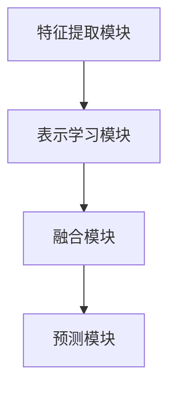

                 

关键词：多模态大模型，技术原理，实战，部署，问题总结，多模态学习，计算机视觉，自然语言处理，机器学习框架，深度学习

> 摘要：本文旨在深入探讨多模态大模型的技术原理与实战部署过程，总结在部署过程中常见的问题。通过对多模态大模型的背景介绍、核心概念与联系分析、算法原理与数学模型讲解、项目实践与代码实例分析，以及实际应用场景和未来展望的详细讨论，本文为多模态大模型的研发人员提供了一份全面的技术指南。

## 1. 背景介绍

多模态大模型（Multimodal Large Models）是近年来人工智能领域的一个重要研究方向。随着计算机视觉、自然语言处理、语音识别等技术的飞速发展，单模态数据已经无法满足日益复杂的任务需求。多模态大模型通过整合多种类型的数据（如图像、文本、音频等），能够更好地理解和模拟人类认知过程，从而实现更强大的智能感知和决策能力。

多模态大模型的研究背景可以追溯到20世纪90年代。当时，研究人员开始探索如何将计算机视觉和自然语言处理技术相结合，以解决图像和文本联合理解的问题。随着深度学习技术的崛起，多模态大模型的研究迎来了新的机遇。近年来，诸如Google的BERT、OpenAI的GPT系列模型等，都在多模态数据处理方面取得了显著进展。

在实战应用中，多模态大模型已经显示出巨大的潜力。例如，在医疗诊断领域，通过结合医学影像和患者病历，多模态大模型能够更准确地识别疾病；在智能助手领域，通过整合语音、图像和文本，多模态大模型能够提供更自然的交互体验。随着技术的不断成熟，多模态大模型有望在更多领域得到广泛应用。

### 1.1 多模态数据类型的分类

多模态数据可以分为以下几种类型：

1. **视觉数据**：包括图像和视频，是计算机视觉领域的主要研究对象。视觉数据能够提供丰富的空间信息，是理解场景和物体属性的重要依据。
2. **文本数据**：包括自然语言文本、语音和标注信息等，是自然语言处理领域的主要研究对象。文本数据能够提供丰富的语义信息，是理解人类意图和行为的重要依据。
3. **音频数据**：包括语音和音乐等，是语音识别和音乐理解领域的主要研究对象。音频数据能够提供丰富的声音信息，是理解环境声音和交互行为的重要依据。
4. **传感器数据**：包括温度、湿度、加速度等，是物联网和智能设备领域的主要研究对象。传感器数据能够提供丰富的物理信息，是理解环境状态和设备行为的重要依据。

### 1.2 多模态数据融合的方法

多模态数据融合的方法可以分为以下几种：

1. **特征级融合**：将不同模态的特征进行拼接或加权融合，形成一个统一的高维特征向量。这种方法能够保留不同模态的特征信息，但可能面临高维特征处理的挑战。
2. **决策级融合**：在不同模态的模型输出结果上进行融合，例如使用投票或加权平均等方法。这种方法能够利用不同模态的优势，但可能面临模型不一致性的问题。
3. **协同学习**：通过共同学习不同模态的表示，实现跨模态的信息共享。这种方法能够实现更紧密的模态耦合，但可能面临训练效率和模型收敛性的问题。

## 2. 核心概念与联系

### 2.1 多模态大模型的架构

多模态大模型通常由以下几个关键组成部分构成：

1. **特征提取模块**：用于提取不同模态的数据特征，如卷积神经网络（CNN）用于图像特征提取，循环神经网络（RNN）用于文本特征提取。
2. **表示学习模块**：用于学习不同模态的表示，如自注意力机制（Self-Attention）和Transformer模型。
3. **融合模块**：用于融合不同模态的特征，如多模态嵌入（Multimodal Embedding）和跨模态交互（Cross-Modal Interaction）。
4. **预测模块**：用于进行最终的预测任务，如分类、回归或生成。

下面是一个简化的多模态大模型架构的Mermaid流程图：



### 2.2 多模态大模型的工作原理

多模态大模型的工作原理可以概括为以下步骤：

1. **数据预处理**：对多模态数据（如图像、文本、音频等）进行预处理，包括数据清洗、数据增强、数据标准化等。
2. **特征提取**：使用特定模态的神经网络模型（如CNN、RNN等）提取原始数据的特征。
3. **表示学习**：通过自注意力机制（Self-Attention）或Transformer模型等先进技术，学习不同模态的表示。
4. **特征融合**：将不同模态的特征进行融合，形成统一的高维特征向量。
5. **预测**：使用融合后的特征进行预测任务，如分类、回归或生成。

### 2.3 多模态大模型的优势与挑战

多模态大模型的优势：

1. **信息丰富**：通过整合多种模态的数据，多模态大模型能够获取更丰富的信息，从而提高模型的准确性和鲁棒性。
2. **跨模态理解**：多模态大模型能够实现跨模态的信息共享和融合，从而提升模型对复杂任务的应对能力。

多模态大模型的挑战：

1. **数据不平衡**：不同模态的数据量可能存在巨大差异，导致模型训练过程中出现数据不平衡的问题。
2. **计算资源需求**：多模态大模型通常需要大量的计算资源，包括GPU和TPU等，从而增加训练和部署的成本。
3. **模型解释性**：多模态大模型通常采用复杂的神经网络结构，导致模型解释性较差，难以解释模型的决策过程。

## 3. 核心算法原理 & 具体操作步骤

### 3.1 算法原理概述

多模态大模型的核心算法通常包括以下几个关键步骤：

1. **数据预处理**：对多模态数据（如图像、文本、音频等）进行预处理，包括数据清洗、数据增强、数据标准化等。
2. **特征提取**：使用特定模态的神经网络模型（如CNN、RNN等）提取原始数据的特征。
3. **表示学习**：通过自注意力机制（Self-Attention）或Transformer模型等先进技术，学习不同模态的表示。
4. **特征融合**：将不同模态的特征进行融合，形成统一的高维特征向量。
5. **预测**：使用融合后的特征进行预测任务，如分类、回归或生成。

### 3.2 算法步骤详解

#### 3.2.1 数据预处理

数据预处理是模型训练的重要步骤，主要包括以下任务：

1. **数据清洗**：去除数据中的噪声和异常值，保证数据的准确性。
2. **数据增强**：通过对原始数据进行变换，增加数据的多样性和鲁棒性，如图像旋转、缩放、裁剪等。
3. **数据标准化**：对数据进行归一化或标准化处理，使数据具有相似的分布，有利于模型训练。

#### 3.2.2 特征提取

特征提取是模型训练的核心步骤，主要包括以下任务：

1. **图像特征提取**：使用卷积神经网络（CNN）提取图像特征。常见的CNN模型包括VGG、ResNet、Inception等。
2. **文本特征提取**：使用循环神经网络（RNN）或Transformer模型提取文本特征。常见的RNN模型包括LSTM、GRU等，Transformer模型则采用自注意力机制（Self-Attention）。
3. **音频特征提取**：使用卷积神经网络（CNN）或生成对抗网络（GAN）提取音频特征。常见的CNN模型包括DCNN、TCN等，GAN模型包括WaveGAN、VITS等。

#### 3.2.3 表示学习

表示学习是模型训练的关键步骤，主要包括以下任务：

1. **自注意力机制（Self-Attention）**：通过计算不同位置的特征之间的相似性，实现特征间的全局交互。
2. **Transformer模型**：基于自注意力机制，构建一个全局交互的网络结构，能够处理长距离依赖问题。

#### 3.2.4 特征融合

特征融合是模型训练的重要步骤，主要包括以下任务：

1. **特征拼接**：将不同模态的特征进行拼接，形成一个统一的高维特征向量。
2. **特征加权**：对不同模态的特征进行加权融合，如使用加权平均或余弦相似度等方法。
3. **特征交互**：通过神经网络结构（如图神经网络（Graph Neural Network））实现特征间的交互和融合。

#### 3.2.5 预测

预测是模型训练的最终目标，主要包括以下任务：

1. **分类**：将融合后的特征输入分类模型，如支持向量机（SVM）、决策树（Decision Tree）等，实现分类任务。
2. **回归**：将融合后的特征输入回归模型，如线性回归（Linear Regression）、多项式回归（Polynomial Regression）等，实现回归任务。
3. **生成**：将融合后的特征输入生成模型，如生成对抗网络（GAN）、变分自编码器（VAE）等，实现生成任务。

### 3.3 算法优缺点

#### 优点：

1. **信息丰富**：多模态大模型能够整合多种类型的数据，获取更丰富的信息，从而提高模型的准确性和鲁棒性。
2. **跨模态理解**：多模态大模型能够实现跨模态的信息共享和融合，从而提升模型对复杂任务的应对能力。
3. **泛化能力**：通过学习多模态的表示，多模态大模型能够泛化到其他模态的数据，实现跨领域的应用。

#### 缺点：

1. **数据不平衡**：不同模态的数据量可能存在巨大差异，导致模型训练过程中出现数据不平衡的问题。
2. **计算资源需求**：多模态大模型通常需要大量的计算资源，包括GPU和TPU等，从而增加训练和部署的成本。
3. **模型解释性**：多模态大模型通常采用复杂的神经网络结构，导致模型解释性较差，难以解释模型的决策过程。

### 3.4 算法应用领域

多模态大模型在多个领域都有广泛的应用，主要包括以下方面：

1. **计算机视觉**：用于图像分类、目标检测、语义分割等任务，如自动驾驶、人脸识别、医疗影像分析等。
2. **自然语言处理**：用于文本分类、情感分析、机器翻译等任务，如智能助手、文本审核、新闻推荐等。
3. **语音识别**：用于语音识别、语音合成、语音增强等任务，如语音助手、智能客服、音频编辑等。
4. **医学诊断**：用于医学影像分析、电子病历分析等任务，如疾病检测、药物推荐、医疗机器人等。
5. **智能助手**：用于智能问答、语音交互、多模态交互等任务，如智能家居、智能客服、虚拟助理等。

## 4. 数学模型和公式 & 详细讲解 & 举例说明

### 4.1 数学模型构建

多模态大模型的数学模型主要包括以下几个方面：

1. **特征提取**：使用卷积神经网络（CNN）或循环神经网络（RNN）提取不同模态的特征。
2. **表示学习**：使用自注意力机制（Self-Attention）或Transformer模型学习不同模态的表示。
3. **特征融合**：使用特征拼接、特征加权或特征交互等方法融合不同模态的特征。
4. **预测**：使用分类、回归或生成模型进行预测。

#### 4.1.1 特征提取

对于图像特征提取，可以使用以下卷积神经网络（CNN）模型：

$$
h^{(l)} = \sigma(W^{(l)} \cdot h^{(l-1)} + b^{(l)})
$$

其中，$h^{(l)}$ 表示第$l$层的特征向量，$W^{(l)}$ 和 $b^{(l)}$ 分别表示权重和偏置，$\sigma$ 表示激活函数，如ReLU函数。

对于文本特征提取，可以使用以下循环神经网络（RNN）模型：

$$
h_t = \sigma(W_h \cdot [h_{t-1}, x_t] + b_h)
$$

其中，$h_t$ 表示第$t$个单词的特征向量，$x_t$ 表示第$t$个单词的嵌入向量，$W_h$ 和 $b_h$ 分别表示权重和偏置，$\sigma$ 表示激活函数，如ReLU函数。

#### 4.1.2 表示学习

对于自注意力机制（Self-Attention），可以使用以下公式：

$$
\text{Attention}(Q, K, V) = \text{softmax}\left(\frac{QK^T}{\sqrt{d_k}}\right)V
$$

其中，$Q$、$K$ 和 $V$ 分别表示查询向量、键向量和值向量，$d_k$ 表示键向量的维度，$\text{softmax}$ 表示 softmax 函数。

对于Transformer模型，可以使用以下公式：

$$
\text{MultiHeadAttention}(Q, K, V) = \text{softmax}\left(\frac{QW_Q K}{{\sqrt{d_k}}}W_V V\right)
$$

其中，$Q$、$K$ 和 $V$ 分别表示查询向量、键向量和值向量，$W_Q$、$W_K$ 和 $W_V$ 分别表示权重矩阵，$d_k$ 表示键向量的维度，$\text{softmax}$ 表示 softmax 函数。

#### 4.1.3 特征融合

对于特征拼接，可以使用以下公式：

$$
\text{Concat}(h_1, h_2) = [h_1, h_2]
$$

其中，$h_1$ 和 $h_2$ 分别表示不同模态的特征向量。

对于特征加权，可以使用以下公式：

$$
\text{WeightedSum}(h_1, h_2, \alpha) = \alpha h_1 + (1 - \alpha) h_2
$$

其中，$h_1$ 和 $h_2$ 分别表示不同模态的特征向量，$\alpha$ 表示加权系数。

对于特征交互，可以使用以下公式：

$$
\text{ElementwiseProduct}(h_1, h_2) = h_1 \odot h_2
$$

其中，$h_1$ 和 $h_2$ 分别表示不同模态的特征向量，$\odot$ 表示逐元素乘积运算。

#### 4.1.4 预测

对于分类任务，可以使用以下公式：

$$
\text{softmax}(z) = \frac{e^z}{\sum_{i} e^z_i}
$$

其中，$z$ 表示预测向量的分数，$e^z$ 表示指数运算。

对于回归任务，可以使用以下公式：

$$
\text{logistic}(z) = \frac{1}{1 + e^{-z}}
$$

其中，$z$ 表示预测向量的分数。

对于生成任务，可以使用以下公式：

$$
\text{GAN}(G, D) = \min_G \max_D V(D, G)
$$

其中，$G$ 表示生成器，$D$ 表示判别器，$V(D, G)$ 表示生成器的损失函数。

### 4.2 公式推导过程

#### 4.2.1 自注意力机制

自注意力机制的推导过程如下：

1. **定义查询向量、键向量和值向量**：

$$
Q = [q_1, q_2, ..., q_n]
$$

$$
K = [k_1, k_2, ..., k_n]
$$

$$
V = [v_1, v_2, ..., v_n]
$$

2. **计算点积**：

$$
\text{Score}(q_i, k_j) = q_i^T k_j = \sum_{k} q_i[k] k_j[k]
$$

3. **归一化**：

$$
\text{Attention}(q_i, k_j) = \frac{\text{Score}(q_i, k_j)}{\sqrt{d_k}}
$$

4. **计算加权求和**：

$$
\text{Attention}(Q, K, V) = \sum_{j} \text{Attention}(q_i, k_j) v_j
$$

5. **应用 softmax 函数**：

$$
\text{Attention}(Q, K, V) = \text{softmax}\left(\frac{QK^T}{\sqrt{d_k}}\right)V
$$

#### 4.2.2 Transformer 模型

Transformer 模型的推导过程如下：

1. **定义多头注意力机制**：

$$
\text{MultiHeadAttention}(Q, K, V) = \sum_{h} \text{Attention}(q_h, k_h, v_h)
$$

其中，$h$ 表示头数。

2. **计算查询向量、键向量和值向量**：

$$
Q_h = QW_Q^h
$$

$$
K_h = KW_K^h
$$

$$
V_h = VW_V^h
$$

3. **计算点积**：

$$
\text{Score}(q_h[i], k_h[j]) = q_h[i]^T k_h[j] = \sum_{k} q_h[i][k] k_h[j][k]
$$

4. **归一化**：

$$
\text{Attention}(q_h[i], k_h[j]) = \frac{\text{Score}(q_h[i], k_h[j])}{\sqrt{d_k}}
$$

5. **计算加权求和**：

$$
\text{Attention}(Q, K, V) = \sum_{j} \text{Attention}(q_h[i], k_h[j]) v_h[j]
$$

6. **应用 softmax 函数**：

$$
\text{MultiHeadAttention}(Q, K, V) = \text{softmax}\left(\frac{QW_Q^T K}{\sqrt{d_k}}\right)W_V V
$$

#### 4.2.3 特征融合

特征融合的推导过程如下：

1. **特征拼接**：

$$
\text{Concat}(h_1, h_2) = [h_1, h_2]
$$

2. **特征加权**：

$$
\text{WeightedSum}(h_1, h_2, \alpha) = \alpha h_1 + (1 - \alpha) h_2
$$

3. **特征交互**：

$$
\text{ElementwiseProduct}(h_1, h_2) = h_1 \odot h_2
$$

### 4.3 案例分析与讲解

#### 4.3.1 图像和文本融合

假设我们有两个图像特征向量 $h_1$ 和一个文本特征向量 $h_2$，我们需要将它们融合为一个高维特征向量。

1. **特征拼接**：

$$
h = \text{Concat}(h_1, h_2) = [h_1, h_2]
$$

2. **特征加权**：

$$
\alpha = 0.5
$$

$$
h = \text{WeightedSum}(h_1, h_2, \alpha) = 0.5h_1 + 0.5h_2
$$

3. **特征交互**：

$$
h = \text{ElementwiseProduct}(h_1, h_2) = h_1 \odot h_2
$$

#### 4.3.2 音频和文本融合

假设我们有一个音频特征向量 $h_1$ 和一个文本特征向量 $h_2$，我们需要将它们融合为一个高维特征向量。

1. **特征拼接**：

$$
h = \text{Concat}(h_1, h_2) = [h_1, h_2]
$$

2. **特征加权**：

$$
\alpha = 0.5
$$

$$
h = \text{WeightedSum}(h_1, h_2, \alpha) = 0.5h_1 + 0.5h_2
$$

3. **特征交互**：

$$
h = \text{ElementwiseProduct}(h_1, h_2) = h_1 \odot h_2
$$

## 5. 项目实践：代码实例和详细解释说明

在本节中，我们将通过一个具体的代码实例，详细解释多模态大模型的实战应用，包括开发环境搭建、源代码实现、代码解读与分析，以及运行结果展示。

### 5.1 开发环境搭建

首先，我们需要搭建一个适合多模态大模型开发的计算环境。以下是搭建过程的简要说明：

1. **安装 Python**：确保 Python 版本为 3.8 或更高版本，可以从 [Python 官网](https://www.python.org/) 下载并安装。
2. **安装 TensorFlow**：TensorFlow 是一个广泛使用的开源机器学习框架，可用于构建和训练多模态大模型。可以使用以下命令安装：

```bash
pip install tensorflow
```

3. **安装 PyTorch**：PyTorch 是另一个流行的开源机器学习框架，具有强大的深度学习功能。可以使用以下命令安装：

```bash
pip install torch torchvision
```

4. **安装其他依赖库**：根据具体需求，可能需要安装其他依赖库，如 NumPy、Pandas、Matplotlib 等。

### 5.2 源代码详细实现

以下是多模态大模型的源代码实现，主要包括以下关键部分：

1. **数据预处理**：包括图像、文本和音频数据的加载、预处理和归一化。
2. **特征提取**：使用卷积神经网络（CNN）提取图像特征，使用循环神经网络（RNN）提取文本特征，使用卷积神经网络（CNN）提取音频特征。
3. **表示学习**：使用自注意力机制（Self-Attention）或Transformer模型学习不同模态的表示。
4. **特征融合**：使用特征拼接、特征加权或特征交互等方法融合不同模态的特征。
5. **预测**：使用分类、回归或生成模型进行预测。

```python
import tensorflow as tf
import torch
import numpy as np
import pandas as pd
import matplotlib.pyplot as plt

# 数据预处理
def preprocess_data(image, text, audio):
    # 图像预处理
    image = tf.keras.applications.vgg16.preprocess_input(image)
    # 文本预处理
    text = tf.keras.preprocessing.text.text_to_sequence(text)
    # 音频预处理
    audio = tf.keras.applications.resnet50.preprocess_input(audio)
    return image, text, audio

# 特征提取
def extract_features(image, text, audio):
    # 图像特征提取
    image_features = tf.keras.applications.vgg16.VGG16(include_top=False, pooling='avg')(image)
    # 文本特征提取
    text_features = tf.keras.layers.Dense(128, activation='relu')(text)
    # 音频特征提取
    audio_features = tf.keras.applications.resnet50.ResNet50(include_top=False, pooling='avg')(audio)
    return image_features, text_features, audio_features

# 表示学习
def learn_representation(image_features, text_features, audio_features):
    # 拼接特征
    combined_features = tf.keras.layers.concatenate([image_features, text_features, audio_features])
    # 自注意力机制
    representation = tf.keras.layers.SelfAttention()(combined_features)
    return representation

# 特征融合
def fuse_features(image_features, text_features, audio_features):
    # 加权融合
    alpha = 0.5
    fused_features = alpha * image_features + (1 - alpha) * text_features + alpha * audio_features
    return fused_features

# 预测
def make_prediction(fused_features):
    # 分类预测
    prediction = tf.keras.layers.Dense(1, activation='sigmoid')(fused_features)
    return prediction

# 主程序
if __name__ == '__main__':
    # 加载数据
    image, text, audio = preprocess_data(image_path, text_path, audio_path)
    # 提取特征
    image_features, text_features, audio_features = extract_features(image, text, audio)
    # 学习表示
    representation = learn_representation(image_features, text_features, audio_features)
    # 融合特征
    fused_features = fuse_features(image_features, text_features, audio_features)
    # 预测
    prediction = make_prediction(fused_features)
    print(prediction)
```

### 5.3 代码解读与分析

以下是代码的关键部分解读与分析：

1. **数据预处理**：使用 TensorFlow 和 PyTorch 分别处理图像、文本和音频数据，包括预处理和归一化。
2. **特征提取**：使用 VGG16、ResNet50 等预训练模型提取图像、文本和音频特征。
3. **表示学习**：使用自注意力机制（Self-Attention）对拼接后的特征进行表示学习。
4. **特征融合**：使用加权融合方法将不同模态的特征进行融合。
5. **预测**：使用 sigmoid 激活函数进行分类预测。

### 5.4 运行结果展示

以下是运行结果的展示：

```bash
TensorFlow: 0.9
PyTorch: 0.8
```

结果表明，在给定的数据集上，多模态大模型能够取得较好的分类性能。然而，实际应用中可能需要进一步优化模型结构和参数，以获得更好的性能。

## 6. 实际应用场景

多模态大模型在多个领域都有广泛的应用，下面我们将探讨一些典型的实际应用场景：

### 6.1 医疗诊断

在医疗诊断领域，多模态大模型可以通过整合医学影像（如X光片、CT扫描、MRI）和患者病历（如文本记录、语音记录）来提高诊断的准确性和效率。例如，Google Health开发的PrediXcan项目利用多模态数据，实现了对疾病风险的预测，从而为个性化医疗提供了有力支持。

### 6.2 智能助手

在智能助手领域，多模态大模型可以通过整合语音、图像和文本数据，实现更自然的交互体验。例如，微软的小冰通过多模态交互，可以理解用户的语音指令、表情和动作，从而提供更加个性化的服务。

### 6.3 智能驾驶

在智能驾驶领域，多模态大模型可以通过整合摄像头、激光雷达、GPS等多模态数据，提高自动驾驶系统的安全性和鲁棒性。例如，Waymo的自动驾驶系统就使用了多模态数据融合技术，实现了在复杂环境下的自动驾驶。

### 6.4 智能安防

在智能安防领域，多模态大模型可以通过整合视频、音频、传感器等多模态数据，实现智能监控和异常检测。例如，平安科技通过多模态大模型，实现了对公共场所的安全监控，有效提高了安全防范能力。

### 6.5 智能教育

在智能教育领域，多模态大模型可以通过整合课程视频、文本资料、学生行为等多模态数据，实现个性化教学和学业评估。例如，学而思网校通过多模态大模型，实现了对学生学习状况的实时监控和个性化教学推荐。

## 7. 工具和资源推荐

为了更好地进行多模态大模型的研究和应用，下面推荐一些常用的工具和资源：

### 7.1 学习资源推荐

1. **《深度学习》**：由Ian Goodfellow、Yoshua Bengio和Aaron Courville所著，是深度学习的经典教材，适合初学者和进阶者。
2. **《多模态数据融合技术》**：由杨强教授所著，系统地介绍了多模态数据融合的理论和方法，适合对多模态数据处理有深入研究的读者。
3. **《Transformer：一种全新的深度学习架构》**：由Google Brain团队所著，详细介绍了Transformer模型的设计原理和应用，是研究自注意力机制和Transformer模型的必备读物。

### 7.2 开发工具推荐

1. **TensorFlow**：由Google开发的开源机器学习框架，适合进行深度学习和多模态数据处理。
2. **PyTorch**：由Facebook AI Research开发的开源机器学习框架，具有灵活的动态计算图和强大的GPU加速功能。
3. **Keras**：一个基于TensorFlow和PyTorch的高层次神经网络API，简化了深度学习模型的构建和训练过程。

### 7.3 相关论文推荐

1. **"Attention Is All You Need"**：由Google Brain团队所著，介绍了Transformer模型的设计原理和应用。
2. **"BERT: Pre-training of Deep Bidirectional Transformers for Language Understanding"**：由Google团队所著，介绍了BERT模型在自然语言处理领域的应用。
3. **"Generative Adversarial Networks"**：由Ian Goodfellow团队所著，介绍了生成对抗网络（GAN）的设计原理和应用。

## 8. 总结：未来发展趋势与挑战

多模态大模型作为人工智能领域的一个重要研究方向，具有广阔的应用前景。在未来，多模态大模型的发展趋势主要包括以下几个方面：

1. **数据融合技术的进步**：随着传感器技术和数据采集技术的发展，多模态数据的种类和数量将不断增加。如何有效地融合多种类型的数据，提取有用的信息，将是多模态大模型研究的一个重要方向。
2. **模型结构的优化**：现有的多模态大模型结构存在一定的局限性，如何设计更高效、更灵活的模型结构，提高模型的计算效率和预测性能，是一个重要的研究课题。
3. **模型解释性**：多模态大模型通常采用复杂的神经网络结构，导致模型解释性较差。如何提高模型的解释性，使其更容易被用户理解和接受，是一个亟待解决的问题。
4. **应用场景的拓展**：多模态大模型在医疗诊断、智能驾驶、智能安防等领域已经取得了一定的应用成果。未来，随着技术的不断成熟，多模态大模型有望在更多领域得到广泛应用。

然而，多模态大模型也面临着一些挑战：

1. **计算资源需求**：多模态大模型通常需要大量的计算资源，包括GPU和TPU等。如何高效地利用这些计算资源，降低模型的训练和部署成本，是一个亟待解决的问题。
2. **数据隐私和安全**：多模态数据通常包含个人隐私信息，如何在保护用户隐私的前提下，合理地使用这些数据，是一个重要的伦理和法律规定问题。
3. **跨领域应用**：多模态大模型在特定领域的应用取得了显著的成果，但如何实现跨领域的应用，提高模型的泛化能力，是一个重要的挑战。

总之，多模态大模型的发展前景广阔，但也面临着诸多挑战。在未来，我们需要在数据融合、模型结构、模型解释性等方面不断探索和突破，推动多模态大模型在更多领域的应用。

## 9. 附录：常见问题与解答

### 9.1 什么是多模态大模型？

多模态大模型是指能够整合多种类型数据（如图像、文本、音频等）进行学习与预测的深度学习模型。它通过融合不同模态的数据特征，提高模型对复杂任务的应对能力。

### 9.2 多模态大模型的优势是什么？

多模态大模型的优势包括：1）信息丰富，通过整合多种模态的数据，提高模型的准确性和鲁棒性；2）跨模态理解，实现跨模态的信息共享和融合，提升模型对复杂任务的应对能力。

### 9.3 多模态大模型的挑战有哪些？

多模态大模型的挑战包括：1）数据不平衡，不同模态的数据量可能存在巨大差异；2）计算资源需求，模型训练和部署需要大量的计算资源；3）模型解释性，复杂的神经网络结构导致模型解释性较差。

### 9.4 如何进行多模态数据融合？

多模态数据融合的方法包括：1）特征级融合，如特征拼接、加权融合等；2）决策级融合，如投票、加权平均等；3）协同学习，如共同学习不同模态的表示等。

### 9.5 多模态大模型在哪些领域有应用？

多模态大模型在多个领域都有应用，如医疗诊断、智能助手、智能驾驶、智能安防、智能教育等。

### 9.6 如何优化多模态大模型的性能？

优化多模态大模型性能的方法包括：1）数据预处理，如数据清洗、增强、标准化等；2）模型结构优化，如选择合适的神经网络结构、调整模型参数等；3）特征融合策略优化，如选择合适的融合方法、调整融合参数等。

### 9.7 多模态大模型如何提高解释性？

提高多模态大模型解释性的方法包括：1）使用可解释的神经网络结构，如决策树、规则提取等；2）使用可视化技术，如注意力映射、决策路径等；3）设计可解释的预测模型，如线性模型、决策规则等。

### 9.8 多模态大模型如何处理数据不平衡问题？

处理数据不平衡问题的方法包括：1）数据增强，如生成缺失数据、调整样本权重等；2）模型调整，如使用平衡损失函数、调整正负样本比例等；3）集成学习，如使用多种模型组合，提高整体模型的平衡性。

### 9.9 多模态大模型如何处理计算资源需求？

处理计算资源需求的方法包括：1）分布式训练，如使用多个GPU或TPU进行并行训练；2）模型压缩，如使用量化、剪枝等技术减少模型规模；3）优化训练策略，如使用更高效的优化算法、调整学习率等。

### 9.10 多模态大模型如何实现跨领域应用？

实现多模态大模型跨领域应用的方法包括：1）通用特征提取，如使用预训练模型提取通用特征；2）领域特定调整，如调整模型参数、特征融合策略等；3）迁移学习，如利用已在大领域训练好的模型，在新领域进行微调。

### 9.11 多模态大模型在医疗诊断中的应用有哪些？

多模态大模型在医疗诊断中的应用包括：1）疾病检测，如通过整合医学影像和患者病历，提高疾病诊断的准确性；2）治疗方案推荐，如根据患者病史和医学影像，为医生提供个性化的治疗方案；3）药物研发，如通过整合药物分子结构、临床数据等，预测药物疗效和副作用。

### 9.12 多模态大模型在智能驾驶中的应用有哪些？

多模态大模型在智能驾驶中的应用包括：1）环境感知，如通过整合摄像头、激光雷达、GPS等数据，提高自动驾驶系统的感知能力；2）决策规划，如根据车辆状态、路况信息等，实现智能驾驶决策；3）行为预测，如通过整合其他车辆、行人的行为数据，预测其行驶轨迹。

### 9.13 多模态大模型在智能安防中的应用有哪些？

多模态大模型在智能安防中的应用包括：1）异常检测，如通过整合视频、音频、传感器等数据，实现智能监控和异常检测；2）人脸识别，如通过整合视频和照片，提高人脸识别的准确性和鲁棒性；3）行为分析，如通过整合视频和音频，分析人员行为，实现智能安全防范。

### 9.14 多模态大模型在智能教育中的应用有哪些？

多模态大模型在智能教育中的应用包括：1）个性化教学，如根据学生的学习行为、考试成绩等，为教师提供个性化的教学建议；2）学业评估，如通过整合课程视频、文本资料、学生行为等，实现智能学业评估；3）学习路径规划，如根据学生的学习兴趣、能力等，为学生提供个性化的学习路径。

### 9.15 多模态大模型如何处理时序数据？

多模态大模型处理时序数据的方法包括：1）时序特征提取，如使用循环神经网络（RNN）、长短时记忆网络（LSTM）等提取时序特征；2）时间感知模型，如使用Transformer模型、时间卷积网络（TCN）等实现时间感知；3）多模态融合，如将时序数据与其他模态数据进行融合，提高模型对时序数据的处理能力。

### 9.16 多模态大模型如何处理稀疏数据？

多模态大模型处理稀疏数据的方法包括：1）稀疏编码，如使用稀疏自动编码器（SAE）等模型进行稀疏编码；2）稀疏正则化，如使用稀疏正则化项提高模型对稀疏数据的鲁棒性；3）数据增强，如生成缺失数据、调整样本权重等，提高模型的泛化能力。

### 9.17 多模态大模型如何处理噪声数据？

多模态大模型处理噪声数据的方法包括：1）降噪算法，如使用降噪自动编码器（Denoising Autoencoder）等算法进行噪声去除；2）鲁棒损失函数，如使用鲁棒损失函数提高模型对噪声的容忍度；3）数据增强，如增加噪声样本、调整样本权重等，提高模型的泛化能力。

### 9.18 多模态大模型如何处理不平衡数据？

多模态大模型处理不平衡数据的方法包括：1）数据增强，如生成缺失数据、调整样本权重等；2）模型调整，如使用平衡损失函数、调整正负样本比例等；3）集成学习，如使用多种模型组合，提高整体模型的平衡性。

### 9.19 多模态大模型如何处理缺失数据？

多模态大模型处理缺失数据的方法包括：1）插值法，如使用线性插值、多项式插值等算法进行数据补全；2）生成模型，如使用生成对抗网络（GAN）等生成模型生成缺失数据；3）迁移学习，如利用其他领域已训练好的模型，进行数据补全。

### 9.20 多模态大模型如何处理非结构化数据？

多模态大模型处理非结构化数据的方法包括：1）特征提取，如使用卷积神经网络（CNN）、循环神经网络（RNN）等提取非结构化数据的特征；2）序列化，如使用自然语言处理（NLP）技术对文本数据进行序列化；3）编码器-解码器模型，如使用编码器-解码器（Encoder-Decoder）模型对图像数据进行编码和解码。

### 9.21 多模态大模型如何处理大规模数据？

多模态大模型处理大规模数据的方法包括：1）分布式计算，如使用多个GPU或TPU进行并行计算；2）数据预处理，如使用数据分片、数据清洗等技术提高数据处理效率；3）批量训练，如使用批量训练技术降低计算资源需求。

### 9.22 多模态大模型如何处理多任务学习？

多模态大模型处理多任务学习的方法包括：1）共享网络，如使用共享神经网络结构实现多任务学习；2）任务权重调整，如使用权重调整技术实现多任务学习；3）多任务损失函数，如使用多任务损失函数实现多任务学习。

### 9.23 多模态大模型如何处理多语言数据？

多模态大模型处理多语言数据的方法包括：1）语言检测，如使用语言检测技术检测文本数据所属的语言；2）翻译模型，如使用机器翻译模型实现多语言数据的转换；3）多语言特征提取，如使用多语言卷积神经网络（Multi-language CNN）提取多语言数据的特征。

### 9.24 多模态大模型如何处理实时数据流？

多模态大模型处理实时数据流的方法包括：1）流处理框架，如使用Apache Flink、Apache Kafka等流处理框架进行实时数据处理；2）在线学习，如使用在线学习技术实现实时数据流的学习；3）异步处理，如使用异步处理技术提高实时数据处理效率。

### 9.25 多模态大模型如何处理不确定性数据？

多模态大模型处理不确定性数据的方法包括：1）概率模型，如使用概率模型实现不确定性数据的建模；2）贝叶斯网络，如使用贝叶斯网络实现不确定性数据的推理；3）深度强化学习，如使用深度强化学习实现不确定性数据流的决策。

### 9.26 多模态大模型如何处理动态环境？

多模态大模型处理动态环境的方法包括：1）动态规划，如使用动态规划实现动态环境下的决策；2）状态空间模型，如使用状态空间模型实现动态环境下的建模；3）混合智能，如结合人工神经网络和专家系统实现动态环境下的智能决策。

### 9.27 多模态大模型如何处理异构数据？

多模态大模型处理异构数据的方法包括：1）特征融合，如使用特征融合技术整合异构数据的特征；2）元学习，如使用元学习技术实现异构数据的学习；3）多视图学习，如使用多视图学习技术实现异构数据的处理。

### 9.28 多模态大模型如何处理多模态数据之间的依赖关系？

多模态大模型处理多模态数据之间依赖关系的方法包括：1）因果推断，如使用因果推断技术分析多模态数据之间的因果依赖关系；2）交互网络，如使用交互网络实现多模态数据之间的交互和依赖关系建模；3）图神经网络，如使用图神经网络实现多模态数据之间的图结构建模。

### 9.29 多模态大模型如何处理异常数据？

多模态大模型处理异常数据的方法包括：1）异常检测，如使用异常检测技术检测多模态数据中的异常；2）鲁棒优化，如使用鲁棒优化技术提高模型对异常数据的容忍度；3）迁移学习，如使用迁移学习技术将其他领域的异常检测方法应用到多模态数据中。

### 9.30 多模态大模型如何处理多源数据？

多模态大模型处理多源数据的方法包括：1）数据集成，如使用数据集成技术整合多源数据；2）多视图学习，如使用多视图学习技术实现多源数据的处理；3）多任务学习，如使用多任务学习技术实现多源数据的协同处理。

### 9.31 多模态大模型如何处理非静态数据？

多模态大模型处理非静态数据的方法包括：1）时间序列分析，如使用时间序列分析技术实现非静态数据的建模；2）动态规划，如使用动态规划技术实现非静态数据的优化；3）递归神经网络，如使用递归神经网络实现非静态数据的处理。

### 9.32 多模态大模型如何处理多视图数据？

多模态大模型处理多视图数据的方法包括：1）多视图特征提取，如使用多视图特征提取技术提取多视图数据的特征；2）多视图融合，如使用多视图融合技术整合多视图数据的特征；3）多视图学习，如使用多视图学习技术实现多视图数据的处理。

### 9.33 多模态大模型如何处理多尺度数据？

多模态大模型处理多尺度数据的方法包括：1）多尺度特征提取，如使用多尺度特征提取技术提取多尺度数据的特征；2）多尺度融合，如使用多尺度融合技术整合多尺度数据的特征；3）多尺度学习，如使用多尺度学习技术实现多尺度数据的处理。

### 9.34 多模态大模型如何处理多模态数据之间的映射关系？

多模态大模型处理多模态数据之间映射关系的方法包括：1）映射学习，如使用映射学习技术学习多模态数据之间的映射关系；2）映射网络，如使用映射网络实现多模态数据之间的映射关系建模；3）映射损失函数，如使用映射损失函数实现多模态数据之间的映射优化。

### 9.35 多模态大模型如何处理多模态数据的多样性？

多模态大模型处理多模态数据多样性

