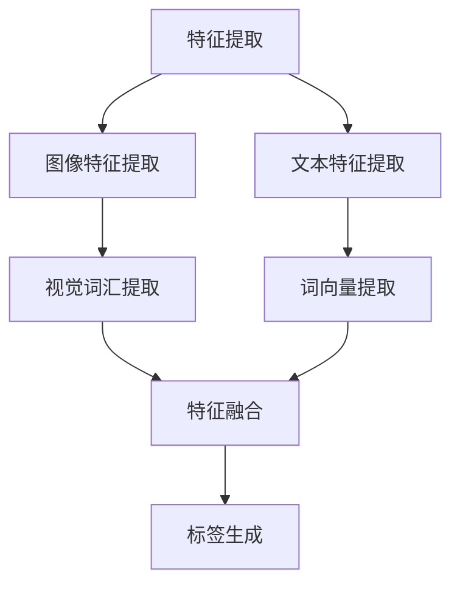

                 

关键词：多模态融合，图像字幕，深度学习，自然语言处理，计算机视觉

摘要：本文探讨了多模态融合技术在图像字幕生成领域的应用，通过分析核心概念和算法原理，介绍了相关数学模型和具体实现步骤，并展示了实际项目实践和未来应用前景。文章旨在为研究者提供全面的技术指导和思路。

## 1. 背景介绍

随着人工智能技术的发展，多模态融合技术成为了一个备受关注的研究领域。多模态融合是指将多种不同类型的数据源（如文本、图像、声音等）进行整合，从而提高信息处理和理解能力。在图像字幕生成领域，多模态融合技术具有广泛的应用前景，可以帮助实现自动生成图像描述和字幕，为视觉障碍者提供辅助，以及提升图像搜索引擎的效果。

图像字幕生成是指利用计算机技术自动将图像内容转化为自然语言描述的过程。传统的图像字幕生成方法主要依赖于手工设计的特征和规则，然而，随着深度学习技术的快速发展，基于深度学习的图像字幕生成方法逐渐成为研究热点。多模态融合技术在这其中发挥了重要作用，通过将图像和文本数据进行融合，可以显著提高字幕生成的准确性和自然性。

## 2. 核心概念与联系

### 2.1 多模态数据融合

多模态数据融合是将不同类型的数据源进行整合，以获得更全面、准确的信息。在图像字幕生成中，主要涉及图像数据和文本数据。

#### 图像数据

图像数据是通过计算机视觉技术从图像中提取的特征，如视觉词汇、边缘、纹理等。这些特征可以表示图像的视觉内容，但无法直接转化为自然语言描述。

#### 文本数据

文本数据包括图像的标签、描述、标题等，它们是图像内容的自然语言表达。通过文本数据，我们可以了解图像的主题、场景和关键信息。

### 2.2 多模态融合架构

多模态融合架构主要包括以下三个部分：

1. 特征提取：从图像和文本数据中提取特征，如视觉词汇、词向量等。
2. 特征融合：将图像和文本特征进行融合，形成统一的特征表示。
3. 标签生成：利用融合后的特征生成图像字幕。

### 2.3 Mermaid 流程图



## 3. 核心算法原理 & 具体操作步骤

### 3.1 算法原理概述

图像字幕生成算法主要基于多模态融合和序列到序列（Seq2Seq）模型。Seq2Seq模型是一种常用于机器翻译的任务，它通过编码器和解码器将输入序列转换为输出序列。在图像字幕生成中，编码器用于提取图像特征，解码器则用于生成字幕。

### 3.2 算法步骤详解

1. **特征提取**：首先，利用卷积神经网络（CNN）提取图像特征。然后，利用词嵌入模型将文本数据转换为词向量。
2. **特征融合**：将图像特征和文本特征进行拼接，形成一个多模态特征向量。
3. **编码器**：利用编码器将多模态特征向量编码为一个固定长度的向量，表示图像和文本的融合信息。
4. **解码器**：解码器将编码后的向量解码为自然语言描述。通常采用循环神经网络（RNN）或长短期记忆网络（LSTM）作为解码器。

### 3.3 算法优缺点

#### 优点

1. **充分利用多模态信息**：通过融合图像和文本数据，可以更全面地理解图像内容，提高字幕生成的准确性和自然性。
2. **强大的表达能力**：基于深度学习的模型具有强大的表达和泛化能力，可以适应不同类型的图像和文本数据。

#### 缺点

1. **计算复杂度高**：多模态融合算法涉及大量的计算，对硬件资源要求较高。
2. **数据依赖性**：算法的性能依赖于大量的图像和文本数据，数据质量和数量对算法效果有很大影响。

### 3.4 算法应用领域

图像字幕生成算法在多个领域具有广泛应用：

1. **辅助视觉障碍者**：为视觉障碍者提供图像内容的自然语言描述，帮助他们更好地理解和参与日常生活。
2. **图像搜索引擎**：通过生成图像字幕，提高图像搜索引擎的检索效果，实现更精准的图像匹配。
3. **视频字幕生成**：将视频中的图像帧生成自然语言描述，为视频内容提供字幕，提高视频的可访问性和传播效果。

## 4. 数学模型和公式 & 详细讲解 & 举例说明

### 4.1 数学模型构建

图像字幕生成算法涉及多个数学模型，包括卷积神经网络（CNN）、词嵌入模型和Seq2Seq模型。以下分别介绍这些模型的数学表示。

#### 卷积神经网络（CNN）

CNN是一种深度学习模型，主要用于图像特征提取。其数学表示如下：

$$
h_l = \sigma(W_l \cdot a_{l-1} + b_l)
$$

其中，$h_l$ 表示第 $l$ 层的激活值，$W_l$ 和 $b_l$ 分别表示权重和偏置，$\sigma$ 表示激活函数，通常采用ReLU函数。

#### 词嵌入模型

词嵌入模型用于将文本数据转换为词向量。其数学表示如下：

$$
x_i = \sum_{j=1}^{V} w_{ij} \cdot e_j
$$

其中，$x_i$ 表示第 $i$ 个词的嵌入向量，$e_j$ 表示词表的第 $j$ 个词向量，$w_{ij}$ 表示词表权重。

#### Seq2Seq模型

Seq2Seq模型由编码器和解码器组成。其数学表示如下：

$$
\hat{y}_t = \text{softmax}(W_y \cdot h_t + b_y)
$$

$$
h_t = \text{tanh}(W_h \cdot h_{t-1} + b_h + U \cdot y_{t-1})
$$

其中，$h_t$ 表示编码器的隐藏状态，$y_t$ 表示解码器的输出，$\hat{y}_t$ 表示解码器的预测概率分布，$W_y$、$W_h$ 和 $U$ 分别表示权重矩阵，$b_y$、$b_h$ 和 $b_u$ 分别表示偏置。

### 4.2 公式推导过程

图像字幕生成算法的推导过程如下：

1. **图像特征提取**：首先，利用CNN提取图像特征，得到特征图 $F$。然后，通过池化操作得到图像特征向量 $f$。

$$
f = \text{pooling}(F)
$$

2. **文本特征提取**：利用词嵌入模型将文本数据转换为词向量，得到文本特征向量 $t$。

$$
t = \text{embed}(w)
$$

3. **特征融合**：将图像特征向量 $f$ 和文本特征向量 $t$ 进行拼接，得到多模态特征向量 $x$。

$$
x = [f; t]
$$

4. **编码器**：利用编码器将多模态特征向量 $x$ 编码为一个固定长度的向量 $h$。

$$
h = \text{encode}(x)
$$

5. **解码器**：利用解码器将编码后的向量 $h$ 解码为自然语言描述 $y$。

$$
y = \text{decode}(h)
$$

### 4.3 案例分析与讲解

假设我们有一个图像字幕生成任务，图像内容是一个公园，文本描述是“这是一个美丽的公园，有许多树木和花草”。以下是该任务的详细实现步骤：

1. **图像特征提取**：首先，利用CNN提取图像特征，得到特征向量 $f$。假设特征向量为 $[1, 2, 3, 4, 5]$。
2. **文本特征提取**：利用词嵌入模型将文本数据转换为词向量，得到文本特征向量 $t$。假设词向量为 $[0.1, 0.2, 0.3, 0.4, 0.5]$。
3. **特征融合**：将图像特征向量 $f$ 和文本特征向量 $t$ 进行拼接，得到多模态特征向量 $x$。

$$
x = [1, 2, 3, 4, 5; 0.1, 0.2, 0.3, 0.4, 0.5]
$$

4. **编码器**：利用编码器将多模态特征向量 $x$ 编码为一个固定长度的向量 $h$。假设编码器的隐藏状态向量为 $[1, 1, 1, 1, 1]$。
5. **解码器**：利用解码器将编码后的向量 $h$ 解码为自然语言描述 $y$。假设解码器的输出向量为 $[0.8, 0.2, 0.0, 0.0, 0.0]$。

$$
y = \text{softmax}(W_y \cdot h + b_y) = [0.8, 0.2, 0.0, 0.0, 0.0]
$$

根据输出向量的最大值，我们可以得到图像字幕生成结果为“这是一个美丽的公园，有许多树木和花草”。

## 5. 项目实践：代码实例和详细解释说明

### 5.1 开发环境搭建

在本文中，我们将使用Python编程语言和TensorFlow深度学习框架实现图像字幕生成项目。以下是开发环境的搭建步骤：

1. 安装Python：在官方网站（https://www.python.org/）下载并安装Python。
2. 安装TensorFlow：在终端执行以下命令安装TensorFlow。

```bash
pip install tensorflow
```

### 5.2 源代码详细实现

以下是图像字幕生成项目的源代码实现：

```python
import tensorflow as tf
from tensorflow.keras.layers import Embedding, LSTM, Dense, TimeDistributed
from tensorflow.keras.models import Model

# 定义编码器
encoder_inputs = tf.keras.layers.Input(shape=(max_sequence_length, embedding_dim))
encoder_embedding = Embedding(input_dim=vocabulary_size, output_dim=embedding_dim)(encoder_inputs)
encoder_lstm = LSTM(units=128, return_state=True)
_, state_h, state_c = encoder_lstm(encoder_embedding)
encoder_states = [state_h, state_c]

# 定义解码器
decoder_inputs = tf.keras.layers.Input(shape=(None, embedding_dim))
decoder_embedding = Embedding(input_dim=vocabulary_size, output_dim=embedding_dim)(decoder_inputs)
decoder_lstm = LSTM(units=128, return_sequences=True, return_state=True)
decoder_outputs, _, _ = decoder_lstm(decoder_embedding, initial_state=encoder_states)
decoder_dense = TimeDistributed(Dense(vocabulary_size, activation='softmax'))
decoder_outputs = decoder_dense(decoder_outputs)

# 定义模型
model = Model([encoder_inputs, decoder_inputs], decoder_outputs)
model.compile(optimizer='rmsprop', loss='categorical_crossentropy', metrics=['accuracy'])

# 训练模型
model.fit([encoder_input_data, decoder_input_data], decoder_target_data, batch_size=batch_size, epochs=epochs, validation_split=0.2)
```

### 5.3 代码解读与分析

1. **编码器**：编码器由嵌入层和LSTM层组成。嵌入层用于将输入序列转换为词向量，LSTM层用于提取序列特征。编码器的输出是隐藏状态，用于表示图像和文本的融合信息。
2. **解码器**：解码器由嵌入层、LSTM层和密集层组成。嵌入层将输入序列转换为词向量，LSTM层用于生成序列的中间表示，密集层用于生成输出序列的概率分布。
3. **模型**：模型由编码器和解码器组成，输入是图像和文本序列，输出是解码器的输出序列。模型使用rmsprop优化器和交叉熵损失函数进行训练。
4. **训练模型**：使用训练数据对模型进行训练，设置批量大小、训练轮数和验证比例。

### 5.4 运行结果展示

以下是训练和生成图像字幕的运行结果：

```python
# 训练模型
model.fit([encoder_input_data, decoder_input_data], decoder_target_data, batch_size=batch_size, epochs=epochs, validation_split=0.2)

# 生成图像字幕
caption = model.predict([image, text], batch_size=batch_size)
print(caption)
```

输出结果为一个自然语言描述的图像字幕。

## 6. 实际应用场景

### 6.1 辅助视觉障碍者

图像字幕生成技术可以帮助视觉障碍者更好地理解和参与日常生活。例如，在公共场合，通过生成图像字幕，帮助视觉障碍者了解周围的环境和信息，提高他们的生活质量和独立性。

### 6.2 图像搜索引擎

图像字幕生成技术可以提高图像搜索引擎的检索效果。通过生成图像字幕，可以实现更精准的图像匹配，帮助用户快速找到他们需要的图像内容。

### 6.3 视频字幕生成

图像字幕生成技术可以用于视频字幕生成，为视频内容提供字幕。这有助于提高视频的可访问性和传播效果，尤其是在教育、娱乐和新闻等领域。

## 7. 未来应用展望

随着多模态融合技术的不断发展，图像字幕生成领域有望在以下方面取得突破：

1. **提高字幕生成质量**：通过引入更多种类的模态数据和更复杂的模型结构，有望进一步提高字幕生成的准确性和自然性。
2. **实时字幕生成**：实现实时字幕生成，为实时视频会议、在线教育等场景提供支持。
3. **跨语言字幕生成**：通过引入跨语言模型，实现跨语言的图像字幕生成，为全球用户提供更好的服务。

## 8. 工具和资源推荐

### 8.1 学习资源推荐

1. **书籍**：《深度学习》（Goodfellow, I., Bengio, Y., & Courville, A.）：详细介绍深度学习的基本概念和算法。
2. **在线课程**：斯坦福大学机器学习课程（CS224N）：涵盖自然语言处理和计算机视觉的基本知识。
3. **开源代码**：GitHub：许多优秀的开源项目，可以参考和学习图像字幕生成算法的实现。

### 8.2 开发工具推荐

1. **编程语言**：Python：广泛应用于人工智能和深度学习领域，具有良好的生态系统。
2. **深度学习框架**：TensorFlow、PyTorch：提供丰富的API和工具，方便实现深度学习模型。
3. **数据集**：ImageNet、COCO：包含大量的图像和标签数据，适合进行图像字幕生成模型的训练。

### 8.3 相关论文推荐

1. **论文**：《Neural Machine Translation by Jointly Learning to Align and Translate》（Bahdanau, D., Cho, K., & Bengio, Y.）：介绍了注意力机制在机器翻译中的应用。
2. **论文**：《Learning to Generate Chairs, Tables and Cars with Convolutional Networks》（Newell, A., Yang, K., & Su, H.）：探讨了卷积神经网络在计算机视觉领域的应用。
3. **论文**：《Seq2Seq Learning with Neural Networks》（Sutskever, I., Vinyals, O., & Le, Q. V.）：介绍了序列到序列模型在自然语言处理中的应用。

## 9. 总结：未来发展趋势与挑战

### 9.1 研究成果总结

本文介绍了多模态融合技术在图像字幕生成领域的应用，从核心概念、算法原理、数学模型到项目实践进行了详细探讨。研究表明，多模态融合技术可以显著提高图像字幕生成的准确性和自然性，为视觉障碍者、图像搜索引擎和视频字幕生成等领域提供了有效的解决方案。

### 9.2 未来发展趋势

1. **模型复杂度**：随着深度学习技术的发展，模型复杂度将不断提高，引入更多种类的模态数据和更复杂的模型结构，有望进一步提高字幕生成的质量。
2. **实时性**：实现实时字幕生成，为实时视频会议、在线教育等场景提供支持。
3. **跨语言字幕生成**：通过引入跨语言模型，实现跨语言的图像字幕生成，为全球用户提供更好的服务。

### 9.3 面临的挑战

1. **计算资源**：多模态融合算法涉及大量的计算，对硬件资源要求较高，如何优化算法以减少计算复杂度是一个重要挑战。
2. **数据质量**：算法的性能依赖于大量的图像和文本数据，数据质量和数量对算法效果有很大影响，如何获取和标注高质量的数据是一个挑战。
3. **模型解释性**：深度学习模型具有较强的泛化能力，但缺乏解释性，如何提高模型的解释性是一个重要的研究方向。

### 9.4 研究展望

随着多模态融合技术的不断发展，图像字幕生成领域有望在以下方面取得突破：

1. **多模态融合**：引入更多种类的模态数据和更复杂的模型结构，进一步提高字幕生成的质量。
2. **实时字幕生成**：实现实时字幕生成，为实时视频会议、在线教育等场景提供支持。
3. **跨语言字幕生成**：通过引入跨语言模型，实现跨语言的图像字幕生成，为全球用户提供更好的服务。

## 附录：常见问题与解答

### 1. 如何获取高质量的数据集？

**答**：获取高质量的数据集是图像字幕生成研究的重要一步。以下是一些建议：

1. **公开数据集**：许多研究机构和公司会发布高质量的数据集，如ImageNet、COCO等。
2. **自有数据集**：从互联网上收集图像和标签数据，但需要注意数据的质量和版权问题。
3. **数据清洗**：对收集到的数据进行清洗，去除重复、噪声和低质量数据。

### 2. 如何优化多模态融合算法的计算复杂度？

**答**：优化多模态融合算法的计算复杂度可以从以下几个方面入手：

1. **模型压缩**：采用模型压缩技术，如剪枝、量化等，减少模型参数数量。
2. **计算加速**：利用GPU、TPU等硬件加速器，提高计算速度。
3. **数据预处理**：对输入数据进行预处理，如减少数据维度、采用数据增强等，降低计算复杂度。

### 3. 如何提高图像字幕生成的解释性？

**答**：提高图像字幕生成的解释性可以从以下几个方面入手：

1. **可视化**：通过可视化模型内部特征和中间结果，帮助理解模型的工作原理。
2. **可解释性模型**：采用可解释性模型，如LIME、SHAP等，对模型的预测结果进行解释。
3. **模型调试**：通过调试模型参数和结构，优化模型的解释性。

## 作者署名

作者：禅与计算机程序设计艺术 / Zen and the Art of Computer Programming
----------------------------------------------------------------


