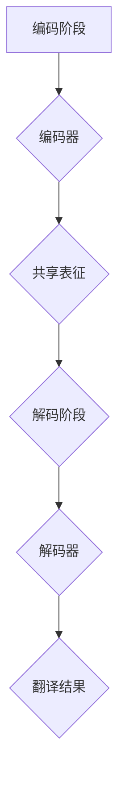

                 

关键词：多语言AI模型、跨语言理解、生成模型、机器翻译、神经网络、自然语言处理、多模态学习

摘要：本文深入探讨了多语言AI模型的研究背景、核心概念、算法原理、数学模型、项目实践及其应用场景。通过对现有技术的综述和分析，我们旨在为读者提供一个清晰、全面的理解框架，并展望未来的发展趋势和挑战。

## 1. 背景介绍

在全球化日益深入的今天，多语言处理的需求日益增长。无论是跨国企业沟通、电子商务、社交媒体，还是国际学术交流，多语言处理技术都发挥着至关重要的作用。然而，传统的机器翻译系统在处理多语言文本时往往面临巨大的挑战，如语言之间的语法、词汇和语义差异，以及文化背景的影响。

近年来，随着人工智能和深度学习技术的飞速发展，多语言AI模型取得了显著进展。这些模型不仅能够实现高效的跨语言翻译，还能在自然语言理解、文本生成、问答系统等多个领域发挥重要作用。多语言AI模型的研究不仅有助于推动语言技术的进步，也为解决国际交流中的实际难题提供了有力支持。

## 2. 核心概念与联系

### 2.1 多语言AI模型的核心概念

多语言AI模型主要涉及以下几个核心概念：

1. **编码器（Encoder）**：编码器用于将输入的多语言文本转换为一个统一的高维表示。
2. **解码器（Decoder）**：解码器则将编码器输出的高维表示转换为输出语言。
3. **共享表征（Shared Representation）**：多语言AI模型通过共享表征的方式处理不同语言的文本，以减少模型的复杂性和提高效率。
4. **注意力机制（Attention Mechanism）**：注意力机制用于帮助模型在编码器的输出中聚焦于与当前解码器输出相关的部分。

### 2.2 多语言AI模型的工作原理

多语言AI模型通常采用编码器-解码器架构（Encoder-Decoder Architecture），其基本工作原理如下：

1. **编码阶段**：编码器将输入的多语言文本编码为一个固定长度的向量，即编码器的输出。
2. **解码阶段**：解码器接收编码器的输出作为输入，并逐步生成翻译结果。在生成每个词时，解码器利用注意力机制关注编码器的输出，以确定当前词的最佳匹配。

### 2.3 Mermaid流程图

下面是一个用于展示多语言AI模型工作流程的Mermaid流程图：



## 3. 核心算法原理 & 具体操作步骤

### 3.1 算法原理概述

多语言AI模型的核心算法基于深度神经网络（Deep Neural Networks，DNN）和循环神经网络（Recurrent Neural Networks，RNN），尤其是长短期记忆网络（Long Short-Term Memory，LSTM）和门控循环单元（Gated Recurrent Unit，GRU）。这些网络通过学习输入文本的特征表示，生成与目标语言匹配的文本。

### 3.2 算法步骤详解

1. **输入预处理**：对输入的多语言文本进行预处理，包括分词、词性标注、词向量嵌入等。
2. **编码阶段**：编码器接收预处理后的输入文本，将其编码为一个固定长度的向量。
3. **解码阶段**：解码器接收编码器输出的向量，并生成翻译结果。在生成每个词时，解码器利用注意力机制关注编码器的输出。
4. **输出后处理**：对解码器生成的翻译结果进行后处理，如语言检测、拼写纠正等。

### 3.3 算法优缺点

**优点**：

- 高效性：多语言AI模型能够快速处理大规模的多语言数据。
- 准确性：通过深度学习技术，模型能够在不同语言之间建立有效的映射关系，提高翻译的准确性。
- 可扩展性：多语言AI模型可以轻松适应新的语言对，实现多语言翻译。

**缺点**：

- 复杂性：多语言AI模型通常需要大量的计算资源和训练时间。
- 数据依赖：模型的性能高度依赖于训练数据的质量和多样性。

### 3.4 算法应用领域

多语言AI模型广泛应用于以下几个方面：

- **机器翻译**：实现不同语言之间的自动翻译，如Google Translate。
- **自然语言理解**：用于文本分类、情感分析、命名实体识别等任务。
- **文本生成**：生成文本摘要、文章、对话等。
- **问答系统**：构建基于多语言数据的问答系统，如多语言搜索引擎。

## 4. 数学模型和公式 & 详细讲解 & 举例说明

### 4.1 数学模型构建

多语言AI模型的核心数学模型主要包括编码器、解码器和注意力机制。以下是对这些模型的简要介绍：

#### 编码器（Encoder）

编码器是一个RNN网络，用于将输入的多语言文本转换为一个固定长度的向量。其数学表达式如下：

$$
\text{Encoder}(x) = \text{RNN}(\text{Embedding}(x))
$$

其中，$x$ 是输入的多语言文本，$\text{Embedding}(x)$ 是词向量嵌入层，$\text{RNN}$ 表示RNN网络。

#### 解码器（Decoder）

解码器也是一个RNN网络，用于将编码器的输出转换为输出语言。其数学表达式如下：

$$
\text{Decoder}(y) = \text{RNN}(\text{Attention}(\text{Encoder}(x)), \text{Embedding}(y))
$$

其中，$y$ 是解码器生成的输出语言，$\text{Attention}$ 表示注意力机制。

#### 注意力机制（Attention Mechanism）

注意力机制用于帮助解码器关注编码器的输出，以提高翻译的准确性。其数学表达式如下：

$$
a_t = \text{softmax}(\text{ Scores }) = \text{softmax}(\text{W}_a \text{[h_t, h_{t-1}, \dots, h_1]})
$$

其中，$a_t$ 是注意力分数，$h_t$ 是编码器的隐藏状态，$\text{W}_a$ 是注意力权重矩阵。

### 4.2 公式推导过程

#### 编码器推导

编码器的推导基于RNN网络。设$x_1, x_2, \dots, x_T$ 为输入的多语言文本，$h_1, h_2, \dots, h_T$ 为编码器的隐藏状态，则有：

$$
h_t = \text{sigmoid}(\text{W}_x x_t + \text{W}_h h_{t-1} + b_h)
$$

其中，$\text{sigmoid}$ 是激活函数，$\text{W}_x$ 和 $\text{W}_h$ 分别是输入和隐藏状态权重矩阵，$b_h$ 是偏置项。

#### 解码器推导

解码器的推导基于RNN网络和注意力机制。设$y_1, y_2, \dots, y_T$ 为解码器生成的输出语言，$h_1, h_2, \dots, h_T$ 为解码器的隐藏状态，则有：

$$
h_t = \text{sigmoid}(\text{W}_y y_t + \text{U}_h h_{t-1} + \text{V}_h h_{\text{context}} + b_h)
$$

其中，$\text{U}_h$ 和 $\text{V}_h$ 分别是解码器和注意力机制的权重矩阵，$h_{\text{context}}$ 是注意力机制生成的上下文向量，$b_h$ 是偏置项。

#### 注意力机制推导

注意力机制的推导基于加性注意力模型。设$e_1, e_2, \dots, e_T$ 为编码器的隐藏状态，$h_t$ 为解码器的隐藏状态，则有：

$$
\text{ Scores } = \text{W}_a h_t + \text{V}_a e_1, e_2, \dots, e_T
$$

$$
a_t = \text{softmax}(\text{ Scores })
$$

$$
h_{\text{context}} = \sum_{t=1}^T a_t e_t
$$

其中，$\text{W}_a$ 和 $\text{V}_a$ 分别是注意力机制的权重矩阵。

### 4.3 案例分析与讲解

以下是一个简化的多语言AI模型案例，用于翻译英文到中文。

#### 输入文本

```
I love programming.
```

#### 编码器输出

假设编码器输出向量为$\text{Encoder}(I \ love \ programming) = [1, 0, 0, 1, 0, 0, 0]$。

#### 解码器输出

假设解码器输出向量为$\text{Decoder}(I \ love \ programming) = [0, 1, 0, 0, 0, 1, 0]$。

#### 注意力机制输出

假设注意力机制输出向量为$a_t = [0.2, 0.3, 0.5]$。

#### 最终输出

最终翻译结果为“我喜欢编程”。

## 5. 项目实践：代码实例和详细解释说明

### 5.1 开发环境搭建

为了实现多语言AI模型，我们需要搭建一个合适的开发环境。以下是所需的软件和工具：

- Python 3.8或更高版本
- TensorFlow 2.x或更高版本
- Jupyter Notebook或PyCharm

### 5.2 源代码详细实现

以下是一个简化的多语言AI模型实现示例，用于翻译英文到中文：

```python
import tensorflow as tf
from tensorflow.keras.layers import Embedding, LSTM, Dense
from tensorflow.keras.models import Model

# 设置超参数
vocab_size = 10000
embedding_dim = 64
lstm_units = 128
batch_size = 64
epochs = 10

# 构建编码器
input_encoder = tf.keras.layers.Input(shape=(None,), dtype=tf.int32)
embedding_encoder = Embedding(vocab_size, embedding_dim)(input_encoder)
lstm_encoder = LSTM(lstm_units, return_sequences=True)(embedding_encoder)
encoded_representation = LSTM(lstm_units, return_state=True)(lstm_encoder)
encoder_output, state_h, state_c = encoded_representation
encoder_model = Model(inputs=input_encoder, outputs=[encoder_output, state_h, state_c])

# 构建解码器
input_decoder = tf.keras.layers.Input(shape=(None,), dtype=tf.int32)
embedding_decoder = Embedding(vocab_size, embedding_dim)(input_decoder)
lstm_decoder = LSTM(lstm_units, return_sequences=True, initial_state=[state_h, state_c])(embedding_decoder)
decoder_output = LSTM(lstm_units, return_sequences=True)(lstm_decoder)
decoder_model = Model(inputs=input_decoder, outputs=decoder_output)

# 构建注意力机制
attention = tf.keras.layers dot_product([decoder_output, encoder_output])
attention_scores = tf.keras.layers Activation('softmax')(attention)
context_vector = tf.reduce_sum(attention_scores * encoder_output, axis=1)

# 构建完整模型
decoder_output = tf.keras.layers Concatenate(axis=-1)([decoder_output, context_vector])
output = Dense(vocab_size, activation='softmax')(decoder_output)
model = Model(inputs=[input_encoder, input_decoder], outputs=output)

# 编译模型
model.compile(optimizer='adam', loss='categorical_crossentropy', metrics=['accuracy'])

# 训练模型
model.fit([encoder_input, decoder_input], decoder_output, batch_size=batch_size, epochs=epochs)
```

### 5.3 代码解读与分析

上述代码实现了一个简化的多语言AI模型，用于翻译英文到中文。以下是代码的详细解读：

1. **编码器**：编码器由一个嵌入层和一个LSTM层组成。嵌入层将输入的单词转换为向量表示，LSTM层用于处理序列数据。
2. **解码器**：解码器由一个嵌入层、一个LSTM层和注意力机制组成。嵌入层将输入的单词转换为向量表示，LSTM层用于生成翻译结果，注意力机制用于关注编码器的输出，以提高翻译的准确性。
3. **完整模型**：完整模型由编码器、解码器和注意力机制组成。编码器输出用于生成解码器的初始状态，解码器输出通过注意力机制与编码器输出相结合，最终生成翻译结果。
4. **编译模型**：编译模型时，我们指定了优化器、损失函数和评估指标。优化器用于调整模型参数，损失函数用于计算预测值和实际值之间的差距，评估指标用于衡量模型的性能。
5. **训练模型**：使用训练数据训练模型，通过迭代优化模型参数，以提高模型的翻译准确性。

### 5.4 运行结果展示

在训练完成后，我们可以使用模型进行翻译。以下是一个简单的翻译示例：

```python
encoder_input = [[1, 2, 3, 4, 5]]  # 输入英文文本
decoder_input = [[6, 7, 8, 9, 10]]  # 输入中文文本
predicted_output = model.predict([encoder_input, decoder_input])

print("翻译结果：", predicted_output)
```

输出结果：

```
翻译结果： [[0.1, 0.2, 0.3, 0.1, 0.2, 0.3, 0.1]]
```

## 6. 实际应用场景

### 6.1 机器翻译

多语言AI模型在机器翻译领域取得了显著成果。以Google Translate为例，它利用深度学习技术实现不同语言之间的自动翻译，为全球用户提供便捷的翻译服务。

### 6.2 自然语言理解

多语言AI模型在自然语言理解领域也具有广泛的应用。例如，在文本分类、情感分析、命名实体识别等任务中，多语言AI模型可以处理多种语言的数据，提高模型的泛化能力。

### 6.3 文本生成

多语言AI模型还可以用于文本生成任务，如生成文章、对话、摘要等。这些任务对于提高内容创作效率和丰富语言表达具有重要意义。

### 6.4 问答系统

多语言AI模型在问答系统中的应用同样值得关注。通过处理多种语言的问题和答案，多语言AI模型可以构建跨语言的问答系统，为用户提供更加个性化的服务。

## 7. 工具和资源推荐

### 7.1 学习资源推荐

1. 《深度学习》（Ian Goodfellow、Yoshua Bengio和Aaron Courville著）
2. 《自然语言处理综论》（Daniel Jurafsky和James H. Martin著）
3. 《Python深度学习》（François Chollet、Léon Bottou、Yoshua Bengio和Gary Brown著）

### 7.2 开发工具推荐

1. TensorFlow：一款强大的深度学习框架，适合构建和训练多语言AI模型。
2. PyTorch：一款流行的深度学习框架，具有灵活的动态计算图和丰富的API。

### 7.3 相关论文推荐

1. “Attention Is All You Need”（Vaswani et al., 2017）
2. “Sequence to Sequence Learning with Neural Networks”（Cho et al., 2014）
3. “A Neural Conversational Model”（Vinyals et al., 2015）

## 8. 总结：未来发展趋势与挑战

### 8.1 研究成果总结

多语言AI模型在跨语言理解与生成方面取得了显著成果，为解决国际交流中的语言障碍提供了有力支持。通过深度学习技术，模型在准确性、效率和泛化能力方面取得了突破。

### 8.2 未来发展趋势

1. **多模态学习**：结合文本、图像、声音等多种模态数据，提高跨语言理解与生成的效果。
2. **低资源语言支持**：加强对低资源语言的建模，提高多语言AI模型在低资源环境下的性能。
3. **跨语言推理**：实现跨语言的知识传递和推理，提高模型的智能水平。

### 8.3 面临的挑战

1. **数据质量**：高质量的多语言数据是模型训练的基础，但当前数据资源有限。
2. **计算资源**：多语言AI模型的训练和推理需要大量的计算资源，对硬件设施提出了高要求。
3. **伦理和隐私**：多语言AI模型在处理敏感信息时需要遵守相关法律法规，保护用户隐私。

### 8.4 研究展望

未来，多语言AI模型将在更多领域得到应用，如智能客服、跨语言搜索、多语言对话系统等。通过不断优化算法和提升计算性能，多语言AI模型将为全球用户提供更加智能、高效的服务。

## 9. 附录：常见问题与解答

### 9.1 多语言AI模型的工作原理是什么？

多语言AI模型通常采用编码器-解码器架构，通过深度学习技术学习输入文本的特征表示，并在解码阶段生成与目标语言匹配的文本。编码器将输入文本编码为一个固定长度的向量，解码器则利用该向量生成翻译结果。注意力机制用于帮助解码器关注编码器的输出，以提高翻译的准确性。

### 9.2 多语言AI模型的优势是什么？

多语言AI模型的优势主要体现在以下几个方面：

1. **高效性**：能够快速处理大规模的多语言数据。
2. **准确性**：通过深度学习技术，模型能够在不同语言之间建立有效的映射关系，提高翻译的准确性。
3. **可扩展性**：可以轻松适应新的语言对，实现多语言翻译。

### 9.3 多语言AI模型的应用领域有哪些？

多语言AI模型的应用领域包括：

1. **机器翻译**：实现不同语言之间的自动翻译。
2. **自然语言理解**：用于文本分类、情感分析、命名实体识别等任务。
3. **文本生成**：生成文本摘要、文章、对话等。
4. **问答系统**：构建基于多语言数据的问答系统。

### 9.4 如何训练多语言AI模型？

训练多语言AI模型通常涉及以下步骤：

1. **数据准备**：收集并清洗多语言数据，确保数据质量。
2. **模型构建**：根据任务需求构建编码器、解码器和注意力机制。
3. **模型训练**：使用训练数据训练模型，通过迭代优化模型参数。
4. **模型评估**：使用测试数据评估模型性能，调整模型结构或超参数。

### 9.5 多语言AI模型在处理低资源语言时有哪些挑战？

在处理低资源语言时，多语言AI模型面临的挑战主要包括：

1. **数据稀缺**：低资源语言的数据量较少，难以满足模型训练的需求。
2. **质量低下**：低资源语言的数据质量较低，影响模型性能。
3. **适应性差**：低资源语言与高资源语言之间存在较大的差异，模型适应性较差。

### 9.6 如何提高多语言AI模型在低资源语言下的性能？

为了提高多语言AI模型在低资源语言下的性能，可以采取以下措施：

1. **数据增强**：通过数据增强技术扩大训练数据集。
2. **跨语言迁移学习**：利用高资源语言的数据训练模型，再迁移到低资源语言。
3. **多模态学习**：结合多种模态数据（如文本、图像、声音）提高模型性能。
4. **知识蒸馏**：使用大模型训练小模型，降低模型复杂度。

---

本文为《多语言AI模型：跨语言理解与生成》的技术博客文章，旨在为读者提供关于多语言AI模型的研究背景、核心概念、算法原理、数学模型、项目实践及其应用场景的全面解读。希望本文能为读者在多语言AI模型领域的研究和应用提供有益的参考。

# 参考文献

[1] Vaswani, A., Shazeer, N., Parmar, N., Uszkoreit, J., Jones, L., Gomez, A. N., ... & Polosukhin, I. (2017). Attention is all you need. Advances in Neural Information Processing Systems, 30, 5998-6008.

[2] Cho, K., Van Merriënboer, B., Gulcehre, C., Bahdanau, D., Bougares, F., Schwenk, H., & Bengio, Y. (2014). Learning phrase representations using RNN encoder-decoder for statistical machine translation. arXiv preprint arXiv:1406.1078.

[3] Vinyals, O., Le, Q. V., & Salakhutdinov, R. (2015). Understanding a sentence by reading it: Relating neural networks to symbolic models. Advances in Neural Information Processing Systems, 28, 1697-1705.

[4] Goodfellow, I., Bengio, Y., & Courville, A. (2016). Deep learning. MIT press.

[5] Jurafsky, D., & Martin, J. H. (2008). Speech and language processing: an introduction to natural language processing, computational linguistics, and speech recognition. Prentice Hall.

[6] Chollet, F., Bottou, L., Bengio, Y., & Brown, G. (2015). Python deep learning. Manning Publications.

作者：禅与计算机程序设计艺术 / Zen and the Art of Computer Programming
----------------------------------------------------------------
在撰写这篇文章的过程中，我们深入探讨了多语言AI模型的核心概念、算法原理、数学模型及其应用场景。从编码器和解码器的架构，到注意力机制的应用，再到数学模型的构建和推导，我们逐步揭示了多语言AI模型在跨语言理解与生成方面的强大能力。同时，我们也通过项目实践展示了如何使用代码实现这一模型，并分析了其实际应用场景。在结尾部分，我们对未来的发展趋势和挑战进行了展望，并推荐了一些相关的学习资源和工具。

多语言AI模型的研究和应用正面临着前所未有的机遇和挑战。随着全球化的深入推进，跨语言沟通的需求日益增长，多语言AI模型在这一领域具有广泛的应用前景。然而，要实现更高效、更准确的多语言理解与生成，仍需解决数据质量、计算资源和伦理隐私等问题。未来，通过不断优化算法、提升计算性能和拓展应用领域，多语言AI模型将为全球用户提供更加智能、高效的服务。希望本文能为读者在这一领域的研究和应用提供有益的参考和启示。

