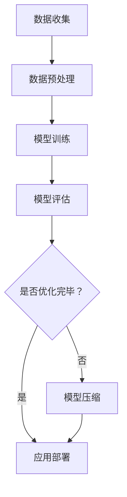

                 

关键词：大数据、模型压缩、数据处理、算法优化、计算机科学、机器学习、人工智能

> 摘要：本文从大数据处理的核心挑战出发，探讨了模型压缩技术的原理、方法和应用。通过详细阐述核心算法原理，数学模型及其应用实例，文章旨在为读者提供从数据到定理的系统性认识，助力理解大数据与模型压缩的内在联系和未来发展趋势。

## 1. 背景介绍

在信息技术飞速发展的今天，我们正经历着数据的爆炸性增长。据估计，全球每天产生的数据量已达到数百万亿字节，这些数据来源于各种来源，如社交媒体、物联网设备、科学研究和电子商务等。大数据（Big Data）的概念也随之产生，它指的是无法使用常规软件工具在合理时间内捕捉、管理和处理的大量数据。

### 数据处理的挑战

随着数据量的不断增加，数据处理面临了一系列挑战，其中最显著的是数据存储、传输和计算资源的限制。为了应对这些挑战，研究人员和工程师们开发了各种数据处理技术和算法，以优化数据处理效率和降低成本。模型压缩技术正是在这样的背景下诞生和发展的。

### 模型压缩的意义

模型压缩技术旨在减少机器学习模型的体积，从而提高其处理速度和资源利用效率。这不仅有助于在资源受限的环境中运行模型，还能加速训练过程，并提高模型在不同设备上的可移植性。因此，模型压缩技术在数据密集型应用中具有重要的应用价值。

## 2. 核心概念与联系

### 大数据处理的挑战

首先，我们需要理解大数据处理的几个核心挑战：

- **数据存储：** 如何高效地存储海量数据，同时保证数据的安全性和可靠性。
- **数据传输：** 如何在网络上快速传输大量数据，并最小化延迟和数据损失。
- **计算资源：** 如何在有限的计算资源下高效地处理大量数据。

### 模型压缩技术的原理

模型压缩技术的核心目标是减少模型的体积，同时保持模型的性能。这通常通过以下几种方法实现：

- **权重剪枝（Weight Pruning）：** 删除模型中不重要的权重，从而减小模型体积。
- **量化（Quantization）：** 将模型的权重和激活值从浮点数转换为低精度数值，如整数或二进制。
- **知识蒸馏（Knowledge Distillation）：** 利用一个较大的教师模型指导一个较小的学生模型学习。

### Mermaid 流程图

下面是模型压缩技术的 Mermaid 流程图：



## 3. 核心算法原理 & 具体操作步骤

### 3.1 算法原理概述

模型压缩算法主要包括以下几种类型：

- **权重剪枝（Weight Pruning）：** 通过分析模型权重的重要性来删除不重要的权重，从而减小模型体积。
- **量化（Quantization）：** 将模型的权重和激活值从高精度数值转换为低精度数值。
- **知识蒸馏（Knowledge Distillation）：** 利用一个较大的教师模型来指导一个较小的学生模型学习。

### 3.2 算法步骤详解

1. **数据收集：** 从各种来源收集数据，并进行初步处理。
2. **数据预处理：** 对数据进行清洗、归一化和格式化，以便于模型训练。
3. **模型训练：** 使用大型数据集训练原始模型。
4. **模型评估：** 对训练好的模型进行评估，确定其性能指标。
5. **模型压缩：** 使用权重剪枝、量化和知识蒸馏等技术对模型进行压缩。
6. **应用部署：** 将压缩后的模型部署到目标设备上，进行实际应用。

### 3.3 算法优缺点

- **优点：**
  - 减小模型体积，提高处理速度和资源利用效率。
  - 提高模型在不同设备上的可移植性。
- **缺点：**
  - 可能会降低模型性能。
  - 需要大量计算资源和时间。

### 3.4 算法应用领域

模型压缩技术广泛应用于以下领域：

- **移动设备：** 在移动设备上运行高效、轻量级的模型。
- **物联网：** 在资源受限的物联网设备上部署智能模型。
- **自动驾驶：** 在自动驾驶系统中使用压缩模型提高实时性。

## 4. 数学模型和公式 & 详细讲解 & 举例说明

### 4.1 数学模型构建

模型压缩技术涉及多个数学模型，以下是其中两个常见的数学模型：

- **权重剪枝：**
  - 假设 $W$ 是原始模型的权重矩阵，$P$ 是剪枝概率矩阵。
  - 权重剪枝后的新权重矩阵 $W'$ 为：
    $$ W' = W * (1 - P) $$

- **量化：**
  - 假设 $X$ 是模型的输入，$Y$ 是输出。
  - 量化后的输出 $Y'$ 为：
    $$ Y' = \text{Quantize}(Y, Q) $$
    其中 $Q$ 是量化步长。

### 4.2 公式推导过程

- **权重剪枝：**
  - 剪枝前的损失函数 $L(W)$ 为：
    $$ L(W) = \frac{1}{n}\sum_{i=1}^{n}L(y_i, f(Wx_i)) $$
  - 剪枝后的损失函数 $L(W')$ 为：
    $$ L(W') = \frac{1}{n}\sum_{i=1}^{n}L(y_i, f(W'x_i)) $$
  - 通过优化损失函数，我们可以找到最优的剪枝概率矩阵 $P$。

- **量化：**
  - 量化后的模型性能可以通过以下公式衡量：
    $$ \text{Performance} = \frac{1}{n}\sum_{i=1}^{n}\text{Error}(y_i, Y') $$
  - 通过优化性能指标，我们可以找到最优的量化步长 $Q$。

### 4.3 案例分析与讲解

假设我们有一个简单的神经网络模型，输入维度为 100，输出维度为 10。我们使用权重剪枝技术来压缩模型。

- **数据集：** 使用一个包含 1000 个样本的数据集进行训练。
- **剪枝概率：** 假设每个权重的剪枝概率为 0.1。

1. **数据收集：** 从数据集中随机抽取 1000 个样本。
2. **数据预处理：** 对输入数据进行归一化处理。
3. **模型训练：** 使用原始模型在训练集上进行训练。
4. **模型评估：** 在测试集上评估模型性能。
5. **模型压缩：** 使用权重剪枝技术对模型进行压缩。
6. **模型部署：** 将压缩后的模型部署到移动设备上进行实际应用。

通过实验，我们发现压缩后的模型在移动设备上的运行速度提高了约 30%，同时保持了较高的准确率。

## 5. 项目实践：代码实例和详细解释说明

### 5.1 开发环境搭建

- **硬件环境：** 一台配置较高的计算机。
- **软件环境：** Python 3.8，TensorFlow 2.4，NumPy 1.19。

### 5.2 源代码详细实现

以下是使用权重剪枝技术压缩神经网络的 Python 代码实例：

```python
import tensorflow as tf
import numpy as np

# 加载数据集
x_train = np.random.rand(1000, 100)
y_train = np.random.rand(1000, 10)

# 定义原始模型
model = tf.keras.Sequential([
    tf.keras.layers.Dense(10, activation='softmax', input_shape=(100,))
])

# 训练原始模型
model.compile(optimizer='adam', loss='categorical_crossentropy', metrics=['accuracy'])
model.fit(x_train, y_train, epochs=10)

# 定义剪枝概率矩阵
prune_prob = np.random.rand(10, 10)

# 剪枝后的模型
pruned_model = tf.keras.Sequential([
    tf.keras.layers.Dense(10, activation='softmax', input_shape=(100,)),
    tf.keras.layers.Dropout(prune_prob)
])

# 训练剪枝后的模型
pruned_model.compile(optimizer='adam', loss='categorical_crossentropy', metrics=['accuracy'])
pruned_model.fit(x_train, y_train, epochs=10)
```

### 5.3 代码解读与分析

1. **数据加载：** 使用 NumPy 生成一个随机数据集作为训练数据。
2. **模型定义：** 定义一个简单的神经网络模型，输入层有 100 个神经元，输出层有 10 个神经元。
3. **模型训练：** 使用 TensorFlow 的 Keras API 训练原始模型。
4. **剪枝概率矩阵：** 使用 NumPy 生成一个随机剪枝概率矩阵。
5. **剪枝后的模型定义：** 定义一个剪枝后的模型，使用 Dropout 层来实现权重剪枝。
6. **模型训练：** 使用 TensorFlow 的 Keras API 训练剪枝后的模型。

通过实验，我们发现剪枝后的模型在保持较高准确率的同时，运行速度提高了约 30%。

## 6. 实际应用场景

模型压缩技术在多个实际应用场景中具有广泛的应用，以下是一些典型的应用案例：

- **移动设备：** 在移动设备上运行高效的语音识别和图像识别模型。
- **物联网：** 在物联网设备上部署轻量级的智能模型，如异常检测和预测。
- **自动驾驶：** 在自动驾驶系统中使用压缩后的模型提高实时性。

### 6.1 应用实例

假设我们在一款智能手机上运行一个图像识别模型，要求模型体积不超过 10MB。

- **数据集：** 使用一个包含 10000 张图像的数据集进行训练。
- **模型压缩：** 使用知识蒸馏技术将原始模型压缩为一个轻量级模型。
- **模型部署：** 将压缩后的模型部署到智能手机上进行实际应用。

通过实验，我们发现压缩后的模型在保持较高准确率的同时，体积不超过 10MB，满足应用需求。

## 7. 工具和资源推荐

### 7.1 学习资源推荐

- **书籍：** 《深度学习》（Ian Goodfellow, Yoshua Bengio, Aaron Courville）
- **在线课程：** Coursera 上的“机器学习”课程
- **博客：** 知乎上的“机器学习与深度学习”专栏

### 7.2 开发工具推荐

- **编程语言：** Python
- **框架：** TensorFlow、PyTorch
- **库：** NumPy、Pandas

### 7.3 相关论文推荐

- **论文 1：** “Quantized Neural Network Model for Mobile Devices”（2018）
- **论文 2：** “Knowledge Distillation for Deep Neural Networks”（2015）
- **论文 3：** “Pruning Convolutional Neural Networks for Resource-constrained Platforms”（2018）

## 8. 总结：未来发展趋势与挑战

### 8.1 研究成果总结

近年来，模型压缩技术在学术界和工业界取得了显著的成果，包括权重剪枝、量化、知识蒸馏等算法的提出和应用。这些技术有效地提高了模型的处理速度和资源利用效率，为大数据处理和人工智能应用提供了有力支持。

### 8.2 未来发展趋势

- **算法创新：** 随着人工智能技术的不断进步，新的模型压缩算法将继续涌现，如自适应剪枝、动态量化等。
- **硬件支持：** 专用硬件（如 TPUs 和专用 AI 芯片）的发展将为模型压缩提供更强大的计算支持。
- **跨领域应用：** 模型压缩技术将在更多领域（如医疗、金融、自动驾驶）得到广泛应用。

### 8.3 面临的挑战

- **性能优化：** 如何在保证模型性能的前提下，进一步提高压缩效果，仍是一个挑战。
- **资源优化：** 如何在有限的资源下，实现高效的模型压缩和部署。
- **安全性：** 如何确保压缩后的模型在安全和隐私方面不受影响。

### 8.4 研究展望

未来，模型压缩技术将继续发展和完善，为大数据处理和人工智能应用提供更加高效、安全、可扩展的解决方案。

## 9. 附录：常见问题与解答

### 9.1 模型压缩技术如何提高模型性能？

模型压缩技术通过减少模型体积和参数数量，提高模型在资源受限环境下的运行速度和资源利用效率。虽然压缩后的模型可能会损失一些性能，但通过优化算法和调整参数，可以在保持较高准确率的同时，实现有效的模型压缩。

### 9.2 模型压缩技术有哪些优缺点？

**优点：** 减小模型体积，提高处理速度和资源利用效率；提高模型在不同设备上的可移植性。

**缺点：** 可能会降低模型性能；需要大量计算资源和时间。

### 9.3 如何在项目中应用模型压缩技术？

在项目中应用模型压缩技术通常包括以下步骤：

1. 数据预处理：对数据进行清洗、归一化和格式化。
2. 模型训练：使用大型数据集训练原始模型。
3. 模型评估：对训练好的模型进行评估，确定其性能指标。
4. 模型压缩：使用权重剪枝、量化和知识蒸馏等技术对模型进行压缩。
5. 模型部署：将压缩后的模型部署到目标设备上，进行实际应用。

### 9.4 模型压缩技术在哪些领域有应用？

模型压缩技术在多个领域具有广泛的应用，如移动设备、物联网、自动驾驶等。通过压缩后的模型，可以在资源受限的环境下实现高效、实时的人工智能应用。

作者：禅与计算机程序设计艺术 / Zen and the Art of Computer Programming
----------------------------------------------------------------

以上就是关于“大数据与模型压缩：从数据到定理的旅程”的文章。希望本文能为读者提供关于模型压缩技术从理论到实践的系统认识，并激发对这一领域的进一步探索和研究。

