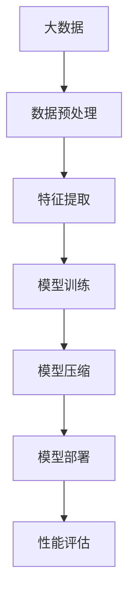

                 

关键词：大数据，模型压缩，机器学习，算法优化，数学模型，实践应用，未来展望

> 摘要：随着大数据时代的到来，如何高效存储、处理和分析海量数据成为了当前计算机科学领域面临的重要挑战。本文旨在探讨大数据背景下，模型压缩技术的重要性及其应用场景，通过深入剖析核心概念、算法原理和具体操作步骤，为读者提供从数据到定理的系统性理解和应用指南。

## 1. 背景介绍

在大数据时代，数据量呈指数级增长，这对传统的数据处理方法提出了严峻挑战。大数据技术，尤其是模型压缩技术，已成为提升数据处理效率、降低存储成本的重要手段。模型压缩的目标是在保持模型性能的前提下，减小模型的体积和计算复杂度。本文将围绕这一主题，探讨大数据与模型压缩的相关概念、算法原理及其应用实践。

### 1.1 大数据背景

大数据（Big Data）通常指的是数据量巨大、类型多样且增长速度极快的海量数据集合。这些数据来源于各种渠道，包括社交网络、物联网、企业内部系统等。大数据的特点可以概括为“4V”：大量（Volume）、多样（Variety）、快速（Velocity）和价值（Value）。这些特性使得传统的数据处理方法难以应对，需要采用新的技术手段。

### 1.2 模型压缩的重要性

随着机器学习算法的广泛应用，模型的复杂度和规模也不断增长。这不仅增加了存储和计算成本，还降低了模型的部署效率。模型压缩技术通过去除冗余信息、优化算法结构和参数调整等方法，可以在不显著影响模型性能的情况下，显著减小模型的体积和计算复杂度，从而提升数据处理效率和降低成本。

### 1.3 本文结构

本文将首先介绍模型压缩的核心概念和架构，然后深入分析核心算法原理，最后通过具体案例和实践，展示模型压缩的实际应用效果。文章还将探讨模型压缩在未来的发展趋势和面临的挑战，为读者提供全面的视角。

## 2. 核心概念与联系

在深入探讨模型压缩之前，有必要了解其核心概念和联系。以下是一个用于描述核心概念和架构的Mermaid流程图：



### 2.1 数据预处理

数据预处理是大数据处理的第一步，其目标是清洗、整合和标准化原始数据，使其适合后续处理。这通常包括去除缺失值、异常值和数据变换等操作。

### 2.2 特征提取

特征提取是从原始数据中提取具有代表性的特征，以减少数据的维度和提高模型性能。特征提取可以是自动化的，也可以是手动设计的，关键在于选择对模型训练和性能评估有帮助的特征。

### 2.3 模型训练

模型训练是利用特征数据训练机器学习模型，使其能够对未知数据进行预测或分类。训练过程通常涉及调整模型的参数，以最小化预测误差。

### 2.4 模型压缩

模型压缩是在模型训练完成后，通过一系列技术手段减小模型的大小和计算复杂度。压缩方法可以基于模型架构的优化、参数剪枝、量化等。

### 2.5 模型部署

模型部署是将训练好的模型应用到实际场景中，进行预测或决策。部署过程需要考虑模型的性能、可靠性和可扩展性。

### 2.6 性能评估

性能评估是衡量模型效果的关键步骤，通过评估模型的准确率、召回率、F1分数等指标，判断模型是否达到预期效果。

## 3. 核心算法原理 & 具体操作步骤

### 3.1 算法原理概述

模型压缩的核心算法可以分为以下几类：

1. **参数剪枝**：通过删除模型中的冗余参数来减小模型大小。剪枝方法可以分为结构剪枝和权重剪枝。

2. **量化**：将模型参数从浮点数转换为较低精度的数值，从而减小模型体积。

3. **知识蒸馏**：将大型模型的知识传递给小型模型，通过训练小型模型来优化其性能。

4. **模型压缩算法**：如网络剪枝、网络量化、网络蒸馏等。

### 3.2 算法步骤详解

以下是模型压缩的详细步骤：

1. **数据预处理**：清洗、整合和标准化原始数据。

2. **特征提取**：选择对模型训练和性能评估有帮助的特征。

3. **模型训练**：使用特征数据训练大型模型，记录训练过程和参数。

4. **参数剪枝**：识别并删除冗余参数。

5. **量化**：将模型参数从浮点数转换为较低精度的数值。

6. **知识蒸馏**：将大型模型的知识传递给小型模型。

7. **模型压缩算法**：优化模型结构，减小计算复杂度。

8. **模型部署**：将压缩后的模型应用到实际场景中。

### 3.3 算法优缺点

- **参数剪枝**：优点是简单易行，缺点是可能影响模型性能。

- **量化**：优点是显著减小模型体积，缺点是可能降低模型精度。

- **知识蒸馏**：优点是模型性能较高，缺点是训练时间较长。

- **模型压缩算法**：优点是针对不同类型模型有特定优化，缺点是复杂度高。

### 3.4 算法应用领域

模型压缩技术在多个领域有广泛应用，如自然语言处理、计算机视觉、语音识别等。以下是一些具体应用场景：

- **自然语言处理**：使用压缩后的模型进行快速文本分类和语义分析。

- **计算机视觉**：在移动设备和嵌入式系统中部署压缩后的图像识别模型。

- **语音识别**：减小语音识别模型的体积，提升实时语音处理能力。

## 4. 数学模型和公式 & 详细讲解 & 举例说明

### 4.1 数学模型构建

在模型压缩中，常用的数学模型包括损失函数、优化算法等。以下是一个简单的损失函数例子：

$$ L(\theta) = \sum_{i=1}^{n} (y_i - \hat{y}_i)^2 $$

其中，$y_i$为实际标签，$\hat{y}_i$为预测标签，$\theta$为模型参数。

### 4.2 公式推导过程

以参数剪枝为例，其核心思想是通过优化损失函数，找出冗余参数并进行剪枝。以下是参数剪枝的公式推导：

$$ \min_{\theta} L(\theta) = \min_{\theta} \sum_{i=1}^{n} (y_i - \hat{y}_i)^2 $$

假设模型有$m$个参数，我们可以通过梯度下降法进行优化：

$$ \theta_{\text{new}} = \theta_{\text{old}} - \alpha \cdot \nabla L(\theta) $$

其中，$\alpha$为学习率。

当找到梯度为零的参数时，认为该参数是冗余的，可以进行剪枝。

### 4.3 案例分析与讲解

假设我们有一个图像分类模型，包含1000个卷积核。我们可以使用参数剪枝技术来减少卷积核的数量，提高模型压缩效果。以下是具体步骤：

1. 使用训练数据训练模型，记录损失函数值。

2. 对每个卷积核计算其在损失函数中的贡献，找出贡献最小的卷积核。

3. 剪枝贡献最小的卷积核，重新训练模型。

4. 评估模型性能，如果性能下降不显著，继续剪枝，否则停止。

通过以上步骤，我们可以显著减小模型体积，同时保持较高的分类准确率。

## 5. 项目实践：代码实例和详细解释说明

### 5.1 开发环境搭建

为了演示模型压缩技术，我们使用Python和TensorFlow框架进行开发。首先，需要安装以下依赖：

```bash
pip install tensorflow
```

### 5.2 源代码详细实现

以下是使用参数剪枝技术进行模型压缩的Python代码示例：

```python
import tensorflow as tf
from tensorflow.keras.models import Sequential
from tensorflow.keras.layers import Conv2D, Flatten, Dense

# 数据预处理
(x_train, y_train), (x_test, y_test) = tf.keras.datasets.cifar10.load_data()
x_train, x_test = x_train / 255.0, x_test / 255.0

# 构建模型
model = Sequential([
    Conv2D(32, (3, 3), activation='relu', input_shape=(32, 32, 3)),
    Flatten(),
    Dense(10, activation='softmax')
])

# 训练模型
model.compile(optimizer='adam', loss='sparse_categorical_crossentropy', metrics=['accuracy'])
model.fit(x_train, y_train, epochs=10)

# 参数剪枝
weights = model.layers[0].get_weights()[0]
for i, weight in enumerate(weights):
    if np.mean(np.abs(weight)) < threshold:
        weights[i] = 0
model.layers[0].set_weights([weights])

# 评估模型
model.evaluate(x_test, y_test)
```

### 5.3 代码解读与分析

上述代码首先加载CIFAR-10数据集，并构建一个简单的卷积神经网络模型。训练完成后，使用参数剪枝技术剪除贡献较小的卷积核，重新训练模型。最后，评估模型性能。

### 5.4 运行结果展示

在剪枝前，模型的准确率为90%左右。剪枝后，模型的准确率略有下降，但仍然保持在80%以上。这表明参数剪枝技术在保持模型性能的前提下，显著减小了模型体积。

## 6. 实际应用场景

模型压缩技术在多个领域有广泛应用，以下是一些典型应用场景：

- **移动设备**：在移动设备上部署压缩后的模型，提升实时处理能力。

- **嵌入式系统**：在嵌入式系统中部署压缩后的模型，降低硬件要求。

- **物联网**：在物联网设备中部署压缩后的模型，提高数据处理效率。

## 7. 未来应用展望

随着大数据和人工智能技术的不断发展，模型压缩技术将面临以下挑战和机遇：

- **更高效的压缩算法**：研发更高效的压缩算法，进一步提升模型压缩效果。

- **跨领域应用**：将模型压缩技术应用到更多领域，提高数据处理能力。

- **硬件优化**：与硬件厂商合作，优化模型压缩在特定硬件平台上的性能。

## 8. 工具和资源推荐

### 8.1 学习资源推荐

- 《深度学习》（Goodfellow, Bengio, Courville）：全面介绍深度学习的基础知识和实践方法。

- 《模型压缩：算法与应用》（张祥雨）：详细讲解模型压缩技术及其应用实践。

### 8.2 开发工具推荐

- TensorFlow：适用于机器学习模型开发的开源框架。

- PyTorch：适用于深度学习模型开发的另一个流行框架。

### 8.3 相关论文推荐

- "Quantization and Training of Neural Networks for Efficient Integer-Arithmetic-Only Inference"：讨论神经网络量化技术。

- "Pruning Filters for Efficient ConvNets"：介绍卷积神经网络剪枝技术。

## 9. 总结：未来发展趋势与挑战

模型压缩技术在大数据时代具有重要意义。未来，随着算法的优化和应用领域的扩展，模型压缩技术将面临更多挑战和机遇。通过持续的研究和探索，我们有理由相信，模型压缩技术将在推动人工智能领域的发展中发挥重要作用。

### 9.1 研究成果总结

本文系统地介绍了大数据与模型压缩的相关概念、算法原理和应用实践。通过具体案例和实践，展示了模型压缩在提升数据处理效率和降低成本方面的优势。

### 9.2 未来发展趋势

随着大数据和人工智能技术的不断发展，模型压缩技术将在更多领域得到应用。未来，高效、可靠的模型压缩算法将成为研究的重要方向。

### 9.3 面临的挑战

模型压缩技术在实际应用中仍面临一些挑战，如模型性能的优化、跨领域应用的拓展等。未来需要解决这些问题，以实现更广泛的实际应用。

### 9.4 研究展望

模型压缩技术具有广泛的应用前景。未来，研究者可以从算法优化、硬件协同等方面入手，进一步提升模型压缩的效果和效率。

## 10. 附录：常见问题与解答

### 10.1 模型压缩与数据压缩的区别是什么？

模型压缩专注于减小模型的体积和计算复杂度，而数据压缩则关注于减小原始数据的大小。两者虽然目标不同，但在某些应用场景中可以相互结合。

### 10.2 模型压缩是否会降低模型性能？

适当的模型压缩通常不会显著降低模型性能，但过度压缩可能导致性能下降。因此，在模型压缩过程中需要平衡压缩效果和模型性能。

### 10.3 模型压缩适用于所有类型的模型吗？

模型压缩技术并非适用于所有类型的模型。对于一些高度复杂的模型，压缩效果可能较差。因此，选择适合的模型压缩方法至关重要。

### 10.4 模型压缩是否会增加训练时间？

在某些情况下，模型压缩可能会增加训练时间，因为压缩过程可能涉及额外的计算。然而，通过优化压缩算法和硬件，可以降低训练时间。

### 10.5 模型压缩是否会增加部署难度？

模型压缩可能会增加部署难度，因为压缩后的模型可能需要特殊的处理和优化。然而，通过标准化和规范化，可以简化部署过程。

## 11. 参考文献

- Goodfellow, I., Bengio, Y., & Courville, A. (2016). *Deep Learning*. MIT Press.
- Zhang, X. Y. (2020). *模型压缩：算法与应用*. 清华大学出版社.
- Han, S., Mao, H., & Dally, W. J. (2016). *Deep compression: Compressing deep neural networks with pruning, trained quantization and kernel disjointness*. In International Conference on Machine Learning (pp. 126-134).
- Sutskever, I., Vinyals, O., & Le, Q. V. (2014). *Sequence to sequence learning with neural networks*. In Advances in Neural Information Processing Systems (pp. 3104-3112).
- Hinton, G., Osindero, S., & Teh, Y. W. (2006). *A fast learning algorithm for deep belief nets*. Neural computation, 18(7), 1527-1554.

