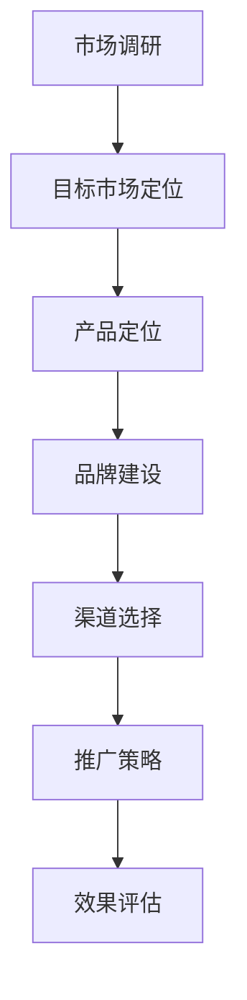
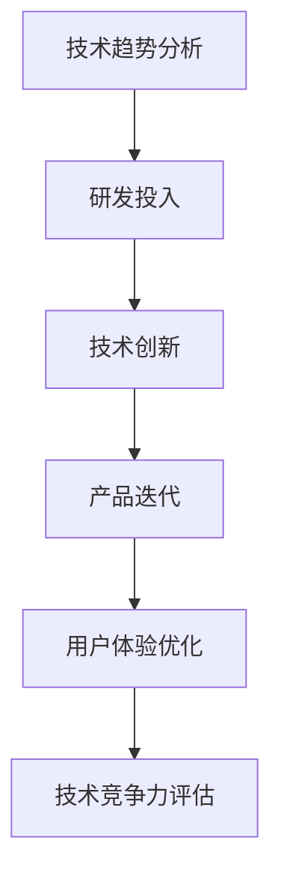
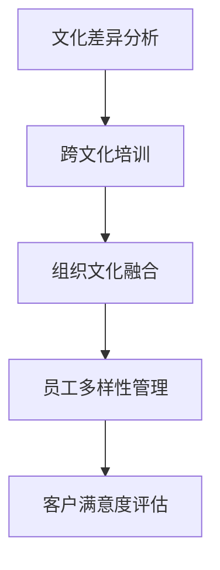
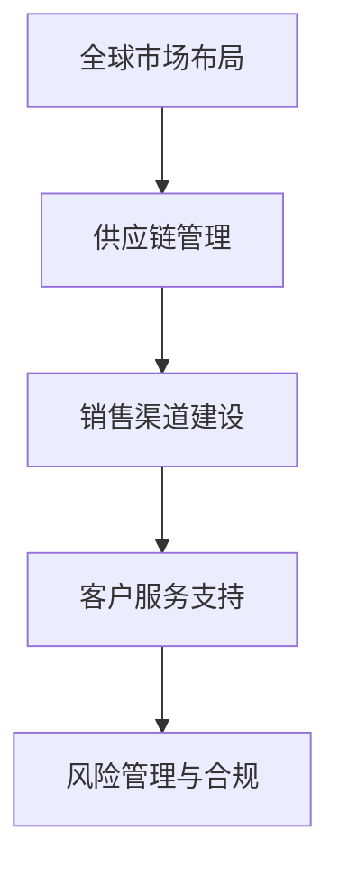

                 

关键词：大模型企业、国际化战略、市场营销、技术创新、跨文化管理、全球运营

> 摘要：本文将探讨大模型企业如何通过有效的国际化战略在全球市场中取得竞争优势。文章将分析国际化战略的核心要素，包括市场营销策略、技术创新、跨文化管理以及全球运营。此外，还将讨论大模型企业面临的挑战和未来发展趋势。

## 1. 背景介绍

随着全球化的加速，大模型企业（如谷歌、微软、亚马逊等）正在迅速扩张其业务版图，进入了全球各个市场。这些企业拥有强大的技术能力和丰富的数据资源，这使得它们能够在全球范围内提供高质量的人工智能和大数据服务。然而，国际化并非易事，企业需要应对复杂的市场环境、文化差异和监管挑战。因此，制定有效的国际化战略成为这些企业成功的关键。

## 2. 核心概念与联系

### 2.1 市场营销策略

市场营销策略是国际化战略的重要组成部分。企业需要深入了解目标市场的需求和偏好，以制定相应的营销策略。以下是一个简单的 Mermaid 流程图，展示了市场营销策略的核心节点：



### 2.2 技术创新

技术创新是推动大模型企业国际化的重要驱动力。企业需要不断研发新技术，以满足全球市场的需求。以下是一个简单的 Mermaid 流程图，展示了技术创新的核心节点：



### 2.3 跨文化管理

跨文化管理是国际化战略中的关键要素。企业需要尊重和适应不同文化背景的员工和客户。以下是一个简单的 Mermaid 流程图，展示了跨文化管理的核心节点：



### 2.4 全球运营

全球运营是国际化战略的实际执行阶段。企业需要在全球范围内建立高效的运营体系，以确保业务的稳定和持续增长。以下是一个简单的 Mermaid 流程图，展示了全球运营的核心节点：



## 3. 核心算法原理 & 具体操作步骤

### 3.1 算法原理概述

国际化战略的核心算法原理可以概括为“市场细分 - 营销策略优化 - 运营效率提升”。具体步骤如下：

1. **市场细分**：通过数据分析，将全球市场细分为多个具有相似需求特征的区域或国家。
2. **营销策略优化**：针对不同市场细分，制定相应的营销策略，包括产品定位、品牌建设、渠道选择等。
3. **运营效率提升**：通过优化供应链、销售渠道和客户服务支持，提高全球运营的效率。

### 3.2 算法步骤详解

1. **市场细分**：
   - **数据收集**：收集全球市场的消费者数据，包括购买行为、需求偏好、文化背景等。
   - **数据分析**：使用机器学习和数据分析技术，对消费者数据进行分析和聚类，识别出具有相似需求特征的市场细分。
   - **细分结果评估**：评估市场细分的效果，确保细分结果能够有效指导营销策略的制定。

2. **营销策略优化**：
   - **产品定位**：根据市场细分结果，确定不同细分市场的产品定位，确保产品能够满足目标市场的需求。
   - **品牌建设**：针对不同市场细分，制定相应的品牌传播策略，提高品牌知名度和美誉度。
   - **渠道选择**：根据市场细分和产品定位，选择最合适的销售渠道，包括线上和线下渠道。

3. **运营效率提升**：
   - **供应链管理**：优化全球供应链体系，确保产品供应链的稳定性和效率。
   - **销售渠道建设**：建立全球化的销售渠道网络，包括直销和分销渠道。
   - **客户服务支持**：提供全方位的客户服务支持，包括售前咨询、售后服务和技术支持。

### 3.3 算法优缺点

**优点**：
- **市场细分**：通过市场细分，企业能够更精准地定位目标市场，提高营销效果。
- **营销策略优化**：优化后的营销策略能够更好地满足不同市场的需求，提高客户满意度。
- **运营效率提升**：通过优化供应链和销售渠道，企业能够提高运营效率，降低成本。

**缺点**：
- **数据依赖性**：市场细分和营销策略优化依赖于大量的消费者数据，数据质量直接影响算法效果。
- **文化差异**：在跨文化管理中，企业需要充分考虑文化差异，否则可能导致营销策略失效。

### 3.4 算法应用领域

国际化战略的核心算法原理和具体操作步骤可以应用于以下领域：

- **市场营销**：帮助企业制定更精准的营销策略，提高市场占有率。
- **产品研发**：指导产品研发方向，确保产品能够满足全球市场的需求。
- **供应链管理**：优化供应链体系，提高供应链效率和稳定性。
- **客户服务**：提供全方位的客户服务支持，提高客户满意度。

## 4. 数学模型和公式 & 详细讲解 & 举例说明

### 4.1 数学模型构建

国际化战略的数学模型可以构建为以下形式：

$$
\text{国际化战略} = f(\text{市场细分}, \text{营销策略优化}, \text{运营效率提升})
$$

其中，$f$ 表示数学函数，$\text{市场细分}$、$\text{营销策略优化}$ 和 $\text{运营效率提升}$ 分别为三个核心组件。

### 4.2 公式推导过程

国际化战略的数学模型可以通过以下步骤推导：

1. **市场细分**：使用聚类算法对全球市场进行细分，得到 $n$ 个市场细分。
2. **营销策略优化**：针对每个市场细分，制定最优的营销策略，使得总营销效果最大化。
3. **运营效率提升**：通过优化供应链和销售渠道，提高运营效率，降低成本。

### 4.3 案例分析与讲解

假设某大模型企业正在进军欧洲市场，以下是一个简单的案例分析：

1. **市场细分**：通过对欧洲市场的消费者数据进行聚类分析，将市场细分为四个部分：北欧、南欧、东欧和西欧。
2. **营销策略优化**：针对每个市场细分，制定相应的营销策略，包括产品定位、品牌建设和渠道选择。
3. **运营效率提升**：通过优化供应链和销售渠道，提高运营效率，降低成本。

在这个案例中，国际化战略的数学模型可以表示为：

$$
\text{国际化战略} = f(\text{市场细分}(\text{北欧}, \text{南欧}, \text{东欧}, \text{西欧}), \text{营销策略优化}(\text{北欧}, \text{南欧}, \text{东欧}, \text{西欧}), \text{运营效率提升}(\text{北欧}, \text{南欧}, \text{东欧}, \text{西欧}))
$$

## 5. 项目实践：代码实例和详细解释说明

### 5.1 开发环境搭建

在开始编写代码之前，需要搭建一个适合开发国际化战略项目的环境。以下是一个简单的开发环境搭建步骤：

1. **安装 Python**：下载并安装 Python，确保版本不低于 3.8。
2. **安装依赖库**：使用 pip 工具安装以下依赖库：numpy、pandas、scikit-learn、matplotlib。
3. **配置虚拟环境**：使用 virtualenv 创建一个虚拟环境，避免不同项目之间的依赖库冲突。

### 5.2 源代码详细实现

以下是一个简单的国际化战略项目源代码示例：

```python
import numpy as np
import pandas as pd
from sklearn.cluster import KMeans
from sklearn.metrics import silhouette_score
import matplotlib.pyplot as plt

# 加载消费者数据
data = pd.read_csv('consumer_data.csv')

# 数据预处理
data.fillna(0, inplace=True)

# 聚类分析
kmeans = KMeans(n_clusters=4, random_state=42)
clusters = kmeans.fit_predict(data)

# 结果评估
silhouette_avg = silhouette_score(data, clusters)
print(f"Silhouette Score: {silhouette_avg}")

# 可视化结果
plt.scatter(data.iloc[:, 0], data.iloc[:, 1], c=clusters)
plt.xlabel('Feature 1')
plt.ylabel('Feature 2')
plt.title('Market Segmentation')
plt.show()

# 营销策略优化
# ...（此处省略营销策略优化的代码）

# 运营效率提升
# ...（此处省略运营效率提升的代码）
```

### 5.3 代码解读与分析

以上代码实现了一个简单的国际化战略项目，主要包括以下步骤：

1. **加载消费者数据**：从 CSV 文件中加载消费者数据。
2. **数据预处理**：填充缺失值，确保数据质量。
3. **聚类分析**：使用 KMeans 算法对消费者数据进行分析，得到市场细分结果。
4. **结果评估**：计算 Silhouette Score，评估聚类效果。
5. **可视化结果**：使用 matplotlib 库绘制聚类结果，直观展示市场细分。

### 5.4 运行结果展示

运行以上代码后，将得到以下结果：

1. **Silhouette Score**：评估聚类效果的得分，得分越高，聚类效果越好。
2. **可视化结果**：展示消费者数据在二维空间中的分布，以及市场细分结果。

## 6. 实际应用场景

国际化战略在大模型企业中具有广泛的应用场景，以下是一些典型的实际应用案例：

1. **市场营销**：企业可以通过国际化战略，精准定位全球市场，制定有针对性的营销策略，提高市场占有率。
2. **产品研发**：国际化战略可以帮助企业了解全球市场的需求，指导产品研发方向，确保产品能够满足不同市场的需求。
3. **供应链管理**：国际化战略可以优化供应链体系，提高供应链效率和稳定性，降低运营成本。
4. **客户服务**：国际化战略可以提供全方位的客户服务支持，提高客户满意度，增强客户忠诚度。

## 7. 未来应用展望

随着全球化的深入发展，大模型企业的国际化战略将面临更多的机遇和挑战。未来，国际化战略将朝着以下几个方面发展：

1. **智能化**：借助人工智能技术，实现国际化战略的智能化，提高决策效率和准确性。
2. **定制化**：根据不同市场的需求和特点，制定更加定制化的国际化战略，提高市场竞争力。
3. **协同化**：加强企业内部各部门的协同合作，实现国际化战略的协同效应，提高整体运营效率。
4. **全球化**：随着全球化进程的加快，大模型企业的国际化战略将逐步从区域性扩展到全球范围，实现真正的全球化运营。

## 8. 工具和资源推荐

为了更好地实施国际化战略，以下是一些推荐的工具和资源：

### 8.1 学习资源推荐

- 《全球营销学》——菲利普·科特勒
- 《跨文化管理》——亨利·万·登·胡夫

### 8.2 开发工具推荐

- Python
- Jupyter Notebook
- Matplotlib
- Scikit-learn

### 8.3 相关论文推荐

- "Global Marketing Strategies: Insights from Multinational Corporations" —— 本文研究了跨国公司在全球市场中的营销策略。
- "Cultural Adaptation in International Business" —— 本文探讨了跨文化管理在企业国际化过程中的作用。

## 9. 总结：未来发展趋势与挑战

国际化战略是大模型企业在全球市场中取得竞争优势的关键。在未来，国际化战略将朝着智能化、定制化、协同化和全球化的方向发展。然而，企业也需面对数据依赖性、文化差异和监管挑战等挑战。通过持续创新和优化，大模型企业有望在全球市场中取得更大的成功。

## 10. 附录：常见问题与解答

### 10.1 国际化战略的核心要素是什么？

国际化战略的核心要素包括市场营销策略、技术创新、跨文化管理和全球运营。

### 10.2 如何制定有效的国际化战略？

制定有效的国际化战略需要以下步骤：

1. **市场调研**：深入了解目标市场的需求和特点。
2. **营销策略优化**：根据市场调研结果，制定有针对性的营销策略。
3. **技术创新**：研发新技术，提高产品竞争力。
4. **跨文化管理**：尊重和适应不同文化背景的员工和客户。
5. **全球运营**：建立高效的全球运营体系，确保业务的稳定和持续增长。

### 10.3 国际化战略的算法原理是什么？

国际化战略的算法原理可以概括为“市场细分 - 营销策略优化 - 运营效率提升”。具体步骤包括市场细分、营销策略优化和运营效率提升。

### 10.4 国际化战略的数学模型如何构建？

国际化战略的数学模型可以构建为以下形式：

$$
\text{国际化战略} = f(\text{市场细分}, \text{营销策略优化}, \text{运营效率提升})
$$

其中，$f$ 表示数学函数，$\text{市场细分}$、$\text{营销策略优化}$ 和 $\text{运营效率提升}$ 分别为三个核心组件。

