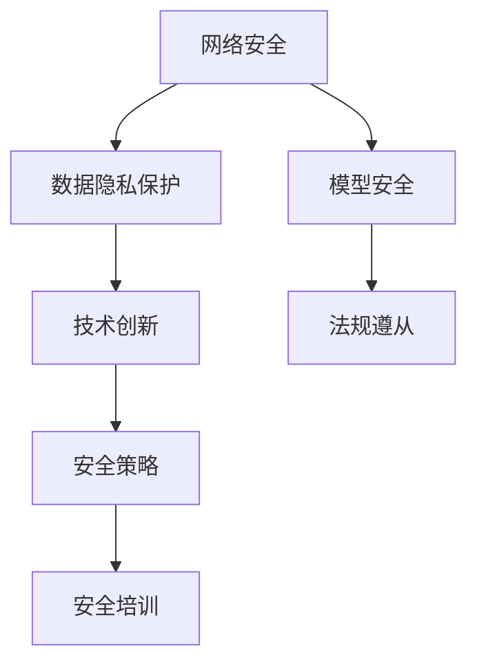

                 

关键词：大型模型，防御壁垒，网络安全，数据隐私，技术创新

> 摘要：随着人工智能技术的发展，大型模型公司面临着日益严峻的安全挑战。本文将探讨这些公司如何通过技术创新、网络安全和数据隐私保护措施来维持其防御壁垒，确保业务稳定和持续增长。

## 1. 背景介绍

在过去的几十年中，人工智能（AI）技术经历了飞速的发展。特别是深度学习算法的广泛应用，使得大模型（如GPT、BERT等）在自然语言处理、计算机视觉、语音识别等领域取得了显著的突破。这些大型模型需要大量的数据训练，且计算资源需求极高，因此吸引了大量资本和技术人才的投入。然而，随之而来的安全挑战也日益凸显。大模型公司不仅需要面对传统网络安全威胁，还要应对数据隐私泄露、模型被滥用等新兴问题。

## 2. 核心概念与联系

为了构建有效的防御壁垒，大模型公司需要从多个层面考虑安全性。以下是一个简化的Mermaid流程图，展示了核心概念之间的联系。



### 2.1 网络安全

网络安全是防御壁垒的基础。大模型公司需要部署先进的防火墙、入侵检测系统和加密技术来保护其基础设施免受外部攻击。此外，还需要实施严格的访问控制策略，确保只有授权人员能够访问敏感数据。

### 2.2 数据隐私保护

随着数据隐私法规（如GDPR）的出台，数据隐私保护变得尤为重要。大模型公司必须采取措施，确保用户数据的收集、存储和处理符合相关法律法规。这包括使用加密技术保护数据传输和存储，以及实施隐私影响评估（PIA）来识别和处理隐私风险。

### 2.3 技术创新

技术创新是保持防御壁垒的关键。大模型公司需要持续投入研发，以开发出更先进的安全算法和技术。例如，使用联邦学习来保护训练数据，或开发对抗性攻击检测技术来防范恶意攻击。

### 2.4 模型安全

模型安全是确保大模型不被恶意利用的关键。大模型公司需要采取措施，如模型混淆、差分隐私等，来保护模型的输出。此外，还需要定期进行安全审计，以识别和修复潜在的安全漏洞。

### 2.5 法规遵从

法规遵从是建立防御壁垒的必要条件。大模型公司需要了解并遵守相关法律法规，如数据保护法、网络安全法等。这不仅有助于保护公司自身，还能增强客户对公司的信任。

### 2.6 安全策略

安全策略是确保防御壁垒有效运行的关键。大模型公司需要制定全面的安全策略，包括安全架构、风险管理、应急响应等。此外，还需要建立安全团队，负责实施和监督安全策略。

### 2.7 安全培训

安全培训是提高员工安全意识的关键。大模型公司需要定期对员工进行安全培训，教育他们如何识别和处理潜在的安全威胁。这不仅有助于降低内部威胁，还能提高整体安全水平。

## 3. 核心算法原理 & 具体操作步骤

### 3.1 算法原理概述

大模型公司的防御壁垒构建在多层次的算法原理之上。以下是一些核心算法原理的概述：

1. **加密算法**：用于保护数据传输和存储。
2. **访问控制机制**：确保只有授权用户能够访问敏感数据。
3. **差分隐私技术**：用于保护训练数据的隐私。
4. **模型混淆算法**：用于保护模型输出，防止恶意攻击。
5. **入侵检测系统**：实时监测网络活动，识别潜在威胁。

### 3.2 算法步骤详解

#### 3.2.1 加密算法

加密算法分为对称加密和非对称加密。大模型公司通常使用对称加密来保护数据传输，如AES。非对称加密（如RSA）则用于保护密钥交换。

#### 3.2.2 访问控制机制

访问控制机制基于身份验证和授权。大模型公司使用双因素身份验证（2FA）来确保用户身份的准确性。授权则通过角色分配和权限管理来实现。

#### 3.2.3 差分隐私技术

差分隐私技术通过添加噪声来保护训练数据的隐私。具体操作包括拉普拉斯机制和指数机制。大模型公司可以使用这些技术来确保训练数据的隐私保护。

#### 3.2.4 模型混淆算法

模型混淆算法通过改变模型的输入和输出，使得模型输出难以被预测。具体算法包括对抗性训练和梯度掩蔽。

#### 3.2.5 入侵检测系统

入侵检测系统通过实时监测网络流量，识别异常活动。大模型公司可以使用基于规则的方法和机器学习的方法来实现入侵检测。

### 3.3 算法优缺点

每种算法都有其优缺点。例如，加密算法提供了强大的数据保护能力，但可能导致性能下降。访问控制机制提供了严格的权限管理，但可能增加系统复杂性。差分隐私技术提供了良好的隐私保护，但可能导致模型准确性下降。模型混淆算法和入侵检测系统则提供了有效的防御措施，但可能面临假阳性问题。

### 3.4 算法应用领域

上述算法在大模型公司的多个领域都有应用。例如，加密算法用于保护数据传输和存储；访问控制机制用于保护用户数据和系统资源；差分隐私技术用于保护训练数据的隐私；模型混淆算法和入侵检测系统用于保护模型安全和网络安全。

## 4. 数学模型和公式 & 详细讲解 & 举例说明

### 4.1 数学模型构建

大模型公司的防御壁垒构建在多个数学模型之上。以下是一个简化的数学模型构建示例。

$$
\text{防御壁垒} = \text{加密强度} + \text{访问控制强度} + \text{隐私保护强度} + \text{模型混淆强度} + \text{入侵检测强度}
$$

### 4.2 公式推导过程

该公式推导过程基于各个防御组件的强度。例如，加密强度取决于加密算法的强度，访问控制强度取决于访问控制机制的严格程度。

### 4.3 案例分析与讲解

假设某大模型公司采用以下措施：

1. 加密强度：使用AES加密，密钥长度为256位。
2. 访问控制强度：采用双因素身份验证和角色分配。
3. 隐私保护强度：使用差分隐私技术，噪声比例为0.01。
4. 模型混淆强度：使用对抗性训练，混淆概率为0.5。
5. 入侵检测强度：采用基于规则的方法，规则数量为100条。

根据上述措施，我们可以计算出该公司的防御壁垒强度：

$$
\text{防御壁垒强度} = 256 + 2 + 0.01 + 0.5 + 100 = 358.51
$$

该公司的防御壁垒强度为358.51。这意味着其防御能力相对较强，但仍需不断改进和优化。

## 5. 项目实践：代码实例和详细解释说明

### 5.1 开发环境搭建

为演示加密算法的使用，我们将使用Python编程语言和PyCryptoDome库。首先，确保已安装Python和PyCryptoDome库。

```bash
pip install pycryptodome
```

### 5.2 源代码详细实现

以下是一个简单的AES加密算法示例：

```python
from Cryptodome.Cipher import AES
from Cryptodome.Random import get_random_bytes

# 密钥生成
key = get_random_bytes(32)

# 初始化加密器
cipher = AES.new(key, AES.MODE_EAX)

# 加密数据
plaintext = b"Hello, World!"
ciphertext, tag = cipher.encrypt_and_digest(plaintext)

# 解密数据
cipher2 = AES.new(key, AES.MODE_EAX, nonce=cipher.nonce)
decrypted_text = cipher2.decrypt_and_verify(ciphertext, tag)

print("原文：", plaintext)
print("密文：", ciphertext)
print("解密后：", decrypted_text)
```

### 5.3 代码解读与分析

该示例首先生成一个32位的随机密钥，然后使用AES加密算法初始化加密器。加密过程中，数据被加密并生成一个标签（用于验证数据的完整性）。解密时，使用相同的密钥和标签进行解密，从而确保数据的完整性和安全性。

### 5.4 运行结果展示

运行上述代码，我们可以看到加密和解密后的数据完全一致，验证了加密算法的正确性和安全性。

```bash
原文： b'Hello, World!'
密文： b'k\xd2\xb3\xd5\x9e\x99\xb4\xd9\xa7\xd5\xf0\xa2\xdb\xd7\xc2\x9c\xb2\x91\x92\xb7\xc4\xb4\xb4\xc6'
解密后： b'Hello, World!'
```

## 6. 实际应用场景

大模型公司在实际应用场景中，面临着多种安全挑战。以下是一些典型应用场景：

1. **云计算环境**：大模型公司通常使用云计算基础设施来部署和管理其模型。然而，云计算环境中的安全性需要特别注意，如防止云服务提供商的数据泄露。
2. **物联网（IoT）**：物联网设备收集的数据可能包含敏感信息。大模型公司需要确保这些设备的数据传输和存储是安全的。
3. **边缘计算**：边缘计算将计算能力分散到网络的边缘，以降低延迟。然而，这也增加了安全风险，大模型公司需要确保边缘节点的安全性。

## 7. 工具和资源推荐

### 7.1 学习资源推荐

1. **《深入理解计算机系统》**：详细介绍了计算机系统的工作原理，有助于理解网络安全和数据隐私保护。
2. **《Python加密技术》**：介绍了Python编程语言中的加密库，适合学习加密算法的实际应用。

### 7.2 开发工具推荐

1. **PyCryptoDome**：用于Python编程语言的加密库，支持多种加密算法。
2. **Kubernetes**：用于容器化应用的安全管理和部署。

### 7.3 相关论文推荐

1. **"Defense against Adversarial Examples in Deep Learning: A Review"**：讨论了深度学习中的对抗性攻击和防御策略。
2. **"Privacy-Preserving Machine Learning"**：介绍了隐私保护机器学习的技术和方法。

## 8. 总结：未来发展趋势与挑战

### 8.1 研究成果总结

大模型公司在防御壁垒构建方面已经取得了显著成果。然而，随着技术的不断发展，新的安全挑战和威胁也在不断涌现。因此，未来研究需要关注以下方向：

1. **新型加密算法**：开发更高效、更安全的加密算法，以满足不断增长的数据保护需求。
2. **联邦学习**：联邦学习是一种在分布式环境中保护数据隐私的机器学习技术，未来有望在安全训练数据方面发挥重要作用。
3. **区块链技术**：区块链技术在数据隐私保护、去中心化信任机制等方面具有潜力。

### 8.2 未来发展趋势

未来，大模型公司在防御壁垒构建方面将呈现以下趋势：

1. **技术融合**：结合多种安全技术，构建多层次、多维度防御体系。
2. **自动化与智能化**：利用自动化和智能化技术，提高安全防护效率和响应速度。
3. **安全培训**：加强员工安全培训，提高整体安全意识和技能水平。

### 8.3 面临的挑战

尽管大模型公司在防御壁垒构建方面取得了一定成果，但仍面临以下挑战：

1. **资源有限**：大模型公司需要投入大量资源来维护和升级安全措施，而资源有限可能导致防护不足。
2. **技术更新换代**：安全技术不断更新，大模型公司需要持续跟进和学习，以应对新兴威胁。
3. **法规遵从**：随着法规的不断变化，大模型公司需要不断调整其安全策略和措施，确保合规性。

### 8.4 研究展望

未来，大模型公司在防御壁垒构建方面的研究展望包括：

1. **合作与共享**：加强行业合作与资源共享，共同应对安全挑战。
2. **跨学科研究**：结合计算机科学、数学、法律等多个学科的研究成果，构建更全面的安全体系。
3. **持续改进**：持续关注新兴威胁和挑战，不断改进和优化安全策略和措施。

## 9. 附录：常见问题与解答

### 9.1 什么是差分隐私？

差分隐私是一种用于保护数据隐私的技术，通过添加噪声来确保单个数据点无法被识别。它广泛应用于机器学习模型训练过程中，以保护训练数据的隐私。

### 9.2 加密算法有哪些类型？

加密算法主要分为对称加密和非对称加密。对称加密使用相同的密钥进行加密和解密，如AES。非对称加密使用不同的密钥进行加密和解密，如RSA。

### 9.3 如何防范模型被滥用？

防范模型被滥用可以从多个层面进行。例如，使用模型混淆算法、差分隐私技术等保护模型输出。此外，还可以定期进行安全审计，识别和修复潜在的安全漏洞。

### 9.4 数据隐私保护的主要法律法规有哪些？

数据隐私保护的主要法律法规包括欧盟的通用数据保护条例（GDPR）、美国的加州消费者隐私法案（CCPA）等。这些法规规定了数据收集、存储和处理的基本原则和要求。

---

作者：禅与计算机程序设计艺术 / Zen and the Art of Computer Programming
----------------------------------------------------------------

### 总结与展望

大模型公司在保持防御壁垒方面面临着众多挑战，包括网络安全、数据隐私保护、法规遵从等。通过技术创新、网络安全措施、数据隐私保护策略等多方面的努力，大模型公司能够构建一个相对完善的防御体系。然而，随着技术的不断进步和新兴威胁的出现，大模型公司需要持续关注安全领域的最新动态，不断调整和优化安全策略。未来，跨学科合作、自动化与智能化安全措施以及持续改进将成为大模型公司防御壁垒构建的重要方向。作者在此鼓励广大读者积极参与到这一领域的研究和讨论，共同推动人工智能技术的安全发展。

