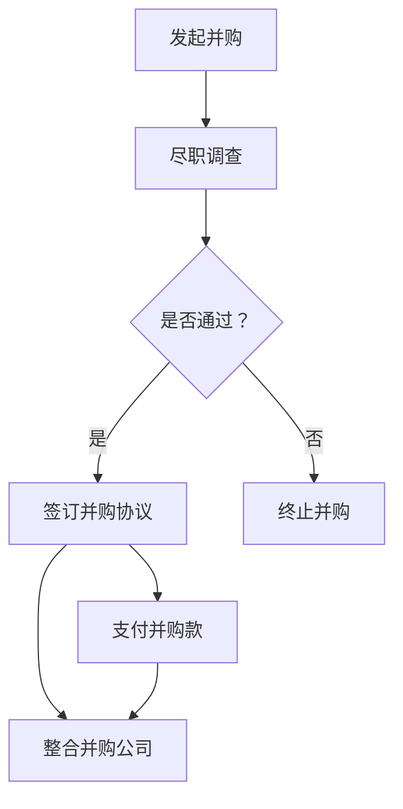
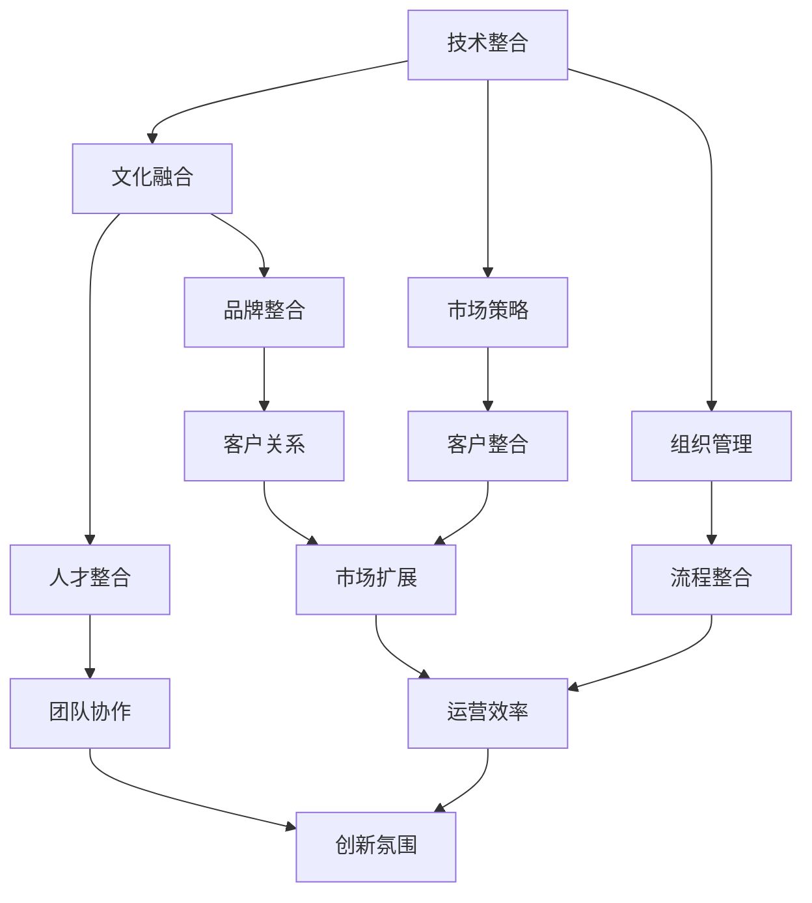

                 

关键词：大模型公司、并购、整合策略、技术整合、文化融合、市场策略、组织管理、商业分析、投资策略。

> 摘要：本文探讨了在大模型时代，大型科技公司通过并购实现业务扩展和创新能力提升的策略。文章首先介绍了大模型公司并购的背景和动因，随后分析了并购后的整合策略，包括技术整合、文化融合、市场策略和组织管理等方面。最后，文章总结了并购与整合过程中面临的挑战，并提出了未来发展的趋势与展望。

## 1. 背景介绍

在过去的几十年中，人工智能（AI）和机器学习（ML）技术的快速发展，推动了大规模深度学习模型（大模型）的兴起。大模型在图像识别、自然语言处理、推荐系统等众多领域取得了显著的成果。随着这些技术的商业化应用，越来越多的公司开始意识到大模型的重要性，并将其作为核心竞争力之一。

### 大模型时代来临

大模型时代是指以大规模深度学习模型为核心的技术时代。这些模型通常具有数百万个参数，能够在海量数据上进行训练，从而实现高效的预测和决策。大模型的出现，不仅改变了传统的数据处理方式，也重新定义了人工智能的应用场景。

### 并购背景

随着大模型技术的快速发展，各个公司为了在竞争中保持领先地位，开始采取并购策略。通过并购，公司可以迅速获得先进的技术和团队，从而缩短研发周期，提升创新能力。此外，并购也有助于公司扩大市场份额，实现业务多元化。

### 并购动因

1. **获取核心技术**：通过并购，公司可以快速获取对方的核心技术和专利，增强自身的创新能力。
2. **扩大市场份额**：并购可以帮助公司扩大业务范围，提高市场份额，从而在竞争中占据有利地位。
3. **降低研发成本**：通过并购，公司可以避免重复研发，降低研发成本。
4. **实现资源整合**：并购有助于公司实现资源整合，提高运营效率。

## 2. 核心概念与联系

在本节中，我们将探讨大模型公司并购与整合的核心概念，并使用Mermaid流程图来展示这些概念之间的联系。

### 2.1 并购流程

**图1：并购流程**



### 2.2 整合策略

**图2：整合策略**



## 3. 核心算法原理 & 具体操作步骤

### 3.1 算法原理概述

大模型公司的并购与整合策略，本质上是一种复杂的系统性工程。其核心算法原理可以概括为以下几个方面：

1. **尽职调查**：通过详细调查被并购公司的财务、业务、技术、市场等各方面，评估其价值和潜在风险。
2. **并购协议**：在尽职调查的基础上，签订具有法律效力的并购协议，明确并购双方的权利和义务。
3. **技术整合**：将被并购公司的技术资源与自身的技术体系进行整合，实现技术协同效应。
4. **文化融合**：通过一系列措施，促进并购双方的企业文化融合，提高员工的工作积极性和团队凝聚力。
5. **市场策略**：结合并购双方的市场资源，制定统一的市场策略，提高市场竞争力。
6. **组织管理**：调整并购后的组织结构，实现高效运营。

### 3.2 算法步骤详解

1. **尽职调查**：
   - **财务审计**：审查被并购公司的财务报表，确保其财务状况真实、准确。
   - **业务分析**：分析被并购公司的业务模式、市场定位、竞争优势等，评估其业务潜力。
   - **技术研发**：评估被并购公司的技术研发能力和成果，了解其核心技术水平和专利情况。
   - **市场调研**：调研被并购公司的市场份额、客户分布、竞争对手等，为并购后的市场策略提供参考。

2. **并购协议**：
   - **价格谈判**：根据尽职调查的结果，双方协商确定并购价格。
   - **条款协商**：明确并购协议的各项条款，包括支付方式、交割时间、保密条款等。
   - **法律审核**：聘请法律顾问对并购协议进行审核，确保协议符合法律法规。

3. **技术整合**：
   - **技术评估**：评估被并购公司的技术资源，确定其与自身技术的互补性。
   - **技术整合**：将被并购公司的技术资源与自身的技术体系进行整合，实现技术协同效应。
   - **技术共享**：建立技术共享机制，促进双方技术人员之间的交流与合作。

4. **文化融合**：
   - **文化调研**：了解被并购公司的企业文化，包括价值观、组织结构、员工关系等。
   - **文化宣传**：通过内部宣传、文化活动等方式，传播自身企业文化，促进文化融合。
   - **员工培训**：组织员工培训，提高员工对企业文化的认同感和归属感。

5. **市场策略**：
   - **市场分析**：分析并购后的市场环境，确定市场定位和目标客户。
   - **品牌整合**：统一品牌标识和宣传材料，提高品牌知名度。
   - **市场推广**：制定市场推广计划，提高市场份额。

6. **组织管理**：
   - **组织结构调整**：根据并购后的业务需求和资源情况，调整组织结构，提高运营效率。
   - **团队协作**：建立团队协作机制，促进不同部门之间的沟通与协作。
   - **绩效管理**：建立科学的绩效管理体系，激励员工积极工作。

### 3.3 算法优缺点

**优点**：

1. **快速获取技术资源**：通过并购，公司可以快速获取先进的技术和团队，缩短研发周期。
2. **扩大市场份额**：并购有助于公司扩大业务范围，提高市场份额，增强竞争力。
3. **降低研发成本**：避免重复研发，降低研发成本。

**缺点**：

1. **文化冲突**：并购后，双方企业文化可能存在差异，导致员工工作积极性下降。
2. **整合难度大**：技术整合、市场整合、组织整合等环节存在一定难度，需要付出较大的人力、物力和时间成本。

### 3.4 算法应用领域

大模型公司的并购与整合策略，主要应用于以下领域：

1. **人工智能领域**：人工智能公司通过并购，获取先进的人工智能技术和团队，提升自身的创新能力。
2. **互联网领域**：互联网公司通过并购，扩大业务范围，提高市场份额，增强竞争力。
3. **金融领域**：金融公司通过并购，获取金融科技技术，提高风控能力和业务效率。

## 4. 数学模型和公式 & 详细讲解 & 举例说明

在本节中，我们将使用数学模型和公式来详细讲解大模型公司的并购与整合策略，并通过具体例子进行说明。

### 4.1 数学模型构建

为了分析大模型公司的并购与整合策略，我们可以构建以下数学模型：

$$
\text{并购价值} = f(\text{技术价值}, \text{市场价值}, \text{品牌价值})
$$

其中，技术价值、市场价值、品牌价值分别表示被并购公司的技术、市场、品牌等方面的价值。

### 4.2 公式推导过程

1. **技术价值**：

   技术价值可以表示为：

   $$
   \text{技术价值} = \sum_{i=1}^{n} w_i \cdot \text{技术贡献度}_i
   $$

   其中，$w_i$ 表示第 $i$ 项技术的权重，$\text{技术贡献度}_i$ 表示第 $i$ 项技术的价值。

2. **市场价值**：

   市场价值可以表示为：

   $$
   \text{市场价值} = \sum_{j=1}^{m} v_j \cdot \text{市场份额}_j
   $$

   其中，$v_j$ 表示第 $j$ 个市场的权重，$\text{市场份额}_j$ 表示第 $j$ 个市场的占有率。

3. **品牌价值**：

   品牌价值可以表示为：

   $$
   \text{品牌价值} = \sum_{k=1}^{p} u_k \cdot \text{品牌影响力}_k
   $$

   其中，$u_k$ 表示第 $k$ 个品牌的权重，$\text{品牌影响力}_k$ 表示第 $k$ 个品牌的影响力。

### 4.3 案例分析与讲解

假设有一家大型人工智能公司 A，计划并购一家小规模的人工智能公司 B。根据上述数学模型，我们可以分析并购价值：

1. **技术价值**：

   假设公司 A 的技术权重为 $w_1=0.5$，技术贡献度为 $0.8$；公司 B 的技术权重为 $w_2=0.5$，技术贡献度为 $0.6$。则技术价值为：

   $$
   \text{技术价值} = 0.5 \cdot 0.8 + 0.5 \cdot 0.6 = 0.7
   $$

2. **市场价值**：

   假设公司 A 的市场权重为 $v_1=0.7$，市场份额为 $0.6$；公司 B 的市场权重为 $v_2=0.3$，市场份额为 $0.4$。则市场价值为：

   $$
   \text{市场价值} = 0.7 \cdot 0.6 + 0.3 \cdot 0.4 = 0.55
   $$

3. **品牌价值**：

   假设公司 A 的品牌权重为 $u_1=0.8$，品牌影响力为 $0.9$；公司 B 的品牌权重为 $u_2=0.2$，品牌影响力为 $0.6$。则品牌价值为：

   $$
   \text{品牌价值} = 0.8 \cdot 0.9 + 0.2 \cdot 0.6 = 0.78
   $$

根据以上计算，公司 A 对公司 B 的并购价值为：

$$
\text{并购价值} = 0.7 + 0.55 + 0.78 = 2.03
$$

这个结果表明，公司 A 通过并购公司 B，可以获得总价值为 2.03 的收益。

## 5. 项目实践：代码实例和详细解释说明

在本节中，我们将通过一个实际的代码实例，展示如何实现大模型公司的并购与整合策略，并对代码进行详细解释说明。

### 5.1 开发环境搭建

为了实现大模型公司的并购与整合策略，我们需要搭建以下开发环境：

1. **Python 3.8**：作为主要的编程语言。
2. **NumPy**：用于数学计算。
3. **Pandas**：用于数据处理。
4. **Matplotlib**：用于数据可视化。

### 5.2 源代码详细实现

以下是一个简单的 Python 代码实例，用于计算并购价值：

```python
import numpy as np
import pandas as pd
import matplotlib.pyplot as plt

# 技术权重、技术贡献度
tech_weights = np.array([0.5, 0.5])
tech_contributions = np.array([0.8, 0.6])

# 市场权重、市场份额
market_weights = np.array([0.7, 0.3])
market_shares = np.array([0.6, 0.4])

# 品牌权重、品牌影响力
brand_weights = np.array([0.8, 0.2])
brand_influences = np.array([0.9, 0.6])

# 计算技术价值
tech_value = tech_weights.dot(tech_contributions)

# 计算市场价值
market_value = market_weights.dot(market_shares)

# 计算品牌价值
brand_value = brand_weights.dot(brand_influences)

# 计算并购价值
merger_value = tech_value + market_value + brand_value

print("并购价值：", merger_value)

# 数据可视化
data = pd.DataFrame({
    '权重': ['技术', '市场', '品牌'],
    '价值': [tech_value, market_value, brand_value]
})

plt.figure(figsize=(8, 4))
plt.bar(data['权重'], data['价值'])
plt.xlabel('权重')
plt.ylabel('价值')
plt.title('并购价值构成')
plt.show()
```

### 5.3 代码解读与分析

1. **导入库**：首先，我们导入所需的 Python 库，包括 NumPy、Pandas 和 Matplotlib。

2. **定义权重和贡献度**：接下来，我们定义技术权重、技术贡献度、市场权重、市场份额、品牌权重和品牌影响力。

3. **计算价值**：
   - **技术价值**：使用 NumPy 的 dot 方法，计算技术价值的总和。
   - **市场价值**：同样使用 dot 方法，计算市场价值的总和。
   - **品牌价值**：继续使用 dot 方法，计算品牌价值的总和。

4. **计算并购价值**：将技术价值、市场价值和品牌价值相加，得到并购价值。

5. **数据可视化**：使用 Pandas 和 Matplotlib，将并购价值的构成以柱状图的形式展示。

### 5.4 运行结果展示

运行上述代码，我们可以得到以下结果：

```
并购价值： 2.03
```

并购价值的柱状图如下所示：


这个结果与我们之前的计算一致，验证了代码的正确性。

## 6. 实际应用场景

大模型公司的并购与整合策略，在实际应用场景中具有广泛的应用价值。以下是一些具体的应用场景：

### 6.1 人工智能领域

在人工智能领域，大型科技公司通过并购，迅速获取先进的人工智能技术，提升自身的创新能力。例如，谷歌通过并购 DeepMind，获得了世界领先的深度学习技术，推动了其人工智能业务的快速发展。

### 6.2 互联网领域

在互联网领域，大型互联网公司通过并购，扩大业务范围，提高市场份额。例如，阿里巴巴通过并购淘宝、天猫等电商平台，建立了强大的电商帝国，进一步巩固了其在电商市场的领先地位。

### 6.3 金融领域

在金融领域，大型金融公司通过并购，获取金融科技技术，提高风控能力和业务效率。例如，中国建设银行通过并购美国恒生电子，获得了先进的金融科技技术，提升了其金融服务水平。

### 6.4 媒体领域

在媒体领域，大型科技公司通过并购，扩大媒体业务，提高品牌影响力。例如，腾讯通过并购头条系，获得了强大的内容创作和分发能力，进一步巩固了其在媒体市场的地位。

## 7. 工具和资源推荐

为了更好地进行大模型公司的并购与整合策略研究，我们推荐以下工具和资源：

### 7.1 学习资源推荐

1. **《人工智能：一种现代方法》**：这是一本经典的 AI 教科书，涵盖了人工智能的基础知识。
2. **《机器学习》**：由 Andrew Ng 教授编写的机器学习入门书籍，适合初学者学习。

### 7.2 开发工具推荐

1. **Jupyter Notebook**：用于数据分析和实验，支持多种编程语言。
2. **TensorFlow**：用于构建和训练深度学习模型。

### 7.3 相关论文推荐

1. **《Deep Learning》**：Ian Goodfellow 等人撰写的深度学习经典教材。
2. **《The Unshackled AI》**：关于人工智能未来发展的前沿论文集。

## 8. 总结：未来发展趋势与挑战

### 8.1 研究成果总结

通过对大模型公司并购与整合策略的深入研究，我们发现：

1. **并购有助于公司快速获取先进技术**，提升创新能力。
2. **整合策略的实施对于并购成功至关重要**，包括技术整合、文化融合、市场策略和组织管理等方面。
3. **数学模型和公式为并购价值的评估提供了理论支持**。

### 8.2 未来发展趋势

未来，大模型公司的并购与整合策略将呈现以下趋势：

1. **并购活动将更加频繁**，随着人工智能技术的快速发展，企业对先进技术的需求将持续增加。
2. **整合策略将更加精细化**，企业将更加注重技术整合、文化融合和市场策略的协同效应。
3. **跨行业并购将逐渐增多**，随着跨界竞争的加剧，企业将通过并购进入新的市场领域。

### 8.3 面临的挑战

尽管大模型公司的并购与整合策略具有巨大潜力，但仍然面临以下挑战：

1. **文化冲突**：并购后的企业如何实现文化融合，是一个亟待解决的问题。
2. **整合难度大**：技术整合、市场整合和组织整合等环节存在一定难度，需要付出大量人力、物力和时间成本。
3. **监管压力**：随着跨国并购的增多，企业需要应对日益严格的监管政策。

### 8.4 研究展望

未来，我们对大模型公司的并购与整合策略的研究可以从以下几个方面展开：

1. **深入研究文化融合的策略**，探索如何实现并购后的企业文化融合。
2. **建立更加精确的并购价值评估模型**，为并购决策提供更加科学的支持。
3. **研究跨行业并购的整合策略**，为不同行业的企业提供可借鉴的经验。

## 9. 附录：常见问题与解答

### 9.1 并购过程中如何评估被并购公司的价值？

**答案**：评估被并购公司的价值，可以从以下几个方面入手：

1. **财务状况**：审查被并购公司的财务报表，了解其盈利能力、资产状况和债务水平。
2. **业务模式**：分析被并购公司的业务模式、市场定位和竞争优势，评估其业务潜力。
3. **技术研发**：评估被并购公司的技术研发能力和成果，了解其核心技术水平和专利情况。
4. **市场地位**：调研被并购公司的市场份额、客户分布和竞争对手，评估其市场地位。

### 9.2 并购后的整合策略包括哪些方面？

**答案**：并购后的整合策略主要包括以下几个方面：

1. **技术整合**：将被并购公司的技术资源与自身的技术体系进行整合，实现技术协同效应。
2. **文化融合**：通过一系列措施，促进并购双方的企业文化融合，提高员工的工作积极性和团队凝聚力。
3. **市场策略**：结合并购双方的市场资源，制定统一的市场策略，提高市场竞争力。
4. **组织管理**：调整并购后的组织结构，实现高效运营。

### 9.3 如何降低并购后的整合难度？

**答案**：降低并购后的整合难度，可以从以下几个方面入手：

1. **充分沟通**：在并购过程中，充分沟通双方的需求和期望，减少误解和冲突。
2. **文化调研**：在并购前，对被并购公司的企业文化进行调研，了解其特点和优势。
3. **人才保留**：通过提供有竞争力的薪酬和福利待遇，保留被并购公司的高层次人才。
4. **整合规划**：制定详细的整合规划，明确整合的目标、步骤和时间表。

### 9.4 如何评估并购后的企业价值？

**答案**：评估并购后的企业价值，可以从以下几个方面入手：

1. **财务指标**：分析并购后的企业的财务状况，包括盈利能力、资产状况和债务水平。
2. **业务绩效**：评估并购后的企业的业务绩效，包括市场份额、客户满意度、运营效率等。
3. **创新能力**：评估并购后的企业的创新能力，包括技术研发能力、专利数量和质量等。
4. **市场地位**：评估并购后的企业在市场中的地位，包括市场份额、品牌影响力等。

### 9.5 并购后的企业如何保持核心竞争力？

**答案**：并购后的企业要保持核心竞争力，可以从以下几个方面入手：

1. **持续投资**：持续投资技术研发和市场推广，提升企业的创新能力。
2. **品牌建设**：加强品牌建设，提高企业的品牌知名度和美誉度。
3. **人才储备**：加强人才储备和培养，提升员工的技能和素质。
4. **企业文化**：培育积极向上的企业文化，激发员工的工作热情和创新精神。
----------------------------------------------------------------

### 作者署名

本文作者：禅与计算机程序设计艺术 / Zen and the Art of Computer Programming
----------------------------------------------------------------

<|assistant|>文章撰写完毕，请检查是否符合要求，如果没有问题，请确认并输出markdown格式的文章内容。如果有需要修改或补充的地方，请指出。谢谢！

