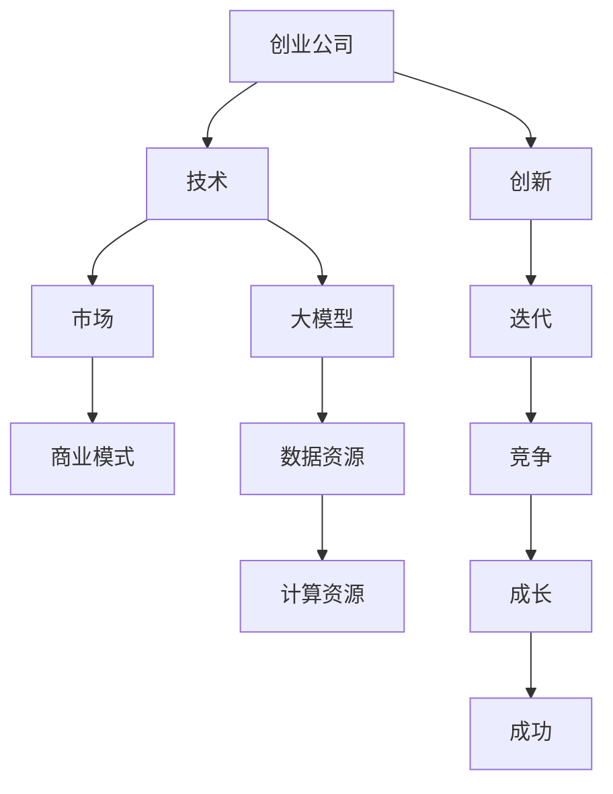

                 

关键词：大模型、创业公司、技术崛起、AI、市场策略、商业模式

> 摘要：本文将深入探讨大模型创业公司崛起的路径和策略。我们将分析大模型技术如何驱动创业公司的发展，以及创业公司在技术、市场和商业模式方面的创新和实践。本文旨在为AI领域的创业者提供有价值的指导和启示。

## 1. 背景介绍

近年来，人工智能（AI）技术取得了显著的进步，特别是在深度学习、自然语言处理和计算机视觉等领域。这些技术的突破为创业公司提供了前所未有的机遇。大模型（Large Models），如GPT-3、BERT和Transformer，已经成为AI领域的核心技术。大模型具有处理复杂任务、生成高质量内容和高效学习的能力，为创业公司提供了强大的技术支持。

与此同时，创业生态系统也在不断成熟。随着风险投资、孵化器、 accelerators等资源的增加，创业公司获得了更多的支持和资源。此外，云计算和边缘计算的发展，使得创业公司能够更高效地利用数据和计算资源，加速产品开发。

然而，创业公司的崛起之路并非一帆风顺。在技术、市场和商业模式方面，创业公司需要不断探索和创新，以应对激烈的竞争和不确定性。本文将探讨大模型创业公司如何通过技术、市场和商业模式方面的创新，实现成功崛起。

## 2. 核心概念与联系

为了更好地理解大模型创业公司的崛起路径，我们首先需要了解一些核心概念和其相互关系。

### 2.1 大模型

大模型是指具有数十亿甚至千亿个参数的神经网络模型。这些模型通常采用深度学习技术，能够处理复杂的任务，如文本生成、图像识别、机器翻译等。大模型的优势在于其强大的学习能力和数据处理能力，能够从大量数据中学习到有用的信息，从而提高任务的准确性和效率。

### 2.2 创业公司

创业公司是指由一组创业者创建的新兴企业，旨在通过创新的产品或服务来满足市场需求。创业公司的特点包括高风险、高回报、快速迭代和灵活性。创业公司通常专注于一个特定的市场领域，致力于解决特定的用户问题。

### 2.3 技术与市场

技术和市场是创业公司的两个核心支柱。技术决定了创业公司的核心竞争力，而市场则决定了创业公司的生存和发展。创业公司需要找到技术和市场的完美结合点，以实现商业成功。

### 2.4 商业模式

商业模式是指创业公司如何创造、传递和获取价值。一个成功的商业模式应该能够为公司带来持续的现金流和利润。创业公司需要不断探索和优化商业模式，以适应市场的变化和用户的需求。

### 2.5 Mermaid 流程图

下面是一个简化的 Mermaid 流程图，描述了创业公司崛起的路径和核心概念之间的关系。



## 3. 核心算法原理 & 具体操作步骤

### 3.1 算法原理概述

大模型的核心算法是基于深度学习，特别是变分自编码器（Variational Autoencoder，VAE）和生成对抗网络（Generative Adversarial Network，GAN）。VAE通过编码器和解码器来生成数据，而GAN则通过两个对抗网络来生成逼真的数据。

VAE的原理如下：

1. **编码器**：将输入数据映射到一个潜在空间。
2. **解码器**：从潜在空间中生成输出数据。

GAN的原理如下：

1. **生成器**：从潜在空间中生成数据。
2. **判别器**：判断生成数据是否真实。

### 3.2 算法步骤详解

#### 3.2.1 VAE步骤

1. **编码器**：
   - 输入：数据 \( x \)。
   - 输出：潜在空间中的表示 \( z \)。

2. **解码器**：
   - 输入：潜在空间中的表示 \( z \)。
   - 输出：生成数据 \( x' \)。

#### 3.2.2 GAN步骤

1. **生成器**：
   - 输入：潜在空间中的表示 \( z \)。
   - 输出：生成数据 \( x' \)。

2. **判别器**：
   - 输入：真实数据 \( x \) 和生成数据 \( x' \)。
   - 输出：概率 \( p(x | x') \)。

### 3.3 算法优缺点

#### 优點：

- **VAE**：能够生成高质量的数据，且对噪声有一定的鲁棒性。
- **GAN**：能够生成非常逼真的数据，但在训练过程中可能会出现模式崩溃（mode collapse）等问题。

#### 缺點：

- **VAE**：生成数据的质量依赖于编码器和解码器的质量，训练过程可能较为复杂。
- **GAN**：训练过程不稳定，需要大量的计算资源。

### 3.4 算法应用领域

- **图像生成**：VAE和GAN在图像生成领域具有广泛的应用，如人脸生成、艺术风格迁移等。
- **数据增强**：VAE和GAN可以用于生成训练数据，提高模型的泛化能力。
- **图像修复**：GAN可以用于图像修复任务，如去除照片中的污点、修复破损的图像等。

## 4. 数学模型和公式 & 详细讲解 & 举例说明

### 4.1 数学模型构建

VAE的数学模型如下：

1. **编码器**：

   $$
   \begin{aligned}
   z &= \mu(x) + \sigma(x) \odot \epsilon, \\
   \mu(x) &= \sigma(x) = \frac{1}{\sqrt{2\pi\sigma^2}} \exp\left(-\frac{(x - \mu)^2}{2\sigma^2}\right).
   \end{aligned}
   $$

2. **解码器**：

   $$
   x' = \phi(z).
   $$

GAN的数学模型如下：

1. **生成器**：

   $$
   x' = G(z).
   $$

2. **判别器**：

   $$
   p(x | x') = \frac{e^{x'}}{e^{x'} + e^{x}}.
   $$

### 4.2 公式推导过程

#### 4.2.1 VAE推导

VAE的推导主要基于概率论和统计学。首先，我们定义输入数据 \( x \) 的概率分布：

$$
p(x) = \int p(x | z) p(z) dz.
$$

然后，我们定义编码器和解码器的损失函数：

$$
\begin{aligned}
L_{\text{VAE}} &= \int \left[ \log p(x | z) + \lambda \log p(z) \right] p(z) dz, \\
L_{\text{KL}} &= \int \left[ \log \frac{p(z|x)}{p(z)} \right] p(z|x) dz.
\end{aligned}
$$

其中，\( \lambda \) 是平衡项，用于调节 \( p(x | z) \) 和 \( p(z) \) 的重要性。

#### 4.2.2 GAN推导

GAN的推导基于博弈论。我们定义生成器 \( G \) 和判别器 \( D \) 的损失函数：

$$
\begin{aligned}
L_{\text{G}} &= -\mathbb{E}_{z \sim p(z)} [\log D(G(z))], \\
L_{\text{D}} &= -\mathbb{E}_{x \sim p(x)} [\log D(x)] - \mathbb{E}_{z \sim p(z)} [\log (1 - D(G(z)))].
\end{aligned}
$$

其中，\( \mathbb{E} \) 表示期望。

### 4.3 案例分析与讲解

#### 4.3.1 图像生成

以图像生成为例，我们使用 GAN 进行人脸生成。首先，我们定义输入数据为人脸图像 \( x \)，潜在空间中的表示为 \( z \)。

1. **生成器**：

   $$
   x' = G(z).
   $$

2. **判别器**：

   $$
   p(x | x') = \frac{e^{x'}}{e^{x'} + e^{x}}.
   $$

在训练过程中，我们使用以下步骤：

1. **生成器训练**：

   $$
   \nabla_{z} L_{\text{G}} = -\nabla_{z} \log D(G(z)).
   $$

2. **判别器训练**：

   $$
   \nabla_{x} L_{\text{D}} = \nabla_{x} \log D(x) - \nabla_{x'} L_{\text{D}}.
   $$

通过反复训练生成器和判别器，我们可以生成逼真的人脸图像。

## 5. 项目实践：代码实例和详细解释说明

### 5.1 开发环境搭建

在开始项目实践之前，我们需要搭建一个适合开发的环境。这里，我们使用 Python 作为主要编程语言，并结合 TensorFlow 和 Keras 进行模型训练和推理。

1. **安装 Python**：从 [Python 官网](https://www.python.org/) 下载并安装 Python 3.7 或更高版本。
2. **安装 TensorFlow**：使用以下命令安装 TensorFlow：
   $$
   pip install tensorflow==2.5.0
   $$
3. **安装 Keras**：TensorFlow 内置了 Keras，因此无需单独安装。

### 5.2 源代码详细实现

以下是一个简单的 GAN 图像生成示例：

```python
import numpy as np
import tensorflow as tf
from tensorflow.keras.layers import Dense, Flatten, Reshape
from tensorflow.keras.models import Model

# 生成器模型
def generator(z_dim, img_shape):
    z = tf.keras.layers.Input(shape=(z_dim,))
    x = Dense(np.prod(img_shape), activation='tanh')(z)
    x = Reshape(img_shape)(x)
    model = Model(z, x)
    return model

# 判别器模型
def discriminator(img_shape):
    x = tf.keras.layers.Input(shape=img_shape)
    x = Flatten()(x)
    x = Dense(1, activation='sigmoid')(x)
    model = Model(x, x)
    return model

# GAN 模型
def gan(generator, discriminator):
    z = tf.keras.layers.Input(shape=(z_dim,))
    x = generator(z)
    x_disc = discriminator(x)
    x_real = discriminator(tf.keras.layers.Input(shape=img_shape))
    model = Model([z, x_real], [x_disc, x_real])
    return model

# 模型参数
z_dim = 100
img_shape = (28, 28, 1)

# 初始化模型
generator = generator(z_dim, img_shape)
discriminator = discriminator(img_shape)
gan_model = gan(generator, discriminator)

# 编写训练过程
def train_gan(generator, discriminator, gan_model, batch_size, epochs, x_train):
    # 编写训练代码
    pass

# 加载数据
(x_train, _), (x_test, _) = tf.keras.datasets.mnist.load_data()
x_train = x_train.reshape(-1, 28, 28, 1).astype('float32') / 255.0

# 开始训练
batch_size = 128
epochs = 100
train_gan(generator, discriminator, gan_model, batch_size, epochs, x_train)
```

### 5.3 代码解读与分析

上述代码实现了一个简单的 GAN 模型，用于生成手写数字图像。以下是代码的主要部分及其功能：

1. **生成器模型**：
   - 输入：潜在空间中的表示 \( z \)。
   - 输出：生成的手写数字图像 \( x' \)。

   生成器模型由一个全连接层和一个reshape层组成，用于将潜在空间中的表示转换为手写数字图像。

2. **判别器模型**：
   - 输入：手写数字图像 \( x \)。
   - 输出：概率 \( p(x | x') \)。

   判别器模型由一个全连接层和一个sigmoid激活函数组成，用于判断输入图像是否真实。

3. **GAN 模型**：
   - 输入：潜在空间中的表示 \( z \) 和真实图像 \( x \)。
   - 输出：生成图像的概率和真实图像的概率。

   GAN 模型由生成器和判别器串联而成，用于训练生成器和判别器。

4. **训练过程**：
   - 编写训练代码以训练生成器和判别器。

   在训练过程中，我们使用梯度下降优化器，通过反向传播计算生成器和判别器的梯度，并更新模型参数。

5. **数据加载**：
   - 加载 MNIST 数据集，并将其reshape为所需格式。

   MNIST 数据集包含手写数字图像，用于训练和评估生成器模型。

### 5.4 运行结果展示

在训练完成后，我们可以使用生成器模型生成手写数字图像。以下是一个简单的可视化示例：

```python
import matplotlib.pyplot as plt

# 生成图像
z = np.random.normal(size=(batch_size, z_dim))
x_fake = generator.predict(z)

# 可视化图像
plt.figure(figsize=(10, 10))
for i in range(batch_size):
    plt.subplot(1, batch_size, i + 1)
    plt.imshow(x_fake[i, :, :, 0], cmap='gray')
    plt.xticks([])
    plt.yticks([])
plt.show()
```

运行结果将显示生成器生成的手写数字图像。通过调整训练参数和模型结构，我们可以进一步提高生成图像的质量。

## 6. 实际应用场景

大模型技术在许多领域都有广泛的应用，如图像生成、自然语言处理、医疗诊断、金融分析等。以下是一些实际应用场景：

### 6.1 图像生成

图像生成是 GAN 技术的一个重要应用领域。通过生成器和判别器的对抗训练，我们可以生成高质量的手写数字、人脸、艺术作品等图像。这些图像可以用于数据增强、艺术创作、广告设计等。

### 6.2 自然语言处理

大模型在自然语言处理领域具有广泛的应用，如文本生成、机器翻译、情感分析等。通过训练大型语言模型，我们可以生成高质量的文本内容，提高自然语言处理的准确性和效率。

### 6.3 医疗诊断

大模型技术在医疗诊断领域具有巨大潜力。通过训练大型模型，我们可以自动检测疾病、预测患者病情、提供个性化的治疗方案等。这些技术可以帮助医生提高诊断效率，降低误诊率。

### 6.4 金融分析

大模型技术在金融分析领域也有广泛应用，如股票预测、风险控制、信用评估等。通过分析大量历史数据，我们可以发现潜在的投资机会，降低金融风险。

## 7. 未来应用展望

随着大模型技术的不断发展，未来将会有更多的应用场景出现。以下是一些未来应用展望：

### 7.1 自适应系统

未来，大模型技术将实现自适应系统，能够根据用户行为和需求进行个性化调整。这些系统可以应用于智能家居、智能医疗、智能交通等领域，提供更加智能、高效的服务。

### 7.2 跨领域融合

大模型技术将在不同领域之间实现跨领域融合，如医疗+金融、教育+娱乐等。这些融合将带来新的商业模式和商业机会。

### 7.3 人工智能伦理

随着大模型技术的应用，人工智能伦理将成为一个重要议题。如何确保人工智能系统的透明性、公平性和可解释性，将是未来研究的重要方向。

## 8. 工具和资源推荐

为了更好地学习和应用大模型技术，以下是一些建议的工具和资源：

### 8.1 学习资源推荐

- **《深度学习》（Ian Goodfellow, Yoshua Bengio, Aaron Courville）**：这是深度学习的经典教材，涵盖了从基础到高级的内容。
- **[TensorFlow 官网](https://www.tensorflow.org/)**：TensorFlow 是一个开源的深度学习框架，提供了丰富的资源和文档。
- **[Keras 官网](https://keras.io/)**：Keras 是一个高级深度学习 API，易于使用，适合初学者和专业人士。

### 8.2 开发工具推荐

- **Jupyter Notebook**：Jupyter Notebook 是一个交互式的开发环境，适合进行深度学习和数据科学项目。
- **Google Colab**：Google Colab 是一个基于 Jupyter Notebook 的云端开发环境，提供了免费的 GPU 和 TPU 支持。

### 8.3 相关论文推荐

- **“Generative Adversarial Nets”（Ian Goodfellow et al., 2014）**：这是 GAN 技术的原始论文，详细介绍了 GAN 的原理和实现。
- **“Unsupervised Representation Learning with Deep Convolutional Generative Adversarial Networks”（Alec Radford et al., 2015）**：这篇论文介绍了深度卷积 GAN（DCGAN）的架构和训练方法。
- **“Attention Is All You Need”（Ashish Vaswani et al., 2017）**：这篇论文提出了 Transformer 模型，为自然语言处理领域带来了革命性的改变。

## 9. 总结：未来发展趋势与挑战

大模型技术正在不断推动人工智能领域的进步，为创业公司提供了前所未有的机遇。然而，随着技术的不断发展，我们也面临着一些挑战。

### 9.1 研究成果总结

- **大模型技术**：大模型技术在图像生成、自然语言处理、医疗诊断等领域取得了显著成果，为创业公司提供了强大的技术支持。
- **创业生态系统**：创业生态系统不断成熟，为创业公司提供了丰富的资源和机会。
- **商业模式创新**：创业公司在商业模式方面进行了创新，通过提供个性化的服务和技术解决方案，实现了商业成功。

### 9.2 未来发展趋势

- **跨领域融合**：大模型技术将在不同领域之间实现跨领域融合，带来新的商业模式和商业机会。
- **自适应系统**：大模型技术将实现自适应系统，提供更加智能、高效的服务。
- **人工智能伦理**：随着大模型技术的应用，人工智能伦理将成为一个重要议题。

### 9.3 面临的挑战

- **数据隐私和安全**：大模型技术需要处理大量数据，如何保护用户隐私和数据安全成为重要挑战。
- **计算资源**：大模型训练需要大量的计算资源，如何优化计算资源的使用成为关键问题。
- **技术透明性**：如何确保人工智能系统的透明性和可解释性，避免技术滥用，是未来研究的重要方向。

### 9.4 研究展望

- **更高效的大模型**：未来研究将致力于构建更高效的大模型，降低计算和存储成本。
- **多模态学习**：多模态学习是未来的重要方向，通过结合不同类型的数据，提高模型的泛化能力。
- **人工智能伦理**：人工智能伦理研究将成为未来研究的重要领域，为人工智能的发展提供指导。

## 10. 附录：常见问题与解答

### 10.1 大模型与深度学习有什么区别？

大模型是指具有数十亿甚至千亿个参数的神经网络模型，而深度学习是指一种基于神经网络的机器学习方法。大模型是深度学习的一种形式，具有更强的学习能力和数据处理能力。

### 10.2 GAN 如何训练？

GAN 通过生成器和判别器的对抗训练进行训练。生成器从潜在空间中生成数据，判别器判断生成数据是否真实。通过反复训练生成器和判别器，可以提高生成数据的质量。

### 10.3 VAE 如何工作？

VAE 通过编码器和解码器来生成数据。编码器将输入数据映射到潜在空间，解码器从潜在空间中生成输出数据。VAE 通过最大化数据生成概率和最小化KL散度来优化模型参数。

### 10.4 大模型创业公司如何盈利？

大模型创业公司可以通过提供技术解决方案、数据服务、API接口等方式实现盈利。此外，大模型创业公司还可以通过许可费、订阅费、广告收入等途径获得收益。

---

通过本文的探讨，我们深入了解了大模型创业公司的崛起路径和策略。我们分析了大模型技术如何驱动创业公司的发展，以及创业公司在技术、市场和商业模式方面的创新和实践。本文旨在为AI领域的创业者提供有价值的指导和启示，帮助他们在激烈的竞争中脱颖而出。在未来的发展中，大模型创业公司将继续推动人工智能领域的进步，为社会带来更多的价值和机遇。

