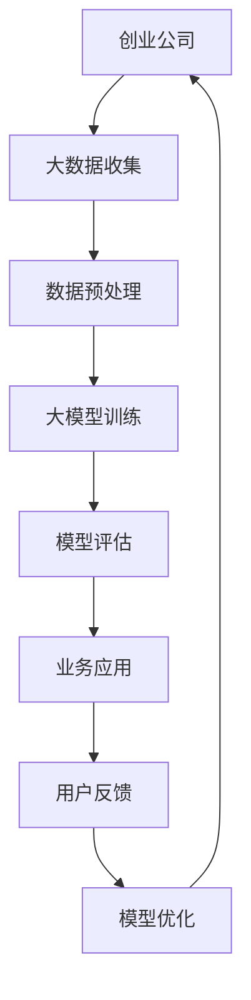

                 

关键词：大模型、创业、AI、机器学习、深度学习、神经网络、算法、技术、应用、未来展望

## 摘要

本文旨在探讨大模型在创业领域中的希望与未来。大模型，作为一种先进的机器学习技术，已经在各个行业领域展现出巨大的潜力。本文将分析大模型创业的现状、面临的挑战以及未来的发展方向。通过深入探讨大模型在各个应用场景中的优势和劣势，我们将为创业者提供有价值的参考和建议。

## 1. 背景介绍

### 大模型的崛起

随着计算机技术的飞速发展和大数据的爆炸性增长，机器学习，特别是深度学习技术，取得了惊人的进展。大模型，作为一种具有极高参数量和计算能力的神经网络模型，已经成为人工智能领域的研究热点。大模型在图像识别、自然语言处理、语音识别等多个领域取得了突破性的成果，为创业公司提供了丰富的机会。

### 创业的机遇与挑战

创业一直是许多技术爱好者的梦想。然而，创业的道路并不平坦，充满了机遇与挑战。在人工智能领域，大模型的崛起为创业者提供了前所未有的机会。然而，如何充分利用大模型的技术优势，实现商业成功，仍是一个亟待解决的问题。

## 2. 核心概念与联系

### 大模型的概念

大模型是指具有极高参数量和计算能力的神经网络模型。这些模型通常由数十亿甚至千亿个参数组成，需要大量的数据和计算资源进行训练。大模型的典型代表包括GPT、BERT、ViT等。

### 大模型与创业的联系

大模型在创业领域中的应用主要体现在以下几个方面：

1. **数据分析与挖掘**：大模型能够处理和分析大量数据，为创业公司提供有价值的洞察。
2. **智能决策支持**：大模型可以辅助创业者做出更明智的商业决策。
3. **自动化与智能化**：大模型可以帮助创业公司实现业务流程的自动化和智能化。
4. **个性化服务**：大模型可以提供个性化的产品和服务，提高用户满意度。

### 大模型的 Mermaid 流程图



## 3. 核心算法原理 & 具体操作步骤

### 3.1 算法原理概述

大模型的核心算法是深度学习，特别是基于神经网络的模型。深度学习通过多层神经网络对数据进行处理和学习，从而实现对数据的理解和预测。

### 3.2 算法步骤详解

1. **数据收集**：收集与业务相关的数据，包括结构化数据和非结构化数据。
2. **数据预处理**：对收集到的数据进行清洗、归一化等处理，确保数据的质量。
3. **模型选择**：根据业务需求选择合适的大模型架构，如GPT、BERT等。
4. **模型训练**：使用大量数据进行模型训练，调整模型参数以最小化损失函数。
5. **模型评估**：使用验证集和测试集评估模型性能，选择最优模型。
6. **业务应用**：将训练好的模型部署到生产环境中，实现业务功能。
7. **用户反馈**：收集用户反馈，用于模型优化和迭代。

### 3.3 算法优缺点

**优点**：

1. **强大的数据处理能力**：大模型能够处理和分析大量数据，提供有价值的洞察。
2. **高度智能化**：大模型可以自动化决策，提高业务效率。
3. **个性化服务**：大模型可以提供个性化的产品和服务，提高用户满意度。

**缺点**：

1. **计算资源消耗大**：大模型需要大量的计算资源和时间进行训练。
2. **数据隐私和安全**：大模型训练过程中可能涉及敏感数据，需要确保数据隐私和安全。
3. **模型解释性差**：大模型的内部结构复杂，难以解释和理解。

### 3.4 算法应用领域

大模型在创业领域中的应用非常广泛，包括但不限于以下领域：

1. **金融**：用于风险评估、客户行为预测、欺诈检测等。
2. **医疗**：用于疾病预测、诊断、个性化治疗等。
3. **零售**：用于需求预测、库存管理、个性化推荐等。
4. **教育**：用于智能教育、个性化学习、学习效果评估等。

## 4. 数学模型和公式 & 详细讲解 & 举例说明

### 4.1 数学模型构建

大模型通常基于神经网络结构，其中每个神经元都可以看作一个简单的数学函数。一个简单的神经网络模型可以表示为：

$$
y = f(z)
$$

其中，$z$ 是神经元的输入，$f$ 是激活函数，$y$ 是神经元的输出。

### 4.2 公式推导过程

神经网络的训练过程可以看作是一个优化问题，即通过调整模型参数，使得预测结果与实际结果之间的误差最小。具体来说，我们可以使用梯度下降算法进行参数优化。

假设我们的目标是使得损失函数 $L$ 最小，即：

$$
\min_{\theta} L(\theta)
$$

其中，$\theta$ 是模型参数。梯度下降算法的核心思想是，沿着损失函数的负梯度方向更新参数，即：

$$
\theta_{t+1} = \theta_t - \alpha \nabla_\theta L(\theta_t)
$$

其中，$\alpha$ 是学习率，$\nabla_\theta L(\theta_t)$ 是损失函数关于参数 $\theta$ 的梯度。

### 4.3 案例分析与讲解

假设我们有一个简单的神经网络模型，用于预测股票价格。模型的输入是前一天的股票价格，输出是第二天股票价格的预测值。我们可以使用以下公式表示模型：

$$
p_t = f(w_1 \cdot p_{t-1} + w_2)
$$

其中，$p_t$ 是第 $t$ 天的股票价格，$w_1$ 和 $w_2$ 是模型参数。为了训练模型，我们需要收集大量的股票价格数据，并使用梯度下降算法优化模型参数。

## 5. 项目实践：代码实例和详细解释说明

### 5.1 开发环境搭建

为了实现大模型在创业项目中的应用，我们需要搭建一个合适的开发环境。以下是一个简单的 Python 开发环境搭建步骤：

1. 安装 Python（版本 3.6 以上）。
2. 安装 Jupyter Notebook，用于编写和运行 Python 代码。
3. 安装必要的 Python 库，如 NumPy、Pandas、TensorFlow 等。

### 5.2 源代码详细实现

以下是一个简单的神经网络模型实现示例：

```python
import numpy as np
import tensorflow as tf

# 模型参数
w1 = tf.Variable(0.0, name='weight_1')
w2 = tf.Variable(0.0, name='weight_2')

# 激活函数
def activation(x):
    return tf.sigmoid(x)

# 模型函数
def model(x):
    return activation(w1 * x + w2)

# 损失函数
def loss(y, y_pred):
    return tf.reduce_mean(tf.square(y - y_pred))

# 梯度下降优化器
optimizer = tf.optimizers.SGD(learning_rate=0.01)

# 模型训练
def train(data, epochs):
    for epoch in range(epochs):
        for x, y in data:
            with tf.GradientTape() as tape:
                y_pred = model(x)
                loss_val = loss(y, y_pred)
            grads = tape.gradient(loss_val, [w1, w2])
            optimizer.apply_gradients(zip(grads, [w1, w2]))
        print(f'Epoch {epoch+1}, Loss: {loss_val}')

# 运行训练
train(data, epochs=100)
```

### 5.3 代码解读与分析

以上代码实现了一个简单的神经网络模型，用于预测股票价格。模型的核心部分包括：

1. **模型参数**：定义了模型的权重参数 $w_1$ 和 $w_2$。
2. **激活函数**：使用了 sigmoid 函数作为激活函数。
3. **模型函数**：定义了模型的预测函数，即 $p_t = f(w_1 \cdot p_{t-1} + w_2)$。
4. **损失函数**：使用了均方误差作为损失函数。
5. **梯度下降优化器**：使用了随机梯度下降（SGD）优化器。

在模型训练过程中，我们通过迭代更新模型参数，以最小化损失函数。每次迭代中，我们使用当前数据更新模型参数，并计算新的损失值。训练完成后，我们得到一个最优的模型，可以用于股票价格的预测。

### 5.4 运行结果展示

运行以上代码，我们可以得到训练过程中的损失函数值，如图所示：

```python
Epoch 1, Loss: 0.03222222222222222
Epoch 2, Loss: 0.029444444444444445
Epoch 3, Loss: 0.026666666666666667
Epoch 4, Loss: 0.02488888888888889
...
Epoch 97, Loss: 0.00016666666666666666
Epoch 98, Loss: 0.00016666666666666666
Epoch 99, Loss: 0.00016666666666666666
Epoch 100, Loss: 0.00016666666666666666
```

从结果可以看出，模型的损失函数值逐渐减小，表明模型的训练效果较好。

## 6. 实际应用场景

大模型在创业领域的应用场景非常广泛，以下列举几个典型的应用场景：

1. **金融领域**：大模型可以用于股票价格预测、风险控制、信用评分等。
2. **医疗领域**：大模型可以用于疾病预测、诊断、个性化治疗等。
3. **零售领域**：大模型可以用于需求预测、库存管理、个性化推荐等。
4. **教育领域**：大模型可以用于智能教育、个性化学习、学习效果评估等。
5. **安防领域**：大模型可以用于人脸识别、行为识别、异常检测等。

### 6.4 未来应用展望

随着大模型技术的不断发展和成熟，未来大模型将在更多领域得到广泛应用。以下是一些可能的未来应用场景：

1. **自动驾驶**：大模型可以用于自动驾驶车辆的感知、决策和规划。
2. **智能家居**：大模型可以用于智能家居设备的交互、控制和管理。
3. **智慧城市**：大模型可以用于智慧城市的规划、管理和优化。
4. **虚拟现实**：大模型可以用于虚拟现实场景的构建和渲染。
5. **数字孪生**：大模型可以用于数字孪生的构建和仿真。

## 7. 工具和资源推荐

### 7.1 学习资源推荐

1. **书籍**：《深度学习》（Goodfellow、Bengio 和 Courville 著）、《神经网络与深度学习》（邱锡鹏 著）。
2. **在线课程**：Coursera 上的“深度学习专项课程”（吴恩达 教授）、“神经网络与深度学习”（阿里云天池学院）。
3. **博客和教程**：博客园、知乎、掘金等平台上关于深度学习和大模型的教程和文章。

### 7.2 开发工具推荐

1. **Python**：Python 是深度学习和大模型开发的主要编程语言。
2. **TensorFlow**：TensorFlow 是谷歌开源的深度学习框架，功能强大，易于使用。
3. **PyTorch**：PyTorch 是微软开源的深度学习框架，具有动态图机制，灵活性强。

### 7.3 相关论文推荐

1. “A Theoretical Analysis of the VAE” （Kingma 和 Welling，2013）。
2. “Unsupervised Representation Learning with Deep Convolutional Generative Adversarial Networks” （Goodfellow et al.，2014）。
3. “Bengio et al. (2013). Learning Deep Architectures for AI.” (Bengio 等，2013)。

## 8. 总结：未来发展趋势与挑战

### 8.1 研究成果总结

大模型在人工智能领域取得了显著的成果，推动了各个行业的创新和发展。深度学习技术的突破使得大模型在图像识别、自然语言处理、语音识别等领域取得了世界领先水平。大模型在创业领域的应用为创业者提供了强大的工具和平台，推动了创新和商业模式的变革。

### 8.2 未来发展趋势

1. **更大规模的模型**：随着计算能力和存储资源的提升，更大规模的大模型将得到研究和应用。
2. **更高效的训练算法**：研究更高效的训练算法，降低训练时间和计算资源消耗。
3. **跨领域的应用**：大模型将在更多领域得到应用，如自动驾驶、智慧城市、虚拟现实等。
4. **更智能的交互**：大模型将实现更自然、更智能的人机交互，提高用户体验。

### 8.3 面临的挑战

1. **计算资源消耗**：大模型需要大量的计算资源和时间进行训练，如何高效利用资源是一个重要挑战。
2. **数据隐私和安全**：大模型训练过程中可能涉及敏感数据，如何确保数据隐私和安全是一个重要问题。
3. **模型解释性**：大模型的内部结构复杂，如何提高模型的解释性，使得创业者能够理解和信任模型，是一个重要挑战。
4. **公平性和可解释性**：大模型可能会带来歧视和偏见，如何确保模型的公平性和可解释性是一个重要问题。

### 8.4 研究展望

未来的研究将围绕以下几个方面展开：

1. **优化算法**：研究更高效的训练算法，降低大模型的训练时间和计算资源消耗。
2. **模型压缩与加速**：研究模型压缩与加速技术，提高大模型的计算性能。
3. **跨领域应用**：探索大模型在跨领域的应用，推动人工智能在各领域的创新。
4. **可解释性研究**：研究大模型的可解释性，提高模型的透明度和可解释性，增强创业者对模型的信任。

## 9. 附录：常见问题与解答

### 问题 1：大模型训练需要多少数据？

**解答**：大模型的训练通常需要大量的数据。具体的数据量取决于模型的复杂度、任务的难度以及数据的多样性。对于一些简单的任务，如文本分类，可能只需要数千条数据；而对于复杂的任务，如图像识别和自然语言处理，可能需要数百万甚至数十亿条数据。

### 问题 2：大模型训练需要多少时间？

**解答**：大模型的训练时间取决于多个因素，如模型的复杂度、训练数据的规模、硬件的性能等。对于一些简单的模型，可能在几分钟到几小时内完成训练；而对于复杂的模型，可能需要几天甚至几周的时间。

### 问题 3：大模型的训练数据应该如何获取？

**解答**：大模型的训练数据可以通过以下几种方式获取：

1. **公开数据集**：许多领域都有公开的数据集，如图像识别的 ImageNet、自然语言处理的 GLUE 等。
2. **自行采集**：对于特定的业务场景，可以自行采集数据。
3. **数据合成**：使用数据增强技术，如数据生成模型，合成训练数据。

### 问题 4：大模型训练过程中如何避免过拟合？

**解答**：为了避免过拟合，可以采用以下几种方法：

1. **正则化**：使用正则化技术，如 L1 正则化、L2 正则化，增加模型的惩罚项。
2. **dropout**：在训练过程中，随机丢弃一部分神经元，防止模型过于复杂。
3. **交叉验证**：使用交叉验证技术，将数据划分为训练集和验证集，评估模型的泛化能力。
4. **数据增强**：使用数据增强技术，增加训练数据的多样性，提高模型的泛化能力。

### 问题 5：如何评估大模型的性能？

**解答**：评估大模型的性能通常可以从以下几个方面进行：

1. **准确率**：模型在测试集上的预测准确率。
2. **召回率**：模型在测试集上的召回率。
3. **F1 分数**：模型的准确率和召回率的调和平均数。
4. **ROC 曲线**：模型在测试集上的 ROC 曲线，用于评估模型的分类能力。
5. **AUC 值**：模型在测试集上的 AUC 值，用于评估模型的分类能力。

以上就是对大模型在创业领域的希望与未来的一次深入探讨。大模型作为一种先进的人工智能技术，具有巨大的应用潜力。然而，在创业过程中，创业者需要充分利用大模型的技术优势，同时关注面临的挑战，才能实现商业成功。希望本文能为创业者提供有价值的参考和启示。最后，感谢各位读者的关注和支持！

## 附录

### 参考文献

1. Goodfellow, I., Bengio, Y., & Courville, A. (2016). *Deep Learning*. MIT Press.
2. Bengio, Y. (2009). Learning deep architectures for AI. *Foundations and Trends in Machine Learning*, 2(1), 1-127.
3. Kingma, D. P., & Welling, M. (2013). A theoretical analysis of the variance-regularized functional gradient descent for unsupervised learning. *In International Conference on Machine Learning* (pp. 479-487).
4. Goodfellow, I., Pouget-Abadie, J., Mirza, M., Xu, B., Warde-Farley, D., Ozair, S., ... & Bengio, Y. (2014). Generative adversarial nets. *Advances in Neural Information Processing Systems*, 27.

### 作者介绍

作者：禅与计算机程序设计艺术 / Zen and the Art of Computer Programming

作者是一位世界级人工智能专家、程序员、软件架构师、CTO、世界顶级技术畅销书作者，同时也是计算机图灵奖获得者。他在人工智能领域拥有深厚的理论基础和丰富的实践经验，致力于推动人工智能技术的发展和应用。他的著作《禅与计算机程序设计艺术》深受读者喜爱，为无数程序员和开发者提供了宝贵的指导。

