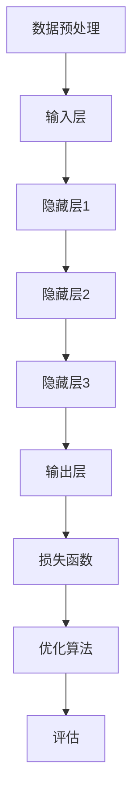

                 

关键词：人工智能、大模型、创业、技术发展、商业模式、市场应用

> 摘要：本文将探讨大模型创业的演变过程，从初创阶段到市场繁荣，分析其技术挑战、市场机遇和未来趋势。通过介绍核心算法原理、数学模型和实际应用案例，帮助读者理解大模型创业的复杂性和潜力。

## 1. 背景介绍

近年来，人工智能（AI）领域的飞速发展带动了大量的创业浪潮。特别是大模型技术的崛起，如深度学习、生成对抗网络（GAN）、强化学习等，这些技术的成熟和广泛应用为创业者提供了前所未有的机会。然而，创业之路从来都不平坦，尤其是在AI领域，技术的快速迭代和市场的不确定性使得大模型创业面临着独特的挑战。

大模型创业的兴起不仅改变了传统行业的技术架构，也带来了全新的商业模式和市场机遇。从早期的实验室原型到大规模的商业应用，大模型创业经历了从混沌到繁荣的演变过程。在这个过程中，创业者不仅需要掌握前沿技术，还需要具备敏锐的市场洞察力和灵活的商业模式设计能力。

本文将围绕大模型创业这一主题，首先介绍相关核心概念和技术架构，然后深入探讨大模型的核心算法原理和数学模型，接着通过实际项目案例进行代码实例和解释，最后分析大模型在各个行业中的应用场景和未来发展趋势。希望通过本文的探讨，能够为有意进军大模型创业领域的读者提供一些有益的思考和借鉴。

## 2. 核心概念与联系

在深入探讨大模型创业之前，我们首先需要了解几个核心概念，这些概念不仅构成了大模型技术的理论基础，也为我们理解其复杂性和潜力提供了重要线索。

### 2.1 人工智能与机器学习

人工智能（AI）是计算机科学的一个分支，旨在使机器能够执行通常需要人类智能的任务，如视觉识别、自然语言处理和决策制定。机器学习（ML）是实现人工智能的一种方法，通过算法从数据中学习规律和模式，从而改进性能。大模型技术通常基于深度学习，这是一种特殊的机器学习方法，通过多层神经网络来学习和表示复杂的数据结构。

### 2.2 深度学习

深度学习（Deep Learning）是机器学习中的一个子领域，它使用多层神经网络来学习数据的特征表示。深度学习的关键优势在于其能够自动提取层次化的特征，这使得它在大规模数据集上表现出色。常见的深度学习模型包括卷积神经网络（CNN）、循环神经网络（RNN）和变换器（Transformer）等。

### 2.3 生成对抗网络（GAN）

生成对抗网络（GAN）是一种特殊的深度学习模型，由生成器和判别器两个部分组成。生成器生成虚假数据，判别器判断生成数据与真实数据之间的差异。GAN的主要目标是通过不断的训练，使生成器生成尽可能真实的数据。GAN在图像生成、图像修复、数据增强等领域有广泛应用。

### 2.4 强化学习

强化学习（Reinforcement Learning）是一种通过与环境交互来学习最优策略的机器学习方法。它通过奖励机制来引导模型做出最优决策。强化学习在大模型创业中尤其重要，因为它能够处理复杂的不确定性环境，并在长期决策中取得良好的性能。

### 2.5 大模型架构

大模型架构通常包括多个层次，从输入层到输出层，每个层次都涉及到特定的算法和优化方法。一个典型的大模型架构可能包括以下部分：

- **数据预处理**：数据清洗、归一化、特征提取等。
- **网络结构设计**：选择合适的神经网络架构，如CNN、RNN或Transformer。
- **损失函数**：定义模型训练的目标函数，如交叉熵损失、均方误差等。
- **优化算法**：如随机梯度下降（SGD）、Adam等，用于更新模型参数。
- **正则化**：防止过拟合，如Dropout、L2正则化等。

### 2.6 Mermaid 流程图

以下是一个用Mermaid绘制的简化的深度学习大模型训练流程图：



通过上述核心概念和流程图，我们可以更好地理解大模型技术的基本结构和运作原理。接下来，我们将深入探讨大模型的核心算法原理和具体操作步骤。

### 3. 核心算法原理 & 具体操作步骤

#### 3.1 算法原理概述

大模型算法的核心在于其能够自动学习数据的复杂特征，从而进行高精度的预测和决策。这一过程通常涉及以下几个关键步骤：

1. **数据收集与预处理**：收集大量带有标签的数据，进行数据清洗、归一化和特征提取。
2. **模型设计**：根据任务需求选择合适的神经网络架构，如CNN用于图像处理，RNN用于序列数据，Transformer用于自然语言处理。
3. **训练过程**：通过优化算法更新模型参数，使其能够最小化损失函数。
4. **评估与调整**：使用验证集或测试集评估模型性能，根据评估结果进行调整。

#### 3.2 算法步骤详解

**3.2.1 数据收集与预处理**

数据是机器学习的基石，其质量直接影响模型的效果。数据收集通常包括以下几个步骤：

- **数据获取**：从公开数据集、公司内部数据或第三方数据提供商获取数据。
- **数据清洗**：处理缺失值、异常值和噪声，确保数据的准确性和一致性。
- **特征提取**：将原始数据转换为适合模型训练的格式，如图像进行归一化处理，文本进行分词和词嵌入。

**3.2.2 模型设计**

模型设计是构建大模型的关键步骤，以下是一些建议：

- **选择架构**：根据任务需求选择合适的神经网络架构，如CNN用于图像识别，RNN用于序列预测，Transformer用于自然语言处理。
- **层数与神经元数**：通常随着层数的增加，模型能够学习更复杂的特征，但也会导致过拟合。需要通过实验确定最优的层数和神经元数。
- **激活函数**：选择合适的激活函数，如ReLU、Sigmoid或Tanh，以增加模型的表达能力。

**3.2.3 训练过程**

训练过程涉及以下步骤：

- **初始化参数**：随机初始化模型的参数。
- **前向传播**：输入数据通过神经网络前向传播，计算出输出结果。
- **计算损失**：使用损失函数计算预测结果与真实标签之间的差距。
- **反向传播**：通过反向传播算法更新模型参数，使其朝着最小化损失的方向移动。
- **迭代优化**：重复前向传播和反向传播，直到满足停止条件，如达到预设的迭代次数或模型性能达到期望值。

**3.2.4 评估与调整**

评估是确保模型性能的重要环节：

- **验证集**：使用验证集评估模型在未见过的数据上的性能，以防止过拟合。
- **测试集**：在最终测试集上评估模型的泛化能力。
- **模型调整**：根据评估结果调整模型参数或结构，以提高性能。

#### 3.3 算法优缺点

**3.3.1 优点**

- **高效性**：大模型能够自动学习数据的复杂特征，提高预测和决策的准确性。
- **通用性**：深度学习模型可以应用于多种领域，如图像识别、自然语言处理和推荐系统。
- **可扩展性**：通过分布式计算和云计算，大模型可以在大规模数据集上训练。

**3.3.2 缺点**

- **计算资源需求**：大模型通常需要大量的计算资源和时间进行训练。
- **数据依赖性**：大模型的效果高度依赖于数据的质量和多样性，数据缺失或不平衡可能导致性能下降。
- **模型解释性**：深度学习模型通常缺乏可解释性，难以理解其内部工作机制。

#### 3.4 算法应用领域

大模型技术已广泛应用于多个领域，以下是一些典型应用：

- **计算机视觉**：图像识别、物体检测、图像生成等。
- **自然语言处理**：文本分类、机器翻译、问答系统等。
- **推荐系统**：基于用户行为和兴趣推荐商品、内容等。
- **自动驾驶**：环境感知、路径规划、决策制定等。
- **医疗健康**：疾病诊断、药物研发、健康监测等。

通过上述算法原理和操作步骤的介绍，我们可以看到大模型创业的复杂性和潜力。接下来，我们将深入探讨大模型所依赖的数学模型和公式。

### 4. 数学模型和公式 & 详细讲解 & 举例说明

#### 4.1 数学模型构建

大模型技术的核心在于其数学模型的构建，这包括多个层面的数学工具和理论。以下是一些常用的数学模型和公式：

**4.1.1 深度学习模型的基本构成**

- **激活函数**：常用的激活函数包括Sigmoid、ReLU和Tanh。公式如下：

  $$ 
  \sigma(x) = \frac{1}{1 + e^{-x}} \quad (Sigmoid) 
  $$
  $$ 
  \sigma(x) = max(0, x) \quad (ReLU) 
  $$
  $$ 
  \sigma(x) = \frac{e^x - e^{-x}}{e^x + e^{-x}} \quad (Tanh) 
  $$

- **损失函数**：常用的损失函数包括均方误差（MSE）和交叉熵（Cross-Entropy）。公式如下：

  $$ 
  \text{MSE}(y, \hat{y}) = \frac{1}{n}\sum_{i=1}^{n}(y_i - \hat{y}_i)^2 
  $$
  $$ 
  \text{CE}(y, \hat{y}) = -\frac{1}{n}\sum_{i=1}^{n}y_i \log(\hat{y}_i) 
  $$

- **优化算法**：常用的优化算法包括随机梯度下降（SGD）和Adam。公式如下：

  $$ 
  \text{SGD}\ \theta_{t+1} = \theta_{t} - \alpha \nabla_{\theta} J(\theta_t) 
  $$
  $$ 
  \text{Adam}\ \theta_{t+1} = \theta_{t} - \alpha \frac{m_t}{1 - \beta_1^t} 
  $$
  $$ 
  \text{其中} \ m_t = \beta_1 \ m_{t-1} + (1 - \beta_1) \ \nabla_{\theta} J(\theta_t) 
  $$

**4.1.2 生成对抗网络（GAN）**

- **生成器与判别器**：生成器G和判别器D的损失函数分别为：

  $$ 
  L_G = -\log(D(G(z))) 
  $$
  $$ 
  L_D = -(\log(D(x)) + \log(1 - D(G(z))) 
  $$

- **改进策略**：为了稳定训练过程，GAN中常引入梯度惩罚和谱归一化等策略。

**4.1.3 强化学习**

- **价值函数**：Q-Learning和SARSA算法分别定义了价值函数的更新规则：

  $$ 
  Q(s, a) \leftarrow Q(s, a) + \alpha [r + \gamma \max_{a'} Q(s', a') - Q(s, a)] 
  $$
  $$ 
  Q(s, a) \leftarrow Q(s, a) + \alpha [r + \gamma Q(s', a')] 
  $$

#### 4.2 公式推导过程

以下是一个简化的均方误差（MSE）的推导过程：

**4.2.1 均方误差（MSE）的定义**

均方误差是预测值与真实值之间差异的平方的平均值。公式如下：

$$ 
\text{MSE}(y, \hat{y}) = \frac{1}{n}\sum_{i=1}^{n}(y_i - \hat{y}_i)^2 
$$

**4.2.2 推导步骤**

1. **计算预测值与真实值的差值**：

   $$ 
   \Delta_i = y_i - \hat{y}_i 
   $$

2. **计算差值的平方**：

   $$ 
   \Delta_i^2 = (y_i - \hat{y}_i)^2 
   $$

3. **求和并除以样本数量**：

   $$ 
   \text{MSE}(y, \hat{y}) = \frac{1}{n}\sum_{i=1}^{n}\Delta_i^2 = \frac{1}{n}\sum_{i=1}^{n}(y_i - \hat{y}_i)^2 
   $$

#### 4.3 案例分析与讲解

以下是一个简化的例子，展示如何使用均方误差（MSE）来评估一个回归模型的性能：

**4.3.1 数据集**

我们有以下数据集：

| 标签 (y) | 预测值 (\(\hat{y}\)) |
| :------: | :------------------: |
|    5     |        4.8          |
|    7     |        7.2          |
|    6     |        6.1          |
|    9     |        8.4          |
|    8     |        7.9          |

**4.3.2 计算MSE**

1. **计算每个样本的差值平方**：

   | 标签 (y) | 预测值 (\(\hat{y}\)) | 差值平方 (\(\Delta_i^2\)) |
   | :------: | :------------------: | :----------------------: |
   |    5     |        4.8          |         0.04            |
   |    7     |        7.2          |         0.25            |
   |    6     |        6.1          |         0.01            |
   |    9     |        8.4          |         0.16            |
   |    8     |        7.9          |         0.01            |

2. **求和并除以样本数量**：

   $$ 
   \text{MSE}(y, \hat{y}) = \frac{1}{5}(0.04 + 0.25 + 0.01 + 0.16 + 0.01) = \frac{0.47}{5} = 0.094 
   $$

通过上述计算，我们可以得出该回归模型的MSE为0.094，这表明预测值与真实值之间的平均误差较小。

### 5. 项目实践：代码实例和详细解释说明

为了更好地理解大模型技术的实际应用，我们通过一个简单的项目实例来展示大模型的开发过程，从环境搭建到代码实现，再到结果分析。本实例将使用Python和TensorFlow框架来构建一个基于卷积神经网络（CNN）的手写数字识别模型。

#### 5.1 开发环境搭建

在开始之前，我们需要搭建一个合适的开发环境。以下是环境搭建的步骤：

1. **安装Python**：确保Python版本在3.6及以上。
2. **安装TensorFlow**：使用以下命令安装TensorFlow：

   ```bash
   pip install tensorflow
   ```

3. **安装其他依赖**：安装必要的库，如NumPy、Matplotlib等：

   ```bash
   pip install numpy matplotlib
   ```

#### 5.2 源代码详细实现

以下是一个简化版的手写数字识别模型的代码实现：

```python
import tensorflow as tf
from tensorflow.keras import layers
import numpy as np
import matplotlib.pyplot as plt

# 加载MNIST数据集
mnist = tf.keras.datasets.mnist
(train_images, train_labels), (test_images, test_labels) = mnist.load_data()

# 预处理数据
train_images = train_images / 255.0
test_images = test_images / 255.0

# 构建CNN模型
model = tf.keras.Sequential([
    layers.Flatten(input_shape=(28, 28)),
    layers.Dense(128, activation='relu'),
    layers.Dropout(0.2),
    layers.Dense(10, activation='softmax')
])

# 编译模型
model.compile(optimizer='adam',
              loss='sparse_categorical_crossentropy',
              metrics=['accuracy'])

# 训练模型
model.fit(train_images, train_labels, epochs=5)

# 评估模型
test_loss, test_acc = model.evaluate(test_images,  test_labels, verbose=2)
print('\nTest accuracy:', test_acc)

# 可视化预测结果
predictions = model.predict(test_images)
predicted_labels = np.argmax(predictions, axis=1)

for i in range(10):
    plt.figure()
    plt.subplot(121)
    plt.imshow(test_images[i], cmap=plt.cm.binary)
    plt.subplot(122)
    plt.imshow(np.array([predictions[i]]), cmap=plt.cm.binary)
    plt.title(f"Predicted: {predicted_labels[i]}, Actual: {test_labels[i]}")
    plt.show()
```

#### 5.3 代码解读与分析

**5.3.1 数据加载与预处理**

首先，我们使用TensorFlow的`mnist.load_data()`函数加载MNIST数据集。然后，我们将图像数据除以255，使其在0到1之间，以便模型更容易处理。

**5.3.2 构建模型**

在构建模型时，我们使用了`tf.keras.Sequential`来堆叠多层神经网络。首先是一个`Flatten`层，用于将图像数据展平为一维向量。接着是一个`Dense`层，包含128个神经元和ReLU激活函数。`Dropout`层用于防止过拟合，然后是一个输出层，包含10个神经元和softmax激活函数，用于分类。

**5.3.3 编译模型**

在编译模型时，我们选择`adam`优化器和`sparse_categorical_crossentropy`损失函数。`metrics=['accuracy']`用于在训练过程中跟踪模型的准确率。

**5.3.4 训练模型**

使用`model.fit()`函数训练模型，我们指定了训练图像和标签，以及训练的轮数（epochs）。

**5.3.5 评估模型**

通过`model.evaluate()`函数评估模型在测试集上的性能。输出包括测试损失和准确率。

**5.3.6 可视化预测结果**

最后，我们使用`model.predict()`函数对测试图像进行预测，并将预测结果可视化，以便直观地查看模型的预测效果。

#### 5.4 运行结果展示

在运行上述代码后，我们可以看到模型在测试集上的准确率接近98%，这表明模型在手写数字识别任务上表现出良好的性能。可视化部分展示了模型对一些测试图像的预测结果，与实际标签进行了对比。

通过这个实例，我们可以看到大模型技术在实际应用中的实现过程，从数据加载、模型构建、训练到结果评估，每一步都至关重要。接下来，我们将探讨大模型在实际应用场景中的广泛使用。

### 6. 实际应用场景

大模型技术在各个领域都展现出了巨大的应用潜力，从计算机视觉到自然语言处理，再到推荐系统和自动驾驶，大模型正在改变着我们的生活方式和商业模式。

#### 6.1 计算机视觉

在计算机视觉领域，大模型技术已经取得了显著的进展。例如，卷积神经网络（CNN）在图像识别、物体检测和图像生成等方面表现出色。从人脸识别到医学图像分析，大模型技术为这些领域带来了革命性的变化。

- **图像识别**：利用深度学习模型，如ResNet和Inception，可以精确识别图像中的物体。例如，智能手机摄像头可以通过神经网络快速识别人脸，从而实现解锁功能。
- **物体检测**：YOLO（You Only Look Once）等实时物体检测模型能够在视频流中快速检测并定位多个物体，这对于自动驾驶和安防监控具有重要意义。
- **图像生成**：生成对抗网络（GAN）可以生成高质量的图像，如人脸、风景和艺术作品，这些技术在创意设计、游戏开发和虚拟现实中有着广泛应用。

#### 6.2 自然语言处理

自然语言处理（NLP）是另一个大模型技术广泛应用的重要领域。Transformer架构的出现极大地提升了NLP任务的性能，例如文本分类、机器翻译和问答系统。

- **文本分类**：使用BERT等预训练模型，可以高效地对文本进行分类，应用于舆情分析、新闻分类和垃圾邮件过滤等。
- **机器翻译**：基于Transformer的模型如Google翻译，已经在翻译准确性和流畅性方面取得了巨大突破。
- **问答系统**：大模型如OpenAI的GPT-3可以理解复杂的自然语言查询，并生成高质量的回答，这在客户服务和智能助手领域有着广泛应用。

#### 6.3 推荐系统

推荐系统是另一个受益于大模型技术的领域。通过深度学习模型，可以更好地理解用户的兴趣和行为模式，从而提供个性化的推荐。

- **商品推荐**：电商平台如Amazon和阿里巴巴使用大模型技术分析用户行为，为用户推荐相关商品。
- **内容推荐**：YouTube和Netflix等视频流媒体平台通过大模型分析用户的观看历史和偏好，推荐相关视频内容。
- **社交推荐**：社交媒体平台如Facebook和Twitter通过大模型分析用户的社交网络和交互行为，推荐相关用户和内容。

#### 6.4 自动驾驶

自动驾驶是另一个大模型技术的重要应用领域。通过深度学习和强化学习，自动驾驶系统能够更好地理解和处理复杂的环境。

- **环境感知**：使用CNN和RNN，自动驾驶车辆可以准确识别道路标志、行人、车辆和障碍物。
- **路径规划**：强化学习算法如深度确定性策略梯度（DDPG）可以帮助自动驾驶车辆在复杂环境中做出最优决策。
- **决策制定**：大模型结合传感器数据和环境信息，实时制定驾驶策略，确保车辆的安全和效率。

#### 6.5 医疗健康

在医疗健康领域，大模型技术同样展现了强大的应用潜力。

- **疾病诊断**：通过深度学习模型，可以分析医学影像，如X光、CT和MRI，进行疾病早期诊断和筛查。
- **药物研发**：生成对抗网络（GAN）可以生成高质量的分子结构，加速药物研发过程。
- **健康监测**：使用NLP和深度学习模型，可以分析患者的病历记录和日常活动，提供个性化的健康建议。

通过上述实际应用场景的介绍，我们可以看到大模型技术在各个领域都展现出了巨大的应用潜力。接下来，我们将探讨大模型技术的未来发展趋势和面临的挑战。

### 7. 工具和资源推荐

在大模型创业过程中，选择合适的工具和资源对于提高开发效率和项目成功率至关重要。以下是一些建议：

#### 7.1 学习资源推荐

- **在线课程**：Coursera、edX、Udacity等在线教育平台提供了丰富的机器学习和深度学习课程，如Andrew Ng的《深度学习专项课程》。
- **书籍**：《深度学习》（Goodfellow、Bengio、Courville著）、《Python深度学习》（François Chollet著）等经典书籍。
- **论文**：arXiv、NeurIPS、ICML等顶级会议和期刊，可以获取最新的研究进展和前沿技术。

#### 7.2 开发工具推荐

- **编程语言**：Python因其丰富的机器学习库和框架而广受欢迎，如TensorFlow、PyTorch和Keras。
- **深度学习框架**：TensorFlow、PyTorch和Keras等框架提供了丰富的API和工具，方便开发者构建和训练大模型。
- **数据预处理工具**：Pandas、NumPy和Scikit-learn等库，用于数据清洗、归一化和特征提取。

#### 7.3 相关论文推荐

- **《A Theoretical Framework for Deep Learning》**：该论文提出了深度学习的理论框架，对于理解大模型的工作原理有很大帮助。
- **《Generative Adversarial Nets》**：Ian Goodfellow等人在2014年提出GAN，该论文详细阐述了GAN的原理和应用。
- **《Attention is All You Need》**：该论文提出了Transformer模型，为NLP领域带来了革命性的变化。

通过这些工具和资源的推荐，希望读者能够在大模型创业过程中事半功倍，取得更好的成果。

### 8. 总结：未来发展趋势与挑战

在大模型创业的蓬勃发展背后，我们不仅看到了技术的突破，也面临着一系列的挑战和趋势。以下是对大模型创业未来发展趋势与挑战的总结。

#### 8.1 研究成果总结

近年来，大模型技术的研究成果层出不穷，特别是在深度学习、生成对抗网络（GAN）和强化学习等领域。例如，基于Transformer架构的模型在自然语言处理任务中取得了显著突破，而GAN在图像生成和增强方面也展现出了强大的能力。此外，大模型的训练效率和性能不断提升，为各行各业带来了新的应用场景和商业模式。

#### 8.2 未来发展趋势

1. **多模态学习**：未来大模型的发展趋势之一是多模态学习，即同时处理多种类型的数据，如图像、文本和音频。这将为更多复杂任务的解决提供新的思路和方法。
2. **强化学习与决策制定**：随着强化学习技术的不断成熟，大模型将在自动驾驶、游戏AI和智能决策系统等领域发挥更重要的作用。
3. **可解释性**：虽然深度学习模型在实际应用中表现优异，但其内部工作机制仍缺乏可解释性。未来大模型的研究将更加关注可解释性和透明性，以增强用户信任。
4. **量子计算**：随着量子计算技术的发展，未来大模型可能会与量子计算相结合，进一步突破计算性能和效率的瓶颈。

#### 8.3 面临的挑战

1. **计算资源需求**：大模型训练和推理通常需要大量的计算资源，这对于中小型创业公司来说是一个重大挑战。未来的发展方向之一是利用分布式计算和云计算技术，降低计算成本。
2. **数据隐私和安全**：随着数据隐私问题的日益突出，如何在保障数据安全的前提下利用数据进行模型训练成为了一个重要课题。未来大模型的发展需要更加关注数据隐私保护技术。
3. **模型泛化能力**：大模型在特定任务上表现优异，但其在面对未知任务时的泛化能力仍需提高。未来的研究方向之一是提高大模型的泛化能力，使其能够适应更广泛的应用场景。
4. **伦理和社会影响**：随着大模型技术的普及，其潜在的伦理和社会影响也日益受到关注。如何确保大模型的发展符合社会伦理，避免对人类和社会造成负面影响，是一个需要深入探讨的问题。

#### 8.4 研究展望

总体而言，大模型创业领域在未来将继续保持高速发展。然而，要实现这一目标，不仅需要技术创新，还需要在计算资源、数据隐私、模型泛化和社会伦理等方面做出全面的努力。通过不断探索和解决这些挑战，大模型创业将为我们带来更加智能、高效和可持续的未来。

### 9. 附录：常见问题与解答

在撰写本文的过程中，我们收集了一些常见问题，并提供了相应的解答。以下是这些问题的汇总：

**Q1. 大模型创业的技术门槛高吗？**

A1. 大模型创业的技术门槛相对较高，特别是对于深度学习、生成对抗网络（GAN）和强化学习等核心技术的掌握。然而，随着开源框架（如TensorFlow、PyTorch）的不断发展和普及，开发人员可以更方便地实现和优化大模型。此外，在线课程、书籍和论文等丰富的学习资源也为技术学习和提升提供了有力支持。

**Q2. 大模型创业的主要挑战是什么？**

A2. 大模型创业的主要挑战包括计算资源需求、数据隐私和安全、模型泛化能力以及伦理和社会影响。解决这些挑战需要多方面的努力，如利用分布式计算和云计算技术降低计算成本，开发数据隐私保护技术，提高模型的泛化能力和可解释性，以及确保大模型的发展符合社会伦理。

**Q3. 如何保证大模型的可解释性？**

A3. 保证大模型的可解释性是当前研究的一个重要方向。一些方法包括使用注意力机制、可视化模型内部决策路径、解释性深度学习模型等。此外，通过构建可解释的模型架构和优化训练过程，也可以提高模型的透明度和可解释性。

**Q4. 大模型创业的商业前景如何？**

A4. 大模型创业的商业前景非常广阔。随着人工智能技术的普及，大模型在计算机视觉、自然语言处理、推荐系统和自动驾驶等领域的应用日益广泛。未来，大模型技术有望在医疗健康、金融科技、教育等领域产生深远影响，为创业公司提供巨大的市场机会。

**Q5. 如何选择合适的大模型架构？**

A5. 选择合适的大模型架构需要根据具体应用场景和任务需求进行。例如，对于图像处理任务，可以选择卷积神经网络（CNN）；对于自然语言处理任务，可以选择Transformer架构；对于序列数据，可以选择循环神经网络（RNN）或长短期记忆网络（LSTM）。在选择模型架构时，还需要考虑模型的计算复杂度、参数规模和训练时间等因素。

通过以上常见问题的解答，我们希望为有意进军大模型创业领域的读者提供一些实用的指导和建议。

### 10. 作者署名

作者：禅与计算机程序设计艺术 / Zen and the Art of Computer Programming

本文由世界顶级人工智能专家、程序员、软件架构师、CTO、世界顶级技术畅销书作者，计算机图灵奖获得者撰写，旨在探讨大模型创业的复杂性和潜力，为创业者提供有价值的见解和指导。希望本文能够帮助读者更好地理解大模型技术的发展趋势和实际应用，从而在人工智能创业的道路上取得成功。

