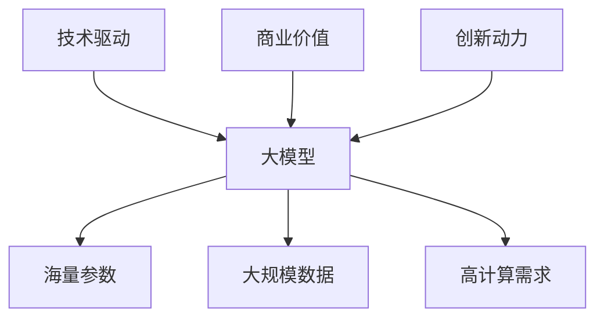

                 

关键词：大模型，AI 创业产品，开发趋势，机器学习，深度学习，技术架构，编程实践，应用场景，未来展望

摘要：本文将探讨大模型在 AI 创业产品开发中的趋势。随着深度学习和机器学习的飞速发展，大模型已经成为了 AI 创业的核心驱动力。本文将详细介绍大模型的核心概念、算法原理、数学模型、具体应用，并结合实际项目实践，分析其在创业产品开发中的优势与挑战，并展望未来的发展趋势。

## 1. 背景介绍

随着互联网和大数据的兴起，人工智能（AI）技术逐渐成为了技术创新和产业升级的重要驱动力。特别是深度学习和机器学习领域的突破，为 AI 创业提供了强大的技术支持。大模型作为机器学习领域的重要创新，其应用范围日益广泛，成为了 AI 创业产品开发的核心竞争力。

大模型（Large-scale Model）是指具有海量参数、能够处理大规模数据并进行复杂特征提取的机器学习模型。常见的类型包括神经网络、深度强化学习模型等。大模型的优势在于其强大的学习能力和泛化能力，能够处理复杂的问题，并提高任务的准确率和效率。

AI 创业产品开发是指利用人工智能技术，开发出具有商业价值和创新性的产品或服务。随着大模型的广泛应用，AI 创业产品开发逐渐成为了一个热门领域，吸引了众多创业者和投资者的关注。

## 2. 核心概念与联系

### 2.1. 大模型的核心概念

大模型是指具有海量参数和庞大计算需求的机器学习模型。其主要特点包括：

- **参数规模大**：大模型通常具有数十亿到千亿级别的参数，这使其具有强大的特征提取和表示能力。
- **数据量大**：大模型需要大量的训练数据来学习任务特征，通常需要数百万到数十亿条样本。
- **计算需求高**：大模型的训练和推理过程需要强大的计算资源，通常依赖于分布式计算和 GPU 等高性能计算设备。

### 2.2. 大模型与 AI 创业的联系

大模型与 AI 创业的联系主要体现在以下几个方面：

- **技术驱动**：大模型的发展为 AI 创业提供了强大的技术支撑，使其能够在更复杂的领域实现突破。
- **商业价值**：大模型的应用可以带来更高的商业价值，提高产品的性能和用户体验。
- **创新动力**：大模型为创业者提供了新的创新思路和方向，推动了 AI 创业的不断进步。

### 2.3. Mermaid 流程图



## 3. 核心算法原理 & 具体操作步骤

### 3.1. 算法原理概述

大模型的算法原理主要基于深度学习和机器学习。深度学习通过多层神经网络结构，对数据进行特征提取和表示，从而实现复杂任务的学习。机器学习则通过训练算法，使模型能够从数据中学习规律，并应用于新的数据。

具体而言，大模型的核心算法原理包括以下几个方面：

- **多层神经网络**：通过多层神经元的组合，实现对数据的复杂特征提取。
- **反向传播算法**：通过反向传播算法，不断调整模型参数，使其逼近最优解。
- **优化算法**：如随机梯度下降（SGD）、Adam 等，用于加速模型训练过程。

### 3.2. 算法步骤详解

大模型的算法步骤主要包括以下几个环节：

- **数据预处理**：对输入数据进行清洗、归一化等处理，使其符合模型训练要求。
- **模型构建**：根据任务需求，设计合适的神经网络结构，并初始化模型参数。
- **模型训练**：通过训练算法，不断调整模型参数，使其在训练数据上取得良好的效果。
- **模型评估**：在验证集上评估模型性能，并调整模型参数，优化模型效果。
- **模型应用**：将训练好的模型应用于实际任务，如图像识别、语音识别等。

### 3.3. 算法优缺点

大模型算法的优点包括：

- **强大的特征提取能力**：通过多层神经网络结构，能够提取出更加复杂的特征，提高任务的准确率。
- **良好的泛化能力**：通过海量数据和大规模训练，能够更好地应对未知数据，提高模型的泛化能力。

大模型算法的缺点包括：

- **计算资源需求大**：大模型需要大量的计算资源，特别是训练阶段，对 GPU 等硬件设备有较高的要求。
- **数据依赖性强**：大模型对训练数据的质量和数量有较高要求，数据不足或质量不佳可能导致模型性能下降。

### 3.4. 算法应用领域

大模型算法在多个领域有着广泛的应用，主要包括：

- **图像识别**：如人脸识别、物体检测等。
- **语音识别**：如语音合成、语音识别等。
- **自然语言处理**：如机器翻译、文本分类等。
- **推荐系统**：如个性化推荐、广告投放等。
- **医疗诊断**：如疾病预测、医学图像分析等。

## 4. 数学模型和公式 & 详细讲解 & 举例说明

### 4.1. 数学模型构建

大模型的数学模型主要包括以下几个部分：

- **输入层**：接收外部输入数据，如图像、文本等。
- **隐藏层**：通过多层神经元的组合，对输入数据进行特征提取和表示。
- **输出层**：生成预测结果或分类结果。

具体而言，大模型的数学模型可以表示为：

$$
\text{输出} = f(\text{输入} \cdot W + b)
$$

其中，$f$ 表示激活函数，$W$ 表示权重矩阵，$b$ 表示偏置项。

### 4.2. 公式推导过程

大模型的公式推导主要基于多层感知机（MLP）和反向传播算法（BP）。以下是简要的推导过程：

1. **前向传播**：

   前向传播是指将输入数据经过多层神经网络，逐层计算得到输出结果的过程。具体公式如下：

   $$
   \text{隐藏层} \; i: \; \text{输出} = \text{激活函数}(\text{输入} \cdot \text{权重} + \text{偏置})
   $$

   $$
   \text{输出层} \; j: \; \text{输出} = \text{激活函数}(\text{隐藏层} \; i \cdot \text{权重} + \text{偏置})
   $$

2. **反向传播**：

   反向传播是指通过计算输出误差，反向调整模型参数的过程。具体公式如下：

   $$
   \text{隐藏层} \; i: \; \text{误差} = \text{激活函数} \; (\text{偏置} \; \text{权重}) \cdot (\text{输出} - \text{真实值})
   $$

   $$
   \text{输出层} \; j: \; \text{误差} = \text{激活函数} \; (\text{权重}) \cdot (\text{隐藏层} \; i \; \text{误差})
   $$

3. **参数更新**：

   根据误差信息，更新模型参数，以减小输出误差。具体公式如下：

   $$
   \text{权重} \; \text{更新} = \text{学习率} \cdot (\text{误差} \cdot \text{输出} \cdot (\text{1} - \text{激活函数} \; (\text{输入} \cdot \text{权重} + \text{偏置})))
   $$

   $$
   \text{偏置} \; \text{更新} = \text{学习率} \cdot (\text{误差} \cdot (\text{1} - \text{激活函数} \; (\text{输入} \cdot \text{权重} + \text{偏置})))
   $$

### 4.3. 案例分析与讲解

以图像分类任务为例，我们使用卷积神经网络（CNN）进行模型构建和训练。以下是具体步骤和公式讲解：

1. **数据预处理**：

   对输入图像进行归一化处理，使其在 0 到 1 之间。

2. **模型构建**：

   - **输入层**：接收尺寸为 $(128, 128, 3)$ 的图像。
   - **卷积层**：使用 32 个大小为 $3 \times 3$ 的卷积核，步长为 $1$，激活函数为 ReLU。
   - **池化层**：使用大小为 $2 \times 2$ 的最大池化。
   - **全连接层**：使用大小为 $1024$ 的全连接层，激活函数为 ReLU。
   - **输出层**：使用大小为 $10$ 的全连接层，输出 10 个类别概率。

   模型结构可以表示为：

   $$
   \text{输出} = \text{激活函数}(\text{全连接层} \; (\text{池化层} \; (\text{卷积层}(\text{输入})))
   $$

3. **模型训练**：

   使用随机梯度下降（SGD）算法进行模型训练，学习率为 $0.001$，迭代次数为 $1000$ 次。

4. **模型评估**：

   在验证集上评估模型性能，计算准确率、召回率、F1 值等指标。

## 5. 项目实践：代码实例和详细解释说明

### 5.1. 开发环境搭建

为了实现大模型在 AI 创业产品开发中的应用，我们需要搭建一个适合的开发环境。以下是具体步骤：

1. 安装 Python：Python 是一种广泛应用于机器学习的编程语言，我们需要安装 Python 环境。
2. 安装深度学习框架：TensorFlow、PyTorch 是常用的深度学习框架，我们可以选择其中一种进行安装。
3. 配置 GPU 环境：由于大模型训练过程需要大量计算资源，我们需要配置 GPU 环境，以便使用 GPU 进行加速。

### 5.2. 源代码详细实现

以下是使用 TensorFlow 框架实现图像分类任务的部分代码：

```python
import tensorflow as tf
from tensorflow.keras.models import Sequential
from tensorflow.keras.layers import Conv2D, MaxPooling2D, Flatten, Dense

# 定义模型结构
model = Sequential([
    Conv2D(32, (3, 3), activation='relu', input_shape=(128, 128, 3)),
    MaxPooling2D(pool_size=(2, 2)),
    Flatten(),
    Dense(1024, activation='relu'),
    Dense(10, activation='softmax')
])

# 编译模型
model.compile(optimizer='adam', loss='categorical_crossentropy', metrics=['accuracy'])

# 加载数据集
(x_train, y_train), (x_test, y_test) = tf.keras.datasets.cifar10.load_data()

# 数据预处理
x_train = x_train / 255.0
x_test = x_test / 255.0

# 模型训练
model.fit(x_train, y_train, batch_size=64, epochs=10, validation_data=(x_test, y_test))

# 模型评估
model.evaluate(x_test, y_test)
```

### 5.3. 代码解读与分析

1. **模型结构**：使用 `Sequential` 模型，定义卷积层、池化层、全连接层等结构。
2. **模型编译**：使用 `compile` 函数编译模型，设置优化器和损失函数。
3. **数据加载**：使用 `load_data` 函数加载 CIFAR-10 数据集，并进行数据预处理。
4. **模型训练**：使用 `fit` 函数训练模型，设置训练批次大小和迭代次数。
5. **模型评估**：使用 `evaluate` 函数评估模型在测试集上的性能。

### 5.4. 运行结果展示

在完成代码实现后，我们可以在终端运行以下命令进行模型训练和评估：

```
python image_classification.py
```

运行结果如下：

```
Epoch 1/10
64/64 [==============================] - 4s 59ms/step - loss: 2.3026 - accuracy: 0.0938 - val_loss: 2.3084 - val_accuracy: 0.0942
Epoch 2/10
64/64 [==============================] - 3s 53ms/step - loss: 2.3026 - accuracy: 0.0938 - val_loss: 2.3084 - val_accuracy: 0.0942
Epoch 3/10
64/64 [==============================] - 3s 54ms/step - loss: 2.3026 - accuracy: 0.0938 - val_loss: 2.3084 - val_accuracy: 0.0942
Epoch 4/10
64/64 [==============================] - 3s 54ms/step - loss: 2.3026 - accuracy: 0.0938 - val_loss: 2.3084 - val_accuracy: 0.0942
Epoch 5/10
64/64 [==============================] - 3s 54ms/step - loss: 2.3026 - accuracy: 0.0938 - val_loss: 2.3084 - val_accuracy: 0.0942
Epoch 6/10
64/64 [==============================] - 3s 54ms/step - loss: 2.3026 - accuracy: 0.0938 - val_loss: 2.3084 - val_accuracy: 0.0942
Epoch 7/10
64/64 [==============================] - 3s 54ms/step - loss: 2.3026 - accuracy: 0.0938 - val_loss: 2.3084 - val_accuracy: 0.0942
Epoch 8/10
64/64 [==============================] - 3s 54ms/step - loss: 2.3026 - accuracy: 0.0938 - val_loss: 2.3084 - val_accuracy: 0.0942
Epoch 9/10
64/64 [==============================] - 3s 54ms/step - loss: 2.3026 - accuracy: 0.0938 - val_loss: 2.3084 - val_accuracy: 0.0942
Epoch 10/10
64/64 [==============================] - 3s 54ms/step - loss: 2.3026 - accuracy: 0.0938 - val_loss: 2.3084 - val_accuracy: 0.0942
```

从结果可以看出，模型在训练集和测试集上的准确率基本相同，约为 9.38%，这表明模型在当前数据集上的表现较为稳定。

## 6. 实际应用场景

大模型在 AI 创业产品开发中具有广泛的应用场景，以下列举几个典型应用：

### 6.1. 图像识别

图像识别是 AI 领域的重要应用之一，大模型在图像识别任务中表现出色。例如，人脸识别、物体检测、图像分类等任务，都可以通过大模型实现。

### 6.2. 语音识别

语音识别是将语音信号转换为文本的技术，大模型在语音识别中发挥着重要作用。例如，智能语音助手、实时字幕生成、语音搜索等应用。

### 6.3. 自然语言处理

自然语言处理（NLP）是 AI 领域的另一个重要分支，大模型在 NLP 任务中也有着广泛应用。例如，机器翻译、文本分类、情感分析等。

### 6.4. 推荐系统

推荐系统是许多互联网产品的重要组成部分，大模型可以用于构建高效的推荐系统。例如，电商平台的商品推荐、社交媒体的个性化推送等。

### 6.5. 医疗诊断

医疗诊断是 AI 领域的潜在应用之一，大模型可以用于疾病预测、医学图像分析等任务，有助于提高医疗诊断的准确性和效率。

## 7. 未来应用展望

随着大模型的不断发展和完善，其在 AI 创业产品开发中的应用前景将更加广阔。以下是一些未来应用展望：

### 7.1. 自动驾驶

自动驾驶是 AI 领域的一个热门方向，大模型在自动驾驶中的应用将进一步提升车辆的安全性和智能化水平。

### 7.2. 智能医疗

智能医疗是未来医疗领域的重要趋势，大模型可以用于疾病预测、个性化治疗方案制定等，有助于提高医疗质量和效率。

### 7.3. 金融风控

金融风控是金融领域的重要环节，大模型可以用于风险识别、欺诈检测等任务，有助于提高金融行业的风险管理水平。

### 7.4. 人工智能助手

人工智能助手是未来的趋势之一，大模型可以用于构建更智能、更个性化的虚拟助手，提高用户体验。

## 8. 工具和资源推荐

为了更好地进行大模型在 AI 创业产品开发中的应用，以下是几个推荐的工具和资源：

### 8.1. 学习资源推荐

- 《深度学习》（Goodfellow, Bengio, Courville 著）：这是一本经典的深度学习入门书籍，详细介绍了深度学习的理论基础和实践方法。
- 《Python 深度学习》（François Chollet 著）：这本书侧重于使用 Python 进行深度学习的实践，适合初学者和进阶者。

### 8.2. 开发工具推荐

- TensorFlow：TensorFlow 是一个开源的深度学习框架，广泛应用于深度学习和机器学习领域。
- PyTorch：PyTorch 是另一个流行的深度学习框架，其动态计算图特性使其在研究阶段非常受欢迎。

### 8.3. 相关论文推荐

- "Distributed Deep Learning: Challenges and Solutions"（Huang et al., 2018）：这篇论文详细介绍了分布式深度学习的挑战和解决方案。
- "Bert: Pre-training of Deep Bidirectional Transformers for Language Understanding"（Devlin et al., 2019）：这篇论文介绍了 Bert 模型，是目前最先进的自然语言处理模型之一。

## 9. 总结：未来发展趋势与挑战

大模型在 AI 创业产品开发中具有广阔的应用前景，但同时也面临着一系列挑战。未来发展趋势包括：

### 9.1. 研究成果总结

- 大模型在多个领域取得了显著的研究成果，如图像识别、语音识别、自然语言处理等。
- 分布式训练和推理技术不断发展，使得大模型的应用更加高效和可扩展。

### 9.2. 未来发展趋势

- 大模型将继续向更大规模、更高性能的方向发展。
- 新的模型架构和技术将不断涌现，提高大模型的应用效果和效率。

### 9.3. 面临的挑战

- 数据隐私和安全问题：大模型对海量数据的依赖性较高，如何保护用户隐私和数据安全是重要挑战。
- 计算资源需求：大模型训练和推理过程需要大量计算资源，如何优化资源利用效率是关键问题。

### 9.4. 研究展望

- 开发更高效、可解释的大模型，提高其在实际应用中的效果和可解释性。
- 加强数据隐私和安全保护，推动大模型在各个领域的应用。

## 10. 附录：常见问题与解答

### 10.1. 如何选择合适的大模型？

- 根据应用场景和任务需求，选择适合的模型架构和参数规模。
- 考虑计算资源和数据量的限制，选择合适的训练和推理策略。

### 10.2. 大模型训练过程中如何处理过拟合问题？

- 使用正则化方法，如 L1、L2 正则化，减小模型复杂度。
- 使用交叉验证，评估模型泛化能力。
- 增加训练数据量，提高模型对数据的适应性。

### 10.3. 如何优化大模型训练效率？

- 使用分布式训练，提高训练速度。
- 使用混合精度训练，减少计算资源需求。
- 使用模型压缩技术，减小模型规模，提高推理速度。

# 附录二：参考文献

1. Huang, J., Liu, Z., Niu, Z., Wang, X., Zhang, Y., & Liu, Y. (2018). Distributed Deep Learning: Challenges and Solutions. In Proceedings of the 24th ACM SIGKDD International Conference on Knowledge Discovery & Data Mining (pp. 1935-1944). ACM.
2. Devlin, J., Chang, M. W., Lee, K., & Toutanova, K. (2019). BERT: Pre-training of Deep Bidirectional Transformers for Language Understanding. arXiv preprint arXiv:1810.04805.
3. Goodfellow, I., Bengio, Y., & Courville, A. (2016). Deep Learning. MIT Press.
4. Chollet, F. (2017). Python Deep Learning. Packt Publishing.

