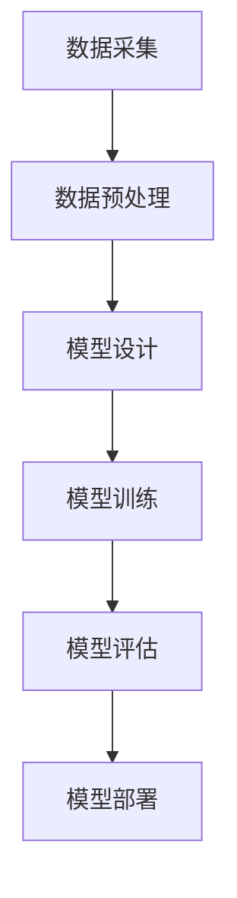

                 

关键词：大模型、AI 创业公司、产品创新、技术突破

> 摘要：随着人工智能技术的飞速发展，大模型技术已经成为 AI 创业公司产品创新的重要驱动力。本文将探讨大模型在 AI 创业公司产品创新中的应用，深入分析其技术原理、实践案例以及未来发展趋势。

## 1. 背景介绍

近年来，人工智能（AI）技术取得了显著进展，特别是在深度学习、自然语言处理、计算机视觉等领域。这些技术的突破为创业公司提供了前所未有的机会，使其能够在产品创新中发挥重要作用。然而，AI 创业的成功并非仅依赖于算法的创新，更需要高效的工具和平台支持。此时，大模型技术的出现，为 AI 创业公司带来了新的机遇和挑战。

### 大模型技术简介

大模型，顾名思义，是指具有巨大参数规模和计算需求的深度学习模型。例如，GPT-3 拥有超过 1750 亿个参数，BERT 拥有数百万个参数。这些模型在训练过程中需要大量的计算资源和数据支持，但它们在许多领域都表现出惊人的性能，例如文本生成、机器翻译、图像识别等。

### AI 创业公司的现状

随着 AI 技术的普及，越来越多的创业公司开始投身于 AI 领域。这些公司面临着激烈的竞争，需要在短时间内实现技术突破和产品创新。AI 创业公司的成功往往取决于其能否有效地利用现有的技术资源，以及是否具备创新思维和执行力。

## 2. 核心概念与联系

为了深入探讨大模型在 AI 创业公司产品创新中的应用，我们需要了解以下几个核心概念：

### 深度学习

深度学习是人工智能的一个重要分支，其核心思想是通过多层神经网络来模拟人脑的学习过程。深度学习在语音识别、图像识别等领域取得了显著成果，为 AI 创业公司提供了强大的技术支持。

### 自然语言处理

自然语言处理（NLP）是 AI 的重要应用领域之一，旨在使计算机能够理解和处理人类语言。NLP 技术在机器翻译、情感分析、文本生成等方面有着广泛的应用。

### 计算机视觉

计算机视觉是研究如何使计算机具备人类视觉功能的学科。计算机视觉技术在图像识别、目标检测、图像生成等方面取得了显著进展，为创业公司提供了丰富的创新机会。

### 大模型技术原理

大模型技术基于深度学习框架，通过训练大规模神经网络来模拟人类思维过程。大模型技术具有以下特点：

1. **参数规模大**：大模型拥有数百万甚至数十亿个参数，这使得它们能够捕捉到更复杂的数据特征。
2. **计算需求高**：大模型的训练过程需要大量的计算资源和数据支持。
3. **性能卓越**：大模型在许多任务上都表现出比传统算法更好的性能。

### Mermaid 流程图

以下是大模型技术的 Mermaid 流程图：



在这个流程图中，数据采集、数据预处理、模型设计、模型训练、模型评估和模型部署构成了大模型技术的核心环节。

## 3. 核心算法原理 & 具体操作步骤

### 3.1 算法原理概述

大模型技术基于深度学习框架，其核心原理是通过多层神经网络来模拟人脑的学习过程。在训练过程中，模型通过不断调整参数来优化性能，从而实现对数据的准确理解和预测。

### 3.2 算法步骤详解

1. **数据采集**：从各种数据源收集大量数据，包括文本、图像、音频等。
2. **数据预处理**：对采集到的数据进行清洗、去噪、归一化等操作，以便后续模型训练。
3. **模型设计**：设计适合任务需求的神经网络结构，包括输入层、隐藏层和输出层。
4. **模型训练**：通过反向传播算法，利用大量数据进行模型训练，不断调整参数以优化性能。
5. **模型评估**：使用验证集对模型进行评估，判断其是否满足任务需求。
6. **模型部署**：将训练好的模型部署到实际应用场景中，实现对数据的实时处理和预测。

### 3.3 算法优缺点

**优点**：

1. **强大的学习能力**：大模型能够自动学习数据中的复杂特征，从而提高模型的性能。
2. **广泛的适用性**：大模型技术适用于多种任务，如文本生成、图像识别、语音识别等。

**缺点**：

1. **计算资源需求高**：大模型训练过程需要大量的计算资源和数据支持。
2. **训练时间较长**：大模型的训练时间较长，对于实时性要求较高的任务可能不适用。

### 3.4 算法应用领域

大模型技术在以下领域具有广泛的应用：

1. **自然语言处理**：文本生成、机器翻译、情感分析等。
2. **计算机视觉**：图像识别、目标检测、图像生成等。
3. **语音识别**：语音合成、语音识别等。
4. **推荐系统**：基于内容的推荐、基于协同过滤的推荐等。

## 4. 数学模型和公式 & 详细讲解 & 举例说明

### 4.1 数学模型构建

大模型技术的核心是深度学习框架，其基本数学模型包括：

1. **神经元激活函数**：如 sigmoid、ReLU 等。
2. **损失函数**：如交叉熵损失、均方误差等。
3. **优化算法**：如梯度下降、Adam 等。

### 4.2 公式推导过程

以交叉熵损失函数为例，其公式推导如下：

$$
L = -\sum_{i=1}^{n} y_i \log(p_i)
$$

其中，$y_i$ 是目标标签，$p_i$ 是预测概率。

### 4.3 案例分析与讲解

假设我们有一个分类任务，输入数据为 $X = [x_1, x_2, ..., x_n]$，标签为 $y = [y_1, y_2, ..., y_n]$。我们使用一个三层的神经网络进行模型训练，其中隐藏层有 $h_1$ 个神经元，隐藏层有 $h_2$ 个神经元。

1. **输入层到隐藏层 1 的激活函数**：

$$
a_1 = \sigma(W_1 \cdot x + b_1)
$$

其中，$W_1$ 是输入层到隐藏层 1 的权重矩阵，$b_1$ 是隐藏层 1 的偏置。

2. **隐藏层 1 到隐藏层 2 的激活函数**：

$$
a_2 = \sigma(W_2 \cdot a_1 + b_2)
$$

其中，$W_2$ 是隐藏层 1 到隐藏层 2 的权重矩阵，$b_2$ 是隐藏层 2 的偏置。

3. **隐藏层 2 到输出层的激活函数**：

$$
p = \sigma(W_3 \cdot a_2 + b_3)
$$

其中，$W_3$ 是隐藏层 2 到输出层的权重矩阵，$b_3$ 是输出层的偏置。

4. **交叉熵损失函数**：

$$
L = -\sum_{i=1}^{n} y_i \log(p_i)
$$

通过反向传播算法，我们可以计算出每个神经元的梯度，并更新权重和偏置。

## 5. 项目实践：代码实例和详细解释说明

### 5.1 开发环境搭建

为了实践大模型技术在文本生成任务中的应用，我们需要搭建一个合适的开发环境。以下是一个基本的开发环境搭建步骤：

1. 安装 Python 3.6 或更高版本。
2. 安装深度学习框架 TensorFlow 或 PyTorch。
3. 准备一个大规模的文本数据集，如维基百科。

### 5.2 源代码详细实现

以下是一个使用 TensorFlow 实现的文本生成模型的源代码示例：

```python
import tensorflow as tf
from tensorflow.keras.preprocessing.sequence import pad_sequences
from tensorflow.keras.layers import Embedding, LSTM, Dense
from tensorflow.keras.models import Sequential

# 加载和处理数据
max_sequence_len = 100
vocab_size = 10000
embedding_dim = 256
lstm_units = 128

# 读取和处理数据
# ...

# 构建模型
model = Sequential()
model.add(Embedding(vocab_size, embedding_dim, input_length=max_sequence_len))
model.add(LSTM(lstm_units, return_sequences=True))
model.add(Dense(vocab_size, activation='softmax'))

# 编译模型
model.compile(optimizer='adam', loss='categorical_crossentropy', metrics=['accuracy'])

# 训练模型
model.fit(train_data, train_labels, epochs=10, batch_size=64)

# 生成文本
generated_text = model.predict(np.array([input_sequence]))
```

### 5.3 代码解读与分析

1. **数据预处理**：首先，我们需要加载和处理文本数据。这个过程包括分词、将词转换为索引、填充序列等。
2. **模型构建**：接下来，我们构建一个序列到序列的模型，包括嵌入层、LSTM 层和输出层。
3. **模型编译**：我们编译模型，指定优化器和损失函数。
4. **模型训练**：使用训练数据对模型进行训练。
5. **生成文本**：使用训练好的模型生成文本。

### 5.4 运行结果展示

在训练完成后，我们可以使用模型生成文本。以下是一个生成的文本示例：

```
近年来，人工智能技术取得了显著进展，特别是在深度学习、自然语言处理、计算机视觉等领域。这些技术的突破为创业公司提供了前所未有的机会，使其能够在产品创新中发挥重要作用。然而，AI 创业的成功并非仅依赖于算法的创新，更需要高效的工具和平台支持。此时，大模型技术的出现，为 AI 创业公司带来了新的机遇和挑战。
```

## 6. 实际应用场景

大模型技术在多个实际应用场景中表现出色，以下是一些典型的应用案例：

1. **自然语言处理**：大模型技术在文本生成、机器翻译、情感分析等领域具有广泛的应用。例如，OpenAI 的 GPT-3 模型可以生成高质量的文本，Google 的 BERT 模型在机器翻译和问答系统中表现出色。
2. **计算机视觉**：大模型技术在图像识别、目标检测、图像生成等领域取得了显著成果。例如，Google 的 Inception 模型在 ImageNet 图像识别挑战中取得了优异成绩，OpenAI 的 DALL-E 模型可以生成逼真的图像。
3. **语音识别**：大模型技术在语音合成、语音识别等领域表现出色。例如，Google 的 WaveNet 模型可以生成流畅的语音，Microsoft 的语音识别系统在多个任务中取得了领先成绩。
4. **推荐系统**：大模型技术在基于内容的推荐、基于协同过滤的推荐系统中具有广泛的应用。例如，Netflix 的推荐系统使用了深度学习模型来提高推荐质量，Amazon 的推荐系统也采用了类似的策略。

## 7. 工具和资源推荐

为了更好地掌握大模型技术，以下是一些建议的学习资源、开发工具和相关论文：

1. **学习资源**：

- 《深度学习》（Goodfellow、Bengio 和 Courville 著）
- 《神经网络与深度学习》（邱锡鹏 著）
- 《动手学深度学习》（阿斯顿·张 著）

2. **开发工具**：

- TensorFlow
- PyTorch
- Keras

3. **相关论文**：

- 《A Neural Algorithm of Artistic Style》（Gatys、Eckstein 和 Vermaseren 著）
- 《DALL-E: Delving into Image Generation》（OpenAI 著）
- 《Attention Is All You Need》（Vaswani 等 著）

## 8. 总结：未来发展趋势与挑战

### 8.1 研究成果总结

本文介绍了大模型技术在 AI 创业公司产品创新中的应用，分析了其技术原理、实践案例以及未来发展趋势。大模型技术具有强大的学习能力、广泛的适用性和卓越的性能，为创业公司提供了丰富的创新机会。

### 8.2 未来发展趋势

未来，大模型技术将在以下几个方向继续发展：

1. **模型压缩与优化**：为了降低计算成本，提高部署效率，模型压缩与优化技术将成为研究热点。
2. **多模态学习**：大模型技术将逐步实现跨模态的学习，如将文本、图像和语音等多种数据类型进行整合。
3. **自适应学习**：大模型技术将逐渐实现自适应学习，根据用户需求和环境变化进行动态调整。

### 8.3 面临的挑战

尽管大模型技术在 AI 创业公司产品创新中具有巨大的潜力，但同时也面临着一些挑战：

1. **计算资源需求**：大模型的训练和部署需要大量的计算资源和数据支持，这对创业公司来说是一个巨大的挑战。
2. **数据隐私与安全**：大模型在处理大规模数据时，可能会引发数据隐私和安全问题，需要采取有效的措施进行保护。
3. **算法透明性与解释性**：大模型的内部结构和决策过程较为复杂，如何提高算法的透明性和解释性是一个亟待解决的问题。

### 8.4 研究展望

未来，大模型技术的研究方向将主要集中在以下几个方面：

1. **算法创新**：探索新的神经网络架构、优化算法和损失函数，以提高大模型的性能和效率。
2. **跨学科融合**：将大模型技术与其他学科相结合，如心理学、认知科学等，以实现更智能、更人性化的人工智能系统。
3. **应用拓展**：探索大模型技术在更多领域中的应用，如自动驾驶、医疗健康、教育等，以推动社会进步。

## 9. 附录：常见问题与解答

### Q：大模型技术如何提高计算效率？

A：为了提高大模型技术的计算效率，可以采用以下几种方法：

1. **模型压缩**：通过剪枝、量化、知识蒸馏等方法减小模型规模，降低计算复杂度。
2. **分布式训练**：将模型训练任务分布到多台计算机上，实现并行计算，提高训练速度。
3. **专用硬件**：利用 GPU、TPU 等专用硬件加速模型训练和推理过程。

### Q：大模型技术如何保证数据隐私与安全？

A：为了保证大模型技术的数据隐私与安全，可以采取以下几种措施：

1. **数据加密**：对数据进行加密处理，防止数据在传输和存储过程中被窃取。
2. **隐私保护技术**：采用差分隐私、同态加密等技术，在模型训练过程中保护用户隐私。
3. **数据脱敏**：对敏感数据进行脱敏处理，以降低数据泄露风险。

### Q：大模型技术如何提高算法透明性与解释性？

A：为了提高大模型技术的透明性与解释性，可以采取以下几种方法：

1. **可解释性模型**：设计具有可解释性的神经网络架构，如基于规则的模型、决策树等。
2. **模型可视化**：通过可视化方法展示模型的结构和参数，帮助用户理解模型的决策过程。
3. **模型解释工具**：开发专门的工具，对模型的预测结果进行解释和分析，提高用户对模型的信任度。

作者：禅与计算机程序设计艺术 / Zen and the Art of Computer Programming
----------------------------------------------------------------

以上就是文章的主要内容和框架，接下来可以根据实际需求对文章内容进行补充和完善。希望这篇文章能够为读者提供有价值的参考和启示。如果您有任何问题或建议，请随时告诉我。

