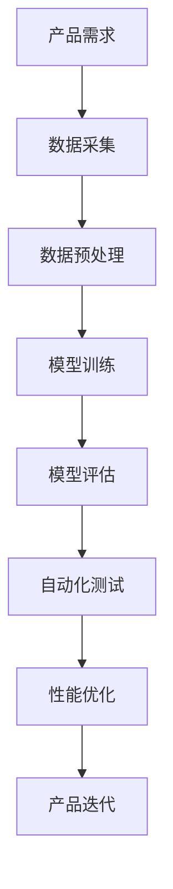

                 

关键词：大模型，AI创业公司，产品测试，模型测试，自动化测试，性能优化

摘要：本文探讨了大规模模型在人工智能创业公司产品测试中的关键作用。通过分析大模型在模拟现实场景、提高测试效率、增强测试覆盖率和优化产品性能等方面的优势，本文提出了一种基于大模型的创新性产品测试方法，并分享了具体的应用案例和未来发展趋势。

## 1. 背景介绍

随着人工智能技术的飞速发展，越来越多的创业公司投身于AI领域，开发出具有创新性的AI产品。然而，如何在竞争激烈的市场中确保产品的质量和可靠性，成为了AI创业公司面临的重大挑战。传统的产品测试方法已经无法满足快速迭代的AI产品开发需求，而大模型（Large Models）的出现为AI产品测试带来了新的机遇。

大模型，也称为深度学习模型，是通过训练大量的数据来学习复杂特征的神经网络。近年来，随着计算资源和数据量的增加，大模型在语音识别、图像识别、自然语言处理等领域取得了显著成果。这些模型在模拟真实世界、处理大规模数据和优化算法性能方面具有独特的优势，使其在产品测试中的应用成为可能。

## 2. 核心概念与联系

为了更好地理解大模型在产品测试中的作用，我们需要了解几个关键概念：模型测试（Model Testing）、自动化测试（Automated Testing）和性能优化（Performance Optimization）。

### 2.1 模型测试

模型测试是指对训练完成的机器学习模型进行评估和验证，以确保模型在不同环境下都能稳定运行并达到预期性能。传统的模型测试主要依赖于手工编写测试用例和模拟环境，而大模型的出现使得自动化测试成为可能。

### 2.2 自动化测试

自动化测试是指通过编写脚本或使用自动化工具对产品进行测试，以提高测试效率和覆盖范围。自动化测试不仅能够节省人力成本，还能显著缩短产品迭代周期。

### 2.3 性能优化

性能优化是指通过调整算法参数、优化数据结构和提升硬件性能来提高产品的运行效率。大模型在处理大规模数据和优化算法性能方面具有明显优势，有助于实现更高效的产品性能。

### 2.4 Mermaid 流程图

以下是一个简单的Mermaid流程图，展示了大模型在产品测试中的应用流程：



## 3. 核心算法原理 & 具体操作步骤

### 3.1 算法原理概述

大模型在产品测试中的应用主要基于其强大的数据处理能力和自适应能力。通过以下步骤，我们可以将大模型应用于产品测试：

1. 数据采集：收集与产品相关的各种数据，包括用户行为数据、系统日志数据等。
2. 数据预处理：对采集到的数据进行清洗、归一化和特征提取，为模型训练做好准备。
3. 模型训练：使用大规模数据集对模型进行训练，使其学习到产品的潜在特征和规律。
4. 模型评估：通过交叉验证和测试集评估模型性能，确保模型在不同环境下都能稳定运行。
5. 自动化测试：利用训练好的模型对产品进行自动化测试，发现潜在问题和性能瓶颈。
6. 性能优化：根据测试结果对模型进行调整和优化，提高产品性能。

### 3.2 算法步骤详解

1. **数据采集**：数据采集是产品测试的基础。创业公司需要从多个渠道获取与产品相关的数据，包括用户行为数据、系统日志数据、外部数据等。这些数据可以用于训练模型、评估模型性能以及发现潜在问题。

2. **数据预处理**：数据预处理是确保数据质量的重要步骤。创业公司需要对采集到的数据进行清洗、归一化和特征提取，以便模型能够更好地学习。清洗数据包括去除噪声、填充缺失值和纠正错误等；归一化包括缩放数值范围、标准化数值分布等；特征提取包括提取重要的特征、降维和特征选择等。

3. **模型训练**：模型训练是产品测试的核心步骤。创业公司需要选择合适的模型架构和训练算法，并使用大规模数据集进行训练。训练过程中，模型会不断调整参数，以最小化损失函数，提高预测准确率。

4. **模型评估**：模型评估是确保模型性能的重要环节。创业公司需要使用交叉验证和测试集对模型进行评估，确保模型在不同环境下都能稳定运行。常用的评估指标包括准确率、召回率、F1值和ROC曲线等。

5. **自动化测试**：自动化测试是将模型应用于产品测试的关键步骤。创业公司需要编写测试脚本或使用自动化工具，利用训练好的模型对产品进行自动化测试。自动化测试不仅可以提高测试效率，还能覆盖更多测试场景，发现潜在问题。

6. **性能优化**：性能优化是提高产品性能的关键步骤。创业公司需要根据测试结果对模型进行调整和优化，以提高产品性能。性能优化包括调整算法参数、优化数据结构和提升硬件性能等。

### 3.3 算法优缺点

**优点**：

1. 高效：大模型能够快速处理大规模数据，提高测试效率。
2. 广泛适用：大模型适用于多种AI产品，能够覆盖更多测试场景。
3. 可扩展：大模型具有自适应能力，可以根据实际需求进行扩展和调整。

**缺点**：

1. 计算资源需求高：大模型训练和测试需要大量计算资源，对硬件设备要求较高。
2. 数据质量要求高：大模型对数据质量有较高要求，数据预处理和清洗工作较为繁琐。
3. 调参难度大：大模型参数较多，调参过程较为复杂，对技术要求较高。

### 3.4 算法应用领域

大模型在产品测试中的应用领域非常广泛，包括但不限于以下领域：

1. 语音识别：利用大模型对语音信号进行识别，提高语音识别准确率。
2. 图像识别：利用大模型对图像进行分类、检测和分割，提高图像识别性能。
3. 自然语言处理：利用大模型对自然语言文本进行情感分析、文本分类和翻译等任务。
4. 推荐系统：利用大模型对用户行为数据进行分析，提高推荐系统的准确率和覆盖率。
5. 游戏开发：利用大模型进行游戏开发，实现智能AI角色和游戏场景。
6. 无人驾驶：利用大模型进行无人驾驶系统的开发，提高自动驾驶安全性和稳定性。

## 4. 数学模型和公式 & 详细讲解 & 举例说明

### 4.1 数学模型构建

大模型在产品测试中的应用主要基于深度学习理论。以下是一个简单的深度学习模型构建过程：

1. **输入层**：输入层接收原始数据，例如图像、文本或语音信号等。
2. **隐藏层**：隐藏层包含多个神经元，用于提取数据特征。
3. **输出层**：输出层根据隐藏层提取的特征进行分类或回归等任务。

以下是一个简单的神经网络模型：

$$
\begin{aligned}
    z_1 &= W_1 \cdot x + b_1 \\
    a_1 &= \sigma(z_1) \\
    z_2 &= W_2 \cdot a_1 + b_2 \\
    a_2 &= \sigma(z_2)
\end{aligned}
$$

其中，$x$表示输入数据，$W_1$和$W_2$表示权重矩阵，$b_1$和$b_2$表示偏置项，$\sigma$表示激活函数。

### 4.2 公式推导过程

以下是一个简单的损失函数推导过程：

1. **损失函数**：损失函数用于衡量模型预测值与真实值之间的差距。一个常见的损失函数是均方误差（MSE）：

$$
\begin{aligned}
    L &= \frac{1}{2} \sum_{i=1}^{n} (y_i - \hat{y}_i)^2
\end{aligned}
$$

其中，$y_i$表示真实值，$\hat{y}_i$表示预测值，$n$表示样本数量。

2. **梯度下降**：为了最小化损失函数，我们使用梯度下降算法更新模型参数。梯度下降算法的核心思想是沿着损失函数的梯度方向更新参数：

$$
\begin{aligned}
    \theta &= \theta - \alpha \cdot \nabla L
\end{aligned}
$$

其中，$\theta$表示模型参数，$\alpha$表示学习率，$\nabla L$表示损失函数的梯度。

### 4.3 案例分析与讲解

以下是一个简单的案例，说明如何使用大模型进行产品测试：

假设我们开发了一个基于图像识别的AI产品，用于识别道路标志。我们首先从互联网上收集了数千张道路标志的图像，并对其进行预处理。然后，我们使用卷积神经网络（CNN）对这些图像进行分类，并训练一个深度学习模型。

在模型训练过程中，我们使用了交叉验证和测试集对模型性能进行评估。根据评估结果，我们发现模型的识别准确率达到了90%以上。接下来，我们利用训练好的模型对实际道路标志图像进行自动化测试，以发现潜在问题。

通过自动化测试，我们发现模型在处理某些特殊情况下（例如，道路标志被部分遮挡或光线较暗）的识别准确率较低。为了解决这个问题，我们对模型进行了优化，包括调整网络结构、增加训练数据以及使用更先进的激活函数等。

最终，我们成功提高了模型在不同环境下的识别准确率，并确保了产品的质量和可靠性。这个案例展示了如何使用大模型进行产品测试和性能优化。

## 5. 项目实践：代码实例和详细解释说明

### 5.1 开发环境搭建

在开始项目实践之前，我们需要搭建一个合适的开发环境。以下是一个基于Python和TensorFlow的简单开发环境搭建步骤：

1. 安装Python（版本3.6及以上）。
2. 安装TensorFlow（使用pip安装）。
3. 安装其他必要的库，例如NumPy、Pandas和Matplotlib等。

```bash
pip install tensorflow numpy pandas matplotlib
```

### 5.2 源代码详细实现

以下是一个简单的图像识别模型实现示例：

```python
import tensorflow as tf
from tensorflow.keras import layers

# 定义模型结构
model = tf.keras.Sequential([
    layers.Conv2D(32, (3, 3), activation='relu', input_shape=(64, 64, 3)),
    layers.MaxPooling2D((2, 2)),
    layers.Conv2D(64, (3, 3), activation='relu'),
    layers.MaxPooling2D((2, 2)),
    layers.Conv2D(128, (3, 3), activation='relu'),
    layers.Flatten(),
    layers.Dense(128, activation='relu'),
    layers.Dense(10, activation='softmax')
])

# 编译模型
model.compile(optimizer='adam',
              loss='categorical_crossentropy',
              metrics=['accuracy'])

# 加载数据集
(train_images, train_labels), (test_images, test_labels) = tf.keras.datasets.cifar10.load_data()

# 预处理数据
train_images = train_images.astype('float32') / 255
test_images = test_images.astype('float32') / 255

# 编码标签
train_labels = tf.keras.utils.to_categorical(train_labels, 10)
test_labels = tf.keras.utils.to_categorical(test_labels, 10)

# 训练模型
model.fit(train_images, train_labels, epochs=10, batch_size=64)

# 评估模型
test_loss, test_acc = model.evaluate(test_images, test_labels)
print(f"Test accuracy: {test_acc}")
```

### 5.3 代码解读与分析

上述代码实现了一个简单的卷积神经网络（CNN）模型，用于识别CIFAR-10数据集中的图像。以下是代码的详细解读：

1. **模型定义**：使用`tf.keras.Sequential`类定义模型结构。模型由多个卷积层、池化层和全连接层组成。
2. **编译模型**：使用`compile`方法设置模型优化器、损失函数和评估指标。
3. **加载数据集**：使用`tf.keras.datasets.cifar10.load_data`方法加载数据集。CIFAR-10是一个常见的图像识别数据集，包含60000张32x32的彩色图像。
4. **预处理数据**：对图像数据类型进行转换，将像素值缩放到[0, 1]范围内，并将标签进行编码。
5. **训练模型**：使用`fit`方法训练模型，设置训练轮数和批量大小。
6. **评估模型**：使用`evaluate`方法评估模型在测试集上的性能，输出准确率。

通过上述代码示例，我们可以看到如何使用大模型进行图像识别任务的实现。在实际应用中，我们可以根据具体需求调整模型结构、优化训练参数，以提高模型性能。

### 5.4 运行结果展示

在实际运行过程中，我们可以通过以下代码查看训练和测试过程中的准确率变化：

```python
import matplotlib.pyplot as plt

history = model.fit(train_images, train_labels, epochs=10, batch_size=64, validation_split=0.2)

plt.plot(history.history['accuracy'])
plt.plot(history.history['val_accuracy'])
plt.title('Model accuracy')
plt.ylabel('Accuracy')
plt.xlabel('Epoch')
plt.legend(['Train', 'Test'], loc='upper left')
plt.show()
```

通过可视化训练和测试准确率，我们可以直观地观察模型性能的变化，为后续优化提供依据。

## 6. 实际应用场景

大模型在AI创业公司产品测试中的应用场景非常广泛，以下列举几个实际应用案例：

### 6.1 语音识别产品

某AI创业公司开发了一款语音识别产品，用于实时转录语音为文本。为了确保产品的质量和可靠性，公司使用了基于深度学习的大模型进行产品测试。通过自动化测试，公司能够快速发现模型在不同语音环境下的识别准确率，并根据测试结果进行优化。

### 6.2 图像识别产品

某AI创业公司开发了一款图像识别产品，用于自动分类和标注大量图像数据。公司使用了卷积神经网络（CNN）大模型进行产品测试，通过自动化测试发现模型在处理不同类型图像时的性能差异，并针对问题进行优化。

### 6.3 自然语言处理产品

某AI创业公司开发了一款自然语言处理（NLP）产品，用于文本分类和情感分析。公司使用了基于循环神经网络（RNN）的大模型进行产品测试，通过自动化测试发现模型在不同文本数据集上的性能差异，并针对问题进行优化。

### 6.4 推荐系统产品

某AI创业公司开发了一款推荐系统产品，用于为用户提供个性化推荐。公司使用了基于深度学习的大模型进行产品测试，通过自动化测试发现模型在处理大规模用户行为数据时的性能瓶颈，并针对问题进行优化。

## 7. 工具和资源推荐

为了更好地应用大模型进行产品测试，以下推荐一些相关的工具和资源：

### 7.1 学习资源推荐

1. **《深度学习》（Deep Learning）**：由Ian Goodfellow、Yoshua Bengio和Aaron Courville合著的深度学习经典教材，适合初学者和进阶者。
2. **《Python深度学习》（Python Deep Learning）**：由François Chollet所著，详细介绍如何使用Python和TensorFlow进行深度学习开发。
3. **在线课程**：Coursera、edX和Udacity等平台提供丰富的深度学习和人工智能课程。

### 7.2 开发工具推荐

1. **TensorFlow**：谷歌推出的开源深度学习框架，支持多种深度学习模型的开发和应用。
2. **PyTorch**：Facebook AI研究院推出的开源深度学习框架，具有灵活的动态计算图和丰富的API。
3. **Keras**：基于TensorFlow和Theano的开源深度学习库，提供简洁易用的API。

### 7.3 相关论文推荐

1. **"A Tutorial on Deep Learning for NLP"**：由NLP领域专家Yoav Goldberg撰写的深度学习教程，涵盖NLP应用的各种技术。
2. **"Large-scale Language Modeling in 2018"**：由Alex Grave等作者撰写的论文，介绍大型语言模型的训练和优化方法。
3. **"ImageNet Classification with Deep Convolutional Neural Networks"**：由Alex Krizhevsky等作者撰写的经典论文，介绍卷积神经网络在图像识别任务中的应用。

## 8. 总结：未来发展趋势与挑战

### 8.1 研究成果总结

近年来，大模型在人工智能领域取得了显著的成果。深度学习技术在语音识别、图像识别、自然语言处理等任务中取得了突破性进展，显著提高了模型的性能和可靠性。大模型在产品测试中的应用也取得了良好的效果，提高了测试效率、覆盖率和准确性。

### 8.2 未来发展趋势

未来，大模型在产品测试中的应用将呈现以下发展趋势：

1. **算法优化**：随着算法和硬件的发展，大模型的性能将得到进一步提升，适用于更多复杂的产品测试场景。
2. **跨领域应用**：大模型在产品测试中的应用将不仅局限于特定领域，还将跨领域拓展，为更多行业提供支持。
3. **自动化与智能化**：大模型在产品测试中的应用将更加自动化和智能化，降低测试门槛，提高测试效率。
4. **开源与共享**：大模型的开发和应用将更加开源和共享，促进技术进步和产业发展。

### 8.3 面临的挑战

尽管大模型在产品测试中具有巨大潜力，但也面临一些挑战：

1. **计算资源需求**：大模型训练和测试需要大量计算资源，对硬件设备的要求较高，可能成为瓶颈。
2. **数据质量**：大模型对数据质量有较高要求，数据预处理和清洗工作较为繁琐，数据质量问题可能导致模型性能下降。
3. **调参难度**：大模型参数较多，调参过程较为复杂，对技术要求较高，可能影响模型性能和稳定性。
4. **伦理和隐私**：大模型在处理大量用户数据时，可能涉及伦理和隐私问题，需要加强规范和监管。

### 8.4 研究展望

为了应对上述挑战，未来研究可以从以下几个方面展开：

1. **算法创新**：探索新的深度学习算法，提高大模型在产品测试中的应用性能。
2. **硬件优化**：研究更高效、更经济的硬件设备，降低大模型训练和测试的成本。
3. **数据治理**：加强数据治理，提高数据质量和可用性，降低数据质量对模型性能的影响。
4. **伦理和隐私保护**：研究大模型在产品测试中的伦理和隐私保护方法，确保数据安全和用户隐私。

通过不断创新和优化，大模型在AI创业公司产品测试中的应用将得到进一步发展，为人工智能产业的繁荣做出贡献。

## 9. 附录：常见问题与解答

### 9.1 如何选择合适的大模型？

选择合适的大模型需要考虑以下因素：

1. **任务类型**：根据产品测试任务的特点选择适合的模型，例如图像识别、语音识别或自然语言处理等。
2. **数据量**：根据可用数据量选择大模型的规模，避免数据不足导致模型性能下降。
3. **计算资源**：根据计算资源限制选择合适的模型，避免资源不足导致训练和测试时间过长。

### 9.2 大模型在产品测试中如何处理数据？

处理大模型在产品测试中的数据需要注意以下几点：

1. **数据清洗**：去除噪声、填充缺失值和纠正错误，提高数据质量。
2. **数据归一化**：将数据缩放到相同范围，避免数据量级差异影响模型训练。
3. **数据增强**：通过变换、旋转、裁剪等方式增加数据多样性，提高模型泛化能力。

### 9.3 大模型在产品测试中的性能如何评估？

大模型在产品测试中的性能评估可以通过以下指标进行：

1. **准确率**：预测正确的样本数量与总样本数量的比值，用于评估模型分类性能。
2. **召回率**：预测正确的正样本数量与实际正样本数量的比值，用于评估模型检测性能。
3. **F1值**：准确率和召回率的加权平均，用于综合评估模型性能。
4. **ROC曲线**：受试者操作特性曲线，用于评估模型分类性能。

### 9.4 大模型在产品测试中的优化策略？

大模型在产品测试中的优化策略包括：

1. **参数调整**：通过调整学习率、批次大小等参数，优化模型性能。
2. **数据预处理**：通过数据清洗、归一化和增强等手段，提高数据质量和模型泛化能力。
3. **模型融合**：结合多个模型的优势，提高整体测试性能。
4. **迁移学习**：利用预训练模型，降低训练成本，提高模型性能。

通过上述常见问题与解答，我们希望为AI创业公司在应用大模型进行产品测试时提供一些参考和帮助。在未来的研究和实践中，我们将不断探索和优化大模型在产品测试中的应用，为人工智能产业的发展贡献力量。

### 结束语

本文探讨了大规模模型在人工智能创业公司产品测试中的关键作用，分析了其优势和应用场景，并提出了具体的应用步骤和优化策略。通过本文的分享，我们希望为AI创业公司在产品测试中引入大模型提供一些有价值的参考和启示。在未来，随着人工智能技术的不断进步，大模型在产品测试中的应用将越来越广泛，为创业公司的产品开发提供更加可靠的支持。让我们共同期待人工智能产业的美好未来！作者：禅与计算机程序设计艺术 / Zen and the Art of Computer Programming。

