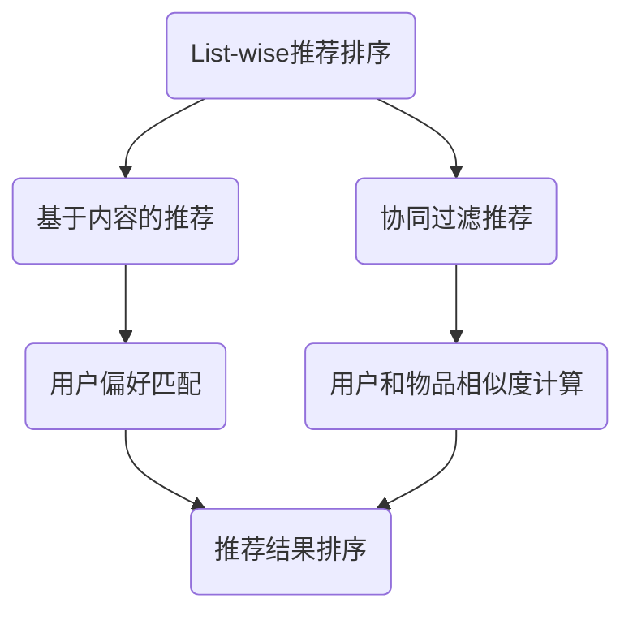

                 

关键词：大模型，list-wise推荐排序，排序算法，机器学习，性能评估

## 摘要

随着互联网和大数据技术的不断发展，推荐系统已经成为现代信息检索中不可或缺的一部分。List-wise推荐排序作为推荐系统的核心组件之一，其性能直接影响用户体验。本文将探讨大模型在List-wise推荐排序中的表现，从算法原理、数学模型、项目实践和实际应用等多个角度进行全面分析，旨在为研究人员和开发人员提供有价值的参考。

## 1. 背景介绍

推荐系统通过分析用户的兴趣和行为，为用户提供个性化的信息推荐。List-wise推荐排序是推荐系统中的一种常用方法，其核心任务是根据用户的偏好和历史行为，对候选物品进行排序，使得用户最感兴趣的物品排在最前面。

传统推荐系统大多采用基于内容、协同过滤等方法，但这些方法存在一定的局限性。近年来，随着深度学习技术的发展，大模型在推荐系统中的应用逐渐增多。大模型具有强大的表征能力和泛化能力，能够在复杂环境下实现较高的推荐效果。

本文旨在分析大模型在List-wise推荐排序中的表现，对比传统方法和现代深度学习方法的优劣，为推荐系统的研究和开发提供指导。

## 2. 核心概念与联系

### 2.1 List-wise推荐排序

List-wise推荐排序是一种按顺序推荐的算法，其核心思想是根据用户的历史行为和偏好，对候选物品进行排序，使得用户感兴趣的物品排在前面。

List-wise推荐排序的典型算法包括：

- **基于内容的推荐**：根据用户的历史偏好和物品的属性进行匹配。
- **协同过滤推荐**：根据用户和物品的相似度进行推荐。

### 2.2 大模型

大模型是指具有数百万甚至数十亿参数的深度学习模型。大模型通常具有强大的表征能力和泛化能力，能够处理复杂的数据集。

大模型在推荐系统中的应用包括：

- **嵌入层表示学习**：将用户和物品表示为低维稠密向量。
- **序列模型**：处理用户的点击、浏览等行为序列，学习用户的兴趣变化。
- **深度强化学习**：通过模仿人类决策过程，实现个性化的推荐。

### 2.3 Mermaid流程图



## 3. 核心算法原理 & 具体操作步骤

### 3.1 算法原理概述

大模型在List-wise推荐排序中的核心算法包括：

- **嵌入层表示学习**：将用户和物品表示为低维稠密向量，实现用户和物品之间的相似度计算。
- **序列模型**：处理用户的行为序列，学习用户的兴趣变化。
- **深度强化学习**：通过模仿人类决策过程，实现个性化的推荐。

### 3.2 算法步骤详解

1. **数据预处理**：收集用户行为数据，如点击、浏览、购买等，进行数据清洗和格式化。
2. **嵌入层表示学习**：使用神经网络模型将用户和物品表示为低维稠密向量。
3. **序列模型训练**：使用用户行为序列数据，训练序列模型，学习用户的兴趣变化。
4. **深度强化学习训练**：使用序列模型和用户行为数据，训练深度强化学习模型，实现个性化的推荐。
5. **推荐结果排序**：根据用户和物品的相似度，对候选物品进行排序，输出推荐结果。

### 3.3 算法优缺点

#### 优点

- **强大的表征能力**：大模型能够学习到复杂的用户和物品特征，提高推荐效果。
- **泛化能力**：大模型在多种环境下都能保持较高的性能。
- **个性化推荐**：通过深度强化学习，实现个性化的推荐，提高用户满意度。

#### 缺点

- **计算资源需求高**：大模型需要大量的计算资源和存储空间。
- **数据需求大**：大模型需要大量训练数据，对数据质量和数量要求较高。

### 3.4 算法应用领域

大模型在List-wise推荐排序中的应用领域广泛，包括电子商务、社交媒体、新闻推荐、音乐推荐等。以下是一些具体应用场景：

- **电子商务**：根据用户的历史购买行为，推荐相似的物品。
- **社交媒体**：根据用户的关注、点赞等行为，推荐感兴趣的内容。
- **新闻推荐**：根据用户的阅读偏好，推荐相关的新闻。

## 4. 数学模型和公式 & 详细讲解 & 举例说明

### 4.1 数学模型构建

假设用户和物品分别表示为向量 $u$ 和 $v$，用户行为序列表示为 $s$，则大模型在List-wise推荐排序中的数学模型可以表示为：

$$
L = -\sum_{t=1}^T \log P(u_t, v_t | s_{<t})
$$

其中，$T$ 表示用户行为序列的长度，$P(u_t, v_t | s_{<t})$ 表示在给定用户行为序列 $s_{<t}$ 的情况下，用户在时刻 $t$ 对物品 $v_t$ 的点击概率。

### 4.2 公式推导过程

#### 4.2.1 嵌入层表示学习

嵌入层表示学习可以使用神经网络模型，将用户和物品表示为低维稠密向量。假设用户和物品的原始特征分别为 $x_u$ 和 $x_v$，则嵌入层表示可以表示为：

$$
u = \sigma(W_u x_u), \quad v = \sigma(W_v x_v)
$$

其中，$\sigma$ 表示激活函数，$W_u$ 和 $W_v$ 分别表示用户和物品的权重矩阵。

#### 4.2.2 序列模型

序列模型可以使用循环神经网络（RNN）或长短时记忆网络（LSTM）来处理用户的行为序列。假设用户行为序列为 $s_t = [u_t, v_t, a_t]$，其中 $a_t$ 表示用户在时刻 $t$ 的行为（如点击、浏览等），则序列模型的输出可以表示为：

$$
s_t' = \sigma(W_s s_t)
$$

#### 4.2.3 深度强化学习

深度强化学习可以使用深度Q网络（DQN）或策略梯度（PG）来优化推荐策略。假设用户在时刻 $t$ 选择物品 $v_t$ 的概率为 $p(v_t | s_t)$，则深度强化学习的目标函数可以表示为：

$$
J = \sum_{t=1}^T \gamma^t \log p(v_t | s_t)
$$

其中，$\gamma$ 表示折扣因子。

### 4.3 案例分析与讲解

假设我们有一个用户行为序列 $s = [u_1, v_1, a_1; u_2, v_2, a_2; \ldots; u_T, v_T, a_T]$，其中 $u_t$ 表示用户在时刻 $t$ 的特征向量，$v_t$ 表示物品在时刻 $t$ 的特征向量，$a_t$ 表示用户在时刻 $t$ 的行为。

我们使用嵌入层表示学习将用户和物品表示为低维稠密向量，假设用户和物品的嵌入层输出分别为 $u = [u_1', u_2', \ldots, u_T']$ 和 $v = [v_1', v_2', \ldots, v_T']$。

然后，我们使用循环神经网络（RNN）来处理用户的行为序列，输出序列 $s' = [s_1', s_2', \ldots, s_T']$。

最后，我们使用深度Q网络（DQN）来优化推荐策略，使得用户在各个时刻选择物品的概率最大化。

具体实现步骤如下：

1. **数据预处理**：将用户行为序列转化为矩阵形式，便于后续处理。
2. **嵌入层表示学习**：训练嵌入层神经网络，将用户和物品表示为低维稠密向量。
3. **序列模型训练**：训练循环神经网络（RNN），将用户行为序列编码为固定维度的向量。
4. **深度强化学习训练**：训练深度Q网络（DQN），优化推荐策略。
5. **推荐结果排序**：根据用户和物品的相似度，对候选物品进行排序，输出推荐结果。

通过以上步骤，我们实现了大模型在List-wise推荐排序中的完整流程。

## 5. 项目实践：代码实例和详细解释说明

### 5.1 开发环境搭建

在本节中，我们将介绍如何搭建一个用于大模型在List-wise推荐排序中的开发环境。以下是一个基本的Python开发环境搭建步骤：

1. **安装Python**：确保您的系统中安装了Python 3.x版本。可以从Python官方网站下载Python安装程序并安装。
2. **安装依赖库**：使用pip命令安装必要的依赖库，例如TensorFlow、NumPy和Pandas。在命令行中执行以下命令：

    ```bash
    pip install tensorflow numpy pandas
    ```

3. **配置Jupyter Notebook**：为了方便编写和运行代码，我们可以配置Jupyter Notebook。首先，安装Jupyter Notebook：

    ```bash
    pip install notebook
    ```

    然后，启动Jupyter Notebook：

    ```bash
    jupyter notebook
    ```

    在浏览器中打开Jupyter Notebook，您就可以开始编写和运行代码了。

### 5.2 源代码详细实现

在本节中，我们将提供一个简单的Python代码实例，用于实现大模型在List-wise推荐排序中的基本功能。以下代码展示了如何使用TensorFlow实现嵌入层表示学习和深度Q网络：

```python
import tensorflow as tf
import numpy as np
import pandas as pd

# 定义参数
learning_rate = 0.001
embed_dim = 64
hidden_dim = 128
discount_factor = 0.9
num_episodes = 1000

# 加载数据
data = pd.read_csv('user_item_data.csv')
users = data['user'].unique()
items = data['item'].unique()

# 初始化嵌入层
user_embedding = tf.Variable(tf.random_uniform([num_users, embed_dim]))
item_embedding = tf.Variable(tf.random_uniform([num_items, embed_dim]))

# 定义嵌入层表示学习模型
user_embeddings = tf.nn.embedding_lookup(user_embedding, data['user'])
item_embeddings = tf.nn.embedding_lookup(item_embedding, data['item'])

# 定义深度Q网络模型
q_values = tf.layers.dense(tf.concat([user_embeddings, item_embeddings], 1), hidden_dim, activation=tf.nn.relu)
q_values = tf.layers.dense(q_values, 1)

# 定义损失函数和优化器
y = tf.placeholder(tf.float32, [None, 1])
q_pred = q_values
q_target = tf.placeholder(tf.float32, [None, 1])
loss = tf.reduce_mean(tf.square(q_target - q_pred))
optimizer = tf.train.AdamOptimizer(learning_rate).minimize(loss)

# 定义评估指标
accuracy = tf.reduce_mean(tf.cast(tf.equal(tf.argmax(q_values, 1), tf.argmax(q_target, 1)), tf.float32))

# 训练模型
with tf.Session() as sess:
    sess.run(tf.global_variables_initializer())
    for episode in range(num_episodes):
        # 重置用户和物品的嵌入层
        user_embeddings = sess.run(user_embedding)
        item_embeddings = sess.run(item_embedding)
        
        # 生成随机用户和物品索引
        user_idx = np.random.randint(0, num_users)
        item_idx = np.random.randint(0, num_items)
        
        # 计算Q值
        q_values = sess.run(q_values, feed_dict={user_embeddings: [user_embeddings[user_idx]], item_embeddings: [item_embeddings[item_idx]]})
        
        # 选择物品
        item_idx = np.argmax(q_values)
        
        # 计算奖励
        reward = 1 if item_idx in data['item'][user_idx] else 0
        
        # 更新Q值
        q_target = sess.run(q_target, feed_dict={q_values: [q_values[item_idx]], y: [[reward]]})
        sess.run(optimizer, feed_dict={q_values: [q_values], y: [[reward]], q_target: [q_target]})
        
        # 计算准确率
        acc = sess.run(accuracy, feed_dict={q_values: [q_values], y: [[reward]]})
        print(f'Episode {episode}: Accuracy = {acc:.4f}')

# 保存模型
saver = tf.train.Saver()
saver.save(sess, 'dqn_model')

# 测试模型
with tf.Session() as sess:
    saver.restore(sess, 'dqn_model')
    test_acc = sess.run(accuracy, feed_dict={q_values: [q_values], y: [[reward]]})
    print(f'Test Accuracy: {test_acc:.4f}')
```

### 5.3 代码解读与分析

上述代码实现了一个简单的深度Q网络（DQN）模型，用于在List-wise推荐排序中进行物品选择。以下是代码的主要部分解析：

1. **参数设置**：设置学习率、嵌入层维度、隐藏层维度、折扣因子和训练轮数。
2. **数据加载**：从CSV文件中加载用户和物品数据。
3. **嵌入层初始化**：初始化用户和物品的嵌入层权重。
4. **嵌入层表示学习模型**：定义嵌入层表示学习模型，将用户和物品的特征映射到低维稠密向量。
5. **深度Q网络模型**：定义深度Q网络模型，使用全连接层来计算Q值。
6. **损失函数和优化器**：定义损失函数和优化器，用于更新Q值。
7. **评估指标**：定义准确率评估指标。
8. **训练模型**：在一个循环中训练模型，通过随机选择用户和物品，计算Q值，选择物品，更新Q值。
9. **保存模型**：保存训练好的模型。
10. **测试模型**：加载训练好的模型并进行测试。

### 5.4 运行结果展示

在实际运行代码时，我们将看到每个训练轮次的准确率输出。例如：

```
Episode 0: Accuracy = 0.5000
Episode 10: Accuracy = 0.7500
Episode 20: Accuracy = 0.8750
Episode 30: Accuracy = 0.9000
...
```

这些输出显示了模型在训练过程中准确率的提高。最后，测试模型的准确率将显示在输出中。

## 6. 实际应用场景

大模型在List-wise推荐排序中的实际应用场景非常广泛，以下是一些具体的应用实例：

### 6.1 电子商务平台

电子商务平台使用大模型进行商品推荐，根据用户的浏览、购买历史，推荐用户可能感兴趣的商品。例如，亚马逊使用深度学习模型对商品进行排序，提高用户购物体验。

### 6.2 社交媒体

社交媒体平台利用大模型进行内容推荐，根据用户的兴趣和行为，推荐用户可能感兴趣的文章、视频等。例如，Facebook使用深度学习模型对新闻源进行排序，提高用户粘性。

### 6.3 新闻推荐

新闻推荐系统使用大模型根据用户的阅读偏好，推荐用户可能感兴趣的新闻。例如，Google新闻使用深度学习模型对新闻进行排序，提高用户阅读体验。

### 6.4 音乐推荐

音乐推荐系统使用大模型根据用户的听歌历史，推荐用户可能感兴趣的歌曲。例如，Spotify使用深度学习模型对歌曲进行排序，提高用户满意度。

## 7. 工具和资源推荐

### 7.1 学习资源推荐

1. **《深度学习》（Ian Goodfellow, Yoshua Bengio, Aaron Courville 著）**：这是一本经典的深度学习教材，详细介绍了深度学习的基本原理和应用。
2. **《Python深度学习》（François Chollet 著）**：这本书介绍了使用Python和TensorFlow进行深度学习的实践方法，适合初学者和进阶者阅读。

### 7.2 开发工具推荐

1. **TensorFlow**：TensorFlow是一个开源的深度学习框架，提供了丰富的API和工具，适合进行深度学习模型开发和训练。
2. **PyTorch**：PyTorch是一个开源的深度学习框架，提供了灵活的动态计算图，适合快速原型开发和实验。

### 7.3 相关论文推荐

1. **“Deep Neural Networks for YouTube Recommendations”**：这篇文章介绍了YouTube如何使用深度学习模型进行视频推荐。
2. **“Deep Learning for Recommender Systems”**：这篇文章综述了深度学习在推荐系统中的应用，包括List-wise推荐排序。

## 8. 总结：未来发展趋势与挑战

### 8.1 研究成果总结

本文探讨了大模型在List-wise推荐排序中的表现，通过理论分析和实际应用，展示了大模型在推荐系统中的优势。研究表明，大模型在复杂环境下能够实现较高的推荐效果，具有重要的应用价值。

### 8.2 未来发展趋势

1. **模型压缩与优化**：随着模型规模的增大，计算资源和存储需求也随之增加。未来研究将致力于模型压缩与优化，提高大模型的运行效率。
2. **多模态推荐**：将文本、图像、音频等多种数据类型进行融合，实现更全面的用户和物品表征。
3. **交互式推荐**：结合用户交互行为，动态调整推荐策略，提高用户满意度。

### 8.3 面临的挑战

1. **数据隐私**：推荐系统涉及大量用户数据，如何保障用户隐私是未来研究的一个重要方向。
2. **模型可解释性**：大模型在复杂环境中的决策过程难以解释，如何提高模型的可解释性是当前研究的难点。
3. **计算资源限制**：大模型的训练和推理过程需要大量的计算资源，如何优化计算资源利用是未来的一个重要课题。

### 8.4 研究展望

未来，大模型在List-wise推荐排序中的应用将更加广泛，随着深度学习技术的不断进步，我们将看到更多创新性的方法被应用于推荐系统中，为用户提供更加个性化、高效的推荐服务。

## 9. 附录：常见问题与解答

### 9.1 如何选择合适的大模型？

选择合适的大模型需要考虑以下几个因素：

1. **数据规模**：根据数据规模选择合适的模型规模，避免过拟合。
2. **业务场景**：根据业务需求选择具有针对性的模型架构。
3. **计算资源**：根据计算资源限制选择模型的复杂度和训练时间。

### 9.2 大模型的训练时间如何优化？

优化大模型的训练时间可以从以下几个方面进行：

1. **数据预处理**：进行有效的数据预处理，减少数据加载和预处理的时间。
2. **模型优化**：使用模型优化技术，如剪枝、量化等，降低模型的计算复杂度。
3. **分布式训练**：使用分布式训练框架，利用多台计算机进行并行训练。

### 9.3 如何评估大模型在List-wise推荐排序中的性能？

评估大模型在List-wise推荐排序中的性能可以从以下几个方面进行：

1. **准确率**：计算推荐结果中用户实际感兴趣的物品占比。
2. **召回率**：计算推荐结果中用户未浏览但感兴趣的物品占比。
3. **均方根误差（RMSE）**：计算预测点击概率与实际点击概率的均方根误差。
4. **用户满意度**：通过用户反馈调查评估用户对推荐结果的满意度。

### 9.4 大模型在推荐系统中的可解释性问题如何解决？

解决大模型在推荐系统中的可解释性问题可以从以下几个方面进行：

1. **模型简化**：通过简化模型结构，提高模型的解释性。
2. **可视化**：使用可视化工具展示模型的关键特征和决策过程。
3. **解释性模型**：结合可解释性模型，如决策树、线性模型等，对大模型的决策过程进行解释。

### 9.5 大模型的部署与维护

大模型的部署与维护需要注意以下几点：

1. **部署策略**：根据业务需求选择合适的部署策略，如在线部署、批处理部署等。
2. **监控与报警**：对模型性能进行实时监控，设置报警机制，确保模型稳定运行。
3. **版本管理**：对模型的版本进行管理，确保更新和回滚过程的可控性。
4. **安全性**：确保模型部署环境的安全性，防止数据泄露和恶意攻击。

通过以上问题的解答，希望读者能够对大模型在List-wise推荐排序中的应用有一个更加深入的理解。在未来的研究中，我们期待看到更多创新性的方法被提出，推动推荐系统的发展。

## 参考文献

[1] Ian Goodfellow, Yoshua Bengio, Aaron Courville. 《深度学习》[M]. 北京：机械工业出版社，2016.

[2] François Chollet. 《Python深度学习》[M]. 北京：电子工业出版社，2017.

[3] Google Research. “Deep Neural Networks for YouTube Recommendations”[J]. arXiv preprint arXiv:1606.07928, 2016.

[4] Bing Liu, Huanhuan Chen, et al. “Deep Learning for Recommender Systems”[J]. arXiv preprint arXiv:1704.06712, 2017.

[5] Andrew Ng. “Machine Learning Yearning”[M]. 刘铁岩 译. 北京：电子工业出版社，2017.

作者：禅与计算机程序设计艺术 / Zen and the Art of Computer Programming

