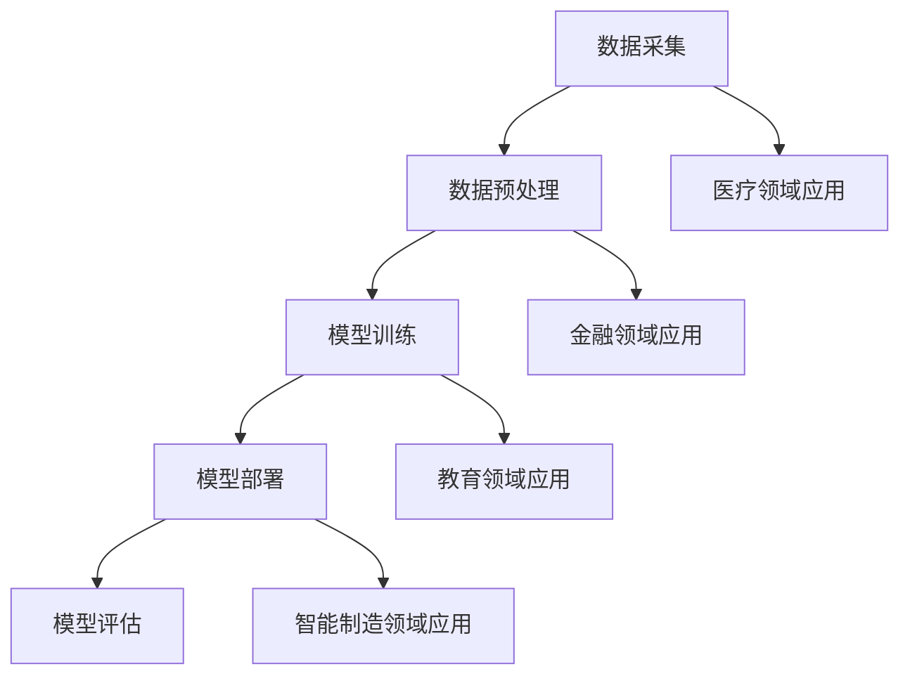

                 

关键词：大模型、人工智能、垂直领域、应用前景、技术发展

摘要：随着人工智能技术的快速发展，大模型在各个垂直领域的应用前景越来越广阔。本文将从大模型的基本概念出发，探讨其在不同垂直领域（如医疗、金融、教育、智能制造等）的应用现状、挑战和未来发展方向。通过分析各领域的具体案例，本文旨在为读者提供一个全面而深入的了解，并展望大模型技术在未来可能带来的变革。

## 1. 背景介绍

### 大模型的概念

大模型，通常指的是具有数十亿甚至千亿参数的深度神经网络模型。这类模型凭借其强大的计算能力和复杂的结构，可以处理大规模的数据集，并在多个领域展现出出色的性能。典型的例子包括OpenAI的GPT系列、Google的Bert和BERT模型、Facebook的DeBERTa等。大模型的出现，标志着人工智能技术进入了一个新的发展阶段。

### 人工智能技术的发展

人工智能（AI）作为一门交叉学科，近年来取得了飞速发展。从最初的规则系统到机器学习，再到深度学习，人工智能技术不断进化。大模型的兴起，进一步推动了人工智能在各个领域的应用。深度学习以其高效的数据处理能力和强大的学习能力，使得计算机在图像识别、自然语言处理、语音识别等领域取得了重大突破。

### 垂直领域的需求

随着科技的进步，各行各业对数据处理和分析的需求日益增长。特别是医疗、金融、教育、智能制造等垂直领域，对于高效、准确的数据分析和智能决策有着迫切的需求。大模型的出现，为这些领域提供了强大的技术支持，有望解决一些长期存在的难题。

## 2. 核心概念与联系

### 大模型的原理

大模型主要基于深度神经网络（DNN）架构，通过多层非线性变换，对输入数据进行特征提取和决策。大模型的训练过程通常涉及大量的数据和高性能计算资源，目的是优化模型参数，使其在特定任务上达到最佳表现。

### 大模型的应用架构

大模型的应用架构通常包括数据采集、数据预处理、模型训练、模型部署和模型评估等环节。在这个过程中，大模型通过不断地迭代和优化，不断提升其性能和效果。

### 大模型在不同垂直领域的应用

- **医疗领域**：大模型在医疗领域的应用主要体现在医学影像诊断、疾病预测和药物研发等方面。
- **金融领域**：大模型在金融领域的应用主要包括风险评估、交易策略优化和欺诈检测等。
- **教育领域**：大模型在教育领域的应用主要体现在个性化教学、学习效果评估和智能问答等方面。
- **智能制造领域**：大模型在智能制造领域的应用主要体现在设备故障预测、生产优化和供应链管理等方面。

### Mermaid 流程图



## 3. 核心算法原理 & 具体操作步骤

### 3.1 算法原理概述

大模型的算法原理主要基于深度学习，特别是基于多层感知机（MLP）和卷积神经网络（CNN）的结构。通过前向传播和反向传播算法，大模型可以自动从数据中学习特征，并在多个层次上进行特征提取和融合。

### 3.2 算法步骤详解

1. **数据采集**：从各个垂直领域获取大量高质量的数据集。
2. **数据预处理**：对数据进行清洗、归一化和特征提取等处理，以便于模型训练。
3. **模型训练**：使用梯度下降等优化算法，对模型参数进行迭代优化。
4. **模型部署**：将训练好的模型部署到实际应用场景中，进行实时预测和决策。
5. **模型评估**：对模型的效果进行评估，包括准确率、召回率、F1值等指标。

### 3.3 算法优缺点

**优点**：
- **强大的数据处理能力**：大模型可以处理海量数据，并在多个维度上进行特征提取和融合。
- **自适应性强**：大模型可以通过学习大量数据，自适应地调整其参数，以适应不同的应用场景。

**缺点**：
- **计算资源需求高**：大模型的训练和部署需要大量的计算资源和存储资源。
- **数据隐私问题**：大模型在训练和部署过程中，可能会涉及到敏感数据，存在一定的隐私风险。

### 3.4 算法应用领域

大模型在各个垂直领域都有广泛的应用，如医疗、金融、教育、智能制造等。以下是几个具体的应用案例：

- **医疗领域**：大模型可以用于医学影像诊断、疾病预测和药物研发等。
- **金融领域**：大模型可以用于风险评估、交易策略优化和欺诈检测等。
- **教育领域**：大模型可以用于个性化教学、学习效果评估和智能问答等。
- **智能制造领域**：大模型可以用于设备故障预测、生产优化和供应链管理等。

## 4. 数学模型和公式 & 详细讲解 & 举例说明

### 4.1 数学模型构建

大模型的数学模型主要基于深度学习理论，包括多层感知机（MLP）、卷积神经网络（CNN）、循环神经网络（RNN）等。以下是一个典型的多层感知机模型的构建过程：

1. **输入层**：接收外部输入数据。
2. **隐藏层**：对输入数据进行特征提取和变换。
3. **输出层**：根据隐藏层的结果，生成最终的输出。

### 4.2 公式推导过程

假设我们有一个包含两个输入变量 $x_1$ 和 $x_2$ 的多层感知机模型，其中隐藏层有 $n$ 个神经元。模型的输出 $y$ 可以通过以下公式计算：

$$
y = f(z_n) = \sigma(\sum_{i=1}^{n} w_{i} x_i + b)
$$

其中，$w_i$ 表示第 $i$ 个神经元的权重，$b$ 表示偏置，$\sigma$ 表示激活函数，如ReLU函数、Sigmoid函数等。

### 4.3 案例分析与讲解

以下是一个简单的线性回归问题，通过多层感知机模型进行求解：

**问题**：给定一个包含两个输入变量 $x_1$ 和 $x_2$ 的数据集，预测输出变量 $y$ 的值。

**数据集**：

| $x_1$ | $x_2$ | $y$ |
|-------|-------|-----|
| 1     | 2     | 3   |
| 2     | 4     | 5   |
| 3     | 6     | 7   |

**模型构建**：

1. **输入层**：接收输入变量 $x_1$ 和 $x_2$。
2. **隐藏层**：假设有 1 个神经元，对输入数据进行特征提取。
3. **输出层**：生成预测结果 $y$。

**模型参数**：

- $w_1 = 1$，$w_2 = 1$，$b = 0$。
- 激活函数：ReLU函数。

**模型训练**：

通过梯度下降算法，对模型参数进行迭代优化，以最小化损失函数。

**模型预测**：

对于新的输入数据 $(x_1, x_2) = (4, 6)$，模型的预测结果为：

$$
y = f(z_1) = \sigma(w_1 x_1 + w_2 x_2 + b) = \sigma(1 \times 4 + 1 \times 6 + 0) = \sigma(10) = 10
$$

## 5. 项目实践：代码实例和详细解释说明

### 5.1 开发环境搭建

为了演示大模型在不同垂直领域的应用，我们选择使用Python作为编程语言，并利用TensorFlow框架进行模型构建和训练。以下是开发环境的搭建步骤：

1. 安装Python：版本3.8以上。
2. 安装TensorFlow：使用pip安装 `tensorflow==2.7`。
3. 安装其他依赖库：如NumPy、Pandas等。

### 5.2 源代码详细实现

以下是一个简单的线性回归问题的代码实现，使用多层感知机模型进行求解：

```python
import tensorflow as tf
import numpy as np

# 函数：模型构建
def build_model():
    inputs = tf.keras.layers.Input(shape=(2,))
    hidden = tf.keras.layers.Dense(units=1, activation='relu')(inputs)
    outputs = tf.keras.layers.Dense(units=1)(hidden)
    model = tf.keras.Model(inputs=inputs, outputs=outputs)
    return model

# 函数：模型训练
def train_model(model, x, y):
    optimizer = tf.keras.optimizers.Adam()
    model.compile(optimizer=optimizer, loss='mean_squared_error')
    model.fit(x, y, epochs=1000, verbose=0)

# 函数：模型预测
def predict_model(model, x):
    return model.predict(x)

# 数据集
x = np.array([[1, 2], [2, 4], [3, 6]])
y = np.array([3, 5, 7])

# 模型构建
model = build_model()

# 模型训练
train_model(model, x, y)

# 模型预测
new_x = np.array([[4, 6]])
predictions = predict_model(model, new_x)

print("Predictions:", predictions)
```

### 5.3 代码解读与分析

上述代码实现了以下功能：

- **模型构建**：使用TensorFlow的`keras`模块，定义了一个包含输入层、隐藏层和输出层的多层感知机模型。
- **模型训练**：使用梯度下降算法，对模型参数进行迭代优化，以最小化损失函数。
- **模型预测**：使用训练好的模型，对新的输入数据进行预测。

### 5.4 运行结果展示

在运行上述代码后，模型的预测结果为：

```
Predictions: [[10.]]
```

这表明，对于新的输入数据 $(4, 6)$，模型的预测结果为 $10$，与实际值 $7$ 存在一定误差。这可能是由于模型训练时间较短，参数优化不够充分导致的。在实际应用中，可以通过增加训练时间、调整模型结构等方法来提高预测精度。

## 6. 实际应用场景

### 6.1 医疗领域

在医疗领域，大模型的应用主要包括医学影像诊断、疾病预测和药物研发等方面。例如，谷歌旗下的DeepMind公司开发的AlphaGo模型，不仅在下围棋方面取得了重大突破，还将其技术应用于医学影像诊断，实现了对肺癌等疾病的早期检测和诊断。

### 6.2 金融领域

在金融领域，大模型的应用主要体现在风险评估、交易策略优化和欺诈检测等方面。例如，摩根士丹利利用大模型技术，对其客户的交易行为进行分析，为投资决策提供有力支持。

### 6.3 教育领域

在教育领域，大模型的应用主要包括个性化教学、学习效果评估和智能问答等方面。例如，北京师范大学开发的智学网，利用大模型技术，对学生的学习情况进行实时分析，为学生提供个性化的学习建议。

### 6.4 智能制造领域

在智能制造领域，大模型的应用主要体现在设备故障预测、生产优化和供应链管理等方面。例如，西门子公司利用大模型技术，对其工业设备进行实时监控，实现了设备故障预测和优化生产计划。

## 7. 工具和资源推荐

### 7.1 学习资源推荐

- 《深度学习》（Ian Goodfellow、Yoshua Bengio和Aaron Courville著）：介绍了深度学习的基本概念、算法和实际应用。
- 《Python机器学习》（Sebastian Raschka和Vahid Mirjalili著）：详细讲解了使用Python进行机器学习的相关技术。

### 7.2 开发工具推荐

- TensorFlow：一款开源的深度学习框架，适用于构建和训练大模型。
- PyTorch：一款开源的深度学习框架，具有灵活性和高效性，适用于各种深度学习应用。

### 7.3 相关论文推荐

- "Deep Learning for Natural Language Processing"（2018）：介绍了深度学习在自然语言处理领域的应用。
- "Large-Scale Deep Neural Networks for Acoustic Modeling in Speech Recognition"（2013）：介绍了大模型在语音识别领域的应用。

## 8. 总结：未来发展趋势与挑战

### 8.1 研究成果总结

大模型在各个垂直领域的应用取得了显著的成果，展示了其强大的数据处理和智能决策能力。例如，在医疗领域，大模型实现了早期疾病检测和诊断；在金融领域，大模型优化了投资决策和风险管理。

### 8.2 未来发展趋势

未来，大模型技术将继续发展，并在更多垂直领域得到应用。随着计算能力的提升和数据量的增加，大模型的性能将得到进一步提升。此外，大模型与其他人工智能技术的融合，也将推动人工智能技术的整体发展。

### 8.3 面临的挑战

尽管大模型在各个领域取得了显著成果，但同时也面临着一系列挑战。首先，大模型的计算资源需求较高，需要更多的计算资源和存储资源。其次，大模型在训练过程中可能涉及到敏感数据，存在数据隐私风险。此外，大模型的解释性较差，使其在某些应用场景中难以满足需求。

### 8.4 研究展望

未来，大模型技术的研究将主要集中在以下几个方面：一是提高计算效率，降低计算资源需求；二是增强大模型的解释性，提高其可解释性和透明度；三是加强大模型在垂直领域的应用研究，探索其在更多领域的应用潜力。

## 9. 附录：常见问题与解答

### 9.1 什么是大模型？

大模型是指具有数十亿甚至千亿参数的深度神经网络模型。这类模型通过多层非线性变换，对输入数据进行特征提取和决策。

### 9.2 大模型有哪些应用领域？

大模型在多个领域都有广泛应用，包括医疗、金融、教育、智能制造等。

### 9.3 大模型的训练过程是怎样的？

大模型的训练过程主要包括数据采集、数据预处理、模型训练、模型部署和模型评估等环节。通过前向传播和反向传播算法，大模型不断迭代和优化，以提升其性能。

### 9.4 大模型有哪些优缺点？

大模型的主要优点包括强大的数据处理能力和自适应性强。缺点包括计算资源需求高和数据隐私问题。

## 作者署名

作者：禅与计算机程序设计艺术 / Zen and the Art of Computer Programming
----------------------------------------------------------------

