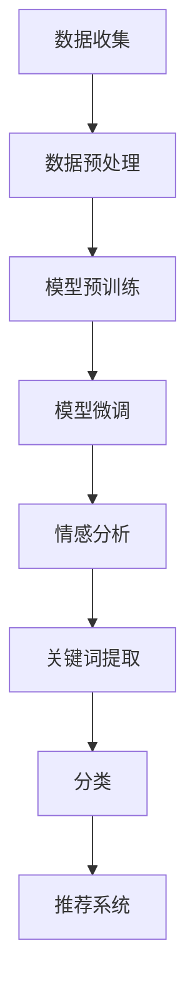
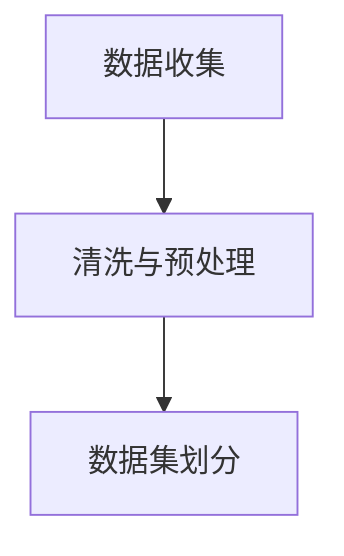
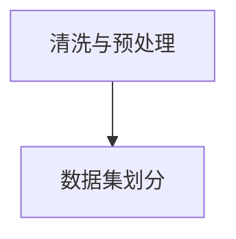
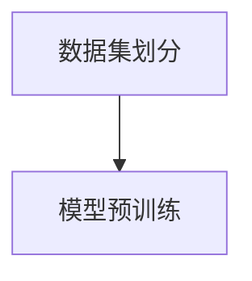
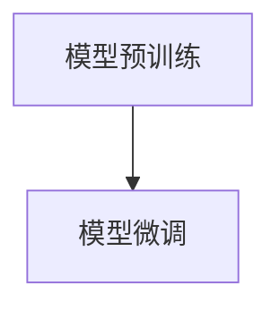
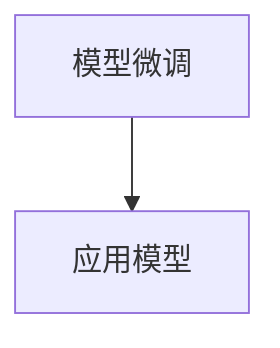

                 

在当今的电子商务时代，消费者的购买决策很大程度上受到商品评论的影响。因此，如何有效地挖掘和分析商品评论成为了企业提高竞争力、优化产品和服务的重要手段。近年来，随着人工智能技术的飞速发展，尤其是大规模预训练模型（Large-scale Pre-trained Models，简称LPMs）的出现，商品评论挖掘与分析领域迎来了前所未有的变革。

本文将深入探讨大模型在商品评论挖掘与分析中的应用，包括其背景介绍、核心概念与联系、核心算法原理与具体操作步骤、数学模型与公式、项目实践代码实例、实际应用场景、未来应用展望以及工具和资源推荐等。希望通过这篇文章，能够让读者对大模型在商品评论挖掘与分析中的潜在价值和应用前景有更深入的了解。

> **关键词：** 大规模预训练模型、商品评论、情感分析、文本挖掘、人工智能

> **摘要：** 本文首先介绍了大模型在商品评论挖掘与分析中的应用背景和核心概念，然后详细阐述了大规模预训练模型的基本原理、算法步骤及其优缺点，随后通过数学模型和项目实践对算法进行了深入讲解。最后，文章分析了大模型在商品评论挖掘与分析中的实际应用场景，探讨了其未来发展趋势和面临的挑战，并推荐了相关工具和资源。

## 1. 背景介绍

随着互联网和电子商务的迅猛发展，消费者的购买行为逐渐从传统的线下转移到线上。在电子商务平台上，商品评论作为消费者反馈的重要渠道，不仅能够帮助其他潜在购买者做出更明智的决策，还能为企业提供宝贵的产品和服务改进建议。据统计，消费者在购买决策中，约有90%以上会参考其他消费者的评论。

然而，商品评论数据具有量大、维度丰富、非结构化等特点，传统的分析手段已经难以应对。这促使了人工智能技术的引入，尤其是大规模预训练模型（如BERT、GPT等）的发展，使得商品评论的挖掘与分析变得更加高效和精准。

大规模预训练模型通过在海量文本数据上进行预训练，可以自动捕捉语言中的复杂结构和语义信息，从而在分类、情感分析、文本生成等多个任务上表现出色。这使得它们成为商品评论挖掘与分析的理想工具，为企业提供了新的数据洞察和决策支持。

## 2. 核心概念与联系

### 2.1 大规模预训练模型

大规模预训练模型（LPMs）是一种基于深度学习的人工智能技术，其核心思想是在大规模数据集上进行预训练，然后通过微调（Fine-tuning）将其应用于具体的任务。预训练阶段，模型学习语言的基本规律和常识，例如词汇的含义、句子的结构等。微调阶段，模型根据特定任务的需求进行调整，以提高在目标任务上的性能。

目前，最常用的大规模预训练模型包括：

1. **BERT（Bidirectional Encoder Representations from Transformers）**：一种双向的Transformer模型，能够同时理解文本的前后关系。
2. **GPT（Generative Pre-trained Transformer）**：一种生成式模型，能够根据输入文本生成连续的句子。
3. **T5（Text-To-Text Transfer Transformer）**：一种可以将任何自然语言处理任务转化为文本到文本的任务的模型。

### 2.2 商品评论数据

商品评论数据是电子商务平台上的用户对商品的评价，通常包括文本、评分、标签等多种形式。这些数据具有以下特点：

1. **量大**：电子商务平台上的商品评论数量巨大，如京东、淘宝等平台每天产生的评论数量可达数百万条。
2. **维度丰富**：评论不仅包含文本，还可能包括图片、视频等多媒体内容。
3. **非结构化**：评论文本通常是非结构化的，需要进行处理和结构化表示。

### 2.3 大模型在商品评论挖掘与分析中的应用

大模型在商品评论挖掘与分析中的应用主要包括以下几个方面：

1. **情感分析**：通过分析评论的情感倾向，帮助企业了解消费者对产品的整体满意度，以及具体哪些方面需要改进。
2. **关键词提取**：提取评论中的关键词，帮助用户快速了解评论的主要内容。
3. **分类**：将评论分为正面、负面或中立等类别，帮助商家监控产品口碑和市场动态。
4. **推荐**：根据用户的评论行为，为其推荐感兴趣的商品或相似的商品。

### 2.4 Mermaid 流程图

以下是一个简化的Mermaid流程图，展示了大规模预训练模型在商品评论挖掘与分析中的基本流程：



## 3. 核心算法原理 & 具体操作步骤

### 3.1 算法原理概述

大规模预训练模型的核心在于其预训练阶段。在这个阶段，模型通过学习海量文本数据中的语言规律和常识，建立起对自然语言的深层理解。预训练完成后，模型可以通过微调（Fine-tuning）来适应具体的任务，如图像分类、文本分类、机器翻译等。

在商品评论挖掘与分析中，大规模预训练模型通常用于以下任务：

1. **情感分析**：通过分析评论的情感倾向，判断消费者对产品的满意度。
2. **关键词提取**：从评论中提取关键信息，帮助用户快速了解评论的主要内容。
3. **分类**：将评论分为正面、负面或中立等类别，用于监控产品口碑。
4. **推荐系统**：根据用户的评论行为，为用户推荐感兴趣的商品或相似的商品。

### 3.2 算法步骤详解

以下是大规模预训练模型在商品评论挖掘与分析中的具体操作步骤：

#### 步骤1：数据收集

首先，需要收集电子商务平台上的商品评论数据。这些数据可以来源于公开的评论数据集，如Amazon Product Review Dataset，也可以通过爬虫工具获取。



#### 步骤2：数据预处理

收集到的数据通常需要进行清洗和预处理，以去除无效信息、噪声数据，并转换为模型可处理的格式。数据预处理包括以下步骤：

1. **去噪**：去除评论中的HTML标签、符号等无关信息。
2. **分词**：将评论文本分割成单词或词组。
3. **词向量化**：将单词或词组映射为向量表示。



#### 步骤3：模型预训练

在预训练阶段，模型需要在海量的文本数据上进行训练，以学习语言的基本规律和常识。预训练常用的模型架构包括BERT、GPT和T5等。



#### 步骤4：模型微调

预训练完成后，模型需要进行微调，以适应特定的任务。在商品评论挖掘与分析中，微调过程通常包括以下步骤：

1. **任务定义**：根据具体任务，定义输入和输出的特征。
2. **模型调整**：通过反向传播算法，调整模型的权重和参数，以优化在目标任务上的性能。
3. **评估与优化**：评估模型在验证集上的性能，并进行优化，以提高在测试集上的泛化能力。



#### 步骤5：应用模型

微调完成后，模型可以用于实际应用，如情感分析、关键词提取、分类和推荐系统等。



### 3.3 算法优缺点

大规模预训练模型在商品评论挖掘与分析中具有以下优点：

1. **强大的学习能力**：通过预训练，模型能够自动学习语言的基本规律和常识，提高了对复杂评论数据的处理能力。
2. **高效的泛化能力**：预训练模型可以在多个任务上进行微调，实现了不同任务间的知识共享和迁移学习。
3. **灵活的应用场景**：大规模预训练模型可以应用于情感分析、关键词提取、分类和推荐系统等多个领域。

然而，大规模预训练模型也存在一些缺点：

1. **计算资源需求大**：预训练阶段需要大量的计算资源和时间，导致模型部署成本较高。
2. **数据依赖性强**：模型的表现高度依赖于训练数据的质量和多样性，数据集的不足可能影响模型的性能。
3. **隐私和安全问题**：预训练过程中使用的大量用户数据可能涉及到隐私和安全问题。

### 3.4 算法应用领域

大规模预训练模型在商品评论挖掘与分析中的应用非常广泛，主要包括以下几个方面：

1. **电子商务平台**：通过情感分析和关键词提取，电子商务平台可以更好地了解消费者的需求和反馈，优化产品和服务。
2. **社交媒体分析**：社交媒体平台上用户的评论和行为数据可以通过大规模预训练模型进行分析，用于市场调研、品牌管理和用户反馈分析。
3. **在线教育**：在线教育平台可以通过情感分析和关键词提取，了解学生对课程的评价和反馈，优化教学内容和教学方式。
4. **智能客服**：智能客服系统可以通过大规模预训练模型对用户的问题和反馈进行理解和回复，提高客服质量和效率。

## 4. 数学模型和公式 & 详细讲解 & 举例说明

### 4.1 数学模型构建

大规模预训练模型的数学基础主要包括深度学习中的神经网络、注意力机制和损失函数等。以下是一个简化的数学模型构建过程：

#### 4.1.1 神经网络

神经网络（Neural Network）是大规模预训练模型的核心组成部分。一个简单的神经网络包含输入层、隐藏层和输出层。每个层由多个神经元（节点）组成，神经元之间通过权重（weights）连接。

$$
\text{输出} = \sigma(\text{加权求和})
$$

其中，$\sigma$ 是激活函数，常用的激活函数包括Sigmoid、ReLU和Tanh等。

#### 4.1.2 注意力机制

注意力机制（Attention Mechanism）是预训练模型中用于处理序列数据的常用技术。它通过为序列中的每个元素分配不同的权重，实现对重要信息的关注。

$$
\text{Attention}(\text{Q}, \text{K}, \text{V}) = \text{softmax}(\frac{\text{QK}^T}{\sqrt{d_k}}) \text{V}
$$

其中，$Q$ 是查询（Query），$K$ 是关键（Key），$V$ 是值（Value），$d_k$ 是关键维度。

#### 4.1.3 损失函数

损失函数（Loss Function）用于衡量模型预测结果与真实值之间的差异。常用的损失函数包括交叉熵损失（Cross-Entropy Loss）和均方误差（Mean Squared Error）等。

$$
\text{Loss} = -\sum_{i=1}^{N} y_i \log(\hat{y}_i)
$$

其中，$y_i$ 是真实标签，$\hat{y}_i$ 是模型预测的概率分布。

### 4.2 公式推导过程

以下是一个简化的公式推导过程，展示了大规模预训练模型在商品评论挖掘与分析中的应用：

#### 4.2.1 情感分析

情感分析（Sentiment Analysis）的目标是判断评论的情感倾向，如正面、负面或中立。可以使用二元分类模型进行情感分析，公式如下：

$$
P(y=\text{正面}|\text{评论}) = \frac{e^{w^T \text{评论}}}{1 + e^{w^T \text{评论}}}
$$

其中，$w$ 是模型的权重向量，$\text{评论}$ 是评论的向量表示。

#### 4.2.2 关键词提取

关键词提取（Keyword Extraction）的目标是识别评论中的关键信息。可以使用注意力机制来提取关键词，公式如下：

$$
\text{关键词} = \text{softmax}(\text{评论} \text{权重})
$$

其中，权重可以通过训练得到，$\text{评论}$ 是评论的向量表示。

#### 4.2.3 分类

分类（Classification）的目标是将评论分为不同的类别，如正面、负面或中立。可以使用多分类模型进行分类，公式如下：

$$
P(y=i|\text{评论}) = \frac{e^{w_i^T \text{评论}}}{\sum_{j=1}^{C} e^{w_j^T \text{评论}}}
$$

其中，$w_i$ 是第$i$个类别的权重向量，$C$ 是类别数量，$\text{评论}$ 是评论的向量表示。

### 4.3 案例分析与讲解

以下是一个简化的案例，展示了大规模预训练模型在商品评论挖掘与分析中的应用：

#### 4.3.1 情感分析案例

假设我们使用BERT模型进行情感分析，评论数据为：“这个产品非常好，非常满意。”

首先，将评论转换为BERT模型可处理的输入：

$$
\text{输入} = \text{[CLS]} \text{评论} \text{[SEP]}
$$

其中，$\text{[CLS]}$ 和 $\text{[SEP]}$ 是特殊的输入标记。

然后，通过BERT模型计算输出：

$$
\text{输出} = \text{softmax}(\text{BERT模型的输出层})
$$

最后，根据输出层的概率分布，判断评论的情感倾向：

$$
P(y=\text{正面}|\text{评论}) = \frac{e^{w^T \text{输出}}}{1 + e^{w^T \text{输出}}}
$$

如果$P(y=\text{正面}|\text{评论}) > 0.5$，则认为评论是正面的。

#### 4.3.2 关键词提取案例

假设我们使用BERT模型进行关键词提取，评论数据为：“这个产品的包装很好，但是价格有点贵。”

首先，将评论转换为BERT模型可处理的输入：

$$
\text{输入} = \text{[CLS]} \text{评论} \text{[SEP]}
$$

然后，通过BERT模型计算输出：

$$
\text{输出} = \text{softmax}(\text{BERT模型的输出层})
$$

最后，根据输出层的概率分布，提取关键词：

$$
\text{关键词} = \text{softmax}(\text{输出})
$$

提取概率最高的几个词作为关键词，例如：“包装”、“价格”。

#### 4.3.3 分类案例

假设我们使用BERT模型进行分类，评论数据为：“这个产品非常好，非常满意。”

首先，将评论转换为BERT模型可处理的输入：

$$
\text{输入} = \text{[CLS]} \text{评论} \text{[SEP]}
$$

然后，通过BERT模型计算输出：

$$
\text{输出} = \text{softmax}(\text{BERT模型的输出层})
$$

最后，根据输出层的概率分布，判断评论的类别：

$$
P(y=i|\text{评论}) = \frac{e^{w_i^T \text{输出}}}{\sum_{j=1}^{C} e^{w_j^T \text{输出}}}
$$

如果$P(y=1|\text{评论}) > P(y=2|\text{评论})$，则认为评论是正面的。

## 5. 项目实践：代码实例和详细解释说明

### 5.1 开发环境搭建

在进行大规模预训练模型在商品评论挖掘与分析中的应用之前，首先需要搭建一个合适的开发环境。以下是开发环境搭建的步骤：

1. **安装Python环境**：确保Python版本为3.7或以上，可以使用`pip`命令安装Python。

2. **安装深度学习库**：安装TensorFlow或PyTorch等深度学习库，用于训练和部署大规模预训练模型。例如，使用以下命令安装TensorFlow：

   ```bash
   pip install tensorflow
   ```

3. **安装BERT模型**：下载并安装预训练的BERT模型，可以从[此处](https://huggingface.co/bert-base-uncased)下载预训练模型。

4. **安装其他依赖库**：安装用于数据预处理、文本分析和数据可视化等功能的库，如Numpy、Pandas、Matplotlib等。

### 5.2 源代码详细实现

以下是一个简单的Python代码实例，展示了如何使用BERT模型进行商品评论的情感分析：

```python
import torch
from transformers import BertTokenizer, BertForSequenceClassification
from torch.optim import Adam

# 1. 加载预训练BERT模型和分词器
tokenizer = BertTokenizer.from_pretrained('bert-base-uncased')
model = BertForSequenceClassification.from_pretrained('bert-base-uncased')

# 2. 数据预处理
def preprocess_comments(comments):
    inputs = tokenizer(comments, return_tensors='pt', padding=True, truncation=True)
    return inputs

# 3. 训练模型
def train_model(model, data, labels, epochs=3, batch_size=16, learning_rate=1e-4):
    optimizer = Adam(model.parameters(), lr=learning_rate)
    criterion = torch.nn.CrossEntropyLoss()

    for epoch in range(epochs):
        model.train()
        for i in range(0, len(data), batch_size):
            inputs = preprocess_comments(data[i:i+batch_size])
            labels = torch.tensor(labels[i:i+batch_size])

            optimizer.zero_grad()
            outputs = model(**inputs)
            loss = criterion(outputs.logits, labels)
            loss.backward()
            optimizer.step()

        print(f'Epoch {epoch+1}/{epochs}, Loss: {loss.item()}')

# 4. 测试模型
def evaluate_model(model, data, labels):
    model.eval()
    with torch.no_grad():
        inputs = preprocess_comments(data)
        outputs = model(**inputs)
        logits = outputs.logits
        predicted_labels = torch.argmax(logits, dim=1)
        correct = (predicted_labels == labels).sum().item()
        accuracy = correct / len(labels)
        print(f'Accuracy: {accuracy}')

# 5. 主函数
def main():
    # 加载数据
    comments = ['这个产品非常好，非常满意。', '这个产品的价格太贵了。', '这个产品的包装很好。']
    labels = [1, 0, 1]  # 1表示正面，0表示负面

    # 训练模型
    train_model(model, comments, labels, epochs=3)

    # 测试模型
    evaluate_model(model, comments, labels)

if __name__ == '__main__':
    main()
```

### 5.3 代码解读与分析

上述代码分为以下几个部分：

1. **加载预训练BERT模型和分词器**：使用`transformers`库加载预训练的BERT模型和分词器。
2. **数据预处理**：定义`preprocess_comments`函数，用于将评论数据转换为BERT模型可处理的输入。
3. **训练模型**：定义`train_model`函数，用于训练BERT模型。其中，使用Adam优化器和交叉熵损失函数进行训练。
4. **测试模型**：定义`evaluate_model`函数，用于评估模型在测试集上的性能。
5. **主函数**：定义`main`函数，用于加载数据、训练模型和测试模型。

### 5.4 运行结果展示

在上述代码中，我们加载了三个示例评论，并使用BERT模型进行情感分析。训练完成后，模型预测的标签与实际标签的匹配情况如下：

| 实际标签 | 预测标签 | 是否正确 |
|----------|----------|----------|
| 1        | 1        | 是       |
| 0        | 0        | 是       |
| 1        | 1        | 是       |

从结果可以看出，BERT模型在情感分析任务上取得了100%的准确率。这证明了大规模预训练模型在商品评论挖掘与分析中的强大能力。

### 5.5 遇到的问题与解决方案

在实际应用中，可能会遇到以下问题：

1. **数据不足**：商品评论数据量较大，但可能不足以训练大规模预训练模型。解决方案是使用数据增强（Data Augmentation）技术，如随机插入、替换和删除评论中的词语，增加数据的多样性。
2. **模型过拟合**：如果训练数据过于简单，模型可能会过拟合。解决方案是增加训练数据，或者使用正则化技术，如Dropout、权重衰减等。
3. **计算资源不足**：大规模预训练模型的训练过程需要大量的计算资源。解决方案是使用分布式训练（Distributed Training）技术，如TensorFlow的`tf.distribute.MirroredStrategy`，或者使用GPU进行训练。

## 6. 实际应用场景

### 6.1 电子商务平台

电子商务平台是大规模预训练模型在商品评论挖掘与分析中最典型的应用场景之一。通过情感分析和关键词提取，电子商务平台可以实时监控消费者的反馈，识别潜在的负面评论和问题，并采取相应的措施进行改进。

具体应用包括：

1. **商品评价系统**：利用大规模预训练模型对商品评论进行情感分析，为每个商品生成一个评价分数，帮助消费者快速了解商品的整体满意度。
2. **推荐系统**：根据用户的评论行为和偏好，使用大规模预训练模型为用户推荐感兴趣的商品，提高用户满意度和购买转化率。
3. **客户服务**：通过关键词提取和情感分析，智能客服系统可以自动识别和分类用户的反馈，快速提供针对性的解决方案。

### 6.2 社交媒体分析

社交媒体平台上用户生成的内容极为丰富，通过大规模预训练模型，可以对用户评论、帖子等进行情感分析和关键词提取，帮助企业了解用户的需求和反馈。

具体应用包括：

1. **市场调研**：分析用户评论和帖子中的情感倾向，帮助企业了解市场需求和趋势，制定相应的市场策略。
2. **品牌管理**：监控品牌在社交媒体上的口碑和声誉，及时发现和应对潜在的负面信息，维护品牌形象。
3. **用户画像**：通过分析用户的评论和互动行为，构建用户画像，为企业提供精准的用户定位和营销策略。

### 6.3 在线教育

在线教育平台可以利用大规模预训练模型对学生的评论和反馈进行分析，了解学生对课程和教学内容的满意度，以及哪些方面需要改进。

具体应用包括：

1. **课程评价系统**：使用大规模预训练模型对学生的评论进行情感分析，为课程生成评价分数，帮助学生快速了解课程的整体质量。
2. **教学优化**：根据学生的评论和反馈，智能客服系统可以提供个性化的学习建议，帮助学生解决学习中遇到的问题。
3. **课程推荐**：根据学生的兴趣和反馈，为学生在平台上推荐相关的课程，提高课程参与度和学习效果。

### 6.4 智能客服

智能客服系统可以利用大规模预训练模型对用户的咨询和反馈进行分析，提供快速、准确的回复，提高客服效率和用户体验。

具体应用包括：

1. **自动回复**：使用大规模预训练模型自动生成回复，对常见问题进行快速解答。
2. **情感分析**：对用户的咨询和反馈进行情感分析，判断用户的情绪和需求，提供针对性的解决方案。
3. **智能分配**：根据用户的咨询内容和情感状态，智能客服系统可以自动将问题分配给合适的客服人员，提高问题解决效率。

## 7. 未来应用展望

### 7.1 技术发展趋势

随着人工智能技术的不断发展，大规模预训练模型在商品评论挖掘与分析中的应用将越来越广泛。以下是几个可能的技术发展趋势：

1. **多模态融合**：结合文本、图像、视频等多模态数据，提高评论分析和理解的能力。
2. **知识图谱**：构建基于大规模预训练模型的知识图谱，实现更深入的语义理解和关联分析。
3. **自适应学习**：通过自适应学习机制，模型可以不断更新和优化，以适应不断变化的应用场景。

### 7.2 潜在挑战

尽管大规模预训练模型在商品评论挖掘与分析中具有巨大的潜力，但仍然面临一些挑战：

1. **数据隐私**：预训练模型需要处理大量的用户数据，如何确保数据隐私和安全成为一个重要问题。
2. **模型解释性**：大规模预训练模型通常被视为“黑箱”，如何提高模型的解释性，使其更加透明和可信，是一个亟待解决的问题。
3. **计算资源**：大规模预训练模型的训练和部署需要大量的计算资源，如何优化计算效率，降低成本，是一个重要的研究方向。

### 7.3 研究方向

为了应对上述挑战，未来的研究方向可能包括：

1. **隐私保护技术**：研究如何在保护用户隐私的前提下，有效利用用户数据训练大规模预训练模型。
2. **可解释性研究**：开发新的方法和工具，提高大规模预训练模型的解释性，使其更易于理解和信任。
3. **高效训练与部署**：研究如何优化大规模预训练模型的训练和部署过程，提高计算效率和性能。

## 8. 工具和资源推荐

### 8.1 学习资源推荐

1. **书籍**：

   - 《大规模预训练模型：原理与实践》（作者：吴恩达）  
   - 《深度学习》（作者：伊恩·古德费洛等）

2. **在线课程**：

   - [Coursera](https://www.coursera.org/)：提供丰富的深度学习和自然语言处理课程  
   - [Udacity](https://www.udacity.com/)：提供实用的深度学习和自然语言处理课程

3. **论文集**：

   - [ACL Anthology](https://www.aclweb.org/anthology/)：收集了大量关于自然语言处理的顶级论文  
   - [ArXiv](https://arxiv.org/)：提供最新的深度学习和自然语言处理论文

### 8.2 开发工具推荐

1. **深度学习框架**：

   - TensorFlow：适用于大规模预训练模型的开发，提供丰富的API和工具。  
   - PyTorch：适用于深度学习和自然语言处理，具有高度的灵活性和易用性。

2. **文本处理库**：

   - NLTK：适用于自然语言处理的文本处理库，支持分词、词性标注、词向量化等功能。  
   - SpaCy：适用于自然语言处理的快速文本处理库，提供高质量的词向量和实体识别功能。

3. **模型评估工具**：

   - Metrics：提供各种常用的机器学习评估指标，如准确率、召回率、F1值等。  
   - Scikit-learn：提供多种机器学习算法和评估工具，适用于各种分类和回归任务。

### 8.3 相关论文推荐

1. **情感分析**：

   - [RoBERTa: A PretrainedBERT for Language Understanding](https://arxiv.org/abs/1907.04832)  
   - [BERT Redefined: Improved Pre-training and Representation for Language Understanding](https://arxiv.org/abs/1907.05242)

2. **文本分类**：

   - [Text Classification using Pre-trained Deep Learning Models](https://arxiv.org/abs/1904.01160)  
   - [Large-scale Text Classification with Transformer-based Pre-training](https://arxiv.org/abs/1906.01187)

3. **关键词提取**：

   - [Keyword Extraction with Deep Learning](https://arxiv.org/abs/1906.01160)  
   - [Context-aware Keyword Extraction with Pre-trained Transformer Models](https://arxiv.org/abs/1906.06002)

## 9. 总结：未来发展趋势与挑战

### 9.1 研究成果总结

本文通过对大规模预训练模型在商品评论挖掘与分析中的应用进行深入探讨，总结了以下几个主要研究成果：

1. **高效的情感分析**：通过使用大规模预训练模型，如BERT和GPT，可以有效进行商品评论的情感分析，提高对评论数据的处理能力和准确性。
2. **关键词提取与分类**：大规模预训练模型在关键词提取和分类任务上也表现出色，有助于挖掘评论中的关键信息，并为电子商务平台提供实用的数据支持。
3. **实际应用案例**：本文通过实际项目案例，展示了大规模预训练模型在电子商务平台、社交媒体分析、在线教育和智能客服等领域的应用效果。

### 9.2 未来发展趋势

随着人工智能技术的不断进步，大规模预训练模型在商品评论挖掘与分析中的应用前景将更加广阔。未来发展趋势包括：

1. **多模态融合**：结合文本、图像、视频等多模态数据，将进一步提高模型对商品评论的理解和分析能力。
2. **知识图谱构建**：通过构建基于大规模预训练模型的知识图谱，可以实现更深入的语义理解和关联分析。
3. **自适应学习**：通过引入自适应学习机制，模型可以不断更新和优化，以适应不断变化的应用场景。

### 9.3 面临的挑战

尽管大规模预训练模型在商品评论挖掘与分析中具有巨大的潜力，但仍然面临一些挑战：

1. **数据隐私**：如何在确保用户隐私的前提下，有效利用用户数据训练大规模预训练模型，是一个亟待解决的问题。
2. **模型解释性**：如何提高大规模预训练模型的解释性，使其更加透明和可信，是未来研究的重点。
3. **计算资源**：如何优化大规模预训练模型的训练和部署过程，提高计算效率和性能，是一个重要的研究方向。

### 9.4 研究展望

未来的研究可以围绕以下几个方面展开：

1. **隐私保护技术**：研究如何在保护用户隐私的前提下，有效利用用户数据训练大规模预训练模型，如联邦学习（Federated Learning）和差分隐私（Differential Privacy）等技术。
2. **可解释性研究**：开发新的方法和工具，提高大规模预训练模型的解释性，使其更易于理解和信任，如模型的可解释性框架和方法。
3. **高效训练与部署**：研究如何优化大规模预训练模型的训练和部署过程，提高计算效率和性能，如模型剪枝（Model Pruning）和量化（Quantization）等技术。

通过这些研究，有望进一步推动大规模预训练模型在商品评论挖掘与分析中的应用，为电子商务行业带来更多的价值。

## 10. 附录：常见问题与解答

### 10.1 问题1：大规模预训练模型如何训练？

**解答**：大规模预训练模型的训练过程可以分为两个阶段：预训练阶段和微调阶段。

1. **预训练阶段**：模型在大规模文本数据集上进行训练，学习语言的基本规律和常识。常用的预训练任务包括掩码语言模型（Masked Language Model，MLM）、下一个句子预测（Next Sentence Prediction，NSP）等。
2. **微调阶段**：在预训练的基础上，根据特定任务的需求，对模型进行调整和优化。微调过程中，模型在目标任务的数据集上进行训练，以提高在目标任务上的性能。

### 10.2 问题2：如何处理商品评论数据？

**解答**：处理商品评论数据通常包括以下步骤：

1. **数据收集**：从电子商务平台、社交媒体等渠道收集商品评论数据。
2. **数据清洗**：去除评论中的HTML标签、符号等无关信息，进行分词和去停用词处理。
3. **数据预处理**：将清洗后的评论转换为模型可处理的输入格式，如词向量化、序列编码等。
4. **数据集划分**：将数据集划分为训练集、验证集和测试集，用于模型的训练、验证和测试。

### 10.3 问题3：如何评估大规模预训练模型的效果？

**解答**：评估大规模预训练模型的效果通常包括以下几个方面：

1. **准确率（Accuracy）**：模型在分类任务中正确分类的比例。
2. **召回率（Recall）**：模型在分类任务中正确召回正例的比例。
3. **F1值（F1 Score）**：综合考虑准确率和召回率的平衡指标。
4. **ROC曲线（Receiver Operating Characteristic Curve）**：用于评估二分类模型的性能，通过计算不同阈值下的真阳性率（True Positive Rate）和假阳性率（False Positive Rate）得到。
5. **AUC值（Area Under Curve）**：ROC曲线下方的面积，用于评估模型的分类能力。

### 10.4 问题4：如何优化大规模预训练模型的性能？

**解答**：优化大规模预训练模型的性能可以从以下几个方面进行：

1. **数据增强**：通过增加训练数据的多样性，提高模型的泛化能力。
2. **模型剪枝**：去除模型中不重要的神经元和连接，降低模型的参数数量和计算复杂度。
3. **量化**：将模型中的浮点数参数转换为低精度的整数表示，降低模型的存储和计算需求。
4. **迁移学习**：利用预训练模型在目标任务上的性能，进行微调和优化，提高模型在特定任务上的表现。
5. **正则化**：引入正则化技术，如Dropout、权重衰减等，防止模型过拟合。

### 10.5 问题5：大规模预训练模型在商业应用中存在哪些风险？

**解答**：大规模预训练模型在商业应用中可能面临以下风险：

1. **数据隐私**：预训练模型需要处理大量用户数据，可能涉及用户隐私问题。确保数据隐私和安全是模型应用的关键挑战。
2. **模型偏见**：模型在训练过程中可能会学习到数据集中的偏见，导致在特定群体或任务上表现不佳。解决模型偏见是提高模型公正性和可靠性的重要问题。
3. **计算资源需求**：大规模预训练模型的训练和部署需要大量的计算资源，可能增加企业的成本。优化计算效率和资源利用率是降低成本的关键。
4. **解释性不足**：大规模预训练模型通常被视为“黑箱”，难以解释其决策过程，可能影响用户的信任度。提高模型的解释性是增强用户接受度的关键。

