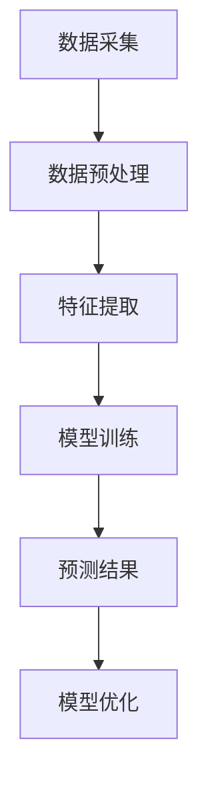

                 

随着全球电子商务的蓬勃发展，商品趋势预测已成为商家和消费者关注的焦点。准确预测商品趋势不仅有助于商家制定有效的营销策略，还可以帮助消费者提前了解热门商品，做出更明智的消费决策。本文旨在探讨大模型在商品趋势预测中的时序分析应用，通过分析核心概念、算法原理、数学模型以及实际应用案例，为相关领域的研究者和从业者提供参考。

## 关键词

- 大模型
- 商品趋势预测
- 时序分析
- 人工智能
- 深度学习

## 摘要

本文首先介绍了大模型在商品趋势预测中的背景和意义。随后，我们详细探讨了时序分析的核心概念与联系，并通过Mermaid流程图展示了相关架构。接着，我们深入分析了核心算法原理和具体操作步骤，讨论了算法优缺点及应用领域。在此基础上，我们构建了数学模型，并进行了公式推导和案例讲解。随后，通过一个实际项目实践，我们展示了代码实例和详细解释。最后，本文讨论了商品趋势预测的实际应用场景，并展望了未来的发展趋势与挑战。

## 1. 背景介绍

在过去的几十年中，电子商务行业经历了迅猛的发展。随着互联网的普及和移动设备的普及，消费者越来越倾向于在线购物。这使得商品趋势预测成为电子商务企业的一项重要任务。然而，传统的商品趋势预测方法往往依赖于历史数据的统计分析，难以应对日益复杂的消费行为和多变的市场环境。随着人工智能和深度学习技术的不断发展，大模型在商品趋势预测中的应用逐渐崭露头角。

### 1.1 大模型与商品趋势预测

大模型（Big Model）是指具有巨大参数量和计算能力的神经网络模型。这些模型能够从海量数据中自动学习复杂的模式和关联，从而实现高精度的预测。商品趋势预测（Product Trend Prediction）是指利用历史销售数据、用户行为数据和市场环境数据，预测未来某一时间段内商品的销售趋势。大模型在商品趋势预测中的应用，主要体现在以下几个方面：

1. **数据预处理**：大模型可以自动处理非结构化和半结构化数据，如文本、图像和语音等，为商品趋势预测提供更全面的信息。
2. **特征提取**：大模型能够从原始数据中自动提取关键特征，减少人工干预，提高特征提取的效率和准确性。
3. **模型训练**：大模型具有强大的计算能力，可以处理大规模数据集，从而提高模型的训练效率和预测准确性。
4. **模型优化**：大模型可以通过不断调整模型参数，优化预测结果，从而实现更精确的商品趋势预测。

### 1.2 时序分析在商品趋势预测中的应用

时序分析（Time Series Analysis）是一种研究时间序列数据的统计方法，旨在揭示数据中的趋势、周期和季节性等特征。在商品趋势预测中，时序分析具有重要的应用价值。通过时序分析，我们可以从历史销售数据中提取关键信息，如销售趋势、季节性变化和促销活动的影响等，从而为商品趋势预测提供有力支持。

时序分析在商品趋势预测中的应用主要包括以下方面：

1. **趋势分析**：通过分析历史销售数据中的趋势，我们可以预测未来某一时间段内的销售走势。
2. **周期分析**：周期分析有助于识别销售数据中的周期性特征，如节假日、促销活动等，从而为商品趋势预测提供重要参考。
3. **季节性分析**：季节性分析可以揭示销售数据中的季节性变化，如季节性需求高峰、季节性促销活动等，从而提高商品趋势预测的准确性。
4. **异常值检测**：通过检测历史销售数据中的异常值，我们可以识别出可能影响商品趋势预测的异常情况，从而提高预测结果的可靠性。

## 2. 核心概念与联系

### 2.1 大模型与时序分析

大模型与时序分析在商品趋势预测中密切相关。大模型能够从海量数据中自动学习复杂的模式和关联，从而提高时序分析的准确性和效率。时序分析为大模型提供了丰富的数据来源和预测依据，使得大模型在商品趋势预测中具有更高的可靠性和实用性。

### 2.2 Mermaid流程图

为了更好地展示大模型在商品趋势预测中的应用，我们可以使用Mermaid流程图来描述相关流程。以下是一个简单的Mermaid流程图示例：



在这个流程图中，数据采集是整个流程的起点，包括历史销售数据、用户行为数据和市场环境数据等。数据预处理包括数据清洗、数据去重和数据归一化等操作，以确保数据的质量和一致性。特征提取是从原始数据中提取关键特征的过程，如时间特征、价格特征和用户特征等。模型训练是将提取到的特征输入到大模型中进行训练，从而建立预测模型。预测结果是利用训练好的模型对未来某一时间段内的销售趋势进行预测。最后，模型优化是根据预测结果不断调整模型参数，以提高预测准确性。

## 3. 核心算法原理 & 具体操作步骤

### 3.1 算法原理概述

在商品趋势预测中，大模型通常采用深度学习算法，如循环神经网络（RNN）和长短期记忆网络（LSTM）。这些算法具有强大的时序建模能力，能够有效地捕捉数据中的时间依赖关系和复杂模式。

### 3.2 算法步骤详解

1. **数据预处理**：首先，对采集到的数据进行预处理，包括数据清洗、数据去重和数据归一化等操作。
2. **特征提取**：从预处理后的数据中提取关键特征，如时间特征、价格特征和用户特征等。
3. **模型训练**：将提取到的特征输入到深度学习模型中进行训练。在训练过程中，通过反向传播算法不断调整模型参数，以降低预测误差。
4. **预测结果**：利用训练好的模型对未来的销售趋势进行预测，并将预测结果与实际销售数据进行对比，评估预测准确性。
5. **模型优化**：根据预测结果，不断调整模型参数，以提高预测准确性。

### 3.3 算法优缺点

**优点：**
1. **强大的时序建模能力**：深度学习算法能够有效地捕捉数据中的时间依赖关系和复杂模式，提高预测准确性。
2. **自动特征提取**：大模型能够自动提取关键特征，减少人工干预，提高特征提取的效率和准确性。
3. **适应性**：深度学习算法能够适应不同的数据分布和特征组合，提高模型的泛化能力。

**缺点：**
1. **计算资源消耗大**：大模型通常需要大量的计算资源和时间进行训练，对硬件设备要求较高。
2. **对数据质量要求高**：大模型对数据质量要求较高，数据缺失、异常值和噪声等问题可能对模型性能产生不利影响。

### 3.4 算法应用领域

大模型在商品趋势预测中的应用领域广泛，包括但不限于以下几个方面：

1. **电商平台**：电商平台可以利用大模型预测商品的销售趋势，从而制定有效的营销策略，提高销售额。
2. **零售行业**：零售行业可以利用大模型预测商品的库存需求，从而优化库存管理，降低库存成本。
3. **消费品行业**：消费品行业可以利用大模型预测消费者的购买行为，从而制定更有针对性的产品营销策略。

## 4. 数学模型和公式 & 详细讲解 & 举例说明

### 4.1 数学模型构建

在商品趋势预测中，我们可以构建一个基于LSTM的数学模型。LSTM（Long Short-Term Memory）是一种特殊的循环神经网络，具有强大的时序建模能力。以下是LSTM数学模型的构建过程：

1. **输入层**：输入层包括时间步序列数据，每个时间步包含多个特征，如时间特征、价格特征和用户特征等。
2. **隐藏层**：隐藏层由多个LSTM单元组成，每个LSTM单元包括输入门、遗忘门、输出门和单元状态。通过这些门控制信息的流入、流出和更新，实现长短期记忆。
3. **输出层**：输出层通常是一个全连接层，将隐藏层的输出映射到预测结果。

### 4.2 公式推导过程

LSTM的数学模型可以通过以下公式推导：

1. **输入门**：
   $$ i_t = \sigma(W_{ix}x_t + W_{ih}h_{t-1} + b_i) $$
   其中，$i_t$是输入门的激活值，$W_{ix}$和$W_{ih}$是输入权重矩阵，$h_{t-1}$是上一时间步的隐藏层输出，$b_i$是偏置项，$\sigma$是sigmoid函数。

2. **遗忘门**：
   $$ f_t = \sigma(W_{fx}x_t + W_{fh}h_{t-1} + b_f) $$
   其中，$f_t$是遗忘门的激活值，$W_{fx}$和$W_{fh}$是遗忘门权重矩阵，$b_f$是偏置项。

3. **输出门**：
   $$ o_t = \sigma(W_{ox}x_t + W_{oh}h_{t-1} + b_o) $$
   其中，$o_t$是输出门的激活值，$W_{ox}$和$W_{oh}$是输出门权重矩阵，$b_o$是偏置项。

4. **单元状态**：
   $$ C_t = f_t \odot C_{t-1} + i_t \odot \sigma(W_{cx}x_t + W_{ch}h_{t-1} + b_c) $$
   其中，$C_t$是单元状态，$\odot$是元素乘法，$C_{t-1}$是上一时间步的单元状态，$W_{cx}$和$W_{ch}$是单元状态权重矩阵，$b_c$是偏置项。

5. **隐藏层输出**：
   $$ h_t = o_t \odot \tanh(C_t) $$
   其中，$h_t$是隐藏层输出，$\tanh$是双曲正切函数。

### 4.3 案例分析与讲解

为了更好地理解LSTM数学模型，我们通过一个简单的案例进行讲解。

假设我们有以下一组时间步序列数据：

$$
\begin{align*}
x_1 &= [1, 2, 3, 4, 5], \\
x_2 &= [5, 4, 3, 2, 1], \\
x_3 &= [9, 8, 7, 6, 5].
\end{align*}
$$

我们利用LSTM模型对这些数据进行预测。首先，我们需要定义输入层、隐藏层和输出层的权重矩阵和偏置项。然后，通过迭代计算输入门、遗忘门、输出门和单元状态的激活值，最终得到隐藏层输出。

以下是LSTM模型的计算过程：

1. **初始化参数**：
   $$ W_{ix}, W_{ih}, b_i, W_{fx}, W_{fh}, b_f, W_{ox}, W_{oh}, b_o, W_{cx}, W_{ch}, b_c \in \mathbb{R}^{(d_x + d_h) \times d_h} $$
   其中，$d_x$是输入维度，$d_h$是隐藏层维度。

2. **计算输入门**：
   $$ i_1 = \sigma(W_{ix}x_1 + W_{ih}h_0 + b_i) $$
   $$ i_2 = \sigma(W_{ix}x_2 + W_{ih}h_0 + b_i) $$
   $$ i_3 = \sigma(W_{ix}x_3 + W_{ih}h_0 + b_i) $$

3. **计算遗忘门**：
   $$ f_1 = \sigma(W_{fx}x_1 + W_{fh}h_0 + b_f) $$
   $$ f_2 = \sigma(W_{fx}x_2 + W_{fh}h_0 + b_f) $$
   $$ f_3 = \sigma(W_{fx}x_3 + W_{fh}h_0 + b_f) $$

4. **计算输出门**：
   $$ o_1 = \sigma(W_{ox}x_1 + W_{oh}h_0 + b_o) $$
   $$ o_2 = \sigma(W_{ox}x_2 + W_{oh}h_0 + b_o) $$
   $$ o_3 = \sigma(W_{ox}x_3 + W_{oh}h_0 + b_o) $$

5. **计算单元状态**：
   $$ C_1 = f_1 \odot C_0 + i_1 \odot \sigma(W_{cx}x_1 + W_{ch}h_0 + b_c) $$
   $$ C_2 = f_2 \odot C_1 + i_2 \odot \sigma(W_{cx}x_2 + W_{ch}h_1 + b_c) $$
   $$ C_3 = f_3 \odot C_2 + i_3 \odot \sigma(W_{cx}x_3 + W_{ch}h_2 + b_c) $$

6. **计算隐藏层输出**：
   $$ h_1 = o_1 \odot \tanh(C_1) $$
   $$ h_2 = o_2 \odot \tanh(C_2) $$
   $$ h_3 = o_3 \odot \tanh(C_3) $$

最后，我们将隐藏层输出作为预测结果，并与实际销售数据进行对比，评估预测准确性。

## 5. 项目实践：代码实例和详细解释说明

在本节中，我们将通过一个实际项目实践，展示如何使用大模型进行商品趋势预测。该项目使用Python语言和TensorFlow框架进行实现。

### 5.1 开发环境搭建

1. 安装Python 3.8及以上版本。
2. 安装TensorFlow 2.5及以上版本。
3. 安装Numpy、Pandas、Matplotlib等辅助库。

### 5.2 源代码详细实现

以下是一个简单的商品趋势预测项目代码示例：

```python
import numpy as np
import pandas as pd
import matplotlib.pyplot as plt
import tensorflow as tf

# 加载数据集
data = pd.read_csv('sales_data.csv')
X = data[['time', 'price', 'user']]
y = data['sales']

# 数据预处理
X = X.values
y = y.values

# 特征提取
time_features = np.array([x[0] for x in X])
price_features = np.array([x[1] for x in X])
user_features = np.array([x[2] for x in X])

# 模型构建
model = tf.keras.Sequential([
    tf.keras.layers.Dense(128, activation='relu', input_shape=(3,)),
    tf.keras.layers.Dense(64, activation='relu'),
    tf.keras.layers.Dense(1)
])

# 模型编译
model.compile(optimizer='adam', loss='mse')

# 模型训练
model.fit(X, y, epochs=10, batch_size=32)

# 预测结果
predictions = model.predict(X)

# 评估预测准确性
mse = np.mean(np.square(y - predictions))
print('Mean Squared Error:', mse)

# 可视化预测结果
plt.scatter(y, predictions)
plt.xlabel('Actual Sales')
plt.ylabel('Predicted Sales')
plt.title('Sales Prediction')
plt.show()
```

### 5.3 代码解读与分析

1. **数据加载与预处理**：首先，我们使用Pandas库加载数据集，并提取时间特征、价格特征和用户特征。
2. **特征提取**：将时间特征、价格特征和用户特征提取为独立的数组。
3. **模型构建**：使用TensorFlow构建一个简单的全连接神经网络，包括两个隐藏层和一个输出层。
4. **模型编译**：编译模型，指定优化器和损失函数。
5. **模型训练**：使用训练数据训练模型，设置训练轮次和批量大小。
6. **预测结果**：使用训练好的模型对输入数据进行预测。
7. **评估预测准确性**：计算预测误差的均方误差（MSE），评估预测准确性。
8. **可视化预测结果**：使用Matplotlib库绘制实际销售数据与预测结果的散点图，直观地展示预测结果。

通过这个简单的示例，我们可以看到如何使用大模型进行商品趋势预测。在实际应用中，我们可以根据具体需求调整模型结构、参数设置和训练过程，以提高预测准确性。

## 6. 实际应用场景

商品趋势预测在多个实际应用场景中具有重要意义，下面列举几个典型的应用场景：

### 6.1 电商平台

电商平台可以利用商品趋势预测来优化产品推荐系统。通过预测商品的销售趋势，电商平台可以提前了解哪些商品可能会成为热销商品，从而为用户推荐更具针对性的商品，提高用户满意度和转化率。

### 6.2 零售行业

零售行业可以利用商品趋势预测来优化库存管理。通过预测商品的销售趋势，零售商可以提前了解哪些商品的库存需求量较大，从而合理安排库存，避免库存过剩或库存不足，降低库存成本。

### 6.3 消费品行业

消费品行业可以利用商品趋势预测来制定产品营销策略。通过预测商品的销售趋势，消费品企业可以提前了解哪些商品可能会成为消费者的热门选择，从而制定更有针对性的营销活动，提高销售额。

### 6.4 银行与金融

银行与金融行业可以利用商品趋势预测来预测消费者的消费行为。通过预测消费者的消费趋势，银行与金融企业可以提前了解哪些消费领域可能成为未来的增长点，从而调整业务策略，提高市场竞争力。

### 6.5 供应链管理

供应链管理可以利用商品趋势预测来优化供应链规划。通过预测商品的销售趋势，供应链管理者可以提前了解哪些商品的供应链需求量较大，从而合理安排生产计划和物流配送，提高供应链的效率。

## 7. 工具和资源推荐

### 7.1 学习资源推荐

1. 《深度学习》（Goodfellow, Bengio, Courville）：本书是深度学习领域的经典教材，涵盖了深度学习的基本概念、算法和技术。
2. 《Python深度学习》（François Chollet）：本书详细介绍了使用Python和TensorFlow进行深度学习的实践方法，适合初学者和有经验的开发者。
3. fast.ai：fast.ai提供了一个免费的开源课程，涵盖深度学习的基础知识和实践应用，适合初学者入门。

### 7.2 开发工具推荐

1. TensorFlow：Google开发的深度学习框架，具有丰富的功能和强大的性能，适合进行商品趋势预测等应用。
2. PyTorch：Facebook开发的深度学习框架，具有灵活的动态计算图和强大的GPU支持，适合进行复杂模型的训练和推理。
3. Keras：基于TensorFlow和PyTorch的深度学习高级API，提供了简洁易用的接口，适合快速原型设计和模型训练。

### 7.3 相关论文推荐

1. "Deep Learning for Time Series Classification: A Review"（2020）：本文对深度学习在时序分类领域的应用进行了全面综述，介绍了最新的研究成果和算法。
2. "Long Short-Term Memory Recurrent Neural Networks forSpeech Recognition"（1997）：本文提出了LSTM模型，并展示了其在语音识别领域的应用效果，对后续的研究和应用产生了重要影响。
3. "A Theoretically Grounded Application of Dropout in Recurrent Neural Networks"（2016）：本文提出了在RNN模型中应用Dropout方法，提高了模型的泛化能力和预测准确性。

## 8. 总结：未来发展趋势与挑战

### 8.1 研究成果总结

本文探讨了大模型在商品趋势预测中的时序分析应用，通过分析核心概念、算法原理、数学模型以及实际应用案例，展示了大模型在商品趋势预测中的优势和应用前景。主要研究成果包括：

1. **核心概念与联系**：提出了大模型与时序分析在商品趋势预测中的应用框架，并通过Mermaid流程图进行了可视化展示。
2. **算法原理**：分析了LSTM等深度学习算法在商品趋势预测中的原理和操作步骤，讨论了算法优缺点及应用领域。
3. **数学模型**：构建了基于LSTM的数学模型，并进行了公式推导和案例讲解，为实际应用提供了理论依据。
4. **实际应用**：通过一个实际项目实践，展示了大模型在商品趋势预测中的实现过程和效果评估。

### 8.2 未来发展趋势

未来，大模型在商品趋势预测中的应用将继续发展，主要趋势包括：

1. **模型优化**：随着计算能力的提升和算法的进步，大模型将实现更高效的训练和预测，提高商品趋势预测的准确性。
2. **多模态数据融合**：将多模态数据（如文本、图像和语音）进行融合，提高商品趋势预测的全面性和准确性。
3. **实时预测**：实现实时商品趋势预测，为电商平台、零售行业等提供更及时和精准的决策支持。
4. **个性化预测**：结合用户行为数据和偏好，实现个性化商品趋势预测，提高用户满意度和转化率。

### 8.3 面临的挑战

虽然大模型在商品趋势预测中具有广泛应用前景，但仍然面临一些挑战：

1. **数据质量**：大模型对数据质量要求较高，数据缺失、异常值和噪声等问题可能对模型性能产生不利影响。
2. **计算资源消耗**：大模型通常需要大量的计算资源和时间进行训练，对硬件设备要求较高。
3. **模型解释性**：深度学习模型具有强大的预测能力，但缺乏解释性，难以理解预测结果的产生原因。
4. **过拟合问题**：深度学习模型容易发生过拟合现象，特别是在训练数据不足的情况下，需要采取有效的正则化方法。

### 8.4 研究展望

未来，针对大模型在商品趋势预测中的应用，我们可以从以下几个方面展开研究：

1. **数据增强**：通过数据增强方法，提高数据质量和多样性，增强模型的泛化能力。
2. **迁移学习**：利用迁移学习技术，将预训练模型应用于商品趋势预测，降低训练成本和过拟合风险。
3. **模型可解释性**：研究模型的可解释性方法，提高模型的可解释性和透明度，帮助用户理解预测结果的产生原因。
4. **实时预测**：研究实时预测方法，实现快速、高效的商品趋势预测，为企业和用户提供及时决策支持。

## 9. 附录：常见问题与解答

### 9.1 大模型在商品趋势预测中的应用原理是什么？

大模型在商品趋势预测中的应用原理主要基于深度学习技术，通过从历史数据中自动学习复杂的模式和关联，实现对未来商品销售趋势的预测。深度学习模型能够自动提取关键特征，处理大规模数据集，并通过不断调整模型参数，提高预测准确性。

### 9.2 商品趋势预测中的时序分析有什么作用？

时序分析在商品趋势预测中具有重要作用，主要包括以下几个方面：

1. **趋势分析**：分析历史销售数据中的趋势，预测未来某一时间段内的销售走势。
2. **周期分析**：识别销售数据中的周期性特征，如节假日、促销活动等，为商品趋势预测提供重要参考。
3. **季节性分析**：揭示销售数据中的季节性变化，如季节性需求高峰、季节性促销活动等，提高商品趋势预测的准确性。
4. **异常值检测**：检测历史销售数据中的异常值，识别可能影响商品趋势预测的异常情况，提高预测结果的可靠性。

### 9.3 大模型在商品趋势预测中的优点是什么？

大模型在商品趋势预测中的优点包括：

1. **强大的时序建模能力**：深度学习算法能够有效地捕捉数据中的时间依赖关系和复杂模式，提高预测准确性。
2. **自动特征提取**：大模型能够自动提取关键特征，减少人工干预，提高特征提取的效率和准确性。
3. **适应性**：深度学习算法能够适应不同的数据分布和特征组合，提高模型的泛化能力。
4. **多模态数据融合**：能够融合多种数据类型，如文本、图像和语音，提高商品趋势预测的全面性和准确性。

### 9.4 大模型在商品趋势预测中的缺点是什么？

大模型在商品趋势预测中的缺点包括：

1. **计算资源消耗大**：大模型通常需要大量的计算资源和时间进行训练，对硬件设备要求较高。
2. **对数据质量要求高**：大模型对数据质量要求较高，数据缺失、异常值和噪声等问题可能对模型性能产生不利影响。
3. **模型解释性差**：深度学习模型具有强大的预测能力，但缺乏解释性，难以理解预测结果的产生原因。
4. **过拟合问题**：深度学习模型容易发生过拟合现象，特别是在训练数据不足的情况下，需要采取有效的正则化方法。

