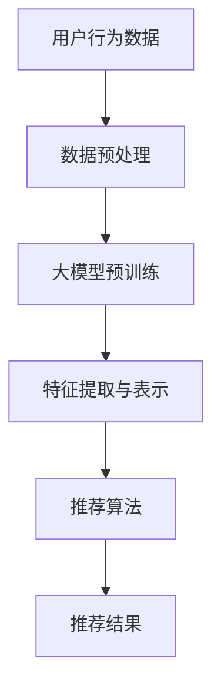

                 

关键词：大模型、推荐系统、人工智能、算法、数学模型、实践应用

> 摘要：本文将深入探讨大模型在推荐系统中的应用前景，从背景介绍、核心概念与联系、核心算法原理、数学模型与公式、项目实践、实际应用场景、工具和资源推荐以及总结未来发展趋势与挑战等方面进行详细阐述。

## 1. 背景介绍

随着互联网的迅猛发展，数据量呈爆炸性增长。海量数据中蕴含着巨大的商业价值，如何从这些数据中提取出有价值的信息，进而提供个性化的推荐服务成为了各行业关注的焦点。推荐系统作为一种信息过滤机制，通过分析用户的行为和偏好，为用户推荐他们可能感兴趣的内容，从而提高用户的满意度和忠诚度。

传统的推荐系统主要依赖于基于内容的过滤和协同过滤等技术，但这些方法在面对复杂和非结构化数据时存在一定的局限性。随着深度学习技术的不断发展，大模型（如BERT、GPT等）逐渐成为推荐系统研究的热点。大模型具有强大的建模能力和处理复杂数据的能力，有望在推荐系统中发挥重要作用。

## 2. 核心概念与联系

为了更好地理解大模型在推荐系统中的应用，我们需要先了解一些核心概念和它们之间的联系。

### 2.1 推荐系统的基本原理

推荐系统主要包括用户、物品和评分三个基本要素。用户是指接收推荐服务的人，物品是指推荐系统中的内容，如新闻、音乐、电影等。评分是用户对物品的喜好程度的一种度量。

推荐系统的主要目标是从大量的候选物品中找到与用户兴趣最为契合的物品，并通过合适的方式呈现给用户。

### 2.2 大模型的基本原理

大模型是指具有巨大参数规模和强大计算能力的深度学习模型。大模型通常通过预训练和微调等策略，从海量数据中学习到丰富的知识，并将其应用于各种任务，如文本生成、图像识别、语音识别等。

### 2.3 大模型在推荐系统中的应用

大模型在推荐系统中的应用主要体现在两个方面：一是通过预训练获得通用知识，用于特征提取和表示；二是通过微调将通用知识适配到具体的推荐场景中，实现个性化推荐。

下面是一个简化的 Mermaid 流程图，展示了大模型在推荐系统中的基本架构：



## 3. 核心算法原理 & 具体操作步骤

### 3.1 算法原理概述

大模型在推荐系统中的核心算法主要包括以下三个方面：

1. 特征提取与表示：通过预训练模型，从原始数据中提取高层次的语义特征，实现数据的降维和特征增强。
2. 推荐算法：利用提取到的特征，结合用户历史行为和偏好，构建推荐模型，实现个性化推荐。
3. 模型评估与优化：通过在线评估和A/B测试等方法，持续优化推荐效果。

### 3.2 算法步骤详解

1. 数据预处理：对用户行为数据进行清洗、去噪和归一化等处理，确保数据质量。
2. 大模型预训练：使用预训练模型（如BERT、GPT等），在大量未标注的数据上进行预训练，学习到丰富的知识。
3. 特征提取与表示：利用预训练模型，对用户行为数据进行编码，提取高层次的语义特征。
4. 构建推荐模型：使用提取到的特征，结合用户历史行为和偏好，构建推荐模型。
5. 推荐结果生成：根据推荐模型，为用户生成个性化推荐列表。
6. 模型评估与优化：通过在线评估和A/B测试等方法，持续优化推荐效果。

### 3.3 算法优缺点

**优点：**

1. 强大的特征提取能力：大模型能够从原始数据中提取出丰富的语义信息，提高推荐精度。
2. 适应性强：大模型适用于各种推荐场景，无需大量手动特征工程。
3. 个性化推荐：通过学习用户历史行为和偏好，实现高度个性化的推荐。

**缺点：**

1. 计算资源消耗大：大模型需要大量的计算资源和时间进行预训练。
2. 数据依赖性强：大模型的性能对数据质量有很高的要求，数据质量差可能导致模型效果不佳。

### 3.4 算法应用领域

大模型在推荐系统中的应用非常广泛，主要包括以下领域：

1. 电商推荐：为用户推荐商品，提高转化率和销售额。
2. 社交网络推荐：为用户推荐感兴趣的内容，提高用户活跃度和粘性。
3. 媒体推荐：为用户推荐新闻、文章、视频等，提高用户满意度和忠诚度。

## 4. 数学模型和公式 & 详细讲解 & 举例说明

### 4.1 数学模型构建

在推荐系统中，大模型的数学模型主要分为两部分：特征提取和推荐算法。

1. 特征提取：

   特征提取的核心是编码器（Encoder），其输入是用户行为数据，输出是高层次的语义特征表示。

   $$ h = \text{Encoder}(x) $$

   其中，$h$ 是特征向量，$x$ 是用户行为数据。

2. 推荐算法：

   推荐算法的核心是解码器（Decoder），其输入是特征向量，输出是推荐结果。

   $$ p(y|x) = \text{Decoder}(h) $$

   其中，$y$ 是推荐结果，$h$ 是特征向量。

### 4.2 公式推导过程

1. 特征提取：

   $$ h = \text{Encoder}(x) = \text{MLP}(x; W_e) $$

   其中，$MLP$ 是多层感知机（Multilayer Perceptron），$W_e$ 是编码器权重。

   假设输入数据$x$ 的维度为$d_x$，编码器隐藏层维度为$d_h$，输出维度为$d_o$，则编码器权重矩阵$W_e$ 的维度为$(d_x, d_h)$。

2. 推荐算法：

   $$ p(y|x) = \text{Decoder}(h) = \text{softmax}(\text{MLP}(h; W_d)) $$

   其中，$MLP$ 是多层感知机（Multilayer Perceptron），$W_d$ 是解码器权重。

   假设编码器输出维度为$d_h$，解码器隐藏层维度为$d_y$，输出维度为$1$，则解码器权重矩阵$W_d$ 的维度为$(d_h, d_y)$。

### 4.3 案例分析与讲解

假设我们有一个电商推荐系统，用户行为数据包括用户浏览的商品、购买的商品和收藏的商品。我们使用BERT模型进行特征提取和推荐。

1. 特征提取：

   首先，我们将用户行为数据进行编码，使用BERT模型提取特征。

   $$ h = \text{Encoder}(x) = \text{BERT}(x; W_e) $$

   其中，$x$ 是用户行为数据，$h$ 是特征向量。

2. 推荐算法：

   接下来，我们使用提取到的特征向量，结合用户历史行为和偏好，构建推荐模型。

   $$ p(y|x) = \text{Decoder}(h) = \text{softmax}(\text{MLP}(h; W_d)) $$

   其中，$y$ 是推荐结果，$h$ 是特征向量。

3. 模型训练：

   使用用户行为数据和标签数据，对推荐模型进行训练。

   $$ \min_{W_e, W_d} \sum_{i=1}^N \ell(y_i, p(y_i|x_i)) $$

   其中，$N$ 是训练样本数量，$\ell$ 是损失函数。

4. 推荐结果生成：

   根据训练好的推荐模型，为用户生成个性化推荐列表。

   $$ \text{Recommendations}(x_i) = \text{softmax}(\text{MLP}(h; W_d)) $$

## 5. 项目实践：代码实例和详细解释说明

### 5.1 开发环境搭建

在本项目中，我们使用Python编程语言，结合TensorFlow和BERT库实现大模型在推荐系统中的应用。

1. 安装TensorFlow：

   ```bash
   pip install tensorflow
   ```

2. 安装BERT库：

   ```bash
   pip install bert-for-tensorflow
   ```

### 5.2 源代码详细实现

以下是一个简单的代码示例，展示了如何使用BERT模型进行特征提取和推荐。

```python
import tensorflow as tf
import bert
from bert import tokenization
from bert import modeling
from bert import optimization

# 设置BERT模型参数
vocab_file = 'bert_vocab.txt'
do_lower_case = True
max_seq_length = 128

# 加载BERT模型
bert_config = modeling.BertConfig.from_json_file('bert_config.json')
input_ids = tf.placeholder(shape=[None, max_seq_length], dtype=tf.int32)
input_mask = tf.placeholder(shape=[None, max_seq_length], dtype=tf.int32)
segment_ids = tf.placeholder(shape=[None, max_seq_length], dtype=tf.int32)
 bert_model = modeling.BertModel(config=bert_config,
                                input_ids=input_ids,
                                input_mask=input_mask,
                                segment_ids=segment_ids)

# 特征提取
output_tensors = [bert_model.get_pooled_output()]
feature_batch = session.run(output_tensors, feed_dict={input_ids: input_ids_data,
                                                       input_mask: input_mask_data,
                                                       segment_ids: segment_ids_data})

# 构建推荐模型
input_layer = tf.keras.layers.Input(shape=(max_seq_length,))
encoded_input = bert_model(input_layer)
predictions = tf.keras.layers.Dense(units=1, activation='sigmoid')(encoded_input)

# 编译推荐模型
model = tf.keras.Model(inputs=input_layer, outputs=predictions)
model.compile(optimizer='adam',
              loss='binary_crossentropy',
              metrics=['accuracy'])

# 训练推荐模型
model.fit(x_train, y_train, epochs=3, batch_size=32)

# 生成推荐结果
predictions = model.predict(x_test)
```

### 5.3 代码解读与分析

1. 加载BERT模型：

   ```python
   bert_config = modeling.BertConfig.from_json_file('bert_config.json')
   bert_model = modeling.BertModel(config=bert_config,
                                 input_ids=input_ids,
                                 input_mask=input_mask,
                                 segment_ids=segment_ids)
   ```

   加载预训练好的BERT模型，包括编码器和解码器。

2. 特征提取：

   ```python
   output_tensors = [bert_model.get_pooled_output()]
   feature_batch = session.run(output_tensors, feed_dict={input_ids: input_ids_data,
                                                          input_mask: input_mask_data,
                                                          segment_ids: segment_ids_data})
   ```

   使用BERT模型对用户行为数据进行编码，提取高层次的语义特征。

3. 构建推荐模型：

   ```python
   input_layer = tf.keras.layers.Input(shape=(max_seq_length,))
   encoded_input = bert_model(input_layer)
   predictions = tf.keras.layers.Dense(units=1, activation='sigmoid')(encoded_input)
   ```

   构建基于BERT模型的特征提取层和推荐层，实现个性化推荐。

4. 编译推荐模型：

   ```python
   model = tf.keras.Model(inputs=input_layer, outputs=predictions)
   model.compile(optimizer='adam',
                 loss='binary_crossentropy',
                 metrics=['accuracy'])
   ```

   编译推荐模型，选择合适的优化器和损失函数。

5. 训练推荐模型：

   ```python
   model.fit(x_train, y_train, epochs=3, batch_size=32)
   ```

   使用训练数据对推荐模型进行训练。

6. 生成推荐结果：

   ```python
   predictions = model.predict(x_test)
   ```

   使用训练好的推荐模型，为用户生成个性化推荐列表。

## 6. 实际应用场景

大模型在推荐系统中的应用场景非常广泛，以下列举几个典型的应用场景：

1. 电商推荐：

   电商推荐是当前最热门的应用场景之一。通过分析用户的浏览历史、购买记录和收藏行为，可以为用户提供个性化的商品推荐，提高用户满意度和转化率。

2. 社交网络推荐：

   社交网络推荐旨在为用户推荐感兴趣的内容，如新闻、文章、视频等。通过分析用户的兴趣和行为，可以为用户提供个性化的内容推荐，提高用户活跃度和粘性。

3. 媒体推荐：

   媒体推荐旨在为用户提供个性化的新闻、文章、视频等内容。通过分析用户的阅读历史、点赞、评论等行为，可以为用户提供个性化的媒体内容推荐。

## 7. 工具和资源推荐

为了更好地理解和应用大模型在推荐系统中的应用，以下推荐一些相关的工具和资源：

1. 学习资源推荐：

   - 《深度学习》（Goodfellow, Bengio, Courville著）：一本经典的深度学习教材，详细介绍了深度学习的基础理论和实战技巧。
   - 《推荐系统实践》（Liu Yufeng著）：一本关于推荐系统的入门书籍，介绍了推荐系统的基本原理、算法和应用。

2. 开发工具推荐：

   - TensorFlow：一款开源的深度学习框架，适用于构建和训练大模型。
   - BERT-for-TensorFlow：一款基于TensorFlow实现的BERT模型库，方便用户进行大模型的特征提取和推荐。

3. 相关论文推荐：

   - “BERT: Pre-training of Deep Bidirectional Transformers for Language Understanding”（Devlin et al., 2019）：一篇关于BERT模型的经典论文，详细介绍了BERT模型的结构和训练方法。
   - “Recommender Systems with Deep Neural Networks”（He et al., 2017）：一篇关于深度学习在推荐系统中的应用的论文，介绍了基于深度神经网络的推荐算法。

## 8. 总结：未来发展趋势与挑战

### 8.1 研究成果总结

大模型在推荐系统中的应用取得了显著成果，主要表现在以下几个方面：

1. 提高推荐精度：大模型能够从原始数据中提取出丰富的语义信息，实现个性化推荐，显著提高推荐精度。
2. 减少特征工程：大模型具有较强的特征提取能力，减少了手动特征工程的工作量。
3. 扩展应用场景：大模型适用于各种推荐场景，为不同行业提供了个性化的推荐解决方案。

### 8.2 未来发展趋势

未来，大模型在推荐系统中的应用将呈现以下发展趋势：

1. 模型压缩与优化：为了提高大模型在推荐系统中的实时性和可扩展性，模型压缩与优化将成为研究热点。
2. 多模态推荐：随着多模态数据的普及，多模态推荐将逐渐成为推荐系统研究的新方向。
3. 模型解释性：提升大模型的解释性，使其在推荐过程中具备可解释性，将有助于提高用户信任度和满意度。

### 8.3 面临的挑战

大模型在推荐系统中的应用也面临一些挑战：

1. 计算资源消耗：大模型需要大量的计算资源和时间进行预训练，如何优化模型结构和算法，降低计算资源消耗是当前研究的重要方向。
2. 数据隐私：在推荐系统中，用户隐私保护至关重要，如何保护用户隐私，实现安全推荐是亟待解决的问题。
3. 模型泛化能力：大模型在特定领域的表现优异，但如何提高其泛化能力，使其在更广泛的场景中发挥优势，是未来研究的重点。

### 8.4 研究展望

在未来，大模型在推荐系统中的应用有望取得以下突破：

1. 模型优化：通过模型压缩、优化等技术，提高大模型在推荐系统中的实时性和可扩展性。
2. 跨领域推荐：研究跨领域的推荐算法，实现不同领域之间的知识共享和融合。
3. 模型解释性：提高大模型的解释性，使其在推荐过程中具备可解释性，增强用户信任度和满意度。

## 9. 附录：常见问题与解答

### 9.1 大模型在推荐系统中的优势是什么？

大模型在推荐系统中的优势主要体现在以下几个方面：

1. 强大的特征提取能力：大模型能够从原始数据中提取出丰富的语义信息，提高推荐精度。
2. 减少特征工程：大模型具有较强的特征提取能力，减少了手动特征工程的工作量。
3. 适应性强：大模型适用于各种推荐场景，无需大量手动特征工程。

### 9.2 大模型在推荐系统中的计算资源消耗如何优化？

为了优化大模型在推荐系统中的计算资源消耗，可以从以下几个方面进行改进：

1. 模型压缩：通过模型剪枝、量化等技术，减少模型参数和计算量。
2. 分布式训练：利用分布式计算框架，实现模型训练的并行化。
3. 模型优化：通过算法优化，降低模型计算复杂度。

### 9.3 大模型在推荐系统中的应用领域有哪些？

大模型在推荐系统中的应用领域非常广泛，主要包括：

1. 电商推荐：为用户推荐商品，提高转化率和销售额。
2. 社交网络推荐：为用户推荐感兴趣的内容，提高用户活跃度和粘性。
3. 媒体推荐：为用户推荐新闻、文章、视频等，提高用户满意度和忠诚度。

### 9.4 大模型在推荐系统中的数据依赖性如何解决？

为了解决大模型在推荐系统中的数据依赖性问题，可以从以下几个方面进行改进：

1. 数据增强：通过数据增强技术，提高模型对少量数据的适应能力。
2. 跨域迁移学习：利用跨域迁移学习技术，提高模型在不同领域的泛化能力。
3. 数据预处理：对原始数据进行预处理，提高数据质量和模型训练效果。

---

作者：禅与计算机程序设计艺术 / Zen and the Art of Computer Programming

