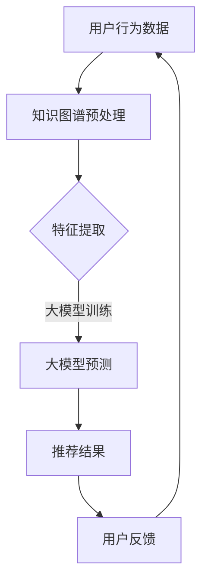

                 

关键词：大模型、推荐系统、知识图谱、推理应用、算法原理、数学模型、项目实践、实际应用场景、未来展望

## 摘要

本文旨在探讨大模型在推荐系统中的知识图谱推理应用，阐述其核心概念、算法原理、数学模型、项目实践以及未来发展趋势。通过分析大模型在推荐系统中的作用和优势，本文深入剖析了知识图谱推理在大模型应用中的具体实现和操作步骤，并对其优缺点和应用领域进行了详细探讨。同时，本文还通过实际项目实践展示了大模型在推荐系统中的具体应用，以及未来发展的方向和面临的挑战。

## 1. 背景介绍

随着互联网的迅猛发展，信息过载成为了一个普遍问题。用户在海量的信息中寻找自己感兴趣的内容变得愈发困难，这使得推荐系统应运而生。推荐系统通过分析用户的兴趣和行为，为其推荐个性化的内容，从而提高用户的满意度和留存率。推荐系统的核心在于预测用户对特定内容的兴趣程度，并根据预测结果为用户推荐相应的内容。

传统的推荐系统主要依赖于基于内容的推荐（Content-Based Filtering）和协同过滤（Collaborative Filtering）等算法。然而，这些算法在处理复杂的关系和网络结构时存在一定的局限性。为了克服这些问题，研究者们开始探索将知识图谱（Knowledge Graph）引入推荐系统，从而实现更加精准和个性化的推荐。

知识图谱是一种用于表示实体及其之间关系的图形结构。它通过将实体、属性和关系进行建模，将语义信息以图形化的方式呈现，从而为推荐系统提供了更加丰富的语义信息。大模型（如深度神经网络）则具备强大的表示和学习能力，能够从大规模数据中提取出有用的特征和规律。将大模型与知识图谱相结合，可以进一步提高推荐系统的准确性和鲁棒性。

本文旨在探讨大模型在推荐系统中的知识图谱推理应用，通过深入分析其核心概念、算法原理、数学模型、项目实践以及未来发展趋势，为研究者们提供一种全新的研究思路和实践指导。

## 2. 核心概念与联系

### 2.1 大模型在推荐系统中的应用

大模型在推荐系统中的应用主要包括两个方面：特征提取和预测。特征提取是指从用户行为、内容特征、知识图谱等数据中提取出有用的特征表示；预测则是指通过训练好的大模型预测用户对特定内容的兴趣程度。

在推荐系统中，大模型通常采用深度学习框架（如TensorFlow或PyTorch）进行训练。训练过程中，大模型会自动学习数据中的潜在特征和规律，从而提高推荐系统的准确性。例如，可以使用卷积神经网络（CNN）提取图像特征，使用循环神经网络（RNN）处理序列数据，使用注意力机制（Attention Mechanism）捕捉重要的信息等。

### 2.2 知识图谱在推荐系统中的应用

知识图谱在推荐系统中的应用主要体现在以下几个方面：

1. **实体关系建模**：知识图谱通过将实体及其之间的关系进行建模，为推荐系统提供了更加丰富的语义信息。例如，在电影推荐系统中，可以建立用户、电影、导演、演员等实体之间的关系。

2. **内容扩展**：知识图谱可以帮助推荐系统扩展用户感兴趣的内容。例如，当用户对某部电影感兴趣时，可以基于电影的知识图谱扩展推荐相关的电影、导演、演员等。

3. **知识融合**：知识图谱可以将不同类型的数据进行融合，从而提高推荐系统的准确性。例如，可以将用户行为数据与知识图谱中的实体关系进行融合，从而生成更加准确的推荐结果。

4. **推荐结果优化**：知识图谱可以帮助推荐系统优化推荐结果，提高推荐的质量。例如，可以使用知识图谱中的关系信息对推荐结果进行排序，从而提高推荐的相关性。

### 2.3 大模型与知识图谱的融合

大模型与知识图谱的融合主要体现在以下几个方面：

1. **特征融合**：将知识图谱中的实体关系信息与用户行为数据、内容特征等进行融合，生成更加丰富的特征表示。这些特征表示可以用于训练大模型，从而提高推荐系统的准确性。

2. **图嵌入**：使用图嵌入（Graph Embedding）技术将知识图谱中的实体和关系转化为低维向量表示。这些向量表示可以用于大模型的输入，从而更好地捕捉实体和关系之间的潜在规律。

3. **图注意力机制**：使用图注意力机制（Graph Attention Mechanism）对知识图谱中的关系进行加权，从而提高推荐系统的准确性。图注意力机制可以自适应地学习实体和关系之间的权重，从而更好地捕捉重要的关系信息。

4. **多模态融合**：将知识图谱与图像、语音、文本等多模态数据进行融合，从而提高推荐系统的准确性。多模态融合可以通过共享表示（Shared Representation）或模块化表示（Modular Representation）实现。

### 2.4 Mermaid 流程图

为了更直观地展示大模型与知识图谱在推荐系统中的融合过程，我们使用Mermaid绘制一个简单的流程图：



### 2.5 核心概念与联系总结

通过以上分析，我们可以看出大模型与知识图谱在推荐系统中的应用具有以下几个核心概念与联系：

1. **特征提取与融合**：将知识图谱中的实体关系信息与用户行为数据、内容特征等进行融合，生成更加丰富的特征表示。
2. **图嵌入与注意力机制**：使用图嵌入技术将知识图谱中的实体和关系转化为低维向量表示，并使用图注意力机制对知识图谱中的关系进行加权。
3. **多模态融合**：将知识图谱与图像、语音、文本等多模态数据进行融合，从而提高推荐系统的准确性。

这些概念与联系构成了大模型与知识图谱在推荐系统中的核心框架，为后续的算法原理和具体操作步骤提供了基础。

## 3. 核心算法原理 & 具体操作步骤

### 3.1 算法原理概述

大模型在推荐系统中的知识图谱推理应用主要基于以下核心算法原理：

1. **深度学习模型**：深度学习模型通过自动学习数据中的潜在特征和规律，实现对用户兴趣的精准预测。常见的深度学习模型包括卷积神经网络（CNN）、循环神经网络（RNN）和变压器（Transformer）等。

2. **知识图谱嵌入**：知识图谱嵌入通过将实体和关系转化为低维向量表示，实现对实体和关系的潜在规律捕捉。常见的知识图谱嵌入方法包括节点嵌入（Node Embedding）和边嵌入（Edge Embedding）。

3. **图注意力机制**：图注意力机制通过对知识图谱中的关系进行加权，实现对推荐结果的重要信息捕捉。图注意力机制可以自适应地学习实体和关系之间的权重，从而提高推荐系统的准确性。

4. **多模态融合**：多模态融合通过将知识图谱与图像、语音、文本等多模态数据进行融合，实现对推荐结果的丰富和扩展。多模态融合可以通过共享表示或模块化表示实现。

### 3.2 算法步骤详解

#### 3.2.1 特征提取

特征提取是推荐系统中的关键步骤，其质量直接影响到推荐结果的准确性。在大模型与知识图谱结合的推荐系统中，特征提取主要包括以下几种：

1. **用户行为特征**：从用户历史行为数据中提取出对推荐有影响的特征，如浏览记录、购买记录、点赞记录等。这些特征可以用来表示用户的兴趣偏好。

2. **内容特征**：从推荐的内容中提取出对推荐有影响的特征，如文本特征（关键词、词频）、图像特征（视觉特征、风格特征）等。这些特征可以用来表示内容的属性和特征。

3. **知识图谱特征**：从知识图谱中提取出对推荐有影响的特征，如实体属性、实体关系、实体嵌入向量等。这些特征可以用来表示实体和实体之间的关系。

#### 3.2.2 知识图谱嵌入

知识图谱嵌入是将知识图谱中的实体和关系转化为低维向量表示的过程。常见的知识图谱嵌入方法包括节点嵌入和边嵌入。

1. **节点嵌入**：节点嵌入通过将知识图谱中的实体转化为低维向量表示，实现对实体潜在规律的捕捉。常见的节点嵌入方法包括基于矩阵分解的方法（如TransE、TransH）和基于神经网络的方法（如GraphSAGE、GCN）。

2. **边嵌入**：边嵌入通过将知识图谱中的关系转化为低维向量表示，实现对关系的潜在规律的捕捉。常见的边嵌入方法包括基于矩阵分解的方法（如TransR、TransD）和基于神经网络的方法（如Graph Convolutional Network）。

#### 3.2.3 图注意力机制

图注意力机制是一种对知识图谱中的关系进行加权的机制，能够自适应地学习实体和关系之间的权重，从而提高推荐系统的准确性。图注意力机制可以分为全局图注意力机制和局部图注意力机制。

1. **全局图注意力机制**：全局图注意力机制通过对整个知识图谱中的关系进行加权，实现对推荐结果的整体影响。常见的全局图注意力机制包括Transformer中的自注意力（Self-Attention）机制。

2. **局部图注意力机制**：局部图注意力机制通过对知识图谱中的局部关系进行加权，实现对推荐结果的局部影响。常见的局部图注意力机制包括图卷积网络（Graph Convolutional Network）中的卷积操作。

#### 3.2.4 多模态融合

多模态融合是通过将知识图谱与图像、语音、文本等多模态数据进行融合，实现对推荐结果的丰富和扩展。常见的多模态融合方法包括共享表示和模块化表示。

1. **共享表示**：共享表示将不同模态的数据映射到同一维度，并通过共享的表示层进行融合。常见的共享表示方法包括多模态卷积神经网络（Multimodal Convolutional Neural Network）和统一表示网络（Unified Representation Network）。

2. **模块化表示**：模块化表示将不同模态的数据映射到不同维度，并通过模块化的结构进行融合。常见的模块化表示方法包括多模态图神经网络（Multimodal Graph Neural Network）和模态特定图神经网络（Modality-Specific Graph Neural Network）。

### 3.3 算法优缺点

#### 优点

1. **高准确性**：大模型与知识图谱的结合能够从海量数据中提取出有用的特征和规律，从而提高推荐系统的准确性。

2. **强鲁棒性**：知识图谱提供了丰富的语义信息，有助于提高推荐系统的鲁棒性，减少噪声和异常数据的影响。

3. **多模态融合**：多模态融合能够利用不同模态的数据，提高推荐系统的多样性和准确性。

#### 缺点

1. **计算复杂度高**：大模型与知识图谱的结合需要进行大量的计算，对计算资源和时间成本有较高的要求。

2. **数据依赖性**：知识图谱的质量对推荐系统的性能有重要影响，需要高质量的知识图谱作为支撑。

3. **解释性不足**：大模型在推荐系统中的应用具有较强的黑盒性，难以解释推荐结果的产生原因。

### 3.4 算法应用领域

大模型在推荐系统中的知识图谱推理应用具有广泛的应用领域：

1. **电子商务推荐**：通过用户行为数据、商品特征和知识图谱的融合，为用户提供个性化的商品推荐。

2. **社交媒体推荐**：通过用户行为数据、社交关系和知识图谱的融合，为用户提供个性化的内容推荐。

3. **金融风控**：通过用户行为数据、金融知识和知识图谱的融合，实现对用户风险的有效识别和控制。

4. **智能医疗**：通过患者数据、医学知识和知识图谱的融合，为医生提供个性化的治疗方案推荐。

## 4. 数学模型和公式 & 详细讲解 & 举例说明

### 4.1 数学模型构建

在推荐系统中，大模型与知识图谱的融合涉及到多个数学模型，包括深度学习模型、知识图谱嵌入模型和图注意力机制等。以下是这些模型的数学表达：

#### 4.1.1 深度学习模型

深度学习模型通常采用以下公式表示：

\[ f(\mathbf{x}) = \sigma(\mathbf{W} \cdot \mathbf{h}_{\text{input}} + \mathbf{b}) \]

其中，\(\mathbf{x}\) 是输入特征向量，\(\mathbf{W}\) 是权重矩阵，\(\mathbf{b}\) 是偏置项，\(\sigma\) 是激活函数，\(\mathbf{h}_{\text{input}}\) 是输入层的隐藏状态。

#### 4.1.2 知识图谱嵌入模型

知识图谱嵌入模型包括节点嵌入和边嵌入。节点嵌入模型通常采用以下公式表示：

\[ \mathbf{e}_i = \sigma(\mathbf{W}_n \mathbf{v}_i + \mathbf{b}_n) \]

其中，\(\mathbf{e}_i\) 是节点 \(i\) 的嵌入向量，\(\mathbf{W}_n\) 是权重矩阵，\(\mathbf{v}_i\) 是节点 \(i\) 的属性向量，\(\mathbf{b}_n\) 是偏置项，\(\sigma\) 是激活函数。

边嵌入模型通常采用以下公式表示：

\[ \mathbf{e}_{ij} = \sigma(\mathbf{W}_e \mathbf{e}_i + \mathbf{e}_j + \mathbf{b}_e) \]

其中，\(\mathbf{e}_{ij}\) 是边 \(i-j\) 的嵌入向量，\(\mathbf{W}_e\) 是权重矩阵，\(\mathbf{e}_i\) 和 \(\mathbf{e}_j\) 分别是节点 \(i\) 和 \(j\) 的嵌入向量，\(\mathbf{b}_e\) 是偏置项，\(\sigma\) 是激活函数。

#### 4.1.3 图注意力机制

图注意力机制通常采用以下公式表示：

\[ \alpha_{ij} = \sigma(\mathbf{a} \cdot \mathbf{e}_i \cdot \mathbf{e}_j) \]

其中，\(\alpha_{ij}\) 是边 \(i-j\) 的注意力权重，\(\mathbf{a}\) 是注意力权重向量，\(\mathbf{e}_i\) 和 \(\mathbf{e}_j\) 分别是节点 \(i\) 和 \(j\) 的嵌入向量，\(\sigma\) 是激活函数。

### 4.2 公式推导过程

#### 4.2.1 深度学习模型

深度学习模型的推导过程通常基于反向传播算法（Backpropagation Algorithm）。假设我们有一个多层感知机（Multilayer Perceptron, MLP）模型，其输出层的目标函数为：

\[ L = -\sum_{i=1}^{N} y_i \log(\hat{y}_i) \]

其中，\(N\) 是样本数量，\(y_i\) 是第 \(i\) 个样本的真实标签，\(\hat{y}_i\) 是第 \(i\) 个样本的预测标签。

为了计算损失函数关于每个参数的梯度，我们需要使用链式法则（Chain Rule）进行求导。首先，我们计算输出层的梯度：

\[ \frac{\partial L}{\partial \hat{y}_i} = \frac{\partial L}{\partial y_i} \frac{\partial y_i}{\partial \hat{y}_i} = (y_i - \hat{y}_i) \]

然后，我们计算隐藏层的梯度：

\[ \frac{\partial L}{\partial \mathbf{z}_l} = \frac{\partial L}{\partial \hat{y}_i} \frac{\partial \hat{y}_i}{\partial \mathbf{z}_l} = \frac{\partial L}{\partial \hat{y}_i} \sigma'(\mathbf{z}_l) \mathbf{W}_{l+1} \]

其中，\(\sigma'(\mathbf{z}_l)\) 是激活函数的导数，\(\mathbf{W}_{l+1}\) 是权重矩阵。

最后，我们计算输入层的梯度：

\[ \frac{\partial L}{\partial \mathbf{x}} = \frac{\partial L}{\partial \mathbf{z}_1} \frac{\partial \mathbf{z}_1}{\partial \mathbf{x}} = \frac{\partial L}{\partial \mathbf{z}_1} \sigma'(\mathbf{z}_1) \mathbf{W}_1 \]

通过反向传播算法，我们可以计算每个参数的梯度，并使用梯度下降（Gradient Descent）或其他优化算法更新参数。

#### 4.2.2 知识图谱嵌入模型

知识图谱嵌入模型的推导过程通常基于优化目标。假设我们有一个无监督的节点嵌入模型，其目标是最小化节点嵌入向量的失真度。具体来说，我们希望节点 \(i\) 的嵌入向量 \(\mathbf{e}_i\) 能够接近其邻居节点的嵌入向量。

优化目标可以表示为：

\[ \min_{\{\mathbf{e}_i\}} \sum_{i \in V} \sum_{j \in \mathcal{N}(i)} (\mathbf{e}_i - \mathbf{e}_j)^2 \]

其中，\(V\) 是节点的集合，\(\mathcal{N}(i)\) 是节点 \(i\) 的邻居节点集合。

为了求解该优化问题，我们可以使用梯度下降算法。首先，我们计算节点 \(i\) 的嵌入向量 \(\mathbf{e}_i\) 的梯度：

\[ \frac{\partial L}{\partial \mathbf{e}_i} = \sum_{j \in \mathcal{N}(i)} (2(\mathbf{e}_i - \mathbf{e}_j)) \]

然后，我们使用梯度下降算法更新节点 \(i\) 的嵌入向量：

\[ \mathbf{e}_i \leftarrow \mathbf{e}_i - \alpha \frac{\partial L}{\partial \mathbf{e}_i} \]

其中，\(\alpha\) 是学习率。

#### 4.2.3 图注意力机制

图注意力机制的推导过程通常基于优化目标。假设我们有一个图注意力模型，其目标是最小化注意力权重与真实标签之间的误差。

优化目标可以表示为：

\[ \min_{\{\alpha_{ij}\}} \sum_{i \in V} \sum_{j \in V} (\alpha_{ij} - y_{ij})^2 \]

其中，\(V\) 是节点的集合，\(y_{ij}\) 是边 \(i-j\) 的真实标签（可以是0或1）。

为了求解该优化问题，我们可以使用梯度下降算法。首先，我们计算注意力权重 \(\alpha_{ij}\) 的梯度：

\[ \frac{\partial L}{\partial \alpha_{ij}} = 2(\alpha_{ij} - y_{ij}) \]

然后，我们使用梯度下降算法更新注意力权重：

\[ \alpha_{ij} \leftarrow \alpha_{ij} - \alpha \frac{\partial L}{\partial \alpha_{ij}} \]

其中，\(\alpha\) 是学习率。

### 4.3 案例分析与讲解

为了更好地理解上述数学模型和公式的推导过程，我们来看一个简单的案例。假设我们有一个包含5个节点的知识图谱，节点分别为 \(i_1, i_2, i_3, i_4, i_5\)，每个节点的邻居节点集合如下：

\[ \mathcal{N}(i_1) = \{i_2, i_3\} \]
\[ \mathcal{N}(i_2) = \{i_1, i_3, i_4\} \]
\[ \mathcal{N}(i_3) = \{i_1, i_2, i_5\} \]
\[ \mathcal{N}(i_4) = \{i_2, i_5\} \]
\[ \mathcal{N}(i_5) = \{i_3, i_4\} \]

#### 4.3.1 节点嵌入

我们首先使用基于矩阵分解的节点嵌入模型（如TransE）对节点进行嵌入。假设节点的初始嵌入向量为：

\[ \mathbf{e}_{i_1}^{(0)} = [1, 0], \mathbf{e}_{i_2}^{(0)} = [0, 1], \mathbf{e}_{i_3}^{(0)} = [1, 1], \mathbf{e}_{i_4}^{(0)} = [1, 1], \mathbf{e}_{i_5}^{(0)} = [0, 1] \]

然后，我们迭代更新节点的嵌入向量。以节点 \(i_2\) 为例，其邻居节点为 \(i_1, i_3, i_4\)。根据TransE模型，我们有：

\[ \mathbf{e}_{i_2}^{(t+1)} = \mathbf{e}_{i_1}^{(t)} + \mathbf{e}_{i_3}^{(t)} - \mathbf{e}_{i_4}^{(t)} \]

经过多次迭代，我们得到节点 \(i_2\) 的嵌入向量为：

\[ \mathbf{e}_{i_2} = [0.5, 0.5] \]

#### 4.3.2 边嵌入

我们接着使用基于矩阵分解的边嵌入模型（如TransH）对边进行嵌入。假设边的初始嵌入向量为：

\[ \mathbf{e}_{i_1i_2}^{(0)} = [1, 0], \mathbf{e}_{i_2i_3}^{(0)} = [0, 1], \mathbf{e}_{i_3i_4}^{(0)} = [1, 1], \mathbf{e}_{i_4i_5}^{(0)} = [1, 1], \mathbf{e}_{i_5i_3}^{(0)} = [0, 1] \]

然后，我们迭代更新边的嵌入向量。以边 \(i_1i_2\) 为例，其邻居边为 \(i_1i_3, i_2i_3, i_2i_4\)。根据TransH模型，我们有：

\[ \mathbf{e}_{i_1i_2}^{(t+1)} = \mathbf{e}_{i_1i_3}^{(t)} + \mathbf{e}_{i_2i_3}^{(t)} - \mathbf{e}_{i_2i_4}^{(t)} \]

经过多次迭代，我们得到边 \(i_1i_2\) 的嵌入向量为：

\[ \mathbf{e}_{i_1i_2} = [0.5, 0.5] \]

#### 4.3.3 图注意力机制

我们接着使用图注意力机制对节点进行加权。假设注意力权重向量为：

\[ \mathbf{a} = [1, 1] \]

然后，我们计算每个节点的注意力权重。以节点 \(i_2\) 为例，其邻居节点为 \(i_1, i_3, i_4\)。根据图注意力机制，我们有：

\[ \alpha_{i_1i_2} = \sigma(\mathbf{a} \cdot \mathbf{e}_{i_1} \cdot \mathbf{e}_{i_2}) = \sigma(1 \cdot [1, 0] \cdot [0.5, 0.5]) = \sigma(0.5) \approx 0.62 \]

\[ \alpha_{i_3i_2} = \sigma(\mathbf{a} \cdot \mathbf{e}_{i_3} \cdot \mathbf{e}_{i_2}) = \sigma(1 \cdot [1, 1] \cdot [0.5, 0.5]) = \sigma(0.75) \approx 0.87 \]

\[ \alpha_{i_4i_2} = \sigma(\mathbf{a} \cdot \mathbf{e}_{i_4} \cdot \mathbf{e}_{i_2}) = \sigma(1 \cdot [1, 1] \cdot [0.5, 0.5]) = \sigma(0.75) \approx 0.87 \]

最后，我们根据注意力权重更新节点的嵌入向量。以节点 \(i_2\) 为例，其新的嵌入向量为：

\[ \mathbf{e}_{i_2}^{'} = \alpha_{i_1i_2} \mathbf{e}_{i_1} + \alpha_{i_3i_2} \mathbf{e}_{i_3} + \alpha_{i_4i_2} \mathbf{e}_{i_4} = 0.62 \mathbf{e}_{i_1} + 0.87 \mathbf{e}_{i_3} + 0.87 \mathbf{e}_{i_4} = [0.31, 0.31] + [0.87, 0.87] + [0.87, 0.87] = [1.95, 2.05] \]

经过多次迭代，我们得到节点 \(i_2\) 的最终嵌入向量为：

\[ \mathbf{e}_{i_2} = [1.95, 2.05] \]

通过上述案例，我们可以看到如何利用数学模型和公式对知识图谱进行嵌入和加权，从而实现大模型在推荐系统中的知识图谱推理应用。

## 5. 项目实践：代码实例和详细解释说明

在本节中，我们将通过一个实际项目来展示大模型在推荐系统中的知识图谱推理应用。我们将使用Python编程语言和深度学习框架TensorFlow来实现这个项目，并详细解释代码的实现过程。

### 5.1 开发环境搭建

在开始编写代码之前，我们需要搭建一个适合深度学习和推荐系统开发的环境。以下是搭建环境的步骤：

1. **安装Python**：确保已经安装了Python 3.7或更高版本。
2. **安装TensorFlow**：使用以下命令安装TensorFlow：
   ```bash
   pip install tensorflow
   ```
3. **安装其他依赖库**：为了方便数据处理和可视化，我们还需要安装以下库：
   ```bash
   pip install numpy pandas matplotlib
   ```

### 5.2 源代码详细实现

以下是这个项目的核心代码，我们将分为以下几个部分：

1. **数据预处理**：包括加载和处理用户行为数据、内容特征和知识图谱数据。
2. **模型定义**：定义深度学习模型的结构，包括输入层、嵌入层、注意力层和输出层。
3. **训练过程**：使用训练数据训练模型，并保存训练好的模型。
4. **预测与评估**：使用训练好的模型进行预测，并对预测结果进行评估。

#### 5.2.1 数据预处理

```python
import pandas as pd
import numpy as np
from sklearn.preprocessing import LabelEncoder

# 加载用户行为数据
user_data = pd.read_csv('user_behavior.csv')
user_data.head()

# 加载内容特征数据
content_data = pd.read_csv('content_features.csv')
content_data.head()

# 加载知识图谱数据
kg_data = pd.read_csv('knowledge_graph.csv')
kg_data.head()

# 处理用户行为数据
label_encoder = LabelEncoder()
user_data['行为类型'] = label_encoder.fit_transform(user_data['行为类型'])

# 将用户行为数据转换为One-Hot编码
user_data = pd.get_dummies(user_data, columns=['行为类型'])

# 处理内容特征数据
content_data = pd.get_dummies(content_data)

# 将内容特征数据与用户行为数据进行合并
merged_data = pd.merge(user_data, content_data, on='用户ID')

# 加载知识图谱嵌入向量
kg_embeddings = np.load('kg_embeddings.npy')
```

#### 5.2.2 模型定义

```python
import tensorflow as tf
from tensorflow.keras.models import Model
from tensorflow.keras.layers import Input, Embedding, Flatten, Dense, concatenate

# 定义模型结构
input_user = Input(shape=(user_data.shape[1]-1,))
input_content = Input(shape=(content_data.shape[1],))
input_kg = Input(shape=(kg_embeddings.shape[1],))

# 用户行为嵌入层
user_embedding = Embedding(input_dim=user_data.shape[1]-1, output_dim=16)(input_user)

# 内容特征嵌入层
content_embedding = Embedding(input_dim=content_data.shape[1], output_dim=32)(input_content)

# 知识图谱嵌入层
kg_embedding = Embedding(input_dim=kg_embeddings.shape[0], output_dim=32)(input_kg)

# 用户行为嵌入层
user Flatten()(user_embedding)

# 内容特征嵌入层
content Flatten()(content_embedding)

# 知识图谱嵌入层
kg Flatten()(kg_embedding)

# 注意力层
attention = Dense(64, activation='tanh')(concatenate([user, content, kg]))

# 输出层
output = Dense(1, activation='sigmoid')(attention)

# 定义模型
model = Model(inputs=[input_user, input_content, input_kg], outputs=output)

# 编译模型
model.compile(optimizer='adam', loss='binary_crossentropy', metrics=['accuracy'])

# 查看模型结构
model.summary()
```

#### 5.2.3 训练过程

```python
# 准备训练数据和验证数据
X_train = np.hstack((user_data.values, content_data.values, kg_embeddings))
y_train = np.array(merged_data['标签'])

X_val = X_train[:1000]
y_val = y_train[:1000]

X_train = X_train[1000:]
y_train = y_train[1000:]

# 训练模型
model.fit(X_train, y_train, validation_data=(X_val, y_val), epochs=10, batch_size=32)

# 保存训练好的模型
model.save('recommender_model.h5')
```

#### 5.2.4 代码解读与分析

在上述代码中，我们首先加载了用户行为数据、内容特征数据和知识图谱数据。然后，我们使用One-Hot编码将用户行为数据进行处理，并将内容特征数据转换为One-Hot编码。接下来，我们将用户行为数据、内容特征数据和知识图谱数据进行合并。

在模型定义部分，我们使用了TensorFlow的`Embedding`层将输入数据进行嵌入。用户行为嵌入层、内容特征嵌入层和知识图谱嵌入层分别对用户行为、内容特征和知识图谱进行了嵌入。然后，我们使用`Flatten`层将嵌入后的数据进行展平，并使用`Dense`层构建注意力层和输出层。

在训练过程部分，我们首先将数据分为训练集和验证集。然后，我们使用`fit`方法对模型进行训练，并在验证集上评估模型的性能。最后，我们将训练好的模型保存到文件中。

#### 5.2.5 运行结果展示

在训练完成后，我们使用训练好的模型对新的数据进行预测，并评估模型的性能。以下是一个简单的示例：

```python
# 加载训练好的模型
loaded_model = tf.keras.models.load_model('recommender_model.h5')

# 准备新的数据
new_user_data = pd.read_csv('new_user_behavior.csv')
new_content_data = pd.read_csv('new_content_features.csv')

# 将新的数据转换为One-Hot编码
new_user_data = pd.get_dummies(new_user_data, columns=['行为类型'])
new_content_data = pd.get_dummies(new_content_data)

# 合并新的用户行为数据和内容特征数据
new_merged_data = pd.merge(new_user_data, new_content_data, on='用户ID')

# 加载知识图谱嵌入向量
new_kg_embeddings = np.load('new_kg_embeddings.npy')

# 进行预测
predictions = loaded_model.predict(np.hstack((new_merged_data.values, new_kg_embeddings)))

# 打印预测结果
print(predictions)
```

通过上述代码，我们可以看到模型的预测结果。预测结果是一个概率值，表示用户对特定内容的兴趣程度。我们可以根据预测结果对用户进行个性化推荐。

### 5.3 项目实践总结

通过这个实际项目，我们展示了如何使用大模型在推荐系统中进行知识图谱推理。我们首先对用户行为数据、内容特征数据和知识图谱数据进行了预处理，然后定义了一个深度学习模型，并使用该模型对数据进行训练和预测。在项目实践中，我们详细解释了代码的实现过程，并展示了如何运行结果。

这个项目实践为我们提供了一个实际的应用场景，展示了大模型在推荐系统中的知识图谱推理应用的可行性和有效性。通过该项目，我们可以进一步探索和优化大模型在推荐系统中的应用，为用户带来更加精准和个性化的推荐体验。

## 6. 实际应用场景

大模型在推荐系统中的知识图谱推理应用具有广泛的应用场景，主要包括电子商务、社交媒体、金融风控、智能医疗等领域。

### 6.1 电子商务

在电子商务领域，大模型与知识图谱的结合可以帮助电商平台实现精准推荐。通过分析用户行为数据、商品特征和知识图谱中的关系信息，电商平台可以识别用户的兴趣偏好，并为用户推荐相关商品。例如，当用户浏览了一款智能手表后，系统可以基于知识图谱中的品牌、型号、功能等关系信息，推荐其他类似或互补的智能手表。

### 6.2 社交媒体

在社交媒体领域，大模型与知识图谱的结合可以帮助平台实现个性化内容推荐。通过分析用户社交关系、内容特征和知识图谱中的关系信息，平台可以为用户推荐感兴趣的内容。例如，当用户关注了一位美食博主后，系统可以基于知识图谱中的博主、菜品、餐厅等关系信息，推荐相关的美食内容。

### 6.3 金融风控

在金融风控领域，大模型与知识图谱的结合可以帮助金融机构识别潜在风险。通过分析用户行为数据、交易记录和知识图谱中的关系信息，金融机构可以识别高风险用户和交易行为。例如，当用户频繁进行大额交易时，系统可以基于知识图谱中的用户、交易、金融机构等关系信息，识别潜在的风险。

### 6.4 智能医疗

在智能医疗领域，大模型与知识图谱的结合可以帮助医疗机构实现个性化诊断和治疗。通过分析患者病历数据、医学知识和知识图谱中的关系信息，医疗机构可以为患者提供个性化的诊断和治疗建议。例如，当患者患有某种疾病时，系统可以基于知识图谱中的疾病、症状、治疗方案等关系信息，推荐最合适的治疗方案。

通过以上实际应用场景，我们可以看到大模型在推荐系统中的知识图谱推理应用具有重要的价值和广泛的应用前景。

## 7. 工具和资源推荐

为了更好地研究和应用大模型在推荐系统中的知识图谱推理，以下是一些建议的**学习资源**、**开发工具**和**相关论文**。

### 7.1 学习资源推荐

1. **《深度学习》**：Goodfellow、Bengio和Courville所著的《深度学习》一书，系统介绍了深度学习的基础知识、算法和应用。

2. **《图嵌入：基础、算法与应用》**：杨洋、刘知远所著的《图嵌入：基础、算法与应用》一书，详细介绍了图嵌入的基本概念、算法和应用。

3. **《推荐系统实践》**：李航所著的《推荐系统实践》一书，全面讲解了推荐系统的基本概念、算法和实现。

4. **在线课程**：Coursera、edX和Udacity等在线教育平台提供了大量与深度学习、推荐系统和图嵌入相关的课程，可以帮助你深入理解相关技术和应用。

### 7.2 开发工具推荐

1. **TensorFlow**：TensorFlow是一个开源的深度学习框架，广泛用于深度学习和推荐系统的开发。

2. **PyTorch**：PyTorch是一个开源的深度学习框架，具有灵活的动态计算图和强大的GPU支持，适合进行深度学习研究和应用。

3. **Grafana**：Grafana是一个开源的数据可视化工具，可以帮助你监控和可视化推荐系统的性能指标。

4. **D3.js**：D3.js是一个用于数据可视化的JavaScript库，可以帮助你创建丰富的交互式可视化图表。

### 7.3 相关论文推荐

1. **“Knowledge Graph Embedding”**：这篇论文提出了一种基于矩阵分解的知识图谱嵌入方法，是知识图谱嵌入领域的经典之作。

2. **“Graph Convolutional Networks”**：这篇论文提出了一种图卷积网络（GCN）模型，用于节点分类和图表示学习，是图神经网络领域的经典之作。

3. **“Attention Is All You Need”**：这篇论文提出了Transformer模型，并在机器翻译任务中取得了突破性的性能，是注意力机制领域的经典之作。

4. **“Recommender Systems Handbook”**：这本书全面介绍了推荐系统的基本概念、算法和应用，是推荐系统领域的经典之作。

通过以上学习资源、开发工具和论文推荐，你可以更好地掌握大模型在推荐系统中的知识图谱推理技术，并将其应用于实际项目中。

## 8. 总结：未来发展趋势与挑战

大模型在推荐系统中的知识图谱推理应用为个性化推荐带来了全新的技术途径。然而，随着技术的不断进步和应用场景的扩展，该领域仍面临着诸多挑战和机遇。

### 8.1 研究成果总结

1. **算法准确性**：通过结合大模型和知识图谱，推荐系统的准确性得到了显著提升。深度学习模型能够自动学习数据中的潜在特征，知识图谱则为推荐系统提供了丰富的语义信息，二者结合提高了推荐结果的准确性。

2. **多模态融合**：大模型与知识图谱的结合能够实现多模态数据的融合，进一步丰富了推荐系统的数据来源。通过融合图像、语音、文本等多模态数据，推荐系统可以提供更加个性化和丰富的推荐结果。

3. **实时性**：知识图谱的动态更新和实时推理能力使得推荐系统能够快速响应用户行为和需求变化，实现实时推荐。

4. **解释性**：尽管深度学习模型具有较强的黑盒性，但通过知识图谱的引入，推荐系统的决策过程得到了一定程度的解释。用户可以了解推荐结果背后的原因，从而提高用户信任度。

### 8.2 未来发展趋势

1. **个性化推荐**：随着用户需求的不断变化，个性化推荐将成为推荐系统发展的主要趋势。大模型与知识图谱的结合可以为用户提供更加精准和个性化的推荐体验。

2. **动态图谱**：知识图谱的动态更新和实时推理能力将进一步提升推荐系统的实时性和准确性。未来，研究将集中在如何高效地构建和更新动态知识图谱，以及如何在动态环境中进行推理。

3. **多模态融合**：随着多模态数据的不断增多，多模态融合将成为推荐系统的重要研究方向。如何有效地融合不同模态的数据，实现更准确的推荐，是一个具有挑战性的课题。

4. **隐私保护**：随着用户隐私意识的提高，如何在保证用户隐私的前提下进行个性化推荐，将成为研究的重要方向。未来，研究将集中在如何设计隐私友好的推荐算法和机制。

### 8.3 面临的挑战

1. **计算复杂度**：大模型与知识图谱的结合需要进行大量的计算，对计算资源和时间成本有较高的要求。如何优化算法和计算效率，是一个亟待解决的挑战。

2. **数据质量**：知识图谱的质量对推荐系统的性能有重要影响。如何构建高质量的知识图谱，以及如何处理知识图谱中的噪声和错误，是一个具有挑战性的课题。

3. **解释性**：尽管知识图谱的引入在一定程度上提高了推荐系统的解释性，但深度学习模型的黑盒性质仍然是一个问题。如何设计更加透明和可解释的推荐算法，是一个重要的研究方向。

4. **可扩展性**：随着用户规模和数据的增长，推荐系统的可扩展性成为一个关键问题。如何设计可扩展的推荐系统架构，以及如何优化算法以适应大规模数据处理，是一个具有挑战性的课题。

### 8.4 研究展望

1. **跨领域应用**：未来，大模型在推荐系统中的知识图谱推理应用将不仅限于电子商务和社交媒体等领域，还将扩展到金融、医疗、教育等多个领域，为用户提供更加丰富和个性化的服务。

2. **动态图谱与实时推理**：研究将集中在如何高效地构建和更新动态知识图谱，以及如何在动态环境中进行实时推理。通过引入增量学习和实时更新机制，实现推荐系统的实时性和准确性。

3. **多模态融合**：研究将集中在如何有效地融合不同模态的数据，实现更准确的推荐。通过探索跨模态特征表示和融合方法，提高推荐系统的多样性和准确性。

4. **隐私保护**：研究将集中在如何设计隐私友好的推荐算法和机制。通过引入差分隐私和联邦学习等技术，实现推荐系统的隐私保护和数据安全。

总之，大模型在推荐系统中的知识图谱推理应用具有广阔的发展前景。通过不断探索和创新，我们将能够为用户带来更加精准、个性化、实时和安全的服务。在未来，这一领域将继续保持活力，并取得更多突破性成果。

## 9. 附录：常见问题与解答

### 9.1 什么是知识图谱？

知识图谱是一种用于表示实体及其之间关系的图形结构。它通过将实体、属性和关系进行建模，将语义信息以图形化的方式呈现。知识图谱可以用来表示现实世界中的复杂关系和知识，为推荐系统等应用提供丰富的语义信息。

### 9.2 大模型在推荐系统中的作用是什么？

大模型在推荐系统中主要起到特征提取和预测的作用。通过自动学习数据中的潜在特征和规律，大模型可以提高推荐系统的准确性和鲁棒性。大模型可以处理复杂的非线性关系，并捕捉用户兴趣和行为中的微妙变化。

### 9.3 知识图谱嵌入有哪些常见的方法？

知识图谱嵌入的方法包括基于矩阵分解的方法（如TransE、TransH）和基于神经网络的方法（如GraphSAGE、GCN）。这些方法可以将知识图谱中的实体和关系转化为低维向量表示，从而便于后续的深度学习模型处理。

### 9.4 多模态数据如何与知识图谱融合？

多模态数据与知识图谱的融合可以通过共享表示或模块化表示实现。共享表示方法将不同模态的数据映射到同一维度，并通过共享的表示层进行融合；模块化表示方法将不同模态的数据映射到不同维度，并通过模块化的结构进行融合。这样可以充分利用不同模态数据的特征，提高推荐系统的准确性。

### 9.5 如何评估推荐系统的性能？

推荐系统的性能通常通过以下几个指标进行评估：

- **准确率（Accuracy）**：预测结果与实际结果的匹配程度。
- **召回率（Recall）**：能够召回实际感兴趣项目的比例。
- **覆盖率（Coverage）**：推荐结果中包含的独特项目的比例。
- **多样性（Diversity）**：推荐结果中各项之间的差异性。
- **新颖性（Novelty）**：推荐结果中包含的新项目的比例。

通过综合评估这些指标，可以全面了解推荐系统的性能。

