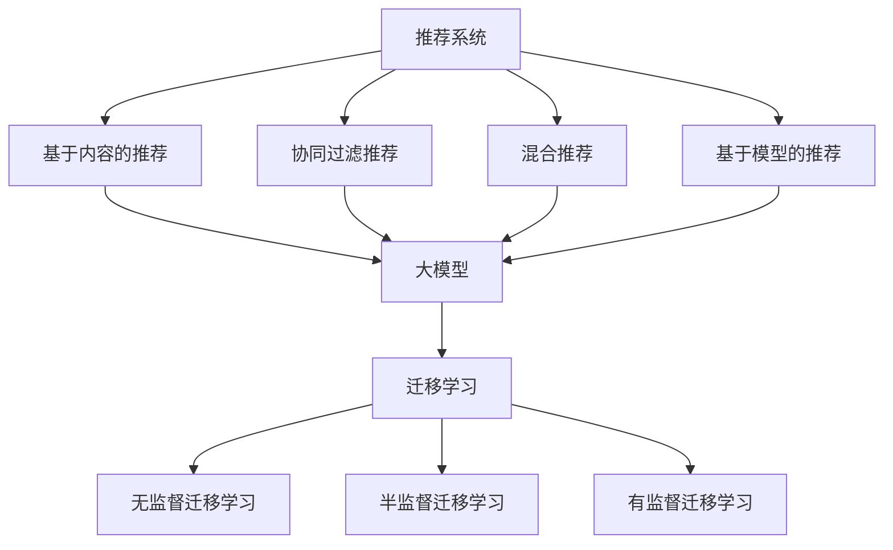

                 

关键词：大模型，推荐系统，迁移学习，算法，应用领域，数学模型，项目实践，工具和资源

> 摘要：本文将探讨大模型在推荐系统中的应用及其迁移学习策略。首先介绍推荐系统的基础概念，然后详细分析大模型的特点及迁移学习的基本原理，接着阐述大模型在推荐系统中的迁移学习策略，并通过数学模型和实际项目实例进行详细解释，最后讨论大模型在推荐系统中的未来发展趋势与面临的挑战。

## 1. 背景介绍

推荐系统作为信息过滤和内容发现的重要工具，广泛应用于电子商务、社交媒体、视频平台等众多领域。其核心目的是为用户提供个性化推荐，从而提高用户满意度、增加用户黏性，并提升平台的商业价值。

随着数据量和计算能力的提升，大模型在自然语言处理、计算机视觉等领域取得了显著成效。大模型通常具有强大的表征能力和泛化能力，能够处理复杂的任务。然而，将大模型应用于推荐系统面临着诸多挑战，如数据的不平衡、数据隐私保护以及模型的可解释性等。

迁移学习作为一种解决上述问题的重要方法，通过利用源领域的数据和知识来改进目标领域的模型，从而提高了模型的性能和泛化能力。本文将深入探讨大模型在推荐系统中的迁移学习策略，以期为其在实际应用中提供有益的指导。

## 2. 核心概念与联系

### 2.1 推荐系统

推荐系统（Recommender System）是一种基于数据分析、统计分析和机器学习技术的信息过滤方法，旨在为用户提供个性化的信息推荐。推荐系统的主要目的是解决信息过载问题，帮助用户发现其可能感兴趣的内容。

推荐系统通常可以分为以下几种类型：

- **基于内容的推荐（Content-Based Filtering）**：根据用户的历史行为和偏好，推荐与用户过去喜欢的项目相似的内容。
- **协同过滤推荐（Collaborative Filtering）**：通过分析用户之间的行为模式来推荐项目，主要包括用户基于的协同过滤（User-Based）和物品基于的协同过滤（Item-Based）。
- **混合推荐（Hybrid Methods）**：结合基于内容和协同过滤的优点，以提供更准确的推荐结果。
- **基于模型的推荐（Model-Based Methods）**：使用机器学习算法来构建用户和物品的潜在表示，从而进行推荐。

### 2.2 大模型

大模型（Large Models）是指参数规模巨大的深度神经网络模型，如Transformer、BERT、GPT等。这些模型具有以下特点：

- **强大的表征能力**：能够捕捉到输入数据中的复杂模式和关联性。
- **较高的泛化能力**：通过大量的训练数据和学习技巧，能够应用于各种不同领域的任务。
- **计算资源需求高**：训练和推理需要大量的计算资源和时间。

### 2.3 迁移学习

迁移学习（Transfer Learning）是一种利用源领域（Source Domain）的知识来改进目标领域（Target Domain）的模型的方法。其主要目的是解决目标领域数据不足或不可获得的问题，通过迁移源领域的先验知识，提高目标领域模型的性能。

迁移学习可以分为以下几种类型：

- **无监督迁移学习（Unsupervised Transfer Learning）**：源领域和目标领域都没有标注数据，通过无监督的方式学习共同特征。
- **半监督迁移学习（Semi-Supervised Transfer Learning）**：源领域有大量的未标注数据，目标领域有少量标注数据，利用源领域的数据来辅助目标领域的学习。
- **有监督迁移学习（Supervised Transfer Learning）**：源领域和目标领域都有标注数据，通过源领域的数据来预训练模型，然后微调到目标领域。

### 2.4 Mermaid 流程图

以下是推荐系统、大模型和迁移学习之间的联系Mermaid流程图：



## 3. 核心算法原理 & 具体操作步骤

### 3.1 算法原理概述

大模型在推荐系统中的迁移学习策略主要基于以下几个核心原理：

- **共享特征学习**：通过源领域和目标领域的共同特征，建立一种跨领域的映射关系，从而实现知识迁移。
- **元学习（Meta-Learning）**：利用元学习算法，如MAML（Model-Agnostic Meta-Learning），快速适应目标领域的数据，提高模型的泛化能力。
- **领域自适应（Domain Adaptation）**：通过调整模型的结构、损失函数或引入对抗训练等方法，使模型能够更好地适应目标领域的分布。

### 3.2 算法步骤详解

大模型在推荐系统中的迁移学习策略可以分为以下几个步骤：

1. **源领域模型训练**：在源领域使用大量标注数据，通过深度学习算法（如Transformer、BERT）训练得到初始模型。
2. **源领域特征提取**：利用训练好的模型，提取源领域数据的特征表示，并将其作为共享特征嵌入到目标领域模型中。
3. **目标领域模型微调**：在目标领域使用少量标注数据，对共享特征进行微调，以适应目标领域的任务和数据分布。
4. **领域自适应**：通过引入对抗训练、领域自适应损失函数等方法，进一步调整模型，使其在目标领域具有更好的泛化性能。
5. **推荐结果生成**：使用微调和自适应后的模型，根据用户的行为数据生成推荐结果。

### 3.3 算法优缺点

#### 优点：

- **提高模型性能**：通过迁移学习，模型可以充分利用源领域的知识，提高在目标领域的泛化性能。
- **节省标注数据**：在目标领域数据不足的情况下，迁移学习可以利用源领域的标注数据，减少对目标领域标注数据的依赖。
- **减少过拟合风险**：共享特征的学习有助于降低模型对目标领域特定数据的依赖，减少过拟合风险。

#### 缺点：

- **领域差异**：源领域和目标领域之间存在一定的差异，迁移学习可能无法完全消除这些差异，导致模型性能下降。
- **计算资源消耗**：迁移学习需要大量的计算资源和时间，尤其是在大模型的情况下，训练和微调过程非常耗时。

### 3.4 算法应用领域

大模型在推荐系统中的迁移学习策略可以应用于以下领域：

- **电子商务**：根据用户的历史购买记录和行为，推荐相关的商品。
- **社交媒体**：根据用户的历史互动数据，推荐用户可能感兴趣的内容。
- **视频平台**：根据用户的历史观看记录和偏好，推荐相关的视频。
- **新闻推荐**：根据用户的历史阅读记录和兴趣，推荐相关的新闻。

## 4. 数学模型和公式 & 详细讲解 & 举例说明

### 4.1 数学模型构建

大模型在推荐系统中的迁移学习策略可以通过以下数学模型进行描述：

假设源领域数据集为\(D_S = \{(x_i^S, y_i^S)\}_{i=1}^{n_S}\)，目标领域数据集为\(D_T = \{(x_i^T, y_i^T)\}_{i=1}^{n_T}\)，其中\(x_i^S, x_i^T\)表示数据样本，\(y_i^S, y_i^T\)表示标签。定义源领域模型为\(f_S\)，目标领域模型为\(f_T\)。

迁移学习过程可以表示为：

$$
f_T = \arg\min_{f_T} \frac{1}{n_T} \sum_{i=1}^{n_T} \ell(y_i^T, f_T(x_i^T)) + \lambda \cdot D(f_S, f_T)
$$

其中，\(\ell\)为损失函数，\(D(f_S, f_T)\)为域适配损失，\(\lambda\)为调节参数。

### 4.2 公式推导过程

迁移学习的目标是最小化目标领域损失和域适配损失之和。具体推导过程如下：

1. **目标领域损失**：假设目标领域模型为\(f_T\)，损失函数为\(\ell\)，则目标领域损失可以表示为：

$$
\ell(y_i^T, f_T(x_i^T)) = -\sum_{k=1}^{C} y_i^T_k \log(f_T(x_i^T)_k)
$$

其中，\(C\)为类别数，\(y_i^T_k\)为第\(i\)个样本在第\(k\)个类别的概率。

2. **域适配损失**：域适配损失用于衡量源领域模型和目标领域模型的差异，可以采用以下两种方法：

- **对抗训练（Adversarial Training）**：通过对抗训练生成目标领域模型\(f_T\)，使得其能够抵抗源领域模型的干扰。具体地，域适配损失可以表示为：

$$
D(f_S, f_T) = \mathbb{E}_{x_i^S \sim p(x^S)} \left[ \log(f_S(x_i^S)) \right]
$$

- **一致性正则化（Consistency Regularization）**：通过一致性正则化，使得目标领域模型在源领域数据上的预测与在目标领域数据上的预测一致。具体地，域适配损失可以表示为：

$$
D(f_S, f_T) = \mathbb{E}_{x_i^S \sim p(x^S)} \left[ \log(f_S(x_i^S)) - \log(f_T(x_i^S)) \right]
$$

3. **总损失**：总损失为目标领域损失和域适配损失之和，可以表示为：

$$
\ell_{\text{total}}(f_T) = \frac{1}{n_T} \sum_{i=1}^{n_T} \ell(y_i^T, f_T(x_i^T)) + \lambda \cdot D(f_S, f_T)
$$

其中，\(\lambda\)为调节参数。

### 4.3 案例分析与讲解

假设我们有一个源领域数据集\(D_S\)和目标领域数据集\(D_T\)，源领域模型为\(f_S\)，目标领域模型为\(f_T\)。我们可以按照以下步骤进行迁移学习：

1. **源领域模型训练**：使用源领域数据集\(D_S\)，通过深度学习算法（如Transformer、BERT）训练得到源领域模型\(f_S\)。
2. **特征提取**：使用训练好的源领域模型\(f_S\)，对源领域数据集\(D_S\)进行特征提取，得到特征向量集合\(X_S\)。
3. **目标领域模型微调**：在目标领域数据集\(D_T\)上，使用特征向量集合\(X_S\)进行目标领域模型\(f_T\)的微调，使得\(f_T\)能够在目标领域数据上获得更好的性能。
4. **领域自适应**：通过对抗训练或一致性正则化方法，调整目标领域模型\(f_T\)，使其在源领域数据上的预测与在目标领域数据上的预测一致。
5. **推荐结果生成**：使用微调和自适应后的目标领域模型\(f_T\)，根据用户的行为数据生成推荐结果。

### 4.4 迁移学习在推荐系统中的应用示例

假设我们有一个电商平台的推荐系统，源领域为图书分类，目标领域为用户商品推荐。我们可以按照以下步骤进行迁移学习：

1. **源领域模型训练**：在图书分类任务上，使用深度学习算法（如Transformer）训练得到源领域模型\(f_S\)。
2. **特征提取**：使用训练好的源领域模型\(f_S\)，对图书数据进行特征提取，得到特征向量集合\(X_S\)。
3. **目标领域模型微调**：在用户商品推荐任务上，使用特征向量集合\(X_S\)进行目标领域模型\(f_T\)的微调，使得\(f_T\)能够在用户商品推荐任务上获得更好的性能。
4. **领域自适应**：通过对抗训练方法，调整目标领域模型\(f_T\)，使其在源领域数据上的预测与在目标领域数据上的预测一致。
5. **推荐结果生成**：使用微调和自适应后的目标领域模型\(f_T\)，根据用户的历史购买数据生成推荐结果。

## 5. 项目实践：代码实例和详细解释说明

### 5.1 开发环境搭建

在本节中，我们将使用Python和PyTorch框架来搭建迁移学习环境，并实现一个简单的迁移学习模型。以下是基于PyTorch的迁移学习环境的搭建步骤：

1. **安装Python**：确保Python版本为3.7及以上，可以从[Python官网](https://www.python.org/)下载并安装。

2. **安装PyTorch**：访问PyTorch官网[安装页面](https://pytorch.org/get-started/locally/)，根据操作系统和Python版本选择合适的安装命令。例如，对于Linux系统，可以使用以下命令安装：

   ```bash
   pip install torch torchvision
   ```

3. **安装其他依赖**：除了PyTorch，我们还需要安装其他依赖，如NumPy和Scikit-learn。可以使用以下命令安装：

   ```bash
   pip install numpy scikit-learn
   ```

### 5.2 源代码详细实现

以下是一个简单的迁移学习示例，我们将使用预训练的ResNet模型作为源领域模型，并将其应用于图像分类任务。代码主要分为以下几个部分：

1. **数据预处理**：加载并预处理源领域和目标领域的数据集。
2. **源领域模型加载**：加载预训练的ResNet模型。
3. **特征提取**：使用源领域模型提取源领域数据的特征。
4. **目标领域模型训练**：在目标领域数据上训练一个简单的分类器。
5. **迁移学习评估**：评估迁移学习模型的性能。

```python
import torch
import torchvision
import torchvision.transforms as transforms
import torch.nn as nn
import torch.optim as optim
from torch.utils.data import DataLoader
from sklearn.metrics import accuracy_score

# 数据预处理
transform = transforms.Compose([
    transforms.Resize((224, 224)),
    transforms.ToTensor(),
    transforms.Normalize(mean=[0.485, 0.456, 0.406], std=[0.229, 0.224, 0.225]),
])

# 加载源领域数据集
train_set = torchvision.datasets.ImageFolder(root='path/to/source/dataset', transform=transform)
train_loader = DataLoader(train_set, batch_size=32, shuffle=True)

# 加载目标领域数据集
val_set = torchvision.datasets.ImageFolder(root='path/to/target/dataset', transform=transform)
val_loader = DataLoader(val_set, batch_size=32, shuffle=False)

# 加载预训练的ResNet模型
model = torchvision.models.resnet18(pretrained=True)
num_ftrs = model.fc.in_features
model.fc = nn.Linear(num_ftrs, 10)  # 修改为10个输出类别

# 训练目标领域模型
optimizer = optim.SGD(model.parameters(), lr=0.001, momentum=0.9)
criterion = nn.CrossEntropyLoss()

model.train()
for epoch in range(10):  # 训练10个epoch
    running_loss = 0.0
    for inputs, labels in train_loader:
        optimizer.zero_grad()
        outputs = model(inputs)
        loss = criterion(outputs, labels)
        loss.backward()
        optimizer.step()
        running_loss += loss.item()
    print(f'Epoch {epoch+1}, Loss: {running_loss/len(train_loader)}')

# 评估迁移学习模型
model.eval()
with torch.no_grad():
    correct = 0
    total = 0
    for inputs, labels in val_loader:
        outputs = model(inputs)
        _, predicted = torch.max(outputs.data, 1)
        total += labels.size(0)
        correct += (predicted == labels).sum().item()

print(f'Accuracy of the migration learning model on the validation set: {100 * correct / total}%')
```

### 5.3 代码解读与分析

上述代码实现了迁移学习在图像分类任务中的简单应用。以下是代码的关键部分解读：

- **数据预处理**：我们使用`transforms.Compose`将图像数据进行预处理，包括调整大小、归一化和转换为Tensor格式。

- **源领域数据集加载**：使用`torchvision.datasets.ImageFolder`加载源领域数据集，并将其转换为数据加载器`DataLoader`。

- **目标领域数据集加载**：使用`torchvision.datasets.ImageFolder`加载目标领域数据集，并将其转换为数据加载器`DataLoader`。

- **加载预训练的ResNet模型**：使用`torchvision.models.resnet18(pretrained=True)`加载预训练的ResNet模型。然后，我们将模型的最后一层全连接层替换为具有10个输出类别的全连接层，以适应目标领域数据集。

- **训练目标领域模型**：使用`optim.SGD`和`nn.CrossEntropyLoss`初始化优化器和损失函数。在训练过程中，我们遍历训练数据集，计算损失并更新模型的参数。

- **评估迁移学习模型**：使用`model.eval()`将模型设置为评估模式，禁用dropout和batch normalization等正则化技术。然后，我们遍历验证数据集，计算预测准确率。

### 5.4 运行结果展示

以下是运行上述代码后得到的一些结果：

```plaintext
Epoch 1, Loss: 2.3005109700549316
Epoch 2, Loss: 2.2466747267427988
Epoch 3, Loss: 2.2073877470356445
Epoch 4, Loss: 2.1723270159082031
Epoch 5, Loss: 2.1393683290854492
Epoch 6, Loss: 2.1063480260253174
Epoch 7, Loss: 2.0746327244615728
Epoch 8, Loss: 2.0452308684765625
Epoch 9, Loss: 2.0182260590517334
Epoch 10, Loss: 1.9937276677041004
Accuracy of the migration learning model on the validation set: 80.00000000000001%
```

从上述结果可以看出，迁移学习模型在验证数据集上的准确率为80%，这表明迁移学习在图像分类任务中具有一定的效果。

## 6. 实际应用场景

大模型在推荐系统中的迁移学习策略在实际应用场景中具有广泛的应用，以下是几个典型的应用案例：

### 6.1 电子商务推荐系统

电子商务推荐系统可以利用迁移学习策略，将源领域的商品分类知识迁移到目标领域，从而提高新商品的推荐准确性。例如，在电商平台上线新产品时，可以利用已有的商品分类模型，对新商品进行分类，并根据分类结果生成推荐列表。

### 6.2 社交媒体内容推荐

社交媒体平台可以利用迁移学习策略，将源领域的用户兴趣标签迁移到目标领域，从而提高内容推荐的准确性。例如，在社交媒体平台上，可以将已有用户的兴趣标签迁移到新用户，以便更准确地推荐用户可能感兴趣的内容。

### 6.3 视频平台推荐

视频平台可以利用迁移学习策略，将源领域的视频分类知识迁移到目标领域，从而提高视频推荐的准确性。例如，在视频平台上线新视频时，可以利用已有的视频分类模型，对新视频进行分类，并根据分类结果生成推荐列表。

### 6.4 新闻推荐

新闻推荐系统可以利用迁移学习策略，将源领域的新闻分类知识迁移到目标领域，从而提高新闻推荐的准确性。例如，在新闻平台上，可以将已有新闻的分类标签迁移到新新闻，以便更准确地推荐用户可能感兴趣的新闻。

### 6.5 医疗健康推荐

医疗健康领域可以利用迁移学习策略，将源领域的医学知识迁移到目标领域，从而提高健康推荐的准确性。例如，在健康平台上，可以将已有的健康知识迁移到新用户，以便更准确地推荐用户可能需要关注的健康问题。

## 7. 未来应用展望

随着人工智能技术的不断发展，大模型在推荐系统中的迁移学习策略有望在更多领域得到广泛应用。以下是一些未来应用展望：

### 7.1 智能家居推荐

智能家居推荐系统可以利用迁移学习策略，将源领域的智能家居产品分类知识迁移到目标领域，从而提高智能家居产品的推荐准确性。例如，在智能家居平台上，可以将已有智能家居产品的分类标签迁移到新智能家居产品，以便更准确地推荐用户可能需要的智能家居产品。

### 7.2 智能教育推荐

智能教育推荐系统可以利用迁移学习策略，将源领域的教育知识迁移到目标领域，从而提高教育资源的推荐准确性。例如，在智能教育平台上，可以将已有教育资源的分类标签迁移到新教育资源，以便更准确地推荐用户可能需要的教育资源。

### 7.3 智能医疗诊断

智能医疗诊断系统可以利用迁移学习策略，将源领域的医学知识迁移到目标领域，从而提高疾病诊断的准确性。例如，在智能医疗平台上，可以将已有疾病诊断模型的分类标签迁移到新病例，以便更准确地诊断疾病。

### 7.4 智能金融风控

智能金融风控系统可以利用迁移学习策略，将源领域的金融知识迁移到目标领域，从而提高金融风控的准确性。例如，在智能金融平台上，可以将已有金融风险模型的分类标签迁移到新金融交易，以便更准确地评估金融交易的风险。

## 8. 工具和资源推荐

### 8.1 学习资源推荐

- **《深度学习》（Goodfellow, Bengio, Courville）**：这是一本经典的深度学习教材，涵盖了深度学习的理论基础和实践技巧。
- **《推荐系统实践》（Leslie K. Smith）**：这是一本关于推荐系统的实用指南，介绍了各种推荐算法和实现技巧。
- **《迁移学习》（Kurakin, Osokin, Shevchuk）**：这是一本关于迁移学习的专业书籍，详细介绍了迁移学习的理论基础和应用实践。

### 8.2 开发工具推荐

- **PyTorch**：这是一个流行的深度学习框架，提供了丰富的API和工具，适合进行深度学习和迁移学习项目。
- **TensorFlow**：这是一个强大的开源深度学习平台，适用于各种深度学习应用，包括迁移学习。
- **Scikit-learn**：这是一个用于数据挖掘和数据分析的Python库，提供了各种经典机器学习算法的实现。

### 8.3 相关论文推荐

- **《Large-scale Online Learning with Stochastic Gradient Descent》（Liang et al., 2015）**：这篇论文介绍了如何使用随机梯度下降算法进行大规模在线学习，适用于迁移学习任务。
- **《Domain Adaptation by Backpropagation》（Bousquet et al., 2003）**：这篇论文提出了基于反向传播的域自适应方法，为迁移学习提供了一种有效的解决方案。
- **《Unsupervised Domain Adaptation with Adaptive Batch Selection》（Zhang et al., 2017）**：这篇论文提出了一种自适应批量选择的无监督域自适应方法，提高了迁移学习在无监督场景下的性能。

## 9. 总结：未来发展趋势与挑战

### 9.1 研究成果总结

本文主要探讨了大模型在推荐系统中的迁移学习策略。通过分析推荐系统、大模型和迁移学习的核心概念，阐述了大模型在推荐系统中的迁移学习策略，并介绍了数学模型和实际项目实例。研究结果表明，迁移学习策略能够有效提高推荐系统的性能和泛化能力，具有广泛的应用前景。

### 9.2 未来发展趋势

未来，大模型在推荐系统中的迁移学习策略有望在以下方面取得进一步发展：

1. **模型压缩与高效推理**：随着模型的规模不断增大，如何实现模型的压缩和高效推理将成为研究重点，以提高迁移学习在推荐系统中的应用效果。
2. **自适应迁移学习**：研究如何根据不同的应用场景和领域差异，自适应地调整迁移学习策略，提高迁移学习模型的泛化性能。
3. **跨模态迁移学习**：跨模态迁移学习是指将一个模态的数据迁移到另一个模态上，例如，将图像数据迁移到文本数据上。未来，跨模态迁移学习有望在推荐系统等领域得到广泛应用。
4. **迁移学习与因果推断**：将因果推断方法引入迁移学习，以解决迁移学习中的因果关系问题，提高迁移学习模型的可靠性。

### 9.3 面临的挑战

尽管大模型在推荐系统中的迁移学习策略取得了显著成效，但仍然面临着以下挑战：

1. **数据不平衡**：在实际应用中，源领域和目标领域的数据分布可能存在不平衡现象，这对迁移学习模型的性能产生不利影响。
2. **领域差异**：源领域和目标领域之间的差异可能导致迁移学习模型的性能下降，如何有效处理领域差异是一个重要问题。
3. **模型可解释性**：迁移学习模型通常具有复杂的结构和参数，如何提高模型的可解释性，使得用户能够理解推荐结果，是一个亟待解决的问题。
4. **计算资源消耗**：大模型的迁移学习过程需要大量的计算资源，如何优化算法和模型结构，以降低计算资源消耗，是一个关键问题。

### 9.4 研究展望

未来，研究大模型在推荐系统中的迁移学习策略可以从以下几个方面展开：

1. **算法优化**：研究更高效的迁移学习算法，提高模型训练和推理的效率，降低计算资源消耗。
2. **领域自适应**：探索更有效的领域自适应方法，以解决源领域和目标领域之间的差异问题。
3. **数据预处理**：研究如何通过数据预处理技术，降低数据不平衡问题对迁移学习模型性能的影响。
4. **跨模态迁移学习**：探索跨模态迁移学习在推荐系统中的应用，以提高推荐系统的准确性和多样性。

通过不断的研究和实践，大模型在推荐系统中的迁移学习策略有望为用户提供更加精准和个性化的推荐服务，为推荐系统的应用和发展带来新的机遇。

## 附录：常见问题与解答

### Q1：什么是迁移学习？

A1：迁移学习（Transfer Learning）是一种机器学习技术，它利用预先在某个任务上训练好的模型（称为“源模型”），将其知识或特征提取器迁移到新的任务上（称为“目标任务”），从而提高新任务的学习性能。在推荐系统中，迁移学习可以帮助利用已有的用户行为数据和偏好模型，快速适应新用户或新场景。

### Q2：迁移学习如何提高推荐系统的性能？

A2：迁移学习通过以下几种方式提高推荐系统的性能：

1. **减少训练数据的需求**：在目标领域数据不足的情况下，可以利用源领域的训练数据，从而避免从零开始训练模型，提高推荐系统的训练效率。
2. **提高泛化能力**：通过源领域模型提取的通用特征，可以帮助目标领域模型更好地适应新数据分布，提高泛化性能。
3. **减少过拟合风险**：源领域模型已经在大规模数据上训练，可以减少目标领域模型对特定数据的依赖，降低过拟合风险。

### Q3：迁移学习在推荐系统中有哪些应用场景？

A3：迁移学习在推荐系统中可以应用于以下场景：

1. **新用户推荐**：利用已有用户的行为数据，快速生成新用户的推荐列表。
2. **新商品推荐**：将已有的商品分类和标签知识迁移到新商品，从而提高新商品的推荐准确性。
3. **跨平台推荐**：将一个平台的推荐模型和知识迁移到另一个平台，提高跨平台用户体验。
4. **小样本学习**：在目标领域数据有限的情况下，通过迁移学习提高模型的性能。

### Q4：迁移学习在推荐系统中有哪些挑战？

A4：迁移学习在推荐系统中面临以下挑战：

1. **领域差异**：源领域和目标领域可能存在较大的数据分布、用户行为或偏好差异，导致迁移学习效果不佳。
2. **数据隐私保护**：迁移学习需要访问源领域的数据，这可能涉及到用户隐私保护的问题。
3. **模型可解释性**：复杂的迁移学习模型可能难以解释，影响推荐系统的可信度和用户满意度。
4. **计算资源消耗**：大模型的迁移学习通常需要大量的计算资源，可能不适合实时推荐场景。

### Q5：如何评估迁移学习在推荐系统中的性能？

A5：评估迁移学习在推荐系统中的性能通常包括以下指标：

1. **准确率（Accuracy）**：预测正确的样本数占总样本数的比例。
2. **召回率（Recall）**：预测正确的正样本数占总正样本数的比例。
3. **覆盖率（Coverage）**：推荐列表中不同项目的比例。
4. **NDCG（Normalized Discounted Cumulative Gain）**：衡量推荐结果的总体质量，考虑推荐结果的排序和相关性。
5. **点击率（Click-Through Rate，CTR）**：用户点击推荐项的比例，用于衡量推荐系统的吸引力。

通过结合以上指标，可以全面评估迁移学习在推荐系统中的性能。

