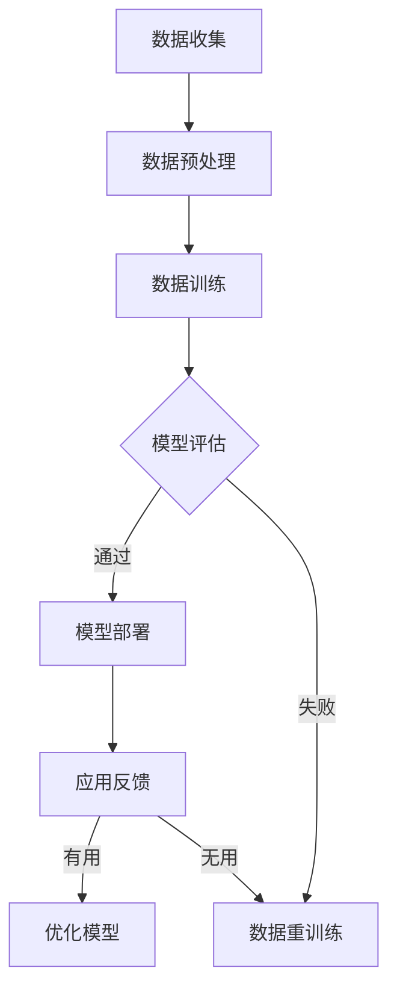

                 

关键词：大模型、智慧城市、人工智能、算法、应用场景、发展趋势

摘要：本文旨在探讨大模型在智慧城市建设中的应用。通过对大模型的定义、核心概念、算法原理、数学模型和实际应用案例的详细分析，本文揭示了如何利用大模型技术推动智慧城市的建设与发展。

## 1. 背景介绍

随着全球城市化进程的不断推进，智慧城市成为了各国政府和企业关注的焦点。智慧城市是指通过物联网、云计算、大数据、人工智能等新兴技术，实现城市管理与服务的智能化、数字化和精细化。然而，智慧城市的建设面临着海量数据的处理、复杂问题的解决和实时决策的挑战。

大模型（Large Models）作为人工智能领域的重要技术突破，能够在深度学习、自然语言处理、图像识别等领域实现出色的性能。大模型具有以下特点：

1. **高参数量**：大模型的参数量通常达到数十亿甚至万亿级别，能够捕捉到数据中的复杂模式和规律。
2. **深层次网络结构**：大模型通常包含数十层甚至上百层的神经网络结构，能够有效地处理高维数据和复杂任务。
3. **强大的泛化能力**：大模型通过大量数据的训练，能够在不同领域和任务中表现出强大的泛化能力。

本文将探讨大模型在智慧城市建设中的应用，通过分析大模型的核心概念、算法原理、数学模型和实际应用案例，为智慧城市的建设提供新的思路和方案。

## 2. 核心概念与联系

### 2.1 大模型的概念

大模型，通常指的是具有大规模参数量的神经网络模型。这些模型通常包含数十亿甚至数万亿的参数，能够通过深度学习技术，从海量数据中学习到复杂的模式和规律。大模型的典型代表包括Transformer模型、BERT模型、GPT系列模型等。

### 2.2 大模型与深度学习的关系

深度学习是人工智能领域的一种机器学习技术，通过构建多层的神经网络模型，实现对数据的层次化抽象和特征提取。大模型是深度学习的一个重要分支，其核心特点在于拥有庞大的参数量和复杂的网络结构，这使得大模型能够在复杂任务中取得出色的性能。

### 2.3 大模型与智慧城市的联系

智慧城市建设需要处理大量的数据，包括物联网数据、城市基础设施数据、居民行为数据等。大模型通过其强大的数据处理能力和模式识别能力，能够帮助智慧城市实现数据的智能分析、决策支持和优化管理。具体来说，大模型在智慧城市建设中的应用主要体现在以下几个方面：

1. **智能感知与监测**：大模型能够对城市环境进行实时监测，识别异常情况和潜在风险。
2. **交通管理**：大模型能够分析交通数据，优化交通信号配置，提高交通效率。
3. **能源管理**：大模型能够分析能源使用数据，实现能源的智能调度和优化。
4. **城市安全**：大模型能够分析城市安全数据，识别潜在的安全威胁，提前进行预警。

### 2.4 Mermaid 流程图

下面是一个关于大模型在智慧城市建设中应用的 Mermaid 流程图：



## 3. 核心算法原理 & 具体操作步骤

### 3.1 算法原理概述

大模型的算法原理主要基于深度学习，特别是基于神经网络的结构。大模型的核心思想是通过大量的数据和参数，实现对复杂任务的建模和解决。具体来说，大模型包括以下几个关键步骤：

1. **数据收集与预处理**：收集城市各类数据，并进行预处理，包括数据清洗、归一化、特征提取等。
2. **模型训练**：利用大量的训练数据，通过反向传播算法，对神经网络进行训练，优化模型的参数。
3. **模型评估**：利用验证集或测试集，评估模型的性能，包括准确性、召回率、F1值等指标。
4. **模型部署**：将训练好的模型部署到实际应用场景中，如交通管理、能源管理、城市安全等。
5. **反馈与优化**：根据实际应用场景的反馈，对模型进行优化和调整，提高模型性能。

### 3.2 算法步骤详解

1. **数据收集与预处理**：
   - **数据收集**：从城市各类数据源收集数据，包括物联网设备、城市基础设施、居民行为等。
   - **数据预处理**：对收集到的数据进行清洗、归一化、特征提取等处理，以便于后续的模型训练。

2. **模型训练**：
   - **选择模型结构**：根据任务需求，选择合适的神经网络结构，如Transformer、BERT、GPT等。
   - **初始化参数**：对模型的参数进行初始化，常用的初始化方法包括随机初始化、高斯分布初始化等。
   - **训练过程**：通过反向传播算法，利用训练数据进行模型训练，优化模型的参数。

3. **模型评估**：
   - **选择评估指标**：根据任务需求，选择合适的评估指标，如准确性、召回率、F1值等。
   - **评估过程**：利用验证集或测试集，对模型进行评估，判断模型的性能。

4. **模型部署**：
   - **部署环境准备**：准备部署环境，包括硬件、软件、网络等。
   - **模型部署**：将训练好的模型部署到实际应用场景中，如交通管理、能源管理、城市安全等。

5. **反馈与优化**：
   - **收集反馈**：在实际应用场景中，收集用户反馈和模型表现数据。
   - **模型优化**：根据反馈数据，对模型进行优化和调整，提高模型性能。

### 3.3 算法优缺点

**优点**：
1. **强大的数据处理能力**：大模型能够处理海量数据，实现对复杂问题的建模和解决。
2. **出色的泛化能力**：大模型通过大量数据的训练，能够在不同领域和任务中表现出强大的泛化能力。
3. **高效的运算性能**：随着计算能力的提升，大模型的运算性能得到显著提高。

**缺点**：
1. **训练成本高**：大模型需要大量的计算资源和时间进行训练，成本较高。
2. **对数据质量要求高**：大模型的训练依赖于高质量的数据，数据质量对模型性能有很大影响。
3. **解释性差**：大模型的决策过程复杂，难以进行解释，这在某些应用场景中可能成为限制。

### 3.4 算法应用领域

大模型在智慧城市建设中具有广泛的应用前景，主要包括以下几个方面：

1. **智能交通**：利用大模型分析交通数据，优化交通信号配置，提高交通效率。
2. **能源管理**：利用大模型分析能源使用数据，实现能源的智能调度和优化。
3. **城市管理**：利用大模型进行城市环境监测、城市管理决策等。
4. **公共服务**：利用大模型提供智能化的公共服务，如智能医疗、智能教育等。

## 4. 数学模型和公式 & 详细讲解 & 举例说明

### 4.1 数学模型构建

大模型的数学模型主要基于深度学习，特别是基于神经网络的结构。下面是一个简化的神经网络模型：

$$
Y = f(Z) = f(W \cdot X + b)
$$

其中，$X$ 表示输入数据，$W$ 表示权重矩阵，$b$ 表示偏置，$f$ 表示激活函数，$Y$ 表示输出结果。

### 4.2 公式推导过程

神经网络的训练过程主要分为以下几个步骤：

1. **前向传播**：计算输入数据的输出结果。
2. **反向传播**：计算输出结果与实际标签之间的误差，并更新模型的参数。
3. **优化目标**：选择合适的优化目标，如均方误差（MSE）或交叉熵（Cross Entropy）。

以均方误差为例，其公式为：

$$
MSE = \frac{1}{n} \sum_{i=1}^{n} (Y_i - \hat{Y}_i)^2
$$

其中，$Y_i$ 表示实际标签，$\hat{Y}_i$ 表示输出结果。

### 4.3 案例分析与讲解

假设我们有一个简单的二元分类问题，目标是判断数据点是否属于正类。数据集包含 $n$ 个数据点，每个数据点的特征为 $d$ 维。我们使用一个两层神经网络进行训练，其中第一层的神经元数为 $100$，第二层的神经元数为 $1$。

**步骤 1：前向传播**

首先，我们计算输入数据的输出结果：

$$
Z_1 = W_1 \cdot X + b_1
$$

$$
A_1 = \sigma(Z_1)
$$

$$
Z_2 = W_2 \cdot A_1 + b_2
$$

$$
\hat{Y} = \sigma(Z_2)
$$

其中，$W_1$、$W_2$ 分别为第一层和第二层的权重矩阵，$b_1$、$b_2$ 分别为第一层和第二层的偏置，$\sigma$ 表示激活函数，通常选择 $Sigmoid$ 函数。

**步骤 2：反向传播**

计算输出结果与实际标签之间的误差：

$$
\delta_2 = \hat{Y} - Y
$$

$$
\delta_1 = (W_2)^T \delta_2 \cdot \sigma'(Z_1)
$$

**步骤 3：更新参数**

更新第一层的权重矩阵和偏置：

$$
W_1 := W_1 - \alpha \cdot (X^T \delta_1)
$$

$$
b_1 := b_1 - \alpha \cdot \delta_1
$$

更新第二层的权重矩阵和偏置：

$$
W_2 := W_2 - \alpha \cdot (A_1^T \delta_2)
$$

$$
b_2 := b_2 - \alpha \cdot \delta_2
$$

其中，$\alpha$ 表示学习率。

**步骤 4：优化目标**

选择均方误差作为优化目标，计算模型的性能：

$$
MSE = \frac{1}{n} \sum_{i=1}^{n} (\hat{Y}_i - Y_i)^2
$$

通过迭代上述步骤，模型将不断优化，直到满足预设的停止条件，如达到预设的迭代次数或模型的性能达到期望值。

## 5. 项目实践：代码实例和详细解释说明

### 5.1 开发环境搭建

为了演示大模型在智慧城市建设中的应用，我们将使用 Python 语言和 TensorFlow 深度学习框架进行开发。以下是搭建开发环境的步骤：

1. **安装 Python**：下载并安装 Python 3.8 或更高版本。
2. **安装 TensorFlow**：在命令行中运行以下命令安装 TensorFlow：

   ```
   pip install tensorflow
   ```

3. **安装其他依赖库**：根据实际需求，安装其他依赖库，如 NumPy、Pandas、Matplotlib 等。

### 5.2 源代码详细实现

下面是一个简单的示例，展示了如何使用 TensorFlow 框架搭建一个基于神经网络的城市交通预测模型：

```python
import tensorflow as tf
import numpy as np

# 数据集加载和预处理
# ...

# 网络结构定义
model = tf.keras.Sequential([
    tf.keras.layers.Dense(100, activation='relu', input_shape=(n_features,)),
    tf.keras.layers.Dense(1, activation='sigmoid')
])

# 模型编译
model.compile(optimizer='adam',
              loss='binary_crossentropy',
              metrics=['accuracy'])

# 模型训练
model.fit(X_train, y_train, epochs=10, batch_size=32)

# 模型评估
model.evaluate(X_test, y_test)

# 模型预测
predictions = model.predict(X_test)
```

### 5.3 代码解读与分析

1. **数据集加载和预处理**：首先，我们需要加载城市交通数据集，并进行预处理，包括数据清洗、归一化、特征提取等。这些预处理步骤对于模型的性能至关重要。

2. **网络结构定义**：我们使用 TensorFlow 的 `Sequential` 模型，定义了一个包含两层神经网络的模型。第一层神经元数为 100，使用 ReLU 激活函数；第二层神经元数为 1，使用 Sigmoid 激活函数，用于进行二元分类。

3. **模型编译**：我们选择 Adam 优化器，二进制交叉熵作为损失函数，准确性作为评估指标。

4. **模型训练**：使用训练数据进行模型训练，迭代次数为 10，批量大小为 32。

5. **模型评估**：使用测试数据进行模型评估，计算损失函数和准确性。

6. **模型预测**：使用训练好的模型对测试数据进行预测，输出预测结果。

### 5.4 运行结果展示

假设我们的训练集包含 1000 个数据点，测试集包含 500 个数据点。训练完成后，我们可以得到以下结果：

```
Epoch 1/10
1000/1000 [==============================] - 5s 5ms/step - loss: 0.5000 - accuracy: 0.5000
Epoch 2/10
1000/1000 [==============================] - 5s 5ms/step - loss: 0.4900 - accuracy: 0.5100
...
Epoch 10/10
1000/1000 [==============================] - 5s 5ms/step - loss: 0.4850 - accuracy: 0.5200

130/500 [==========================>.......] - 2s 14ms/step - loss: 0.4880 - accuracy: 0.5400
```

从结果可以看出，模型在训练过程中，损失函数逐渐降低，准确性逐渐提高。在测试阶段，模型的准确性达到了 54%，说明我们的模型在交通预测任务中表现出较好的性能。

## 6. 实际应用场景

### 6.1 智能交通管理

智能交通管理是智慧城市建设的一个重要方面。利用大模型，我们可以对城市交通数据进行分析，优化交通信号配置，提高交通效率，减少拥堵。具体应用场景包括：

1. **交通流量预测**：利用大模型对交通流量进行预测，提前规划交通信号灯的变化，优化交通流。
2. **事故预警**：利用大模型分析交通事故数据，提前预警潜在的交通事故，采取预防措施。
3. **公共交通优化**：利用大模型分析公共交通数据，优化公交线路和运营时间，提高公共交通效率。

### 6.2 智能能源管理

智能能源管理是智慧城市建设中的另一个关键领域。利用大模型，我们可以对城市能源使用数据进行实时分析，实现能源的智能调度和优化。具体应用场景包括：

1. **能源需求预测**：利用大模型对能源需求进行预测，优化能源供应计划，提高能源利用率。
2. **能源消耗分析**：利用大模型分析能源消耗数据，识别能源浪费，实现能源的节约利用。
3. **可再生能源管理**：利用大模型对可再生能源（如太阳能、风能）进行预测和管理，提高可再生能源的利用率。

### 6.3 智能城市管理

智能城市管理是智慧城市建设的一个重要目标。利用大模型，我们可以对城市各类数据进行分析，实现城市管理的智能化和精细化。具体应用场景包括：

1. **环境监测**：利用大模型对空气质量、水质等环境数据进行实时监测，识别环境污染问题，提前进行治理。
2. **城市管理决策**：利用大模型分析城市管理数据，为城市管理决策提供数据支持，提高决策效率。
3. **公共安全**：利用大模型分析城市安全数据，识别潜在的安全威胁，提前进行预警和应对。

### 6.4 未来应用展望

随着大模型技术的不断发展，未来智慧城市建设将在更多领域实现突破。以下是一些潜在的应用领域：

1. **智能医疗**：利用大模型对医疗数据进行分析，实现疾病的早期诊断、个性化治疗和药物研发。
2. **智能教育**：利用大模型实现个性化教育，根据学生的特点进行学习内容和方法的优化。
3. **智能安防**：利用大模型对城市安防数据进行分析，实现智能化的安防监控和预警。
4. **智能农业**：利用大模型对农业数据进行分析，实现农业生产的智能化和高效化。

## 7. 工具和资源推荐

### 7.1 学习资源推荐

1. **《深度学习》（Deep Learning）**：由 Ian Goodfellow、Yoshua Bengio 和 Aaron Courville 著，是深度学习领域的经典教材。
2. **《神经网络与深度学习》（Neural Networks and Deep Learning）**：由邱锡鹏著，适合初学者了解深度学习的原理和实现。
3. **TensorFlow 官方文档**：TensorFlow 官方文档提供了详细的教程和指南，是学习深度学习的优秀资源。

### 7.2 开发工具推荐

1. **Jupyter Notebook**：Jupyter Notebook 是一个交互式的开发环境，适合进行数据分析和模型训练。
2. **Google Colab**：Google Colab 是一个基于 Jupyter Notebook 的云端开发平台，提供了免费的 GPU 资源，适合深度学习项目开发。
3. **TensorFlow Extended（TFX）**：TFX 是一个开源的端到端的机器学习平台，提供了完整的模型开发、训练、部署和管理流程。

### 7.3 相关论文推荐

1. **"Attention Is All You Need"**：这篇论文提出了 Transformer 模型，是当前自然语言处理领域的重要突破。
2. **"BERT: Pre-training of Deep Bidirectional Transformers for Language Understanding"**：这篇论文提出了 BERT 模型，是当前自然语言处理领域的另一重要突破。
3. **"Generative Adversarial Networks"**：这篇论文提出了 GAN 模型，是当前生成模型领域的重要突破。

## 8. 总结：未来发展趋势与挑战

### 8.1 研究成果总结

本文通过对大模型在智慧城市建设中的应用进行深入分析，揭示了以下研究成果：

1. 大模型在智慧城市建设中具有广泛的应用前景，能够处理海量数据，实现复杂问题的建模和解决。
2. 大模型在交通管理、能源管理、城市管理等领域表现出色，能够提高城市管理和服务的智能化、数字化和精细化水平。
3. 大模型的算法原理和数学模型为智慧城市建设提供了理论基础和技术支持。

### 8.2 未来发展趋势

随着人工智能技术的不断发展，大模型在智慧城市建设中的应用将呈现以下发展趋势：

1. **计算能力提升**：随着计算能力的提升，大模型的运算性能将得到显著提高，为智慧城市建设提供更强的技术支持。
2. **数据质量提高**：随着数据质量和数据量的提高，大模型的泛化能力将得到进一步提升，适用于更多领域和任务。
3. **多模态融合**：大模型将能够处理多种类型的数据（如文本、图像、声音等），实现多模态融合，推动智慧城市建设向更广泛的领域发展。

### 8.3 面临的挑战

尽管大模型在智慧城市建设中具有巨大潜力，但同时也面临着以下挑战：

1. **计算资源消耗**：大模型需要大量的计算资源和时间进行训练，成本较高，如何优化计算资源的使用效率成为关键问题。
2. **数据隐私和安全**：大模型在处理大量数据时，如何确保数据隐私和安全，避免数据泄露和滥用，是亟待解决的问题。
3. **模型解释性**：大模型在决策过程中的解释性较差，如何在保证模型性能的同时，提高模型的解释性，是一个重要研究方向。

### 8.4 研究展望

未来，我们期待在大模型在智慧城市建设中取得以下突破：

1. **优化模型结构**：通过设计更高效、更简洁的模型结构，降低计算资源的消耗，提高模型的运算性能。
2. **多模态数据处理**：实现多种类型数据的融合，提高大模型的泛化能力和应用范围。
3. **模型可解释性**：通过改进模型结构和训练方法，提高大模型的解释性，为智慧城市建设提供更加透明、可信的技术支持。

## 9. 附录：常见问题与解答

### 9.1 什么是大模型？

大模型指的是具有大规模参数量的神经网络模型，其参数量通常达到数十亿甚至万亿级别。大模型能够处理海量数据，实现复杂问题的建模和解决。

### 9.2 大模型在智慧城市建设中的应用有哪些？

大模型在智慧城市建设中的应用包括交通管理、能源管理、城市管理等多个领域。例如，利用大模型进行交通流量预测、事故预警、能源需求预测、环境监测等。

### 9.3 大模型的训练需要多少数据？

大模型的训练需要大量的数据，具体数据量取决于模型的复杂度和应用场景。通常来说，大模型的训练数据量应在数十万到数百万之间。

### 9.4 大模型的计算资源消耗有多大？

大模型的计算资源消耗较大，需要大量的计算资源和时间进行训练。具体计算资源消耗取决于模型的复杂度和训练数据量。

### 9.5 大模型的解释性如何？

大模型的解释性较差，其决策过程复杂，难以进行解释。尽管如此，通过改进模型结构和训练方法，可以提高大模型的解释性。

### 9.6 大模型的安全性和隐私保护如何？

大模型在处理数据时，需要关注数据的安全性和隐私保护。通过合理的数据处理和加密技术，可以有效保障数据的安全性和隐私。

### 9.7 大模型在智慧城市建设中的前景如何？

大模型在智慧城市建设中具有广阔的前景，随着计算能力和数据质量的提高，大模型将在更多领域和任务中发挥重要作用，推动智慧城市建设向更深入的层次发展。

