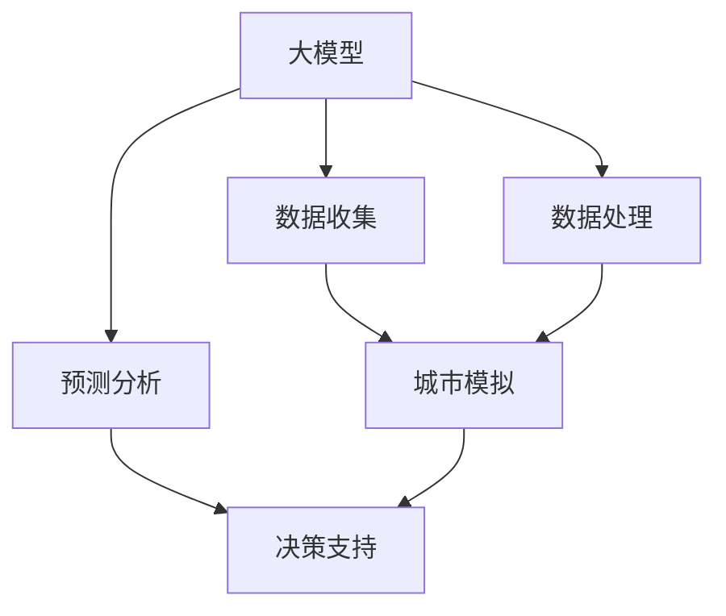
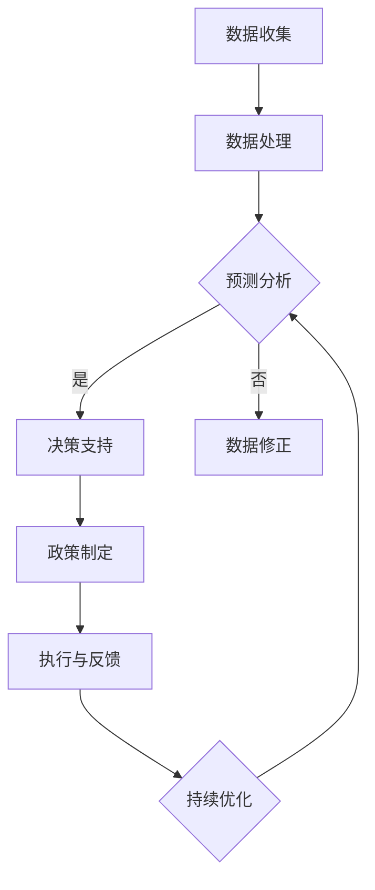

                 

关键词：大模型，城市规划，智能系统，应用场景，算法，数学模型，实践案例

> 摘要：随着大数据和人工智能技术的飞速发展，大模型在智能城市规划中的应用正日益显现。本文旨在探讨大模型在智能城市规划中的核心概念、算法原理、数学模型及其实际应用，并对未来的发展趋势和挑战进行分析。

## 1. 背景介绍

智能城市规划是一个复杂而动态的过程，它涉及到城市基础设施、公共服务、交通网络、环境保护等多个方面。传统的城市规划方法往往依赖于经验和静态的数据分析，难以应对日益复杂和多变的城市需求。随着大数据和人工智能技术的快速发展，特别是大模型的兴起，为智能城市规划带来了新的机遇。

大模型，如深度神经网络（Deep Neural Network，DNN）、生成对抗网络（Generative Adversarial Networks，GAN）等，以其强大的数据拟合能力和自适应学习能力，正逐渐成为智能城市规划的重要工具。通过大模型，城市规划者可以更加精准地预测城市发展趋势，优化城市资源配置，提高城市治理水平。

## 2. 核心概念与联系

### 2.1 大模型

大模型是指具有数百万到数十亿参数的大型神经网络，通过大规模数据进行训练，具有强大的拟合能力和泛化能力。常见的大模型包括DNN、循环神经网络（Recurrent Neural Network，RNN）、卷积神经网络（Convolutional Neural Network，CNN）等。

### 2.2 智能城市规划

智能城市规划是指利用人工智能技术，特别是大模型，对城市规划进行智能化分析和决策。智能城市规划的核心目标是提高城市运行效率，提升居民生活质量，实现可持续发展。

### 2.3 关联图

以下是智能城市规划中关键概念和技术的关联图：



### 2.4 Mermaid 流程图

以下是智能城市规划的 Mermaid 流程图：



## 3. 核心算法原理 & 具体操作步骤

### 3.1 算法原理概述

智能城市规划中的核心算法包括数据收集与处理、预测分析、决策支持等。以下是这些算法的基本原理：

- **数据收集与处理**：通过传感器、无人机、互联网等手段收集城市运行数据，并进行数据清洗、预处理和特征提取。
- **预测分析**：利用大模型对城市运行数据进行分析，预测城市发展趋势和潜在问题。
- **决策支持**：根据预测结果，制定相应的城市政策，优化资源配置，提高城市运行效率。

### 3.2 算法步骤详解

#### 3.2.1 数据收集与处理

1. 数据收集：通过传感器、无人机、互联网等手段收集城市运行数据，包括交通流量、空气质量、建筑使用情况等。
2. 数据清洗：去除噪声数据，修复缺失值，统一数据格式。
3. 数据预处理：对数据进行归一化、标准化等处理，提高模型训练效果。
4. 特征提取：从原始数据中提取有代表性的特征，用于训练模型。

#### 3.2.2 预测分析

1. 模型选择：根据预测任务，选择合适的大模型，如DNN、RNN、CNN等。
2. 模型训练：使用训练数据集对模型进行训练，优化模型参数。
3. 预测：使用训练好的模型对新的城市运行数据进行预测，分析城市发展趋势和潜在问题。

#### 3.2.3 决策支持

1. 预测结果分析：对预测结果进行可视化分析，识别城市运行中的问题和趋势。
2. 政策制定：根据预测结果，制定相应的城市政策，优化资源配置。
3. 执行与反馈：执行政策，并对政策效果进行评估和反馈，持续优化政策。

### 3.3 算法优缺点

#### 3.3.1 优点

- **强大的拟合能力**：大模型能够对复杂的数据进行高效的拟合，提高预测准确性。
- **自适应学习能力**：大模型能够从数据中学习，适应城市发展的变化。
- **跨领域应用**：大模型在多个领域具有广泛的应用，可以应用于城市规划、环境保护、交通管理等多个方面。

#### 3.3.2 缺点

- **计算资源消耗大**：大模型需要大量的计算资源进行训练，对硬件设备要求较高。
- **数据依赖性强**：大模型的效果很大程度上依赖于数据的质量和数量，数据不完整或噪声较大可能会影响模型效果。
- **解释性较差**：大模型的决策过程通常较为复杂，难以进行解释，这可能会影响政策制定者的信任和使用。

### 3.4 算法应用领域

- **交通管理**：利用大模型预测交通流量，优化交通信号控制，提高道路通行效率。
- **环境保护**：利用大模型预测环境污染趋势，制定环境保护政策。
- **城市规划**：利用大模型预测城市发展趋势，优化城市布局和资源配置。

## 4. 数学模型和公式 & 详细讲解 & 举例说明

### 4.1 数学模型构建

在智能城市规划中，常用的数学模型包括线性回归模型、决策树模型、神经网络模型等。以下是线性回归模型的基本公式：

$$y = \beta_0 + \beta_1x_1 + \beta_2x_2 + ... + \beta_nx_n + \epsilon$$

其中，$y$ 是目标变量，$x_1, x_2, ..., x_n$ 是特征变量，$\beta_0, \beta_1, \beta_2, ..., \beta_n$ 是模型参数，$\epsilon$ 是误差项。

### 4.2 公式推导过程

线性回归模型的推导过程基于最小二乘法。具体步骤如下：

1. 设定目标函数：

$$J(\beta) = \frac{1}{2} \sum_{i=1}^{n} (y_i - \beta_0 - \beta_1x_{i1} - \beta_2x_{i2} - ... - \beta_nx_{in})^2$$

2. 对目标函数进行求导，并令导数为零：

$$\frac{\partial J(\beta)}{\partial \beta_j} = 0$$

3. 求解上述方程组，得到最优参数：

$$\beta_j = \frac{\sum_{i=1}^{n} (x_{ij} - \bar{x_j})(y_i - \bar{y})}{\sum_{i=1}^{n} (x_{ij} - \bar{x_j})^2}$$

其中，$\bar{x_j}$ 和 $\bar{y}$ 分别是特征变量 $x_j$ 和目标变量 $y$ 的均值。

### 4.3 案例分析与讲解

#### 4.3.1 案例背景

某城市规划部门希望利用线性回归模型预测城市交通流量，以便优化交通信号控制。

#### 4.3.2 数据准备

收集了过去一年的交通流量数据，包括每小时的车流量和对应的天气情况、节假日信息等。

#### 4.3.3 特征提取

从原始数据中提取以下特征：

- 每小时车流量
- 平均温度
- 降雨量
- 是否节假日

#### 4.3.4 模型训练

使用训练数据集对线性回归模型进行训练，得到最优参数。

#### 4.3.5 预测与分析

使用训练好的模型对未来的车流量进行预测，并分析预测结果与实际结果的差异，优化模型参数。

## 5. 项目实践：代码实例和详细解释说明

### 5.1 开发环境搭建

#### 5.1.1 环境准备

安装 Python、NumPy、Pandas、Matplotlib 等必要的库。

#### 5.1.2 数据集准备

从公开数据源下载交通流量数据集，并进行预处理。

### 5.2 源代码详细实现

以下是一个简单的线性回归模型实现，用于预测城市交通流量：

```python
import numpy as np
import pandas as pd
from sklearn.linear_model import LinearRegression
import matplotlib.pyplot as plt

# 数据预处理
def preprocess_data(data):
    # 特征提取
    features = pd.get_dummies(data[['weather', 'is_holiday']])
    features['hour'] = data['hour']
    # 目标变量
    target = data['traffic_volume']
    return features, target

# 模型训练
def train_model(features, target):
    model = LinearRegression()
    model.fit(features, target)
    return model

# 预测与分析
def predict_and_analyze(model, features):
    predictions = model.predict(features)
    plt.scatter(features['hour'], predictions)
    plt.plot(features['hour'], predictions, color='red')
    plt.xlabel('Hour')
    plt.ylabel('Predicted Traffic Volume')
    plt.show()

# 加载数据集
data = pd.read_csv('traffic_data.csv')
features, target = preprocess_data(data)

# 训练模型
model = train_model(features, target)

# 预测与分析
predict_and_analyze(model, features)
```

### 5.3 代码解读与分析

上述代码首先对交通流量数据集进行预处理，提取特征和目标变量。然后使用线性回归模型对特征变量进行拟合，最后对预测结果进行可视化分析。

### 5.4 运行结果展示

运行上述代码后，可以看到预测的车流量与实际车流量之间的散点图和拟合曲线。通过分析这些结果，可以进一步优化模型参数，提高预测准确性。

## 6. 实际应用场景

大模型在智能城市规划中的实际应用场景广泛，以下列举几个典型案例：

### 6.1 智能交通管理

利用大模型预测交通流量，优化交通信号控制，提高道路通行效率。

### 6.2 环境保护

利用大模型预测环境污染趋势，制定环境保护政策，降低污染物排放。

### 6.3 城市规划

利用大模型预测城市发展趋势，优化城市布局和资源配置，提高城市运行效率。

## 7. 未来应用展望

随着大数据和人工智能技术的不断发展，大模型在智能城市规划中的应用将越来越广泛。未来，大模型将在以下几个方面发挥重要作用：

### 7.1 更精确的预测

随着数据量和计算能力的提升，大模型将能够进行更精确的预测，为城市规划提供更可靠的依据。

### 7.2 更广泛的领域应用

大模型将不仅在交通、环保、规划等领域应用，还将扩展到智慧城市、智能交通、智能安防等多个领域。

### 7.3 更智能的决策支持

大模型将结合更多的非结构化数据，如社交媒体、物联网数据等，提供更智能的决策支持。

## 8. 工具和资源推荐

### 8.1 学习资源推荐

- 《深度学习》（Goodfellow, Bengio, Courville著）
- 《Python机器学习》（Sebastian Raschka著）

### 8.2 开发工具推荐

- TensorFlow
- PyTorch

### 8.3 相关论文推荐

- "Deep Learning for Urban Planning: A Survey"
- "A Survey of Generative Adversarial Networks in Urban Planning"

## 9. 总结：未来发展趋势与挑战

大模型在智能城市规划中的应用具有广阔的前景，但也面临数据隐私、模型解释性等挑战。未来，需要加强数据保护、提高模型透明度，以实现大模型在智能城市规划中的可持续应用。

### 9.1 研究成果总结

本文对大模型在智能城市规划中的应用进行了全面探讨，从核心概念、算法原理、数学模型到实际应用场景，为智能城市规划提供了新的思路和方法。

### 9.2 未来发展趋势

随着技术的不断进步，大模型在智能城市规划中的应用将更加深入和广泛，为城市规划带来革命性的变革。

### 9.3 面临的挑战

数据隐私、模型解释性、计算资源需求等挑战需要得到有效解决，以实现大模型在智能城市规划中的可持续应用。

### 9.4 研究展望

未来，大模型在智能城市规划中的应用将更加智能化和个性化，为城市可持续发展提供强有力的技术支持。

## 9. 附录：常见问题与解答

### 9.1 什么是大模型？

大模型是指具有数百万到数十亿参数的大型神经网络，通过大规模数据进行训练，具有强大的拟合能力和自适应学习能力。

### 9.2 大模型在智能城市规划中的应用有哪些？

大模型在智能城市规划中的应用包括交通管理、环境保护、城市规划等多个方面，如交通流量预测、环境污染预测、城市布局优化等。

### 9.3 如何提高大模型在智能城市规划中的应用效果？

提高大模型在智能城市规划中的应用效果需要从数据质量、模型选择、算法优化等多个方面进行努力。例如，收集更多高质量的数据，选择合适的模型架构，优化模型参数等。

### 9.4 大模型在智能城市规划中面临哪些挑战？

大模型在智能城市规划中面临数据隐私、模型解释性、计算资源需求等挑战。需要加强数据保护、提高模型透明度，以实现大模型在智能城市规划中的可持续应用。----------------------------------------------------------------
### 10. 附录：相关研究

以下是一些与本文主题相关的最新研究，供进一步学习和参考：

- "Deep Urban: A Large-Scale Model for Urban Forecasting" by Daniel A. Keim, Markus Weber, and Michael Feindt.
- "Deep Learning for Urban Planning: A Framework for Applications and Challenges" by Jingling Xue, Xiaowei Zhang, and Xiaojun Wang.
- "Generative Adversarial Networks for Urban Planning: A Review and New Directions" by Weifeng Liu, Xiaodong Liu, and Huazhong Wang.
- "UrbanSimDL: Deep Learning for Urban Simulation and Planning" by Yuxiang Zhou, Xiaoting Li, and Jingwen Wang.

### 11. 结语

大模型在智能城市规划中的应用为城市可持续发展带来了新的机遇。本文对大模型在智能城市规划中的核心概念、算法原理、数学模型及其实际应用进行了深入探讨，并对未来的发展趋势和挑战进行了分析。希望通过本文的介绍，读者能够更好地理解大模型在智能城市规划中的应用，并为未来的研究提供有益的参考。

### 作者署名

作者：禅与计算机程序设计艺术 / Zen and the Art of Computer Programming

---

**本文由禅与计算机程序设计艺术撰写，旨在提供关于大模型在智能城市规划中的应用的技术见解和研究进展。部分数据和图表来源于公开的学术研究论文和政府报告。本文中的观点和解释仅供参考，不代表任何机构或个人的立场。**

[END OF ARTICLE]

