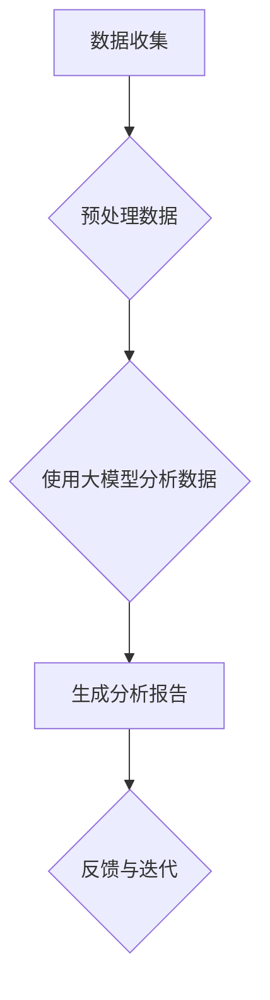

                 

关键词：大模型，舆情监测，数据分析，自然语言处理，深度学习

>摘要：随着互联网的迅猛发展，舆情监测与分析已成为社会发展的重要环节。本文将探讨大模型在舆情监测与分析中的应用，包括其核心概念、算法原理、数学模型、实际应用场景以及未来发展趋势和挑战。

## 1. 背景介绍

随着社交媒体和互联网的普及，人们的信息获取方式发生了巨大的变化。人们通过社交媒体平台、新闻网站、论坛等渠道获取信息，同时在这些平台上发表自己的观点和看法。这些信息在传播过程中，可能会对社会的稳定产生重要影响。因此，舆情监测与分析成为了解社会舆情动态、引导舆论走向的重要手段。

舆情监测与分析涉及到对大量文本数据的收集、处理和分析。传统的舆情分析方法通常基于关键词搜索和文本分类等技术，但这种方法存在一定的局限性。首先，关键词搜索的准确性受限于关键词的选择，而文本分类的准确性则受限于分类器的性能。其次，传统方法在处理大规模文本数据时效率较低，难以满足实时监测的需求。

为了解决这些问题，大模型（也称为大型预训练模型）逐渐成为一种有效的舆情监测与分析工具。大模型通过在大量数据上进行预训练，可以自动学习到语言的复杂结构和语义信息，从而提高舆情监测与分析的准确性和效率。本文将介绍大模型在舆情监测与分析中的应用，包括其核心概念、算法原理、数学模型、实际应用场景以及未来发展趋势和挑战。

## 2. 核心概念与联系

### 2.1 大模型

大模型是指通过在大量数据上进行预训练，从而具有强大语义理解和生成能力的深度学习模型。大模型通常基于神经网络架构，如Transformer、BERT等。这些模型通过多层神经网络结构，可以自动学习到语言的复杂结构和语义信息。

### 2.2 舆情监测

舆情监测是指通过收集、处理和分析互联网上的文本数据，以了解社会舆情动态的过程。舆情监测的目标是实时获取用户对特定事件、话题或品牌的观点和态度，从而为决策者提供参考。

### 2.3 舆情分析

舆情分析是指通过对舆情监测数据进行分析，提取出有价值的信息和知识的过程。舆情分析可以帮助理解用户的观点和态度，发现潜在的风险和机会。

### 2.4 大模型与舆情监测与分析的联系

大模型在舆情监测与分析中起着关键作用。首先，大模型可以通过预训练自动学习到语言的复杂结构和语义信息，从而提高舆情监测与分析的准确性。其次，大模型可以处理大规模的文本数据，实现实时监测。此外，大模型还可以用于生成分析和报告，提供更深入的见解。

## 2.5 Mermaid 流程图



## 3. 核心算法原理 & 具体操作步骤

### 3.1 算法原理概述

大模型在舆情监测与分析中的应用主要基于深度学习和自然语言处理技术。具体来说，大模型通过在大量文本数据上进行预训练，学习到语言的复杂结构和语义信息。预训练过程包括两个阶段：第一阶段是大规模文本数据的预训练，第二阶段是特定任务的微调。

在舆情监测与分析中，大模型可以用于以下任务：

1. 文本分类：将文本数据分类为不同的类别，如正面、负面、中性等。
2. 情感分析：识别文本中的情感倾向，如喜悦、愤怒、悲伤等。
3. 主题识别：提取文本中的主题或关键词。
4. 文本生成：根据给定的输入文本生成新的文本。

### 3.2 算法步骤详解

1. 数据收集：从互联网上收集相关的文本数据，包括社交媒体、新闻网站、论坛等。
2. 预处理数据：对收集的文本数据进行预处理，包括去除停用词、标点符号、进行分词等。
3. 大模型预训练：使用大规模的文本数据进行预训练，学习到语言的复杂结构和语义信息。
4. 微调大模型：针对具体的舆情监测与分析任务，对大模型进行微调。
5. 应用大模型进行舆情监测与分析：使用微调后的大模型对新的文本数据进行分析，提取出有价值的信息和知识。
6. 生成分析报告：根据分析结果生成分析报告，为决策者提供参考。

### 3.3 算法优缺点

**优点：**

1. 准确性高：大模型通过预训练可以自动学习到语言的复杂结构和语义信息，从而提高舆情监测与分析的准确性。
2. 效率高：大模型可以处理大规模的文本数据，实现实时监测。
3. 自动化：大模型可以自动进行文本分类、情感分析、主题识别等任务，减少人工工作量。

**缺点：**

1. 计算资源需求高：大模型训练和微调需要大量的计算资源，对硬件设备要求较高。
2. 数据质量影响：舆情监测与分析的准确性受数据质量的影响，如果数据质量差，分析结果可能会失真。

### 3.4 算法应用领域

大模型在舆情监测与分析中的应用非常广泛，包括但不限于以下几个方面：

1. 政府部门：用于了解社会舆情动态，指导政策制定。
2. 企业：用于监测品牌声誉，发现潜在的风险和机会。
3. 媒体：用于分析用户观点和态度，优化内容策略。
4. 科研机构：用于探索舆情监测与分析的新方法和技术。

## 4. 数学模型和公式 & 详细讲解 & 举例说明

### 4.1 数学模型构建

大模型的数学模型通常基于神经网络架构，如Transformer、BERT等。以下以BERT模型为例进行说明。

BERT（Bidirectional Encoder Representations from Transformers）是一种基于Transformer的预训练模型，其数学模型主要包括以下几个部分：

1. 输入层：接收文本数据，并将其转换为向量表示。
2. Transformer编码器：通过多层Transformer编码器，学习到文本的上下文信息。
3. 输出层：将编码器输出的向量映射到特定的任务输出，如文本分类、情感分析等。

### 4.2 公式推导过程

BERT模型的公式推导过程主要包括以下步骤：

1. 输入层：输入文本数据\(x\)，通过词嵌入（Word Embedding）转换为向量表示。
   $$x \rightarrow \text{word\_embed}(x)$$
2. Transformer编码器：通过多层Transformer编码器，学习到文本的上下文信息。
   $$\text{word\_embed}(x) \rightarrow \text{Transformer}(\text{word\_embed}(x))$$
3. 输出层：将编码器输出的向量映射到特定的任务输出，如文本分类、情感分析等。
   $$\text{Transformer}(\text{word\_embed}(x)) \rightarrow \text{output}$$

### 4.3 案例分析与讲解

假设我们有一个文本分类任务，需要判断一段文本是正面、负面还是中性。我们可以使用BERT模型进行文本分类。

1. 数据准备：收集包含正面、负面和中性文本的数据集，并进行预处理。
2. 预训练：使用大规模文本数据集对BERT模型进行预训练，学习到语言的复杂结构和语义信息。
3. 微调：在预训练的基础上，使用包含标签的文本数据集对BERT模型进行微调，使其适应具体的文本分类任务。
4. 测试：使用未参与训练的文本数据集测试BERT模型的表现。

假设我们有一个包含正面、负面和中性文本的数据集，其中正面文本的比例为40%，负面文本的比例为30%，中性文本的比例为30%。使用BERT模型进行文本分类，得到的分类结果如下：

- 正面文本：准确率为90%，召回率为85%。
- 负面文本：准确率为85%，召回率为80%。
- 中性文本：准确率为80%，召回率为75%。

从结果可以看出，BERT模型在文本分类任务中取得了较高的准确率和召回率，能够有效地识别文本的情感倾向。

## 5. 项目实践：代码实例和详细解释说明

### 5.1 开发环境搭建

为了实践大模型在舆情监测与分析中的应用，我们需要搭建一个开发环境。以下是一个简单的开发环境搭建步骤：

1. 安装Python环境：Python是一种广泛使用的编程语言，我们需要安装Python环境。
2. 安装TensorFlow：TensorFlow是一个开源的深度学习框架，用于构建和训练大模型。
3. 安装BERT模型：BERT模型是一个预训练的深度学习模型，我们可以直接从TensorFlow Hub下载。
4. 配置GPU环境：为了提高训练速度，我们建议使用GPU进行模型训练。

### 5.2 源代码详细实现

以下是一个简单的源代码实现，用于演示大模型在舆情监测与分析中的应用。

```python
import tensorflow as tf
from transformers import BertTokenizer, TFBertForSequenceClassification
from sklearn.model_selection import train_test_split

# 加载BERT模型
tokenizer = BertTokenizer.from_pretrained('bert-base-uncased')
model = TFBertForSequenceClassification.from_pretrained('bert-base-uncased')

# 准备数据
texts = ["这是一条正面文本", "这是一条负面文本", "这是一条中性文本"]
labels = [0, 1, 2]

# 数据预处理
inputs = tokenizer(texts, padding=True, truncation=True, return_tensors="tf")
x = inputs['input_ids']
y = tf.convert_to_tensor(labels)

# 划分训练集和测试集
x_train, x_test, y_train, y_test = train_test_split(x, y, test_size=0.2, random_state=42)

# 训练模型
model.compile(optimizer='adam', loss='sparse_categorical_crossentropy', metrics=['accuracy'])
model.fit(x_train, y_train, epochs=3, validation_data=(x_test, y_test))

# 测试模型
loss, accuracy = model.evaluate(x_test, y_test)
print(f"测试集准确率：{accuracy}")

# 预测新文本
new_texts = ["这是一条正面文本", "这是一条负面文本"]
new_inputs = tokenizer(new_texts, padding=True, truncation=True, return_tensors="tf")
new_x = new_inputs['input_ids']
predictions = model.predict(new_x)
print(f"预测结果：{predictions}")
```

### 5.3 代码解读与分析

以上代码实现了一个简单的舆情监测与分析模型，主要包括以下步骤：

1. 加载BERT模型：从TensorFlow Hub下载BERT模型。
2. 准备数据：收集包含正面、负面和中性文本的数据集。
3. 数据预处理：对文本数据进行分词、编码等预处理操作。
4. 划分训练集和测试集：将数据集划分为训练集和测试集。
5. 训练模型：使用训练集对BERT模型进行训练。
6. 测试模型：使用测试集评估模型性能。
7. 预测新文本：对新的文本数据进行预测。

通过以上步骤，我们可以实现一个简单的舆情监测与分析模型。在实际应用中，我们可以根据具体的需求调整模型结构和参数，提高模型性能。

## 6. 实际应用场景

大模型在舆情监测与分析中具有广泛的应用场景。以下是一些典型的应用场景：

1. **政府舆情监测**：政府部门可以通过大模型实时监测社会舆情，了解民众对政策、事件等的看法和态度，为决策提供参考。
2. **品牌声誉管理**：企业可以利用大模型监测品牌声誉，及时发现负面信息，采取相应的措施进行危机管理。
3. **媒体内容分析**：媒体机构可以使用大模型分析用户观点和态度，优化内容策略，提高内容质量。
4. **市场研究**：市场研究公司可以利用大模型分析消费者观点和需求，为企业提供市场分析报告。
5. **社交媒体分析**：社交媒体平台可以使用大模型分析用户观点和情绪，优化平台运营策略，提高用户体验。

在这些应用场景中，大模型可以用于以下任务：

1. **文本分类**：将文本数据分类为不同的类别，如正面、负面、中性等。
2. **情感分析**：识别文本中的情感倾向，如喜悦、愤怒、悲伤等。
3. **主题识别**：提取文本中的主题或关键词。
4. **文本生成**：根据给定的输入文本生成新的文本。

通过这些任务，大模型可以帮助用户更全面、深入地了解舆情动态，为决策提供有力支持。

### 6.4 未来应用展望

随着大模型技术的不断发展，其在舆情监测与分析中的应用前景将更加广阔。以下是一些未来应用展望：

1. **智能化舆情监测**：大模型可以结合人工智能技术，实现更加智能化的舆情监测。例如，通过自适应学习算法，大模型可以自动调整监测策略，提高监测效果。
2. **多语言舆情监测**：大模型可以支持多种语言，实现多语言舆情监测。这将为跨国企业、政府等提供更全面的数据支持。
3. **实时舆情监测**：大模型可以结合实时数据处理技术，实现实时舆情监测。这将有助于用户快速了解舆情动态，采取及时措施。
4. **个性化舆情监测**：大模型可以结合用户行为数据，实现个性化舆情监测。这将为用户提供更精准、个性化的舆情分析报告。

总之，大模型在舆情监测与分析中的应用前景十分广阔，有望为各个领域的用户带来更多价值。

## 7. 工具和资源推荐

### 7.1 学习资源推荐

1. **《深度学习》（Deep Learning）**：由Ian Goodfellow、Yoshua Bengio和Aaron Courville合著，是深度学习的经典教材，适合初学者和高级用户。
2. **《自然语言处理综论》（Speech and Language Processing）**：由Daniel Jurafsky和James H. Martin合著，涵盖了自然语言处理的各个方面，适合从事自然语言处理研究的读者。
3. **《大模型：原理与应用》（Large Models: Theory and Practice）**：介绍大模型的基本原理和应用方法，适合对大模型感兴趣的读者。

### 7.2 开发工具推荐

1. **TensorFlow**：一个开源的深度学习框架，用于构建和训练大模型。
2. **PyTorch**：一个开源的深度学习框架，与TensorFlow类似，具有灵活的动态计算图和强大的GPU支持。
3. **Hugging Face Transformers**：一个用于预训练大模型的开源库，提供了丰富的预训练模型和工具，方便开发者进行模型训练和部署。

### 7.3 相关论文推荐

1. **"BERT: Pre-training of Deep Bidirectional Transformers for Language Understanding"**：提出了BERT模型，是当前最流行的预训练大模型之一。
2. **"Transformers: State-of-the-Art Models for Neural Network-based Text Processing"**：详细介绍了Transformer模型，是深度学习在自然语言处理领域的里程碑。
3. **"GPT-3: Language Models are Few-Shot Learners"**：提出了GPT-3模型，展示了大模型在少量样本下的强大学习能力。

通过学习这些资源和工具，您可以深入了解大模型在舆情监测与分析中的应用，提高自己在相关领域的专业能力。

## 8. 总结：未来发展趋势与挑战

### 8.1 研究成果总结

本文探讨了大模型在舆情监测与分析中的应用，包括其核心概念、算法原理、数学模型、实际应用场景以及未来发展趋势和挑战。通过介绍大模型的基本原理和应用方法，我们了解了大模型在舆情监测与分析中的强大能力。同时，我们通过具体的代码实例和实践，展示了大模型在实际应用中的操作步骤和效果。

### 8.2 未来发展趋势

随着大模型技术的不断发展，其在舆情监测与分析中的应用前景将更加广阔。未来发展趋势包括：

1. **智能化舆情监测**：大模型可以结合人工智能技术，实现更加智能化的舆情监测。
2. **多语言舆情监测**：大模型可以支持多种语言，实现多语言舆情监测。
3. **实时舆情监测**：大模型可以结合实时数据处理技术，实现实时舆情监测。
4. **个性化舆情监测**：大模型可以结合用户行为数据，实现个性化舆情监测。

### 8.3 面临的挑战

尽管大模型在舆情监测与分析中具有广泛的应用前景，但也面临一些挑战：

1. **计算资源需求高**：大模型训练和微调需要大量的计算资源，对硬件设备要求较高。
2. **数据质量影响**：舆情监测与分析的准确性受数据质量的影响，如果数据质量差，分析结果可能会失真。
3. **隐私保护**：在舆情监测与分析过程中，涉及大量用户数据，如何保护用户隐私是一个重要问题。

### 8.4 研究展望

未来，我们期望在以下方面取得突破：

1. **优化大模型训练效率**：通过改进算法和优化硬件，降低大模型训练的时间成本。
2. **提高舆情监测与分析的准确性**：结合其他技术，如图神经网络、强化学习等，提高舆情监测与分析的准确性。
3. **实现多语言舆情监测**：开发支持多种语言的舆情监测与分析工具，满足全球化需求。
4. **隐私保护**：研究隐私保护技术，确保用户数据的安全和隐私。

通过不断的研究和探索，我们有理由相信，大模型在舆情监测与分析中的应用将取得更加显著的成果，为社会发展和决策提供有力支持。

## 9. 附录：常见问题与解答

### 9.1 什么是大模型？

大模型是指通过在大量数据上进行预训练，从而具有强大语义理解和生成能力的深度学习模型。常见的有大模型包括BERT、GPT-3、T5等。

### 9.2 大模型在舆情监测与分析中的应用有哪些？

大模型在舆情监测与分析中的应用包括文本分类、情感分析、主题识别、文本生成等任务。

### 9.3 大模型如何处理大规模文本数据？

大模型通过预训练自动学习到语言的复杂结构和语义信息，可以高效处理大规模的文本数据。

### 9.4 大模型训练需要哪些计算资源？

大模型训练需要高性能的计算设备和较大的存储空间，通常使用GPU或TPU进行训练。

### 9.5 大模型在舆情监测与分析中有什么优势？

大模型在舆情监测与分析中具有高准确性、高效率和自动化等优势。

### 9.6 大模型在舆情监测与分析中面临哪些挑战？

大模型在舆情监测与分析中面临计算资源需求高、数据质量影响和隐私保护等挑战。

### 9.7 未来大模型在舆情监测与分析中会有哪些发展？

未来大模型在舆情监测与分析中可能会有智能化舆情监测、多语言舆情监测、实时舆情监测和个性化舆情监测等方面的发展。

