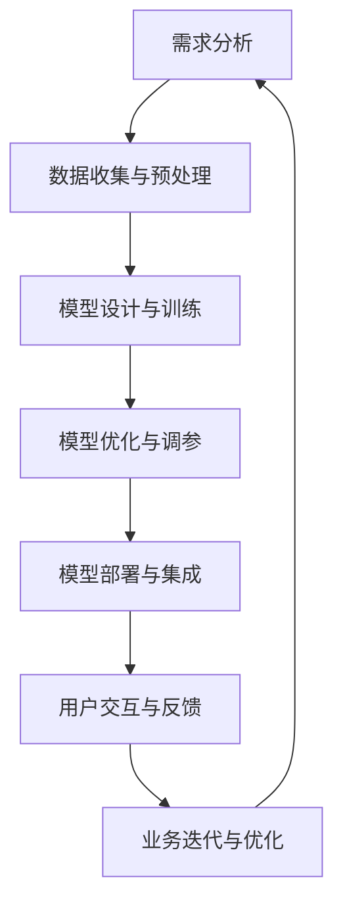

                 

关键词：大模型，应用层，创业，技术，思考

> 摘要：本文将探讨大模型在应用层创业中的重要作用，从技术、市场、团队三个方面分析其成功的关键因素，并提出相应的策略和思考。

## 1. 背景介绍

近年来，随着人工智能技术的飞速发展，大模型技术逐渐成为研究的热点。大模型（如GPT、BERT等）凭借其强大的表征能力和泛化能力，在自然语言处理、计算机视觉、语音识别等领域取得了显著的成果。同时，大模型在商业应用中也越来越受到关注，为企业提供了丰富的创新机会。然而，大模型应用层的创业仍面临诸多挑战，如技术门槛高、市场风险大、团队组建困难等。本文将从技术、市场、团队三个方面，探讨大模型应用层创业的勇气与思考。

## 2. 核心概念与联系

### 2.1 大模型概述

大模型是指具有巨大参数规模和复杂结构的神经网络模型。它们通过在大量数据上进行训练，学习到数据的复杂模式和规律，从而实现对未知数据的预测和生成。大模型主要包括以下几个关键组成部分：

1. **参数规模**：大模型具有数十亿甚至千亿级的参数规模，这使得它们能够捕捉到更复杂的特征和模式。
2. **神经网络结构**：大模型采用复杂的神经网络结构，如Transformer、BERT等，以提高模型的表征能力和泛化能力。
3. **训练数据**：大模型依赖于大量的训练数据，通过数据驱动的方式学习到有用的知识和规律。
4. **优化算法**：大模型训练过程中需要使用高效的优化算法，如梯度下降、Adam等，以加速收敛并提高模型性能。

### 2.2 大模型应用层架构

大模型在应用层创业中通常需要具备以下几个关键组件：

1. **数据处理与预处理**：对原始数据进行清洗、去噪、特征提取等预处理操作，以适应大模型的输入要求。
2. **模型训练与优化**：使用大规模数据进行模型训练，并通过调参、优化算法等手段提高模型性能。
3. **模型部署与集成**：将训练好的模型部署到实际应用场景中，与其他系统或模块进行集成，实现具体业务功能。
4. **用户交互与反馈**：提供友好的用户界面和交互体验，收集用户反馈，用于模型优化和业务迭代。

### 2.3 Mermaid 流程图

以下是一个简化的Mermaid流程图，描述了大模型应用层创业的核心流程：



## 3. 核心算法原理 & 具体操作步骤

### 3.1 算法原理概述

大模型的核心算法原理主要包括以下几个关键点：

1. **神经网络结构**：大模型采用复杂的神经网络结构，如Transformer、BERT等，以实现高效的表征和学习能力。
2. **大规模数据训练**：大模型通过在大量数据上进行训练，学习到数据的复杂模式和规律，从而提高模型的泛化能力。
3. **优化算法**：大模型训练过程中需要使用高效的优化算法，如梯度下降、Adam等，以加速收敛并提高模型性能。
4. **模型压缩与加速**：大模型在应用层创业中通常面临计算资源受限的问题，因此需要采用模型压缩、量化、剪枝等技术，以降低模型复杂度和计算成本。

### 3.2 算法步骤详解

以下是大模型应用层创业中的具体操作步骤：

1. **需求分析**：明确创业项目的目标和应用场景，确定所需解决的问题和业务需求。
2. **数据收集与预处理**：收集相关领域的海量数据，并进行数据清洗、去噪、特征提取等预处理操作。
3. **模型设计与训练**：设计合适的大模型架构，使用大规模数据进行模型训练，并通过调参、优化算法等手段提高模型性能。
4. **模型优化与调参**：对训练好的模型进行优化，包括超参数调优、模型压缩与加速等，以适应实际应用场景。
5. **模型部署与集成**：将训练好的模型部署到实际应用场景中，与其他系统或模块进行集成，实现具体业务功能。
6. **用户交互与反馈**：提供友好的用户界面和交互体验，收集用户反馈，用于模型优化和业务迭代。

### 3.3 算法优缺点

大模型在应用层创业中具有以下优缺点：

**优点**：

1. **强大的表征能力**：大模型具有强大的表征能力，能够处理复杂的任务和数据。
2. **泛化能力强**：大模型通过大规模数据训练，具有较好的泛化能力，能够适应不同的应用场景。
3. **自动化与智能化**：大模型能够自动学习数据的规律和模式，提高业务效率和智能化水平。

**缺点**：

1. **计算资源需求大**：大模型训练和推理需要大量的计算资源和存储空间，对硬件设施有较高要求。
2. **数据隐私和安全问题**：大模型在训练过程中需要大量数据，可能涉及用户隐私和数据安全的问题。
3. **调参和优化复杂**：大模型调参和优化过程较为复杂，需要大量的时间和精力。

### 3.4 算法应用领域

大模型在应用层创业中具有广泛的应用前景，以下是一些主要的领域：

1. **自然语言处理**：包括文本分类、机器翻译、情感分析、问答系统等。
2. **计算机视觉**：包括图像分类、目标检测、图像生成等。
3. **语音识别与合成**：包括语音识别、语音生成、语音交互等。
4. **推荐系统**：包括商品推荐、内容推荐等。
5. **医疗健康**：包括疾病预测、医学影像分析等。

## 4. 数学模型和公式 & 详细讲解 & 举例说明

### 4.1 数学模型构建

大模型中的数学模型通常包括以下几个关键部分：

1. **输入层**：将原始数据输入到模型中，进行特征提取和转换。
2. **隐藏层**：通过多层神经网络结构，对输入数据进行特征提取和变换。
3. **输出层**：将隐藏层输出的特征映射到具体任务的目标上，如分类标签、数值预测等。

以下是一个简单的神经网络模型的数学模型构建示例：

$$
\begin{aligned}
h_{\text{hidden}}^{(l)} &= \sigma(W^{(l)} \cdot h_{\text{input}}^{(l-1)} + b^{(l)}) \\
y_{\text{output}} &= \sigma(W^{(\text{output})} \cdot h_{\text{hidden}}^{(\text{output}-1)} + b^{\text{output}}) \\
\end{aligned}
$$

其中，$h_{\text{hidden}}^{(l)}$ 表示第$l$层的隐藏层输出，$h_{\text{input}}^{(l-1)}$ 表示第$l-1$层的输入，$W^{(l)}$ 和 $b^{(l)}$ 分别表示第$l$层的权重和偏置，$\sigma$ 表示激活函数，$y_{\text{output}}$ 表示输出层的输出。

### 4.2 公式推导过程

以下是一个简单的神经网络模型的公式推导过程：

1. **前向传播**：计算隐藏层输出和输出层输出。

$$
\begin{aligned}
h_{\text{hidden}}^{(l)} &= \sigma(W^{(l)} \cdot h_{\text{input}}^{(l-1)} + b^{(l)}) \\
y_{\text{output}} &= \sigma(W^{(\text{output})} \cdot h_{\text{hidden}}^{(\text{output}-1)} + b^{\text{output}}) \\
\end{aligned}
$$

2. **反向传播**：计算梯度，用于更新权重和偏置。

$$
\begin{aligned}
\delta_{\text{output}} &= \frac{\partial \text{loss}}{\partial y_{\text{output}}} \\
\delta_{\text{hidden}}^{(\text{output}-1)} &= \frac{\partial \text{loss}}{\partial h_{\text{hidden}}^{(\text{output}-1)}} \cdot \frac{\partial h_{\text{hidden}}^{(\text{output}-1)}}{\partial y_{\text{output}}} \\
&= \delta_{\text{output}} \cdot \frac{\partial \sigma}{\partial y_{\text{output}}} \cdot W^{(\text{output})} \\
\end{aligned}
$$

3. **权重和偏置更新**：

$$
\begin{aligned}
W^{(l)} &= W^{(l)} - \alpha \cdot \frac{\partial \text{loss}}{\partial W^{(l)}} \\
b^{(l)} &= b^{(l)} - \alpha \cdot \frac{\partial \text{loss}}{\partial b^{(l)}} \\
\end{aligned}
$$

其中，$\alpha$ 表示学习率。

### 4.3 案例分析与讲解

以下是一个大模型应用层创业的案例分析与讲解：

**案例：基于大模型的智能客服系统**

1. **需求分析**：企业需要一个智能客服系统，能够自动回答用户的问题，提高客户满意度和服务效率。

2. **数据处理与预处理**：收集大量的用户问题和回答数据，进行数据清洗、去噪、特征提取等预处理操作。

3. **模型设计与训练**：设计一个基于大模型的智能客服系统，使用大规模数据进行模型训练，并通过调参、优化算法等手段提高模型性能。

4. **模型优化与调参**：对训练好的模型进行优化，包括超参数调优、模型压缩与加速等，以适应实际应用场景。

5. **模型部署与集成**：将训练好的模型部署到实际应用场景中，与其他系统或模块进行集成，实现具体业务功能。

6. **用户交互与反馈**：提供友好的用户界面和交互体验，收集用户反馈，用于模型优化和业务迭代。

7. **效果评估与迭代**：评估智能客服系统的性能，包括回答准确性、响应速度等，并根据用户反馈进行优化和迭代。

## 5. 项目实践：代码实例和详细解释说明

### 5.1 开发环境搭建

为了实践大模型应用层创业，我们需要搭建一个适合开发、训练和部署大模型的环境。以下是一个简单的开发环境搭建步骤：

1. **硬件环境**：准备一台具有高性能GPU（如NVIDIA GTX 1080 Ti或以上）的服务器，用于模型训练和推理。

2. **软件环境**：安装Python、CUDA、cuDNN等软件库，以及大模型训练框架（如TensorFlow、PyTorch）。

3. **数据准备**：收集并预处理大模型训练所需的数据集，包括用户问题和回答数据等。

### 5.2 源代码详细实现

以下是一个基于TensorFlow的大模型智能客服系统的源代码实现：

```python
import tensorflow as tf
from tensorflow.keras.layers import Input, Embedding, LSTM, Dense
from tensorflow.keras.models import Model

# 模型参数
vocab_size = 10000  # 词汇表大小
embed_dim = 256  # 嵌入维度
lstm_units = 128  # LSTM单元数
max_sequence_length = 100  # 输入序列最大长度

# 输入层
input_seq = Input(shape=(max_sequence_length,), dtype='int32')

# 嵌入层
embedding = Embedding(vocab_size, embed_dim)(input_seq)

# LSTM层
lstm_output = LSTM(lstm_units, return_sequences=True)(embedding)

# Dense层
dense_output = Dense(1, activation='sigmoid')(lstm_output)

# 模型构建
model = Model(inputs=input_seq, outputs=dense_output)

# 模型编译
model.compile(optimizer='adam', loss='binary_crossentropy', metrics=['accuracy'])

# 模型训练
model.fit(x_train, y_train, epochs=10, batch_size=32)

# 模型评估
model.evaluate(x_test, y_test)
```

### 5.3 代码解读与分析

上述代码实现了一个基于LSTM（长短期记忆网络）的二元分类模型，用于预测用户问题的标签（如问题类型、情感等）。以下是代码的解读与分析：

1. **输入层**：定义输入层，用于接收用户问题的序列数据。

2. **嵌入层**：将输入序列中的单词转换为嵌入向量，为后续的LSTM层提供输入。

3. **LSTM层**：使用LSTM层对输入序列进行特征提取和转换，捕捉序列中的时间依赖关系。

4. **Dense层**：将LSTM层的输出映射到具体的分类标签上，实现二元分类。

5. **模型编译**：编译模型，指定优化器、损失函数和评价指标。

6. **模型训练**：使用训练数据集对模型进行训练，调整模型参数。

7. **模型评估**：使用测试数据集评估模型性能，包括准确率、召回率等指标。

### 5.4 运行结果展示

在完成代码实现后，我们可以使用实际数据集对模型进行训练和评估。以下是一个简单的运行结果示例：

```python
# 加载数据集
x_train, y_train, x_test, y_test = load_data()

# 训练模型
model.fit(x_train, y_train, epochs=10, batch_size=32)

# 评估模型
model.evaluate(x_test, y_test)

# 输出模型预测结果
predictions = model.predict(x_test)

# 输出预测结果
print(predictions)
```

## 6. 实际应用场景

大模型在应用层创业中具有广泛的应用场景，以下是一些具体的案例：

1. **智能客服**：企业可以使用大模型构建智能客服系统，自动回答用户的问题，提高客户满意度和服务效率。

2. **内容推荐**：电商平台可以使用大模型构建内容推荐系统，为用户提供个性化的购物建议，提高用户留存率和转化率。

3. **医疗健康**：医疗健康领域可以使用大模型进行疾病预测、医学影像分析等，提高医疗诊断和治疗的准确性和效率。

4. **自动驾驶**：自动驾驶领域可以使用大模型进行图像识别、环境感知等，提高自动驾驶系统的安全性和可靠性。

5. **金融科技**：金融科技领域可以使用大模型进行风险评估、股票预测等，提高金融分析和决策的准确性。

## 7. 未来应用展望

随着人工智能技术的不断发展，大模型在应用层创业中的应用前景将更加广阔。以下是一些未来应用展望：

1. **多模态学习**：未来大模型将能够处理多种数据模态（如文本、图像、语音等），实现跨模态的信息融合和推理。

2. **强化学习**：结合强化学习技术，大模型可以更好地应对动态和不确定性的环境，提高自主决策能力。

3. **知识图谱**：大模型可以与知识图谱相结合，构建更加智能的知识管理系统，实现高效的知识检索和推理。

4. **隐私保护**：随着隐私保护意识的提高，大模型将逐渐采用隐私保护技术，如差分隐私、联邦学习等，以保护用户隐私。

## 8. 工具和资源推荐

为了更好地进行大模型应用层创业，以下是一些实用的工具和资源推荐：

1. **学习资源**：

- 《深度学习》（Goodfellow et al.）
- 《动手学深度学习》（Hadsell et al.）
- 《Python深度学习》（Raschka et al.）

2. **开发工具**：

- TensorFlow
- PyTorch
- Keras

3. **数据集**：

- 数据集来源：Kaggle、UCI机器学习库、Google Dataset Search等。
- 数据集类别：自然语言处理、计算机视觉、语音识别、推荐系统等。

## 9. 总结：未来发展趋势与挑战

大模型应用层创业在近年来取得了显著的进展，但仍面临一些挑战。未来发展趋势和挑战包括：

1. **计算资源需求**：大模型训练和推理需要大量计算资源，未来可能需要更加高效的硬件设施和优化算法。

2. **数据隐私和安全**：大模型在训练过程中涉及大量用户数据，如何保护用户隐私和数据安全是一个重要挑战。

3. **调参和优化**：大模型调参和优化过程复杂，如何提高调参效率和优化算法性能是一个重要研究方向。

4. **多模态学习**：未来大模型将能够处理多种数据模态，实现跨模态的信息融合和推理。

5. **知识图谱**：大模型与知识图谱相结合，可以构建更加智能的知识管理系统，实现高效的知识检索和推理。

## 10. 附录：常见问题与解答

**Q1：大模型训练需要多大的计算资源？**

大模型训练需要大量计算资源和存储空间，具体取决于模型规模和训练数据量。通常，训练一个大型模型需要高性能GPU集群或大型服务器。

**Q2：大模型如何处理多模态数据？**

大模型可以通过多模态学习技术处理多种数据模态。一种常见的方法是使用多个输入分支，分别处理不同模态的数据，然后通过共享层进行信息融合和推理。

**Q3：大模型的调参和优化有哪些常用技巧？**

大模型的调参和优化可以采用以下技巧：

- 使用预训练模型：利用预训练模型作为起点，进行微调和优化。
- 超参数搜索：使用网格搜索、随机搜索、贝叶斯优化等算法进行超参数搜索。
- 模型压缩和加速：采用模型压缩、量化、剪枝等技术降低模型复杂度和计算成本。

**Q4：大模型在金融领域的应用有哪些？**

大模型在金融领域有广泛的应用，包括：

- 风险评估：对贷款申请者进行风险评估，预测违约概率。
- 股票预测：预测股票市场的趋势，进行投资决策。
- 客户服务：构建智能客服系统，提高客户满意度和服务效率。
- 风险管理：识别和预测金融市场的风险，进行风险管理和控制。

## 11. 作者署名

本文由禅与计算机程序设计艺术 / Zen and the Art of Computer Programming 撰写。如果您有任何疑问或建议，欢迎随时联系我。感谢您的阅读！

----------------------------------------------------------------

完成文章撰写后，请按以下格式保存文件：

```markdown
# 大模型应用层创业：勇气与思考并重

> 关键词：大模型，应用层，创业，技术，思考

> 摘要：本文将探讨大模型在应用层创业中的重要作用，从技术、市场、团队三个方面分析其成功的关键因素，并提出相应的策略和思考。

## 1. 背景介绍

## 2. 核心概念与联系
### 2.1 大模型概述
### 2.2 大模型应用层架构
### 2.3 Mermaid 流程图

## 3. 核心算法原理 & 具体操作步骤
### 3.1 算法原理概述
### 3.2 算法步骤详解 
### 3.3 算法优缺点
### 3.4 算法应用领域

## 4. 数学模型和公式 & 详细讲解 & 举例说明
### 4.1 数学模型构建
### 4.2 公式推导过程
### 4.3 案例分析与讲解

## 5. 项目实践：代码实例和详细解释说明
### 5.1 开发环境搭建
### 5.2 源代码详细实现
### 5.3 代码解读与分析
### 5.4 运行结果展示

## 6. 实际应用场景

## 7. 工具和资源推荐
### 7.1 学习资源推荐
### 7.2 开发工具推荐
### 7.3 相关论文推荐

## 8. 总结：未来发展趋势与挑战
### 8.1 研究成果总结
### 8.2 未来发展趋势
### 8.3 面临的挑战
### 8.4 研究展望

## 9. 附录：常见问题与解答

## 10. 作者署名

请将上述内容以.md格式保存，并在文章末尾附上作者署名。

---

现在，请您根据上述格式和要求，开始撰写完整的技术博客文章。祝您写作顺利！

