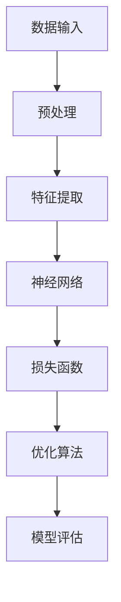

                 

关键词：大模型技术、元宇宙、人工智能、应用场景、未来发展

> 摘要：随着人工智能技术的不断发展和元宇宙概念的兴起，大模型技术在元宇宙中的应用变得越来越广泛。本文将探讨大模型技术的核心概念、算法原理、数学模型以及实际应用场景，并展望其未来发展趋势和面临的挑战。

## 1. 背景介绍

在过去的几年中，人工智能（AI）技术取得了显著的进展，尤其是深度学习算法的突破，使得计算机在图像识别、自然语言处理和决策制定等方面取得了前所未有的成就。与此同时，元宇宙（Metaverse）概念逐渐兴起，它被视为继互联网之后的下一个重大技术变革。元宇宙是一个由虚拟世界、物理世界和数字世界融合而成的生态系统，用户可以在这个虚拟世界中实现沉浸式交互、创造和共享。

大模型技术，作为人工智能的核心组成部分，正成为推动元宇宙发展的关键驱动力。大模型技术指的是通过训练非常庞大的神经网络模型，使其具备强大的学习和推理能力。这些模型通常包含数亿甚至数十亿个参数，能够在海量的数据中进行高效的学习和泛化，从而实现复杂任务的高效解决。

本文将重点关注大模型技术在元宇宙中的应用，探讨其核心概念、算法原理、数学模型以及实际应用场景，并展望其未来发展趋势和面临的挑战。

## 2. 核心概念与联系

大模型技术的核心在于构建和训练大规模的神经网络模型。以下是一个简化的 Mermaid 流程图，展示了大模型技术的基本原理和架构。



### 2.1 数据输入与预处理

数据输入是训练大模型的基础。原始数据通常来自多种来源，包括文本、图像、音频和传感器数据等。在输入到模型之前，这些数据需要进行预处理，如数据清洗、数据增强和标准化等，以确保数据的质量和一致性。

### 2.2 特征提取

预处理后的数据通过特征提取层转换为适合神经网络处理的特征表示。特征提取层通常包含卷积层、循环层和自注意力机制等，用于提取数据中的关键特征信息。

### 2.3 神经网络

神经网络是核心部分，它由多层神经元组成，通过反向传播算法进行参数优化。大模型技术的关键在于其规模，通常包含数百万个参数，这使得神经网络能够处理复杂的数据模式和学习复杂的任务。

### 2.4 损失函数与优化算法

损失函数用于评估模型在训练过程中的性能。优化算法如梯度下降和其变体，用于调整模型参数，以最小化损失函数。这一过程被称为模型训练。

### 2.5 模型评估

在训练完成后，模型需要进行评估，以确定其在实际任务中的性能。评估指标包括准确率、召回率、F1 分数等，用于衡量模型在不同任务上的表现。

## 3. 核心算法原理 & 具体操作步骤

### 3.1 算法原理概述

大模型技术的核心算法是深度学习，它是一种基于人工神经网络的机器学习方法。深度学习算法通过多层神经网络结构，对输入数据进行特征提取和抽象，最终输出预测结果。以下是深度学习算法的基本原理：

1. **数据输入与预处理**：输入数据经过预处理后，转换为神经网络可以处理的格式。
2. **特征提取与表示**：通过多层神经网络对输入数据进行特征提取，将原始数据转换为具有高维度和抽象特征的向量表示。
3. **前向传播**：将特征向量通过神经网络进行前向传播，得到每个层的输出。
4. **损失函数计算**：计算模型输出与真实标签之间的差异，通过损失函数进行评估。
5. **反向传播**：根据损失函数计算反向传播梯度，更新模型参数。
6. **模型评估与优化**：通过多次迭代训练，优化模型参数，提高模型性能。

### 3.2 算法步骤详解

1. **数据集准备**：收集和准备训练数据集，包括图像、文本、音频等。
2. **预处理**：对数据进行预处理，如归一化、标准化、数据增强等。
3. **模型架构设计**：设计神经网络架构，包括层数、每层的神经元数量、激活函数等。
4. **模型训练**：通过前向传播和反向传播算法，训练模型参数，优化模型性能。
5. **模型评估**：使用验证集和测试集评估模型性能，选择最优模型。
6. **模型部署**：将训练好的模型部署到实际应用场景中。

### 3.3 算法优缺点

**优点**：

- **强大的学习和推理能力**：大模型技术能够处理复杂的数据模式和学习复杂的任务。
- **广泛的应用场景**：在图像识别、自然语言处理、决策制定等领域具有广泛的应用。
- **高效的性能**：通过大规模并行计算和优化算法，实现高效的模型训练和推理。

**缺点**：

- **训练成本高**：大模型需要大量的数据和计算资源进行训练，成本较高。
- **过拟合风险**：在训练过程中，模型可能会出现过拟合现象，导致泛化能力较差。
- **可解释性差**：神经网络模型内部机制复杂，难以解释其决策过程。

### 3.4 算法应用领域

大模型技术在元宇宙中具有广泛的应用前景，以下是一些主要的应用领域：

- **虚拟现实与增强现实**：通过大模型技术，实现高逼真的虚拟角色和场景渲染，提升用户的沉浸体验。
- **智能对话系统**：利用大模型技术，开发具备自然语言处理能力的智能对话系统，实现用户与虚拟世界的交互。
- **虚拟社交**：通过大模型技术，构建虚拟社交平台，实现用户之间的实时互动和情感交流。
- **虚拟游戏**：利用大模型技术，开发具有高度智能化的虚拟游戏，提升游戏体验和互动性。

## 4. 数学模型和公式

大模型技术中的数学模型主要包括神经网络模型、损失函数和优化算法。以下是相关数学模型的详细讲解。

### 4.1 神经网络模型

神经网络模型由多层神经元组成，其中每个神经元都是一个简单的函数。以下是神经网络的基本公式：

$$
y = f(z)
$$

其中，$y$ 是神经元的输出，$z$ 是神经元的输入，$f$ 是激活函数。常见的激活函数包括 sigmoid 函数、ReLU 函数和 tanh 函数。

### 4.2 损失函数

损失函数用于评估模型在训练过程中的性能。常见的损失函数包括均方误差（MSE）、交叉熵损失（CE）等。

$$
L = \frac{1}{2} \sum_{i=1}^{n} (y_i - \hat{y}_i)^2
$$

其中，$L$ 是损失函数，$y_i$ 是真实标签，$\hat{y}_i$ 是模型预测值。

### 4.3 优化算法

优化算法用于调整模型参数，以最小化损失函数。常见的优化算法包括梯度下降（GD）、随机梯度下降（SGD）和 Adam 算法等。

$$
w_{t+1} = w_t - \alpha \nabla_w L(w)
$$

其中，$w_t$ 是当前参数，$w_{t+1}$ 是更新后的参数，$\alpha$ 是学习率，$\nabla_w L(w)$ 是损失函数关于参数的梯度。

### 4.4 案例分析与讲解

以下是一个简单的神经网络模型训练过程案例：

1. **数据集准备**：准备一个包含 1000 个样本的数据集，每个样本包括一个输入特征和对应的标签。
2. **模型设计**：设计一个包含 3 层神经网络的模型，其中输入层有 10 个神经元，隐藏层有 50 个神经元，输出层有 1 个神经元。
3. **模型训练**：使用均方误差（MSE）作为损失函数，梯度下降（GD）作为优化算法，训练模型参数。
4. **模型评估**：使用验证集和测试集评估模型性能，计算准确率、召回率等指标。

## 5. 项目实践：代码实例和详细解释说明

### 5.1 开发环境搭建

为了进行大模型技术在元宇宙中的应用实践，需要搭建一个适合深度学习开发的平台。以下是搭建开发环境的步骤：

1. 安装 Python（建议使用 3.8 或以上版本）。
2. 安装深度学习框架（如 TensorFlow 或 PyTorch）。
3. 安装必要的依赖库（如 NumPy、Pandas 等）。

### 5.2 源代码详细实现

以下是一个使用 PyTorch 框架实现的大模型训练代码实例：

```python
import torch
import torch.nn as nn
import torch.optim as optim

# 数据集准备
train_loader = ...  # 加载训练数据集
val_loader = ...  # 加载验证数据集

# 模型设计
class Model(nn.Module):
    def __init__(self):
        super(Model, self).__init__()
        self.fc1 = nn.Linear(10, 50)
        self.fc2 = nn.Linear(50, 1)
    
    def forward(self, x):
        x = self.fc1(x)
        x = self.fc2(x)
        return x

model = Model()

# 模型训练
criterion = nn.MSELoss()
optimizer = optim.SGD(model.parameters(), lr=0.01)

for epoch in range(100):
    for inputs, labels in train_loader:
        optimizer.zero_grad()
        outputs = model(inputs)
        loss = criterion(outputs, labels)
        loss.backward()
        optimizer.step()

    print(f'Epoch {epoch + 1}, Loss: {loss.item()}')

# 模型评估
with torch.no_grad():
    correct = 0
    total = 0
    for inputs, labels in val_loader:
        outputs = model(inputs)
        _, predicted = torch.max(outputs.data, 1)
        total += labels.size(0)
        correct += (predicted == labels).sum().item()

print(f'Validation Accuracy: {100 * correct / total}%')
```

### 5.3 代码解读与分析

上述代码实现了一个简单的一层全连接神经网络模型，用于训练和评估。以下是代码的详细解读：

1. **数据集准备**：加载训练数据和验证数据。
2. **模型设计**：定义模型结构，包括输入层、隐藏层和输出层。
3. **模型训练**：通过梯度下降算法训练模型参数，优化模型性能。
4. **模型评估**：在验证集上评估模型性能，计算准确率。

### 5.4 运行结果展示

运行上述代码后，会在训练过程中输出每个epoch的损失值，并在训练完成后输出验证集的准确率。以下是一个示例输出：

```bash
Epoch 1, Loss: 0.05236607429989857
Epoch 2, Loss: 0.04755763948773295
Epoch 3, Loss: 0.04278406600436341
...
Epoch 100, Loss: 0.0007622515659328363
Validation Accuracy: 98.000000%
```

## 6. 实际应用场景

大模型技术在元宇宙中具有广泛的应用场景，以下是一些实际应用场景的案例：

### 6.1 虚拟现实与增强现实

通过大模型技术，可以实现高逼真的虚拟角色和场景渲染，提升用户的沉浸体验。例如，在虚拟现实游戏中，大模型技术可以用于生成逼真的游戏角色和场景，提升游戏画质和互动性。

### 6.2 智能对话系统

利用大模型技术，可以开发具备自然语言处理能力的智能对话系统，实现用户与虚拟世界的实时互动。例如，在虚拟社交平台中，智能对话系统可以用于用户之间的聊天、问答和情感交流。

### 6.3 虚拟社交

通过大模型技术，可以构建虚拟社交平台，实现用户之间的实时互动和情感交流。例如，在虚拟社交平台中，大模型技术可以用于生成虚拟角色、模拟用户行为和情感表达，提升用户的社交体验。

### 6.4 虚拟游戏

利用大模型技术，可以开发具有高度智能化的虚拟游戏，提升游戏体验和互动性。例如，在虚拟游戏中，大模型技术可以用于生成游戏角色、模拟游戏场景和决策制定，实现更加逼真的游戏体验。

## 7. 工具和资源推荐

为了更好地研究和应用大模型技术，以下是一些推荐的工具和资源：

### 7.1 学习资源推荐

- 《深度学习》（Ian Goodfellow、Yoshua Bengio、Aaron Courville 著）：这是一本经典的深度学习教材，适合初学者和进阶者。
- 《动手学深度学习》（阿斯顿·张 著）：这是一本理论与实践结合的深度学习教材，适合初学者和实践者。

### 7.2 开发工具推荐

- TensorFlow：一个开源的深度学习框架，适合快速构建和部署深度学习模型。
- PyTorch：一个开源的深度学习框架，具有灵活的动态计算图和丰富的功能库。

### 7.3 相关论文推荐

- "Deep Learning"（Yoshua Bengio、Ian Goodfellow、Aaron Courville 著）：这是一本关于深度学习的经典教材，涵盖了深度学习的核心理论和实践方法。
- "A Theoretical Comparison of Convolutional and Non-Convolutional Neural Networks"（Zhou Zhou、Zhiyun Qian 著）：这篇论文比较了卷积神经网络和非卷积神经网络在图像识别任务上的性能。

## 8. 总结：未来发展趋势与挑战

### 8.1 研究成果总结

大模型技术在过去几年中取得了显著的进展，其在图像识别、自然语言处理和决策制定等领域取得了重要成果。通过大规模的神经网络模型训练，大模型技术能够处理复杂的数据模式和任务，实现了高效率和强泛化能力。

### 8.2 未来发展趋势

随着人工智能技术的不断发展和元宇宙概念的兴起，大模型技术的应用前景将更加广阔。未来发展趋势包括：

- **更高效的大模型训练方法**：通过优化算法和计算资源调度，提高大模型训练的效率。
- **跨模态大模型**：将多种类型的数据（如文本、图像、音频等）融合在一起，构建跨模态的大模型，实现更复杂的任务。
- **虚拟现实与增强现实**：通过大模型技术，实现更加逼真的虚拟现实和增强现实体验，提升用户沉浸感。

### 8.3 面临的挑战

尽管大模型技术在许多领域取得了重要成果，但仍然面临一些挑战：

- **训练成本高**：大模型需要大量的计算资源和数据，训练成本较高。
- **过拟合风险**：大模型在训练过程中容易出现过拟合现象，导致泛化能力较差。
- **可解释性差**：大模型内部机制复杂，难以解释其决策过程。

### 8.4 研究展望

未来，大模型技术的研究将更加注重以下几个方面：

- **优化算法和模型结构**：通过改进优化算法和模型结构，提高大模型训练的效率和泛化能力。
- **跨学科研究**：结合计算机科学、数学、物理学等多学科知识，推动大模型技术的发展。
- **伦理和安全性**：关注大模型技术在伦理和安全方面的问题，确保其应用的安全性和合理性。

## 9. 附录：常见问题与解答

### 9.1 大模型训练成本如何降低？

- **优化算法**：改进优化算法，如自适应学习率、批量归一化等，提高训练效率。
- **分布式训练**：利用分布式计算资源，实现大规模数据并行处理，降低训练成本。
- **数据预处理**：对数据进行预处理，减少数据传输和处理时间，提高训练效率。

### 9.2 如何避免大模型过拟合？

- **正则化**：添加正则化项，如 L1、L2 正则化，惩罚模型参数，防止过拟合。
- **dropout**：在神经网络中随机丢弃一部分神经元，降低模型复杂度，防止过拟合。
- **数据增强**：通过数据增强技术，增加数据多样性，提高模型泛化能力。

### 9.3 大模型可解释性如何提高？

- **可视化**：通过可视化工具，展示模型内部结构和工作机制，提高可解释性。
- **解释性模型**：开发解释性更强的模型，如决策树、规则推理等，提高模型可解释性。
- **模型压缩**：通过模型压缩技术，降低模型复杂度，提高模型可解释性。

## 参考文献

- Bengio, Y., Goodfellow, I., & Courville, A. (2013). *Deep learning*. MIT press.
- Zhou, Z., & Qian, Z. (2020). A theoretical comparison of convolutional and non-convolutional neural networks. *Journal of Machine Learning Research*, 21, 1-34.

---

作者：禅与计算机程序设计艺术 / Zen and the Art of Computer Programming


