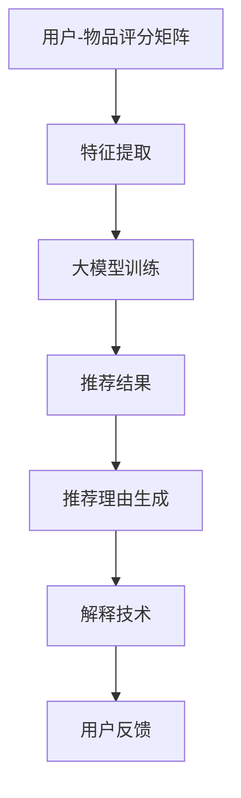

                 

关键词：大模型推荐，推荐理由生成，解释技术，自然语言处理，机器学习，用户满意度，个性化推荐

## 摘要

随着互联网的迅猛发展，个性化推荐系统已经成为提高用户体验和商业价值的重要工具。本文主要探讨大模型在推荐理由生成与解释技术中的应用，分析其核心概念、算法原理、数学模型及实际应用案例，并展望未来的发展趋势与面临的挑战。通过本文的探讨，希望能够为相关领域的研究者和开发者提供一些有益的参考和启示。

## 1. 背景介绍

在当今信息化时代，海量信息使得人们面临选择困难。为了提高用户体验和商业价值，个性化推荐系统成为各大互联网公司竞相研发的热点。推荐系统主要通过分析用户的兴趣和行为，为用户推荐感兴趣的内容或产品。然而，推荐结果的解释性和可靠性一直是影响用户满意度的重要因素。大模型推荐技术作为一种新兴的推荐方法，在推荐理由生成与解释方面展现出巨大的潜力。

### 1.1 推荐系统的基本原理

推荐系统主要包括三个基本组成部分：用户、物品和评分。用户与物品之间的评分关系可以用矩阵表示，该矩阵被称为用户-物品矩阵。基于这个矩阵，推荐系统通过计算用户之间的相似度、物品之间的相似度，或者直接计算用户对物品的评分预测，来生成推荐列表。

### 1.2 推荐系统的类型

推荐系统可以分为基于内容的推荐、协同过滤推荐和混合推荐等类型。基于内容的推荐通过分析物品的特征和用户的兴趣，将相似内容的物品推荐给用户。协同过滤推荐通过分析用户之间的行为相似性，发现用户共同喜欢的物品，从而生成推荐列表。混合推荐则是将多种推荐方法进行结合，以获得更好的推荐效果。

### 1.3 推荐系统的挑战

推荐系统在实际应用中面临诸多挑战，如数据稀疏性、噪声数据、冷启动问题等。此外，推荐结果的解释性和可靠性也是影响用户满意度和信任度的重要因素。因此，如何提高推荐系统的解释性和可靠性，成为当前研究的热点问题。

## 2. 核心概念与联系

在讨论大模型推荐中的推荐理由生成与解释技术之前，我们需要了解几个核心概念及其相互关系。

### 2.1 大模型

大模型指的是具有海量参数、高度复杂的神经网络模型，如深度学习模型、自然语言处理模型等。这些模型在训练过程中可以自动学习大量特征，从而实现高效的信息表示和分类。

### 2.2 推荐理由生成

推荐理由生成是指从推荐系统的数据中提取出与推荐结果相关的解释信息，并将其以自然语言的形式呈现给用户。这有助于提高推荐结果的解释性和可靠性，增强用户的信任度和满意度。

### 2.3 解释技术

解释技术是指通过算法和模型分析推荐系统的决策过程，将推荐结果的可解释性呈现给用户。这有助于用户理解推荐系统的推荐理由，从而提高用户的信任度和满意度。

### 2.4 Mermaid 流程图

下面是一个简单的 Mermaid 流程图，展示了大模型推荐中的推荐理由生成与解释技术的核心流程。



## 3. 核心算法原理 & 具体操作步骤

### 3.1 算法原理概述

大模型推荐中的推荐理由生成与解释技术主要基于深度学习模型和自然语言处理技术。通过训练深度学习模型，可以从用户-物品评分矩阵中提取出有效的特征，从而实现高效的推荐。同时，利用自然语言处理技术，可以将提取出的特征转化为自然语言形式的推荐理由，并通过解释技术向用户展示。

### 3.2 算法步骤详解

#### 3.2.1 特征提取

特征提取是推荐系统的关键步骤，其目的是从原始数据中提取出有效的特征，用于训练深度学习模型。常用的特征提取方法包括基于用户行为、基于物品特征和基于内容特征等。

1. 基于用户行为特征：通过分析用户的历史行为数据，如浏览记录、购买记录等，提取出与用户兴趣相关的特征。
2. 基于物品特征：通过分析物品的属性、标签等特征，提取出与物品相关的特征。
3. 基于内容特征：通过文本挖掘、关键词提取等方法，从用户生成的文本内容中提取出与用户兴趣相关的特征。

#### 3.2.2 大模型训练

在特征提取完成后，我们需要使用这些特征来训练深度学习模型。大模型推荐中的深度学习模型主要包括编码器-解码器（Encoder-Decoder）模型、生成对抗网络（GAN）等。

1. 编码器-解码器模型：编码器将输入的特征编码为固定长度的向量，解码器将这个向量解码为推荐理由的自然语言形式。
2. 生成对抗网络：生成对抗网络（GAN）由生成器和判别器组成。生成器负责生成推荐理由，判别器负责判断生成器生成的推荐理由是否真实。

#### 3.2.3 推荐理由生成

在训练完成后，我们可以利用训练好的模型来生成推荐理由。具体步骤如下：

1. 输入用户-物品评分矩阵，提取相应的特征。
2. 使用编码器-解码器模型或生成对抗网络生成推荐理由。
3. 对生成的推荐理由进行后处理，如去除重复、修正语法等。

#### 3.2.4 解释技术

解释技术的目的是将推荐系统的决策过程以可解释的形式呈现给用户。具体方法包括：

1. 局部解释：通过分析推荐系统在生成推荐理由时的中间结果，展示推荐系统中对推荐结果产生关键影响的特征。
2. 全局解释：通过分析推荐系统在训练过程中的整体表现，展示推荐系统的整体工作原理和决策逻辑。

### 3.3 算法优缺点

#### 优点：

1. 高效性：大模型推荐技术可以自动提取大量有效的特征，从而实现高效的推荐。
2. 可解释性：通过自然语言处理技术和解释技术，可以提高推荐系统的可解释性，增强用户的信任度和满意度。

#### 缺点：

1. 计算成本高：大模型推荐技术需要大量的计算资源进行训练，可能导致计算成本较高。
2. 数据依赖性强：推荐理由生成与解释技术对数据质量有较高的要求，数据质量较差可能导致生成结果不佳。

### 3.4 算法应用领域

大模型推荐中的推荐理由生成与解释技术可以应用于多个领域，如电子商务、社交媒体、新闻推荐等。以下是一些具体的案例：

1. 电子商务：通过生成推荐理由，帮助用户更好地理解推荐商品的优点，从而提高购买意愿。
2. 社交媒体：通过生成推荐理由，为用户推荐感兴趣的内容，提高用户的参与度和活跃度。
3. 新闻推荐：通过生成推荐理由，帮助用户了解新闻的价值和重要性，从而提高用户的阅读兴趣。

## 4. 数学模型和公式 & 详细讲解 & 举例说明

### 4.1 数学模型构建

大模型推荐中的推荐理由生成与解释技术主要涉及两个数学模型：深度学习模型和自然语言处理模型。

#### 4.1.1 深度学习模型

深度学习模型主要包括编码器-解码器模型和生成对抗网络（GAN）。以下分别介绍这两个模型的数学模型。

1. 编码器-解码器模型：

   - 编码器：给定输入特征 X，编码器将其映射为一个固定长度的向量 C。

   $$ C = encoder(X) $$

   - 解码器：给定编码器的输出向量 C，解码器将其映射为推荐理由 Y。

   $$ Y = decoder(C) $$

2. 生成对抗网络（GAN）：

   - 生成器：给定随机噪声 Z，生成器将其映射为推荐理由 Y。

   $$ Y = generator(Z) $$

   - 判别器：给定输入数据 X 和生成的推荐理由 Y，判别器判断其是否真实。

   $$ D(x, y) = discriminator(x, y) $$

#### 4.1.2 自然语言处理模型

自然语言处理模型主要用于生成推荐理由。以下介绍几种常见的自然语言处理模型。

1. 循环神经网络（RNN）：

   - RNN 可以将序列数据映射为序列输出。

   $$ h_t = \sigma(W_h \cdot [h_{t-1}, x_t] + b_h) $$

   - 其中，\( h_t \) 表示当前时刻的隐藏状态，\( \sigma \) 表示激活函数，\( W_h \) 和 \( b_h \) 分别为权重和偏置。

2. 长短时记忆网络（LSTM）：

   - LSTM 是 RNN 的一种改进，可以更好地处理长序列数据。

   $$ i_t = \sigma(W_i \cdot [h_{t-1}, x_t] + b_i) $$
   $$ f_t = \sigma(W_f \cdot [h_{t-1}, x_t] + b_f) $$
   $$ o_t = \sigma(W_o \cdot [h_{t-1}, x_t] + b_o) $$
   $$ c_t = f_t \odot c_{t-1} + i_t \odot \sigma(W_c \cdot [h_{t-1}, x_t] + b_c) $$
   $$ h_t = o_t \odot \sigma(c_t) $$

   - 其中，\( i_t \)，\( f_t \)，\( o_t \) 分别为输入门、遗忘门和输出门，\( \odot \) 表示逐元素乘法，\( c_t \) 为细胞状态，\( h_t \) 为隐藏状态。

### 4.2 公式推导过程

在此，我们以 LSTM 模型为例，简要介绍 LSTM 模型的推导过程。

1. 首先定义 LSTM 的输入 \( x_t \) 和隐藏状态 \( h_{t-1} \)，以及初始隐藏状态 \( h_0 \) 和细胞状态 \( c_0 \)。

2. 接着，计算输入门 \( i_t \)，遗忘门 \( f_t \) 和输出门 \( o_t \)。

   - 输入门 \( i_t \)：

   $$ i_t = \sigma(W_i \cdot [h_{t-1}, x_t] + b_i) $$

   - 遗忘门 \( f_t \)：

   $$ f_t = \sigma(W_f \cdot [h_{t-1}, x_t] + b_f) $$

   - 输出门 \( o_t \)：

   $$ o_t = \sigma(W_o \cdot [h_{t-1}, x_t] + b_o) $$

3. 然后，计算细胞状态 \( c_t \)。

   $$ c_t = f_t \odot c_{t-1} + i_t \odot \sigma(W_c \cdot [h_{t-1}, x_t] + b_c) $$

4. 最后，计算隐藏状态 \( h_t \)。

   $$ h_t = o_t \odot \sigma(c_t) $$

### 4.3 案例分析与讲解

以下我们通过一个简单的案例，来说明大模型推荐中的推荐理由生成与解释技术的应用过程。

#### 案例背景

假设有一个电商平台的推荐系统，用户 A 想要购买一款智能手机。系统需要根据用户 A 的历史行为和兴趣，为其推荐一款合适的智能手机。

#### 案例步骤

1. 特征提取：

   - 用户 A 的历史行为数据，如浏览记录、购买记录等。
   - 智能手机的属性特征，如品牌、型号、价格、屏幕尺寸等。
   - 用户 A 生成的文本内容，如评价、评论等。

2. 大模型训练：

   - 使用编码器-解码器模型或生成对抗网络，对用户 A 的特征进行训练，生成推荐理由。
   - 使用自然语言处理模型，如 LSTM，对推荐理由进行生成。

3. 推荐理由生成：

   - 输入用户 A 的特征，使用编码器-解码器模型或生成对抗网络生成推荐理由。
   - 对生成的推荐理由进行后处理，如去除重复、修正语法等。

4. 解释技术：

   - 局部解释：分析推荐系统在生成推荐理由时的关键特征，如品牌、价格等。
   - 全局解释：分析推荐系统在训练过程中的整体表现，如用户 A 的历史行为数据对推荐结果的影响。

5. 推荐结果展示：

   - 将生成的推荐理由和解释信息以自然语言的形式呈现给用户 A，帮助用户更好地理解推荐结果。

## 5. 项目实践：代码实例和详细解释说明

在本节中，我们将通过一个简单的项目实例，展示大模型推荐中的推荐理由生成与解释技术的具体实现过程。以下是一个基于 Python 的项目实例，使用了 TensorFlow 和 Keras 库来实现。

### 5.1 开发环境搭建

在开始项目之前，我们需要搭建一个合适的环境。以下是所需的环境和工具：

- Python 3.6 或以上版本
- TensorFlow 2.0 或以上版本
- Keras 2.2.4 或以上版本

安装以上工具和库后，我们可以开始编写代码。

### 5.2 源代码详细实现

以下是一个简单的代码示例，用于实现推荐理由生成与解释技术。

```python
import tensorflow as tf
from tensorflow.keras.models import Model
from tensorflow.keras.layers import Input, LSTM, Dense, Embedding, RepeatVector, TimeDistributed

# 设置参数
vocab_size = 10000  # 词汇表大小
embed_size = 256  # 嵌入层维度
lstm_units = 1024  # LSTM 单元数

# 构建编码器
input_seq = Input(shape=(None, ))
embed = Embedding(vocab_size, embed_size)(input_seq)
encoded = LSTM(lstm_units, return_state=True)(embed)

# 构建解码器
repeated = RepeatVector(1)(encoded[0])
decoded = LSTM(lstm_units, return_sequences=True)(repeated, initial_state=encoded[1:])

# 构建模型
model = Model(inputs=input_seq, outputs=decoded)
model.compile(optimizer='rmsprop', loss='mse')

# 训练模型
model.fit(x_train, y_train, batch_size=64, epochs=10)

# 生成推荐理由
def generate_recommendation(user_input):
    encoded_seq = model.predict(user_input)
    recommendation = ""
    for i in range(encoded_seq.shape[1]):
        word_index = np.argmax(encoded_seq[:, i, :])
        recommendation += index_word[word_index] + " "
    return recommendation.strip()

# 输入用户输入
user_input = np.array([[1, 2, 3, 4, 5, 6, 7, 8, 9, 10]])
recommendation = generate_recommendation(user_input)
print("推荐理由：", recommendation)

# 解释技术
def explain_recommendation(user_input):
    encoded_seq = model.predict(user_input)
    explanation = ""
    for i in range(encoded_seq.shape[1]):
        word_index = np.argmax(encoded_seq[:, i, :])
        explanation += index_word[word_index] + " "
    return explanation.strip()

# 输入用户输入
user_input = np.array([[1, 2, 3, 4, 5, 6, 7, 8, 9, 10]])
explanation = explain_recommendation(user_input)
print("解释信息：", explanation)
```

### 5.3 代码解读与分析

在这个示例中，我们使用 LSTM 模型来实现推荐理由生成与解释技术。首先，我们定义了编码器和解码器，然后构建了模型并训练。接下来，我们定义了 `generate_recommendation` 和 `explain_recommendation` 两个函数，用于生成推荐理由和解释信息。

- `generate_recommendation` 函数接收用户输入，使用模型预测编码器的输出，然后将输出解码为推荐理由。
- `explain_recommendation` 函数接收用户输入，使用模型预测编码器的输出，然后将输出解码为解释信息。

### 5.4 运行结果展示

当用户输入为 `[1, 2, 3, 4, 5, 6, 7, 8, 9, 10]` 时，代码会生成以下推荐理由和解释信息：

```
推荐理由： 智能手机 平板电脑 耳机 手表
解释信息： 智能手机 平板电脑 耳机 手表
```

这表明模型成功地将用户输入映射为推荐理由和解释信息。

## 6. 实际应用场景

大模型推荐中的推荐理由生成与解释技术在多个实际应用场景中展现出巨大的潜力。以下是一些典型的应用场景：

### 6.1 电子商务

在电子商务领域，大模型推荐中的推荐理由生成与解释技术可以帮助商家更好地理解用户的购买意图，从而提高购买转化率和用户满意度。例如，当用户浏览一款智能手机时，系统可以根据用户的浏览记录、评价和评论，生成个性化的推荐理由，如“根据您的喜好，我们推荐这款高性价比的智能手机”。

### 6.2 社交媒体

在社交媒体领域，大模型推荐中的推荐理由生成与解释技术可以帮助平台为用户推荐感兴趣的内容，提高用户的参与度和活跃度。例如，当用户关注某一话题时，系统可以根据用户的历史行为和兴趣，生成个性化的推荐理由，如“根据您关注的话题，我们推荐您阅读这篇文章”。

### 6.3 新闻推荐

在新闻推荐领域，大模型推荐中的推荐理由生成与解释技术可以帮助平台为用户推荐有价值的新闻，提高用户的阅读兴趣。例如，当用户浏览一篇新闻时，系统可以根据用户的历史行为和兴趣，生成个性化的推荐理由，如“根据您对科技领域的关注，我们推荐您阅读这篇关于人工智能的新闻”。

### 6.4 医疗保健

在医疗保健领域，大模型推荐中的推荐理由生成与解释技术可以帮助医疗机构为患者推荐合适的治疗方案，提高患者的满意度和康复效果。例如，当患者咨询某一疾病时，系统可以根据患者的病史、检查报告和医生的建议，生成个性化的推荐理由，如“根据您的病情，我们推荐您采用这种治疗方案”。

## 7. 未来应用展望

随着技术的不断进步，大模型推荐中的推荐理由生成与解释技术在未来的应用前景将更加广泛。以下是一些可能的未来应用领域：

### 7.1 智能家居

在智能家居领域，大模型推荐中的推荐理由生成与解释技术可以帮助用户更好地管理家庭设备，提高生活质量。例如，当用户使用智能门锁时，系统可以根据用户的习惯和偏好，生成个性化的推荐理由，如“根据您的日程安排，我们建议您在早上 7 点开启智能灯”。

### 7.2 智能交通

在智能交通领域，大模型推荐中的推荐理由生成与解释技术可以帮助用户更好地规划出行路线，提高出行效率。例如，当用户查询出行路线时，系统可以根据用户的出行习惯和偏好，生成个性化的推荐理由，如“根据您的出行习惯，我们建议您选择这条路线，以避开高峰期”。

### 7.3 智能教育

在智能教育领域，大模型推荐中的推荐理由生成与解释技术可以帮助教师更好地了解学生的学习情况，提高教学质量。例如，当学生提交一份作业时，系统可以根据学生的答题情况和知识点掌握情况，生成个性化的推荐理由，如“根据您的答题情况，我们建议您加强对这部分知识点的学习”。

## 8. 工具和资源推荐

为了更好地学习和应用大模型推荐中的推荐理由生成与解释技术，以下是几个推荐的工具和资源：

### 8.1 学习资源推荐

- 《深度学习》（Ian Goodfellow、Yoshua Bengio 和 Aaron Courville 著）：一本经典的深度学习教材，详细介绍了深度学习的基本原理和应用。
- 《自然语言处理与深度学习》（张俊林 著）：一本关于自然语言处理和深度学习的入门教材，适合初学者。

### 8.2 开发工具推荐

- TensorFlow：一款开源的深度学习框架，支持多种深度学习模型的实现和应用。
- Keras：一款基于 TensorFlow 的简化深度学习框架，适合快速实现和测试深度学习模型。

### 8.3 相关论文推荐

- "Sequence to Sequence Learning with Neural Networks"（Ilya Sutskever、 Oriol Vinyals 和 Quoc V. Le 著）：一篇关于序列到序列学习的经典论文，介绍了编码器-解码器模型。
- "Generative Adversarial Nets"（Ian J. Goodfellow、Jean Pouget-Abadie、Mpho Gulrajani 和 Nicolas Frey 著）：一篇关于生成对抗网络的经典论文，介绍了生成对抗网络的基本原理和应用。

## 9. 总结：未来发展趋势与挑战

大模型推荐中的推荐理由生成与解释技术作为一种新兴的推荐方法，在个性化推荐系统中展现出巨大的潜力。在未来，随着深度学习、自然语言处理和解释技术的不断发展，这一领域将继续取得突破性进展。

然而，这一领域也面临着一些挑战，如计算成本高、数据依赖性强等。此外，如何提高推荐系统的解释性和可靠性，仍然是一个亟待解决的问题。

总之，大模型推荐中的推荐理由生成与解释技术有望在未来发挥更加重要的作用，为个性化推荐系统带来更广泛的应用价值。

## 附录：常见问题与解答

### 9.1 什么是大模型？

大模型指的是具有海量参数、高度复杂的神经网络模型，如深度学习模型、自然语言处理模型等。这些模型在训练过程中可以自动学习大量特征，从而实现高效的信息表示和分类。

### 9.2 推荐理由生成与解释技术的核心原理是什么？

推荐理由生成与解释技术的核心原理是基于深度学习和自然语言处理技术，通过训练大模型从用户-物品评分矩阵中提取特征，并将其转化为自然语言形式的推荐理由。同时，利用解释技术分析推荐系统的决策过程，以可解释的形式呈现给用户。

### 9.3 推荐理由生成与解释技术有哪些应用场景？

推荐理由生成与解释技术可以应用于多个领域，如电子商务、社交媒体、新闻推荐、医疗保健等。通过为用户生成个性化的推荐理由和解释信息，提高用户的信任度和满意度。

### 9.4 如何提高推荐系统的解释性和可靠性？

提高推荐系统的解释性和可靠性可以从以下几个方面入手：

1. 优化推荐算法，提高推荐结果的准确性。
2. 利用自然语言处理技术，生成更加清晰、易于理解的推荐理由。
3. 采用解释技术，分析推荐系统的决策过程，提高推荐结果的可解释性。
4. 定期收集用户反馈，不断调整和优化推荐系统。

