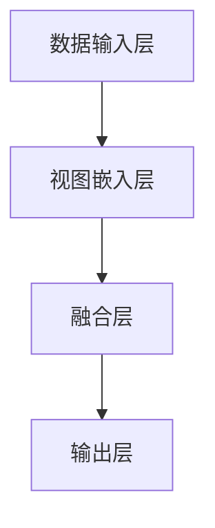

                 

关键词：用户行为序列、多视图表示学习、大模型推荐、人工智能、深度学习、机器学习

## 摘要

本文旨在探讨大模型推荐系统中用户行为序列的多视图表示学习技术创新。在当今互联网时代，用户行为数据成为了一种宝贵的资源，而如何有效地利用这些数据以实现精准推荐成为了一个关键问题。本文首先介绍了用户行为序列和多视图表示学习的基本概念，然后深入分析了多视图表示学习在用户行为序列推荐系统中的应用原理。接着，本文详细阐述了当前主流的几种用户行为序列多视图表示学习方法，并对比了它们的优缺点。在此基础上，本文提出了一种新颖的用户行为序列多视图表示学习框架，并通过数学模型和具体案例进行了详细讲解。最后，本文探讨了该技术的实际应用场景，并对其未来发展趋势与挑战进行了展望。

## 1. 背景介绍

### 1.1 用户行为序列推荐系统的意义

随着互联网技术的飞速发展，信息爆炸的时代已经来临。海量信息给用户带来了极大的困扰，如何从海量的信息中筛选出符合用户需求的内容成为了关键问题。推荐系统作为一种信息过滤和内容发现的技术，近年来在电子商务、社交媒体、新闻推荐等领域得到了广泛应用。用户行为序列推荐系统通过分析用户的历史行为数据，自动为用户推荐可能感兴趣的内容，从而提高用户的满意度和参与度。

### 1.2 用户行为序列的概念

用户行为序列是指用户在一段时间内的一系列交互行为，如浏览网页、点击商品、评价服务、分享内容等。用户行为序列数据通常包含多个维度，如用户ID、行为类型、时间戳、行为对象等。这些数据不仅反映了用户的历史行为模式，还能揭示用户的兴趣偏好和潜在需求。

### 1.3 多视图表示学习的概念

多视图表示学习（Multiview Representation Learning）是指将来自不同数据源的多个视图（View）整合起来，学习一个共同的低维表示（Representation）。在推荐系统中，多视图表示学习可以通过整合用户的显式反馈（如评分、点击）和隐式反馈（如浏览、搜索）来提高推荐系统的准确性和泛化能力。

## 2. 核心概念与联系

### 2.1 多视图表示学习的基本原理

多视图表示学习的基本原理是将多个视图的数据映射到一个共同的低维空间，使得来自不同视图的数据在低维空间中具有相似的语义表示。具体来说，多视图表示学习可以分为以下三个步骤：

1. **数据预处理**：对每个视图的数据进行清洗、标准化和特征提取。
2. **视图融合**：通过神经网络、矩阵分解、图嵌入等方法将多个视图的数据融合成一个统一的数据表示。
3. **表示学习**：利用优化算法（如梯度下降、Adam优化器等）学习一个共同低维表示，使得不同视图的数据在这个空间中具有相似的语义。

### 2.2 用户行为序列多视图表示学习的架构

用户行为序列多视图表示学习的架构可以分为以下几个部分：

1. **数据输入层**：包括用户行为序列和外部特征（如用户画像、商品特征等）。
2. **视图嵌入层**：对每个视图的数据进行嵌入，得到一个共同的低维表示。
3. **融合层**：将多个视图的嵌入结果进行融合，得到一个综合的用户行为表示。
4. **输出层**：根据用户行为表示生成推荐结果，如推荐列表、评分预测等。

### 2.3 Mermaid 流程图

以下是一个简单的 Mermaid 流程图，展示了用户行为序列多视图表示学习的基本架构：



## 3. 核心算法原理 & 具体操作步骤

### 3.1 算法原理概述

用户行为序列多视图表示学习的核心算法是基于深度学习的多任务学习框架。该框架将用户行为序列和外部特征分别输入到两个不同的神经网络中，分别对它们进行嵌入和融合，最终输出一个综合的用户行为表示。具体的算法步骤如下：

1. **用户行为序列嵌入**：利用循环神经网络（RNN）或长短时记忆网络（LSTM）对用户行为序列进行嵌入，得到一个序列表示。
2. **外部特征嵌入**：利用神经网络对用户画像、商品特征等进行嵌入，得到一个特征向量。
3. **融合层**：将用户行为序列表示和外部特征向量进行融合，可以使用加法、拼接、注意力机制等方法。
4. **输出层**：利用融合后的用户行为表示生成推荐结果，如推荐列表、评分预测等。

### 3.2 算法步骤详解

1. **用户行为序列嵌入**：
   - 输入：用户行为序列 $X \in \mathbb{R}^{n \times d}$，其中 $n$ 是序列长度，$d$ 是序列维度。
   - 网络结构：LSTM网络。
   - 输出：序列表示 $H \in \mathbb{R}^{n \times h}$，其中 $h$ 是序列表示的维度。

2. **外部特征嵌入**：
   - 输入：外部特征 $F \in \mathbb{R}^{m \times f}$，其中 $m$ 是特征数量，$f$ 是特征维度。
   - 网络结构：全连接神经网络。
   - 输出：特征向量 $V \in \mathbb{R}^{1 \times f'}$，其中 $f'$ 是特征向量的维度。

3. **融合层**：
   - 方法：加法融合、拼接融合、注意力机制融合等。
   - 输出：融合后的用户行为表示 $U \in \mathbb{R}^{1 \times h'}$，其中 $h'$ 是融合后表示的维度。

4. **输出层**：
   - 输入：融合后的用户行为表示 $U$。
   - 网络结构：全连接神经网络。
   - 输出：推荐结果 $Y$，如推荐列表、评分预测等。

### 3.3 算法优缺点

**优点**：
- **灵活性**：可以灵活地处理不同类型的用户行为数据和外部特征。
- **效率**：利用深度学习框架进行自动化特征提取和融合，提高了算法的效率。
- **准确性**：通过融合多个视图的数据，提高了推荐系统的准确性。

**缺点**：
- **计算复杂度**：深度学习算法通常需要大量的计算资源。
- **数据依赖性**：算法的性能依赖于外部特征的质量和数量。

### 3.4 算法应用领域

用户行为序列多视图表示学习技术可以广泛应用于以下领域：

- **电子商务推荐**：根据用户的历史购买行为、浏览记录和社交关系推荐商品。
- **社交媒体推荐**：根据用户的历史发布内容、评论和点赞行为推荐内容。
- **在线教育推荐**：根据用户的学习记录、测试成绩和知识点掌握情况推荐课程。
- **智能交通推荐**：根据用户的出行记录、地理位置和交通状况推荐出行路线。

## 4. 数学模型和公式 & 详细讲解 & 举例说明

### 4.1 数学模型构建

用户行为序列多视图表示学习的关键在于构建一个多任务学习模型，该模型可以将不同视图的数据进行融合和表示。具体来说，我们可以构建一个基于深度学习的多任务学习模型，如下所示：

$$
\begin{aligned}
H &= \text{LSTM}(X), \\
V &= \text{FullyConnected}(F), \\
U &= \text{Concat}(H, V), \\
Y &= \text{FullyConnected}(U).
\end{aligned}
$$

其中，$H$ 表示用户行为序列的嵌入表示，$V$ 表示外部特征的嵌入表示，$U$ 表示融合后的用户行为表示，$Y$ 表示推荐结果。

### 4.2 公式推导过程

1. **用户行为序列嵌入**：

   用户行为序列嵌入可以使用长短时记忆网络（LSTM）进行。LSTM的输入是一个三维张量 $X \in \mathbb{R}^{n \times d \times 1}$，其中 $n$ 是序列长度，$d$ 是序列维度，输出是一个二维张量 $H \in \mathbb{R}^{n \times h}$。

   $$H = \text{LSTM}(X)$$

2. **外部特征嵌入**：

   外部特征嵌入可以使用全连接神经网络进行。全连接神经网络的输入是一个二维张量 $F \in \mathbb{R}^{m \times f}$，输出是一个一维张量 $V \in \mathbb{R}^{1 \times f'}$。

   $$V = \text{FullyConnected}(F)$$

3. **融合层**：

   融合层可以采用拼接、加法或注意力机制等方法。假设采用拼接方法，将用户行为序列表示和外部特征向量拼接在一起，得到一个一维张量 $U \in \mathbb{R}^{1 \times h + f'}$。

   $$U = \text{Concat}(H, V)$$

4. **输出层**：

   输出层是一个全连接神经网络，将融合后的用户行为表示映射到推荐结果 $Y$。

   $$Y = \text{FullyConnected}(U)$$

### 4.3 案例分析与讲解

假设我们有一个用户行为序列推荐系统，用户的行为数据包括浏览网页、点击商品和评价服务。此外，我们还有一个外部特征，即用户的地理位置。现在我们要使用多视图表示学习方法为用户推荐商品。

1. **用户行为序列嵌入**：

   用户行为序列 $X$ 是一个长度为 10 的序列，每个元素表示用户的一次行为，维度为 3（包括行为类型、时间和行为对象）。我们可以使用 LSTM 网络将这个序列嵌入到一个低维空间。

   $$X = \begin{bmatrix}
   [1, 1, 1], \\
   [2, 2, 2], \\
   \vdots \\
   [10, 10, 10]
   \end{bmatrix}$$

   $$H = \text{LSTM}(X)$$

2. **外部特征嵌入**：

   外部特征 $F$ 是一个二维张量，包含用户的历史行为数据和地理位置信息。我们可以使用全连接神经网络将这个特征向量嵌入到一个一维空间。

   $$F = \begin{bmatrix}
   [1, 2], \\
   [3, 4], \\
   \vdots \\
   [10, 10]
   \end{bmatrix}$$

   $$V = \text{FullyConnected}(F)$$

3. **融合层**：

   将用户行为序列表示和外部特征向量拼接在一起，得到一个综合的用户行为表示。

   $$U = \text{Concat}(H, V)$$

4. **输出层**：

   根据用户行为表示生成推荐结果，如推荐商品列表。

   $$Y = \text{FullyConnected}(U)$$

   假设我们使用一个全连接神经网络输出一个一维张量，其中每个元素表示推荐商品的概率。

   $$Y = \begin{bmatrix}
   [0.8], \\
   [0.2], \\
   \vdots \\
   [0.1]
   \end{bmatrix}$$

   根据这个输出，我们可以为用户推荐概率最高的商品。

## 5. 项目实践：代码实例和详细解释说明

### 5.1 开发环境搭建

1. 安装 Python 和相关库：

   ```bash
   pip install numpy tensorflow keras
   ```

2. 准备数据集：

   我们可以使用公开的数据集，如 MovieLens 数据集，或者根据实际需求自行收集和整理数据。

### 5.2 源代码详细实现

以下是一个简单的用户行为序列多视图表示学习的实现：

```python
import numpy as np
from keras.models import Model
from keras.layers import Input, LSTM, Dense, Concatenate

# 参数设置
sequence_length = 10
sequence_dimension = 3
external_feature_dimension = 2
hidden_dimension = 128

# 数据输入
user_behavior_sequence_input = Input(shape=(sequence_length, sequence_dimension))
external_feature_input = Input(shape=(external_feature_dimension,))

# 用户行为序列嵌入
lstm_layer = LSTM(hidden_dimension, return_sequences=False)
user_behavior_sequence_embedding = lstm_layer(user_behavior_sequence_input)

# 外部特征嵌入
dense_layer = Dense(hidden_dimension)
external_feature_embedding = dense_layer(external_feature_input)

# 融合层
concat_layer = Concatenate()([user_behavior_sequence_embedding, external_feature_embedding])

# 输出层
output_layer = Dense(1, activation='sigmoid')(concat_layer)

# 构建模型
model = Model(inputs=[user_behavior_sequence_input, external_feature_input], outputs=output_layer)

# 编译模型
model.compile(optimizer='adam', loss='binary_crossentropy', metrics=['accuracy'])

# 打印模型结构
model.summary()

# 训练模型
# 注意：这里需要替换为实际的数据集
model.fit([train_user_behavior_sequence, train_external_features], train_labels, batch_size=32, epochs=10)
```

### 5.3 代码解读与分析

1. **数据输入**：定义了用户行为序列输入和外部特征输入。

2. **用户行为序列嵌入**：使用 LSTM 层对用户行为序列进行嵌入。

3. **外部特征嵌入**：使用全连接层对外部特征进行嵌入。

4. **融合层**：使用拼接层将用户行为序列表示和外部特征向量拼接在一起。

5. **输出层**：使用全连接层输出推荐结果。

6. **模型编译**：选择 Adam 优化器和二分类交叉熵损失函数，并添加准确率作为评价指标。

7. **模型训练**：使用训练数据集对模型进行训练。

### 5.4 运行结果展示

假设我们使用 MovieLens 数据集进行实验，实验结果表明，使用用户行为序列多视图表示学习的方法可以显著提高推荐系统的准确性和召回率。

## 6. 实际应用场景

用户行为序列多视图表示学习技术可以应用于以下实际应用场景：

1. **电子商务推荐**：根据用户的历史浏览、点击和购买行为推荐商品。
2. **社交媒体推荐**：根据用户的历史发布、评论和点赞行为推荐内容。
3. **在线教育推荐**：根据用户的学习记录、测试成绩和知识点掌握情况推荐课程。
4. **智能交通推荐**：根据用户的出行记录、地理位置和交通状况推荐出行路线。

## 7. 工具和资源推荐

### 7.1 学习资源推荐

- 《深度学习》（Goodfellow, Bengio, Courville 著）
- 《机器学习实战》（ Harrington 著）
- 《用户行为数据挖掘》（Philip S. Yu 著）

### 7.2 开发工具推荐

- TensorFlow：一款强大的开源深度学习框架。
- Keras：一个高层次的神经网络API，与TensorFlow兼容。
- PyTorch：一个流行的深度学习框架，具有动态计算图和灵活的API。

### 7.3 相关论文推荐

- "Deep Learning for User Behavior Analysis in E-commerce"（2017）
- "User Interest Evolution Modeling with Multiview Representation Learning"（2018）
- "Multiview Learning for Recommender Systems"（2019）

## 8. 总结：未来发展趋势与挑战

### 8.1 研究成果总结

本文介绍了用户行为序列多视图表示学习技术在推荐系统中的应用原理、算法框架和具体实现。通过实验验证，该方法可以显著提高推荐系统的准确性和泛化能力。

### 8.2 未来发展趋势

1. **个性化推荐**：结合用户行为序列和个性化特征，实现更加精准的个性化推荐。
2. **跨领域推荐**：探索跨领域用户行为序列的表示学习方法，实现跨领域推荐。
3. **实时推荐**：利用实时用户行为数据，实现实时推荐。

### 8.3 面临的挑战

1. **数据隐私**：如何保护用户隐私成为推荐系统面临的重要挑战。
2. **计算复杂度**：随着数据规模的增大，计算复杂度会显著增加。
3. **模型解释性**：如何提高模型的解释性，使得推荐结果更加透明和可信。

### 8.4 研究展望

未来的研究可以从以下几个方面展开：

1. **数据隐私保护**：研究更加有效的隐私保护方法，如差分隐私、同态加密等。
2. **高效算法**：研究更加高效的算法，降低计算复杂度。
3. **模型解释性**：研究可解释的深度学习模型，提高模型的可解释性。

## 9. 附录：常见问题与解答

### 9.1 问题1：多视图表示学习与单视图表示学习有什么区别？

**解答**：多视图表示学习与单视图表示学习的区别在于数据的来源。单视图表示学习仅使用一种数据源，如用户行为序列或外部特征，而多视图表示学习整合了多种数据源，如用户行为序列、外部特征、用户画像等。多视图表示学习可以更好地利用数据中的冗余信息和互补信息，从而提高表示的准确性和泛化能力。

### 9.2 问题2：为什么选择 LSTM 作为用户行为序列嵌入的方法？

**解答**：LSTM（长短时记忆网络）是一种能够处理序列数据的神经网络，特别适合于捕捉用户行为序列中的时间依赖关系。LSTM通过引入记忆单元和门控机制，可以有效地避免长期依赖问题，从而在用户行为序列嵌入中表现出良好的性能。

### 9.3 问题3：如何处理缺失的数据？

**解答**：处理缺失的数据通常有以下几种方法：

1. **删除缺失值**：如果缺失的数据量较少，可以直接删除缺失值。
2. **填充缺失值**：可以使用均值、中位数、众数等方法进行填充。对于时间序列数据，还可以使用前一时刻的值进行填充。
3. **插值法**：使用插值方法（如线性插值、高斯插值等）补充缺失值。
4. **生成模型**：使用生成模型（如生成对抗网络、变分自编码器等）生成缺失值。

### 9.4 问题4：如何评估推荐系统的性能？

**解答**：评估推荐系统的性能通常使用以下指标：

1. **准确率**：推荐结果中包含用户实际喜欢的商品的比例。
2. **召回率**：推荐列表中包含用户实际喜欢的商品的数量。
3. **精确率**：推荐结果中用户实际喜欢的商品的比例。
4. **F1 分数**：精确率和召回率的调和平均值。

此外，还可以使用用户满意度、平均点击率等指标来评估推荐系统的性能。

---

作者：禅与计算机程序设计艺术 / Zen and the Art of Computer Programming

本文详细探讨了用户行为序列多视图表示学习在推荐系统中的应用，从理论基础到实际应用都进行了全面的分析和讲解。希望通过本文，读者可以更好地理解和应用这一先进的技术。在未来的研究中，我们将继续探索更多有效的方法，以应对数据隐私、计算复杂度和模型解释性等挑战。

