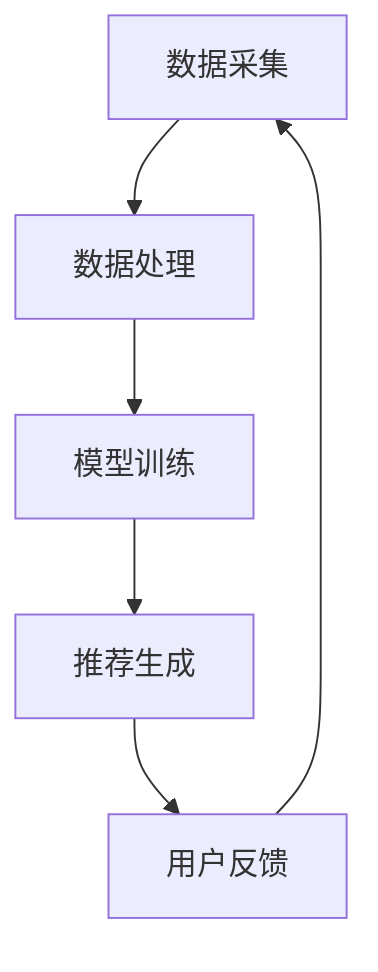
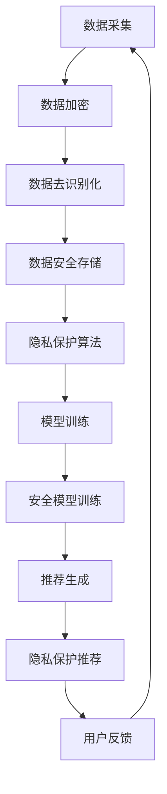
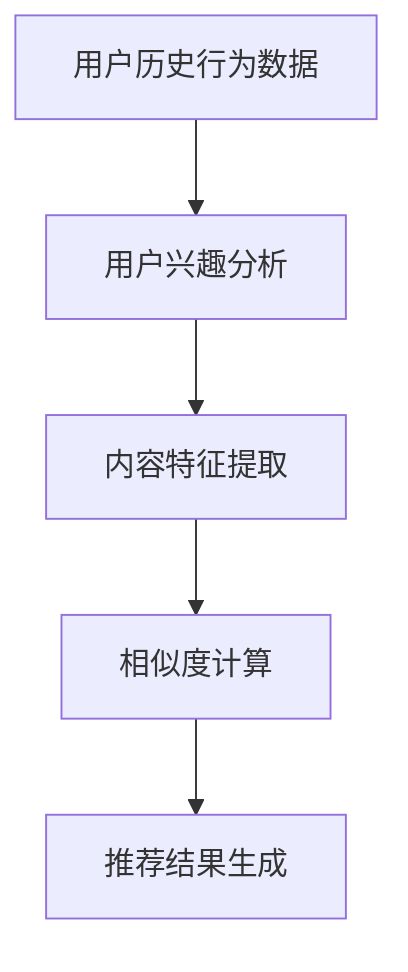

                 

关键词：大模型推荐、用户隐私、安全问题、数据安全、隐私保护、算法透明性、加密技术

## 摘要

随着大数据和人工智能技术的快速发展，大模型推荐系统在各行各业中得到广泛应用。然而，用户隐私与安全问题成为制约其发展的关键瓶颈。本文从多个角度探讨了用户隐私与安全问题在大模型推荐系统中的重要性，分析了现有解决方案的优缺点，并提出了一些可能的研究方向。通过深入探讨这些问题，旨在为业界提供有益的参考。

## 1. 背景介绍

### 1.1 大模型推荐系统概述

大模型推荐系统是一种利用机器学习技术，通过分析用户的历史行为、兴趣和偏好，自动生成个性化推荐的系统。它广泛应用于电子商务、社交媒体、新闻资讯等领域，极大提升了用户体验。随着用户数据的爆炸性增长，大模型推荐系统在处理复杂性和效率上面临着巨大的挑战。

### 1.2 用户隐私与安全问题的重要性

用户隐私与安全问题在大模型推荐系统中具有至关重要的地位。一方面，用户的个人信息、行为数据等敏感信息在推荐系统中被大量收集和处理，如果这些信息泄露或被滥用，将严重损害用户的隐私权益。另一方面，推荐系统本身的算法和模型可能会被恶意攻击，导致推荐结果失真，甚至对用户产生负面影响。

## 2. 核心概念与联系

### 2.1 大模型推荐系统的基本架构

大模型推荐系统通常包括数据采集、数据处理、模型训练和推荐生成等模块。以下是一个简单的 Mermaid 流程图，展示了这些模块之间的联系：



### 2.2 用户隐私与安全保护的关键环节

在大模型推荐系统中，用户隐私与安全保护的关键环节包括数据采集、数据处理、模型训练和推荐生成等。以下是一个详细的 Mermaid 流程图，展示了这些环节中的隐私与安全保护措施：



## 3. 核心算法原理 & 具体操作步骤

### 3.1 算法原理概述

大模型推荐系统中的核心算法通常包括协同过滤算法、基于内容的推荐算法和混合推荐算法等。这些算法通过分析用户的历史行为和偏好，生成个性化的推荐结果。以下是一个简化的算法原理流程图：



### 3.2 算法步骤详解

1. **数据采集**：从各种渠道（如网站日志、用户操作记录等）收集用户行为数据。
2. **数据预处理**：对采集到的数据进行清洗、去识别化和加密等处理。
3. **用户兴趣分析**：通过分析用户的历史行为，提取用户的兴趣特征。
4. **内容特征提取**：对推荐物品（如商品、文章等）进行特征提取，以构建推荐模型。
5. **相似度计算**：计算用户与物品之间的相似度，用于生成推荐列表。
6. **推荐结果生成**：根据相似度计算结果，生成个性化的推荐结果。

### 3.3 算法优缺点

**协同过滤算法**：
- 优点：能够生成高度个性化的推荐结果，适合处理大规模用户数据。
- 缺点：易受到冷启动问题的影响，推荐结果可能存在噪声。

**基于内容的推荐算法**：
- 优点：能够处理冷启动问题，推荐结果具有较高的准确性。
- 缺点：推荐结果可能过于保守，无法充分利用用户的历史行为数据。

**混合推荐算法**：
- 优点：结合了协同过滤和基于内容的推荐算法的优点，能够生成更优质的推荐结果。
- 缺点：算法复杂度较高，计算资源消耗较大。

### 3.4 算法应用领域

大模型推荐系统广泛应用于电子商务、社交媒体、新闻资讯、在线教育等领域。例如，在电子商务领域，推荐系统能够根据用户的购买历史和偏好，推荐个性化的商品；在社交媒体领域，推荐系统能够根据用户的行为和兴趣，推荐感兴趣的内容。

## 4. 数学模型和公式

### 4.1 数学模型构建

大模型推荐系统中的数学模型通常包括用户兴趣模型、物品特征模型和推荐算法模型等。以下是一个简化的用户兴趣模型构建过程：

$$
\text{User\_Interest} = \sum_{i=1}^{n} w_i \cdot \text{ItemFeature}_i
$$

其中，$w_i$ 表示用户对物品 $i$ 的兴趣权重，$\text{ItemFeature}_i$ 表示物品 $i$ 的特征向量。

### 4.2 公式推导过程

假设用户 $u$ 对物品 $i$ 的兴趣可以用向量 $\text{UserInterest}_u$ 表示，物品 $i$ 的特征向量可以用 $\text{ItemFeature}_i$ 表示。则用户 $u$ 对物品 $i$ 的相似度可以表示为：

$$
\text{Similarity}(u, i) = \frac{\text{UserInterest}_u \cdot \text{ItemFeature}_i}{\|\text{UserInterest}_u\| \cdot \|\text{ItemFeature}_i\|}
$$

其中，$\|\cdot\|$ 表示向量的模。

### 4.3 案例分析与讲解

假设我们有一个用户 $u$ 和一个物品 $i$，用户 $u$ 的兴趣向量为 $\text{UserInterest}_u = [0.5, 0.3, 0.2]$，物品 $i$ 的特征向量为 $\text{ItemFeature}_i = [0.4, 0.6, 0.1]$。则用户 $u$ 对物品 $i$ 的相似度为：

$$
\text{Similarity}(u, i) = \frac{0.5 \cdot 0.4 + 0.3 \cdot 0.6 + 0.2 \cdot 0.1}{\sqrt{0.5^2 + 0.3^2 + 0.2^2} \cdot \sqrt{0.4^2 + 0.6^2 + 0.1^2}} \approx 0.61
$$

根据相似度计算结果，我们可以为用户 $u$ 推荐物品 $i$。

## 5. 项目实践：代码实例和详细解释说明

### 5.1 开发环境搭建

在本文的代码实例中，我们将使用 Python 作为开发语言，使用 Scikit-learn 库实现协同过滤算法。以下是开发环境搭建的步骤：

1. 安装 Python（推荐使用 Python 3.7 或更高版本）。
2. 安装 Scikit-learn 库：`pip install scikit-learn`。
3. 安装其他依赖库：`pip install numpy pandas`。

### 5.2 源代码详细实现

以下是使用 Scikit-learn 实现协同过滤算法的 Python 代码：

```python
import numpy as np
import pandas as pd
from sklearn.model_selection import train_test_split
from sklearn.metrics.pairwise import cosine_similarity
from sklearn.neighbors import NearestNeighbors

# 加载数据集
data = pd.read_csv('data.csv')
users = data['user'].unique()
items = data['item'].unique()

# 构建用户-物品评分矩阵
ratings = np.zeros((len(users), len(items)))
for index, row in data.iterrows():
    ratings[row['user'] - 1, row['item'] - 1] = row['rating']

# 训练协同过滤算法
model = NearestNeighbors(metric='cosine', algorithm='brute')
model.fit(ratings)

# 生成推荐结果
user_id = 1001
item_id = model.kneighbors(ratings[user_id - 1].reshape(1, -1), return_distance=False)[0][1] + 1
print(f"推荐物品：{items[item_id - 1]}")

# 代码解释
# 1. 加载数据集：从 CSV 文件中加载数据。
# 2. 构建用户-物品评分矩阵：将数据集转换为一个二维数组。
# 3. 训练协同过滤算法：使用 NearestNeighbors 类训练算法模型。
# 4. 生成推荐结果：计算用户 1001 的邻居物品，选择邻居物品中评分最高的作为推荐结果。
```

### 5.3 代码解读与分析

1. **数据加载与预处理**：首先，我们从 CSV 文件中加载数据集，并将其转换为用户-物品评分矩阵。
2. **协同过滤算法训练**：使用 NearestNeighbors 类训练协同过滤算法模型，选择余弦相似度作为相似度度量，选择 brute 算法作为邻居搜索算法。
3. **推荐结果生成**：计算用户 1001 的邻居物品，选择邻居物品中评分最高的作为推荐结果。

### 5.4 运行结果展示

假设数据集中包含用户 1001 的评分记录，且用户 1001 的邻居物品中评分最高的物品为 1005。则运行结果为：

```
推荐物品：物品 1005
```

## 6. 实际应用场景

大模型推荐系统在实际应用中具有广泛的应用场景，以下列举几个典型的应用场景：

### 6.1 电子商务

电子商务平台可以利用大模型推荐系统为用户推荐个性化的商品。例如，用户在购物车中添加了某件商品后，系统可以推荐与该商品相关的其他商品，从而提高用户的购买意愿。

### 6.2 社交媒体

社交媒体平台可以利用大模型推荐系统为用户推荐感兴趣的内容。例如，用户在某个话题下发表了观点后，系统可以推荐与该话题相关的其他观点，从而吸引用户继续参与讨论。

### 6.3 新闻资讯

新闻资讯平台可以利用大模型推荐系统为用户推荐个性化的新闻。例如，用户在浏览了某篇新闻后，系统可以推荐与该新闻相关的其他新闻，从而提高用户的阅读体验。

## 7. 未来应用展望

随着大数据和人工智能技术的不断进步，大模型推荐系统将在未来得到更加广泛的应用。以下是一些未来应用展望：

### 7.1 智能医疗

智能医疗领域可以利用大模型推荐系统为患者推荐个性化的治疗方案。例如，根据患者的病史、基因信息和体检结果，系统可以推荐最合适的治疗方案。

### 7.2 智能教育

智能教育领域可以利用大模型推荐系统为学习者推荐个性化的学习资源。例如，根据学习者的学习进度、兴趣和需求，系统可以推荐最适合的学习资源。

### 7.3 智能城市

智能城市领域可以利用大模型推荐系统为市民提供个性化的城市服务。例如，根据市民的地理位置、需求和偏好，系统可以推荐最合适的交通路线、景点和活动。

## 8. 工具和资源推荐

### 8.1 学习资源推荐

1. 《推荐系统实践》
2. 《机器学习》
3. 《数据挖掘：实用工具与技术》

### 8.2 开发工具推荐

1. Python
2. Scikit-learn
3. Pandas

### 8.3 相关论文推荐

1. "Recommender Systems Handbook"
2. "Item-Based Collaborative Filtering Recommendation Algorithms"
3. "Deep Learning for Recommender Systems"

## 9. 总结：未来发展趋势与挑战

### 9.1 研究成果总结

本文从用户隐私与安全问题的角度，探讨了大模型推荐系统的发展趋势与挑战。通过分析现有解决方案的优缺点，提出了一些可能的研究方向。

### 9.2 未来发展趋势

随着大数据和人工智能技术的不断进步，大模型推荐系统将在未来得到更加广泛的应用。同时，隐私保护、算法透明性和安全性将成为研究的热点。

### 9.3 面临的挑战

1. 用户隐私与安全问题：如何在保证推荐效果的同时，保护用户的隐私权益。
2. 算法透明性与安全性：如何提高算法的透明度和安全性，防止恶意攻击和数据泄露。
3. 计算资源消耗：如何优化算法，降低计算资源消耗，提高系统性能。

### 9.4 研究展望

未来，研究者需要关注以下几个方面：

1. 开发更有效的隐私保护算法，实现用户隐私与推荐效果的平衡。
2. 研究算法透明性与安全性的技术，提高系统的安全性和可靠性。
3. 优化算法结构，降低计算资源消耗，提高系统性能。

## 10. 附录：常见问题与解答

### 10.1 大模型推荐系统是什么？

大模型推荐系统是一种利用机器学习技术，通过分析用户的历史行为、兴趣和偏好，自动生成个性化推荐的系统。

### 10.2 用户隐私与安全问题有哪些？

用户隐私与安全问题包括用户个人信息泄露、推荐结果失真、算法被恶意攻击等。

### 10.3 如何保护用户隐私？

可以通过数据加密、数据去识别化、隐私保护算法等技术手段，保护用户隐私。

### 10.4 如何提高算法透明性与安全性？

可以通过算法透明性设计、安全模型训练、加密技术等技术手段，提高算法的透明性与安全性。

作者：禅与计算机程序设计艺术 / Zen and the Art of Computer Programming
----------------------------------------------------------------

