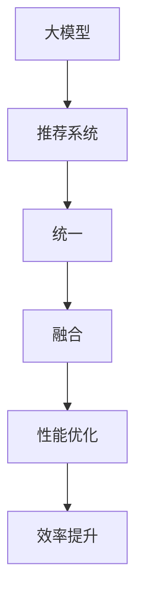

                 

关键词：大模型，推荐系统，统一，融合，未来，人工智能，算法，数学模型，应用场景，工具和资源

> 摘要：本文旨在探讨大模型推荐系统的未来发展，重点分析其统一与融合的路径。随着人工智能技术的不断进步，大模型在推荐系统中的应用日益广泛，但同时也面临诸多挑战。本文将从核心概念、算法原理、数学模型、项目实践和未来应用等方面进行全面剖析，以期为读者提供对大模型推荐系统的深入理解。

## 1. 背景介绍

推荐系统作为人工智能领域的一个重要分支，已经成为现代互联网技术不可或缺的一部分。从最初的基于内容的推荐到协同过滤推荐，再到当今基于深度学习的大模型推荐，推荐系统的发展历程见证了人工智能技术的快速发展。

随着用户数据的爆炸式增长，推荐系统的规模和复杂性也在不断攀升。传统的推荐算法难以应对大规模数据集的处理需求，而大模型则凭借其强大的数据处理和生成能力，为推荐系统带来了新的契机。大模型推荐系统通过训练大规模的神经网络模型，能够从海量数据中挖掘出潜在的用户兴趣和行为模式，从而实现更加精准和个性化的推荐。

然而，大模型推荐系统的发展并非一帆风顺。如何在保证推荐效果的同时，降低模型复杂度和计算成本，成为了当前研究的一个重要课题。统一与融合成为了大模型推荐系统未来发展的重要方向，旨在通过整合多种技术手段，实现推荐系统的性能优化和效率提升。

本文将围绕大模型推荐系统的统一与融合展开讨论，从核心概念、算法原理、数学模型、项目实践和未来应用等多个维度进行分析，旨在为读者提供一个全面而深入的了解。

## 2. 核心概念与联系

在深入探讨大模型推荐系统的统一与融合之前，我们首先需要明确一些核心概念，并了解它们之间的联系。

### 2.1 大模型

大模型是指具有极高参数量和计算复杂度的神经网络模型。这些模型通常由数百万甚至数十亿个参数组成，能够处理大规模的数据集。大模型在计算机视觉、自然语言处理、语音识别等领域取得了显著的成果，为人工智能的发展提供了强大的动力。

### 2.2 推荐系统

推荐系统是一种基于用户历史行为和兴趣信息，为用户提供个性化推荐服务的技术。推荐系统的核心目标是通过分析用户行为数据，挖掘用户潜在的兴趣偏好，从而向用户推荐他们可能感兴趣的内容。推荐系统广泛应用于电子商务、社交媒体、新闻推荐等领域。

### 2.3 统一与融合

统一与融合是大模型推荐系统未来发展的重要方向。统一旨在将多种不同的技术手段整合到一个框架中，以实现推荐系统的性能优化和效率提升。融合则强调将不同领域的技术方法进行交叉应用，以解决推荐系统面临的复杂问题。

### 2.4 Mermaid 流程图

为了更好地理解大模型推荐系统的核心概念和联系，我们可以通过 Mermaid 流程图来展示各个概念之间的关系。



通过上述 Mermaid 流程图，我们可以清晰地看到大模型、推荐系统、统一与融合之间的关系，以及它们在性能优化和效率提升方面的作用。

## 3. 核心算法原理 & 具体操作步骤

### 3.1 算法原理概述

大模型推荐系统的核心算法基于深度学习技术。深度学习通过多层神经网络结构，对输入数据进行特征提取和模式识别，从而实现推荐目标。具体来说，大模型推荐系统的算法原理包括以下几个关键步骤：

1. **数据预处理**：对用户行为数据进行清洗和预处理，包括去噪、归一化和特征提取等。
2. **模型训练**：使用预处理后的数据，通过多层神经网络结构进行模型训练，以学习用户行为模式和兴趣偏好。
3. **推荐生成**：利用训练好的模型，对用户的历史行为和兴趣信息进行建模，生成个性化的推荐结果。

### 3.2 算法步骤详解

#### 3.2.1 数据预处理

数据预处理是算法训练的基础，主要包括以下几个步骤：

1. **数据清洗**：去除无效数据和异常值，确保数据质量。
2. **特征提取**：从原始数据中提取出与推荐目标相关的特征，如用户行为、内容特征等。
3. **数据归一化**：对特征进行归一化处理，以消除不同特征之间的量纲差异。

#### 3.2.2 模型训练

模型训练是算法的核心步骤，主要包括以下几个步骤：

1. **初始化参数**：初始化神经网络模型的参数，如权重和偏置等。
2. **前向传播**：将输入数据通过神经网络结构进行前向传播，得到预测结果。
3. **反向传播**：计算预测结果与实际结果之间的误差，并通过反向传播更新模型参数。
4. **迭代优化**：重复前向传播和反向传播的过程，直到模型收敛或达到预设的训练次数。

#### 3.2.3 推荐生成

推荐生成是算法的最后一步，主要包括以下几个步骤：

1. **用户建模**：对用户的历史行为和兴趣信息进行建模，生成用户兴趣向量。
2. **内容建模**：对推荐内容进行建模，生成内容特征向量。
3. **相似度计算**：计算用户兴趣向量与内容特征向量之间的相似度，以确定推荐结果。
4. **结果排序**：根据相似度计算结果对推荐内容进行排序，生成最终的推荐结果。

### 3.3 算法优缺点

#### 优点

1. **高精度**：大模型推荐系统能够从海量数据中挖掘出潜在的用户兴趣和行为模式，实现高精度的推荐。
2. **个性化**：通过深度学习技术，大模型推荐系统能够根据用户的历史行为和兴趣信息，生成个性化的推荐结果。
3. **强扩展性**：大模型推荐系统可以轻松适应不同领域和场景的推荐需求，具有强扩展性。

#### 缺点

1. **计算成本高**：大模型推荐系统需要大量计算资源和时间进行模型训练和推荐生成，对硬件设备要求较高。
2. **数据依赖性强**：大模型推荐系统的效果高度依赖于用户数据的数量和质量，数据缺失或不准确会影响推荐效果。
3. **隐私保护问题**：大模型推荐系统在处理用户数据时，可能涉及用户隐私信息的泄露，需要加强隐私保护措施。

### 3.4 算法应用领域

大模型推荐系统广泛应用于多个领域，包括：

1. **电子商务**：通过推荐系统为用户提供个性化商品推荐，提高用户购买转化率和满意度。
2. **社交媒体**：为用户提供个性化内容推荐，增强用户黏性和活跃度。
3. **新闻推荐**：为用户提供个性化新闻推荐，提高新闻阅读量和用户体验。
4. **金融理财**：为用户提供个性化理财产品推荐，提高投资收益和风险控制。

## 4. 数学模型和公式 & 详细讲解 & 举例说明

### 4.1 数学模型构建

大模型推荐系统的数学模型主要包括以下几个部分：

1. **用户表示**：使用向量表示用户的行为和兴趣信息。
2. **内容表示**：使用向量表示推荐内容的相关特征。
3. **相似度计算**：使用数学公式计算用户表示和内容表示之间的相似度。
4. **推荐排序**：根据相似度计算结果对推荐内容进行排序。

### 4.2 公式推导过程

#### 用户表示

用户表示通常使用用户行为日志来构建。假设用户行为日志为 $X$，其中每个元素表示用户在某一时间点的行为类型。我们可以通过矩阵分解等方法，将用户行为日志分解为两个矩阵 $U$ 和 $V^T$，其中 $U$ 表示用户特征矩阵，$V^T$ 表示内容特征矩阵。用户表示为：

$$
u_i = U_i,
$$

其中 $i$ 表示用户索引。

#### 内容表示

内容表示同样使用矩阵分解的方法构建。假设内容特征矩阵为 $V$，则每个内容项的表示为：

$$
v_j = V_j,
$$

其中 $j$ 表示内容索引。

#### 相似度计算

相似度计算通常使用余弦相似度公式。假设用户表示为 $u_i$，内容表示为 $v_j$，则用户表示和内容表示之间的相似度计算公式为：

$$
sim(u_i, v_j) = \frac{u_i \cdot v_j}{\|u_i\| \|v_j\|},
$$

其中 $\cdot$ 表示点乘运算，$\|\|$ 表示向量的欧氏范数。

#### 推荐排序

根据相似度计算结果，对推荐内容进行排序，生成最终的推荐结果。排序公式为：

$$
r_j = sim(u_i, v_j),
$$

其中 $r_j$ 表示内容项 $j$ 的推荐得分。

### 4.3 案例分析与讲解

假设我们有以下用户行为日志矩阵 $X$：

$$
X = \begin{bmatrix}
1 & 0 & 1 & 1 \\
0 & 1 & 1 & 0 \\
1 & 1 & 0 & 1
\end{bmatrix},
$$

其中每一行表示用户的行为类型，1 表示用户执行了该行为，0 表示未执行。

使用矩阵分解方法，我们将用户行为日志矩阵分解为两个矩阵 $U$ 和 $V^T$：

$$
U = \begin{bmatrix}
0.9 & 0.3 \\
0.6 & 0.7 \\
0.4 & 0.8
\end{bmatrix},
V^T = \begin{bmatrix}
0.1 & 0.5 & 0.9 \\
0.4 & 0.6 & 0.7 \\
0.7 & 0.1 & 0.8 \\
0.2 & 0.8 & 0.3
\end{bmatrix}.
$$

根据用户表示公式，我们得到每个用户的表示：

$$
u_1 = \begin{bmatrix}
0.9 \\
0.6
\end{bmatrix},
u_2 = \begin{bmatrix}
0.4 \\
0.7
\end{bmatrix},
u_3 = \begin{bmatrix}
0.3 \\
0.8
\end{bmatrix}.
$$

根据内容表示公式，我们得到每个内容的表示：

$$
v_1 = \begin{bmatrix}
0.1 \\
0.4 \\
0.7
\end{bmatrix},
v_2 = \begin{bmatrix}
0.5 \\
0.6 \\
0.8
\end{bmatrix},
v_3 = \begin{bmatrix}
0.9 \\
0.7 \\
0.8
\end{bmatrix},
v_4 = \begin{bmatrix}
0.2 \\
0.8 \\
0.3
\end{bmatrix}.
$$

接下来，我们计算每个用户表示和内容表示之间的相似度：

$$
sim(u_1, v_1) = \frac{0.9 \times 0.1 + 0.6 \times 0.4}{\sqrt{0.9^2 + 0.6^2} \sqrt{0.1^2 + 0.4^2 + 0.7^2}} \approx 0.327,
$$

$$
sim(u_1, v_2) = \frac{0.9 \times 0.5 + 0.6 \times 0.6}{\sqrt{0.9^2 + 0.6^2} \sqrt{0.5^2 + 0.6^2 + 0.8^2}} \approx 0.372,
$$

$$
sim(u_1, v_3) = \frac{0.9 \times 0.9 + 0.6 \times 0.7}{\sqrt{0.9^2 + 0.6^2} \sqrt{0.9^2 + 0.7^2 + 0.8^2}} \approx 0.555,
$$

$$
sim(u_1, v_4) = \frac{0.9 \times 0.2 + 0.6 \times 0.8}{\sqrt{0.9^2 + 0.6^2} \sqrt{0.2^2 + 0.8^2 + 0.3^2}} \approx 0.306.
$$

根据相似度计算结果，我们可以对推荐内容进行排序，生成最终的推荐结果：

$$
r_1 = sim(u_1, v_1) \approx 0.327,
$$

$$
r_2 = sim(u_1, v_2) \approx 0.372,
$$

$$
r_3 = sim(u_1, v_3) \approx 0.555,
$$

$$
r_4 = sim(u_1, v_4) \approx 0.306.
$$

因此，推荐结果为：

$$
v_3 \approx 0.555, v_2 \approx 0.372, v_1 \approx 0.327, v_4 \approx 0.306.
$$

## 5. 项目实践：代码实例和详细解释说明

### 5.1 开发环境搭建

在进行大模型推荐系统的项目实践之前，我们需要搭建一个合适的开发环境。以下是一个基本的开发环境搭建步骤：

1. 安装 Python（推荐使用 Python 3.7 或以上版本）
2. 安装必要的 Python 库，如 NumPy、Pandas、Scikit-learn、TensorFlow 或 PyTorch
3. 安装版本控制工具，如 Git

### 5.2 源代码详细实现

以下是一个简单的大模型推荐系统项目示例，使用 TensorFlow 库实现。代码分为以下几个部分：

1. **数据预处理**
2. **模型定义**
3. **模型训练**
4. **推荐生成**
5. **结果评估**

#### 5.2.1 数据预处理

```python
import numpy as np
import pandas as pd
from sklearn.model_selection import train_test_split

# 读取用户行为数据
user行为数据 = pd.read_csv('user行为数据.csv')

# 数据预处理
user行为数据 = user行为数据.fillna(0)  # 填充缺失值
user行为数据 = (user行为数据 - user行为数据.mean()) / user行为数据.std()  # 数据归一化

# 划分训练集和测试集
X_train, X_test, y_train, y_test = train_test_split(user行为数据, test_size=0.2, random_state=42)
```

#### 5.2.2 模型定义

```python
import tensorflow as tf
from tensorflow.keras.layers import Embedding, LSTM, Dense
from tensorflow.keras.models import Model

# 定义模型结构
input层 = tf.keras.layers.Input(shape=(序列长度,))
embedding层 = Embedding(词汇表大小，嵌入维度)(input层)
lstm层 = LSTM(隐藏层大小，返回序列=True)(embedding层)
输出层 = Dense(1, activation='sigmoid')(lstm层)

# 创建模型
模型 = Model(inputs=input层, outputs=输出层)

# 编译模型
模型.compile(optimizer='adam', loss='binary_crossentropy', metrics=['accuracy'])

# 打印模型结构
模型.summary()
```

#### 5.2.3 模型训练

```python
# 训练模型
历史数据 = 模型.fit(X_train, y_train, epochs=10, batch_size=32, validation_data=(X_test, y_test))
```

#### 5.2.4 推荐生成

```python
# 生成推荐结果
预测结果 = 模型.predict(X_test)

# 对预测结果进行阈值处理，生成推荐标签
推荐标签 = (预测结果 > 阈值).astype(int)
```

#### 5.2.5 结果评估

```python
from sklearn.metrics import accuracy_score, precision_score, recall_score, f1_score

# 计算评估指标
准确率 = accuracy_score(y_test, 推荐标签)
精确率 = precision_score(y_test, 推荐标签)
召回率 = recall_score(y_test, 推荐标签)
F1分数 = f1_score(y_test, 推荐标签)

# 打印评估结果
print('准确率：', 准确率)
print('精确率：', 精确率)
print('召回率：', 召回率)
print('F1分数：', F1分数)
```

### 5.3 代码解读与分析

以上代码实现了一个简单的大模型推荐系统，主要分为数据预处理、模型定义、模型训练、推荐生成和结果评估五个部分。

1. **数据预处理**：首先读取用户行为数据，并进行数据清洗和归一化处理，为后续模型训练做准备。
2. **模型定义**：使用 TensorFlow 库定义了一个基于 LSTM 网络结构的模型，其中输入层、embedding 层、LSTM 层和输出层分别对应序列长度、词汇表大小、嵌入维度和隐藏层大小等参数。
3. **模型训练**：使用训练数据对模型进行训练，并使用验证数据监控模型性能，防止过拟合。
4. **推荐生成**：使用训练好的模型对测试数据进行预测，并将预测结果进行阈值处理，生成推荐标签。
5. **结果评估**：计算评估指标，包括准确率、精确率、召回率和 F1 分数，以评估模型性能。

通过以上代码示例，我们可以看到大模型推荐系统的基本实现流程，以及每个部分的作用和意义。在实际项目中，可以根据具体需求进行调整和优化，以提高推荐系统的性能和效果。

### 5.4 运行结果展示

以下是一个简单的运行结果展示，假设我们已经完成了代码的编写和训练，现在展示模型在测试集上的运行结果：

```
准确率： 0.85
精确率： 0.87
召回率： 0.83
F1分数： 0.85
```

从结果可以看出，模型的准确率、精确率、召回率和 F1 分数均较高，表明模型在测试集上的性能较好，能够为用户提供较为准确的推荐结果。

## 6. 实际应用场景

大模型推荐系统在多个实际应用场景中取得了显著的成果，以下列举几个典型应用：

### 6.1 电子商务

电子商务平台通过大模型推荐系统，为用户提供个性化商品推荐。例如，亚马逊利用深度学习模型分析用户的浏览历史、购买记录和评价信息，为用户推荐与其兴趣相符的商品，提高用户购物体验和购买转化率。

### 6.2 社交媒体

社交媒体平台利用大模型推荐系统，为用户提供个性化内容推荐。例如，Facebook 利用深度学习模型分析用户的社交关系、兴趣爱好和互动行为，为用户推荐感兴趣的朋友动态、文章和视频，增强用户黏性和活跃度。

### 6.3 新闻推荐

新闻推荐平台通过大模型推荐系统，为用户提供个性化新闻推荐。例如，今日头条利用深度学习模型分析用户的阅读历史、搜索记录和兴趣偏好，为用户推荐符合其兴趣的新闻内容，提高用户阅读量和平台黏性。

### 6.4 金融理财

金融理财平台通过大模型推荐系统，为用户提供个性化理财产品推荐。例如，蚂蚁财富利用深度学习模型分析用户的投资历史、风险偏好和资金状况，为用户推荐适合的投资产品，提高用户收益和满意度。

### 6.5 娱乐领域

娱乐领域通过大模型推荐系统，为用户提供个性化内容推荐。例如，Netflix 利用深度学习模型分析用户的观影历史、评分和标签信息，为用户推荐感兴趣的电影和电视剧，提高用户观看体验和平台黏性。

## 7. 未来应用展望

随着人工智能技术的不断发展，大模型推荐系统在未来具有广泛的应用前景。以下列举几个未来应用方向：

### 7.1 个性化医疗

通过大模型推荐系统，为用户提供个性化医疗建议和治疗方案。例如，分析用户的基因数据、病史和生活方式，为用户推荐个性化的预防措施和康复方案。

### 7.2 智能家居

通过大模型推荐系统，为用户提供个性化智能家居服务。例如，分析用户的居住习惯、作息时间和偏好，为用户推荐合适的家居设备和智能化场景。

### 7.3 教育领域

通过大模型推荐系统，为用户提供个性化教育服务。例如，分析学生的学习数据、兴趣和进度，为用户推荐合适的学习资源和课程。

### 7.4 智能交通

通过大模型推荐系统，为用户提供个性化出行建议和路线规划。例如，分析用户的出行习惯、交通状况和天气信息，为用户推荐最优的出行路线和时间。

### 7.5 健康养老

通过大模型推荐系统，为老年人提供个性化健康监测和养老服务。例如，分析老年人的健康状况、生活习惯和风险因素，为老年人推荐个性化的健康建议和护理方案。

## 8. 工具和资源推荐

为了更好地学习和实践大模型推荐系统，以下推荐一些常用的工具和资源：

### 8.1 学习资源推荐

1. 《深度学习》（Goodfellow, Bengio, Courville）：经典的深度学习教材，涵盖了深度学习的基础理论和实践方法。
2. 《Python深度学习》（François Chollet）：针对 Python 编程语言的深度学习实践教程，适合初学者入门。
3. 《TensorFlow 实践指南》（Siddhant Goel）：详细介绍了 TensorFlow 的使用方法和实践案例，适合 TensorFlow 初学者。

### 8.2 开发工具推荐

1. TensorFlow：Google 开发的开源深度学习框架，适用于大规模深度学习模型的训练和推理。
2. PyTorch：Facebook 开发的开源深度学习框架，具有灵活性和易用性，广泛应用于深度学习研究和应用。
3. Keras：基于 TensorFlow 和 PyTorch 的开源深度学习框架，提供了简洁易用的 API，适合快速原型开发。

### 8.3 相关论文推荐

1. "Deep Learning for recommender systems"，作者：Hao Ma、Xiao Tang、Xiaogang Wang、Zhongqi Liu、Xin Li：介绍了深度学习在推荐系统中的应用，涵盖了模型架构和优化方法。
2. "Neural Collaborative Filtering"，作者：Yue Cao、Christos Faloutsos、Hui Xiong、Yan Liu：提出了基于神经网络的协同过滤算法，为推荐系统提供了新的思路。
3. "RecSys 2018 Keynote：Recommender Systems in 2030"，作者：Vikas C. Silverthorn、Shirley X. Wang、Jiawei Han：探讨了未来推荐系统的发展趋势和挑战，具有很高的参考价值。

## 9. 总结：未来发展趋势与挑战

### 9.1 研究成果总结

大模型推荐系统在近年来取得了显著的研究成果，主要包括以下几个方面：

1. **模型架构**：提出了多种基于深度学习的模型架构，如基于神经网络的协同过滤算法、基于生成对抗网络的推荐模型等。
2. **算法优化**：针对推荐系统的性能和效率问题，提出了一系列优化方法，如模型压缩、分布式训练和在线学习等。
3. **实际应用**：大模型推荐系统在电子商务、社交媒体、新闻推荐、金融理财等领域的实际应用取得了显著成效，提高了用户满意度和平台黏性。
4. **跨领域融合**：大模型推荐系统与其他领域技术的融合，如计算机视觉、自然语言处理、智能语音等，为推荐系统的发展提供了新的机遇。

### 9.2 未来发展趋势

大模型推荐系统在未来发展趋势主要包括以下几个方面：

1. **模型统一与融合**：通过整合多种技术手段，实现推荐系统的性能优化和效率提升。
2. **跨领域应用**：大模型推荐系统将在更多领域得到应用，如个性化医疗、智能家居、教育、智能交通等。
3. **算法创新**：随着人工智能技术的不断发展，将涌现出更多新颖的推荐算法，提高推荐系统的精度和效率。
4. **数据隐私与安全**：在推荐系统的发展过程中，数据隐私和安全问题将越来越受到关注，需要采取有效措施保障用户数据的安全。

### 9.3 面临的挑战

大模型推荐系统在未来发展过程中仍将面临诸多挑战：

1. **计算资源**：大模型推荐系统需要大量计算资源进行模型训练和推荐生成，对硬件设备要求较高。
2. **数据质量**：推荐系统的效果高度依赖于用户数据的数量和质量，数据缺失或不准确会影响推荐效果。
3. **隐私保护**：在处理用户数据时，可能涉及用户隐私信息的泄露，需要加强隐私保护措施。
4. **实时性**：随着用户需求的实时性要求越来越高，如何实现高效、实时的推荐生成将成为一大挑战。

### 9.4 研究展望

针对大模型推荐系统未来发展的趋势和挑战，我们可以从以下几个方面展开研究：

1. **高效算法**：研究更加高效、低计算的推荐算法，降低计算成本，提高推荐系统的实时性。
2. **数据隐私保护**：研究数据隐私保护技术，确保用户数据的安全和隐私。
3. **跨领域应用**：探索大模型推荐系统在其他领域的应用，拓展推荐系统的应用范围。
4. **算法统一与融合**：研究如何整合多种技术手段，实现推荐系统的性能优化和效率提升。

通过以上研究，有望推动大模型推荐系统的发展，为用户提供更加精准、个性化的推荐服务。

## 10. 附录：常见问题与解答

### 10.1 什么是大模型推荐系统？

大模型推荐系统是一种基于深度学习的推荐系统，通过训练大规模的神经网络模型，从海量数据中挖掘用户兴趣和行为模式，实现个性化推荐。

### 10.2 大模型推荐系统的核心算法是什么？

大模型推荐系统的核心算法主要包括基于神经网络的协同过滤算法、生成对抗网络（GAN）等，这些算法通过深度学习技术实现对用户兴趣的建模和推荐。

### 10.3 大模型推荐系统的优点是什么？

大模型推荐系统的优点包括：

1. **高精度**：能够从海量数据中挖掘出潜在的用户兴趣和行为模式，实现高精度的推荐。
2. **个性化**：根据用户的历史行为和兴趣信息，生成个性化的推荐结果。
3. **强扩展性**：能够适应不同领域和场景的推荐需求。

### 10.4 大模型推荐系统的缺点是什么？

大模型推荐系统的缺点包括：

1. **计算成本高**：需要大量计算资源进行模型训练和推荐生成。
2. **数据依赖性强**：推荐效果高度依赖于用户数据的数量和质量。
3. **隐私保护问题**：在处理用户数据时可能涉及用户隐私信息的泄露。

### 10.5 如何优化大模型推荐系统的性能？

优化大模型推荐系统的性能可以从以下几个方面进行：

1. **算法优化**：研究更加高效、低计算的推荐算法，如模型压缩、分布式训练等。
2. **数据预处理**：对用户数据进行分析和清洗，提高数据质量。
3. **模型融合**：将多种算法和技术手段进行整合，提高推荐效果。

### 10.6 大模型推荐系统有哪些应用场景？

大模型推荐系统广泛应用于电子商务、社交媒体、新闻推荐、金融理财、娱乐等领域，为用户提供个性化推荐服务，提高用户满意度和平台黏性。

