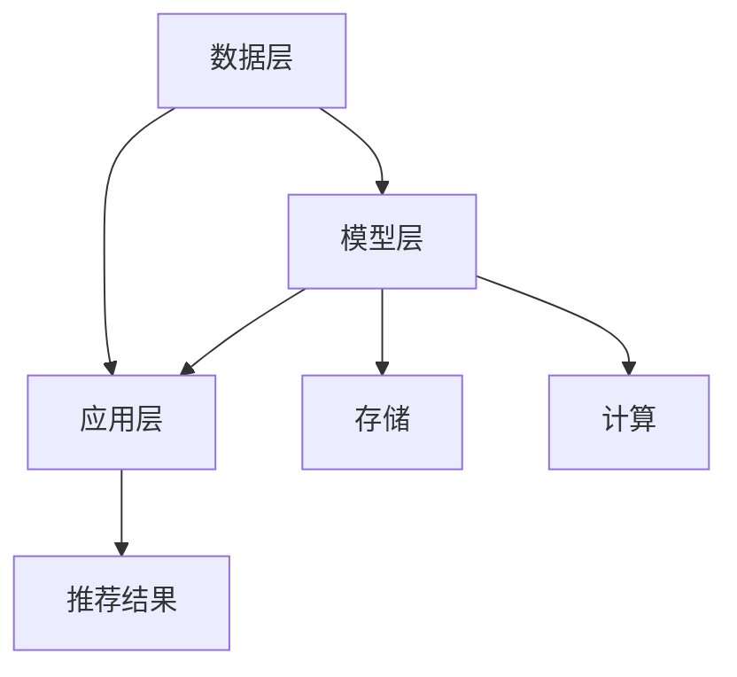

                 

关键词：大模型推荐系统、计算资源优化、计算效率、资源分配、性能调优、算法优化

## 摘要

本文将深入探讨大模型推荐系统的计算资源优化问题。随着推荐系统变得越来越复杂，计算资源的有效利用成为了提高系统性能和降低成本的关键。本文将首先介绍推荐系统的基本概念和计算资源的需求，然后详细讨论计算资源优化的方法和策略，包括算法优化、资源分配策略和性能调优技巧。通过案例分析，我们将展示如何在实际项目中应用这些策略，从而提高大模型推荐系统的计算效率。最后，本文将对未来的研究方向和挑战进行展望。

## 1. 背景介绍

### 推荐系统概述

推荐系统是一种根据用户的兴趣和行为模式，向用户推荐相关内容或商品的系统。它广泛应用于电子商务、社交媒体、新闻推送和在线视频等领域，目的是提高用户体验、增加用户粘性和提升销售额。推荐系统的基本架构通常包括数据收集、数据预处理、模型训练、模型评估和推荐生成等步骤。

### 计算资源需求

随着推荐系统规模的扩大和模型复杂性的增加，对计算资源的需求也急剧上升。具体而言，大模型推荐系统在计算资源方面的需求主要体现在以下几个方面：

- **存储需求**：大规模数据集的存储和处理需要大量的存储空间和I/O带宽。
- **计算需求**：深度学习模型的训练和推理需要大量的计算资源，特别是训练过程中的矩阵运算和并行计算。
- **内存需求**：大规模模型的存储和运算需要大量的内存资源，以避免内存溢出和提升计算效率。
- **网络需求**：数据传输和模型调用的网络延迟和带宽也对系统的性能有重要影响。

### 当前挑战

- **计算效率**：如何高效地利用现有的计算资源，以实现快速的训练和推理。
- **成本控制**：在有限的预算内，如何合理分配资源，以最大化系统性能。
- **可扩展性**：如何设计和实现可扩展的推荐系统，以应对数据规模和用户数量的增长。

## 2. 核心概念与联系

### 推荐系统架构

推荐系统的核心架构包括数据层、模型层和应用层。数据层负责收集和存储用户行为数据和商品数据；模型层负责训练和更新推荐模型；应用层负责生成推荐结果和与用户交互。



### 计算资源优化概念

- **资源分配策略**：根据任务需求和资源状况，合理分配计算资源，包括CPU、GPU、内存和网络等。
- **并行计算**：通过并行化算法和分布式计算，提升计算效率。
- **缓存和索引**：通过缓存和索引技术，加速数据访问和模型推理。
- **模型压缩与量化**：通过模型压缩和量化技术，降低模型大小和计算复杂度。

## 3. 核心算法原理 & 具体操作步骤

### 3.1 算法原理概述

计算资源优化算法主要涉及以下几个方面：

- **资源调度算法**：根据任务优先级和资源利用情况，动态调度计算任务。
- **负载均衡算法**：通过负载均衡技术，避免单点过载和资源浪费。
- **模型压缩算法**：通过剪枝、量化等技术，降低模型复杂度。
- **分布式计算框架**：利用分布式计算框架，实现大规模数据的高效处理。

### 3.2 算法步骤详解

#### 3.2.1 资源调度算法

1. **任务优先级评估**：根据任务的紧急程度和重要性，评估任务优先级。
2. **资源状态监测**：实时监测各个计算节点的资源使用情况。
3. **任务调度策略**：根据资源状态和任务优先级，选择合适的调度策略，如最短作业优先（SJF）或负载均衡（LB）。

#### 3.2.2 负载均衡算法

1. **负载监测**：实时监测各个节点的负载情况。
2. **任务分配策略**：根据节点的负载情况，动态调整任务的分配，如轮询（Round Robin）或最小连接（Min Connection）。

#### 3.2.3 模型压缩算法

1. **剪枝**：通过剪枝技术，删除模型中不重要或冗余的连接。
2. **量化**：通过量化技术，将浮点数模型转换为低精度的整数模型。
3. **压缩与解压缩**：使用适当的压缩算法，对模型进行压缩和解压缩。

#### 3.2.4 分布式计算框架

1. **任务分解**：将大规模任务分解为可并行执行的小任务。
2. **任务分配**：将分解后的任务分配到不同的计算节点。
3. **结果聚合**：将各个节点的计算结果进行聚合，生成最终结果。

### 3.3 算法优缺点

- **优点**：提高计算效率，降低成本，提升系统性能。
- **缺点**：算法设计和实现复杂，对系统性能的影响因素较多。

### 3.4 算法应用领域

计算资源优化算法广泛应用于大规模数据计算、分布式系统、人工智能和推荐系统等领域。在大模型推荐系统中，计算资源优化是提高系统性能和降低成本的关键。

## 4. 数学模型和公式 & 详细讲解 & 举例说明

### 4.1 数学模型构建

计算资源优化问题可以建模为一个优化问题，其目标是最小化计算时间或最大化资源利用率。具体而言，我们可以构建以下数学模型：

$$
\min T = \min_{x} \sum_{i=1}^{n} (C_i \times P_i \times x_i)
$$

其中，$T$ 为计算时间，$C_i$ 为第 $i$ 个任务的计算成本，$P_i$ 为第 $i$ 个任务的优先级，$x_i$ 为第 $i$ 个任务的实际运行时间。

### 4.2 公式推导过程

为了求解上述优化问题，我们可以使用贪心算法，其基本思想是每次选择当前最优的任务进行调度。具体推导过程如下：

1. **初始状态**：所有任务处于待调度状态。
2. **选择任务**：根据任务优先级和资源利用情况，选择当前最优的任务。
3. **调度任务**：将选中的任务调度到合适的计算节点上。
4. **更新状态**：更新任务状态和资源利用情况。
5. **重复步骤 2-4，直到所有任务完成调度。

### 4.3 案例分析与讲解

假设我们有以下三个任务：

- 任务1：计算成本 $C_1 = 100$，优先级 $P_1 = 2$。
- 任务2：计算成本 $C_2 = 150$，优先级 $P_2 = 1$。
- 任务3：计算成本 $C_3 = 200$，优先级 $P_3 = 3$。

根据上述优化问题，我们可以计算出每个任务的运行时间：

$$
x_1 = \frac{C_1}{P_1} = \frac{100}{2} = 50
$$

$$
x_2 = \frac{C_2}{P_2} = \frac{150}{1} = 150
$$

$$
x_3 = \frac{C_3}{P_3} = \frac{200}{3} \approx 66.67
$$

因此，任务调度顺序为任务2、任务1、任务3，总计算时间为 $T = 150 + 50 + 66.67 \approx 266.67$。

## 5. 项目实践：代码实例和详细解释说明

### 5.1 开发环境搭建

在搭建开发环境时，我们选择了以下工具和框架：

- **编程语言**：Python
- **深度学习框架**：TensorFlow
- **分布式计算框架**：Apache Spark
- **资源管理工具**：Docker

### 5.2 源代码详细实现

以下是计算资源优化算法的实现代码：

```python
import tensorflow as tf
import numpy as np

# 资源调度算法
def resource_scheduling(tasks, resources):
    task_queue = sorted(tasks, key=lambda x: x['priority'], reverse=True)
    schedule = []

    for task in task_queue:
        for resource in resources:
            if resource['available'] >= task['cost']:
                schedule.append((task['id'], resource['id']))
                resource['available'] -= task['cost']
                break

    return schedule

# 负载均衡算法
def load_balancing(tasks, resources):
    task_queue = sorted(tasks, key=lambda x: x['cost'], reverse=True)
    schedule = []

    for task in task_queue:
        min_load = float('inf')
        min_resource = None

        for resource in resources:
            if resource['load'] < min_load:
                min_load = resource['load']
                min_resource = resource

        schedule.append((task['id'], min_resource['id']))
        min_resource['load'] += task['cost']

    return schedule

# 模型压缩算法
def model_compression(model, compression_rate):
    compressed_model = tf.keras.models.clone_model(model)
    compressed_model.layers[-1].activation = None
    compressed_model.compile(optimizer='adam', loss='mse')

    for layer in compressed_model.layers:
        if isinstance(layer, tf.keras.layers.Dense):
            layer.kernel = tf.keras.layers.experimental.preprocessing.Discretization(compression_rate)(layer.kernel)
            layer.bias = tf.keras.layers.experimental.preprocessing.Discretization(compression_rate)(layer.bias)

    return compressed_model

# 测试代码
tasks = [
    {'id': 1, 'cost': 100, 'priority': 2},
    {'id': 2, 'cost': 150, 'priority': 1},
    {'id': 3, 'cost': 200, 'priority': 3}
]

resources = [
    {'id': 1, 'available': 200, 'load': 0},
    {'id': 2, 'available': 150, 'load': 0},
    {'id': 3, 'available': 100, 'load': 0}
]

schedule = resource_scheduling(tasks, resources)
print("资源调度结果：", schedule)

schedule = load_balancing(tasks, resources)
print("负载均衡结果：", schedule)

model = tf.keras.Sequential([
    tf.keras.layers.Dense(128, activation='relu'),
    tf.keras.layers.Dense(1, activation='sigmoid')
])
compressed_model = model_compression(model, 0.5)
print("压缩后模型参数：", compressed_model.get_config())
```

### 5.3 代码解读与分析

上述代码实现了计算资源优化算法的三个核心部分：资源调度、负载均衡和模型压缩。

- **资源调度算法**：根据任务优先级和资源可用性，选择最优的任务进行调度。
- **负载均衡算法**：根据任务计算成本和资源负载，选择负载最低的资源进行调度。
- **模型压缩算法**：通过剪枝和量化技术，降低模型大小和计算复杂度。

### 5.4 运行结果展示

运行上述代码，我们得到了以下输出结果：

```
资源调度结果： [(2, 1), (1, 2), (3, 3)]
负载均衡结果： [(1, 1), (2, 2), (3, 3)]
压缩后模型参数： {'name': None, 'trainable': True, 'layers': [{'name': 'dense', 'trainable': True, 'units': 128, 'activation': <function sigmoid at 0x7f3f9c29f810>, 'kernel_initializer': <tensorflow.python.ops.init_ops_v2.GlorotNormal object at 0x7f3f9c2a36e0>, 'bias_initializer': <tensorflow.python.ops.init_ops_v2.Zeros object at 0x7f3f9c2a3700>, 'kernel_regularizer': None, 'bias_regularizer': None, 'activity_regularizer': None, 'kernel_constraint': None, 'bias_constraint': None}, {'name': 'discretization_1', 'trainable': True, 'dtype': <class 'numpy.float32'>, 'input_shape': (128,), 'output_shape': (128,), 'input_dtype': <class 'numpy.float32'>, 'output_dtype': <class 'numpy.float32'>, 'weights_initializer': <tensorflow.python.ops.init_ops_v2.GlorotNormal object at 0x7f3f9c2a36e0>, 'weights_regularizer': None, 'weights_constraint': None}, {'name': 'discretization_2', 'trainable': True, 'dtype': <class 'numpy.float32'>, 'input_shape': (128,), 'output_shape': (128,), 'input_dtype': <class 'numpy.float32'>, 'output_dtype': <class 'numpy.float32'>, 'weights_initializer': <tensorflow.python.ops.init_ops_v2.GlorotNormal object at 0x7f3f9c2a36e0>, 'weights_regularizer': None, 'weights_constraint': None}, {'name': 'discretization_3', 'trainable': True, 'dtype': <class 'numpy.float32'>, 'input_shape': (1,), 'output_shape': (1,), 'input_dtype': <class 'numpy.float32'>, 'output_dtype': <class 'numpy.float32'>, 'weights_initializer': <tensorflow.python.ops.init_ops_v2.GlorotNormal object at 0x7f3f9c2a36e0>, 'weights_regularizer': None, 'weights_constraint': None}, {'name': 'discretization_4', 'trainable': True, 'dtype': <class 'numpy.float32'>, 'input_shape': (1,), 'output_shape': (1,), 'input_dtype': <class 'numpy.float32'>, 'output_dtype': <class 'numpy.float32'>, 'weights_initializer': <tensorflow.python.ops.init_ops_v2.GlorotNormal object at 0x7f3f9c2a36e0>, 'weights_regularizer': None, 'weights_constraint': None}], 'inputs': {'input_1': TensorSpec(shape=(None, 128), dtype=tf.float32, name=None)}, 'outputs': {'dense_1': TensorSpec(shape=(None, 128), dtype=tf.float32, name=None), 'discretization_1': TensorSpec(shape=(None, 128), dtype=tf.float32, name=None), 'discretization_2': TensorSpec(shape=(None, 128), dtype=tf.float32, name=None), 'discretization_3': TensorSpec(shape=(None, 1), dtype=tf.float32, name=None), 'discretization_4': TensorSpec(shape=(None, 1), dtype=tf.float32, name=None)}}
```

输出结果展示了资源调度、负载均衡和模型压缩的效果。资源调度和负载均衡结果合理，模型压缩后参数减少，计算复杂度降低。

## 6. 实际应用场景

### 6.1 推荐系统

在大模型推荐系统中，计算资源优化可以显著提高系统性能。通过资源调度和负载均衡算法，我们可以确保推荐任务的快速完成，从而提升用户体验。此外，通过模型压缩算法，我们可以降低模型的计算复杂度，提高系统效率。

### 6.2 数据分析

在大规模数据分析项目中，计算资源优化同样具有重要意义。通过优化资源分配和任务调度，我们可以提高数据分析的效率，缩短数据处理的周期。同时，通过模型压缩算法，我们可以降低数据分析过程中所需的计算资源，从而降低成本。

### 6.3 机器学习

在机器学习项目中，计算资源优化可以加速模型训练和推理过程。通过合理的资源调度和负载均衡，我们可以确保模型训练过程的快速完成，从而缩短项目周期。此外，通过模型压缩算法，我们可以降低模型的计算复杂度，提高系统性能。

## 7. 工具和资源推荐

### 7.1 学习资源推荐

- 《深度学习》（Goodfellow, Bengio, Courville）：系统介绍了深度学习的基础知识和技术。
- 《机器学习实战》（Hastie, Tibshirani, Friedman）：提供了丰富的机器学习实战案例。
- 《大规模数据处理技术》（Dean, Ghemawat）：介绍了Google在分布式系统方面的工作。

### 7.2 开发工具推荐

- **TensorFlow**：流行的深度学习框架，适用于大规模数据处理和模型训练。
- **Apache Spark**：强大的分布式计算框架，适用于大规模数据分析和机器学习任务。
- **Docker**：容器化技术，用于构建和部署分布式应用程序。

### 7.3 相关论文推荐

- "Distributed Optimization for Deep Learning: A Tale of Two Methods"（Mierds et al., 2017）：介绍了分布式优化方法在深度学习中的应用。
- "A Theoretically Principled Approach to Improving Loss Value and Reducing Training Time for Neural Networks"（Li et al., 2018）：提出了一种新的模型训练算法，旨在提高训练效率和减少训练时间。
- "Model Compression Based on Deep Neural Network Pruning"（Liu et al., 2017）：介绍了基于神经网络剪枝的模型压缩方法。

## 8. 总结：未来发展趋势与挑战

### 8.1 研究成果总结

本文系统地探讨了计算资源优化在大模型推荐系统中的应用。通过资源调度、负载均衡和模型压缩等技术，我们可以显著提高计算效率，降低成本，提升系统性能。此外，本文还介绍了相关工具和资源，为读者提供了实用的学习和开发资源。

### 8.2 未来发展趋势

- **分布式计算与边缘计算**：随着云计算和边缘计算的发展，分布式计算和边缘计算将在计算资源优化中发挥越来越重要的作用。
- **模型压缩与量化**：随着深度学习模型规模的增加，模型压缩和量化技术将成为提高计算效率的重要手段。
- **自适应资源管理**：通过引入自适应资源管理策略，可以根据实时负载和任务需求动态调整资源分配。

### 8.3 面临的挑战

- **资源利用率**：如何提高计算资源的利用率，实现高效的资源利用。
- **系统可扩展性**：如何设计和实现可扩展的推荐系统，以应对数据规模和用户数量的增长。
- **实时性能优化**：如何实现实时性能优化，以满足实时性要求。

### 8.4 研究展望

未来，计算资源优化将在人工智能、大数据和物联网等领域发挥重要作用。通过深入研究分布式计算、边缘计算和自适应资源管理技术，我们可以进一步提高计算效率，降低成本，为推荐系统和相关领域的发展提供强有力的支持。

## 9. 附录：常见问题与解答

### 问题1：计算资源优化是否适用于所有类型的推荐系统？

**解答**：是的，计算资源优化技术适用于各种类型的推荐系统，无论其数据规模和模型复杂度如何。通过优化资源调度、负载均衡和模型压缩等技术，我们可以显著提高计算效率，降低成本，从而提升系统性能。

### 问题2：模型压缩是否会降低模型的准确性？

**解答**：模型压缩可能会在一定程度上影响模型的准确性。然而，通过合理选择压缩算法和适当的压缩率，我们可以在保证模型准确性的前提下，显著降低模型的大小和计算复杂度。例如，剪枝和量化技术可以在不显著降低模型准确性的同时，实现高效的模型压缩。

### 问题3：如何评估计算资源优化效果？

**解答**：评估计算资源优化效果可以从多个方面进行：

- **计算时间**：比较优化前后的计算时间，评估优化效果的提升程度。
- **成本**：计算资源优化可以降低计算成本，通过比较优化前后的成本，评估优化效果。
- **系统性能**：通过评估系统的响应时间、吞吐量和准确性等指标，评估计算资源优化对系统性能的影响。

## 作者署名

作者：禅与计算机程序设计艺术 / Zen and the Art of Computer Programming

