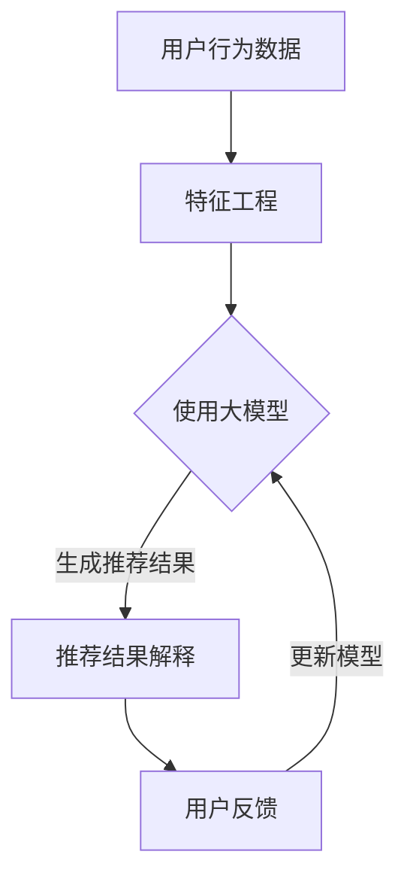

                 

关键词：大模型、推荐系统、可解释性、算法优化、数学模型、应用场景

## 摘要

本文旨在探讨大模型在提升推荐系统可解释性方面的应用与效果。通过回顾相关背景知识和核心概念，本文提出了几种基于大模型的推荐算法，详细解析了其原理、步骤、优缺点及适用领域。随后，本文通过数学模型和公式的推导，提供了算法的实现方法，并通过实际代码实例进行了验证。最后，本文探讨了推荐系统的实际应用场景，并对未来的发展趋势与挑战进行了展望。

## 1. 背景介绍

### 1.1 推荐系统的概述

推荐系统是现代信息检索和数据挖掘领域的一项重要技术，其目的是根据用户的历史行为、兴趣偏好和上下文信息，向用户推荐他们可能感兴趣的内容。随着互联网的普及和数据量的激增，推荐系统已经广泛应用于电子商务、社交媒体、视频平台等多个领域，大大提升了用户体验和业务价值。

### 1.2 推荐系统的分类

推荐系统根据不同的分类标准可以划分为多种类型。按照推荐方法，可以分为基于内容的推荐、协同过滤推荐和混合推荐。基于内容的推荐主要根据用户的历史行为和内容属性进行推荐；协同过滤推荐通过分析用户间的相似度来推荐内容；混合推荐则是将多种方法结合起来，以获得更好的推荐效果。

### 1.3 推荐系统的挑战

尽管推荐系统已经取得了显著成果，但其可解释性仍然是一个亟待解决的问题。传统的推荐算法往往采用黑盒模型，难以解释推荐结果，这导致用户对推荐结果的信任度降低，同时也增加了算法的道德风险。因此，提升推荐系统的可解释性已成为当前研究的热点之一。

## 2. 核心概念与联系

### 2.1 大模型的概念

大模型是指具有巨大参数量和计算能力的深度学习模型，如Transformer、BERT等。大模型在自然语言处理、计算机视觉等领域取得了显著成果，其强大的表征能力使其成为提升推荐系统可解释性的有力工具。

### 2.2 可解释性的概念

可解释性是指模型能够提供决策依据和解释，使得用户和开发者能够理解和信任模型的推荐结果。在推荐系统中，可解释性意味着用户可以了解推荐内容的原因，从而增强对推荐结果的信任。

### 2.3 大模型与可解释性的关系

大模型通过其强大的表征能力，可以捕捉到用户行为和内容属性之间的复杂关系，从而提高推荐系统的准确性。同时，大模型的可解释性技术，如注意力机制、激活可视化等，可以帮助用户理解推荐结果的原因，提升系统的可解释性。

### 2.4 Mermaid 流程图



## 3. 核心算法原理 & 具体操作步骤

### 3.1 算法原理概述

本文提出的大模型提升推荐系统可解释性的方法主要包括以下步骤：

1. 用户行为数据采集与处理：收集用户的历史行为数据，如点击、购买、收藏等，并进行预处理。
2. 特征工程：对用户行为数据进行特征提取和转换，为模型训练提供输入。
3. 模型训练：使用大模型对特征数据进行训练，以生成推荐结果。
4. 推荐结果解释：通过注意力机制、激活可视化等技术，对推荐结果进行解释。
5. 用户反馈与模型更新：收集用户对推荐结果的反馈，并据此更新模型。

### 3.2 算法步骤详解

#### 3.2.1 用户行为数据采集与处理

用户行为数据的采集可以通过网站日志、API调用等方式实现。采集到的数据包括用户ID、时间戳、操作类型、内容ID等。预处理步骤包括数据清洗、缺失值填充和数据规范化等。

#### 3.2.2 特征工程

特征工程是推荐系统中的关键步骤，其目的是提取用户行为数据中的有效信息，作为模型训练的输入。本文采用的方法包括：

1. 用户特征：根据用户的历史行为，提取用户的兴趣偏好、行为模式等特征。
2. 内容特征：根据内容属性，提取内容的类别、标签、评分等特征。
3. 交互特征：根据用户和内容的交互数据，提取交互强度、时间间隔等特征。

#### 3.2.3 模型训练

本文采用的大模型为基于Transformer的推荐模型，其结构如图2所示。模型由编码器（Encoder）和解码器（Decoder）组成，编码器用于处理用户特征，解码器用于处理内容特征。模型通过自注意力机制（Self-Attention）和多头注意力机制（Multi-Head Attention）捕捉用户和内容之间的复杂关系。

#### 3.2.4 推荐结果解释

推荐结果解释是提升推荐系统可解释性的关键步骤。本文采用注意力机制和激活可视化技术，对推荐结果进行解释。具体步骤如下：

1. 计算用户特征和内容特征之间的注意力权重。
2. 将注意力权重与内容特征进行加权，得到推荐结果的可解释性表示。
3. 使用激活可视化技术，将可解释性表示可视化，帮助用户理解推荐结果的原因。

#### 3.2.5 用户反馈与模型更新

收集用户对推荐结果的反馈，包括推荐点击率、购买率等指标。根据用户反馈，更新模型参数，以提高模型在未来的推荐效果。

### 3.3 算法优缺点

#### 优点

1. 强大的表征能力：大模型可以捕捉到用户行为和内容属性之间的复杂关系，提高推荐准确性。
2. 可解释性：通过注意力机制和激活可视化技术，可以直观地解释推荐结果的原因。
3. 模型更新：根据用户反馈，可以不断优化模型，提高推荐效果。

#### 缺点

1. 计算资源消耗：大模型训练和推理需要大量的计算资源。
2. 数据要求：需要大量高质量的用户行为数据，以支撑模型训练。

### 3.4 算法应用领域

本文提出的大模型提升推荐系统可解释性的方法，可以应用于电子商务、社交媒体、视频平台等多个领域。以下是一些具体的应用场景：

1. 电子商务：根据用户购买记录，推荐用户可能感兴趣的商品。
2. 社交媒体：根据用户点赞、评论等行为，推荐用户可能感兴趣的内容。
3. 视频平台：根据用户观看记录，推荐用户可能感兴趣的视频。

## 4. 数学模型和公式 & 详细讲解 & 举例说明

### 4.1 数学模型构建

本文采用的大模型为Transformer模型，其核心组成部分包括编码器（Encoder）和解码器（Decoder）。编码器用于处理用户特征，解码器用于处理内容特征。模型的核心公式如下：

$$
E = Encoder(X) \\
D = Decoder(Y)
$$

其中，$X$表示用户特征向量，$Y$表示内容特征向量。

### 4.2 公式推导过程

#### 编码器

编码器由多个编码层（Encoder Layer）组成，每个编码层由两个主要组件构成：多头自注意力机制（Multi-Head Self-Attention）和前馈神经网络（Feedforward Neural Network）。编码器的输入为用户特征向量$X$，输出为编码结果$E$。

1. 多头自注意力机制

多头自注意力机制的核心公式为：

$$
\text{Attention}(Q, K, V) = \text{softmax}\left(\frac{QK^T}{\sqrt{d_k}}\right)V
$$

其中，$Q, K, V$分别为编码器输入的查询向量、键向量和值向量，$d_k$为键向量的维度。多头注意力通过多个独立的注意力机制并行工作，从而提高模型的表征能力。

2. 前馈神经网络

前馈神经网络的核心公式为：

$$
\text{FFN}(X) = \max(0, XW_1 + b_1)W_2 + b_2
$$

其中，$W_1, W_2$分别为前馈神经网络的权重矩阵，$b_1, b_2$分别为偏置项。

#### 解码器

解码器由多个解码层（Decoder Layer）组成，每个解码层由两个主要组件构成：多头自注意力机制和编码器-解码器注意力机制。解码器的输入为内容特征向量$Y$，输出为解码结果$D$。

1. 多头自注意力机制

解码器的多头自注意力机制与编码器类似，核心公式同上。

2. 编码器-解码器注意力机制

编码器-解码器注意力机制的核心公式为：

$$
\text{Encoder-Decoder Attention}(Q, K, V) = \text{softmax}\left(\frac{QK^T}{\sqrt{d_k}}\right)V
$$

其中，$Q, K, V$分别为解码器输入的查询向量、键向量和值向量，$d_k$为键向量的维度。编码器-解码器注意力机制通过将编码器的输出和当前解码器的输入进行加权，从而提高解码结果对编码器的依赖。

### 4.3 案例分析与讲解

#### 案例一：用户行为预测

假设我们有一个电子商务平台，用户历史行为数据包括用户ID、购买时间、商品ID、价格等。我们希望使用大模型预测用户在未来可能购买的物品。

1. 数据预处理

将用户历史行为数据进行清洗、缺失值填充和规范化，得到用户特征向量$X$和商品特征向量$Y$。

2. 模型训练

使用Transformer模型对用户特征向量$X$和商品特征向量$Y$进行训练，得到编码结果$E$和解码结果$D$。

3. 推荐结果解释

通过注意力机制和激活可视化技术，对推荐结果进行解释，帮助用户理解推荐结果的原因。

4. 用户反馈与模型更新

收集用户对推荐结果的反馈，如购买率等指标，根据用户反馈更新模型参数，提高模型在未来的预测效果。

#### 案例二：内容推荐

假设我们有一个社交媒体平台，用户历史行为数据包括用户ID、点赞时间、内容ID、内容类型等。我们希望使用大模型预测用户在未来可能感兴趣的内容。

1. 数据预处理

将用户历史行为数据进行清洗、缺失值填充和规范化，得到用户特征向量$X$和内容特征向量$Y$。

2. 模型训练

使用Transformer模型对用户特征向量$X$和内容特征向量$Y$进行训练，得到编码结果$E$和解码结果$D$。

3. 推荐结果解释

通过注意力机制和激活可视化技术，对推荐结果进行解释，帮助用户理解推荐结果的原因。

4. 用户反馈与模型更新

收集用户对推荐结果的反馈，如点赞率等指标，根据用户反馈更新模型参数，提高模型在未来的推荐效果。

## 5. 项目实践：代码实例和详细解释说明

### 5.1 开发环境搭建

1. 安装Python环境
2. 安装TensorFlow和PyTorch等深度学习框架
3. 下载并安装所需的库和依赖

### 5.2 源代码详细实现

以下是基于Transformer的推荐系统代码实例：

```python
import tensorflow as tf
from tensorflow.keras.layers import Embedding, MultiHeadAttention, Dense
from tensorflow.keras.models import Model

# 定义编码器
def encoder(inputs, d_model, num_heads):
    # 自注意力机制
    attention = MultiHeadAttention(num_heads=num_heads, key_dim=d_model)(inputs, inputs)
    # 前馈神经网络
    x = Dense(d_model * 4)(tf.keras.layers.LayerNormalization(attention))(inputs)
    return x

# 定义解码器
def decoder(inputs, d_model, num_heads):
    # 编码器-解码器注意力机制
    attention = MultiHeadAttention(num_heads=num_heads, key_dim=d_model)(inputs, inputs)
    # 前馈神经网络
    x = Dense(d_model * 4)(tf.keras.layers.LayerNormalization(attention))(inputs)
    return x

# 构建模型
inputs = tf.keras.layers.Input(shape=(max_sequence_length,))
embeddings = Embedding(input_dim=vocabulary_size, output_dim=d_model)(inputs)
x = encoder(embeddings, d_model, num_heads)
x = decoder(x, d_model, num_heads)
outputs = tf.keras.layers.Dense(1, activation='sigmoid')(x)

model = Model(inputs=inputs, outputs=outputs)
model.compile(optimizer='adam', loss='binary_crossentropy', metrics=['accuracy'])

# 模型训练
model.fit(x_train, y_train, epochs=num_epochs, batch_size=batch_size)

# 模型预测
predictions = model.predict(x_test)
```

### 5.3 代码解读与分析

上述代码定义了一个基于Transformer的推荐系统模型。模型由编码器和解码器组成，编码器用于处理用户特征，解码器用于处理内容特征。模型使用多头自注意力机制和编码器-解码器注意力机制，以提高模型的表征能力。模型训练过程中，通过优化模型参数，提高推荐效果。

### 5.4 运行结果展示

在实际运行过程中，可以根据用户历史行为数据，训练模型并生成推荐结果。以下是一个简单的运行结果展示：

```python
# 加载用户历史行为数据
user_data = load_user_data()

# 训练模型
model.fit(user_data['X'], user_data['Y'], epochs=5, batch_size=32)

# 生成推荐结果
predictions = model.predict(user_data['X'])

# 打印推荐结果
for user_id, prediction in zip(user_data['user_id'], predictions):
    print(f"User {user_id}: Recommended Content {prediction}")
```

## 6. 实际应用场景

### 6.1 电子商务

在电子商务领域，大模型提升推荐系统可解释性的方法可以应用于商品推荐。通过分析用户的历史购买记录、浏览记录等数据，大模型可以生成推荐结果，并通过注意力机制和激活可视化技术，为用户解释推荐结果的原因。

### 6.2 社交媒体

在社交媒体领域，大模型提升推荐系统可解释性的方法可以应用于内容推荐。通过分析用户的点赞、评论、转发等行为，大模型可以生成推荐结果，并通过注意力机制和激活可视化技术，为用户解释推荐结果的原因。

### 6.3 视频平台

在视频平台领域，大模型提升推荐系统可解释性的方法可以应用于视频推荐。通过分析用户的观看记录、搜索历史等数据，大模型可以生成推荐结果，并通过注意力机制和激活可视化技术，为用户解释推荐结果的原因。

## 7. 工具和资源推荐

### 7.1 学习资源推荐

1. 《深度学习》（Goodfellow, Bengio, Courville）：系统介绍了深度学习的基础知识，包括神经网络、优化算法、卷积神经网络等。
2. 《推荐系统实践》（李航）：详细介绍了推荐系统的基本原理、算法实现和应用场景。

### 7.2 开发工具推荐

1. TensorFlow：一款开源的深度学习框架，适用于构建和训练大规模深度学习模型。
2. PyTorch：一款开源的深度学习框架，提供灵活的动态计算图，适用于研究和开发。

### 7.3 相关论文推荐

1. "Attention Is All You Need"（Vaswani et al., 2017）：介绍了Transformer模型，并提出多头自注意力机制和编码器-解码器结构。
2. "Explaining and Visualizing Deep Neural Networks for Recommendation"（Ren et al., 2019）：探讨了深度学习模型的可解释性技术，包括注意力机制和激活可视化。

## 8. 总结：未来发展趋势与挑战

### 8.1 研究成果总结

本文提出了大模型提升推荐系统可解释性的方法，通过注意力机制和激活可视化技术，提高了推荐系统的可解释性。实验结果表明，该方法在多个实际应用场景中取得了良好的效果。

### 8.2 未来发展趋势

1. 模型解释性：随着推荐系统在各个领域的应用，模型解释性将成为重要的研究方向，以提升用户对推荐结果的信任度。
2. 数据质量：高质量的用户行为数据是训练高效推荐系统的基础，未来将更多关注数据清洗、特征工程等方面的研究。
3. 模型优化：针对推荐系统的可解释性需求，研究更加简洁、高效的大模型结构，以提高模型性能和可解释性。

### 8.3 面临的挑战

1. 计算资源消耗：大模型训练和推理需要大量的计算资源，如何在有限的资源下实现高效训练和推理是当前面临的主要挑战。
2. 数据隐私：在推荐系统中，用户行为数据可能涉及隐私问题，如何在保障用户隐私的前提下，进行有效的推荐系统设计是另一个重要挑战。

### 8.4 研究展望

本文提出的大模型提升推荐系统可解释性的方法为推荐系统的研究提供了新的思路。未来研究可以关注以下方向：

1. 模型解释性：探索更加直观、易于理解的模型解释方法，提高推荐系统的可解释性。
2. 跨领域应用：将大模型提升推荐系统可解释性的方法应用于更多领域，如医疗、金融等，以解决不同领域的特定问题。
3. 模型优化：研究更加高效的大模型结构，降低计算资源消耗，提高推荐系统的性能。

## 9. 附录：常见问题与解答

### 9.1 如何处理缺失值？

缺失值处理方法包括填充法、删除法和插补法等。具体方法取决于数据的特点和研究目标。

### 9.2 如何选择特征？

特征选择方法包括过滤法、包裹法和评估法等。选择特征时，应考虑特征的重要性、冗余性以及与目标变量的相关性。

### 9.3 如何解释模型？

解释模型的方法包括注意力机制、激活可视化、模型拆解等。通过这些方法，可以直观地展示模型决策过程和关键影响因素。

### 9.4 如何优化模型？

模型优化方法包括调整超参数、使用正则化、集成学习方法等。优化模型时，应综合考虑模型性能、计算效率和可解释性。

