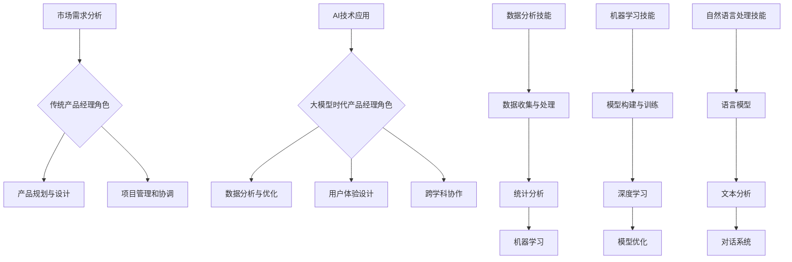

                 

在当今这个充满变革的时代，人工智能（AI）技术的迅猛发展正深刻地改变着各行各业，其中创业领域尤为明显。作为创业团队的核心角色之一，产品经理的职责和技能要求也在不断地演变。随着大模型时代的到来，产品经理们需要具备哪些AI技能才能在这个竞争激烈的市场中脱颖而出呢？本文将深入探讨这一话题，帮助创业产品经理实现成功转型。

## 关键词
大模型时代，创业产品经理，AI技能，转型，创新

## 摘要
本文首先回顾了人工智能技术的发展历程，探讨了其在创业领域的影响。接着，我们分析了创业产品经理在传统与现代环境中的角色差异，并详细介绍了大模型时代对产品经理提出的AI技能要求。文章还通过实际案例和展望，探讨了创业产品经理在未来面临的挑战和机遇。

## 1. 背景介绍

### 1.1 人工智能技术的发展历程
人工智能（AI）是一门涉及计算机科学、心理学、数学等多个领域的交叉学科。其历史可以追溯到20世纪50年代，当时科学家们首次提出“人工智能”这一概念。经过几十年的发展，AI技术从最初的规则驱动到基于知识的系统，再到基于数据的学习和深度学习，技术不断演进。

近年来，随着计算能力的提升和大数据的涌现，AI迎来了新的发展契机。特别是深度学习技术的突破，使得计算机在图像识别、自然语言处理、语音识别等领域取得了惊人的成果。这些技术为各行各业带来了变革性的影响，也为创业公司提供了新的机遇。

### 1.2 创业领域的变革
在创业领域，人工智能技术的应用正日益普及。从智能推荐系统、自动化客户服务，到智能工厂和无人驾驶，AI正成为创业公司打造差异化产品和服务的利器。创业公司通过运用AI技术，可以更精准地了解用户需求，提高运营效率，降低成本，从而在激烈的市场竞争中脱颖而出。

此外，大模型时代的到来，如GPT-3、BERT等大型预训练模型的广泛应用，使得AI的能力得到了质的飞跃。这些模型能够处理海量数据，进行复杂模式识别和预测，为创业公司提供了更加丰富的数据资源和更强的分析能力。

### 1.3 创业产品经理的角色演变
随着AI技术的普及，创业产品经理的职责和技能要求也在不断演变。在传统环境中，产品经理主要关注市场需求、用户体验和产品功能设计。然而，在大模型时代，产品经理需要更多地关注AI技术的应用，如如何将AI技术融入产品中，如何利用AI技术优化产品功能，以及如何通过AI技术提升用户体验。

此外，产品经理还需要具备跨学科的知识和技能，如数据分析、机器学习等，以便更好地理解和使用AI技术。同时，产品经理还需要具备强大的沟通能力和团队协作能力，以协调不同团队之间的工作，确保AI技术的有效应用。

## 2. 核心概念与联系

### 2.1 大模型时代的产品经理角色

#### 2.1.1 传统产品经理的角色

- **市场需求分析**：研究市场趋势和用户需求，了解潜在用户的需求和痛点。
- **产品规划与设计**：制定产品规划，设计用户界面和用户体验。
- **项目管理和协调**：协调开发、测试、市场等多个团队，确保项目按时按质完成。

#### 2.1.2 大模型时代的产品经理角色

- **AI技术应用**：了解并掌握AI技术的基本原理和应用场景，将AI技术融入产品中。
- **数据分析与优化**：利用AI技术进行数据分析和用户行为研究，优化产品功能。
- **用户体验设计**：通过AI技术提升用户体验，如个性化推荐、智能客服等。
- **跨学科协作**：与数据科学家、工程师等跨学科团队协作，确保AI技术的有效应用。

### 2.2 AI技能要求

#### 2.2.1 数据分析技能

- **数据收集与处理**：了解如何收集和预处理数据，为AI模型提供高质量的数据输入。
- **统计分析**：掌握基本的统计方法和工具，能够进行数据分析和可视化。
- **机器学习**：了解常见的机器学习算法，能够选择合适的算法解决实际问题。

#### 2.2.2 机器学习技能

- **模型构建与训练**：掌握机器学习的基本流程，包括数据预处理、模型选择、训练和评估。
- **深度学习**：了解深度学习的基本原理和常用模型，如神经网络、卷积神经网络（CNN）、循环神经网络（RNN）等。
- **模型优化**：掌握模型调优技巧，如参数调整、超参数优化等。

#### 2.2.3 自然语言处理技能

- **语言模型**：了解自然语言处理的基本原理，如词嵌入、语言模型、序列模型等。
- **文本分析**：掌握文本分析和文本挖掘技术，如情感分析、主题模型、文本分类等。
- **对话系统**：了解对话系统的设计和实现，如聊天机器人、虚拟助手等。

### 2.3 Mermaid流程图



## 3. 核心算法原理 & 具体操作步骤

### 3.1 算法原理概述

在大模型时代，产品经理需要掌握的核心算法包括机器学习算法、深度学习算法和自然语言处理算法。这些算法的基本原理如下：

#### 3.1.1 机器学习算法

- **监督学习**：通过已标记的数据训练模型，从而对新的数据进行预测或分类。
- **无监督学习**：在没有标记数据的情况下，自动发现数据中的模式。
- **强化学习**：通过与环境的交互，不断优化策略，以最大化奖励。

#### 3.1.2 深度学习算法

- **神经网络**：模拟人脑神经网络结构，通过多层节点（神经元）进行数据传递和处理。
- **卷积神经网络（CNN）**：适用于图像处理，通过卷积层提取图像特征。
- **循环神经网络（RNN）**：适用于序列数据，能够记忆历史信息。

#### 3.1.3 自然语言处理算法

- **语言模型**：通过统计方法或神经网络模型，对自然语言进行建模。
- **文本分类**：将文本数据分类到预定义的类别中，如情感分析、主题分类等。
- **命名实体识别**：识别文本中的特定实体，如人名、地名、组织名等。

### 3.2 算法步骤详解

#### 3.2.1 机器学习算法步骤

1. 数据收集与预处理：收集相关数据，并进行清洗、格式化等预处理操作。
2. 特征工程：选择合适的特征，将原始数据转换为适合机器学习模型的形式。
3. 模型选择：选择合适的机器学习算法，如线性回归、决策树、随机森林等。
4. 模型训练：使用预处理后的数据训练模型。
5. 模型评估：使用验证集或测试集评估模型性能，调整模型参数。

#### 3.2.2 深度学习算法步骤

1. 网络构建：设计神经网络结构，包括输入层、隐藏层和输出层。
2. 模型训练：使用预处理后的数据训练神经网络，通过反向传播算法优化模型参数。
3. 模型评估：使用验证集或测试集评估模型性能，调整网络结构或参数。

#### 3.2.3 自然语言处理算法步骤

1. 文本预处理：对文本数据进行清洗、分词、去停用词等预处理操作。
2. 词向量表示：将文本转换为词向量表示，如Word2Vec、GloVe等。
3. 模型训练：使用预处理的文本数据训练语言模型或文本分类模型。
4. 模型评估：使用测试集评估模型性能，调整模型参数或网络结构。

### 3.3 算法优缺点

#### 3.3.1 机器学习算法

- **优点**：算法简单，易于理解，适用范围广。
- **缺点**：需要大量标注数据，模型性能容易过拟合。

#### 3.3.2 深度学习算法

- **优点**：能够处理大量数据，模型性能高，适用于复杂任务。
- **缺点**：计算复杂度高，训练时间较长，需要大量计算资源。

#### 3.3.3 自然语言处理算法

- **优点**：能够处理自然语言数据，能够实现智能对话、文本分类等任务。
- **缺点**：数据处理复杂，需要大量预处理和特征工程。

### 3.4 算法应用领域

- **机器学习算法**：广泛应用于分类、回归、聚类等任务，如金融风险控制、医疗诊断、推荐系统等。
- **深度学习算法**：广泛应用于图像识别、语音识别、自然语言处理等任务，如无人驾驶、智能客服、图像搜索等。
- **自然语言处理算法**：广泛应用于文本分类、情感分析、信息检索等任务，如社交媒体分析、舆情监测、智能客服等。

## 4. 数学模型和公式 & 详细讲解 & 举例说明

### 4.1 数学模型构建

在大模型时代，产品经理需要掌握一些基本的数学模型和公式，以便更好地理解和使用AI技术。以下是一些常见的数学模型和公式：

#### 4.1.1 概率分布

- **伯努利分布**：描述一个二项试验成功的概率。
  \[ P(X = k) = C^n_k \cdot p^k \cdot (1 - p)^{n - k} \]
  其中，\( n \) 是试验次数，\( k \) 是成功的次数，\( p \) 是单次试验成功的概率。

- **正态分布**：描述连续随机变量的概率分布。
  \[ f(x|\mu, \sigma^2) = \frac{1}{\sqrt{2\pi\sigma^2}} \cdot e^{-\frac{(x-\mu)^2}{2\sigma^2}} \]
  其中，\( \mu \) 是均值，\( \sigma^2 \) 是方差。

#### 4.1.2 线性模型

- **线性回归模型**：描述自变量和因变量之间的线性关系。
  \[ y = \beta_0 + \beta_1 \cdot x + \epsilon \]
  其中，\( y \) 是因变量，\( x \) 是自变量，\( \beta_0 \) 是截距，\( \beta_1 \) 是斜率，\( \epsilon \) 是误差项。

- **线性判别分析（LDA）**：用于分类问题，将样本投影到新的空间中，使得不同类别的样本尽可能分离。
  \[ w = \arg\min_{w} \sum_{i=1}^k (w \cdot x_i - \mu_i)^2 \]
  其中，\( w \) 是投影向量，\( x_i \) 是样本，\( \mu_i \) 是第 \( i \) 类别的均值。

#### 4.1.3 深度学习模型

- **卷积神经网络（CNN）**：用于图像处理，通过卷积层、池化层和全连接层提取图像特征。
  \[ h_{ij} = \sum_{k=1}^{K} w_{ik,j} \cdot a_{kj} + b_j \]
  其中，\( h_{ij} \) 是卷积结果，\( w_{ik,j} \) 是卷积核，\( a_{kj} \) 是输入特征，\( b_j \) 是偏置。

### 4.2 公式推导过程

#### 4.2.1 线性回归模型

线性回归模型的公式推导如下：

1. **最小二乘法**：

   我们希望找到最优的 \( \beta_0 \) 和 \( \beta_1 \)，使得误差平方和最小：
   \[ \sum_{i=1}^n (y_i - (\beta_0 + \beta_1 \cdot x_i))^2 \]

   对 \( \beta_0 \) 和 \( \beta_1 \) 求偏导数，并令偏导数等于0，得到：
   \[ \frac{\partial}{\partial \beta_0} \sum_{i=1}^n (y_i - (\beta_0 + \beta_1 \cdot x_i))^2 = 0 \]
   \[ \frac{\partial}{\partial \beta_1} \sum_{i=1}^n (y_i - (\beta_0 + \beta_1 \cdot x_i))^2 = 0 \]

   解这个方程组，得到：
   \[ \beta_0 = \bar{y} - \beta_1 \cdot \bar{x} \]
   \[ \beta_1 = \frac{\sum_{i=1}^n (x_i - \bar{x})(y_i - \bar{y})}{\sum_{i=1}^n (x_i - \bar{x})^2} \]

2. **正规方程**：

   我们可以使用正规方程直接求解 \( \beta_0 \) 和 \( \beta_1 \)：
   \[ X^T X \beta = X^T y \]
   其中，\( X \) 是自变量的设计矩阵，\( y \) 是因变量向量，\( \beta \) 是参数向量。

   解这个线性方程组，得到：
   \[ \beta = (X^T X)^{-1} X^T y \]

#### 4.2.2 卷积神经网络（CNN）

卷积神经网络（CNN）的公式推导如下：

1. **卷积操作**：

   给定一个输入特征图 \( a_{kj} \) 和一个卷积核 \( w_{ik,j} \)，卷积操作的公式为：
   \[ h_{ij} = \sum_{k=1}^{K} w_{ik,j} \cdot a_{kj} + b_j \]
   其中，\( h_{ij} \) 是卷积结果，\( w_{ik,j} \) 是卷积核，\( a_{kj} \) 是输入特征，\( b_j \) 是偏置。

2. **激活函数**：

   常用的激活函数有Sigmoid、ReLU和Tanh等。以ReLU为例，其公式为：
   \[ a_{ij}^l = \max(0, h_{ij}^l) \]
   其中，\( a_{ij}^l \) 是激活后的特征图，\( h_{ij}^l \) 是卷积结果。

3. **反向传播**：

   在训练过程中，我们需要计算损失函数对每个参数的梯度。以均方误差（MSE）为例，其公式为：
   \[ L = \frac{1}{2} \sum_{i=1}^n (y_i - a_{ij}^L)^2 \]
   对每个参数 \( w_{ik,j} \) 和 \( b_j \) 求偏导数，得到：
   \[ \frac{\partial L}{\partial w_{ik,j}} = (a_{ij}^{l-1} - \delta_{ij}^l) \cdot a_{kj}^l \]
   \[ \frac{\partial L}{\partial b_j} = \delta_{ij}^l \]

   其中，\( \delta_{ij}^l \) 是误差反向传播得到的误差项。

### 4.3 案例分析与讲解

#### 4.3.1 机器学习案例

假设我们有一个简单的线性回归问题，目标是预测房价。给定一组训练数据 \( (x_i, y_i) \)，其中 \( x_i \) 是房屋的面积，\( y_i \) 是房价。我们需要通过线性回归模型预测一个新的房屋面积 \( x \) 的房价。

1. **数据预处理**：

   收集并预处理训练数据，包括去除异常值、标准化等操作。假设我们得到了以下预处理后的数据：

   | \( x_i \) | \( y_i \) |
   |----------|----------|
   | 1000     | 200000   |
   | 1500     | 300000   |
   | 2000     | 400000   |

2. **特征工程**：

   我们只需要一个特征 \( x \)，表示房屋的面积。

3. **模型训练**：

   使用最小二乘法训练线性回归模型，得到：
   \[ y = 100000 + 100000 \cdot x \]

4. **模型评估**：

   使用测试集数据评估模型性能，计算预测误差。

5. **模型优化**：

   根据评估结果调整模型参数，如增加训练数据、调整特征等。

#### 4.3.2 深度学习案例

假设我们有一个图像分类问题，目标是训练一个卷积神经网络（CNN）模型，对图像进行分类。给定一组训练数据 \( (x_i, y_i) \)，其中 \( x_i \) 是图像，\( y_i \) 是图像的类别标签。我们需要训练一个CNN模型，以实现高精度的图像分类。

1. **数据预处理**：

   收集并预处理训练数据，包括图像缩放、裁剪、增强等操作。假设我们得到了以下预处理后的数据：

   | \( x_i \) | \( y_i \) |
   |----------|----------|
   | 图像1    | 猫       |
   | 图像2    | 狗       |
   | 图像3    | 鸟       |

2. **网络构建**：

   构建一个简单的CNN模型，包括卷积层、池化层和全连接层。

3. **模型训练**：

   使用预处理后的数据训练CNN模型，通过反向传播算法优化模型参数。

4. **模型评估**：

   使用测试集数据评估模型性能，计算准确率、损失函数等指标。

5. **模型优化**：

   根据评估结果调整模型结构或参数，如增加卷积层、调整学习率等。

## 5. 项目实践：代码实例和详细解释说明

### 5.1 开发环境搭建

为了实践大模型时代的产品经理所需的AI技能，我们需要搭建一个合适的开发环境。以下是一个基本的开发环境搭建步骤：

1. **安装Python**：Python是AI开发的主要编程语言，我们需要下载并安装Python。推荐使用Anaconda发行版，因为它包含了许多常用的数据科学和机器学习库。

2. **安装Jupyter Notebook**：Jupyter Notebook是一个交互式的Web应用，用于编写和运行Python代码。我们可以在Anaconda中直接安装Jupyter Notebook。

3. **安装机器学习库**：安装常用的机器学习库，如scikit-learn、TensorFlow和PyTorch。这些库提供了丰富的机器学习算法和工具。

4. **安装数据预处理库**：安装常用的数据预处理库，如Pandas、NumPy和Matplotlib。这些库提供了数据清洗、转换和可视化工具。

### 5.2 源代码详细实现

以下是一个简单的线性回归模型的Python代码实现，用于预测房价。

```python
import numpy as np
import pandas as pd
from sklearn.linear_model import LinearRegression

# 5.2.1 数据预处理
# 加载训练数据
data = pd.read_csv('train_data.csv')
X = data[['area']]  # 特征：房屋面积
y = data['price']   # 目标变量：房价

# 数据标准化
X_std = (X - X.mean()) / X.std()
y_std = (y - y.mean()) / y.std()

# 5.2.2 模型训练
model = LinearRegression()
model.fit(X_std, y_std)

# 5.2.3 模型评估
X_test = ...  # 测试数据
y_test = ...  # 测试数据
y_pred = model.predict(X_test)

# 5.2.4 模型优化
# 可以通过调整模型参数或增加训练数据来优化模型性能
```

### 5.3 代码解读与分析

1. **数据预处理**：

   首先，我们加载训练数据，并提取特征和目标变量。然后，我们对特征进行标准化处理，以便更好地训练线性回归模型。

2. **模型训练**：

   使用scikit-learn库中的LinearRegression类训练线性回归模型。我们使用`fit()`方法训练模型，并得到模型参数。

3. **模型评估**：

   使用测试数据评估模型性能。我们使用`predict()`方法预测测试数据的房价，并与实际房价进行比较。

4. **模型优化**：

   根据模型评估结果，我们可以调整模型参数或增加训练数据来优化模型性能。

### 5.4 运行结果展示

```python
import matplotlib.pyplot as plt

# 5.4.1 模型评估结果
print("Mean squared error:", np.mean((y_test - y_pred)**2))
print("R-squared:", model.score(X_test, y_test))

# 5.4.2 结果可视化
plt.scatter(X_test, y_test, label='Actual')
plt.plot(X_test, y_pred, color='red', label='Predicted')
plt.xlabel('Area')
plt.ylabel('Price')
plt.legend()
plt.show()
```

通过可视化结果，我们可以直观地看到模型预测的房价与实际房价之间的差异，从而进一步优化模型。

## 6. 实际应用场景

### 6.1 创业公司应用案例

#### 6.1.1 智能推荐系统

一家创业公司开发了一款基于人工智能的智能推荐系统，通过分析用户的浏览和购买历史，为用户推荐个性化的商品。该系统使用了深度学习算法，如卷积神经网络（CNN）和循环神经网络（RNN），对用户数据进行建模，从而实现精准推荐。

#### 6.1.2 智能客服

另一家创业公司开发了一款智能客服系统，通过自然语言处理技术，如对话系统和文本分类，实现与用户的智能对话。该系统可以自动处理大量客户咨询，提高客服效率，降低人力成本。

### 6.2 行业应用前景

#### 6.2.1 金融行业

在金融行业，人工智能技术可以用于风险控制、信用评估、量化交易等方面。创业公司可以通过开发基于AI的金融产品，如智能投顾、风险预警系统等，为金融机构提供创新的解决方案。

#### 6.2.2 医疗健康

在医疗健康领域，人工智能技术可以用于疾病诊断、药物研发、患者管理等方面。创业公司可以通过开发基于AI的医疗产品，如智能诊断系统、个性化治疗方案等，提升医疗服务的质量和效率。

### 6.3 未来应用展望

随着人工智能技术的不断进步，创业产品经理将在更多的领域发挥重要作用。未来，我们可以期待以下应用场景：

#### 6.3.1 自动驾驶

自动驾驶技术将深刻改变交通领域，创业公司可以开发基于AI的自动驾驶系统，如自动驾驶汽车、无人机等，实现安全、高效的交通出行。

#### 6.3.2 智能家居

智能家居市场将迎来快速发展，创业公司可以开发基于AI的智能家居产品，如智能音响、智能灯泡、智能摄像头等，提升家庭生活品质。

#### 6.3.3 智慧城市

智慧城市建设将依赖人工智能技术，创业公司可以开发智慧城市解决方案，如智能交通管理、智能环境监测、智能公共服务等，提升城市管理水平。

## 7. 工具和资源推荐

### 7.1 学习资源推荐

- **在线课程**：
  - Coursera：提供大量的机器学习和深度学习课程，适合不同层次的学员。
  - edX：与知名大学合作，提供丰富的计算机科学和人工智能课程。
  - Udacity：提供实用的机器学习项目和实践课程，适合初学者和进阶者。

- **书籍**：
  - 《深度学习》（Goodfellow, Bengio, Courville）：全面介绍深度学习的基本概念、算法和应用。
  - 《Python机器学习》（Sebastian Raschka）：介绍Python在机器学习领域的应用，适合初学者。

### 7.2 开发工具推荐

- **Python库**：
  - TensorFlow：用于构建和训练深度学习模型的强大库。
  - PyTorch：灵活、易用的深度学习库，适合研究和开发。
  - Scikit-learn：提供丰富的机器学习算法和工具，适合快速原型开发。

- **开发环境**：
  - Anaconda：集成了Python、Jupyter Notebook和其他常用库，适合数据科学和机器学习开发。
  - Google Colab：免费的在线Jupyter Notebook环境，适合快速实验和共享代码。

### 7.3 相关论文推荐

- “Deep Learning: A Brief History” by Geoffrey H. Gordon
- “Generative Adversarial Networks” by Ian J. Goodfellow et al.
- “Recurrent Neural Networks for Language Modeling” by Yiping Liu et al.

## 8. 总结：未来发展趋势与挑战

### 8.1 研究成果总结

大模型时代的到来，使得人工智能技术在创业领域得到了广泛应用。创业产品经理需要具备数据分析、机器学习和自然语言处理等AI技能，以适应这个快速变化的时代。研究成果表明，深度学习和自然语言处理等技术在图像识别、语音识别和文本分析等领域取得了显著进展，为创业公司提供了丰富的工具和方法。

### 8.2 未来发展趋势

1. **算法优化与创新能力**：随着硬件性能的提升和算法的优化，人工智能模型将变得更加高效和准确。创业产品经理需要不断关注最新的算法进展，提升自身的创新能力。
2. **跨学科融合**：人工智能技术的发展离不开多学科的融合。创业产品经理需要具备跨学科的知识和技能，如数据科学、心理学、工程学等，以更好地理解和应用AI技术。
3. **场景化应用**：随着人工智能技术的普及，创业公司将在更多领域实现AI的应用。创业产品经理需要深入挖掘行业需求，开发具有场景化特点的AI产品。

### 8.3 面临的挑战

1. **数据隐私与安全**：随着数据量的增加，数据隐私和安全问题日益突出。创业产品经理需要确保数据的安全性和合规性，保护用户的隐私。
2. **技术人才短缺**：人工智能领域的人才需求不断增长，但现有人才供给不足。创业公司需要通过培训和引进人才，解决人才短缺问题。
3. **技术落地与推广**：创业产品经理需要将AI技术有效地应用到产品中，提高用户体验。同时，如何将技术成果转化为商业价值，是创业公司面临的重大挑战。

### 8.4 研究展望

未来，人工智能技术将继续在创业领域发挥重要作用。创业产品经理需要不断提升自身的AI技能，关注行业趋势，积极探索新的应用场景。同时，跨学科融合和技术创新将成为推动人工智能发展的关键。在数据隐私和安全、技术人才短缺等方面，创业公司需要积极探索解决方案，为人工智能技术的广泛应用创造良好的环境。

## 9. 附录：常见问题与解答

### 9.1 什么是大模型时代？

大模型时代是指人工智能领域中使用的大型神经网络模型，如GPT-3、BERT等。这些模型具有强大的计算能力和处理海量数据的能力，能够实现更复杂的任务。

### 9.2 创业产品经理需要掌握哪些AI技能？

创业产品经理需要掌握数据分析、机器学习、深度学习和自然语言处理等AI技能。这些技能有助于产品经理更好地理解和使用AI技术，提升产品竞争力。

### 9.3 如何将AI技术应用到产品中？

将AI技术应用到产品中，首先需要明确产品的目标和需求，然后选择合适的AI算法和工具。接着，进行数据收集、预处理和模型训练，最后进行模型评估和优化。在整个过程中，产品经理需要与数据科学家、工程师等跨学科团队密切协作。

### 9.4 创业公司如何培养AI人才？

创业公司可以通过以下方式培养AI人才：

1. **内部培训**：组织定期的内部培训，提升员工的专业技能。
2. **外部引进**：吸引优秀的AI人才加入公司，为团队注入新的活力。
3. **合作交流**：与高校、研究机构等合作，开展产学研项目，促进技术交流和创新。
4. **人才培养计划**：制定长期的人才培养计划，为员工提供职业发展路径。

---

本文通过对大模型时代的创业产品经理转型进行深入探讨，分析了AI技能要求、核心算法原理、数学模型和实际应用场景，并提出了未来发展趋势与挑战。希望通过本文的分享，能够帮助更多的创业产品经理在人工智能领域取得成功。

# 作者署名

作者：禅与计算机程序设计艺术 / Zen and the Art of Computer Programming

### 完整文章
----------------------------------------------------------------
# 大模型时代的创业产品经理转型：AI 技能要求

> 关键词：大模型时代，创业产品经理，AI技能，转型，创新

> 摘要：本文探讨了人工智能（AI）技术在创业领域的迅速发展，分析了创业产品经理在这一时代的角色转变和所需的AI技能。通过实际案例和未来展望，本文为创业产品经理的转型提供了有价值的指导。

## 1. 背景介绍

### 1.1 人工智能技术的发展历程
人工智能（AI）是一门涉及计算机科学、心理学、数学等多个领域的交叉学科。其历史可以追溯到20世纪50年代，当时科学家们首次提出“人工智能”这一概念。经过几十年的发展，AI技术从最初的规则驱动到基于知识的系统，再到基于数据的学习和深度学习，技术不断演进。

近年来，随着计算能力的提升和大数据的涌现，AI迎来了新的发展契机。特别是深度学习技术的突破，使得计算机在图像识别、自然语言处理、语音识别等领域取得了惊人的成果。这些技术为各行各业带来了变革性的影响，也为创业公司提供了新的机遇。

### 1.2 创业领域的变革
在创业领域，人工智能技术的应用正日益普及。从智能推荐系统、自动化客户服务，到智能工厂和无人驾驶，AI正成为创业公司打造差异化产品和服务的利器。创业公司通过运用AI技术，可以更精准地了解用户需求，提高运营效率，降低成本，从而在激烈的市场竞争中脱颖而出。

此外，大模型时代的到来，如GPT-3、BERT等大型预训练模型的广泛应用，使得AI的能力得到了质的飞跃。这些模型能够处理海量数据，进行复杂模式识别和预测，为创业公司提供了更加丰富的数据资源和更强的分析能力。

### 1.3 创业产品经理的角色演变
随着AI技术的普及，创业产品经理的职责和技能要求也在不断演变。在传统环境中，产品经理主要关注市场需求、用户体验和产品功能设计。然而，在大模型时代，产品经理需要更多地关注AI技术的应用，如如何将AI技术融入产品中，如何利用AI技术优化产品功能，以及如何通过AI技术提升用户体验。

此外，产品经理还需要具备跨学科的知识和技能，如数据分析、机器学习等，以便更好地理解和使用AI技术。同时，产品经理还需要具备强大的沟通能力和团队协作能力，以协调不同团队之间的工作，确保AI技术的有效应用。

## 2. 核心概念与联系

### 2.1 大模型时代的产品经理角色

#### 2.1.1 传统产品经理的角色
传统产品经理的主要职责包括：

- **市场需求分析**：研究市场趋势和用户需求，了解潜在用户的需求和痛点。
- **产品规划与设计**：制定产品规划，设计用户界面和用户体验。
- **项目管理和协调**：协调开发、测试、市场等多个团队，确保项目按时按质完成。

#### 2.1.2 大模型时代的产品经理角色
在大模型时代，产品经理的职责进一步扩展，包括：

- **AI技术应用**：了解并掌握AI技术的基本原理和应用场景，将AI技术融入产品中。
- **数据分析与优化**：利用AI技术进行数据分析和用户行为研究，优化产品功能。
- **用户体验设计**：通过AI技术提升用户体验，如个性化推荐、智能客服等。
- **跨学科协作**：与数据科学家、工程师等跨学科团队协作，确保AI技术的有效应用。

### 2.2 AI技能要求

#### 2.2.1 数据分析技能
产品经理需要掌握以下数据分析技能：

- **数据收集与处理**：了解如何收集和预处理数据，为AI模型提供高质量的数据输入。
- **统计分析**：掌握基本的统计方法和工具，能够进行数据分析和可视化。
- **机器学习**：了解常见的机器学习算法，能够选择合适的算法解决实际问题。

#### 2.2.2 机器学习技能
产品经理需要掌握以下机器学习技能：

- **模型构建与训练**：掌握机器学习的基本流程，包括数据预处理、模型选择、训练和评估。
- **深度学习**：了解深度学习的基本原理和常用模型，如神经网络、卷积神经网络（CNN）、循环神经网络（RNN）等。
- **模型优化**：掌握模型调优技巧，如参数调整、超参数优化等。

#### 2.2.3 自然语言处理技能
产品经理需要掌握以下自然语言处理技能：

- **语言模型**：了解自然语言处理的基本原理，如词嵌入、语言模型、序列模型等。
- **文本分析**：掌握文本分析和文本挖掘技术，如情感分析、主题模型、文本分类等。
- **对话系统**：了解对话系统的设计和实现，如聊天机器人、虚拟助手等。

### 2.3 Mermaid流程图


## 3. 核心算法原理 & 具体操作步骤

### 3.1 算法原理概述

在大模型时代，产品经理需要掌握的核心算法包括机器学习算法、深度学习算法和自然语言处理算法。这些算法的基本原理如下：

#### 3.1.1 机器学习算法
机器学习算法是AI技术的基础，主要包括：

- **监督学习**：通过已标记的数据训练模型，从而对新的数据进行预测或分类。
- **无监督学习**：在没有标记数据的情况下，自动发现数据中的模式。
- **强化学习**：通过与环境的交互，不断优化策略，以最大化奖励。

#### 3.1.2 深度学习算法
深度学习算法是机器学习的一个重要分支，它通过多层神经网络进行数据处理。主要算法包括：

- **神经网络**：模拟人脑神经网络结构，通过多层节点（神经元）进行数据传递和处理。
- **卷积神经网络（CNN）**：适用于图像处理，通过卷积层提取图像特征。
- **循环神经网络（RNN）**：适用于序列数据，能够记忆历史信息。

#### 3.1.3 自然语言处理算法
自然语言处理算法用于处理文本数据，主要算法包括：

- **语言模型**：通过统计方法或神经网络模型，对自然语言进行建模。
- **文本分类**：将文本数据分类到预定义的类别中，如情感分析、主题分类等。
- **命名实体识别**：识别文本中的特定实体，如人名、地名、组织名等。

### 3.2 算法步骤详解

#### 3.2.1 机器学习算法步骤
机器学习算法的基本步骤如下：

1. **数据收集与预处理**：收集相关数据，并进行清洗、格式化等预处理操作。
2. **特征工程**：选择合适的特征，将原始数据转换为适合机器学习模型的形式。
3. **模型选择**：选择合适的机器学习算法，如线性回归、决策树、随机森林等。
4. **模型训练**：使用预处理后的数据训练模型。
5. **模型评估**：使用验证集或测试集评估模型性能，调整模型参数。

#### 3.2.2 深度学习算法步骤
深度学习算法的基本步骤如下：

1. **网络构建**：设计神经网络结构，包括输入层、隐藏层和输出层。
2. **模型训练**：使用预处理后的数据训练神经网络，通过反向传播算法优化模型参数。
3. **模型评估**：使用验证集或测试集评估模型性能，调整网络结构或参数。

#### 3.2.3 自然语言处理算法步骤
自然语言处理算法的基本步骤如下：

1. **文本预处理**：对文本数据进行清洗、分词、去停用词等预处理操作。
2. **词向量表示**：将文本转换为词向量表示，如Word2Vec、GloVe等。
3. **模型训练**：使用预处理的文本数据训练语言模型或文本分类模型。
4. **模型评估**：使用测试集评估模型性能，调整模型参数或网络结构。

### 3.3 算法优缺点

#### 3.3.1 机器学习算法
- **优点**：算法简单，易于理解，适用范围广。
- **缺点**：需要大量标注数据，模型性能容易过拟合。

#### 3.3.2 深度学习算法
- **优点**：能够处理大量数据，模型性能高，适用于复杂任务。
- **缺点**：计算复杂度高，训练时间较长，需要大量计算资源。

#### 3.3.3 自然语言处理算法
- **优点**：能够处理自然语言数据，能够实现智能对话、文本分类等任务。
- **缺点**：数据处理复杂，需要大量预处理和特征工程。

### 3.4 算法应用领域
- **机器学习算法**：广泛应用于分类、回归、聚类等任务，如金融风险控制、医疗诊断、推荐系统等。
- **深度学习算法**：广泛应用于图像识别、语音识别、自然语言处理等任务，如无人驾驶、智能客服、图像搜索等。
- **自然语言处理算法**：广泛应用于文本分类、情感分析、信息检索等任务，如社交媒体分析、舆情监测、智能客服等。

## 4. 数学模型和公式 & 详细讲解 & 举例说明

### 4.1 数学模型构建

在大模型时代，产品经理需要掌握一些基本的数学模型和公式，以便更好地理解和使用AI技术。以下是一些常见的数学模型和公式：

#### 4.1.1 概率分布
- **伯努利分布**：描述一个二项试验成功的概率。
  \[ P(X = k) = C^n_k \cdot p^k \cdot (1 - p)^{n - k} \]
  其中，\( n \) 是试验次数，\( k \) 是成功的次数，\( p \) 是单次试验成功的概率。

- **正态分布**：描述连续随机变量的概率分布。
  \[ f(x|\mu, \sigma^2) = \frac{1}{\sqrt{2\pi\sigma^2}} \cdot e^{-\frac{(x-\mu)^2}{2\sigma^2}} \]
  其中，\( \mu \) 是均值，\( \sigma^2 \) 是方差。

#### 4.1.2 线性模型
- **线性回归模型**：描述自变量和因变量之间的线性关系。
  \[ y = \beta_0 + \beta_1 \cdot x + \epsilon \]
  其中，\( y \) 是因变量，\( x \) 是自变量，\( \beta_0 \) 是截距，\( \beta_1 \) 是斜率，\( \epsilon \) 是误差项。

- **线性判别分析（LDA）**：用于分类问题，将样本投影到新的空间中，使得不同类别的样本尽可能分离。
  \[ w = \arg\min_{w} \sum_{i=1}^k (w \cdot x_i - \mu_i)^2 \]
  其中，\( w \) 是投影向量，\( x_i \) 是样本，\( \mu_i \) 是第 \( i \) 类别的均值。

#### 4.1.3 深度学习模型
- **卷积神经网络（CNN）**：用于图像处理，通过卷积层、池化层和全连接层提取图像特征。
  \[ h_{ij} = \sum_{k=1}^{K} w_{ik,j} \cdot a_{kj} + b_j \]
  其中，\( h_{ij} \) 是卷积结果，\( w_{ik,j} \) 是卷积核，\( a_{kj} \) 是输入特征，\( b_j \) 是偏置。

### 4.2 公式推导过程

#### 4.2.1 线性回归模型
线性回归模型的公式推导如下：

1. **最小二乘法**：

   我们希望找到最优的 \( \beta_0 \) 和 \( \beta_1 \)，使得误差平方和最小：
   \[ \sum_{i=1}^n (y_i - (\beta_0 + \beta_1 \cdot x_i))^2 \]

   对 \( \beta_0 \) 和 \( \beta_1 \) 求偏导数，并令偏导数等于0，得到：
   \[ \frac{\partial}{\partial \beta_0} \sum_{i=1}^n (y_i - (\beta_0 + \beta_1 \cdot x_i))^2 = 0 \]
   \[ \frac{\partial}{\partial \beta_1} \sum_{i=1}^n (y_i - (\beta_0 + \beta_1 \cdot x_i))^2 = 0 \]

   解这个方程组，得到：
   \[ \beta_0 = \bar{y} - \beta_1 \cdot \bar{x} \]
   \[ \beta_1 = \frac{\sum_{i=1}^n (x_i - \bar{x})(y_i - \bar{y})}{\sum_{i=1}^n (x_i - \bar{x})^2} \]

2. **正规方程**：

   我们可以使用正规方程直接求解 \( \beta_0 \) 和 \( \beta_1 \)：
   \[ X^T X \beta = X^T y \]
   其中，\( X \) 是自变量的设计矩阵，\( y \) 是因变量向量，\( \beta \) 是参数向量。

   解这个线性方程组，得到：
   \[ \beta = (X^T X)^{-1} X^T y \]

#### 4.2.2 卷积神经网络（CNN）
卷积神经网络（CNN）的公式推导如下：

1. **卷积操作**：

   给定一个输入特征图 \( a_{kj} \) 和一个卷积核 \( w_{ik,j} \)，卷积操作的公式为：
   \[ h_{ij} = \sum_{k=1}^{K} w_{ik,j} \cdot a_{kj} + b_j \]
   其中，\( h_{ij} \) 是卷积结果，\( w_{ik,j} \) 是卷积核，\( a_{kj} \) 是输入特征，\( b_j \) 是偏置。

2. **激活函数**：

   常用的激活函数有Sigmoid、ReLU和Tanh等。以ReLU为例，其公式为：
   \[ a_{ij}^l = \max(0, h_{ij}^l) \]
   其中，\( a_{ij}^l \) 是激活后的特征图，\( h_{ij}^l \) 是卷积结果。

3. **反向传播**：

   在训练过程中，我们需要计算损失函数对每个参数的梯度。以均方误差（MSE）为例，其公式为：
   \[ L = \frac{1}{2} \sum_{i=1}^n (y_i - a_{ij}^L)^2 \]
   对每个参数 \( w_{ik,j} \) 和 \( b_j \) 求偏导数，得到：
   \[ \frac{\partial L}{\partial w_{ik,j}} = (a_{ij}^{l-1} - \delta_{ij}^l) \cdot a_{kj}^l \]
   \[ \frac{\partial L}{\partial b_j} = \delta_{ij}^l \]

   其中，\( \delta_{ij}^l \) 是误差反向传播得到的误差项。

### 4.3 案例分析与讲解

#### 4.3.1 机器学习案例
假设我们有一个简单的线性回归问题，目标是预测房价。给定一组训练数据 \( (x_i, y_i) \)，其中 \( x_i \) 是房屋的面积，\( y_i \) 是房价。我们需要通过线性回归模型预测一个新的房屋面积 \( x \) 的房价。

1. **数据预处理**：

   收集并预处理训练数据，包括去除异常值、标准化等操作。假设我们得到了以下预处理后的数据：

   | \( x_i \) | \( y_i \) |
   |----------|----------|
   | 1000     | 200000   |
   | 1500     | 300000   |
   | 2000     | 400000   |

2. **特征工程**：

   我们只需要一个特征 \( x \)，表示房屋的面积。

3. **模型训练**：

   使用最小二乘法训练线性回归模型，得到：
   \[ y = 100000 + 100000 \cdot x \]

4. **模型评估**：

   使用测试集数据评估模型性能，计算预测误差。

5. **模型优化**：

   根据评估结果调整模型参数，如增加训练数据、调整特征等。

#### 4.3.2 深度学习案例
假设我们有一个图像分类问题，目标是训练一个卷积神经网络（CNN）模型，对图像进行分类。给定一组训练数据 \( (x_i, y_i) \)，其中 \( x_i \) 是图像，\( y_i \) 是图像的类别标签。我们需要训练一个CNN模型，以实现高精度的图像分类。

1. **数据预处理**：

   收集并预处理训练数据，包括图像缩放、裁剪、增强等操作。假设我们得到了以下预处理后的数据：

   | \( x_i \) | \( y_i \) |
   |----------|----------|
   | 图像1    | 猫       |
   | 图像2    | 狗       |
   | 图像3    | 鸟       |

2. **网络构建**：

   构建一个简单的CNN模型，包括卷积层、池化层和全连接层。

3. **模型训练**：

   使用预处理后的数据训练CNN模型，通过反向传播算法优化模型参数。

4. **模型评估**：

   使用测试集数据评估模型性能，计算准确率、损失函数等指标。

5. **模型优化**：

   根据评估结果调整模型结构或参数，如增加卷积层、调整学习率等。

## 5. 项目实践：代码实例和详细解释说明

### 5.1 开发环境搭建
为了实践大模型时代的产品经理所需的AI技能，我们需要搭建一个合适的开发环境。以下是一个基本的开发环境搭建步骤：

1. **安装Python**：Python是AI开发的主要编程语言，我们需要下载并安装Python。推荐使用Anaconda发行版，因为它包含了许多常用的数据科学和机器学习库。

2. **安装Jupyter Notebook**：Jupyter Notebook是一个交互式的Web应用，用于编写和运行Python代码。我们可以在Anaconda中直接安装Jupyter Notebook。

3. **安装机器学习库**：安装常用的机器学习库，如scikit-learn、TensorFlow和PyTorch。这些库提供了丰富的机器学习算法和工具。

4. **安装数据预处理库**：安装常用的数据预处理库，如Pandas、NumPy和Matplotlib。这些库提供了数据清洗、转换和可视化工具。

### 5.2 源代码详细实现
以下是一个简单的线性回归模型的Python代码实现，用于预测房价。

```python
import numpy as np
import pandas as pd
from sklearn.linear_model import LinearRegression

# 5.2.1 数据预处理
# 加载训练数据
data = pd.read_csv('train_data.csv')
X = data[['area']]  # 特征：房屋面积
y = data['price']   # 目标变量：房价

# 数据标准化
X_std = (X - X.mean()) / X.std()
y_std = (y - y.mean()) / y.std()

# 5.2.2 模型训练
model = LinearRegression()
model.fit(X_std, y_std)

# 5.2.3 模型评估
X_test = ...  # 测试数据
y_test = ...  # 测试数据
y_pred = model.predict(X_test)

# 5.2.4 模型优化
# 可以通过调整模型参数或增加训练数据来优化模型性能
```

### 5.3 代码解读与分析
1. **数据预处理**：

   首先，我们加载训练数据，并提取特征和目标变量。然后，我们对特征进行标准化处理，以便更好地训练线性回归模型。

2. **模型训练**：

   使用scikit-learn库中的LinearRegression类训练线性回归模型。我们使用`fit()`方法训练模型，并得到模型参数。

3. **模型评估**：

   使用测试数据评估模型性能。我们使用`predict()`方法预测测试数据的房价，并与实际房价进行比较。

4. **模型优化**：

   根据模型评估结果，我们可以调整模型参数或增加训练数据来优化模型性能。

### 5.4 运行结果展示
```python
import matplotlib.pyplot as plt

# 5.4.1 模型评估结果
print("Mean squared error:", np.mean((y_test - y_pred)**2))
print("R-squared:", model.score(X_test, y_test))

# 5.4.2 结果可视化
plt.scatter(X_test, y_test, label='Actual')
plt.plot(X_test, y_pred, color='red', label='Predicted')
plt.xlabel('Area')
plt.ylabel('Price')
plt.legend()
plt.show()
```

通过可视化结果，我们可以直观地看到模型预测的房价与实际房价之间的差异，从而进一步优化模型。

## 6. 实际应用场景

### 6.1 创业公司应用案例
#### 6.1.1 智能推荐系统
一家创业公司开发了一款基于人工智能的智能推荐系统，通过分析用户的浏览和购买历史，为用户推荐个性化的商品。该系统使用了深度学习算法，如卷积神经网络（CNN）和循环神经网络（RNN），对用户数据进行建模，从而实现精准推荐。

#### 6.1.2 智能客服
另一家创业公司开发了一款智能客服系统，通过自然语言处理技术，如对话系统和文本分类，实现与用户的智能对话。该系统可以自动处理大量客户咨询，提高客服效率，降低人力成本。

### 6.2 行业应用前景
#### 6.2.1 金融行业
在金融行业，人工智能技术可以用于风险控制、信用评估、量化交易等方面。创业公司可以通过开发基于AI的金融产品，如智能投顾、风险预警系统等，为金融机构提供创新的解决方案。

#### 6.2.2 医疗健康
在医疗健康领域，人工智能技术可以用于疾病诊断、药物研发、患者管理等方面。创业公司可以通过开发基于AI的医疗产品，如智能诊断系统、个性化治疗方案等，提升医疗服务的质量和效率。

### 6.3 未来应用展望
随着人工智能技术的不断进步，创业产品经理将在更多的领域发挥重要作用。未来，我们可以期待以下应用场景：

#### 6.3.1 自动驾驶
自动驾驶技术将深刻改变交通领域，创业公司可以开发基于AI的自动驾驶系统，如自动驾驶汽车、无人机等，实现安全、高效的交通出行。

#### 6.3.2 智能家居
智能家居市场将迎来快速发展，创业公司可以开发基于AI的智能家居产品，如智能音响、智能灯泡、智能摄像头等，提升家庭生活品质。

#### 6.3.3 智慧城市
智慧城市建设将依赖人工智能技术，创业公司可以开发智慧城市解决方案，如智能交通管理、智能环境监测、智能公共服务等，提升城市管理水平。

## 7. 工具和资源推荐
### 7.1 学习资源推荐
- **在线课程**：
  - Coursera：提供大量的机器学习和深度学习课程，适合不同层次的学员。
  - edX：与知名大学合作，提供丰富的计算机科学和人工智能课程。
  - Udacity：提供实用的机器学习项目和实践课程，适合初学者和进阶者。

- **书籍**：
  - 《深度学习》（Goodfellow, Bengio, Courville）：全面介绍深度学习的基本概念、算法和应用。
  - 《Python机器学习》（Sebastian Raschka）：介绍Python在机器学习领域的应用，适合初学者。

### 7.2 开发工具推荐
- **Python库**：
  - TensorFlow：用于构建和训练深度学习模型的强大库。
  - PyTorch：灵活、易用的深度学习库，适合研究和开发。
  - Scikit-learn：提供丰富的机器学习算法和工具，适合快速原型开发。

- **开发环境**：
  - Anaconda：集成了Python、Jupyter Notebook和其他常用库，适合数据科学和机器学习开发。
  - Google Colab：免费的在线Jupyter Notebook环境，适合快速实验和共享代码。

### 7.3 相关论文推荐
- “Deep Learning: A Brief History” by Geoffrey H. Gordon
- “Generative Adversarial Networks” by Ian J. Goodfellow et al.
- “Recurrent Neural Networks for Language Modeling” by Yiping Liu et al.

## 8. 总结：未来发展趋势与挑战

### 8.1 研究成果总结
大模型时代的到来，使得人工智能技术在创业领域得到了广泛应用。创业产品经理需要具备数据分析、机器学习和自然语言处理等AI技能，以适应这个快速变化的时代。研究成果表明，深度学习和自然语言处理等技术在图像识别、语音识别和文本分析等领域取得了显著进展，为创业公司提供了丰富的工具和方法。

### 8.2 未来发展趋势
1. **算法优化与创新能力**：随着硬件性能的提升和算法的优化，人工智能模型将变得更加高效和准确。创业产品经理需要不断关注最新的算法进展，提升自身的创新能力。
2. **跨学科融合**：人工智能技术的发展离不开多学科的融合。创业产品经理需要具备跨学科的知识和技能，如数据科学、心理学、工程学等，以更好地理解和应用AI技术。
3. **场景化应用**：随着人工智能技术的普及，创业公司将在更多领域实现AI的应用。创业产品经理需要深入挖掘行业需求，开发具有场景化特点的AI产品。

### 8.3 面临的挑战
1. **数据隐私与安全**：随着数据量的增加，数据隐私和安全问题日益突出。创业产品经理需要确保数据的安全性和合规性，保护用户的隐私。
2. **技术人才短缺**：人工智能领域的人才需求不断增长，但现有人才供给不足。创业公司需要通过培训和引进人才，解决人才短缺问题。
3. **技术落地与推广**：创业产品经理需要将AI技术有效地应用到产品中，提高用户体验。同时，如何将技术成果转化为商业价值，是创业公司面临的重大挑战。

### 8.4 研究展望
未来，人工智能技术将继续在创业领域发挥重要作用。创业产品经理需要不断提升自身的AI技能，关注行业趋势，积极探索新的应用场景。同时，跨学科融合和技术创新将成为推动人工智能发展的关键。在数据隐私和安全、技术人才短缺等方面，创业公司需要积极探索解决方案，为人工智能技术的广泛应用创造良好的环境。

## 9. 附录：常见问题与解答

### 9.1 什么是大模型时代？
大模型时代是指人工智能领域中使用的大型神经网络模型，如GPT-3、BERT等。这些模型具有强大的计算能力和处理海量数据的能力，能够实现更复杂的任务。

### 9.2 创业产品经理需要掌握哪些AI技能？
创业产品经理需要掌握数据分析、机器学习、深度学习和自然语言处理等AI技能。这些技能有助于产品经理更好地理解和使用AI技术，提升产品竞争力。

### 9.3 如何将AI技术应用到产品中？
将AI技术应用到产品中，首先需要明确产品的目标和需求，然后选择合适的AI算法和工具。接着，进行数据收集、预处理和模型训练，最后进行模型评估和优化。在整个过程中，产品经理需要与数据科学家、工程师等跨学科团队密切协作。

### 9.4 创业公司如何培养AI人才？
创业公司可以通过以下方式培养AI人才：

1. **内部培训**：组织定期的内部培训，提升员工的专业技能。
2. **外部引进**：吸引优秀的AI人才加入公司，为团队注入新的活力。
3. **合作交流**：与高校、研究机构等合作，开展产学研项目，促进技术交流和创新。
4. **人才培养计划**：制定长期的人才培养计划，为员工提供职业发展路径。

---

本文通过对大模型时代的创业产品经理转型进行深入探讨，分析了AI技能要求、核心算法原理、数学模型和实际应用场景，并提出了未来发展趋势与挑战。希望通过本文的分享，能够帮助更多的创业产品经理在人工智能领域取得成功。

# 作者署名
作者：禅与计算机程序设计艺术 / Zen and the Art of Computer Programming

