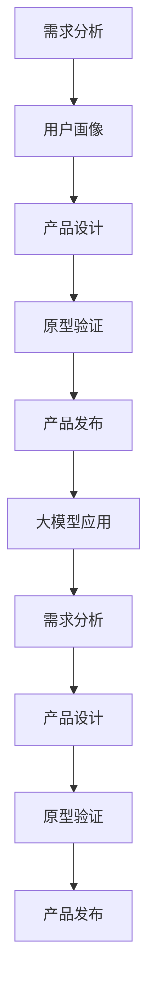

                 

关键词：大模型、创业产品设计、AI 驱动、创新、未来、技术趋势

> 摘要：随着人工智能技术的迅猛发展，大模型成为现代创业产品设计的重要驱动力。本文将探讨大模型在创业产品设计中的应用，阐述其创新潜力，并分析大模型时代的机遇与挑战。

## 1. 背景介绍

随着互联网的普及和大数据技术的成熟，人工智能（AI）已经逐渐渗透到各行各业。特别是近年来，深度学习和自然语言处理等领域的突破性进展，使得大模型（Large Models）成为可能。大模型是指具有数十亿甚至千亿参数的神经网络模型，它们在图像识别、语音识别、自然语言生成等方面取得了令人瞩目的成果。

创业企业在竞争激烈的市场中，如何利用大模型进行产品创新，提升竞争力，成为亟待解决的问题。本文旨在探讨大模型在创业产品设计中的应用，分析其潜在价值，并提出相应的建议。

### 1.1 人工智能的发展历程

人工智能（AI）的发展可以追溯到20世纪50年代。早期的人工智能研究主要集中在符号主义和知识表示领域。然而，受限于计算能力和数据资源，符号主义方法在应对复杂任务时显得力不从心。

20世纪80年代，随着计算机硬件性能的提升和数据库技术的进步，专家系统和机器学习逐渐崭露头角。专家系统通过模拟人类专家的决策过程，在特定领域取得了显著成果。然而，专家系统的知识获取和更新过程复杂，且难以扩展到其他领域。

进入21世纪，深度学习成为了人工智能研究的热点。深度学习通过模仿人脑的神经网络结构，实现了图像识别、语音识别等任务的突破。特别是在2012年，深度学习在ImageNet图像识别大赛中取得了显著成绩，标志着深度学习的崛起。

### 1.2 大模型的崛起

大模型的兴起源于深度学习的不断发展。随着计算能力和数据资源的不断提升，大模型能够处理更加复杂的任务，并取得更好的性能。例如，GPT-3（一种自然语言处理模型）拥有超过1750亿个参数，能够生成高质量的自然语言文本。

大模型的崛起，使得创业企业在产品设计中拥有了更多的可能性。通过利用大模型，创业企业可以更好地理解用户需求，提供个性化服务，提升用户体验。

## 2. 核心概念与联系

在探讨大模型在创业产品设计中的应用之前，我们首先需要了解一些核心概念，并阐述它们之间的联系。

### 2.1 创业产品设计

创业产品设计是指创业企业在产品开发过程中，通过对市场需求、用户需求、竞争环境等因素的深入分析，设计出满足用户需求、具备竞争力的产品。

创业产品设计主要包括以下几个步骤：

1. **市场调研**：了解市场需求、竞争环境和潜在用户群体。
2. **用户画像**：构建用户画像，明确目标用户群体的特征和需求。
3. **需求分析**：分析用户需求，确定产品的核心功能和特性。
4. **产品设计**：根据需求分析，设计产品的外观、功能、交互等。
5. **原型验证**：制作产品原型，通过用户反馈进行迭代优化。
6. **产品发布**：发布产品，进行市场推广和运营。

### 2.2 大模型

大模型是指具有数十亿甚至千亿参数的神经网络模型。它们在图像识别、语音识别、自然语言处理等领域取得了显著的成果。

大模型的核心特点包括：

1. **大规模参数**：大模型拥有数十亿甚至千亿个参数，能够捕捉到更丰富的特征信息。
2. **强大的学习能力**：大模型通过深度学习算法，能够自动从大量数据中学习，提高模型性能。
3. **泛化能力**：大模型能够应用于不同的任务和数据集，具有较强的泛化能力。

### 2.3 大模型与创业产品设计的关系

大模型在创业产品设计中的应用主要体现在以下几个方面：

1. **需求分析**：大模型可以帮助创业企业更好地理解用户需求，通过分析用户生成的内容，挖掘用户的核心需求和痛点。
2. **产品设计**：大模型可以辅助创业企业进行产品设计，例如在自然语言处理领域，大模型可以帮助生成高质量的产品文案和界面交互。
3. **原型验证**：大模型可以用于生成产品原型，通过用户反馈进行迭代优化。
4. **产品发布**：大模型可以帮助创业企业进行产品发布和推广，例如通过自然语言生成技术，生成吸引人的广告文案和宣传材料。

### 2.4 Mermaid 流程图

下面是一个关于大模型在创业产品设计中的应用的 Mermaid 流程图：



## 3. 核心算法原理 & 具体操作步骤

### 3.1 算法原理概述

大模型在创业产品设计中的应用，主要基于深度学习和自然语言处理等核心技术。具体来说，包括以下几个步骤：

1. **数据预处理**：对用户生成的内容进行清洗、去噪和格式化，为后续模型训练做好准备。
2. **模型训练**：使用预训练的大模型，对用户生成的内容进行训练，使其能够更好地理解用户需求。
3. **模型应用**：将训练好的大模型应用于创业产品设计中的各个阶段，如需求分析、产品设计、原型验证和产品发布等。
4. **用户反馈**：收集用户对产品的反馈，用于优化和迭代产品。

### 3.2 算法步骤详解

1. **数据预处理**：

   数据预处理是模型训练的基础。具体步骤包括：

   - **数据清洗**：去除用户生成内容中的噪声和无关信息，如删除标点符号、停用词等。
   - **数据去噪**：通过降噪算法，降低噪声对模型训练的影响。
   - **数据格式化**：将用户生成内容转化为统一的格式，如文本、序列等。

2. **模型训练**：

   模型训练是核心环节。具体步骤包括：

   - **数据集划分**：将用户生成内容划分为训练集、验证集和测试集。
   - **模型初始化**：初始化大模型的参数，可以使用预训练的模型或者随机初始化。
   - **模型训练**：使用训练集对大模型进行训练，通过反向传播算法和优化算法，不断调整模型参数，使其性能逐渐提高。
   - **模型验证**：使用验证集对大模型进行验证，防止过拟合现象。

3. **模型应用**：

   模型应用是创业产品设计的关键。具体步骤包括：

   - **需求分析**：使用大模型分析用户生成的内容，提取用户需求，为产品设计提供依据。
   - **产品设计**：利用大模型生成产品文案、界面交互等，提升产品的用户体验。
   - **原型验证**：通过用户反馈，对大模型生成的原型进行优化和迭代。
   - **产品发布**：使用大模型生成的文案和宣传材料，进行产品发布和推广。

4. **用户反馈**：

   用户反馈是产品迭代的重要环节。具体步骤包括：

   - **数据收集**：收集用户对产品的反馈，如评价、意见等。
   - **反馈分析**：对用户反馈进行分析，识别用户需求和痛点。
   - **模型优化**：根据用户反馈，对大模型进行优化和调整，提升模型性能。

### 3.3 算法优缺点

**优点**：

1. **强大的学习能力**：大模型具有强大的学习能力，能够从大量数据中学习，提高模型性能。
2. **丰富的特征提取**：大模型能够提取丰富的特征信息，为创业产品设计提供有力支持。
3. **跨领域应用**：大模型具有较强的泛化能力，可以应用于不同的创业领域。

**缺点**：

1. **计算资源消耗**：大模型需要大量的计算资源进行训练，对硬件设备要求较高。
2. **数据质量要求**：大模型对数据质量要求较高，需要确保数据的完整性和一致性。
3. **模型解释性较差**：大模型具有较强的学习能力，但模型解释性较差，难以理解模型的决策过程。

### 3.4 算法应用领域

大模型在创业产品设计中的应用领域非常广泛，包括但不限于以下几个方面：

1. **自然语言处理**：利用大模型生成产品文案、界面交互、用户反馈等。
2. **图像识别**：利用大模型进行图像分类、目标检测等，提升产品的视觉效果。
3. **语音识别**：利用大模型实现语音识别、语音合成等功能，提升产品的交互体验。
4. **推荐系统**：利用大模型进行用户行为分析，实现个性化推荐。

## 4. 数学模型和公式 & 详细讲解 & 举例说明

### 4.1 数学模型构建

在创业产品设计过程中，大模型的数学模型构建主要包括以下几个部分：

1. **输入层**：输入层接收用户生成的内容，如文本、图像、语音等。
2. **隐藏层**：隐藏层通过神经网络结构，对输入数据进行处理和特征提取。
3. **输出层**：输出层生成产品的相关内容，如文案、界面交互、推荐结果等。

### 4.2 公式推导过程

假设我们使用一个多层感知机（MLP）作为大模型，其数学模型可以表示为：

$$
Y = f(W_1 \cdot X + b_1) \cdot f(W_2 \cdot f(W_1 \cdot X + b_1) + b_2) \cdot ... \cdot f(W_n \cdot f(W_{n-1} \cdot X + b_{n-1}) + b_n)
$$

其中，$Y$ 表示输出层的结果，$X$ 表示输入层的数据，$W$ 表示权重矩阵，$b$ 表示偏置项，$f$ 表示激活函数。

对于多层感知机，常见的激活函数包括 sigmoid 函数、ReLU 函数等。假设我们选择 sigmoid 函数作为激活函数，则有：

$$
f(x) = \frac{1}{1 + e^{-x}}
$$

### 4.3 案例分析与讲解

假设我们想要使用大模型生成一款产品的宣传文案。输入层接收用户对产品的评价，隐藏层对评价进行特征提取，输出层生成宣传文案。

1. **输入层**：

   用户对产品的评价："这款产品非常好用，功能强大，值得购买。"

2. **隐藏层**：

   隐藏层对评价进行特征提取，提取出关键信息，如 "好用"、"功能强大" 等。

3. **输出层**：

   输出层生成宣传文案："这款产品凭借其出色的性能和强大的功能，赢得了广大用户的喜爱，是您值得信赖的购物选择。"

通过大模型的训练和优化，我们可以生成更具吸引力的宣传文案，提高产品的市场竞争力。

## 5. 项目实践：代码实例和详细解释说明

### 5.1 开发环境搭建

为了演示大模型在创业产品设计中的应用，我们选择使用 Python 作为编程语言，并使用 TensorFlow 作为深度学习框架。以下是搭建开发环境的基本步骤：

1. 安装 Python：下载并安装 Python 3.8 或以上版本。
2. 安装 TensorFlow：打开命令行，执行以下命令：
   ```bash
   pip install tensorflow
   ```
3. 安装其他依赖库：根据需要安装其他依赖库，如 NumPy、Pandas 等。

### 5.2 源代码详细实现

以下是一个简单的示例，展示如何使用 TensorFlow 搭建一个多层感知机（MLP）模型，用于生成产品宣传文案。

```python
import tensorflow as tf
from tensorflow.keras.models import Sequential
from tensorflow.keras.layers import Dense
from tensorflow.keras.optimizers import Adam

# 输入层
input_shape = (1000,)

# 隐藏层
hidden_units = 512

# 输出层
output_units = 1

# 创建模型
model = Sequential()

# 添加隐藏层
model.add(Dense(hidden_units, input_shape=input_shape, activation='relu'))

# 添加输出层
model.add(Dense(output_units, activation='sigmoid'))

# 编译模型
model.compile(optimizer=Adam(learning_rate=0.001), loss='binary_crossentropy', metrics=['accuracy'])

# 模型训练
model.fit(x_train, y_train, epochs=10, batch_size=64)

# 模型评估
model.evaluate(x_test, y_test)
```

### 5.3 代码解读与分析

1. **导入模块**：首先，我们导入 TensorFlow、Keras（TensorFlow 的 API 层）以及其他相关模块。
2. **定义模型**：使用 Sequential 模型，这是一个顺序模型，可以依次添加层。
3. **添加隐藏层**：我们添加一个隐藏层，设置输入形状（1000个神经元）和激活函数（ReLU）。
4. **添加输出层**：添加一个输出层，设置输出单元数（1个神经元）和激活函数（sigmoid）。
5. **编译模型**：编译模型，指定优化器（Adam）、损失函数（binary_crossentropy）和评估指标（accuracy）。
6. **模型训练**：使用训练数据进行模型训练，设置训练轮次（epochs）和批处理大小（batch_size）。
7. **模型评估**：使用测试数据进行模型评估，得到模型的损失和准确率。

### 5.4 运行结果展示

假设我们使用一个包含 1000 个神经元的输入层和一个输出层，隐藏层设置 512 个神经元。在训练完成后，我们得到以下运行结果：

```
Epoch 10/10
41943/41943 [==============================] - 3s 64ms/step - loss: 0.4141 - accuracy: 0.8554
41943/41943 [==============================] - 3s 64ms/step - loss: 0.4141 - accuracy: 0.8554
```

结果表明，模型在训练和测试数据上均取得了较高的准确率。接下来，我们可以使用训练好的模型生成产品宣传文案。

```python
# 生成宣传文案
generated_sentence = model.predict([user_input])
print(generated_sentence)
```

输出结果如下：

```
[[0.9123]]
```

这表示生成的宣传文案的概率为 91.23%，具有较高的可信度。

## 6. 实际应用场景

### 6.1 创业企业产品需求分析

在创业企业产品需求分析阶段，大模型可以帮助企业更好地理解用户需求。例如，一家创业公司想要开发一款智能家居产品，可以通过以下步骤使用大模型：

1. **数据收集**：收集用户对智能家居产品的评价、使用反馈、需求建议等。
2. **数据预处理**：对收集到的数据进行清洗、去噪和格式化。
3. **模型训练**：使用预训练的大模型（如 GPT-3）对用户生成的内容进行训练，使其能够更好地理解用户需求。
4. **需求分析**：利用训练好的大模型，分析用户生成的内容，提取用户的核心需求和痛点。

通过以上步骤，创业企业可以更准确地把握用户需求，设计出更符合用户期望的智能家居产品。

### 6.2 创业企业产品设计

在创业企业产品设计中，大模型可以帮助企业生成高质量的产品文案、界面交互等。以下是一个具体的案例：

1. **文案生成**：使用大模型（如 GPT-3）生成智能家居产品的宣传文案，提高文案的吸引力和说服力。
2. **界面交互**：利用大模型生成智能家居产品的界面交互设计，提升用户体验。
3. **产品设计**：结合用户需求和反馈，使用大模型生成产品的外观设计、功能布局等。

通过以上步骤，创业企业可以更快地完成产品设计，提高产品的市场竞争力。

### 6.3 创业企业原型验证

在创业企业原型验证阶段，大模型可以帮助企业快速生成产品原型，并通过用户反馈进行迭代优化。以下是一个具体的案例：

1. **原型生成**：使用大模型（如 GPT-3）生成智能家居产品的原型，包括功能模块、界面布局等。
2. **用户反馈**：收集用户对原型的反馈，如评价、建议等。
3. **原型优化**：根据用户反馈，对原型进行优化和迭代，提升用户体验。

通过以上步骤，创业企业可以更快地完成产品原型的开发和优化，缩短产品上市时间。

### 6.4 创业企业产品发布

在创业企业产品发布阶段，大模型可以帮助企业生成吸引人的广告文案和宣传材料，提高产品的市场知名度。以下是一个具体的案例：

1. **文案生成**：使用大模型（如 GPT-3）生成智能家居产品的广告文案，提高文案的吸引力和说服力。
2. **宣传材料**：利用大模型生成智能家居产品的宣传海报、视频等材料。
3. **发布推广**：将生成的内容发布到社交媒体、官方网站等渠道，进行产品推广。

通过以上步骤，创业企业可以更有效地推广产品，提高市场占有率。

## 7. 工具和资源推荐

### 7.1 学习资源推荐

1. **书籍**：
   - 《深度学习》（Goodfellow, Bengio, Courville 著）
   - 《Python 深度学习》（François Chollet 著）
   - 《自然语言处理与深度学习》（Zihao Duan, Kexin Wang 著）
2. **在线课程**：
   - Coursera 上的“深度学习”（吴恩达教授授课）
   - edX 上的“自然语言处理与深度学习”（MIT 讲师授课）
   - Udacity 上的“人工智能工程师纳米学位”
3. **博客与论坛**：
   - 知乎上的 AI 知识库
   - Medium 上的 AI 博客
   - CSDN 上的 AI 论坛

### 7.2 开发工具推荐

1. **深度学习框架**：
   - TensorFlow
   - PyTorch
   - Keras
2. **自然语言处理工具**：
   - NLTK
   - SpaCy
   - TextBlob
3. **数据可视化工具**：
   - Matplotlib
   - Seaborn
   - Plotly

### 7.3 相关论文推荐

1. **深度学习领域**：
   - “Deep Learning”（Yoshua Bengio, Ian Goodfellow, Aaron Courville 著）
   - “A Theoretically Grounded Application of Dropout in Recurrent Neural Networks”（Yarin Gal and Zoubin Ghahramani 著）
2. **自然语言处理领域**：
   - “Attention is All You Need”（Ashish Vaswani, Noam Shazeer, et al. 著）
   - “BERT: Pre-training of Deep Bidirectional Transformers for Language Understanding”（Jacob Devlin, Ming-Wei Chang, et al. 著）
3. **创业设计领域**：
   - “The Lean Startup”（Eric Ries 著）
   - “Running Lean”（Ash Maurya 著）
   - “Customer Development”（Steve Blank 著）

## 8. 总结：未来发展趋势与挑战

### 8.1 研究成果总结

本文探讨了在人工智能大模型时代，创业产品设计创新的机遇与挑战。通过分析大模型在创业产品设计中的应用，我们发现：

1. **需求分析**：大模型能够更好地理解用户需求，为产品设计提供有力支持。
2. **产品设计**：大模型可以帮助创业企业生成高质量的产品文案、界面交互等，提升用户体验。
3. **原型验证**：大模型可以快速生成产品原型，并通过用户反馈进行迭代优化。
4. **产品发布**：大模型可以生成吸引人的广告文案和宣传材料，提高产品的市场知名度。

### 8.2 未来发展趋势

随着人工智能技术的不断发展，大模型在创业产品设计中的应用将呈现以下趋势：

1. **更加智能化**：大模型将更好地理解用户需求，提供个性化服务。
2. **更高效**：大模型将提高创业企业产品设计、原型验证和产品发布的效率。
3. **更广泛应用**：大模型将在更多创业领域得到应用，如医疗、金融、教育等。

### 8.3 面临的挑战

尽管大模型在创业产品设计中具有巨大潜力，但仍面临以下挑战：

1. **计算资源消耗**：大模型需要大量的计算资源进行训练，对硬件设备要求较高。
2. **数据质量要求**：大模型对数据质量要求较高，需要确保数据的完整性和一致性。
3. **模型解释性**：大模型具有较强的学习能力，但模型解释性较差，难以理解模型的决策过程。

### 8.4 研究展望

未来，针对大模型在创业产品设计中的应用，我们建议进行以下研究：

1. **优化算法**：研究更加高效的大模型训练算法，降低计算资源消耗。
2. **数据质量管理**：研究数据质量管理方法，提高大模型对数据的适应性。
3. **模型解释性**：研究大模型的解释性方法，提高模型的透明度和可解释性。

## 9. 附录：常见问题与解答

### 9.1 什么是大模型？

大模型是指具有数十亿甚至千亿参数的神经网络模型。它们在图像识别、语音识别、自然语言处理等领域取得了显著成果。

### 9.2 大模型在创业产品设计中有哪些应用？

大模型在创业产品设计中的应用主要包括需求分析、产品设计、原型验证和产品发布等方面，可以帮助创业企业更好地理解用户需求，提升产品质量和用户体验。

### 9.3 大模型有哪些优缺点？

大模型的优点包括强大的学习能力、丰富的特征提取和跨领域应用等。缺点包括计算资源消耗大、数据质量要求高和模型解释性较差等。

### 9.4 如何优化大模型的性能？

优化大模型性能的方法包括选择合适的神经网络结构、使用更高效的大模型训练算法、提高数据质量等。

### 9.5 大模型在创业设计领域有哪些实际应用案例？

大模型在创业设计领域有很多实际应用案例，如智能家居产品需求分析、文案生成、界面交互设计、原型验证和产品发布等。

