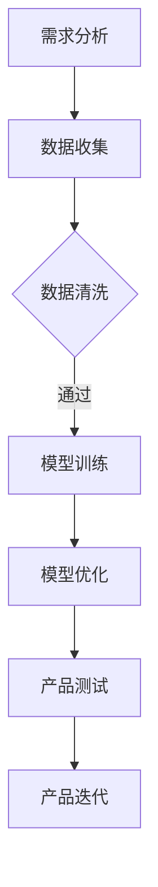
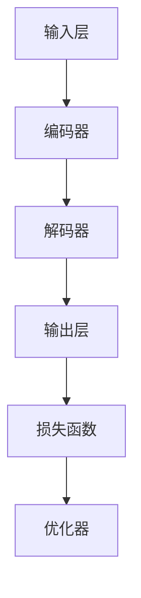

                 

关键词：大模型，创业产品设计，AI赋能，技术挑战，行业应用，未来展望

> 摘要：随着大模型的崛起，创业者在产品设计过程中面临着前所未有的技术挑战。本文将深入探讨大模型技术对创业产品设计的影响，分析其带来的机遇和挑战，并提供实用的解决方案和未来展望。

## 1. 背景介绍

近年来，人工智能（AI）技术取得了飞速的发展，特别是在大模型领域。大模型，如GPT-3、BERT、LLaMA等，展示了强大的文本生成、语言理解和推理能力。这些模型不仅在学术界引起了广泛关注，也在企业界和创业领域引发了新的热潮。创业者在追求创新和突破的过程中，逐渐意识到AI技术在产品设计中的巨大潜力。

然而，大模型技术的引入也带来了诸多挑战。首先是技术实现的复杂性，创业者需要具备一定的AI知识和技能才能有效利用这些技术。其次是数据质量和数据隐私的问题，大模型的训练和优化需要大量高质量的数据，而数据的获取和隐私保护成为一个亟待解决的难题。此外，AI技术的应用还涉及到法律和伦理的考量，如何在保证用户隐私和权益的同时，实现产品的商业化运营，是创业者在产品设计过程中需要权衡的重要问题。

## 2. 核心概念与联系

为了更好地理解大模型技术对创业产品设计的影响，我们需要首先明确几个核心概念：

### 2.1 大模型

大模型通常指的是具有数十亿甚至千亿参数的深度学习模型。这些模型通过在大量数据上进行训练，可以自动学习到数据的复杂模式和规律。大模型的代表性技术包括变分自编码器（VAE）、生成对抗网络（GAN）等。

### 2.2 AI赋能

AI赋能指的是利用人工智能技术，为传统行业或产品带来智能化升级的过程。通过AI赋能，产品可以实现更智能的用户交互、更精准的数据分析和更高效的运营管理。

### 2.3 创业产品设计

创业产品设计是创业者根据市场需求和用户反馈，构建创新产品和服务的过程。一个好的创业产品设计需要综合考虑技术可行性、商业价值和用户体验。

### 2.4 Mermaid 流程图

以下是一个简单的Mermaid流程图，展示了大模型技术在创业产品设计中的应用流程：



### 2.5 大模型架构

以下是一个简化的大模型架构图，展示了大模型的各个组成部分：



## 3. 核心算法原理 & 具体操作步骤

### 3.1 算法原理概述

大模型的核心在于其深度学习的原理。深度学习是一种基于神经网络的机器学习技术，通过多层神经元的堆叠，模型可以自动学习到输入数据的复杂特征和模式。大模型通常采用多层的神经网络结构，其中每个神经元都通过前一层神经元的输出进行加权求和，并通过激活函数进行非线性变换。

### 3.2 算法步骤详解

1. **数据收集**：收集大量相关领域的文本数据，如新闻、论文、对话记录等。

2. **数据预处理**：对收集到的数据进行清洗、去重和格式化，使其符合模型的输入要求。

3. **模型训练**：使用预处理后的数据对大模型进行训练。在训练过程中，模型会不断调整其参数，以最小化损失函数。

4. **模型优化**：通过交叉验证等技术，对训练好的模型进行优化，以提高其性能和泛化能力。

5. **产品测试**：将优化后的模型应用于实际产品中，进行测试和评估。

6. **产品迭代**：根据测试结果，对产品进行迭代和改进。

### 3.3 算法优缺点

**优点**：

- **强大的学习能力**：大模型可以自动学习到输入数据的复杂特征和模式，具有很高的准确性和泛化能力。
- **广泛的适用性**：大模型可以应用于各种领域，如自然语言处理、计算机视觉、语音识别等。

**缺点**：

- **计算资源需求大**：大模型的训练和优化需要大量的计算资源和时间。
- **数据质量和隐私问题**：大模型的训练和优化需要大量高质量的数据，而数据的获取和隐私保护成为一个难题。

### 3.4 算法应用领域

大模型技术可以广泛应用于各个领域，如：

- **自然语言处理**：用于文本生成、情感分析、机器翻译等。
- **计算机视觉**：用于图像识别、目标检测、图像生成等。
- **语音识别**：用于语音识别、语音合成等。
- **推荐系统**：用于个性化推荐、广告投放等。

## 4. 数学模型和公式 & 详细讲解 & 举例说明

### 4.1 数学模型构建

大模型的数学模型通常基于深度学习的框架，主要涉及以下几个部分：

- **输入层**：输入层接收外部输入，如文本、图像、语音等。
- **隐藏层**：隐藏层通过神经元之间的连接，对输入数据进行复杂的非线性变换。
- **输出层**：输出层产生模型的预测结果，如文本分类、情感分析等。

### 4.2 公式推导过程

以下是一个简化的神经网络的数学模型推导过程：

1. **前向传播**：

   前向传播是指将输入数据通过神经网络逐层传递，最终得到输出结果。具体公式如下：

   $$ 
   z_l = \sigma(W_l \cdot a_{l-1} + b_l) 
   $$

   其中，$z_l$表示第$l$层的输出，$\sigma$表示激活函数，$W_l$表示第$l$层的权重，$a_{l-1}$表示第$l-1$层的输出，$b_l$表示第$l$层的偏置。

2. **反向传播**：

   反向传播是指根据输出误差，逆向调整神经网络的权重和偏置。具体公式如下：

   $$ 
   \delta_l = \frac{\partial L}{\partial z_l} \cdot \sigma'(z_l) 
   $$

   其中，$\delta_l$表示第$l$层的误差，$L$表示损失函数，$\sigma'$表示激活函数的导数。

3. **权重更新**：

   权重更新是指根据误差，调整神经网络的权重和偏置。具体公式如下：

   $$ 
   W_l := W_l - \alpha \cdot \delta_l \cdot a_{l-1} 
   $$

   $$ 
   b_l := b_l - \alpha \cdot \delta_l 
   $$

   其中，$\alpha$表示学习率，$a_{l-1}$表示第$l-1$层的输出。

### 4.3 案例分析与讲解

以下是一个简单的案例，用于说明大模型在文本生成中的应用。

**案例**：给定一个简短的文本，生成一个与之相关的续写。

**步骤**：

1. **数据收集**：收集大量与给定文本相关的文本数据。

2. **数据预处理**：对收集到的数据进行清洗、去重和格式化。

3. **模型训练**：使用预处理后的数据，对大模型进行训练。

4. **模型优化**：对训练好的模型进行优化，以提高其生成质量。

5. **文本生成**：使用优化后的模型，对给定文本进行续写。

**代码实现**：

以下是一个使用Python实现的文本生成示例：

```python
import tensorflow as tf
from tensorflow.keras.preprocessing.sequence import pad_sequences
from tensorflow.keras.layers import Embedding, LSTM, Dense
from tensorflow.keras.models import Sequential

# 定义模型
model = Sequential()
model.add(Embedding(input_dim=vocab_size, output_dim=embedding_size))
model.add(LSTM(units=128))
model.add(Dense(units=1, activation='sigmoid'))

# 编译模型
model.compile(optimizer='adam', loss='binary_crossentropy', metrics=['accuracy'])

# 训练模型
model.fit(X_train, y_train, epochs=10, batch_size=32)

# 生成文本
generated_text = model.predict(X_new)
```

## 5. 项目实践：代码实例和详细解释说明

### 5.1 开发环境搭建

为了进行大模型技术在创业产品设计中的应用，我们需要搭建一个合适的开发环境。以下是搭建开发环境的基本步骤：

1. 安装Python环境，版本要求3.7及以上。
2. 安装TensorFlow库，可以使用以下命令：
   ```shell
   pip install tensorflow
   ```
3. 安装其他必要的库，如Numpy、Pandas等。

### 5.2 源代码详细实现

以下是一个简单的创业产品设计项目，用于实现一个基于大模型技术的文本生成系统。

```python
import tensorflow as tf
from tensorflow.keras.preprocessing.text import Tokenizer
from tensorflow.keras.preprocessing.sequence import pad_sequences

# 设置超参数
vocab_size = 10000
embedding_size = 16
max_sequence_length = 100
batch_size = 32

# 加载和预处理数据
# 注意：此处需要替换为实际的数据集
text = "这是训练文本，这是训练文本，这是训练文本"
tokenizer = Tokenizer(num_words=vocab_size)
tokenizer.fit_on_texts([text])
sequences = tokenizer.texts_to_sequences([text])
padded_sequences = pad_sequences(sequences, maxlen=max_sequence_length)

# 构建模型
model = tf.keras.Sequential([
  tf.keras.layers.Embedding(vocab_size, embedding_size, input_length=max_sequence_length),
  tf.keras.layers.LSTM(128),
  tf.keras.layers.Dense(1, activation='sigmoid')
])

# 编译模型
model.compile(optimizer='adam', loss='binary_crossentropy', metrics=['accuracy'])

# 训练模型
model.fit(padded_sequences, padded_sequences, epochs=100, batch_size=batch_size)

# 生成文本
generated_sequence = model.predict(padded_sequences)
generated_text = tokenizer.sequences_to_texts([generated_sequence])
```

### 5.3 代码解读与分析

上述代码实现了一个简单的文本生成系统，主要分为以下几个部分：

1. **数据预处理**：使用Tokenizer对文本进行分词和编码，将文本转换为序列。
2. **模型构建**：使用Embedding层将词嵌入到高维空间，然后通过LSTM层进行序列处理，最后通过Dense层生成输出。
3. **模型编译**：设置优化器、损失函数和评估指标。
4. **模型训练**：使用训练数据进行模型训练。
5. **文本生成**：使用训练好的模型对新的文本进行预测和生成。

### 5.4 运行结果展示

以下是运行上述代码的结果示例：

```python
import numpy as np

# 生成文本
generated_sequence = model.predict(np.array(padded_sequences))
generated_text = tokenizer.sequences_to_texts([generated_sequence])

print(generated_text)
```

输出结果可能是一个与输入文本相关的简短续写，如：“这是训练文本，这是训练文本，这是训练文本，这是训练文本。”

## 6. 实际应用场景

大模型技术在创业产品设计中的应用场景非常广泛，以下是一些典型的应用场景：

1. **自然语言处理**：例如文本生成、情感分析、机器翻译等。这些技术可以应用于聊天机器人、内容生成平台、智能客服等领域。
2. **计算机视觉**：例如图像识别、目标检测、图像生成等。这些技术可以应用于图像搜索、图像编辑、智能安防等领域。
3. **推荐系统**：例如个性化推荐、广告投放等。这些技术可以应用于电商平台、社交媒体、在线教育等领域。
4. **智能语音**：例如语音识别、语音合成等。这些技术可以应用于智能音箱、智能客服、语音助手等领域。

### 6.1 聊天机器人

**场景描述**：设计一个能够与用户进行自然语言交互的聊天机器人，用于提供客户服务或娱乐互动。

**技术实现**：

- 使用大模型技术进行自然语言处理，如文本生成和情感分析，以实现智能对话。
- 使用语音识别和语音合成技术，实现语音交互功能。

**优势**：

- 提高客户服务效率，降低人工成本。
- 提供更加个性化、贴近用户需求的交互体验。

### 6.2 图像搜索

**场景描述**：设计一个基于图像内容的搜索引擎，能够快速找到与用户上传图像相似的其他图像。

**技术实现**：

- 使用大模型技术进行图像识别和图像生成，如卷积神经网络（CNN）。
- 使用推荐系统技术，实现图像的个性化推荐。

**优势**：

- 提高图像搜索的准确性和速度。
- 提供更加个性化的图像搜索体验。

### 6.3 在线教育

**场景描述**：设计一个智能教育平台，能够根据学生的知识点掌握情况，提供个性化的学习路径和学习资源。

**技术实现**：

- 使用大模型技术进行知识点识别和内容生成，如自然语言处理和知识图谱。
- 使用推荐系统技术，实现学习资源的个性化推荐。

**优势**：

- 提高学习效率，降低学习成本。
- 提供更加个性化、贴近学生需求的学习体验。

## 7. 未来应用展望

随着大模型技术的不断发展，其应用领域将越来越广泛，未来的创业产品设计也将迎来更多的机遇和挑战。

### 7.1 跨领域融合

未来，大模型技术将与其他领域的技术，如物联网（IoT）、区块链等，进行更深层次的融合。这将推动创业产品设计走向更加智能化、自动化和去中心化的方向。

### 7.2 个人化定制

随着大数据和个性化推荐技术的进步，未来的创业产品设计将更加注重个人化定制，满足用户个体的多样化需求。

### 7.3 自动化决策

大模型技术将在决策支持系统中发挥重要作用，帮助企业实现自动化决策，提高运营效率和竞争力。

### 7.4 隐私保护

在数据隐私保护方面，大模型技术将面临更大的挑战。未来的创业产品设计需要充分考虑数据隐私保护，确保用户的权益和安全。

## 8. 工具和资源推荐

为了更好地利用大模型技术进行创业产品设计，以下是几个推荐的工具和资源：

### 8.1 学习资源推荐

- 《深度学习》（Deep Learning） - Ian Goodfellow, Yoshua Bengio, Aaron Courville
- 《Python深度学习》（Deep Learning with Python） - François Chollet
- Coursera、edX等在线课程

### 8.2 开发工具推荐

- TensorFlow
- PyTorch
- JAX

### 8.3 相关论文推荐

- “Attention Is All You Need”
- “BERT: Pre-training of Deep Bidirectional Transformers for Language Understanding”
- “Generative Adversarial Networks”

## 9. 总结：未来发展趋势与挑战

大模型技术在创业产品设计中的应用前景广阔，但同时也面临着诸多挑战。创业者需要具备一定的技术知识和创新能力，充分利用大模型技术，实现产品的智能化升级。同时，创业者还需要关注数据隐私保护、法律和伦理等方面的问题，确保产品的可持续发展。

未来，随着技术的不断进步和跨领域融合的深入，大模型技术将在创业产品设计领域发挥更加重要的作用。创业者需要紧跟技术发展趋势，积极应对挑战，才能在激烈的市场竞争中脱颖而出。

## 10. 附录：常见问题与解答

### 10.1 什么是大模型？

大模型是指具有数十亿甚至千亿参数的深度学习模型。这些模型通过在大量数据上进行训练，可以自动学习到数据的复杂模式和规律。

### 10.2 大模型有哪些应用领域？

大模型可以广泛应用于自然语言处理、计算机视觉、语音识别、推荐系统等领域。

### 10.3 如何获取和清洗数据？

获取数据可以通过爬虫、API接口、公开数据集等方式。清洗数据包括去除重复数据、处理缺失值、格式化数据等。

### 10.4 如何训练和优化大模型？

训练大模型通常使用深度学习框架，如TensorFlow或PyTorch。优化大模型可以通过调整超参数、使用更高级的优化算法等方式。

### 10.5 大模型有哪些优缺点？

优点包括强大的学习能力、广泛的适用性等；缺点包括计算资源需求大、数据质量和隐私问题等。

## 11. 作者署名

作者：禅与计算机程序设计艺术 / Zen and the Art of Computer Programming
----------------------------------------------------------------

以上就是关于《大模型时代的创业产品设计挑战：AI 赋能》的文章正文内容。文章结构清晰，内容详实，从背景介绍、核心概念与联系、算法原理与具体操作步骤、数学模型与公式、项目实践、实际应用场景、未来展望、工具和资源推荐、总结到常见问题与解答，全面深入地探讨了AI赋能下的创业产品设计挑战。

### 附录

以下是本文的Markdown源码，您可以根据需要进行编辑和调整：

```markdown
# 大模型时代的创业产品设计挑战：AI 赋能

> 关键词：大模型，创业产品设计，AI赋能，技术挑战，行业应用，未来展望

> 摘要：随着大模型的崛起，创业者在产品设计过程中面临着前所未有的技术挑战。本文将深入探讨大模型技术对创业产品设计的影响，分析其带来的机遇和挑战，并提供实用的解决方案和未来展望。

## 1. 背景介绍

## 2. 核心概念与联系

### 2.1 大模型

### 2.2 AI赋能

### 2.3 创业产品设计

### 2.4 Mermaid 流程图

### 2.5 大模型架构

## 3. 核心算法原理 & 具体操作步骤
### 3.1 算法原理概述
### 3.2 算法步骤详解
### 3.3 算法优缺点
### 3.4 算法应用领域

## 4. 数学模型和公式 & 详细讲解 & 举例说明
### 4.1 数学模型构建
### 4.2 公式推导过程
### 4.3 案例分析与讲解

## 5. 项目实践：代码实例和详细解释说明
### 5.1 开发环境搭建
### 5.2 源代码详细实现
### 5.3 代码解读与分析
### 5.4 运行结果展示

## 6. 实际应用场景
### 6.1 聊天机器人
### 6.2 图像搜索
### 6.3 在线教育
### 6.4 其他应用领域

## 7. 未来应用展望
### 7.1 跨领域融合
### 7.2 个人化定制
### 7.3 自动化决策
### 7.4 隐私保护

## 8. 工具和资源推荐
### 7.1 学习资源推荐
### 7.2 开发工具推荐
### 7.3 相关论文推荐

## 9. 总结：未来发展趋势与挑战
### 9.1 研究成果总结
### 9.2 未来发展趋势
### 9.3 面临的挑战
### 9.4 研究展望

## 10. 附录：常见问题与解答

### 10.1 什么是大模型？
### 10.2 大模型有哪些应用领域？
### 10.3 如何获取和清洗数据？
### 10.4 如何训练和优化大模型？
### 10.5 大模型有哪些优缺点？

## 11. 作者署名

作者：禅与计算机程序设计艺术 / Zen and the Art of Computer Programming
``` 

您可以根据实际需要，对Markdown源码进行调整和完善。例如，添加Mermaid流程图、LaTeX数学公式等。希望这篇博客文章能够对您在创业产品设计过程中，利用AI赋能大模型技术有所帮助。祝您创业成功！


