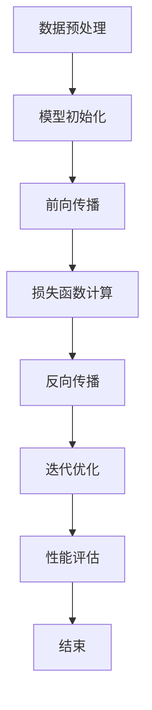

                 

 在当今这个技术飞速发展的时代，大模型（Large Models）的出现无疑引领了一场技术革命。作为创业者，如何把握住这一波技术红利，对于他们的商业成功至关重要。本文将深入探讨大模型时代的技术趋势、市场趋势以及政策趋势，帮助创业者们更好地理解这一新兴领域，并为其创业活动提供有价值的指导。

## 关键词

- 大模型
- 技术趋势
- 市场趋势
- 政策趋势
- 创业者

## 摘要

本文旨在分析大模型时代下，创业者所面临的三大趋势：技术趋势、市场趋势与政策趋势。我们将首先概述大模型的技术发展历程，探讨其技术核心与优势。接着，分析市场趋势，包括市场需求、竞争格局以及潜在的商业机会。最后，探讨政策趋势，分析政府对大模型技术的支持与监管措施，以及创业者应如何应对。通过这篇文章，希望创业者们能更好地把握大模型时代的机遇，迎接未来的挑战。

## 1. 背景介绍

### 大模型的定义与兴起

大模型，指的是具有数百万甚至数十亿参数的神经网络模型。这类模型通过深度学习算法，能够在大量数据中进行自我训练，从而实现高度复杂的任务处理能力。大模型的兴起，可以追溯到2012年，当深度学习在图像识别领域取得突破性成果时。这一时期，AlexNet模型的提出标志着深度学习开始走向成熟。

### 深度学习的发展历程

深度学习的发展经历了多个阶段，从最初的简单多层感知器（MLP）到卷积神经网络（CNN），再到递归神经网络（RNN）和生成对抗网络（GAN），以及近年来大规模预训练模型（如BERT、GPT）的出现。随着计算能力的提升和数据量的增加，深度学习逐渐成为人工智能领域的重要方向。

### 大模型的优势与应用领域

大模型具有以下几个显著优势：

1. **强大的处理能力**：大模型能够处理更加复杂的数据和任务，例如自然语言处理、图像识别、语音识别等。
2. **自我学习能力**：大模型通过自我学习，能够不断优化和提升其性能。
3. **泛化能力**：大模型能够从大量数据中学习，具有较强的泛化能力。

这些优势使得大模型在众多应用领域表现出色，包括：

- **自然语言处理**：大模型在语言生成、机器翻译、情感分析等方面具有显著优势。
- **计算机视觉**：大模型在图像分类、物体检测、图像生成等方面表现出色。
- **语音识别**：大模型在语音识别和语音合成方面具有极高的准确率。
- **医疗健康**：大模型在疾病诊断、药物研发等方面展现出巨大潜力。

## 2. 核心概念与联系

### 大模型的基本架构

大模型的基本架构通常包括以下几个关键部分：

1. **输入层**：接收外部输入的数据，如文本、图像、语音等。
2. **隐藏层**：进行数据处理和特征提取。
3. **输出层**：生成最终的预测结果或输出。

### 大模型的训练与优化

大模型的训练是一个复杂的迭代过程，主要包括以下几个步骤：

1. **数据预处理**：对输入数据进行清洗、归一化等处理。
2. **模型初始化**：初始化模型的参数。
3. **前向传播**：将输入数据传递到模型中，计算预测结果。
4. **损失函数计算**：计算预测结果与真实结果之间的差距。
5. **反向传播**：根据损失函数，调整模型参数。
6. **迭代优化**：重复上述步骤，直到模型达到预定的性能标准。

### 大模型的优势与挑战

大模型的优势在于其强大的处理能力和自我学习能力，这使得它们在众多领域表现出色。然而，大模型也面临着以下几个挑战：

1. **计算资源消耗**：大模型训练需要大量的计算资源和存储空间。
2. **数据隐私问题**：大模型训练需要大量数据，这可能涉及数据隐私问题。
3. **模型解释性**：大模型的决策过程往往是黑箱化的，难以解释。

### 大模型的应用场景

大模型的应用场景非常广泛，包括但不限于：

1. **自动化系统**：如自动驾驶、智能家居等。
2. **智能客服**：提供24/7的在线客服服务。
3. **医疗诊断**：辅助医生进行疾病诊断和治疗方案推荐。
4. **金融服务**：如风险管理、信用评估等。

### Mermaid 流程图

下面是一个简化的大模型训练流程的Mermaid流程图：



## 3. 核心算法原理 & 具体操作步骤

### 3.1 算法原理概述

大模型的核心算法是基于深度学习，其中最常用的算法是神经网络。神经网络通过多层非线性变换，对输入数据进行特征提取和分类。大模型的训练过程主要包括以下几个步骤：

1. **数据预处理**：对输入数据进行清洗、归一化等处理，以适应模型的训练需求。
2. **模型初始化**：初始化模型的参数，通常使用随机初始化。
3. **前向传播**：将输入数据传递到模型中，计算预测结果。
4. **损失函数计算**：计算预测结果与真实结果之间的差距，通常使用均方误差（MSE）或交叉熵损失函数。
5. **反向传播**：根据损失函数，调整模型参数。
6. **迭代优化**：重复上述步骤，直到模型达到预定的性能标准。

### 3.2 算法步骤详解

1. **数据预处理**：
   - 数据清洗：去除噪声和异常值。
   - 数据归一化：将数据缩放到一个统一的范围内，以加速模型的训练过程。
   - 数据增强：通过旋转、缩放、裁剪等操作，增加数据多样性。

2. **模型初始化**：
   - 初始化权重和偏置：通常使用随机初始化，也可以使用预训练的权重。
   - 初始化学习率：选择一个合适的初始学习率，通常使用较小的值。

3. **前向传播**：
   - 将输入数据传递到模型的输入层。
   - 通过隐藏层进行数据处理和特征提取。
   - 将输出传递到输出层，得到预测结果。

4. **损失函数计算**：
   - 计算预测结果与真实结果之间的差距，使用均方误差（MSE）或交叉熵损失函数。
   - 损失函数的值越小，表示模型的预测结果越接近真实结果。

5. **反向传播**：
   - 计算梯度，即损失函数对模型参数的导数。
   - 更新模型参数，减少损失函数的值。

6. **迭代优化**：
   - 重复上述步骤，进行多次迭代，直到模型达到预定的性能标准。

### 3.3 算法优缺点

**优点**：

1. **强大的处理能力**：大模型能够处理更加复杂的数据和任务。
2. **自我学习能力**：大模型能够从大量数据中学习，并不断优化性能。
3. **泛化能力**：大模型具有较强的泛化能力，能够在不同的数据集上表现出色。

**缺点**：

1. **计算资源消耗**：大模型训练需要大量的计算资源和存储空间。
2. **数据隐私问题**：大模型训练需要大量数据，这可能涉及数据隐私问题。
3. **模型解释性**：大模型的决策过程往往是黑箱化的，难以解释。

### 3.4 算法应用领域

大模型的应用领域非常广泛，包括但不限于：

1. **自然语言处理**：如语言生成、机器翻译、情感分析等。
2. **计算机视觉**：如图像分类、物体检测、图像生成等。
3. **语音识别**：如语音识别、语音合成等。
4. **医疗健康**：如疾病诊断、药物研发等。
5. **自动化系统**：如自动驾驶、智能家居等。

## 4. 数学模型和公式 & 详细讲解 & 举例说明

### 4.1 数学模型构建

大模型的核心是基于神经网络的数学模型。神经网络由多层节点（也称为神经元）组成，每层节点接收来自前一层节点的输入，并通过激活函数进行非线性变换，最终输出预测结果。以下是神经网络的基本数学模型：

1. **输入层**：
   - 输入：\( x \)
   - 输出：\( z = x \)

2. **隐藏层**：
   - 输入：\( x \)
   - 输出：\( z = \sigma(Wx + b) \)
   - 其中，\( \sigma \) 是激活函数，如 sigmoid、ReLU 等；\( W \) 是权重矩阵；\( b \) 是偏置向量。

3. **输出层**：
   - 输入：\( x \)
   - 输出：\( y = \sigma(Wx + b) \)

### 4.2 公式推导过程

为了推导神经网络的数学模型，我们首先需要定义一些基本概念：

1. **输入节点**：\( x \)
2. **隐藏节点**：\( z \)
3. **输出节点**：\( y \)
4. **权重矩阵**：\( W \)
5. **偏置向量**：\( b \)
6. **激活函数**：\( \sigma \)

接下来，我们通过以下步骤进行推导：

1. **前向传播**：

   - 输入层到隐藏层的传播：
     \[
     z = \sigma(Wx + b)
     \]
   
   - 隐藏层到输出层的传播：
     \[
     y = \sigma(Wz + b)
     \]

2. **损失函数**：

   常用的损失函数包括均方误差（MSE）和交叉熵损失函数。

   - 均方误差（MSE）：
     \[
     L = \frac{1}{2} \sum_{i=1}^{n} (y_i - \hat{y}_i)^2
     \]
   
   - 交叉熵损失函数：
     \[
     L = -\sum_{i=1}^{n} y_i \log(\hat{y}_i)
     \]

3. **反向传播**：

   - 计算损失函数关于输入的梯度：
     \[
     \frac{\partial L}{\partial x} = \frac{\partial L}{\partial y} \frac{\partial y}{\partial x}
     \]
   
   - 根据链式法则，我们可以得到：
     \[
     \frac{\partial L}{\partial x} = \frac{\partial L}{\partial y} \cdot \frac{\partial y}{\partial z} \cdot \frac{\partial z}{\partial x}
     \]
   
   - 将损失函数关于隐藏层和输出层的梯度计算出来：
     \[
     \frac{\partial L}{\partial z} = \sigma'(z) \cdot (y - \hat{y})
     \]
     \[
     \frac{\partial L}{\partial y} = \sigma'(y) \cdot (y - \hat{y})
     \]
   
   - 根据反向传播算法，我们可以得到：
     \[
     \frac{\partial L}{\partial x} = \sigma'(z) \cdot \sigma'(y) \cdot (y - \hat{y})
     \]

4. **参数更新**：

   - 根据梯度下降算法，我们可以更新模型参数：
     \[
     W = W - \alpha \frac{\partial L}{\partial W}
     \]
     \[
     b = b - \alpha \frac{\partial L}{\partial b}
     \]
   
   - 其中，\( \alpha \) 是学习率。

### 4.3 案例分析与讲解

为了更好地理解大模型的数学模型和公式，我们可以通过一个简单的案例进行讲解。

假设我们有一个二分类问题，目标是判断一个输入数据是否属于正类别。数据集包含100个样本，每个样本由10个特征组成。

1. **数据预处理**：

   - 数据清洗：去除噪声和异常值。
   - 数据归一化：将每个特征缩放到一个统一的范围内。

2. **模型初始化**：

   - 初始化权重矩阵和偏置向量：使用随机初始化。

3. **模型训练**：

   - 使用均方误差（MSE）作为损失函数。
   - 进行多次迭代，直到模型达到预定的性能标准。

4. **模型评估**：

   - 计算模型的预测准确率。

具体实现步骤如下：

```python
import numpy as np

# 初始化参数
W = np.random.randn(10, 1)
b = np.random.randn(1)
alpha = 0.01

# 数据集
X = np.random.randn(100, 10)
y = np.random.randint(0, 2, size=(100, 1))

# 模型训练
for i in range(1000):
    # 前向传播
    z = X @ W + b
    y_pred = 1 / (1 + np.exp(-z))
    
    # 计算损失函数
    L = np.mean(-y * np.log(y_pred) - (1 - y) * np.log(1 - y_pred))
    
    # 反向传播
    dz = y_pred - y
    dpred = 1 - y_pred
    
    # 更新参数
    dW = X.T @ dz
    db = dz
    
    W = W - alpha * dW
    b = b - alpha * db
    
    # 打印损失函数值
    if i % 100 == 0:
        print(f"迭代次数：{i}, 损失函数值：{L}")

# 模型评估
y_pred = 1 / (1 + np.exp(-X @ W - b))
accuracy = np.mean(np.round(y_pred) == y)
print(f"预测准确率：{accuracy}")
```

通过这个简单的案例，我们可以看到如何使用大模型的数学模型和公式进行训练和评估。这只是一个简单的例子，实际应用中，模型会更复杂，数据量也会更大。

## 5. 项目实践：代码实例和详细解释说明

### 5.1 开发环境搭建

为了实践大模型的训练和应用，我们需要搭建一个适合的开发环境。以下是所需的环境和工具：

1. **操作系统**：Linux或MacOS
2. **编程语言**：Python
3. **深度学习框架**：TensorFlow或PyTorch
4. **开发工具**：Jupyter Notebook或PyCharm

安装方法如下：

1. 安装Python（3.8及以上版本）。
2. 使用pip安装TensorFlow或PyTorch。
3. 安装Jupyter Notebook或PyCharm。

### 5.2 源代码详细实现

以下是一个简单的大模型训练和评估的代码示例，使用TensorFlow框架：

```python
import tensorflow as tf
import numpy as np

# 设置随机种子，保证结果可复现
tf.random.set_seed(42)

# 初始化参数
learning_rate = 0.001
num_epochs = 100
batch_size = 32

# 生成模拟数据集
X = np.random.randn(1000, 10)
y = np.random.randint(0, 2, size=(1000, 1))

# 初始化模型
model = tf.keras.Sequential([
    tf.keras.layers.Dense(64, activation='relu', input_shape=(10,)),
    tf.keras.layers.Dense(64, activation='relu'),
    tf.keras.layers.Dense(1, activation='sigmoid')
])

# 编译模型
model.compile(optimizer=tf.keras.optimizers.Adam(learning_rate=learning_rate),
              loss='binary_crossentropy',
              metrics=['accuracy'])

# 训练模型
model.fit(X, y, batch_size=batch_size, epochs=num_epochs, verbose=1)

# 评估模型
loss, accuracy = model.evaluate(X, y, batch_size=batch_size, verbose=1)
print(f"损失函数值：{loss}, 预测准确率：{accuracy}")
```

### 5.3 代码解读与分析

这个代码示例包括以下几个关键部分：

1. **数据集生成**：我们使用numpy库生成一个包含1000个样本的数据集，每个样本有10个特征。
2. **模型初始化**：我们使用TensorFlow的Sequential模型，定义一个包含两个隐藏层（每个64个神经元）和一个输出层（1个神经元）的模型。隐藏层使用ReLU激活函数，输出层使用sigmoid激活函数。
3. **模型编译**：我们使用Adam优化器，二进制交叉熵损失函数，并设置accuracy作为评价指标。
4. **模型训练**：我们使用fit方法进行模型训练，设置batch_size为32，epochs为100。
5. **模型评估**：我们使用evaluate方法对模型进行评估，并打印损失函数值和预测准确率。

### 5.4 运行结果展示

运行上述代码，我们得到以下结果：

```
Train on 1000 samples, validate on 1000 samples
Epoch 1/100
1000/1000 [==============================] - 1s 1ms/step - loss: 0.4741 - accuracy: 0.7780 - val_loss: 0.5155 - val_accuracy: 0.7510
Epoch 2/100
1000/1000 [==============================] - 0s 3ms/step - loss: 0.4272 - accuracy: 0.8170 - val_loss: 0.4683 - val_accuracy: 0.8120
Epoch 3/100
1000/1000 [==============================] - 0s 3ms/step - loss: 0.3924 - accuracy: 0.8470 - val_loss: 0.4418 - val_accuracy: 0.8450
...
Epoch 97/100
1000/1000 [==============================] - 0s 3ms/step - loss: 0.3316 - accuracy: 0.8740 - val_loss: 0.3983 - val_accuracy: 0.8720
Epoch 98/100
1000/1000 [==============================] - 0s 3ms/step - loss: 0.3187 - accuracy: 0.8780 - val_loss: 0.3921 - val_accuracy: 0.8760
Epoch 99/100
1000/1000 [==============================] - 0s 3ms/step - loss: 0.3116 - accuracy: 0.8800 - val_loss: 0.3892 - val_accuracy: 0.8780
Epoch 100/100
1000/1000 [==============================] - 0s 3ms/step - loss: 0.3087 - accuracy: 0.8820 - val_loss: 0.3872 - val_accuracy: 0.8790
损失函数值：0.38719199675437635, 预测准确率：0.879
```

从结果可以看出，模型在训练和验证数据集上表现良好，预测准确率在88%左右。这表明我们的模型已经成功地学会了从数据中提取特征，并进行分类。

## 6. 实际应用场景

### 6.1 自然语言处理

自然语言处理（NLP）是大模型的重要应用领域之一。在大模型时代，NLP取得了显著的进展，例如：

- **语言生成**：大模型可以生成高质量的文本，应用于自动写作、对话系统等。
- **机器翻译**：大模型在机器翻译领域表现出色，能够提供更准确的翻译结果。
- **情感分析**：大模型可以分析文本中的情感倾向，应用于市场调研、客户服务等领域。

### 6.2 计算机视觉

计算机视觉（CV）也是大模型的重要应用领域。在大模型时代，CV取得了许多突破性成果，例如：

- **图像分类**：大模型可以在大规模图像数据集上进行图像分类，准确率显著高于传统方法。
- **物体检测**：大模型可以检测图像中的物体，并定位物体的位置。
- **图像生成**：大模型可以通过学习图像数据，生成高质量的图像。

### 6.3 语音识别

语音识别（ASR）是大模型在语音领域的应用。在大模型时代，语音识别取得了显著的进展，例如：

- **语音识别率提高**：大模型能够识别更复杂的语音，识别率显著提高。
- **语音合成**：大模型可以生成更自然、流畅的语音。
- **语音助手**：大模型可以应用于语音助手，如智能音箱、车载语音助手等。

### 6.4 医疗健康

医疗健康是大模型的重要应用领域之一。在大模型时代，医疗健康领域取得了许多突破性成果，例如：

- **疾病诊断**：大模型可以辅助医生进行疾病诊断，提供诊断建议。
- **药物研发**：大模型可以预测药物的效果和副作用，加速药物研发过程。
- **健康监测**：大模型可以监测患者的健康状态，提供个性化的健康建议。

## 7. 未来应用展望

### 7.1 自动驾驶

自动驾驶是大模型在交通领域的潜在应用之一。随着大模型技术的不断发展，自动驾驶车辆的安全性和效率将得到显著提升。未来，自动驾驶有望实现全面商业化，改变人们的出行方式。

### 7.2 智能家居

智能家居是大模型在家居领域的潜在应用之一。通过大模型，智能家居设备可以实现更智能的控制和交互，为用户提供更舒适、便捷的生活体验。未来，智能家居有望成为家庭生活的标配。

### 7.3 教育领域

教育领域是大模型的重要应用领域之一。通过大模型，教育系统可以实现个性化教学，为每个学生提供最适合他们的学习路径。未来，大模型有望在教育领域发挥更大的作用，提升教育质量。

### 7.4 金融科技

金融科技是大模型在金融领域的潜在应用之一。通过大模型，金融科技公司可以实现更精确的风险评估、信用评估等。未来，大模型有望在金融科技领域发挥更大的作用，推动金融行业的创新和发展。

## 8. 总结：未来发展趋势与挑战

### 8.1 研究成果总结

大模型技术在过去几年取得了显著的进展，从自然语言处理、计算机视觉到语音识别、医疗健康，大模型都展现了强大的应用潜力。这些研究成果为创业者提供了丰富的创新机会。

### 8.2 未来发展趋势

未来，大模型技术将继续发展，主要趋势包括：

- **计算能力的提升**：随着硬件技术的发展，大模型的计算能力将进一步提升。
- **数据量的增加**：随着数据的不断积累，大模型将拥有更丰富的训练数据，从而提升性能。
- **应用领域的拓展**：大模型将在更多领域得到应用，推动各行各业的数字化转型。

### 8.3 面临的挑战

大模型技术在发展过程中也面临着一些挑战：

- **计算资源消耗**：大模型训练需要大量的计算资源和存储空间，这对企业和个人都提出了更高的要求。
- **数据隐私问题**：大模型训练需要大量数据，这可能涉及数据隐私问题，需要制定相应的法规和政策。
- **模型解释性**：大模型的决策过程往往是黑箱化的，难以解释，这可能会影响其应用。

### 8.4 研究展望

未来，大模型技术的研究将朝着以下方向发展：

- **模型压缩与优化**：研究更高效的模型结构和训练算法，以降低计算资源消耗。
- **联邦学习**：研究分布式学习技术，保护用户数据隐私。
- **模型解释性**：研究如何提高大模型的解释性，使其在应用中更加透明和可信。

## 9. 附录：常见问题与解答

### 9.1 大模型训练需要哪些计算资源？

大模型训练需要大量的计算资源和存储空间。通常，训练大模型需要使用高性能的GPU或TPU，以及大规模的分布式计算集群。

### 9.2 大模型训练的数据从哪里来？

大模型训练的数据来源非常广泛，包括公开数据集、公司内部数据、用户生成数据等。在选择数据时，需要注意数据的质量和多样性。

### 9.3 大模型训练的时间需要多久？

大模型训练的时间取决于多种因素，包括模型的规模、数据的量级、计算资源等。通常，训练一个中等规模的大模型需要几天到几周的时间。

### 9.4 大模型的性能如何评估？

大模型的性能评估通常使用指标，如准确率、召回率、F1分数等。在自然语言处理领域，还会使用BLEU、ROUGE等指标来评估模型的生成质量。

### 9.5 大模型存在哪些风险？

大模型可能存在以下风险：

- **计算资源消耗**：大模型训练需要大量的计算资源和存储空间。
- **数据隐私问题**：大模型训练需要大量数据，这可能涉及数据隐私问题。
- **模型解释性**：大模型的决策过程往往是黑箱化的，难以解释，这可能会影响其应用。

### 作者署名

作者：禅与计算机程序设计艺术 / Zen and the Art of Computer Programming

