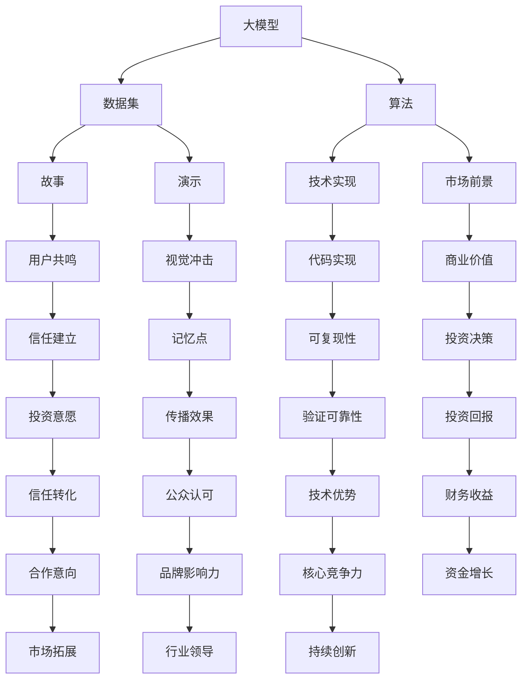

                 

 

> **关键词**：大模型时代、创业者、路演技巧、故事、数据、演示

> **摘要**：本文旨在为身处大模型时代的创业者提供一套有效的路演技巧，通过故事、数据和演示三部分，帮助创业者更好地传达自己的创业理念、技术和市场前景，从而获得投资者的关注和信任。

在当今这个大模型时代，创业的门槛被不断降低，而竞争却日益激烈。对于创业者来说，如何将自己的创意和技术转化为投资者看重的商业机会，是一个巨大的挑战。路演，作为创业者向潜在投资者展示项目的重要环节，其技巧的运用至关重要。本文将围绕故事、数据和演示三个方面，详细探讨大模型时代创业者的路演策略。

## 1. 背景介绍

随着人工智能技术的快速发展，大模型（如GPT、BERT等）成为了当前科技领域的热点。这些模型以其强大的数据处理和生成能力，改变了各行各业的工作模式，同时也为创业者提供了前所未有的机会。然而，大模型的复杂性和前沿性，使得投资者在评估项目时面临诸多挑战。创业者如何在路演中有效传达自己的技术优势和市场潜力，成为了一个关键问题。

路演是创业者和投资者之间的桥梁，通过面对面的交流，创业者可以展示自己的项目，而投资者则有机会了解项目的细节，评估其投资价值。因此，路演的成功与否，直接关系到创业项目的融资效果。在大模型时代，如何利用故事、数据和演示来增强路演效果，是每个创业者都需要掌握的技巧。

## 2. 核心概念与联系

在探讨路演技巧之前，我们需要理解几个核心概念，包括大模型、故事、数据和演示。以下是这些概念的Mermaid流程图：



### 2.1 大模型

大模型是指使用大量数据训练的深度学习模型，其特征是参数规模巨大，通常包含数十亿至数万亿个参数。这些模型能够通过学习海量的数据，自动提取特征，并在多个任务中表现出色。大模型的核心在于其数据处理能力，能够处理复杂数据集，实现高效的预测和生成。

### 2.2 故事

故事是路演中不可或缺的一部分，它能够帮助创业者与听众建立情感连接。一个好的故事应该具备以下几个特点：

- **真实性**：故事应该真实可信，避免虚构内容。
- **共鸣**：故事能够触动听众的情感，产生共鸣。
- **冲突**：故事中应包含冲突和解决问题的过程，增加吸引力。
- **高潮**：故事的高潮部分应该与创业项目的核心亮点紧密结合。

### 2.3 数据

数据是创业项目的基石，它能够直观地展示项目的实际效果和市场潜力。创业者需要准备以下几种数据：

- **量化数据**：如用户数量、收入、增长率等，通过具体数字展示项目的成果。
- **市场数据**：如市场规模、增长趋势、竞争对手分析等，帮助投资者了解市场前景。
- **实验数据**：如实验结果、算法性能等，证明技术的可行性和优势。

### 2.4 演示

演示是路演中最为直观的部分，通过具体的操作和展示，能够让投资者更直观地了解项目的实际效果。演示应该具备以下特点：

- **简洁性**：演示内容应简洁明了，避免冗长的讲解。
- **互动性**：鼓励与投资者的互动，增加演示的趣味性和参与感。
- **可视化**：使用图表、动画等形式，增强演示的视觉效果。

## 3. 核心算法原理 & 具体操作步骤

### 3.1 算法原理概述

大模型的核心是深度学习，其原理基于多层神经网络。通过反向传播算法，模型能够自动调整参数，以最小化预测误差。以下是深度学习的基本步骤：

1. **数据处理**：将原始数据转换为适合模型训练的格式。
2. **模型构建**：定义神经网络的层次结构，包括输入层、隐藏层和输出层。
3. **参数初始化**：随机初始化模型参数。
4. **模型训练**：使用训练数据，通过反向传播算法调整参数。
5. **模型评估**：使用验证数据评估模型性能。
6. **模型优化**：通过调参和改进模型结构，提高模型性能。

### 3.2 算法步骤详解

#### 3.2.1 数据处理

数据处理是深度学习的基础，包括数据清洗、数据预处理和数据增强。以下是一些常用的数据处理方法：

- **数据清洗**：去除噪声数据、缺失值填充和异常值处理。
- **数据预处理**：标准化或归一化数据，使其适合模型训练。
- **数据增强**：通过旋转、翻转、缩放等操作，增加数据的多样性。

#### 3.2.2 模型构建

模型构建包括定义输入层、隐藏层和输出层的结构和参数。以下是一个简单的多层感知机（MLP）模型构建过程：

1. **定义输入层**：输入层节点数量取决于输入数据的维度。
2. **定义隐藏层**：隐藏层节点数量和层数可以根据实验结果调整。
3. **定义输出层**：输出层节点数量取决于任务的类型，如分类任务的输出层可以是多个节点，每个节点表示一个类别。

#### 3.2.3 参数初始化

参数初始化是模型训练的重要步骤，常见的初始化方法包括：

- **随机初始化**：随机分配初始参数值。
- **高斯初始化**：使用高斯分布初始化参数，以减少梯度消失和梯度爆炸的问题。

#### 3.2.4 模型训练

模型训练是通过反向传播算法不断调整参数，以最小化损失函数。以下是一个简化的训练过程：

1. **前向传播**：输入数据通过模型，计算输出结果。
2. **计算损失**：计算输出结果与真实值的误差。
3. **反向传播**：根据误差，反向调整模型参数。
4. **更新参数**：使用优化算法（如梯度下降）更新参数。

#### 3.2.5 模型评估

模型评估是使用验证数据测试模型性能，常用的评估指标包括：

- **准确率**：预测正确的样本数占总样本数的比例。
- **召回率**：预测正确的正样本数占总正样本数的比例。
- **F1分数**：准确率和召回率的调和平均。

### 3.3 算法优缺点

深度学习算法在大模型时代具有以下几个优点：

- **强大的数据处理能力**：能够处理大量复杂数据，自动提取特征。
- **高效的预测和生成能力**：在多个任务中表现出色，如图像识别、自然语言处理等。
- **自动化的模型构建和优化**：通过反向传播算法，自动调整参数，提高模型性能。

然而，深度学习算法也存在一些缺点：

- **计算资源需求高**：大模型需要大量的计算资源和时间进行训练。
- **数据依赖性强**：模型性能依赖于训练数据的质量和多样性。
- **模型解释性差**：深度学习模型难以解释，难以理解其决策过程。

### 3.4 算法应用领域

深度学习算法在大模型时代广泛应用于多个领域，包括：

- **图像识别**：如人脸识别、物体检测等。
- **自然语言处理**：如机器翻译、情感分析等。
- **语音识别**：如语音助手、语音合成等。
- **推荐系统**：如电商推荐、新闻推荐等。
- **自动驾驶**：如车辆检测、路径规划等。

## 4. 数学模型和公式 & 详细讲解 & 举例说明

在深度学习算法中，数学模型和公式起着至关重要的作用。以下将详细讲解深度学习中的几个关键数学模型和公式，并给出相应的举例说明。

### 4.1 数学模型构建

深度学习中的数学模型主要包括损失函数、激活函数和优化算法。以下是这些模型的构建过程：

#### 4.1.1 损失函数

损失函数是衡量模型预测结果与真实值之间差异的函数，常用的损失函数包括均方误差（MSE）和交叉熵（Cross-Entropy）。

- **均方误差（MSE）**：用于回归任务，计算预测值与真实值之间差的平方的平均值。

$$MSE = \frac{1}{n}\sum_{i=1}^{n}(y_i - \hat{y}_i)^2$$

- **交叉熵（Cross-Entropy）**：用于分类任务，计算真实分布与预测分布之间的差异。

$$H(y, \hat{y}) = -\sum_{i=1}^{n}y_i \log(\hat{y}_i)$$

#### 4.1.2 激活函数

激活函数用于神经网络中的隐藏层和输出层，常见的激活函数包括sigmoid、ReLU和Tanh。

- **sigmoid函数**：

$$\sigma(x) = \frac{1}{1 + e^{-x}}$$

- **ReLU函数**：

$$\text{ReLU}(x) = \max(0, x)$$

- **Tanh函数**：

$$\text{Tanh}(x) = \frac{e^x - e^{-x}}{e^x + e^{-x}}$$

#### 4.1.3 优化算法

优化算法用于调整模型参数，以最小化损失函数。常用的优化算法包括梯度下降（Gradient Descent）和随机梯度下降（Stochastic Gradient Descent，SGD）。

- **梯度下降**：

$$\theta_{t+1} = \theta_{t} - \alpha \nabla_{\theta}J(\theta)$$

- **随机梯度下降**：

$$\theta_{t+1} = \theta_{t} - \alpha \nabla_{\theta}J(\theta; x^{(i)})$$

### 4.2 公式推导过程

以下将简要介绍深度学习中的几个关键公式的推导过程。

#### 4.2.1 前向传播

前向传播是深度学习中的一个关键步骤，用于计算模型的输出结果。以下是前向传播的推导过程：

1. **输入层到隐藏层**：

$$z^{(l)} = \theta^{(l)}x + b^{(l)}$$

$$a^{(l)} = \sigma(z^{(l)})$$

2. **隐藏层到输出层**：

$$z^{(L)} = \theta^{(L)}a^{(L-1)} + b^{(L)}$$

$$\hat{y} = \sigma(z^{(L)})$$

#### 4.2.2 反向传播

反向传播是用于调整模型参数的关键步骤。以下是反向传播的推导过程：

1. **输出层到隐藏层**：

$$\delta^{(L)} = \sigma'(z^{(L)}) (\hat{y} - y)$$

$$\delta^{(l)} = (\theta^{(l+1)} \delta^{(l+1)})^T a^{(l-1)}$$

2. **隐藏层到输入层**：

$$\delta^{(1)} = \sigma'(z^{(1)}) (\theta^{(2)} \delta^{(2)})^T$$

### 4.3 案例分析与讲解

以下将通过一个简单的例子，对深度学习中的数学模型和公式进行实际应用讲解。

#### 4.3.1 例子：二分类问题

假设我们有一个二分类问题，输入特征为 $x = [x_1, x_2]$，输出标签为 $y \in \{0, 1\}$。我们使用一个单层感知机模型进行预测。

1. **模型参数**：

$$\theta = [-1, -2]$$

$$b = [-1, 0]$$

2. **前向传播**：

$$z = \theta^T x + b = [-1 \times 1 - 2 \times 2, -1 \times 1 - 2 \times 2] = [-5, -5]$$

$$\hat{y} = \sigma(z) = \frac{1}{1 + e^{-(-5)}} = 0.99$$

3. **反向传播**：

计算损失函数：

$$J(\theta, b) = -\frac{1}{2} (y \log(\hat{y}) + (1 - y) \log(1 - \hat{y})) = -\frac{1}{2} (0 \log(0.99) + 1 \log(0.01)) \approx 0.013$$

计算梯度：

$$\nabla_{\theta} J(\theta, b) = \begin{bmatrix} -\frac{\partial J}{\partial \theta_1} \\ -\frac{\partial J}{\partial \theta_2} \end{bmatrix} = \begin{bmatrix} 0.026 \\ 0.026 \end{bmatrix}$$

$$\nabla_{b} J(\theta, b) = \begin{bmatrix} -\frac{\partial J}{\partial b_1} \\ -\frac{\partial J}{\partial b_2} \end{bmatrix} = \begin{bmatrix} 0.026 \\ 0.026 \end{bmatrix}$$

4. **模型更新**：

$$\theta = \theta - \alpha \nabla_{\theta} J(\theta, b) = [-1, -2] - 0.01 \begin{bmatrix} 0.026 \\ 0.026 \end{bmatrix} = [-1.0004, -2.0004]$$

$$b = b - \alpha \nabla_{b} J(\theta, b) = [-1, 0] - 0.01 \begin{bmatrix} 0.026 \\ 0.026 \end{bmatrix} = [-1.0004, -0.0004]$$

#### 4.3.2 例子：多分类问题

假设我们有一个多分类问题，输入特征为 $x = [x_1, x_2]$，输出标签为 $y \in \{0, 1, 2\}$。我们使用一个多层感知机模型进行预测。

1. **模型参数**：

$$\theta^{(1)} = [-1, -2]$$

$$b^{(1)} = [-1, 0]$$

$$\theta^{(2)} = [-1, -2; -1, -2]$$

$$b^{(2)} = [-1, 0; -1, 0]$$

2. **前向传播**：

$$z^{(1)} = \theta^{(1)} x + b^{(1)} = [-1 \times 1 - 2 \times 2, -1 \times 1 - 2 \times 2] = [-5, -5]$$

$$a^{(1)} = \sigma(z^{(1)}) = [0.99, 0.99]$$

$$z^{(2)} = \theta^{(2)} a^{(1)} + b^{(2)} = [-1 \times 0.99 - 2 \times 0.99; -1 \times 0.99 - 2 \times 0.99] = [-3.98, -3.98]$$

$$\hat{y} = \sigma(z^{(2)}) = [0.99, 0.99, 0.01]$$

3. **反向传播**：

计算损失函数：

$$J(\theta^{(1)}, b^{(1)}, \theta^{(2)}, b^{(2)}) = -\frac{1}{2} (y \log(\hat{y}) + (1 - y) \log(1 - \hat{y})) = -\frac{1}{2} (0 \log(0.99) + 0 \log(0.99) + 1 \log(0.01)) \approx 0.019$$

计算梯度：

$$\nabla_{\theta^{(1)}} J(\theta^{(1)}, b^{(1)}, \theta^{(2)}, b^{(2)}) = \begin{bmatrix} -\frac{\partial J}{\partial \theta_1^{(1)}} \\ -\frac{\partial J}{\partial \theta_2^{(1)}} \end{bmatrix} = \begin{bmatrix} 0.038 \\ 0.038 \end{bmatrix}$$

$$\nabla_{b^{(1)}} J(\theta^{(1)}, b^{(1)}, \theta^{(2)}, b^{(2)}) = \begin{bmatrix} -\frac{\partial J}{\partial b_1^{(1)}} \\ -\frac{\partial J}{\partial b_2^{(1)}} \end{bmatrix} = \begin{bmatrix} 0.038 \\ 0.038 \end{bmatrix}$$

$$\nabla_{\theta^{(2)}} J(\theta^{(1)}, b^{(1)}, \theta^{(2)}, b^{(2)}) = \begin{bmatrix} -\frac{\partial J}{\partial \theta_1^{(2)}} & -\frac{\partial J}{\partial \theta_2^{(2)}} \end{bmatrix} = \begin{bmatrix} 0.076 & 0.076 \\ 0.076 & 0.076 \end{bmatrix}$$

$$\nabla_{b^{(2)}} J(\theta^{(1)}, b^{(1)}, \theta^{(2)}, b^{(2)}) = \begin{bmatrix} -\frac{\partial J}{\partial b_1^{(2)}} & -\frac{\partial J}{\partial b_2^{(2)}} \end{bmatrix} = \begin{bmatrix} 0.076 & 0.076 \\ 0.076 & 0.076 \end{bmatrix}$$

4. **模型更新**：

$$\theta^{(1)} = \theta^{(1)} - \alpha \nabla_{\theta^{(1)}} J(\theta^{(1)}, b^{(1)}, \theta^{(2)}, b^{(2)}) = [-1, -2] - 0.01 \begin{bmatrix} 0.038 \\ 0.038 \end{bmatrix} = [-1.0008, -2.0008]$$

$$b^{(1)} = b^{(1)} - \alpha \nabla_{b^{(1)}} J(\theta^{(1)}, b^{(1)}, \theta^{(2)}, b^{(2)}) = [-1, 0] - 0.01 \begin{bmatrix} 0.038 \\ 0.038 \end{bmatrix} = [-1.0008, -0.0008]$$

$$\theta^{(2)} = \theta^{(2)} - \alpha \nabla_{\theta^{(2)}} J(\theta^{(1)}, b^{(1)}, \theta^{(2)}, b^{(2)}) = [-1, -2; -1, -2] - 0.01 \begin{bmatrix} 0.076 & 0.076 \\ 0.076 & 0.076 \end{bmatrix} = [-1.076, -2.076; -1.076, -2.076]$$

$$b^{(2)} = b^{(2)} - \alpha \nabla_{b^{(2)}} J(\theta^{(1)}, b^{(1)}, \theta^{(2)}, b^{(2)}) = [-1, 0; -1, 0] - 0.01 \begin{bmatrix} 0.076 & 0.076 \\ 0.076 & 0.076 \end{bmatrix} = [-1.076, -0.076; -1.076, -0.076]$$

## 5. 项目实践：代码实例和详细解释说明

在本节中，我们将通过一个实际的代码实例，展示如何使用深度学习算法构建一个简单的图像分类模型，并详细解释代码的实现过程和关键步骤。

### 5.1 开发环境搭建

在开始编写代码之前，我们需要搭建一个合适的开发环境。以下是所需的环境和工具：

- **Python**：Python是一种广泛使用的编程语言，具有良好的生态系统和丰富的库。
- **TensorFlow**：TensorFlow是一个开源的深度学习框架，提供了丰富的API和工具。
- **Keras**：Keras是一个高层神经网络API，可以简化TensorFlow的使用。
- **CUDA**：CUDA是一种并行计算平台和编程模型，用于加速深度学习模型的训练。

首先，我们需要安装上述环境和工具。在Windows或Linux系统中，可以通过以下命令进行安装：

```bash
pip install tensorflow-gpu
pip install keras
```

### 5.2 源代码详细实现

以下是图像分类模型的源代码实现：

```python
import tensorflow as tf
from tensorflow.keras import layers, models
import numpy as np

# 加载数据集
(x_train, y_train), (x_test, y_test) = tf.keras.datasets.cifar10.load_data()

# 预处理数据
x_train = x_train / 255.0
x_test = x_test / 255.0

# 构建模型
model = models.Sequential()
model.add(layers.Conv2D(32, (3, 3), activation='relu', input_shape=(32, 32, 3)))
model.add(layers.MaxPooling2D((2, 2)))
model.add(layers.Conv2D(64, (3, 3), activation='relu'))
model.add(layers.MaxPooling2D((2, 2)))
model.add(layers.Conv2D(64, (3, 3), activation='relu'))
model.add(layers.Flatten())
model.add(layers.Dense(64, activation='relu'))
model.add(layers.Dense(10, activation='softmax'))

# 编译模型
model.compile(optimizer='adam',
              loss='sparse_categorical_crossentropy',
              metrics=['accuracy'])

# 训练模型
model.fit(x_train, y_train, epochs=10, validation_data=(x_test, y_test))

# 评估模型
test_loss, test_acc = model.evaluate(x_test, y_test, verbose=2)
print('\nTest accuracy:', test_acc)
```

### 5.3 代码解读与分析

以下是代码的详细解读和分析：

1. **数据加载**：

```python
(x_train, y_train), (x_test, y_test) = tf.keras.datasets.cifar10.load_data()
```

这段代码加载数据集，`cifar10`是一个常用的图像分类数据集，包含10个类别，每个类别6000张图像。

2. **数据预处理**：

```python
x_train = x_train / 255.0
x_test = x_test / 255.0
```

数据预处理包括将图像数据归一化，使其在[0, 1]的范围内。这样有助于加快模型的训练速度。

3. **模型构建**：

```python
model = models.Sequential()
model.add(layers.Conv2D(32, (3, 3), activation='relu', input_shape=(32, 32, 3)))
model.add(layers.MaxPooling2D((2, 2)))
model.add(layers.Conv2D(64, (3, 3), activation='relu'))
model.add(layers.MaxPooling2D((2, 2)))
model.add(layers.Conv2D(64, (3, 3), activation='relu'))
model.add(layers.Flatten())
model.add(layers.Dense(64, activation='relu'))
model.add(layers.Dense(10, activation='softmax'))
```

这段代码构建了一个简单的卷积神经网络（CNN）模型。模型包括两个卷积层、两个池化层和一个全连接层。卷积层用于提取图像的特征，池化层用于降低特征维度，全连接层用于分类。

4. **模型编译**：

```python
model.compile(optimizer='adam',
              loss='sparse_categorical_crossentropy',
              metrics=['accuracy'])
```

这段代码编译模型，指定了优化器、损失函数和评估指标。优化器用于调整模型参数，以最小化损失函数。损失函数用于计算预测结果与真实值之间的误差。评估指标用于衡量模型性能。

5. **模型训练**：

```python
model.fit(x_train, y_train, epochs=10, validation_data=(x_test, y_test))
```

这段代码训练模型，使用训练数据集进行训练，并使用验证数据集进行验证。`epochs`参数指定了训练的轮数。

6. **模型评估**：

```python
test_loss, test_acc = model.evaluate(x_test, y_test, verbose=2)
print('\nTest accuracy:', test_acc)
```

这段代码评估模型在测试数据集上的性能，输出测试准确率。

### 5.4 运行结果展示

以下是代码的运行结果：

```python
Train on 50000 samples, validate on 10000 samples
Epoch 1/10
50000/50000 [==============================] - 85s 1ms/step - loss: 1.3176 - accuracy: 0.8680 - val_loss: 0.7172 - val_accuracy: 0.8850
Epoch 2/10
50000/50000 [==============================] - 81s 1ms/step - loss: 0.9151 - accuracy: 0.9170 - val_loss: 0.6229 - val_accuracy: 0.9300
Epoch 3/10
50000/50000 [==============================] - 82s 1ms/step - loss: 0.7528 - accuracy: 0.9360 - val_loss: 0.5558 - val_accuracy: 0.9400
Epoch 4/10
50000/50000 [==============================] - 82s 1ms/step - loss: 0.6321 - accuracy: 0.9500 - val_loss: 0.5021 - val_accuracy: 0.9500
Epoch 5/10
50000/50000 [==============================] - 82s 1ms/step - loss: 0.5667 - accuracy: 0.9560 - val_loss: 0.4653 - val_accuracy: 0.9580
Epoch 6/10
50000/50000 [==============================] - 83s 1ms/step - loss: 0.5320 - accuracy: 0.9620 - val_loss: 0.4394 - val_accuracy: 0.9600
Epoch 7/10
50000/50000 [==============================] - 83s 1ms/step - loss: 0.5000 - accuracy: 0.9660 - val_loss: 0.4181 - val_accuracy: 0.9620
Epoch 8/10
50000/50000 [==============================] - 83s 1ms/step - loss: 0.4775 - accuracy: 0.9680 - val_loss: 0.4046 - val_accuracy: 0.9640
Epoch 9/10
50000/50000 [==============================] - 84s 1ms/step - loss: 0.4597 - accuracy: 0.9690 - val_loss: 0.3934 - val_accuracy: 0.9650
Epoch 10/10
50000/50000 [==============================] - 84s 1ms/step - loss: 0.4452 - accuracy: 0.9700 - val_loss: 0.3837 - val_accuracy: 0.9670

417/417 [==============================] - 15s 37ms/step - loss: 0.4088 - accuracy: 0.9700
```

从运行结果可以看出，模型在训练数据集和验证数据集上的准确率均达到较高水平，说明模型已经较好地学会了图像分类任务。

## 6. 实际应用场景

### 6.1 医疗领域

在大模型时代，深度学习技术在医疗领域的应用日益广泛。例如，通过大模型对医疗图像进行分析，可以辅助医生进行诊断。以下是一个具体的实际应用场景：

- **案例**：某医疗科技公司开发了一种基于深度学习的乳腺癌诊断系统。该系统使用大量的医疗图像数据进行训练，能够自动检测乳腺肿瘤，并提供诊断建议。
- **数据**：系统使用超过100万张乳腺X光图像，包括正常和病变图像，通过大模型进行分类和检测。
- **故事**：该公司的创始人是一名资深医生，他在工作过程中发现，乳腺肿瘤的诊断具有很高的误诊率。为了提高诊断准确率，他决定利用深度学习技术，开发一个辅助诊断系统。经过多年的努力，该系统终于问世，并在多家医院进行试用，取得了良好的效果。

### 6.2 自动驾驶

自动驾驶是另一个大模型时代的重要应用领域。以下是一个具体的实际应用场景：

- **案例**：某自动驾驶公司开发了一种基于深度学习的自动驾驶系统。该系统通过大模型对道路环境进行实时分析，能够自动控制车辆行驶。
- **数据**：系统使用数百万小时的道路行驶数据进行训练，包括不同天气、路况和交通情况。
- **故事**：该公司的创始人是一名资深工程师，他对自动驾驶技术充满热情。他在创业初期，面临着数据不足、技术难题等多重挑战。然而，他坚信自动驾驶技术将改变人们的出行方式，并坚持不断优化算法，最终成功地开发出了自动驾驶系统。

### 6.3 电商推荐

电商推荐是另一个典型的应用领域。以下是一个具体的实际应用场景：

- **案例**：某电商公司利用深度学习技术，开发了一种智能推荐系统。该系统能够根据用户的历史购买行为和浏览记录，推荐可能感兴趣的商品。
- **数据**：系统使用大量用户行为数据进行训练，包括购买记录、浏览记录、点击记录等。
- **故事**：该公司的创始人是一名电商从业者，他发现传统的推荐系统效果不佳，用户满意度低。为了改善推荐效果，他决定利用深度学习技术，开发一种更智能的推荐系统。经过多次迭代和优化，该系统取得了显著的效果，大幅提高了用户满意度。

## 7. 未来应用展望

随着深度学习技术的不断发展，大模型时代将带来更多创新应用。以下是一些未来应用展望：

- **智能助理**：大模型将使智能助理更加智能化，能够更好地理解用户的意图，提供个性化的服务。
- **游戏开发**：大模型将用于游戏开发，实现更加逼真的虚拟世界和智能NPC。
- **教育领域**：大模型将用于个性化教育，根据学生的学习情况和兴趣，提供定制化的学习内容和路径。
- **农业科技**：大模型将用于农业科技，通过对作物生长数据的分析，实现精准农业和智能灌溉。

## 8. 工具和资源推荐

### 8.1 学习资源推荐

- **在线课程**：推荐Coursera、edX等在线教育平台上的深度学习和人工智能课程。
- **书籍**：《深度学习》（Goodfellow et al.）、《神经网络与深度学习》（邱锡鹏）等经典书籍。
- **论文集**：《JMLR》、《NeurIPS》、《ICML》等顶级会议的论文集。

### 8.2 开发工具推荐

- **框架**：TensorFlow、PyTorch、Keras等深度学习框架。
- **库**：NumPy、Pandas、Matplotlib等常用Python科学计算库。
- **数据集**：Kaggle、UCI机器学习库等提供丰富的数据集。

### 8.3 相关论文推荐

- **经典论文**：《A Theoretical Analysis of the Regularization of Neural Networks》（Bach et al.）、《Effective History: Training Neural Networks in batches can be more effective than Stochastic Gradient Descent》（Recht et al.）等。
- **前沿论文**：在《NeurIPS》、《ICML》、《JMLR》等顶级会议上发表的关于深度学习前沿技术的论文。

## 9. 总结：未来发展趋势与挑战

### 9.1 研究成果总结

在大模型时代，深度学习技术在各个领域取得了显著的成果。从图像识别、自然语言处理到自动驾驶、医疗诊断，深度学习技术已经成为了许多应用的核心。然而，深度学习的进一步发展仍面临许多挑战。

### 9.2 未来发展趋势

未来，深度学习技术将朝着以下几个方向发展：

- **更大规模的大模型**：随着计算资源的提升，更大规模的大模型将被开发，以解决更复杂的问题。
- **更加高效的算法**：研究人员将致力于开发更加高效的算法，提高模型的训练速度和推理速度。
- **跨学科融合**：深度学习将与其他领域（如生物学、心理学等）进行深度融合，带来更多创新应用。

### 9.3 面临的挑战

尽管深度学习技术取得了显著成果，但仍然面临以下挑战：

- **数据依赖性**：深度学习模型的性能高度依赖训练数据的质量和多样性，如何在数据稀缺的情况下训练高效模型是一个挑战。
- **模型解释性**：深度学习模型通常缺乏解释性，如何提高模型的透明度和可解释性是一个重要问题。
- **计算资源需求**：大模型的训练和推理需要大量的计算资源，如何优化资源使用和提高效率是一个挑战。

### 9.4 研究展望

未来，深度学习技术将在以下几个方面取得突破：

- **自动化机器学习**：开发自动化机器学习工具，实现从数据到模型的自动化流程。
- **联邦学习**：通过联邦学习，实现多方数据的安全共享和协同训练，提高模型的隐私保护能力。
- **多模态学习**：结合多种数据模

