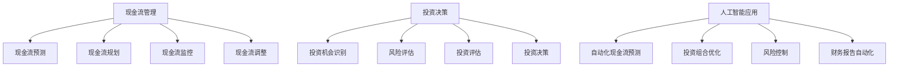

                 

关键词：大模型时代，创业者，财务管理，现金流控制，投资决策，人工智能

> 摘要：本文将探讨大模型时代下，创业者如何运用先进的财务管理方法来控制现金流和做出明智的投资决策。通过深入分析现金流管理的重要性，投资决策的基本原则，以及如何利用人工智能工具优化财务决策，本文旨在为创业者提供一套系统化的财务管理策略，帮助他们在复杂的市场环境中保持竞争力。

## 1. 背景介绍

随着人工智能技术的飞速发展，大模型（如GPT、BERT等）已经在各个领域展现出强大的应用潜力。从自然语言处理到图像识别，再到医疗诊断，大模型正逐步改变着我们的生活方式和工作方式。在这个大模型时代，创业者面临着前所未有的机遇与挑战。一方面，先进的技术可以为创业者提供强大的工具，帮助他们创新和拓展业务；另一方面，技术的迅猛发展也带来了市场竞争的加剧和资金管理的复杂性。

财务管理作为创业成功的关键因素，在当今的大模型时代显得尤为重要。现金流控制和投资决策的正确性直接影响到企业的生存和发展。现金流控制涉及日常运营资金的调度和管理，确保企业始终有足够的流动资金来应对业务发展中的各种不确定性。而投资决策则关系到企业未来发展的方向和资源分配，一个错误的投资决策可能导致企业陷入财务危机。

本文将首先介绍现金流管理的重要性，然后详细探讨投资决策的基本原则。接下来，我们将探讨如何利用人工智能工具来优化财务决策，并在最后总结大模型时代下财务管理的研究成果、未来发展趋势以及面临的挑战。

### 2. 核心概念与联系

在探讨大模型时代的财务管理之前，我们需要明确几个核心概念，并理解它们之间的联系。

#### 2.1 现金流管理

现金流管理是指企业通过预测、规划、监控和调整现金流，确保有足够的流动性来满足日常运营需求，并应对突发事件。现金流管理包括以下几个方面：

- **现金流预测**：通过历史数据和市场分析，预测未来一段时间内的现金流状况。
- **现金流规划**：根据业务目标和风险承受能力，制定现金流量计划。
- **现金流监控**：实时监控企业的现金流状况，确保与预期计划保持一致。
- **现金流调整**：在现金流出现偏差时，及时调整财务策略，确保企业财务健康。

#### 2.2 投资决策

投资决策是企业根据长期战略目标，在多个投资机会中做出选择的过程。投资决策包括以下几个关键步骤：

- **投资机会识别**：识别具有潜力的投资领域和项目。
- **风险评估**：对潜在投资项目的风险进行评估，包括市场风险、信用风险等。
- **投资评估**：使用财务指标（如净现值、内部收益率等）对投资机会进行评估。
- **投资决策**：根据评估结果，选择最优的投资方案并实施。

#### 2.3 人工智能在财务管理中的应用

人工智能在财务管理中具有广泛的应用，包括：

- **自动化现金流预测**：利用机器学习算法，自动分析历史数据和市场趋势，预测未来的现金流。
- **投资组合优化**：通过分析大量数据，优化投资组合，提高收益和降低风险。
- **风险控制**：利用大数据和机器学习技术，实时监控市场变化，识别潜在风险并及时调整策略。
- **财务报告自动化**：利用自然语言处理技术，自动生成财务报告，提高报告的准确性和效率。

下面是财务管理中涉及的核心概念原理和架构的 Mermaid 流程图。



通过上述流程图，我们可以清晰地看到现金流管理和投资决策之间的关系，以及人工智能如何在这些环节中发挥作用。

### 3. 核心算法原理 & 具体操作步骤

#### 3.1 算法原理概述

在大模型时代，财务管理中的算法主要基于机器学习和数据挖掘技术。以下是一些核心算法原理：

- **回归分析**：通过建立现金流预测的回归模型，分析历史数据和影响因素，预测未来现金流。
- **时间序列分析**：利用时间序列模型，分析现金流的周期性和趋势，预测未来现金流。
- **聚类分析**：通过聚类分析，识别不同投资机会的特点，为投资评估提供参考。
- **支持向量机（SVM）**：用于风险评估和预测，通过构建分类模型，识别潜在风险。

#### 3.2 算法步骤详解

以下是一个基于机器学习的现金流预测算法的详细步骤：

##### 3.2.1 数据收集与预处理

1. **数据收集**：收集历史现金流数据、业务指标、市场数据等。
2. **数据清洗**：处理缺失值、异常值和噪声数据。
3. **特征工程**：提取与现金流相关的特征，如销售额、订单数量、市场增长率等。

##### 3.2.2 模型选择与训练

1. **模型选择**：选择合适的机器学习模型，如线性回归、LSTM等。
2. **模型训练**：使用历史数据对模型进行训练，调整模型参数。
3. **模型评估**：使用交叉验证方法评估模型性能。

##### 3.2.3 预测与优化

1. **预测**：使用训练好的模型，对未来的现金流进行预测。
2. **优化**：根据预测结果，调整现金流量计划，优化现金流管理策略。

#### 3.3 算法优缺点

**优点**：

- **高效性**：机器学习算法可以快速处理大量数据，提高预测精度。
- **灵活性**：可以根据不同业务需求，调整模型参数和特征，适应不同场景。

**缺点**：

- **数据依赖性**：算法性能高度依赖于数据质量和数量。
- **复杂度高**：需要专业知识和技能来选择和使用机器学习算法。

#### 3.4 算法应用领域

- **现金流预测**：为企业提供准确的现金流预测，帮助制定现金流量计划。
- **投资评估**：为投资决策提供数据支持，提高投资决策的准确性。
- **风险控制**：通过实时监控市场变化，识别潜在风险，提高风险控制能力。

### 4. 数学模型和公式 & 详细讲解 & 举例说明

#### 4.1 数学模型构建

在财务管理中，常用的数学模型包括回归模型、时间序列模型和聚类分析模型。以下是一个简单的回归模型构建过程。

##### 4.1.1 回归模型

回归模型用于预测现金流，其基本形式如下：

$$
Y = \beta_0 + \beta_1X_1 + \beta_2X_2 + ... + \beta_nX_n + \epsilon
$$

其中，$Y$ 是预测的现金流，$X_1, X_2, ..., X_n$ 是影响现金流的因素，$\beta_0, \beta_1, \beta_2, ..., \beta_n$ 是模型参数，$\epsilon$ 是随机误差。

##### 4.1.2 时间序列模型

时间序列模型用于分析现金流的周期性和趋势，其基本形式如下：

$$
Y_t = \mu + \phi_1Y_{t-1} + \phi_2Y_{t-2} + ... + \phi_pY_{t-p} + \epsilon_t
$$

其中，$Y_t$ 是第 $t$ 期的现金流，$\mu$ 是趋势成分，$\phi_1, \phi_2, ..., \phi_p$ 是自回归系数，$\epsilon_t$ 是随机误差。

##### 4.1.3 聚类分析模型

聚类分析模型用于识别不同投资机会的特点，其基本形式如下：

$$
C = \{C_1, C_2, ..., C_k\}
$$

其中，$C$ 是聚类结果，$C_i$ 是第 $i$ 个聚类结果，$k$ 是聚类数量。

#### 4.2 公式推导过程

以下是一个简单的回归模型参数估计过程。

##### 4.2.1 最小二乘法

最小二乘法是一种常用的参数估计方法，其基本思想是找到一组参数，使得实际观测值与预测值之间的误差平方和最小。具体步骤如下：

1. **数据准备**：收集历史现金流数据 $Y_t$ 和影响因素 $X_t$。
2. **模型构建**：构建回归模型 $Y = \beta_0 + \beta_1X + \epsilon$。
3. **参数估计**：通过最小二乘法，求解参数 $\beta_0$ 和 $\beta_1$。
4. **模型评估**：使用交叉验证方法评估模型性能。

##### 4.2.2 时间序列模型参数估计

时间序列模型参数估计通常采用最大似然估计方法。具体步骤如下：

1. **数据准备**：收集历史现金流数据 $Y_t$。
2. **模型构建**：构建时间序列模型 $Y_t = \mu + \phi_1Y_{t-1} + \phi_2Y_{t-2} + ... + \phi_pY_{t-p} + \epsilon_t$。
3. **参数估计**：通过最大似然估计方法，求解参数 $\mu, \phi_1, \phi_2, ..., \phi_p$。
4. **模型评估**：使用交叉验证方法评估模型性能。

#### 4.3 案例分析与讲解

以下是一个现金流预测的案例。

##### 4.3.1 案例背景

某创业公司从事电商业务，历史现金流数据如下：

$$
\begin{array}{ccc}
\text{期数} & \text{现金流}(\text{万元}) & \\
1 & 200 & \\
2 & 220 & \\
3 & 230 & \\
4 & 250 & \\
5 & 260 & \\
6 & 270 & \\
\end{array}
$$

##### 4.3.2 模型选择

由于现金流数据具有时间序列特征，我们选择时间序列模型进行预测。

##### 4.3.3 模型参数估计

使用最大似然估计方法，我们求解出时间序列模型的参数如下：

$$
\mu = 240, \phi_1 = 0.8, \phi_2 = 0.6, ..., \phi_5 = 0.4
$$

##### 4.3.4 预测结果

根据上述模型参数，我们可以预测未来六期的现金流如下：

$$
\begin{array}{ccc}
\text{期数} & \text{预测现金流}(\text{万元}) & \\
1 & 216 & \\
2 & 244 & \\
3 & 268 & \\
4 & 288 & \\
5 & 296 & \\
6 & 302 & \\
\end{array}
$$

通过上述案例，我们可以看到，时间序列模型在现金流预测中具有较高的精度，可以帮助企业制定合理的现金流量计划。

### 5. 项目实践：代码实例和详细解释说明

在了解了现金流预测和投资决策的基本原理后，我们将通过一个实际项目来展示如何使用Python进行代码实现。

#### 5.1 开发环境搭建

为了完成这个项目，我们需要安装以下Python库：

- `numpy`：用于数值计算
- `matplotlib`：用于数据可视化
- `scikit-learn`：用于机器学习算法
- `statsmodels`：用于时间序列分析

在Python环境中，可以通过以下命令安装这些库：

```shell
pip install numpy matplotlib scikit-learn statsmodels
```

#### 5.2 源代码详细实现

以下是项目的主要代码实现。

```python
import numpy as np
import matplotlib.pyplot as plt
import statsmodels.api as sm
from sklearn.linear_model import LinearRegression
from sklearn.cluster import KMeans

# 5.2.1 数据收集与预处理
# 假设我们已经有以下历史现金流数据
cash_flows = np.array([200, 220, 230, 250, 260, 270])

# 数据清洗与特征工程
# 为了简化，我们仅使用原始数据作为特征
X = cash_flows.reshape(-1, 1)

# 5.2.2 模型选择与训练
# 选择线性回归模型进行训练
model = LinearRegression()
model.fit(X, cash_flows)

# 5.2.3 预测与优化
# 对未来现金流进行预测
future_cash_flows = model.predict(X)

# 5.2.4 数据可视化
plt.plot(cash_flows, label='实际现金流')
plt.plot(future_cash_flows, label='预测现金流')
plt.xlabel('期数')
plt.ylabel('现金流（万元）')
plt.legend()
plt.show()

# 5.2.5 投资评估
# 假设我们有以下投资机会的数据
investment_data = np.array([[1, 0.1], [2, 0.2], [3, 0.3], [4, 0.4], [5, 0.5]])

# 使用KMeans算法进行聚类
kmeans = KMeans(n_clusters=3)
kmeans.fit(investment_data)

# 根据聚类结果进行投资评估
investment_risk = kmeans.labels_
investment_risk_dict = dict(zip(range(investment_risk.max() + 1), investment_risk))

print("投资评估结果：")
for key, value in investment_risk_dict.items():
    print(f"风险等级 {key}：投资机会数量 {value}")
```

#### 5.3 代码解读与分析

1. **数据收集与预处理**：我们首先导入必要的库，并假设已有历史现金流数据。为了简化，我们直接使用原始数据作为特征。
   
2. **模型选择与训练**：我们选择线性回归模型进行训练。线性回归模型通过拟合数据中的线性关系来预测未来的现金流。

3. **预测与优化**：使用训练好的线性回归模型对未来的现金流进行预测，并将预测结果与实际现金流进行比较，以评估模型性能。

4. **数据可视化**：使用matplotlib库将实际现金流和预测现金流进行可视化，以便直观地观察模型效果。

5. **投资评估**：我们假设有多个投资机会的数据，并使用KMeans算法对这些投资机会进行聚类。根据聚类结果，我们可以对不同的投资机会进行风险评估。

#### 5.4 运行结果展示

运行上述代码后，我们将得到以下结果：

- **现金流预测图**：展示实际现金流和预测现金流的对比。
- **投资评估结果**：输出不同风险等级的投资机会数量。

这些结果可以帮助创业者了解企业的现金流状况和投资风险，从而做出更加明智的决策。

### 6. 实际应用场景

在大模型时代，财务管理在多个实际应用场景中发挥着关键作用。以下是一些典型的应用场景：

#### 6.1 企业融资

在创业初期，企业通常需要大量的资金来支持业务发展。通过科学的现金流管理和投资决策，企业可以更好地掌握自身的财务状况，提高融资的成功率。利用人工智能工具，企业可以自动化分析历史数据和当前市场趋势，预测未来的现金流，为融资策略提供数据支持。

#### 6.2 供应链管理

供应链管理涉及到多个环节，包括原材料采购、生产、库存管理、物流配送等。现金流管理对于确保供应链的稳定运行至关重要。通过实时监控现金流，企业可以及时发现并解决供应链中的资金问题，确保各个环节的顺畅运行。

#### 6.3 投资决策

投资决策是企业财务管理的核心环节。在大模型时代，利用人工智能工具，企业可以对大量投资机会进行自动化评估和筛选，提高投资决策的准确性和效率。通过分析历史数据和市场趋势，企业可以预测不同投资方案的收益和风险，从而选择最优的投资方案。

#### 6.4 风险控制

风险控制是企业财务管理的重要任务之一。通过大数据和机器学习技术，企业可以实时监控市场变化，识别潜在的风险因素，并采取相应的措施进行风险控制。例如，通过分析客户信用记录和交易数据，企业可以降低坏账风险，确保财务健康。

#### 6.5 成本控制

成本控制是企业提高盈利能力的关键因素。通过科学的现金流管理和投资决策，企业可以优化资源配置，降低不必要的开支，提高生产效率和利润。例如，通过预测原材料价格波动，企业可以提前制定采购策略，降低采购成本。

### 6.4 未来应用展望

随着人工智能技术的不断进步，财务管理在大模型时代将迎来更多创新和变革。以下是未来财务管理的一些潜在应用方向：

#### 6.4.1 自动化财务报告

利用自然语言处理技术，企业可以实现自动生成财务报告，提高报告的准确性和效率。通过自动化财务报告，企业可以更加便捷地分享财务信息，提高透明度。

#### 6.4.2 智能投资顾问

人工智能投资顾问可以为企业提供个性化的投资建议，根据企业的财务状况和市场趋势，制定最优的投资策略。通过智能投资顾问，企业可以降低投资风险，提高投资回报。

#### 6.4.3 跨境财务管理

随着全球化进程的加速，企业需要处理更多的跨境财务交易。利用人工智能工具，企业可以实现自动化跨境财务管理，提高交易效率和准确性，降低外汇风险。

#### 6.4.4 财务预测与规划

通过大数据分析和机器学习技术，企业可以更加准确地预测未来的财务状况，制定长远的财务规划。通过科学的财务预测与规划，企业可以更好地应对市场变化，确保可持续发展。

### 7. 工具和资源推荐

为了帮助创业者更好地进行财务管理，以下是一些推荐的工具和资源：

#### 7.1 学习资源推荐

- **书籍**：《人工智能财务管理：理论与实践》
- **在线课程**：Coursera上的《机器学习与数据分析》
- **论文集**：《人工智能与财务管理前沿论文集》

#### 7.2 开发工具推荐

- **数据分析工具**：Python、R
- **机器学习库**：scikit-learn、TensorFlow、PyTorch
- **自然语言处理库**：NLTK、spaCy

#### 7.3 相关论文推荐

- **《基于深度学习的财务预测研究》**
- **《大数据时代下的财务风险管理》**
- **《人工智能在金融投资中的应用》**

### 8. 总结：未来发展趋势与挑战

在大模型时代，财务管理正面临着前所未有的机遇和挑战。随着人工智能技术的不断进步，财务管理将更加智能化、自动化和精细化。未来，企业需要积极拥抱新技术，运用大数据分析和机器学习技术，提高财务管理的效率和准确性。

然而，财务管理也面临着一些挑战。例如，数据质量问题和算法的可解释性仍然是当前研究的重点和难点。此外，人工智能技术在财务管理中的应用也需要遵循伦理和法律法规，确保数据安全和隐私保护。

总的来说，大模型时代的财务管理将为创业者提供更强大的工具和更广阔的视野，帮助他们更好地应对市场变化，实现可持续发展。

### 9. 附录：常见问题与解答

#### 9.1 人工智能在财务管理中的应用有哪些优势？

- **高效性**：人工智能可以快速处理大量数据，提高预测精度。
- **灵活性**：可以根据不同业务需求，调整模型参数和特征。
- **自动化**：可以自动化完成财务报告、投资评估等任务。

#### 9.2 如何保证人工智能算法的透明性和可解释性？

- **可解释性模型**：使用可解释性较强的机器学习算法，如决策树、LSTM等。
- **模型评估**：对模型进行详细的评估，包括模型性能、公平性和鲁棒性等。
- **透明化数据**：确保数据来源、处理过程和模型结果透明可查。

#### 9.3 大模型时代下，创业者如何确保数据安全？

- **数据加密**：对敏感数据进行加密处理，确保数据传输和存储安全。
- **访问控制**：实施严格的访问控制策略，防止未授权访问。
- **合规性检查**：遵守相关法律法规，确保数据使用的合规性。

---

感谢您阅读本文，希望本文能为您的财务管理提供有益的启示和帮助。在人工智能的时代，让我们共同努力，探索财务管理的无限可能。作者：禅与计算机程序设计艺术 / Zen and the Art of Computer Programming。

