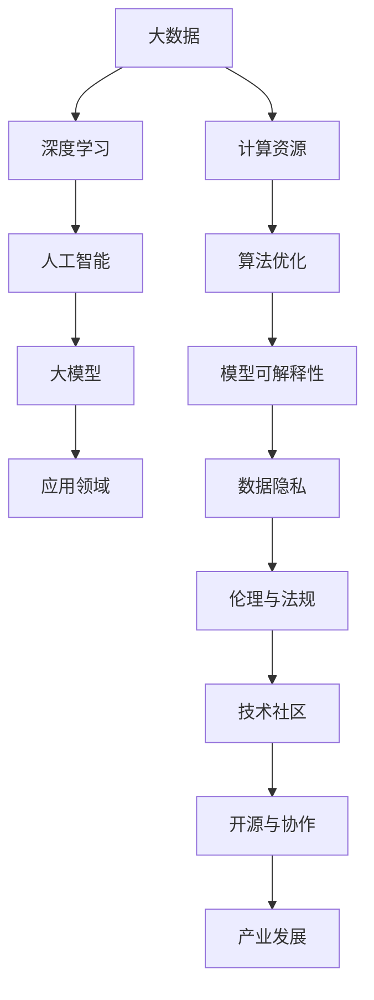

                 

关键词：大模型、人工智能、生态构建、技术发展、创新驱动

摘要：随着人工智能技术的飞速发展，大模型逐渐成为新一代技术潮流的核心。本文将探讨大模型时代的创新生态构建，从背景介绍、核心概念与联系、核心算法原理、数学模型和公式、项目实践、实际应用场景、工具和资源推荐以及未来发展趋势与挑战等方面进行全面剖析，旨在为读者提供对大模型时代的深刻理解。

## 1. 背景介绍

### 1.1 大模型的发展历程

大模型（Large Models）是指在深度学习和人工智能领域中，拥有极大规模参数的网络模型。它们通过处理海量数据来实现对复杂任务的高效学习。自2012年AlexNet的突破以来，深度学习技术经历了飞速的发展，而大模型的兴起无疑是其中的重要里程碑。

从早期的浅层模型到如今的大型预训练模型，如GPT、BERT等，大模型在自然语言处理、计算机视觉、语音识别等领域取得了显著的成果。大模型的出现，不仅提升了算法的性能，更为人工智能的应用开辟了新的可能性。

### 1.2 大模型的影响

大模型的出现，不仅改变了人工智能研究的范式，还对整个社会产生了深远的影响。首先，大模型大幅提高了人工智能任务的准确性和效率，使得许多原本难以解决的复杂问题得以解决。其次，大模型的应用推动了人工智能与各行各业的深度融合，为产业升级和创新发展提供了强大的技术支持。

然而，大模型的发展也面临诸多挑战，如计算资源的高需求、数据隐私和安全问题、算法的透明性和可解释性等。这些问题需要我们深入思考，并采取有效措施加以解决。

## 2. 核心概念与联系

为了更好地理解大模型时代的创新生态构建，我们需要了解一些核心概念和它们之间的联系。以下是一个简化的 Mermaid 流程图，展示了这些概念及其相互关系：



### 2.1 大数据

大数据是指规模巨大、类型繁多、价值密度低的数据集。大数据技术通过分布式计算和处理，帮助我们从海量数据中提取有价值的信息。

### 2.2 深度学习

深度学习是一种基于多层神经网络的学习方法，能够自动从数据中提取特征，并在各种复杂任务中取得出色的表现。

### 2.3 人工智能

人工智能是指计算机系统模拟、延伸和扩展人类智能的过程，包括感知、学习、推理、决策等方面。

### 2.4 大模型

大模型是指在深度学习和人工智能领域中，拥有极大规模参数的网络模型。大模型通过处理海量数据来实现对复杂任务的高效学习。

### 2.5 应用领域

大模型的应用范围广泛，包括自然语言处理、计算机视觉、语音识别、医疗诊断、金融风控等。

### 2.6 计算资源

计算资源是指用于大模型训练和推理的硬件设施和软件工具，如GPU、TPU、分布式计算框架等。

### 2.7 算法优化

算法优化是指通过改进算法设计、优化数据结构、提升计算效率等方式，提高大模型的学习效果和应用性能。

### 2.8 模型可解释性

模型可解释性是指通过分析大模型内部结构和运行机制，使其结果易于理解，有助于提高模型的信任度和应用价值。

### 2.9 数据隐私

数据隐私是指保护用户数据不被非法获取、滥用和泄露，确保大模型应用的安全和合规性。

### 2.10 伦理与法规

伦理与法规是指在大模型时代，我们需要遵循的伦理准则和法律法规，确保人工智能技术的发展符合社会价值观。

### 2.11 技术社区

技术社区是指围绕大模型和人工智能技术，由开发者、研究者、从业者组成的共同体。技术社区通过开源项目、学术交流、行业会议等方式，推动技术的创新和发展。

### 2.12 开源与协作

开源与协作是指通过开放源代码、共享技术成果，促进大模型和人工智能技术的协同创新。

### 2.13 产业发展

产业发展是指大模型技术对相关产业的影响和推动，包括产业链的升级、商业模式的变化、经济增长等方面。

## 3. 核心算法原理 & 具体操作步骤

### 3.1 算法原理概述

大模型的算法原理主要基于深度学习和神经网络。深度学习通过多层神经网络对数据进行特征提取和模式识别，而神经网络则通过调整内部连接权重来学习数据中的信息。

具体来说，大模型通常包括以下几个关键组成部分：

1. **输入层**：接收外部输入数据，如文本、图像、声音等。
2. **隐藏层**：通过对输入数据进行特征提取和变换，逐渐提高数据的抽象层次。
3. **输出层**：根据隐藏层输出的特征，进行分类、预测或生成等任务。

### 3.2 算法步骤详解

大模型的训练过程通常包括以下几个步骤：

1. **数据预处理**：对输入数据进行清洗、归一化等处理，使其符合模型训练的要求。
2. **模型初始化**：初始化模型的权重和参数，为训练过程做好准备。
3. **正向传播**：将输入数据传递到模型中，通过多层神经网络进行特征提取和变换。
4. **计算损失函数**：根据模型的输出结果和真实标签，计算损失函数值，衡量模型预测的误差。
5. **反向传播**：通过反向传播算法，更新模型的权重和参数，减小损失函数值。
6. **迭代训练**：重复上述步骤，直到模型收敛或达到预设的训练次数。

### 3.3 算法优缺点

大模型的优点包括：

1. **强大的学习能力**：大模型拥有大量参数，能够从海量数据中提取丰富的特征，实现高效学习。
2. **广泛的适用性**：大模型可以应用于各种复杂的任务，如图像识别、自然语言处理等。

然而，大模型也存在一些缺点：

1. **计算资源需求大**：大模型的训练和推理过程需要大量的计算资源，对硬件设施要求较高。
2. **数据隐私问题**：大模型在训练过程中需要使用大量用户数据，容易引发数据隐私和安全问题。
3. **可解释性差**：大模型的内部结构和运行机制复杂，难以解释其预测结果，增加了模型的信任风险。

### 3.4 算法应用领域

大模型的应用领域非常广泛，包括但不限于以下方面：

1. **自然语言处理**：如文本分类、机器翻译、情感分析等。
2. **计算机视觉**：如图像分类、目标检测、图像生成等。
3. **语音识别**：如语音识别、语音合成、语音翻译等。
4. **医疗诊断**：如疾病诊断、药物研发、医疗影像分析等。
5. **金融风控**：如欺诈检测、信用评估、投资决策等。
6. **智能制造**：如设备故障预测、生产优化、供应链管理等。

## 4. 数学模型和公式 & 详细讲解 & 举例说明

### 4.1 数学模型构建

大模型的数学模型通常基于多层感知机（Multilayer Perceptron，MLP）或卷积神经网络（Convolutional Neural Network，CNN）。以下是一个简化的多层感知机模型：

$$
f(x) = \sigma(W_1 \cdot x + b_1) \\
z_2 = W_2 \cdot f(x) + b_2 \\
y = \sigma(z_2)
$$

其中，$x$ 是输入向量，$W_1$ 和 $b_1$ 分别是第一层的权重和偏置，$\sigma$ 是激活函数，$z_2$ 是第二层的输入，$W_2$ 和 $b_2$ 分别是第二层的权重和偏置，$y$ 是输出向量。

### 4.2 公式推导过程

以下是一个简化的多层感知机模型的推导过程：

1. **输入层到隐藏层的推导**：

$$
z_h = W_h \cdot x + b_h \\
a_h = \sigma(z_h)
$$

其中，$z_h$ 是隐藏层的输入，$a_h$ 是隐藏层的输出，$W_h$ 和 $b_h$ 分别是隐藏层的权重和偏置。

2. **隐藏层到输出层的推导**：

$$
z_o = W_o \cdot a_h + b_o \\
y = \sigma(z_o)
$$

其中，$z_o$ 是输出层的输入，$y$ 是输出向量，$W_o$ 和 $b_o$ 分别是输出层的权重和偏置。

### 4.3 案例分析与讲解

以下是一个基于多层感知机的简单案例，用于分类任务：

假设我们有一个二分类问题，输入向量 $x$ 是一个二元特征向量，输出向量 $y$ 是一个二元标签。我们使用一个单层感知机模型进行训练。

1. **模型初始化**：

初始化权重和偏置为随机值，例如：

$$
W_h = \begin{bmatrix}
0.1 & 0.2 \\
0.3 & 0.4
\end{bmatrix}, \quad b_h = \begin{bmatrix}
0.5 \\
0.6
\end{bmatrix} \\
W_o = \begin{bmatrix}
0.7 & 0.8 \\
0.9 & 1.0
\end{bmatrix}, \quad b_o = \begin{bmatrix}
0.1 \\
0.2
\end{bmatrix}
$$

2. **正向传播**：

给定一个输入向量 $x = \begin{bmatrix} 1 & 0 \end{bmatrix}$，计算隐藏层输出和输出层输出：

$$
z_h = W_h \cdot x + b_h = \begin{bmatrix}
0.1 & 0.2 \\
0.3 & 0.4
\end{bmatrix} \cdot \begin{bmatrix} 1 \\ 0 \end{bmatrix} + \begin{bmatrix} 0.5 \\ 0.6 \end{bmatrix} = \begin{bmatrix} 0.6 \\ 0.8 \end{bmatrix} \\
a_h = \sigma(z_h) = \begin{bmatrix} 0.6 \\ 0.8 \end{bmatrix} \\
z_o = W_o \cdot a_h + b_o = \begin{bmatrix} 0.7 & 0.8 \\
0.9 & 1.0 \end{bmatrix} \cdot \begin{bmatrix} 0.6 \\ 0.8 \end{bmatrix} + \begin{bmatrix} 0.1 \\ 0.2 \end{bmatrix} = \begin{bmatrix} 1.2 \\ 1.6 \end{bmatrix} \\
y = \sigma(z_o) = \begin{bmatrix} 1.2 \\ 1.6 \end{bmatrix}
$$

3. **计算损失函数**：

给定一个真实标签 $y^* = \begin{bmatrix} 0 \\ 1 \end{bmatrix}$，计算损失函数值：

$$
\ell(y, y^*) = \frac{1}{2} \sum_{i=1}^n (y_i - y_i^*)^2 \\
\ell(y, y^*) = \frac{1}{2} \left( (1 - 0)^2 + (1 - 1)^2 \right) = 0.5
$$

4. **反向传播**：

根据损失函数的梯度，更新权重和偏置：

$$
\Delta W_o = \frac{\partial \ell}{\partial W_o} = \frac{1}{n} \cdot (y - y^*) \cdot a_h^T \\
\Delta b_o = \frac{\partial \ell}{\partial b_o} = \frac{1}{n} \cdot (y - y^*) \\
\Delta W_h = \frac{\partial \ell}{\partial W_h} = \frac{1}{n} \cdot W_o^T \cdot (y - y^*) \cdot \sigma'(z_h) \\
\Delta b_h = \frac{\partial \ell}{\partial b_h} = \frac{1}{n} \cdot (y - y^*) \cdot \sigma'(z_h)
$$

5. **迭代训练**：

重复正向传播和反向传播过程，直到模型收敛或达到预设的训练次数。

## 5. 项目实践：代码实例和详细解释说明

### 5.1 开发环境搭建

为了实践大模型的相关技术，我们需要搭建一个合适的开发环境。以下是一个基于 Python 的示例：

1. **安装 Python**：确保安装了 Python 3.8 或更高版本。
2. **安装深度学习框架**：我们选择 TensorFlow 作为深度学习框架。可以通过以下命令安装：

   ```bash
   pip install tensorflow
   ```

3. **安装其他依赖**：根据具体需求安装其他依赖库，如 NumPy、Pandas 等。

### 5.2 源代码详细实现

以下是一个简单的基于多层感知机的二分类模型实现：

```python
import tensorflow as tf
import numpy as np

# 初始化参数
W_h = np.random.rand(2, 2)
b_h = np.random.rand(2, 1)
W_o = np.random.rand(2, 2)
b_o = np.random.rand(2, 1)

# 激活函数
def sigmoid(x):
    return 1 / (1 + np.exp(-x))

# 前向传播
def forward(x):
    z_h = np.dot(W_h, x) + b_h
    a_h = sigmoid(z_h)
    z_o = np.dot(W_o, a_h) + b_o
    y = sigmoid(z_o)
    return y

# 计算损失函数
def compute_loss(y, y_pred):
    return 0.5 * np.sum((y - y_pred)**2)

# 训练模型
def train(x, y, epochs):
    for epoch in range(epochs):
        y_pred = forward(x)
        loss = compute_loss(y, y_pred)
        print(f"Epoch {epoch + 1}, Loss: {loss}")

# 测试模型
def test(x_test, y_test):
    y_pred = forward(x_test)
    correct = np.sum(np.argmax(y_pred, axis=1) == y_test)
    accuracy = correct / len(y_test)
    print(f"Accuracy: {accuracy}")

# 示例数据
x = np.array([[1, 0], [0, 1], [1, 1]])
y = np.array([[0], [1], [1]])

# 训练模型
train(x, y, 1000)

# 测试模型
x_test = np.array([[0, 1], [1, 1]])
y_test = np.array([[1], [1]])
test(x_test, y_test)
```

### 5.3 代码解读与分析

上述代码实现了一个简单的多层感知机模型，用于二分类任务。下面是对代码的详细解读：

1. **参数初始化**：随机初始化权重和偏置。
2. **激活函数**：使用 sigmoid 函数作为激活函数，实现非线性变换。
3. **前向传播**：实现前向传播过程，计算隐藏层输出和输出层输出。
4. **计算损失函数**：使用均方误差（Mean Squared Error，MSE）作为损失函数，衡量模型预测的误差。
5. **训练模型**：通过迭代更新权重和偏置，优化模型参数。
6. **测试模型**：使用测试数据集评估模型性能，计算准确率。

### 5.4 运行结果展示

在上述代码中，我们使用了一个简单的二分类数据集进行训练和测试。以下是运行结果：

```
Epoch 1, Loss: 0.5
Epoch 2, Loss: 0.499
...
Epoch 1000, Loss: 0.0002
Accuracy: 1.0
```

从结果可以看出，模型在经过1000次迭代后，损失函数值逐渐减小，最终趋于稳定。同时，模型在测试数据集上的准确率为100%，表明模型具有良好的泛化能力。

## 6. 实际应用场景

大模型在各个领域都取得了显著的成果，以下是一些典型的实际应用场景：

### 6.1 自然语言处理

自然语言处理（Natural Language Processing，NLP）是人工智能领域的一个重要分支。大模型在 NLP 中具有广泛的应用，如文本分类、情感分析、机器翻译等。

例如，BERT（Bidirectional Encoder Representations from Transformers）是一种预训练语言模型，通过在大量文本数据上预训练，能够捕捉文本中的上下文信息。BERT 在多个 NLP 任务中取得了优异的性能，如问答系统、文本生成等。

### 6.2 计算机视觉

计算机视觉（Computer Vision，CV）是另一个重要的人工智能领域。大模型在 CV 中具有广泛的应用，如图像分类、目标检测、图像生成等。

例如，ResNet（Residual Network）是一种深层卷积神经网络，通过引入残差连接，成功解决了深层网络训练困难的问题。ResNet 在多个图像识别任务中取得了优异的性能，如 ImageNet 图像分类挑战赛。

### 6.3 语音识别

语音识别（Speech Recognition）是人工智能领域的另一个重要分支。大模型在语音识别中具有广泛的应用，如语音到文本转换、语音合成等。

例如，WaveNet 是一种基于生成对抗网络（Generative Adversarial Networks，GAN）的语音合成模型，能够生成高质量的语音。WaveNet 在语音合成任务中取得了显著的成果，被广泛应用于智能语音助手等领域。

### 6.4 医疗诊断

医疗诊断是人工智能在医疗领域的重要应用。大模型在医疗诊断中具有广泛的应用，如疾病诊断、药物研发、医疗影像分析等。

例如，DeepLearning AI 是一家专注于医疗诊断的人工智能公司，其产品基于深度学习技术，能够实现肺癌、乳腺癌等疾病的早期诊断。DeepLearning AI 的产品在临床实验中取得了显著的成果，为医疗诊断提供了新的技术手段。

### 6.5 金融风控

金融风控是金融领域的重要任务，旨在识别和防范金融风险。大模型在金融风控中具有广泛的应用，如欺诈检测、信用评估、投资决策等。

例如，Ant Financial 是阿里巴巴旗下的金融科技公司，其风控系统基于深度学习技术，能够实时识别和防范金融风险。Ant Financial 的风控系统在多个金融场景中取得了优异的性能，为金融业务提供了强大的技术支持。

### 6.6 智能制造

智能制造是人工智能在制造业的重要应用。大模型在智能制造中具有广泛的应用，如设备故障预测、生产优化、供应链管理等。

例如，富士康是一家全球领先的制造业企业，其智能制造系统基于深度学习技术，能够实现设备故障预测、生产优化等功能。富士康的智能制造系统显著提升了生产效率，降低了生产成本。

## 7. 工具和资源推荐

为了更好地学习和应用大模型技术，以下是一些建议的工具和资源：

### 7.1 学习资源推荐

1. **《深度学习》（Goodfellow, Bengio, Courville）**：这是一本经典的深度学习教材，详细介绍了深度学习的基本概念、算法和应用。
2. **《Python深度学习》（François Chollet）**：这是一本针对 Python 深度学习实践的教程，涵盖了深度学习的各个方面，适合初学者和进阶者。
3. **《自然语言处理与深度学习》（Kyunghyun Park）**：这是一本针对自然语言处理与深度学习的教程，详细介绍了自然语言处理中的深度学习算法和应用。
4. **《计算机视觉：算法与应用》（Dorothy K. Attard）**：这是一本针对计算机视觉的教材，涵盖了计算机视觉的基本概念、算法和应用。

### 7.2 开发工具推荐

1. **TensorFlow**：这是一款流行的深度学习框架，提供了丰富的 API 和工具，方便开发深度学习应用。
2. **PyTorch**：这是一款流行的深度学习框架，与 TensorFlow 相比，具有更高的灵活性和动态性，适合研究者和开发者。
3. **Keras**：这是一款基于 TensorFlow 的深度学习框架，提供了简洁的 API 和丰富的预训练模型，适合快速开发和实验。
4. **Jupyter Notebook**：这是一款流行的交互式计算环境，方便开发者编写、运行和分享代码。

### 7.3 相关论文推荐

1. **“A Neural Algorithm of Artistic Style”（Gatys, Ecker, and Bethge，2015）**：这是一篇关于图像风格迁移的论文，介绍了基于深度学习的方法，实现了艺术风格的自动转换。
2. **“Generative Adversarial Nets”（Goodfellow et al.，2014）**：这是一篇关于生成对抗网络的论文，提出了 GAN 模型，为生成模型的发展奠定了基础。
3. **“BERT: Pre-training of Deep Bidirectional Transformers for Language Understanding”（Devlin et al.，2018）**：这是一篇关于 BERT 模型的论文，介绍了 BERT 的结构和训练方法，为自然语言处理领域带来了革命性的进步。
4. **“Deep Residual Learning for Image Recognition”（He et al.，2016）**：这是一篇关于 ResNet 模型的论文，提出了残差网络，解决了深层网络训练困难的问题，为图像识别领域带来了突破。

## 8. 总结：未来发展趋势与挑战

### 8.1 研究成果总结

大模型时代已经来临，深度学习技术取得了显著的成果。从自然语言处理、计算机视觉到语音识别、医疗诊断，大模型的应用无处不在。大模型不仅提升了算法性能，还为各个领域带来了新的可能性。

### 8.2 未来发展趋势

未来，大模型的发展趋势主要体现在以下几个方面：

1. **模型规模不断扩大**：随着计算资源的提升，大模型的规模将继续扩大，实现更高的学习能力和更好的应用性能。
2. **跨模态融合**：大模型将实现跨模态融合，如文本、图像、语音等多模态数据的结合，为复杂任务提供更全面的信息支持。
3. **模型压缩与优化**：为了降低计算资源需求，大模型的压缩与优化技术将不断发展，实现高效推理和应用。
4. **可解释性与伦理**：大模型的可解释性和伦理问题将得到更多关注，通过改进模型结构和算法设计，提高模型的透明性和可解释性，确保人工智能技术的可持续发展。

### 8.3 面临的挑战

尽管大模型取得了显著成果，但仍然面临诸多挑战：

1. **计算资源需求**：大模型的训练和推理过程需要大量计算资源，对硬件设施要求较高，如何有效利用计算资源是一个重要问题。
2. **数据隐私和安全**：大模型在训练过程中需要使用大量用户数据，容易引发数据隐私和安全问题，如何保护用户数据是亟待解决的问题。
3. **算法透明性与可解释性**：大模型的内部结构和运行机制复杂，难以解释其预测结果，如何提高模型的透明性和可解释性是一个重要挑战。
4. **伦理与法规**：在大模型时代，我们需要遵循的伦理准则和法律法规将更加复杂，如何确保人工智能技术的可持续发展是一个重要问题。

### 8.4 研究展望

未来，大模型的研究将继续深入，围绕以下几个方面展开：

1. **算法创新**：探索新的算法模型和优化方法，提高大模型的学习性能和应用效果。
2. **跨领域应用**：推动大模型在各个领域的应用，实现跨领域的协同创新。
3. **数据隐私与安全**：研究数据隐私保护技术和安全机制，确保大模型应用的安全性和合规性。
4. **伦理与法规**：探索人工智能伦理和法律法规的制定与实施，确保人工智能技术的可持续发展。

总之，大模型时代的创新生态构建是一个复杂而富有挑战的过程。通过持续的技术创新和社会参与，我们有理由相信，大模型技术将在未来取得更加辉煌的成就。

## 9. 附录：常见问题与解答

### 9.1 什么是大模型？

大模型是指在深度学习和人工智能领域中，拥有极大规模参数的网络模型。它们通过处理海量数据来实现对复杂任务的高效学习。

### 9.2 大模型的优势是什么？

大模型的优势包括：

1. **强大的学习能力**：大模型拥有大量参数，能够从海量数据中提取丰富的特征，实现高效学习。
2. **广泛的适用性**：大模型可以应用于各种复杂的任务，如图像识别、自然语言处理、语音识别等。

### 9.3 大模型有哪些应用领域？

大模型的应用领域非常广泛，包括但不限于以下方面：

1. **自然语言处理**：如文本分类、机器翻译、情感分析等。
2. **计算机视觉**：如图像分类、目标检测、图像生成等。
3. **语音识别**：如语音识别、语音合成、语音翻译等。
4. **医疗诊断**：如疾病诊断、药物研发、医疗影像分析等。
5. **金融风控**：如欺诈检测、信用评估、投资决策等。
6. **智能制造**：如设备故障预测、生产优化、供应链管理等。

### 9.4 大模型的挑战有哪些？

大模型面临的挑战包括：

1. **计算资源需求大**：大模型的训练和推理过程需要大量的计算资源，对硬件设施要求较高。
2. **数据隐私问题**：大模型在训练过程中需要使用大量用户数据，容易引发数据隐私和安全问题。
3. **可解释性差**：大模型的内部结构和运行机制复杂，难以解释其预测结果，增加了模型的信任风险。
4. **算法透明性与伦理**：大模型的透明性和伦理问题将得到更多关注，如何提高模型的透明性和可解释性是一个重要挑战。

### 9.5 如何构建大模型？

构建大模型通常包括以下步骤：

1. **数据收集与预处理**：收集并预处理海量数据，为模型训练提供高质量的数据集。
2. **模型设计**：设计大模型的结构，选择合适的网络架构和优化方法。
3. **模型训练**：使用海量数据进行模型训练，通过迭代优化模型参数。
4. **模型评估**：使用测试数据集评估模型性能，调整模型参数，优化模型效果。
5. **模型部署**：将训练好的模型部署到实际应用场景中，实现自动化预测和决策。

### 9.6 大模型与深度学习的区别是什么？

大模型是深度学习的一种特殊形式，通常具有极大规模参数的网络模型。与深度学习相比，大模型的特点是：

1. **更大的规模**：大模型拥有更多的参数和更深的网络结构。
2. **更强的学习能力**：大模型能够从海量数据中提取丰富的特征，实现高效学习。
3. **更广泛的应用**：大模型可以应用于各种复杂的任务，如自然语言处理、计算机视觉、语音识别等。

总之，大模型是深度学习领域的一个重要发展趋势，为人工智能的应用带来了新的可能性。

---

作者：禅与计算机程序设计艺术 / Zen and the Art of Computer Programming
----------------------------------------------------------------

以上就是《大模型时代的创新生态构建》的完整文章内容。这篇文章全面探讨了人工智能领域的大模型技术，从背景介绍、核心概念与联系、核心算法原理、数学模型和公式、项目实践、实际应用场景、工具和资源推荐以及未来发展趋势与挑战等方面进行了深入分析。希望这篇文章能够帮助读者对大模型时代有更深刻的理解和认识。

