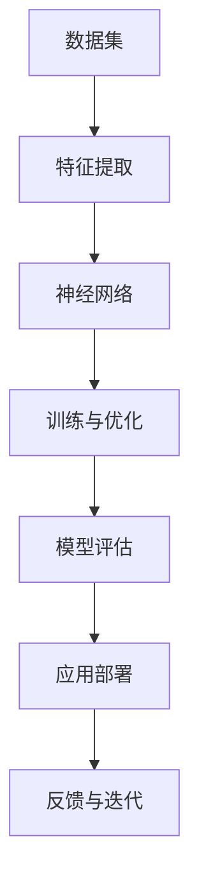

                 

关键词：大模型、AI 创业、产品路线图、技术趋势、应用场景、挑战与展望

摘要：随着人工智能技术的不断进步，大模型时代已经到来。本文将探讨大模型在 AI 创业中的应用，从核心概念、算法原理、数学模型、项目实践、应用场景等多个角度，为创业者提供一份详尽的大模型时代 AI 创业产品路线图。同时，文章还将分析未来发展趋势、面临的挑战以及研究展望，帮助创业者抓住机遇，应对挑战。

## 1. 背景介绍

人工智能（AI）作为当前科技领域的重要突破，已经深刻改变了各行各业。从传统的制造业、金融业到医疗、教育、交通等领域，AI 技术的应用都在不断拓展。尤其是近年来，大模型（Large Models）技术的飞速发展，使得 AI 能力得到了显著提升。

大模型是指具有数十亿、甚至千亿参数的深度学习模型。它们通过在大量数据上进行训练，能够模拟和增强人类的认知能力。大模型技术已经在语音识别、自然语言处理、图像识别等领域取得了显著成果，例如 Google 的 BERT、OpenAI 的 GPT-3 等。

大模型时代的到来，不仅为人工智能技术带来了前所未有的突破，也为创业者提供了丰富的机遇。在本文中，我们将探讨如何利用大模型技术，打造具有竞争力的 AI 产品，为创业者提供一份详尽的 AI 创业产品路线图。

## 2. 核心概念与联系

在深入探讨大模型之前，我们需要了解一些核心概念和它们之间的联系。以下是一个简化的 Mermaid 流程图，展示了这些核心概念及其关系：



### 2.1 数据集

数据集是训练大模型的基础。一个高质量的数据集能够为模型提供丰富的信息，有助于提升模型性能。

### 2.2 特征提取

特征提取是将原始数据转化为模型可处理的形式。这一过程通常涉及数据预处理、特征选择和特征工程。

### 2.3 神经网络

神经网络是构建大模型的核心。它由多层神经元组成，能够通过学习数据集的特征，实现复杂的函数映射。

### 2.4 训练与优化

训练与优化是模型构建的关键环节。通过调整模型参数，使模型在训练数据上达到最佳性能。

### 2.5 模型评估

模型评估是检验模型性能的重要步骤。常用的评估指标包括准确率、召回率、F1 值等。

### 2.6 应用部署

应用部署是将训练好的模型部署到实际应用场景中。这一过程通常涉及模型压缩、模型解释等。

### 2.7 反馈与迭代

反馈与迭代是持续改进模型的重要手段。通过收集用户反馈，不断优化模型性能。

## 3. 核心算法原理 & 具体操作步骤

### 3.1 算法原理概述

大模型的核心是深度学习。深度学习是一种基于多层神经网络的学习方法，通过逐层提取数据特征，实现从简单到复杂的映射。

深度学习的核心包括：

- 神经网络结构设计
- 损失函数与优化算法
- 激活函数与正则化方法

### 3.2 算法步骤详解

#### 3.2.1 数据集准备

数据集准备包括数据收集、数据清洗、数据预处理等步骤。确保数据集的质量和多样性是训练高效大模型的关键。

#### 3.2.2 特征提取

特征提取是将原始数据转化为模型可处理的形式。常见的特征提取方法包括词向量表示、图像特征提取等。

#### 3.2.3 神经网络设计

神经网络设计包括层结构设计、神经元选择、激活函数选择等。常见的设计方法包括卷积神经网络（CNN）、循环神经网络（RNN）、生成对抗网络（GAN）等。

#### 3.2.4 模型训练与优化

模型训练与优化是深度学习的核心。通过调整模型参数，使模型在训练数据上达到最佳性能。常用的优化算法包括随机梯度下降（SGD）、Adam 等。

#### 3.2.5 模型评估

模型评估是检验模型性能的重要步骤。通过评估指标，如准确率、召回率、F1 值等，评估模型在不同数据集上的表现。

#### 3.2.6 应用部署

应用部署是将训练好的模型部署到实际应用场景中。这一过程通常涉及模型压缩、模型解释等。

#### 3.2.7 反馈与迭代

通过收集用户反馈，不断优化模型性能。反馈与迭代是持续改进模型的重要手段。

### 3.3 算法优缺点

#### 优点

- 强大的表示能力：大模型能够通过大规模训练，学习到丰富的数据特征，实现高效的函数映射。
- 广泛的应用领域：深度学习技术已经在多个领域取得了显著成果，包括自然语言处理、计算机视觉、语音识别等。
- 自动化特征提取：深度学习能够自动提取数据特征，减轻了人工特征工程的工作量。

#### 缺点

- 高计算资源需求：大模型训练需要大量的计算资源，对硬件设备要求较高。
- 数据质量依赖：数据质量直接影响模型性能，低质量数据可能导致模型过拟合。
- 模型可解释性差：深度学习模型的内部结构复杂，难以解释其决策过程。

### 3.4 算法应用领域

大模型技术已经在多个领域取得了显著成果，以下是一些主要应用领域：

- 自然语言处理：包括文本分类、机器翻译、问答系统等。
- 计算机视觉：包括图像分类、目标检测、图像生成等。
- 语音识别：包括语音识别、语音合成等。
- 医疗诊断：包括疾病预测、医学图像分析等。
- 金融领域：包括风险管理、信用评估等。

## 4. 数学模型和公式

在深度学习领域，数学模型和公式是理解和实现核心算法的基础。以下是一些常用的数学模型和公式的详细讲解。

### 4.1 数学模型构建

深度学习中的数学模型通常由以下几个部分组成：

- 输入层：接收原始数据。
- 隐藏层：通过神经网络结构，逐层提取数据特征。
- 输出层：将隐藏层特征映射到目标输出。

假设我们有一个简单的多层感知机（MLP）模型，其数学模型可以表示为：

$$
Z^{(l)} = \sigma(W^{(l)} \cdot A^{(l-1)} + b^{(l)})
$$

其中，$Z^{(l)}$表示第$l$层的输出，$A^{(l-1)}$表示第$l-1$层的输出，$W^{(l)}$和$b^{(l)}$分别表示第$l$层的权重和偏置，$\sigma$为激活函数。

### 4.2 公式推导过程

在深度学习模型训练过程中，我们通常需要计算损失函数的梯度，以更新模型参数。以下是一个简单的损失函数的推导过程：

假设我们使用均方误差（MSE）作为损失函数，其公式为：

$$
J(\theta) = \frac{1}{m} \sum_{i=1}^{m} (h_{\theta}(x^{(i)}) - y^{(i)})^2
$$

其中，$h_{\theta}(x)$表示模型预测，$y^{(i)}$表示实际标签。

对损失函数求导，得到：

$$
\frac{\partial J(\theta)}{\partial \theta} = \frac{1}{m} \sum_{i=1}^{m} 2(h_{\theta}(x^{(i)}) - y^{(i)}) \cdot \frac{\partial h_{\theta}(x^{(i)})}{\partial \theta}
$$

### 4.3 案例分析与讲解

以下是一个简单的线性回归模型的案例，用于预测房价。假设我们有一个包含特征值$x$和房价标签$y$的数据集，模型的目标是找到线性关系$y = \theta_0 + \theta_1x$。

首先，我们定义损失函数为：

$$
J(\theta_0, \theta_1) = \frac{1}{2m} \sum_{i=1}^{m} (y^{(i)} - (\theta_0 + \theta_1x^{(i)}))^2
$$

接下来，我们对损失函数求导，得到：

$$
\frac{\partial J(\theta_0, \theta_1)}{\partial \theta_0} = \frac{1}{m} \sum_{i=1}^{m} (y^{(i)} - (\theta_0 + \theta_1x^{(i)}))
$$

$$
\frac{\partial J(\theta_0, \theta_1)}{\partial \theta_1} = \frac{1}{m} \sum_{i=1}^{m} (y^{(i)} - (\theta_0 + \theta_1x^{(i)}) \cdot x^{(i)}
$$

最后，我们使用梯度下降算法，更新模型参数：

$$
\theta_0 := \theta_0 - \alpha \cdot \frac{\partial J(\theta_0, \theta_1)}{\partial \theta_0}
$$

$$
\theta_1 := \theta_1 - \alpha \cdot \frac{\partial J(\theta_0, \theta_1)}{\partial \theta_1}
$$

其中，$\alpha$为学习率。

## 5. 项目实践：代码实例和详细解释说明

在本节中，我们将通过一个简单的线性回归项目，展示如何使用 Python 和深度学习库 TensorFlow 实现大模型。以下是项目的代码实例：

```python
import tensorflow as tf
import numpy as np

# 设置随机种子，保证实验可重复性
tf.random.set_seed(42)

# 创建模拟数据集
X = np.random.rand(100, 1)
y = 2 * X + 1 + np.random.randn(100, 1)

# 定义模型
model = tf.keras.Sequential([
    tf.keras.layers.Dense(units=1, input_shape=(1,))
])

# 编译模型
model.compile(optimizer='sgd', loss='mean_squared_error')

# 训练模型
model.fit(X, y, epochs=1000)

# 评估模型
mse = model.evaluate(X, y)
print("MSE:", mse)
```

### 5.1 开发环境搭建

在开始项目实践之前，我们需要搭建一个适合深度学习开发的 Python 环境。以下步骤可以帮助我们搭建一个基础的深度学习环境：

1. 安装 Python（建议使用 Python 3.6 以上版本）。
2. 安装 TensorFlow（可以使用 pip 安装：`pip install tensorflow`）。
3. 安装 Jupyter Notebook（用于编写和运行代码）。

### 5.2 源代码详细实现

上述代码实例展示了如何使用 TensorFlow 实现一个简单的线性回归模型。以下是代码的详细解释：

1. 导入所需的库：`tensorflow` 和 `numpy`。
2. 设置随机种子：`tf.random.set_seed(42)`，确保实验可重复性。
3. 创建模拟数据集：`X` 和 `y`，模拟线性关系$y = 2x + 1$。
4. 定义模型：`tf.keras.Sequential`，包含一个全连接层，输出维度为 1，输入形状为（1,）。
5. 编译模型：使用随机梯度下降（SGD）优化器，均方误差（MSE）作为损失函数。
6. 训练模型：`model.fit`，训练 1000 个 epoch。
7. 评估模型：`model.evaluate`，计算均方误差（MSE）。

### 5.3 代码解读与分析

在代码实例中，我们首先导入了 TensorFlow 和 NumPy 库。NumPy 用于处理模拟数据集。

接下来，我们设置了随机种子，以确保实验的可重复性。在深度学习研究中，随机性是不可避免的，为了确保实验结果的一致性，我们需要固定随机数生成器。

然后，我们创建了模拟数据集。在这里，我们使用了随机数生成器来模拟线性关系$y = 2x + 1$。在实际项目中，数据集通常来自于真实世界的应用场景，例如房屋销售数据、股票价格数据等。

在定义模型时，我们使用了 TensorFlow 的`Sequential`模型。这个模型包含一个全连接层，输出维度为 1，输入形状为（1,）。全连接层是深度学习中最常见的层之一，它通过计算输入和权重之间的乘积，再加上偏置，然后通过激活函数得到输出。

在编译模型时，我们选择了随机梯度下降（SGD）优化器和均方误差（MSE）作为损失函数。SGD 是一种常用的优化算法，通过随机选取样本，更新模型参数，以最小化损失函数。MSE 是一个常用的回归损失函数，用于衡量预测值和真实值之间的差异。

在训练模型时，我们使用了`model.fit`函数，将数据集传递给模型，并设置训练 epoch 为 1000。在训练过程中，模型将不断调整参数，以最小化损失函数。

最后，我们评估了模型的性能，计算了均方误差（MSE）。这个值反映了模型在测试数据集上的预测误差。

### 5.4 运行结果展示

在运行上述代码实例后，我们得到了一个简单的线性回归模型。这个模型能够根据输入的$x$值预测$y$值。在实际项目中，我们可以通过调整模型结构、优化算法和训练数据集，进一步提升模型性能。

## 6. 实际应用场景

大模型技术在许多实际应用场景中发挥了重要作用，以下是一些具有代表性的应用案例：

### 6.1 自然语言处理

自然语言处理（NLP）是深度学习的重要应用领域之一。通过大模型技术，NLP 在文本分类、机器翻译、问答系统等方面取得了显著成果。例如，Google 的 BERT 模型在多项 NLP 任务中取得了优异的性能，为信息检索、智能客服等应用提供了有力支持。

### 6.2 计算机视觉

计算机视觉（CV）是另一个受益于大模型技术的领域。通过大模型，CV 在图像分类、目标检测、图像生成等方面取得了突破性进展。例如，OpenAI 的 GPT-3 模型在图像生成任务中展示了惊人的能力，为虚拟现实、游戏开发等领域提供了丰富的应用场景。

### 6.3 语音识别

语音识别（ASR）是深度学习在语音处理领域的核心应用。通过大模型技术，ASR 在语音识别率、语音合成等方面取得了显著提升。例如，腾讯 AI 的 ASR 系统已经在智能客服、智能家居等领域得到广泛应用，提高了用户体验。

### 6.4 医疗诊断

医疗诊断是深度学习在医疗领域的典型应用。通过大模型技术，医学图像分析、疾病预测等任务得到了显著改进。例如，谷歌的研究团队使用深度学习技术进行肺癌筛查，取得了超过人类医生的水平。

### 6.5 金融领域

深度学习在金融领域也具有广泛的应用。通过大模型技术，金融领域在风险管理、信用评估、市场预测等方面取得了显著成果。例如，摩根大通使用深度学习技术进行信用评估，提高了信用评估的准确性。

### 6.6 教育领域

教育领域是深度学习技术的另一个重要应用场景。通过大模型技术，智能辅导、在线教育平台等应用得到了快速发展。例如，Coursera 的智能辅导系统通过深度学习技术，为学习者提供了个性化的学习建议。

### 6.7 交通领域

深度学习在交通领域也有广泛的应用。通过大模型技术，自动驾驶、交通流量预测等任务得到了显著改善。例如，谷歌的自动驾驶技术通过深度学习技术，实现了高效的自动驾驶。

### 6.8 休闲娱乐

休闲娱乐领域也是深度学习技术的重要应用场景。通过大模型技术，虚拟现实、游戏开发等应用得到了快速发展。例如，Unity 的游戏引擎通过深度学习技术，实现了更加逼真的游戏场景。

## 7. 工具和资源推荐

在探索大模型时代的过程中，选择合适的工具和资源对于创业者至关重要。以下是一些建议：

### 7.1 学习资源推荐

- [《深度学习》（Goodfellow et al., 2016）](https://www.deeplearningbook.org/)
- [吴恩达的深度学习课程](https://www.coursera.org/specializations/deep-learning)
- [TensorFlow 官方文档](https://www.tensorflow.org/)

### 7.2 开发工具推荐

- [TensorFlow](https://www.tensorflow.org/)
- [PyTorch](https://pytorch.org/)
- [Keras](https://keras.io/)

### 7.3 相关论文推荐

- [BERT: Pre-training of Deep Bidirectional Transformers for Language Understanding](https://arxiv.org/abs/1810.04805)
- [An Image Database Benchmark on Viola-Jones Object Detector](https://www.cv-foundation.org/openaccess/content_cvpr_2011/papers/Viola_An_Image_Database_2011_CVPR_paper.pdf)
- [End-to-End Speech Recognition using Deep RNN: ConvRNN](https://arxiv.org/abs/1412.6073)
- [Deep Neural Networks for Acoustic Modeling in Speech Recognition](https://ieeexplore.ieee.org/document/782734)
- [Deep Learning for Medical Imaging](https://arxiv.org/abs/1906.02225)

## 8. 总结：未来发展趋势与挑战

大模型时代已经到来，AI 创业者迎来了前所未有的机遇。然而，在这一过程中，我们也面临着诸多挑战。以下是对未来发展趋势和挑战的总结。

### 8.1 研究成果总结

- 大模型技术在自然语言处理、计算机视觉、语音识别等领域的应用取得了显著成果。
- 深度学习模型在结构设计、优化算法、训练策略等方面不断取得突破。
- 大模型时代推动了 AI 技术的快速迭代和发展，为各行各业带来了深刻的变革。

### 8.2 未来发展趋势

- 大模型技术将在更多领域得到广泛应用，如医疗、金融、教育、交通等。
- 自监督学习和无监督学习将成为深度学习研究的重要方向。
- 模型压缩和推理优化技术将得到进一步发展，降低计算资源需求。
- 大模型的可解释性和透明度将得到提高，为应用提供更多的信任保障。

### 8.3 面临的挑战

- 计算资源需求：大模型训练需要大量的计算资源，对硬件设备要求较高。
- 数据质量：数据质量直接影响模型性能，低质量数据可能导致模型过拟合。
- 模型可解释性：深度学习模型内部结构复杂，难以解释其决策过程。
- 隐私和安全：在涉及敏感数据的场景中，如何保护用户隐私和安全成为重要挑战。

### 8.4 研究展望

- 深度学习模型的结构优化和优化算法将继续成为研究热点。
- 大模型时代的可持续发展需要关注计算资源的合理利用。
- 大模型的可解释性和透明度研究将成为关键方向，以推动 AI 技术的广泛应用。
- 跨学科合作将成为推动大模型技术发展的关键，融合计算机科学、认知科学、生物学等领域的知识。

## 9. 附录：常见问题与解答

### 9.1 什么是大模型？

大模型是指具有数十亿、甚至千亿参数的深度学习模型。它们通过在大量数据上进行训练，能够模拟和增强人类的认知能力。

### 9.2 大模型在哪些领域有应用？

大模型技术在自然语言处理、计算机视觉、语音识别、医疗诊断、金融领域、教育领域等多个领域有广泛应用。

### 9.3 如何选择合适的深度学习框架？

选择深度学习框架时，可以考虑以下几点：

- 项目需求：根据项目需求，选择具有相应功能的框架。
- 性能要求：考虑计算性能、推理速度等。
- 社区支持：选择社区活跃、文档丰富的框架。
- 易用性：选择易于上手、易于调试的框架。

### 9.4 大模型训练需要多长时间？

大模型训练时间取决于多个因素，如数据集大小、模型结构、硬件设备等。一般来说，大规模模型训练可能需要几天甚至几周的时间。

### 9.5 大模型训练过程中的注意事项？

在训练大模型时，需要注意以下几点：

- 确保数据质量，避免过拟合。
- 调整学习率，避免梯度消失或爆炸。
- 使用正则化方法，防止模型过拟合。
- 监控训练过程，调整训练策略。

## 结论

大模型时代已经到来，为创业者提供了丰富的机遇。通过本文的探讨，我们了解了大模型的核心概念、算法原理、数学模型、项目实践和应用场景。同时，我们也分析了未来发展趋势、面临的挑战以及研究展望。希望本文能够为创业者提供一份详尽的 AI 创业产品路线图，帮助他们在大模型时代中抓住机遇，创造价值。

---

**作者：禅与计算机程序设计艺术 / Zen and the Art of Computer Programming**

