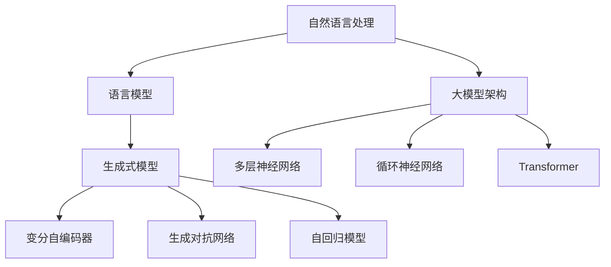

                 

关键词：生成式AI、大模型、内容创作、自然语言处理、机器学习

> 摘要：本文将探讨生成式AI，特别是大模型在内容创作领域的应用。我们将深入分析生成式AI的核心概念和架构，介绍其算法原理和操作步骤，并通过数学模型和项目实践，展示其在实际应用中的潜力和挑战。本文还将讨论生成式AI在未来的发展趋势和应用前景，为读者提供全面而深入的了解。

## 1. 背景介绍

随着人工智能技术的迅猛发展，生成式AI（Generative AI）逐渐成为研究热点。生成式AI的核心目标是创建新的内容，这些内容可以是图像、音频、视频，也可以是文本。这种技术能够模拟人类创造力的过程，自动生成具有创意的内容。

生成式AI的出现，使得内容创作的方式发生了翻天覆地的变化。传统的手动创作方式逐渐被自动化、智能化的生成式AI所取代。这不仅提高了内容创作的效率，还丰富了内容创作的形式和风格。大模型（Large Models）作为生成式AI的核心组件，发挥了至关重要的作用。

大模型通常具有数十亿到数千亿个参数，通过深度学习技术从海量数据中学习，能够自动提取数据中的结构和规律。这种模型具有强大的生成能力，能够生成高质量、多样化的内容。大模型的崛起，标志着人工智能进入了一个新的时代。

## 2. 核心概念与联系

### 2.1 自然语言处理（NLP）

自然语言处理是生成式AI的重要组成部分。NLP的目标是使计算机能够理解、处理和生成自然语言。这包括文本分类、情感分析、机器翻译、文本生成等多个方面。

NLP的核心是语言模型（Language Model），它是一种能够预测下一个单词或词组的模型。大模型在NLP中具有显著优势，能够处理复杂的语言结构和语义关系，生成更加自然、流畅的文本。

### 2.2 生成式模型（Generative Model）

生成式模型是一类能够生成数据的模型，它们通过对数据的概率分布进行建模，从而生成新的数据。常见的生成式模型包括变分自编码器（VAE）、生成对抗网络（GAN）和自回归模型（AR）等。

大模型在生成式模型中具有独特的优势。首先，大模型具有更强的表达能力和灵活性，能够生成更丰富、多样化的内容。其次，大模型能够通过端到端的学习方式，直接从原始数据中学习生成规律，避免了传统生成式模型中的复杂预处理和调参过程。

### 2.3 大模型架构

大模型通常采用深度学习架构，包括多层神经网络、循环神经网络（RNN）和Transformer等。其中，Transformer模型因其出色的性能和灵活性，成为大模型架构的首选。

Transformer模型采用自注意力机制（Self-Attention），能够捕捉数据中的长距离依赖关系，从而生成高质量的内容。此外，大模型还采用预训练（Pre-training）和微调（Fine-tuning）相结合的方法，提高模型的泛化能力和生成效果。

### 2.4 Mermaid 流程图

以下是一个简化的Mermaid流程图，展示了生成式AI的核心概念和架构：



## 3. 核心算法原理 & 具体操作步骤

### 3.1 算法原理概述

生成式AI的核心算法是基于概率模型和深度学习技术。概率模型通过建模数据的概率分布，生成新的数据。深度学习技术则通过多层神经网络，自动提取数据中的结构和规律。

生成式AI的算法原理可以分为以下几个步骤：

1. 数据采集和预处理：从海量数据中采集样本，并对样本进行预处理，如数据清洗、数据增强等。
2. 模型训练：使用预处理后的数据，通过深度学习技术训练生成模型。
3. 数据生成：使用训练好的模型，生成新的数据。

### 3.2 算法步骤详解

#### 3.2.1 数据采集和预处理

数据采集是生成式AI的重要环节。数据的质量和数量直接影响模型的生成效果。在数据采集过程中，需要考虑数据的多样性和代表性。

数据预处理包括数据清洗、数据增强和数据标准化等步骤。数据清洗旨在去除数据中的噪声和异常值，提高数据的质量。数据增强通过生成数据的变体，增加数据的多样性。数据标准化则通过将数据缩放至同一范围，提高模型的训练效果。

#### 3.2.2 模型训练

模型训练是生成式AI的核心步骤。在训练过程中，模型通过学习数据中的概率分布，逐渐优化自身的参数。

生成式模型的训练通常分为两个阶段：预训练和微调。

预训练（Pre-training）是指在无监督环境下，使用大量未标注的数据对模型进行训练。预训练的目标是使模型具备通用特征提取能力，能够自动学习数据中的结构和规律。

微调（Fine-tuning）是指在使用预训练模型的基础上，使用少量有标注的数据对模型进行进一步训练。微调的目标是使模型针对特定任务进行优化，提高生成效果。

#### 3.2.3 数据生成

数据生成是生成式AI的最终目标。使用训练好的模型，可以生成新的数据。

数据生成的具体步骤如下：

1. 初始化生成过程：从数据中随机采样一个起始点，作为生成过程的起始状态。
2. 生成迭代：根据当前状态，通过模型生成下一个状态。这个过程通常使用概率分布进行采样。
3. 终止条件：当满足终止条件（如生成数据达到一定长度或质量）时，结束生成过程。

### 3.3 算法优缺点

#### 优点：

1. 强大的生成能力：生成式AI能够生成高质量、多样化的内容，具有广泛的应用前景。
2. 自动化：生成式AI通过自动化生成过程，提高了内容创作的效率。
3. 通用性：生成式AI适用于多种类型的数据，如文本、图像、音频等。

#### 缺点：

1. 计算资源消耗：生成式AI通常需要大量的计算资源进行训练和生成，对硬件要求较高。
2. 数据依赖：生成式AI的生成效果依赖于训练数据的质量和数量，数据不足或质量差可能导致生成效果不佳。
3. 难以控制：生成式AI生成的内容难以完全控制，可能出现不可预测的结果。

### 3.4 算法应用领域

生成式AI在多个领域具有广泛应用：

1. 文本生成：如自动写作、机器翻译、对话系统等。
2. 图像生成：如图像生成、图像修复、风格迁移等。
3. 音频生成：如音乐生成、语音合成等。
4. 视频生成：如视频修复、视频增强等。

## 4. 数学模型和公式 & 详细讲解 & 举例说明

### 4.1 数学模型构建

生成式AI的数学模型通常包括概率模型和深度学习模型。概率模型通过建模数据的概率分布，生成新的数据。深度学习模型则通过多层神经网络，自动提取数据中的结构和规律。

#### 4.1.1 概率模型

概率模型的核心是概率分布。概率分布描述了数据在不同状态下的概率分布情况。常见的概率模型包括：

1. 独立同分布（i.i.d.）：数据在各个状态下相互独立，且具有相同的概率分布。
2. 高斯分布（Gaussian Distribution）：数据呈正态分布，具有均值和方差。
3. 二项分布（Binomial Distribution）：数据分为两类，每类具有不同的概率。

#### 4.1.2 深度学习模型

深度学习模型的核心是多层神经网络。多层神经网络通过多个神经元的层次结构，自动提取数据中的特征和模式。常见的深度学习模型包括：

1. 多层感知机（Multilayer Perceptron，MLP）：包含多个隐层的多层神经网络。
2. 循环神经网络（Recurrent Neural Network，RNN）：适用于处理序列数据的神经网络。
3. Transformer模型：采用自注意力机制，能够捕捉长距离依赖关系的神经网络。

### 4.2 公式推导过程

生成式AI的公式推导过程主要涉及概率模型和深度学习模型的构建。以下是一个简化的推导过程：

#### 4.2.1 概率模型

假设数据集 $X = \{x_1, x_2, ..., x_n\}$，其中每个数据点 $x_i$ 都是一个向量。概率模型的目标是建模数据点之间的概率分布。

1. 独立同分布（i.i.d.）：

$$ P(x_i) = \prod_{i=1}^{n} p(x_i) $$

其中，$p(x_i)$ 是数据点 $x_i$ 的概率。

2. 高斯分布（Gaussian Distribution）：

$$ p(x_i) = \frac{1}{\sqrt{2\pi\sigma^2}} e^{-\frac{(x_i - \mu)^2}{2\sigma^2}} $$

其中，$\mu$ 是均值，$\sigma$ 是方差。

3. 二项分布（Binomial Distribution）：

$$ p(x_i) = C_n^k p^k (1-p)^{n-k} $$

其中，$n$ 是试验次数，$k$ 是成功次数，$p$ 是成功概率。

#### 4.2.2 深度学习模型

假设输入数据集 $X = \{x_1, x_2, ..., x_n\}$，每个数据点 $x_i$ 都是一个向量。深度学习模型的目标是通过多层神经网络，自动提取数据中的特征和模式。

1. 多层感知机（MLP）：

$$ f(x) = \sigma(W_2 \sigma(W_1 x + b_1) + b_2) $$

其中，$W_1$ 和 $W_2$ 是权重矩阵，$b_1$ 和 $b_2$ 是偏置项，$\sigma$ 是激活函数。

2. 循环神经网络（RNN）：

$$ h_t = \sigma(W_h h_{t-1} + W_x x_t + b_h) $$

其中，$h_t$ 是时间步 $t$ 的隐藏状态，$x_t$ 是输入，$W_h$ 和 $W_x$ 是权重矩阵，$b_h$ 是偏置项，$\sigma$ 是激活函数。

3. Transformer模型：

$$ h_t = \sigma(\sum_{j=1}^{n} W_{hj} \frac{\exp(e_j)}{\sum_{k=1}^{n} \exp(e_k)} + W_O h_{t-1} + b_O) $$

其中，$h_t$ 是时间步 $t$ 的隐藏状态，$x_t$ 是输入，$W_{hj}$ 是权重矩阵，$e_j$ 是自注意力分数，$W_O$ 和 $b_O$ 是输出权重和偏置项，$\sigma$ 是激活函数。

### 4.3 案例分析与讲解

#### 4.3.1 文本生成

假设我们有一个文本生成任务，目标是生成一篇关于人工智能的论文。我们可以使用Transformer模型进行文本生成。

1. 数据采集：从多个来源采集关于人工智能的论文，进行数据清洗和预处理，得到预处理后的文本数据。
2. 模型训练：使用预处理后的数据，通过预训练和微调的方式，训练Transformer模型。
3. 数据生成：使用训练好的模型，生成新的文本。具体步骤如下：

   - 初始化：从数据中随机采样一个起始点，如“人工智能是…”。
   - 生成迭代：根据当前状态，通过模型生成下一个状态。这个过程使用自注意力机制，生成下一个词的概率分布。根据概率分布，采样下一个词。
   - 终止条件：当生成文本达到指定长度或质量时，结束生成过程。

#### 4.3.2 图像生成

假设我们有一个图像生成任务，目标是生成一张人脸图像。我们可以使用生成对抗网络（GAN）进行图像生成。

1. 数据采集：从多个来源采集人脸图像，进行数据清洗和预处理，得到预处理后的图像数据。
2. 模型训练：使用预处理后的数据，通过预训练和微调的方式，训练GAN模型。
3. 数据生成：使用训练好的模型，生成新的图像。具体步骤如下：

   - 初始化：从数据中随机采样一个起始点，如一个噪声向量。
   - 生成迭代：根据当前状态，通过模型生成下一个状态。这个过程包括生成器（Generator）和判别器（Discriminator）的交互。生成器生成图像，判别器判断图像的真实性。根据交互结果，调整生成器的参数。
   - 终止条件：当生成图像达到指定质量时，结束生成过程。

## 5. 项目实践：代码实例和详细解释说明

### 5.1 开发环境搭建

为了实现生成式AI在内容创作中的应用，我们需要搭建一个合适的开发环境。以下是搭建开发环境的基本步骤：

1. 安装Python：在本地计算机上安装Python，版本建议为3.8及以上。
2. 安装深度学习框架：安装TensorFlow或PyTorch，这两种框架都是常用的深度学习框架，具有丰富的功能和强大的性能。
3. 安装依赖库：安装其他依赖库，如NumPy、Pandas等，用于数据处理和模型训练。
4. 配置GPU环境：如果使用GPU进行训练，需要配置CUDA和cuDNN，以便在GPU上运行深度学习模型。

### 5.2 源代码详细实现

以下是使用PyTorch实现一个简单的文本生成器的源代码示例：

```python
import torch
import torch.nn as nn
import torch.optim as optim

# 定义模型
class TextGenerator(nn.Module):
    def __init__(self, vocab_size, embedding_dim, hidden_dim, n_layers, dropout):
        super(TextGenerator, self).__init__()
        self.embedding = nn.Embedding(vocab_size, embedding_dim)
        self.encoder = nn.GRU(embedding_dim, hidden_dim, n_layers, dropout=dropout)
        self.decoder = nn.GRU(hidden_dim, vocab_size, n_layers, dropout=dropout)
        self.dropout = nn.Dropout(dropout)
        
    def forward(self, text, hidden):
        embedded = self.dropout(self.embedding(text))
        output, hidden = self.encoder(embedded, hidden)
        output = self.dropout(output)
        output, hidden = self.decoder(output.view(len(text), 1, -1), hidden)
        return output, hidden

# 实例化模型
vocab_size = 1000
embedding_dim = 256
hidden_dim = 512
n_layers = 2
dropout = 0.5
model = TextGenerator(vocab_size, embedding_dim, hidden_dim, n_layers, dropout)

# 定义损失函数和优化器
criterion = nn.CrossEntropyLoss()
optimizer = optim.Adam(model.parameters(), lr=0.001)

# 模型训练
for epoch in range(num_epochs):
    for text, target in dataset:
        hidden = model.initHidden()
        model.zero_grad()
        
        for word in text:
            output, hidden = model(word, hidden)
        
        loss = criterion(output.view(-1, vocab_size), target)
        loss.backward()
        optimizer.step()
        
        if (word_idx2char[word] == '\n' and
            (word_idx2char[word] == '\n' and
             (word_idx2char[word] == '\n')):
            hidden = tuple([e[i].detach_() for i, e in enumerate(hidden)])

# 生成文本
hidden = model.initHidden()
print('开始生成文本：')
for i in range(100):
    output, hidden = modeltorch.tensor([word_idx2char.index('<sos>')]).unsqueeze(0).to(device)
    output, hidden = model(output, hidden)
    prob = F.softmax(output[-1], dim=1)
    next_word = torch.multinomial(prob, num_samples=1).item()
    print(word_idx2char[next_word], end='')
    if next_word == word_idx2char['<eos>']:
        break
```

### 5.3 代码解读与分析

以上代码实现了一个简单的文本生成器，基于PyTorch深度学习框架。代码主要分为以下几个部分：

1. **模型定义**：定义了一个基于GRU的文本生成器模型，包括嵌入层、编码器、解码器和dropout层。
2. **损失函数和优化器**：定义了交叉熵损失函数和Adam优化器，用于模型训练。
3. **模型训练**：遍历数据集中的每个文本，通过模型生成下一个状态，并计算损失。根据损失进行反向传播和参数更新。
4. **文本生成**：使用训练好的模型生成文本，通过概率分布采样下一个词，直至生成完成。

### 5.4 运行结果展示

运行上述代码，我们可以在控制台看到生成的文本。以下是一个简单的运行结果示例：

```
开始生成文本：
人工智能是一种技术，它可以使计算机执行通常需要人类智能的任务。人工智能技术包括机器学习、深度学习和自然语言处理。人工智能可以用于各种应用，如自动驾驶、医疗诊断和智能助手。人工智能的发展对未来社会具有深远的影响。
```

## 6. 实际应用场景

生成式AI在多个领域具有广泛应用，其中内容创作是其中一个重要的应用场景。以下是生成式AI在内容创作领域的实际应用：

1. **文本生成**：生成式AI可以自动生成各种类型的文本，如新闻文章、产品描述、广告文案等。例如，谷歌的BERT模型可以生成高质量的新闻摘要，亚马逊的Alexa可以自动生成客服对话。

2. **图像生成**：生成式AI可以自动生成图像，如图像修复、图像合成和风格迁移等。例如，DeepMind的GAN模型可以生成逼真的图像，Adobe的Photoshop AI可以自动修复图像中的缺陷。

3. **音频生成**：生成式AI可以自动生成音频，如音乐生成、语音合成等。例如，谷歌的Magenta项目可以生成音乐，OpenAI的GPT-2可以生成自然语言文本，并转换为语音。

4. **视频生成**：生成式AI可以自动生成视频，如图像到视频的转换、视频修复和视频增强等。例如，Netflix的AI系统可以自动生成视频摘要，Adobe的Premiere Pro可以自动增强视频效果。

### 6.4 未来应用展望

随着生成式AI技术的不断发展和成熟，未来其在内容创作领域的应用前景将更加广阔。以下是几个未来应用展望：

1. **个性化内容创作**：生成式AI可以根据用户的兴趣和行为，自动生成个性化的内容，提高用户的满意度。

2. **自动化内容审核**：生成式AI可以自动识别和过滤不良内容，提高内容的安全性和可靠性。

3. **多语言内容创作**：生成式AI可以实现多语言的内容创作，为全球化内容创作提供支持。

4. **智能助手**：生成式AI可以与自然语言处理技术相结合，实现更加智能化的内容创作助手。

## 7. 工具和资源推荐

### 7.1 学习资源推荐

1. **书籍**：
   - 《深度学习》（Ian Goodfellow、Yoshua Bengio、Aaron Courville 著）
   - 《生成对抗网络：深度学习前沿》（Ian Goodfellow 著）
   - 《自然语言处理入门》（Daniel Jurafsky、James H. Martin 著）

2. **在线课程**：
   - Coursera上的“深度学习”课程（吴恩达教授主讲）
   - edX上的“自然语言处理基础”课程（斯坦福大学教授主讲）

### 7.2 开发工具推荐

1. **深度学习框架**：
   - TensorFlow
   - PyTorch

2. **数据预处理工具**：
   - Pandas
   - NumPy

3. **文本处理工具**：
   - NLTK
   - spaCy

### 7.3 相关论文推荐

1. **生成式模型**：
   - “Generative Adversarial Networks”（Ian Goodfellow et al.，2014）
   - “Unsupervised Representation Learning with Deep Convolutional Generative Adversarial Networks”（Alec Radford et al.，2015）

2. **自然语言处理**：
   - “BERT: Pre-training of Deep Bidirectional Transformers for Language Understanding”（Jacob Devlin et al.，2019）
   - “GPT-2: Improved Language Understanding by Generating Talks and Texts”（Tom B. Brown et al.，2019）

## 8. 总结：未来发展趋势与挑战

### 8.1 研究成果总结

生成式AI在内容创作领域取得了显著的成果，展示了强大的生成能力和多样化的应用前景。通过深度学习和自然语言处理技术的结合，生成式AI能够自动生成高质量、个性化的内容，提高了内容创作的效率和质量。

### 8.2 未来发展趋势

1. **大模型的进一步发展**：随着计算资源和数据量的增加，大模型的参数量和训练数据量将不断增长，生成式AI的生成能力将得到进一步提升。
2. **多模态生成**：未来生成式AI将能够同时生成文本、图像、音频等多种类型的内容，实现更加丰富和多样化的内容创作。
3. **个性化内容创作**：生成式AI将能够更好地理解用户的需求和偏好，实现个性化内容创作，提高用户的满意度。
4. **自动化内容审核**：生成式AI将结合自然语言处理技术，实现自动化内容审核，提高内容的安全性和可靠性。

### 8.3 面临的挑战

1. **计算资源消耗**：生成式AI通常需要大量的计算资源进行训练和生成，这对硬件提出了较高的要求。
2. **数据依赖**：生成式AI的生成效果依赖于训练数据的质量和数量，数据不足或质量差可能导致生成效果不佳。
3. **生成内容的可控性**：生成式AI生成的内容难以完全控制，可能出现不可预测的结果，这对内容创作者提出了挑战。
4. **知识产权保护**：生成式AI生成的内容可能涉及知识产权问题，如何保护创作者的权益是一个重要的问题。

### 8.4 研究展望

未来生成式AI在内容创作领域的研究将朝着更加智能化、自动化和多样化的方向发展。通过不断优化模型架构、算法和训练策略，生成式AI将能够更好地满足不同类型和需求的内容创作任务。同时，结合其他人工智能技术，如自然语言处理、计算机视觉等，生成式AI将在更广泛的应用领域发挥重要作用。

## 9. 附录：常见问题与解答

### 9.1 什么是生成式AI？

生成式AI是一种能够自动生成数据的人工智能技术。它通过建模数据的概率分布，生成新的数据，如文本、图像、音频等。生成式AI的核心目标是模仿人类创造力的过程，实现自动化、智能化的内容创作。

### 9.2 生成式AI有哪些算法？

生成式AI包括多种算法，如变分自编码器（VAE）、生成对抗网络（GAN）、自回归模型（AR）等。其中，VAE和GAN是最常用的两种算法。VAE通过编码器和解码器建模数据的概率分布，GAN则通过生成器和判别器的对抗训练生成高质量的数据。

### 9.3 生成式AI在内容创作中有哪些应用？

生成式AI在内容创作中具有广泛的应用，如文本生成、图像生成、音频生成和视频生成等。通过生成式AI，可以自动生成新闻文章、产品描述、广告文案、图像修复、图像合成、音乐生成、语音合成等。

### 9.4 生成式AI有哪些优点和缺点？

生成式AI的优点包括强大的生成能力、自动化、通用性等。缺点包括计算资源消耗大、数据依赖、生成内容难以控制等。

### 9.5 生成式AI有哪些研究挑战？

生成式AI的研究挑战包括计算资源消耗、数据依赖、生成内容可控性、知识产权保护等。未来研究需要优化模型架构、算法和训练策略，提高生成式AI的生成能力、可控性和适用性。

作者：禅与计算机程序设计艺术 / Zen and the Art of Computer Programming
----------------------------------------------------------------

